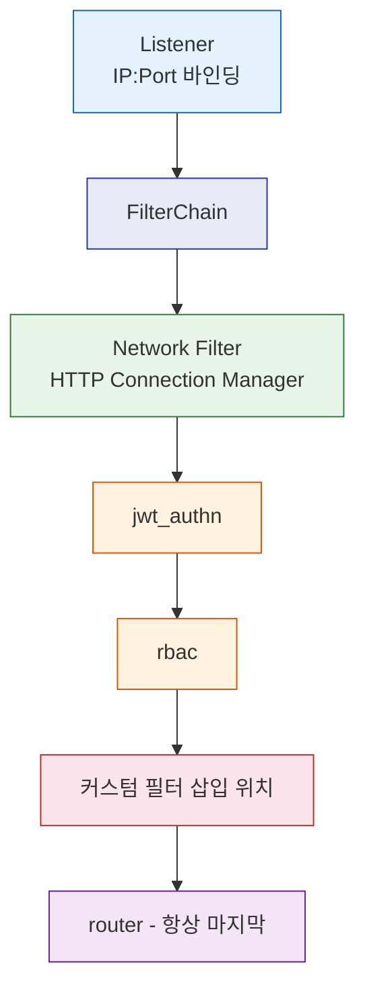

<!-- migrated: write/09_cloud/service-mesh/19-01.Istio EnvoyFilter.md (2026-04-19) -->

# Ch19. EnvoyFilter
---
> 📌 EnvoyFilter는 Istio가 공식 API로 노출하지 않은 Envoy 프록시 내부 동작을 직접 제어하는 탈출구다. 강력하지만 잘못 쓰면 메시 전체를 중단시킬 수 있어, 표준 API가 한계에 부딪혔을 때만 사용한다.

## 🎯 학습 목표

이 챕터를 마치면 다음을 할 수 있다:

- EnvoyFilter가 Istio API 체계에서 차지하는 위치를 설명한다.
- `configPatches`의 `applyTo`, `match`, `patch` 세 필드를 구성하고 적용한다.
- Lua 필터로 커스텀 응답 헤더를 삽입하고, 재시도 상태 코드를 확장한다.
- WasmPlugin CRD와 EnvoyFilter의 차이점을 파악해 적절한 도구를 선택한다.
- `config_dump`로 EnvoyFilter 적용 여부를 검증하고 충돌을 해결한다.

## 1. EnvoyFilter의 위치와 역할

### 1.1 Istio API의 한계와 EnvoyFilter의 필요성

Istio가 제공하는 공식 트래픽 API(VirtualService, DestinationRule, Gateway 등)는 일반적인 라우팅, 로드밸런싱, 서킷 브레이커 요구사항을 80% 이상 충족한다. 그러나 Envoy 프록시는 이보다 훨씬 풍부한 기능을 내장하고 있다. Istio API가 추상화한 계층 아래에는 재시도 가능 상태 코드 세밀 조정, 커스텀 Lua 스크립트 실행, 외부 인증 서버 연동, rate limit 서비스 호출 같은 기능이 존재한다.

EnvoyFilter는 Istio가 생성한 xDS(eXtensible Discovery Service) 설정에 외과적 패치를 적용하는 리소스다. Pilot이 Envoy에 전달하는 Listener, Cluster, Route, Filter 설정을 `configPatches` 배열로 직접 수정할 수 있다. 따라서 EnvoyFilter는 Istio API가 지원하지 않는 기능을 활성화하는 마지막 수단으로 간주한다.

### 1.2 Envoy 필터 체인 구조

Envoy는 요청을 처리할 때 여러 계층의 필터를 순서대로 통과시킨다. 이 구조를 이해해야 EnvoyFilter의 `applyTo` 필드를 올바르게 지정할 수 있다.

가장 바깥 계층은 Listener 필터다. TCP 연결이 수립된 직후 실행되며, TLS Inspector나 HTTP Inspector처럼 프로토콜을 감지하는 역할을 한다. Listener 아래에는 Filter Chain이 있고, 그 안에 Network Filter가 위치한다. HTTP 트래픽의 경우 Network Filter 중 가장 중요한 것이 HTTP Connection Manager(HCM)다.

HCM 안에는 다시 HTTP Filter 배열이 있다. 이 배열에는 Istio가 자동으로 삽입하는 필터들(stats, jwt_authn, rbac, router 등)이 이미 들어 있다. EnvoyFilter로 커스텀 Lua 스크립트나 ext_authz, rate_limit 필터를 이 배열에 삽입하는 것이 가장 흔한 패턴이다. 마지막에 위치하는 `router` 필터는 반드시 맨 끝에 있어야 하므로 커스텀 필터는 항상 `INSERT_BEFORE router` 패턴으로 삽입한다.



### 1.3 EnvoyFilter의 위험성과 사용 원칙

EnvoyFilter는 Envoy xDS API를 직접 조작하기 때문에 Istio 버전 업그레이드 시 호환성이 깨질 수 있다. Istio가 내부적으로 생성하는 필터 이름이나 설정 구조가 버전마다 달라질 수 있으며, 이 변경이 EnvoyFilter를 조용히 무력화하거나 파싱 오류를 일으킨다.

다음 원칙을 지켜야 한다. 첫째, 표준 Istio API(VirtualService, DestinationRule, Telemetry, PeerAuthentication 등)로 목적을 달성할 수 없을 때만 EnvoyFilter를 작성한다. 둘째, 적용 범위를 최소화한다. `workloadSelector`를 반드시 지정해 특정 Pod에만 적용하고, 메시 전체에 적용되는 EnvoyFilter는 피한다. 셋째, 스테이징 환경에서 충분히 검증한 후 프로덕션에 적용한다. 넷째, Istio 업그레이드 전에 config_dump를 비교해 EnvoyFilter가 여전히 유효한지 확인한다.

## 2. EnvoyFilter 리소스 구조

### 2.1 configPatches 구조

EnvoyFilter 스펙의 핵심은 `configPatches` 배열이다. 각 패치 항목은 `applyTo`, `match`, `patch` 세 필드로 구성된다.

```yaml
apiVersion: networking.istio.io/v1alpha3
kind: EnvoyFilter
metadata:
  name: custom-header-filter
  namespace: production
spec:
  workloadSelector:
    labels:
      app: order-service
  configPatches:
    - applyTo: HTTP_FILTER
      match:
        context: SIDECAR_INBOUND
        listener:
          filterChain:
            filter:
              name: envoy.filters.network.http_connection_manager
              subFilter:
                name: envoy.filters.http.router
      patch:
        operation: INSERT_BEFORE
        value:
          name: envoy.filters.http.lua
          typed_config:
            "@type": type.googleapis.com/envoy.extensions.filters.http.lua.v3.LuaPerRoute
            inline_code: |
              function envoy_on_response(response_handle)
                response_handle:headers():add("x-powered-by", "envoy-lua")
              end
```

`applyTo`는 패치를 적용할 xDS 객체 유형을 지정하고, `match`는 조건을 정의하며, `patch`는 실제 변경 내용을 담는다. 세 필드가 모두 맞아야 패치가 적용된다.

### 2.2 applyTo 대상

`applyTo` 값에 따라 패치되는 xDS 객체가 달라진다. 주요 값과 용도는 다음과 같다:

| applyTo 값 | 패치 대상 | 주요 용도 |
|---|---|---|
| `LISTENER` | Listener 전체 | Listener 레벨 설정 변경 |
| `FILTER_CHAIN` | 특정 FilterChain | TLS 설정, 버퍼 크기 조정 |
| `NETWORK_FILTER` | TCP proxy, HCM 등 | HCM 설정 변경 |
| `HTTP_FILTER` | HTTP 필터 배열 | 커스텀 필터 삽입/제거 |
| `CLUSTER` | Upstream Cluster | 연결 풀, 타임아웃 변경 |
| `ROUTE_CONFIGURATION` | 전체 Route 설정 | VirtualHost, Route 변경 |
| `VIRTUAL_HOST` | 특정 VirtualHost | 헤더, 타임아웃 오버라이드 |
| `HTTP_ROUTE` | 특정 Route | 재시도 정책, 헤더 추가 |

HTTP 필터 삽입이 가장 흔한 사용 사례이므로 `HTTP_FILTER`를 가장 자주 사용한다.

### 2.3 match 조건

`match.context`는 패치를 적용할 사이드카 방향을 결정한다. `SIDECAR_INBOUND`는 외부에서 해당 Pod로 들어오는 트래픽을 처리하는 Listener에 적용하고, `SIDECAR_OUTBOUND`는 해당 Pod에서 외부로 나가는 트래픽에 적용한다. `GATEWAY`는 Ingress Gateway 또는 Egress Gateway에만 적용한다. context를 지정하지 않으면 모든 방향에 적용되므로 의도하지 않은 부작용이 생길 수 있다.

`match.listener.portNumber`로 특정 포트의 Listener만 대상으로 삼을 수 있고, `match.cluster.name`으로 특정 Upstream Cluster를 지정할 수 있다. `match.routeConfiguration.vhost`로 가상 호스트 이름으로 범위를 좁히는 것도 가능하다.

### 2.4 patch operation

`patch.operation`은 기존 설정과의 병합 방식을 결정한다. 각 operation의 의미는 다음과 같다:

- `MERGE`: 기존 필드와 새 필드를 병합한다. 동일 키는 새 값으로 덮어쓴다.
- `ADD`: 배열에 새 항목을 추가한다. Cluster 배열에 새 Cluster를 삽입할 때 사용한다.
- `REMOVE`: 매칭된 객체를 삭제한다.
- `INSERT_BEFORE`: 매칭된 필터 앞에 새 필터를 삽입한다. HTTP 필터 삽입에 가장 많이 쓴다.
- `INSERT_AFTER`: 매칭된 필터 뒤에 삽입한다.
- `INSERT_FIRST`: 필터 배열의 맨 앞에 삽입한다. 인증 필터처럼 가장 먼저 실행돼야 할 때 사용한다.
- `REPLACE`: 매칭된 객체를 완전히 교체한다.

`INSERT_BEFORE`를 사용할 때 `subFilter.name`으로 `envoy.filters.http.router`를 지정하면 항상 router 앞에 삽입되어 안전하다.

## 3. 실전 사용 사례

### 3.1 커스텀 응답 헤더 추가 (Lua 필터)

서비스 응답에 디버그 헤더나 버전 정보를 추가해야 할 때 Lua 필터를 사용한다. Istio의 Headers API로도 헤더 추가가 가능하지만, 조건부 로직이나 동적 값 계산이 필요한 경우에는 Lua가 유일한 선택지다.

다음 예시는 인바운드 트래픽의 응답에 `x-served-by` 헤더를 삽입한다:

```yaml
apiVersion: networking.istio.io/v1alpha3
kind: EnvoyFilter
metadata:
  name: add-response-header
  namespace: production
spec:
  workloadSelector:
    labels:
      app: order-service
  configPatches:
    - applyTo: HTTP_FILTER
      match:
        context: SIDECAR_INBOUND
        listener:
          filterChain:
            filter:
              name: envoy.filters.network.http_connection_manager
              subFilter:
                name: envoy.filters.http.router
      patch:
        operation: INSERT_BEFORE
        value:
          name: envoy.filters.http.lua
          typed_config:
            "@type": type.googleapis.com/envoy.extensions.filters.http.lua.v3.LuaPerRoute
            inline_code: |
              function envoy_on_response(response_handle)
                local pod_name = os.getenv("HOSTNAME") or "unknown"
                response_handle:headers():add("x-served-by", pod_name)
              end
```

Lua 필터는 `envoy_on_request`(요청 단계)와 `envoy_on_response`(응답 단계) 두 함수를 지원한다. 인라인 코드를 직접 명시하거나 외부 파일을 ConfigMap으로 마운트해 참조할 수 있다. Lua는 LuaJIT으로 실행되어 퍼포먼스 오버헤드가 낮은 편이지만, 복잡한 비즈니스 로직을 넣으면 P99 지연이 올라갈 수 있다.

### 3.2 커스텀 재시도 상태 코드 설정

Istio의 VirtualService `retries` 설정은 `retryOn` 필드로 재시도 조건을 지정한다. 그러나 특정 HTTP 상태 코드(예: `408 Request Timeout`)를 재시도 대상에 추가하려면 Envoy의 `retriable_status_codes` 설정이 필요하다. VirtualService만으로는 이 세밀한 제어가 불가능하다.

```yaml
apiVersion: networking.istio.io/v1alpha3
kind: EnvoyFilter
metadata:
  name: retriable-408
  namespace: production
spec:
  workloadSelector:
    labels:
      app: payment-service
  configPatches:
    - applyTo: HTTP_ROUTE
      match:
        context: SIDECAR_OUTBOUND
        routeConfiguration:
          vhost:
            name: inventory-service.production.svc.cluster.local:8080
            route:
              action: ANY
      patch:
        operation: MERGE
        value:
          route:
            retry_policy:
              retry_on: "retriable-status-codes"
              retriable_status_codes:
                - 408
                - 503
              num_retries: 3
              per_try_timeout: 2s
```

이 패치는 `payment-service`가 `inventory-service`를 호출할 때 `408`과 `503` 응답에 대해 최대 3회 재시도한다. `SIDECAR_OUTBOUND` context를 지정해 발신 방향에만 적용한다.

### 3.3 Rate Limit 필터 설정

Istio는 내장 Rate Limit 기능을 제공하지 않는다. 외부 Rate Limit 서비스(예: Envoy의 레퍼런스 구현인 ratelimit 서비스)를 연동하려면 EnvoyFilter로 `envoy.filters.http.ratelimit` 필터를 삽입하고, 해당 서비스를 가리키는 Cluster를 추가해야 한다.

```yaml
apiVersion: networking.istio.io/v1alpha3
kind: EnvoyFilter
metadata:
  name: ratelimit-filter
  namespace: production
spec:
  workloadSelector:
    labels:
      app: api-gateway
  configPatches:
    # Rate Limit 필터 삽입
    - applyTo: HTTP_FILTER
      match:
        context: GATEWAY
        listener:
          filterChain:
            filter:
              name: envoy.filters.network.http_connection_manager
              subFilter:
                name: envoy.filters.http.router
      patch:
        operation: INSERT_BEFORE
        value:
          name: envoy.filters.http.ratelimit
          typed_config:
            "@type": type.googleapis.com/envoy.extensions.filters.http.ratelimit.v3.RateLimit
            domain: production-api
            failure_mode_deny: false
            rate_limit_service:
              grpc_service:
                envoy_grpc:
                  cluster_name: rate_limit_cluster
              transport_api_version: V3
    # Rate Limit 서비스 Cluster 등록
    - applyTo: CLUSTER
      patch:
        operation: ADD
        value:
          name: rate_limit_cluster
          type: STRICT_DNS
          connect_timeout: 1s
          load_assignment:
            cluster_name: rate_limit_cluster
            endpoints:
              - lb_endpoints:
                  - endpoint:
                      address:
                        socket_address:
                          address: ratelimit.production.svc.cluster.local
                          port_value: 8081
          http2_protocol_options: {}
```

`failure_mode_deny: false`로 설정하면 Rate Limit 서비스가 응답하지 않을 때 요청을 통과시킨다. 가용성을 우선할 때는 `false`, 보안을 우선할 때는 `true`로 설정한다.

### 3.4 외부 인증 (ext_authz) 필터

외부 인증 서버에 모든 요청의 허용 여부를 위임하는 패턴이다. Istio의 `AuthorizationPolicy`가 지원하지 않는 복잡한 인가 로직(JWT 커스텀 클레임 검사, 데이터베이스 조회 기반 권한 확인 등)이 필요할 때 사용한다.

```yaml
apiVersion: networking.istio.io/v1alpha3
kind: EnvoyFilter
metadata:
  name: ext-authz-filter
  namespace: production
spec:
  workloadSelector:
    labels:
      app: order-service
  configPatches:
    - applyTo: HTTP_FILTER
      match:
        context: SIDECAR_INBOUND
        listener:
          filterChain:
            filter:
              name: envoy.filters.network.http_connection_manager
              subFilter:
                name: envoy.filters.http.router
      patch:
        operation: INSERT_BEFORE
        value:
          name: envoy.filters.http.ext_authz
          typed_config:
            "@type": type.googleapis.com/envoy.extensions.filters.http.ext_authz.v3.ExtAuthz
            grpc_service:
              envoy_grpc:
                cluster_name: ext_authz_cluster
            transport_api_version: V3
            include_peer_certificate: true
            failure_mode_allow: false
```

`failure_mode_allow: false`는 인증 서버가 응답하지 않을 때 요청을 거부한다. 보안이 중요한 서비스라면 이 값을 반드시 `false`로 유지해야 한다.

Istio 1.9 이후부터는 `ExtensionProvider`와 `AuthorizationPolicy`의 `CUSTOM` action으로 ext_authz를 구성하는 공식 방법이 생겼다. 신규 프로젝트라면 EnvoyFilter 대신 이 방식을 우선 고려한다.

## 4. WASM 확장

### 4.1 WASM vs Lua vs Native 필터 비교

Envoy를 확장하는 방법은 크게 세 가지다. 각 방식의 특성을 이해하고 상황에 맞는 것을 선택해야 한다.

| 항목 | Native C++ | Lua | WASM |
|---|---|---|---|
| 성능 | 최고 | 중간 (LuaJIT) | 낮음~중간 (sandbox 오버헤드) |
| 개발 언어 | C++ | Lua | Rust, Go, C++, AssemblyScript |
| 배포 방식 | Envoy 재빌드 | EnvoyFilter inline | WasmPlugin / EnvoyFilter |
| 핫 리로드 | 불가 | 가능 | 가능 |
| 격리 | 없음 | 제한적 | 강한 sandbox |
| Istio 지원 | 간접 | EnvoyFilter | WasmPlugin CRD |
| 유지보수 난이도 | 높음 | 낮음 | 중간 |

단순한 헤더 조작이나 소규모 로직은 Lua가 가장 빠르게 적용할 수 있다. 보안 필터(WAF, 인증)나 복잡한 비즈니스 로직은 WASM이 적합하다. Native C++은 Envoy 코어에 기여하는 경우를 제외하고는 일반 서비스에서 사용할 이유가 없다.

### 4.2 WasmPlugin 리소스

Istio 1.12에서 도입된 `WasmPlugin` CRD는 WASM 플러그인을 EnvoyFilter보다 안전하고 편리하게 배포하는 방법을 제공한다. OCI 이미지로 패키징한 WASM 바이너리를 직접 참조하고, Istio가 내부적으로 xDS를 통해 배포한다.

```yaml
apiVersion: extensions.istio.io/v1alpha1
kind: WasmPlugin
metadata:
  name: coraza-waf
  namespace: production
spec:
  selector:
    matchLabels:
      app: order-service
  url: oci://ghcr.io/corazawaf/coraza-proxy-wasm:latest
  phase: AUTHN
  pluginConfig:
    directives_map:
      default:
        - "Include @coraza.conf-recommended"
        - "Include @crs-setup.conf.example"
        - "Include @owasp_crs/*.conf"
        - "SecRuleEngine On"
```

`phase` 필드는 HTTP 필터 체인에서 플러그인이 실행될 단계를 지정한다. `AUTHN`은 인증 단계 전에 실행하고, `AUTHZ`는 인가 단계, `STATS`는 통계 수집 단계에 삽입한다. WasmPlugin은 EnvoyFilter보다 설정이 간결하고, Istio 버전 간 호환성도 더 잘 유지된다.

WasmPlugin의 WASM 바이너리 다운로드 실패 시 동작을 `failStrategy`로 제어할 수 있다. `FAIL_OPEN`은 플러그인 로드 실패 시 트래픽을 통과시키고, `FAIL_CLOSE`는 거부한다. 보안 관련 플러그인은 `FAIL_CLOSE`를 사용해야 한다.

### 4.3 Coraza WAF 연동 사례

Coraza는 OWASP ModSecurity Core Rule Set(CRS)을 구현한 Go 기반 오픈소스 WAF로, WASM 플러그인으로 패키징되어 Envoy에서 실행된다. SQL Injection, XSS, Remote Code Execution 같은 OWASP Top 10 공격을 사이드카 레벨에서 차단한다.

Coraza WAF를 배포할 때는 먼저 `SecRuleEngine DetectionOnly` 모드로 시작해 실제 트래픽에서 발생하는 false positive를 파악한다. 운영 트래픽에서 충분한 양의 요청을 관찰한 후, 오탐이 없음을 확인하면 `SecRuleEngine On`으로 전환해 실제 차단을 시작한다.

```yaml
# 1단계: 탐지 모드 (false positive 파악)
pluginConfig:
  directives_map:
    default:
      - "Include @coraza.conf-recommended"
      - "SecRuleEngine DetectionOnly"

# 2단계: 차단 모드 (검증 완료 후)
pluginConfig:
  directives_map:
    default:
      - "Include @coraza.conf-recommended"
      - "Include @crs-setup.conf.example"
      - "Include @owasp_crs/*.conf"
      - "SecRuleEngine On"
```

Coraza의 로그는 Envoy access log를 통해 출력되며, Prometheus 메트릭으로 탐지된 공격 유형과 빈도를 모니터링할 수 있다.

## 5. EnvoyFilter 디버깅

### 5.1 config_dump로 적용 확인

EnvoyFilter를 적용한 후 실제로 Envoy 설정에 반영됐는지 확인하는 가장 확실한 방법은 `config_dump`다. `istioctl proxy-config`나 Envoy Admin API를 통해 현재 Envoy가 보유한 설정의 전체 스냅샷을 덤프할 수 있다.

```bash
# 특정 Pod의 Envoy 설정 덤프
kubectl exec -n production order-service-pod -- \
  curl -s localhost:15000/config_dump | python3 -m json.tool > /tmp/config_dump.json

# istioctl로 HTTP 필터 확인
istioctl proxy-config listeners order-service-pod.production \
  --port 8080 -o json | grep -A 20 "envoy.filters.http.lua"

# listener 전체 요약
istioctl proxy-config listeners order-service-pod.production

# cluster 상태 확인
istioctl proxy-config clusters order-service-pod.production
```

적용된 필터를 찾지 못하면 `match` 조건이 잘못됐을 가능성이 높다. `context` 값이 실제 Listener 방향과 맞는지, `filter.name`이 현재 Istio 버전에서 사용하는 이름과 일치하는지 확인한다.

`istioctl analyze` 명령으로 EnvoyFilter 설정의 구문 오류와 일부 의미 오류를 사전에 감지할 수 있다:

```bash
istioctl analyze -n production
```

### 5.2 EnvoyFilter 우선순위와 충돌 해결

같은 위치에 여러 EnvoyFilter가 적용될 때 우선순위는 다음 규칙을 따른다. 첫째, 루트 네임스페이스(`istio-system`)의 EnvoyFilter가 워크로드 네임스페이스보다 먼저 적용된다. 둘째, 같은 네임스페이스 내에서는 생성 시각 기준 오래된 것이 먼저 적용된다. 셋째, `priority` 필드(Istio 1.10+)로 명시적으로 순서를 지정할 수 있다.

```yaml
spec:
  priority: 10  # 높은 숫자일수록 나중에 적용 (기본값: 0)
```

우선순위 충돌을 예방하려면 같은 필터 위치를 수정하는 EnvoyFilter가 여러 팀에 의해 독립적으로 배포되지 않도록 팀 간 조율이 필요하다. 한 네임스페이스당 EnvoyFilter 개수를 최소화하고, 각 EnvoyFilter의 목적과 적용 범위를 주석으로 명시하는 것이 좋다.

### 5.3 버전 호환성 문제

EnvoyFilter가 참조하는 필터 이름과 typed_config의 `@type` 경로는 Envoy API 버전에 따라 달라진다. Envoy는 v2 API에서 v3 API로 전환됐으며, Istio 1.10 이후로는 v3 API를 기본으로 사용한다.

v2 API를 사용하는 기존 EnvoyFilter를 가진 상태에서 Istio를 업그레이드하면 조용히 무시되거나 파싱 오류가 발생할 수 있다. 다음 패턴으로 버전을 확인한다:

```bash
# 현재 Istio 버전 확인
istioctl version

# Envoy 버전 확인 (사이드카 프록시 버전)
kubectl exec -n production order-service-pod -c istio-proxy -- \
  pilot-agent request GET /server_info | jq '.version'
```

Istio 업그레이드 계획 시 변경 노트(changelog)에서 `EnvoyFilter`, `xDS API`, `filter name` 관련 항목을 반드시 확인한다. 업그레이드 전후 `config_dump`를 비교해 EnvoyFilter가 적용된 필터가 여전히 존재하는지 검증한다.

## 📝 핵심 정리

**EnvoyFilter는 Istio API의 탈출구다.** 표준 Istio 리소스(VirtualService, DestinationRule, AuthorizationPolicy 등)로 달성할 수 없는 요구사항에만 사용한다. 잘못 설정된 EnvoyFilter는 메시 전체 트래픽을 중단시킬 수 있다.

**configPatches의 세 요소를 정확히 이해해야 한다.** `applyTo`는 어떤 xDS 객체를 수정할지 지정하고, `match`는 어떤 조건에서 적용할지 필터링하며, `patch`는 실제 변경 내용을 담는다. match 조건의 `context`를 항상 명시하고 `workloadSelector`로 범위를 최소화한다.

**WASM과 WasmPlugin을 적극 활용한다.** Istio 1.12 이후에는 복잡한 로직을 EnvoyFilter로 직접 관리하는 대신 WasmPlugin CRD를 사용하면 설정이 단순해지고 호환성 위험이 줄어든다. Lua는 단순한 헤더 조작에, WASM은 보안 필터나 복잡한 비즈니스 로직에 적합하다.

**디버깅의 시작점은 config_dump다.** `istioctl proxy-config`와 Envoy Admin API의 `/config_dump`를 통해 EnvoyFilter가 실제로 적용됐는지 확인한다. Istio 업그레이드 전후에도 동일한 검증을 반복한다.
