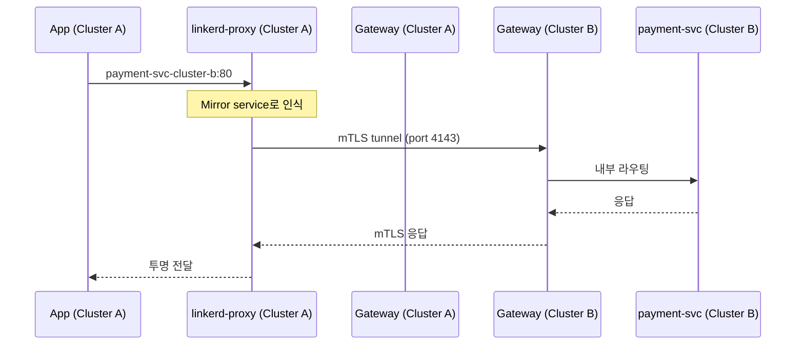
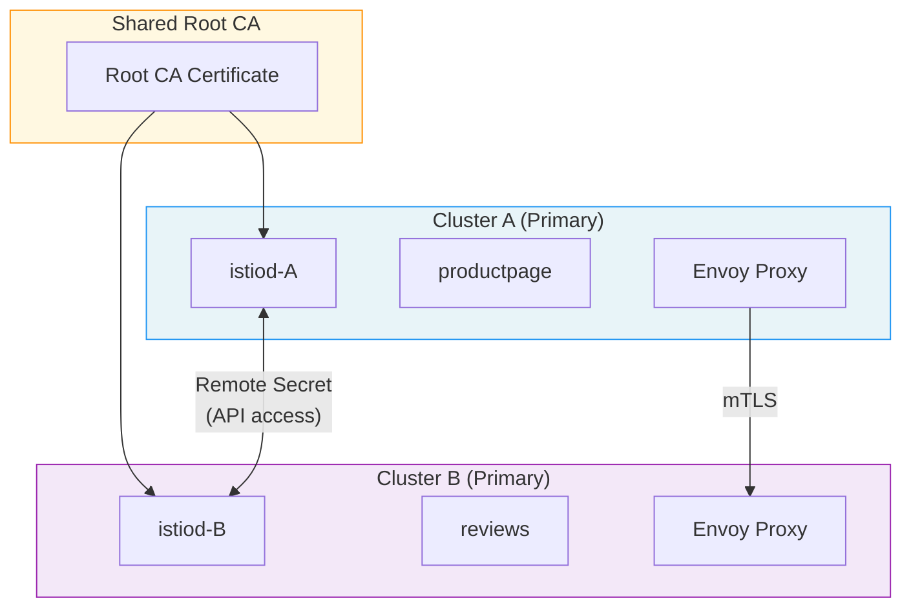
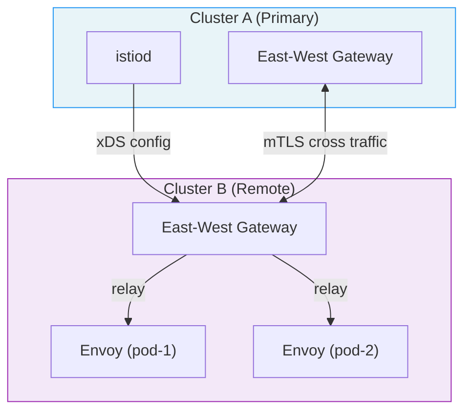
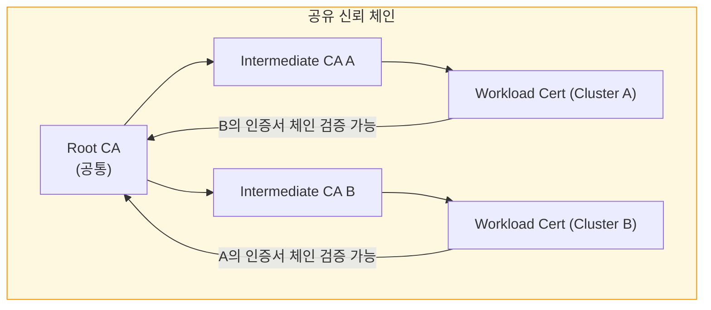

<!-- migrated: write/09_cloud/service-mesh/20-01.멀티클러스터.md (2026-04-19) -->

# Ch20. 멀티클러스터 서비스 메시

> **핵심 요약**
> 단일 클러스터는 단일 장애점이다. 멀티클러스터 서비스 메시는 서비스 디스커버리, 상호 TLS, 트래픽 라우팅을 클러스터 경계를 넘어 확장해 고가용성과 지역 분리를 동시에 달성한다. Linkerd는 서비스 미러 방식으로, Istio는 멀티-프라이머리 또는 프라이머리-리모트 토폴로지로 이 문제를 각기 다르게 풀어낸다.

---

## 🎯 학습 목표

1. 멀티클러스터가 필요한 네 가지 이유(HA, DR, 규정 준수, 팀 격리)를 설명할 수 있다.
2. Linkerd 서비스 미러 방식의 동작 원리와 구성 요소를 이해한다.
3. Istio의 멀티-프라이머리, 프라이머리-리모트 토폴로지 차이를 비교한다.
4. 공유 루트 CA가 크로스-클러스터 mTLS에서 왜 필수인지 설명한다.
5. Flat 네트워크와 Non-flat 네트워크의 트래픽 흐름 차이를 파악한다.

---

## 1. 왜 멀티클러스터인가

단일 Kubernetes 클러스터로 모든 워크로드를 운영하면 구조는 단순하지만, 클러스터 자체가 단일 장애점이 된다. 클러스터의 컨트롤 플레인이 장애를 겪거나 노드 풀 전체가 중단되면 서비스도 함께 멈춘다. 멀티클러스터 아키텍처는 이 문제를 네 가지 관점에서 해소한다.

**고가용성(High Availability)**: 두 클러스터에 동일한 서비스를 배포하고 트래픽을 분산하면, 한 클러스터가 완전히 중단되어도 다른 클러스터가 요청을 처리한다. 항공사 예약 시스템처럼 중단 허용 시간이 분 단위 이하인 서비스가 대표적인 적용 사례다.

**재해 복구(Disaster Recovery)**: DR 클러스터는 평소에 대기 상태를 유지하다가 주 클러스터 장애 시 트래픽을 전환받는다. 서비스 메시는 이 전환을 DNS 변경이 아닌 트래픽 정책 수정으로 처리해 전환 시간을 크게 단축시킨다.

**규정 준수(Regulatory Compliance)**: GDPR이나 금융 규정은 데이터가 특정 지역 내에만 머물도록 요구한다. 유럽 사용자 데이터는 유럽 클러스터에서, 미국 사용자 데이터는 미국 클러스터에서 처리하는 방식으로 지역 데이터 주권을 보장한다.

**팀 격리(Team Isolation)**: 큰 조직에서는 팀마다 별도 클러스터를 갖고, 다른 팀의 서비스를 호출할 때만 클러스터 경계를 넘는다. 이 방식은 '폭발 반경'을 팀 단위로 제한해 한 팀의 배포 사고가 다른 팀에 영향을 미치지 않도록 한다.

---

## 2. 멀티클러스터의 핵심 과제

### 2.1 서비스 디스커버리

단일 클러스터에서는 Kubernetes DNS가 `svc.cluster.local` 형식으로 서비스를 해석해준다. 클러스터 B에 있는 파드가 클러스터 A의 `payment-svc`를 찾으려면, 클러스터 A의 DNS가 클러스터 B에도 보이거나, 클러스터 B의 DNS에 클러스터 A 서비스를 등록하는 방법이 필요하다.

### 2.2 크로스-클러스터 mTLS

같은 클러스터 내에서는 메시가 동일한 CA에서 발급한 인증서로 mTLS를 처리한다. 클러스터 A의 워크로드가 클러스터 B의 워크로드와 mTLS 핸드셰이크를 하려면, 양쪽이 같은 루트 CA를 신뢰해야 한다. 서로 다른 루트 CA를 사용하면 인증서 검증이 실패하고 연결이 거부된다.

### 2.3 레이턴시

리전 간 왕복 시간(RTL)은 수십 밀리초다. 단일 클러스터에서 1ms 미만이던 서비스 호출이 클러스터 경계를 넘으면 50~100ms로 뛴다. 멀티클러스터 설계는 어떤 서비스를 클러스터 경계를 넘어 호출할지, 어디서 지역 캐시를 써야 할지를 명확히 정해야 한다.

---

## 3. Linkerd 멀티클러스터: 서비스 미러

Linkerd는 멀티클러스터 문제를 **서비스 미러(Service Mirror)** 방식으로 푼다. 비유하자면, 클러스터 A에서 클러스터 B의 서비스를 '유령 서비스'로 등록해두는 것이다. 클러스터 A의 파드는 로컬 서비스를 호출하듯 요청하고, 메시가 그 요청을 클러스터 B로 투명하게 전달한다.

### 3.1 구성 요소

**Link CRD**: 두 클러스터를 연결하는 선언적 리소스다. 대상 클러스터의 API 서버 접근 정보와 게이트웨이 주소가 담긴다.

**Service Mirror Controller**: 소스 클러스터에서 실행되며, Link가 가리키는 대상 클러스터의 서비스 목록을 지속적으로 감시한다. `mirror.linkerd.io/exported: true` 레이블이 붙은 서비스를 발견하면, 소스 클러스터에 동명의 서비스를 `{svc}-{cluster-name}`형식으로 생성한다.

**Multi-cluster Gateway**: 각 클러스터에 배포되는 인그레스 포인트다. 크로스-클러스터 트래픽은 반드시 이 게이트웨이를 통과한다. LoadBalancer 타입 서비스로 외부 IP를 갖는다.

### 3.2 트래픽 흐름



클러스터 A의 파드가 `payment-svc-cluster-b:80`을 호출하면, linkerd-proxy가 이를 클러스터 B의 게이트웨이로 전달한다. 클러스터 B 게이트웨이는 SNI 헤더를 보고 목적지 서비스를 결정해 내부로 라우팅한다.

### 3.3 설정 절차

두 클러스터가 동일한 루트 CA를 사용하도록 설정하는 것이 첫 번째 단계다.

```bash
# 공유 루트 CA 생성
step certificate create root.linkerd.cluster.local ca.crt ca.key \
  --profile root-ca --no-password --insecure

# 각 클러스터에 동일한 CA로 Linkerd 설치
linkerd install --identity-trust-anchors-file=ca.crt | kubectl apply -f -
```

두 번째 단계는 Link 생성이다.

```bash
# 클러스터 B의 자격증명을 클러스터 A에 설치
linkerd multicluster link --context=cluster-b \
  --cluster-name=cluster-b | kubectl apply -f - --context=cluster-a
```

세 번째는 서비스 노출이다. 클러스터 B에서 노출할 서비스에 레이블을 추가한다.

```bash
kubectl label svc payment-svc mirror.linkerd.io/exported=true \
  --context=cluster-b
```

이후 서비스 미러 컨트롤러가 자동으로 클러스터 A에 `payment-svc-cluster-b` 서비스를 생성한다.

### 3.4 Linkerd 멀티클러스터의 한계

Linkerd 서비스 미러는 HTTP와 gRPC 트래픽만 지원한다. TCP 레벨 미러링은 아직 지원하지 않아, MySQL이나 Redis 같은 비-HTTP 서비스는 크로스-클러스터 라우팅이 불가능하다. 또한 서비스를 개별적으로 레이블링해야 하므로, 수백 개의 서비스를 노출할 때 관리 부담이 커진다.

---

## 4. Istio 멀티클러스터

Istio는 멀티클러스터 토폴로지를 세 가지 방식으로 제공한다. 각 방식은 컨트롤 플레인 배치와 네트워크 연결 방식에 따라 구분된다.

### 4.1 멀티-프라이머리 (Multi-Primary)

두 클러스터 각각에 독립 istiod가 실행되되, 공유 루트 CA와 서로의 엔드포인트 정보를 교환하는 구조다. 가장 높은 가용성을 제공하지만 설정이 복잡하다.



각 istiod는 상대 클러스터의 API 서버를 '리모트 시크릿'으로 등록해 상대 클러스터의 서비스 엔드포인트를 xDS로 배포할 수 있다. 파드 A가 클러스터 B의 서비스를 호출하면, Envoy가 직접 클러스터 B의 파드 IP로 연결한다. 이를 위해 두 클러스터의 파드 네트워크가 상호 도달 가능한 Flat 네트워크여야 한다.

### 4.2 프라이머리-리모트 (Primary-Remote)

하나의 istiod가 여러 클러스터를 제어한다. 리모트 클러스터에는 istiod가 없고, 프라이머리 클러스터의 istiod를 원격으로 참조한다. 운영 부담이 적지만 프라이머리 클러스터의 컨트롤 플레인이 단일 장애점이 된다.



리모트 클러스터의 Envoy 프록시는 프라이머리의 istiod에서 xDS 설정을 받아야 한다. 파드 네트워크가 Non-flat일 경우 East-West Gateway가 중개 역할을 한다.

### 4.3 설정: 공유 루트 CA

Istio 멀티클러스터도 Linkerd와 마찬가지로 공유 루트 CA가 핵심이다.

```bash
# 중간 CA 생성 (각 클러스터용)
make -f Makefile.selfsigned.mk \
  INTERMEDIATE_CERTS_DIRECTORY=cluster-a/certs cluster-a-certs
make -f Makefile.selfsigned.mk \
  INTERMEDIATE_CERTS_DIRECTORY=cluster-b/certs cluster-b-certs

# 각 클러스터에 CA 시크릿 설치
kubectl create secret generic cacerts -n istio-system \
  --from-file=cluster-a/certs/ca-cert.pem \
  --from-file=cluster-a/certs/ca-key.pem \
  --from-file=cluster-a/certs/root-cert.pem \
  --from-file=cluster-a/certs/cert-chain.pem \
  --context=cluster-a
```

각 클러스터는 독립적인 중간 CA를 갖지만, 두 중간 CA 모두 동일한 루트 CA가 서명한다. 따라서 클러스터 A의 인증서를 클러스터 B가 신뢰할 수 있다.

### 4.4 Ambient 멀티클러스터 (alpha)

Istio 1.27에서 알파로 도입된 Ambient 멀티클러스터는 ztunnel이 크로스-클러스터 터널링을 처리한다. 사이드카 없이 노드 레벨의 ztunnel이 클러스터 경계를 투명하게 넘는다. 아직 프로덕션 사용은 권장되지 않지만, 향후 사이드카 없는 멀티클러스터의 기준점이 될 방향이다.

---

## 5. 공유 루트 CA: 크로스-클러스터 mTLS의 핵심

mTLS 핸드셰이크에서 클라이언트와 서버는 상대방의 인증서를 검증한다. 검증은 인증서 체인을 따라 신뢰할 수 있는 루트 CA까지 올라가는 방식으로 이루어진다. 클러스터 A와 B가 서로 다른 루트 CA를 사용하면, 클러스터 A의 워크로드는 클러스터 B의 인증서 체인 끝에 있는 루트 CA를 신뢰 목록에서 찾지 못한다.



각 클러스터는 고유한 중간 CA를 사용해 워크로드 인증서를 발급하므로, 클러스터 A와 B의 워크로드 인증서는 서로 다르다. 그러나 체인 끝의 루트 CA가 동일하기 때문에 상호 검증이 성공한다. 루트 CA 키는 오프라인에 안전하게 보관하고, 클러스터에는 중간 CA만 배포하는 것이 보안 모범 사례다.

---

## 6. Flat vs Non-Flat 네트워크

멀티클러스터 메시 설계에서 네트워크 토폴로지는 트래픽 경로를 결정한다.

### 6.1 Flat 네트워크

두 클러스터의 파드 CIDR가 겹치지 않고, 파드끼리 직접 통신할 수 있는 구성이다. 같은 VPC 안에 두 클러스터를 배치하거나, VPN으로 연결하는 방식으로 구성한다.

- **장점**: 워크로드가 직접 대상 파드 IP로 연결하므로 게이트웨이 홉이 없어 레이턴시가 낮다.
- **단점**: 파드 CIDR 충돌을 피해야 하므로 IP 주소 계획이 필요하다. 클라우드 프로바이더 간 VPN 비용도 발생한다.

### 6.2 Non-Flat 네트워크

파드끼리 직접 통신이 불가능하고 게이트웨이를 경유해야 하는 구성이다. 서로 다른 클라우드, 서로 다른 리전 간 클러스터가 해당된다.

- **장점**: IP 충돌 걱정이 없고 네트워크 경계가 명확하다.
- **단점**: 모든 크로스-클러스터 트래픽이 East-West Gateway를 경유하므로 레이턴시와 처리량에 제약이 생긴다.

Linkerd는 Non-flat 환경에서 항상 게이트웨이를 사용한다. Istio는 Flat 환경에서 게이트웨이 없이 직접 파드 IP로 연결할 수 있어 레이턴시 측면에서 유리하다.

---

## 7. DNS와 서비스 디스커버리

### 7.1 Linkerd의 접근: DNS 미러링

Linkerd의 서비스 미러 컨트롤러는 로컬 클러스터에 `{svc}-{cluster-name}` 형식의 Kubernetes Service 오브젝트를 생성한다. 이 서비스는 실제 엔드포인트 대신 원격 게이트웨이의 IP를 EndpointSlice로 갖는다. 애플리케이션은 평소처럼 클러스터 내부 DNS를 통해 서비스를 찾지만, 트래픽은 게이트웨이를 통해 원격으로 전달된다.

### 7.2 Istio의 접근: ServiceEntry와 지역 인식 라우팅

Istio는 원격 클러스터의 엔드포인트를 ServiceEntry로 등록하거나, 멀티클러스터 모드에서 istiod가 자동으로 원격 클러스터의 서비스를 xDS 클러스터로 포함시킨다. `locality.istio.io/subzone` 레이블을 활용하면 지역 인식 라우팅으로 같은 리전 내 엔드포인트를 우선 선택하고, 해당 리전이 모두 장애일 때만 원격 클러스터로 장애 조치(failover)한다.

---

## 8. 비용과 복잡성 비교

| 항목 | Linkerd 멀티클러스터 | Istio 멀티-프라이머리 |
|------|---------------------|-----------------------|
| 설정 난이도 | 낮음 (Link CRD 하나) | 높음 (리모트 시크릿 + 네트워크 설정) |
| 지원 프로토콜 | HTTP/gRPC만 | HTTP, gRPC, TCP |
| 게이트웨이 필요 | 항상 필요 | Flat 네트워크에서 선택적 |
| CA 관리 | 단순 (공유 루트 CA) | 중간 CA per 클러스터 관리 필요 |
| 디버깅 도구 | `linkerd multicluster check` | `istioctl remote-clusters` |
| 운영 부담 | 낮음 | 높음 |

실제 비용은 게이트웨이 트래픽 처리 비용, 리전 간 데이터 전송 요금, 그리고 운영 인력 비용까지 고려해야 한다. 멀티클러스터는 기술적 해결책이 명확하더라도 운영 복잡성이 단일 클러스터보다 항상 높다는 점을 인식해야 한다.

---

## 면접 대비

**Q1. 멀티클러스터 서비스 메시에서 공유 루트 CA가 필요한 이유는?**

mTLS 핸드셰이크에서 양쪽은 상대방 인증서의 체인을 따라 신뢰 가능한 루트 CA까지 검증한다. 클러스터마다 다른 루트 CA를 사용하면 상대 클러스터에서 발급한 인증서를 검증할 수 없어 연결이 실패한다. 공유 루트 CA 아래에 클러스터별 중간 CA를 두면, 서로 다른 클러스터 워크로드 간에도 인증서 체인 검증이 성공한다.

**Q2. Linkerd 서비스 미러의 한계는?**

HTTP와 gRPC만 지원하고 TCP 미러링이 없다. 따라서 데이터베이스처럼 TCP 기반 프로토콜을 쓰는 서비스는 크로스-클러스터 라우팅에 Linkerd 서비스 미러를 쓸 수 없다. 또한 서비스마다 `mirror.linkerd.io/exported` 레이블을 달아야 해서 대규모 서비스 환경에서 관리 비용이 증가한다.

**Q3. Istio 멀티-프라이머리와 프라이머리-리모트의 선택 기준은?**

멀티-프라이머리는 각 클러스터가 독립 istiod를 갖기 때문에 컨트롤 플레인 레벨의 단일 장애점이 없다. 그러나 두 istiod가 서로의 서비스 엔드포인트를 동기화하는 복잡성이 있다. 프라이머리-리모트는 설정이 단순하지만 프라이머리 클러스터의 istiod가 장애나면 리모트 클러스터도 새 설정을 받지 못한다. 기존 트래픽은 이어지지만 새 배포나 설정 변경이 불가능해진다. 고가용성 요구사항이 강하면 멀티-프라이머리, 운영 단순성을 우선하면 프라이머리-리모트를 선택한다.

**Q4. Flat 네트워크와 Non-Flat 네트워크에서 서비스 메시 동작이 어떻게 다른가?**

Flat 네트워크에서는 두 클러스터의 파드가 직접 IP로 통신할 수 있다. Istio는 이 환경에서 게이트웨이 없이 Envoy가 직접 원격 파드 IP로 연결해 레이턴시를 최소화한다. Non-Flat 네트워크에서는 모든 크로스-클러스터 트래픽이 East-West Gateway를 경유한다. 게이트웨이 홉이 추가되므로 레이턴시가 높아지지만, IP 충돌 없이 다른 VPC나 클라우드의 클러스터를 연결할 수 있다.

**Q5. 멀티클러스터에서 지역 인식 라우팅(locality-aware routing)이 중요한 이유는?**

클러스터 A와 B가 서로 다른 리전에 있을 때, 같은 서비스 요청이라도 가능하면 가까운 클러스터의 인스턴스로 보내는 것이 레이턴시와 비용 모두에 유리하다. Istio의 지역 인식 라우팅은 파드의 노드 레이블(`topology.kubernetes.io/region`, `topology.kubernetes.io/zone`)을 기반으로 가장 가까운 엔드포인트를 우선 선택한다. 해당 지역의 엔드포인트가 모두 장애 상태일 때만 원격 클러스터로 트래픽을 넘기는 failover가 활성화된다.

---

## 체크리스트

- [ ] 멀티클러스터가 필요한 네 가지 이유를 설명할 수 있다
- [ ] Linkerd `Link` CRD와 서비스 미러 컨트롤러의 역할을 이해한다
- [ ] `mirror.linkerd.io/exported` 레이블 설정과 미러 서비스 생성을 실습했다
- [ ] Istio 멀티-프라이머리에서 리모트 시크릿의 역할을 설명할 수 있다
- [ ] 공유 루트 CA 생성과 각 클러스터에 중간 CA 배포하는 절차를 안다
- [ ] Flat vs Non-Flat 네트워크에서 트래픽 경로 차이를 그릴 수 있다
- [ ] 지역 인식 라우팅의 failover 조건을 설명할 수 있다

---

## 9. 트러블슈팅과 운영 패턴

멀티클러스터 환경은 단일 클러스터보다 장애 원인이 다양하다. 가장 흔한 세 가지 문제와 진단 방법을 살펴본다.

### 9.1 크로스-클러스터 연결 실패 진단

Linkerd에서 클러스터 간 통신이 안 될 때 먼저 확인할 것은 미러 서비스 생성 여부다.

```bash
# 미러 서비스가 생성됐는지 확인
kubectl get svc -A | grep mirror

# Linkerd 멀티클러스터 전체 상태 점검
linkerd multicluster check

# 게이트웨이 연결성 확인
linkerd multicluster gateways

# 특정 서비스의 크로스-클러스터 트래픽 확인
linkerd viz stat svc/payment-svc-cluster-b
```

Istio에서 크로스-클러스터 연결이 실패하면 대부분 리모트 시크릿이나 CA 불일치가 원인이다.

```bash
# 리모트 시크릿 확인
kubectl get secrets -n istio-system | grep remote

# 클러스터 간 연결 상태 확인
istioctl remote-clusters

# Envoy 클러스터 설정에서 원격 엔드포인트 확인
istioctl proxy-config cluster <pod-name> | grep cluster-b

# mTLS 핸드셰이크 실패 시 인증서 체인 검사
istioctl proxy-config secret <pod-name> -n <namespace>
```

### 9.2 게이트웨이 과부하 패턴

Non-flat 네트워크에서 모든 크로스-클러스터 트래픽이 게이트웨이를 경유하면, 트래픽이 집중될 때 게이트웨이가 병목이 된다. 이를 방지하는 방법은 두 가지다.

첫째, 게이트웨이를 수평 확장한다. Linkerd와 Istio 모두 멀티클러스터 게이트웨이를 Deployment로 배포하므로 레플리카 수를 늘릴 수 있다.

```yaml
# Istio East-West Gateway 스케일 아웃
apiVersion: autoscaling/v2
kind: HorizontalPodAutoscaler
metadata:
  name: istio-eastwestgateway
  namespace: istio-system
spec:
  scaleTargetRef:
    apiVersion: apps/v1
    kind: Deployment
    name: istio-eastwestgateway
  minReplicas: 2
  maxReplicas: 10
  metrics:
    - type: Resource
      resource:
        name: cpu
        target:
          type: Utilization
          averageUtilization: 70
```

둘째, 지역 인식 라우팅으로 크로스-클러스터 트래픽 자체를 줄인다. 같은 리전에 충분한 인스턴스가 있으면 원격 클러스터로 요청이 넘어가지 않도록 우선순위를 설정한다.

### 9.3 CA 교체(Rotation) 절차

루트 CA 인증서는 만료 전 교체해야 한다. 멀티클러스터 환경에서 CA 교체는 단일 클러스터보다 더 신중하게 진행해야 한다. 한 클러스터의 CA를 교체하는 동안 다른 클러스터와의 mTLS 연결이 끊기지 않아야 한다.

Linkerd의 CA 교체는 `linkerd upgrade` 명령으로 진행하며, 새 루트 CA를 신뢰 앵커에 추가한 뒤 기존 CA를 제거하는 이중 신뢰 앵커 방식으로 무중단 교체가 가능하다. Istio는 각 클러스터의 `cacerts` 시크릿을 업데이트하고 istiod를 재시작하는 방식이다. 두 클러스터의 CA를 동시에 교체하면 일시적으로 신뢰 체인이 깨질 수 있으므로, 한 클러스터씩 순차적으로 진행해야 한다.

### 9.4 카오스 엔지니어링: 클러스터 장애 시뮬레이션

멀티클러스터 아키텍처의 가장 큰 목적은 클러스터 장애 시 서비스 연속성이다. 이를 검증하려면 정기적으로 장애를 시뮬레이션해야 한다.

```bash
# 클러스터 B의 모든 트래픽을 클러스터 A로 강제 이동 (Istio)
kubectl apply -f - <<EOF
apiVersion: networking.istio.io/v1beta1
kind: VirtualService
metadata:
  name: payment-vs
spec:
  hosts:
    - payment
  http:
    - route:
        - destination:
            host: payment
            subset: cluster-a
          weight: 100
        - destination:
            host: payment
            subset: cluster-b
          weight: 0
EOF

# 장애 복구 후 트래픽 복원
# weight: 50/50으로 복원하거나 locality 기반 자동 라우팅으로 복귀
```

---

## 참고 자료

- [Linkerd Multicluster 공식 문서](https://linkerd.io/2/tasks/multicluster/)
- [Istio Install Multi-Primary on different networks](https://istio.io/latest/docs/setup/install/multicluster/multi-primary_multi-network/)
- [Istio Locality Load Balancing](https://istio.io/latest/docs/tasks/traffic-management/locality-load-balancing/)
- [CNCF Service Mesh Landscape](https://landscape.cncf.io/card-mode?category=service-mesh)
