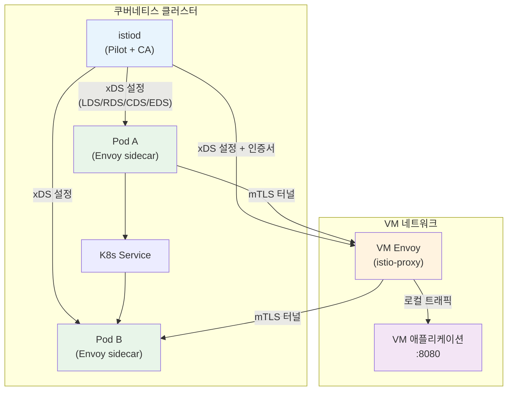
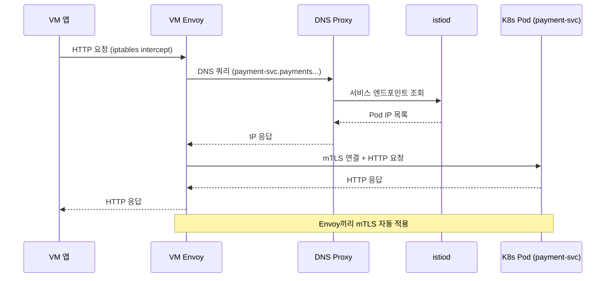

<!-- migrated: write/09_cloud/service-mesh/21-01.Istio VM 통합.md (2026-04-19) -->

# Ch21. Istio와 가상머신 통합
---
> 쿠버네티스 클러스터 외부의 가상머신(VM) 워크로드를 Istio 메시에 편입시키면, 레거시 서버와 컨테이너 워크로드 사이에 mTLS, 트래픽 관리, 관측성을 일관되게 적용할 수 있다. 이 챕터는 VM 통합의 아키텍처와 운영 패턴을 다룬다.

## 🎯 학습 목표

이 챕터를 마치면 다음을 할 수 있다:

- WorkloadEntry, WorkloadGroup, ServiceEntry의 역할과 차이를 설명한다.
- VM에 Istio sidecar를 설치하고 인증서를 프로비저닝하는 과정을 서술한다.
- K8s ↔ VM 양방향 트래픽 라우팅과 mTLS 적용 방법을 구성한다.
- VM 워크로드의 메트릭, 분산 추적, Kiali 표시를 검증한다.
- autoRegistration의 보안 함의와 운영 리스크를 평가한다.

## 1. VM 통합의 필요성

### 1.1 하이브리드 환경의 현실

엔터프라이즈 환경에서 모든 워크로드를 컨테이너로 전환하는 일은 단기간에 완료되지 않는다. 레거시 Oracle DB, 오래된 Java 애플리케이션, 특수 하드웨어에 묶인 처리 서버 등은 EC2 인스턴스나 물리 서버 위에서 수년째 운영되는 경우가 많다. 이런 서버들을 쿠버네티스로 이전하려면 애플리케이션 재설계, 의존성 정리, 검증 사이클이 필요하다. 현실적으로 K8s 클러스터와 VM이 수년간 공존하는 하이브리드 환경이 된다.

하이브리드 환경에서 가장 자주 발생하는 문제는 보안 정책의 단절이다. K8s 안에서는 mTLS와 AuthorizationPolicy로 세밀한 접근 제어를 구현했더라도, VM에서 K8s Pod를 호출하는 트래픽은 메시 밖에서 일반 TCP로 들어온다. 반대로 Pod에서 VM의 레거시 API를 호출할 때도 암호화 없이 통신하게 된다. 관측성도 끊긴다 — Prometheus가 VM의 메트릭을 수집하지 못하고, Jaeger 추적 스팬이 VM에서 K8s로 넘어가는 순간 끊겨버린다.

### 1.2 Istio VM 지원이 해결하는 문제

Istio VM 통합은 VM 위에 Envoy sidecar를 설치하고, 그 sidecar를 istiod의 제어 플레인에 연결한다. VM의 Envoy가 K8s 안의 Pod와 동일한 방식으로 제어 플레인에서 설정을 수신하므로, 메시 멤버십이 VM까지 확장된다.

이를 통해 해결되는 문제는 세 가지다:

- **일관된 보안**: VM ↔ K8s 트래픽에 mTLS가 자동 적용되고, AuthorizationPolicy로 VM의 서비스 계정 기반 접근 제어가 가능하다.
- **통합 관측성**: VM의 Envoy가 메트릭을 노출하면 Prometheus가 수집하고, 분산 추적 컨텍스트가 VM을 통과할 때도 끊기지 않는다.
- **트래픽 관리**: DestinationRule, VirtualService로 K8s Pod와 VM 인스턴스 사이에 가중치 기반 라우팅, 서킷 브레이커, 재시도 정책을 통일해서 적용한다.

### 1.3 VM 통합의 한계와 트레이드오프

VM 통합은 강력하지만 운영 복잡도를 높인다. 첫째, VM에 Envoy를 별도로 설치하고 관리해야 한다. K8s Pod의 sidecar는 Istio가 자동 주입하지만, VM의 sidecar는 수동으로 패키지를 설치하고 업그레이드 주기를 맞춰야 한다. Istio 버전을 올릴 때 VM의 Envoy도 함께 업그레이드하지 않으면 버전 불일치로 예상치 못한 동작이 발생한다.

둘째, VM은 Pod와 달리 네트워크 환경이 통제되지 않는다. VM의 iptables 규칙을 수정해서 트래픽을 Envoy로 리다이렉트해야 하는데, 이 과정이 기존 OS 네트워크 설정과 충돌할 수 있다. 특히 VM에 이미 다른 방화벽 규칙이나 VPN이 설정되어 있다면 추가 검증이 필요하다.

셋째, autoRegistration을 사용하면 VM 관리가 편해지지만 보안 경계가 느슨해진다. 인가되지 않은 VM이 클러스터에 등록되는 위험을 별도의 제어 메커니즘으로 막아야 한다.

## 2. 핵심 리소스

### 2.1 WorkloadEntry

WorkloadEntry는 K8s 클러스터 외부의 워크로드 인스턴스를 메시에 등록하는 리소스다. Pod가 쿠버네티스의 워크로드 단위라면, WorkloadEntry는 VM의 워크로드 단위에 해당한다. 하나의 WorkloadEntry가 하나의 VM 인스턴스를 나타낸다.

```yaml
apiVersion: networking.istio.io/v1beta1
kind: WorkloadEntry
metadata:
  name: vm-legacy-api
  namespace: production
spec:
  address: "10.0.1.100"          # VM의 IP 주소
  labels:
    app: legacy-api
    version: v1
  serviceAccount: legacy-api-sa  # SPIFFE ID 결정에 사용
  network: vm-network            # 멀티네트워크 환경에서 네트워크 식별자
```

WorkloadEntry의 `labels`는 Service, VirtualService, DestinationRule의 셀렉터와 매칭된다. `serviceAccount`는 VM에 발급될 SPIFFE ID(`spiffe://cluster.local/ns/production/sa/legacy-api-sa`)를 결정하므로 AuthorizationPolicy 작성 시 이 값을 기준으로 잡는다.

### 2.2 WorkloadGroup

WorkloadGroup은 동일한 설정을 공유하는 VM 집합을 위한 템플릿 리소스다. WorkloadEntry가 개별 인스턴스라면, WorkloadGroup은 인스턴스 집합의 공통 설정을 정의한다. autoRegistration 기능을 사용할 때 WorkloadGroup이 기준 템플릿 역할을 한다.

```yaml
apiVersion: networking.istio.io/v1beta1
kind: WorkloadGroup
metadata:
  name: legacy-api-group
  namespace: production
spec:
  metadata:
    labels:
      app: legacy-api
  template:
    serviceAccount: legacy-api-sa
    network: vm-network
  probe:                         # VM 헬스체크 설정
    httpGet:
      port: 8080
      path: /health
    initialDelaySeconds: 5
    periodSeconds: 10
```

VM이 Istio agent를 시작하면 WorkloadGroup을 참조해서 자신의 WorkloadEntry를 자동으로 생성한다. WorkloadGroup 하나에 여러 VM 인스턴스가 등록될 수 있다.

### 2.3 ServiceEntry와의 관계

ServiceEntry는 K8s 외부의 서비스(도메인 또는 IP)를 메시의 서비스 레지스트리에 추가하는 리소스다. WorkloadEntry와 함께 사용하면 외부 VM에 서비스 이름을 부여하고 K8s Service처럼 DNS로 접근 가능하게 만든다.

```yaml
apiVersion: networking.istio.io/v1beta1
kind: ServiceEntry
metadata:
  name: legacy-api-se
  namespace: production
spec:
  hosts:
  - legacy-api.production.svc.cluster.local
  ports:
  - number: 8080
    name: http
    protocol: HTTP
  resolution: STATIC
  workloadSelector:
    labels:
      app: legacy-api            # WorkloadEntry의 labels와 매칭
```

`workloadSelector`로 WorkloadEntry를 선택하면 ServiceEntry가 해당 VM 인스턴스들을 엔드포인트로 관리한다. `resolution: STATIC`이면 WorkloadEntry의 IP를 직접 사용하고, `resolution: DNS`이면 DNS 조회 결과를 사용한다. WorkloadEntry만으로는 서비스 이름이 없으므로 Pod에서 VM을 DNS로 호출하려면 ServiceEntry가 함께 있어야 한다.

### 2.4 자동 등록 (Istio 1.8+ autoRegistration)

Istio 1.8부터 autoRegistration 기능이 도입되어 VM 온보딩 과정이 크게 단순해졌다. 이전에는 VM마다 WorkloadEntry를 수동으로 작성해야 했지만, autoRegistration을 활성화하면 VM에서 Istio agent가 시작될 때 WorkloadGroup 템플릿을 기반으로 WorkloadEntry를 자동 생성한다.

istiod에서 autoRegistration을 활성화하는 방법은 다음과 같다:

```yaml
# IstioOperator 또는 values.yaml
meshConfig:
  defaultConfig:
    proxyMetadata:
      AUTO_REGISTER_GROUP: legacy-api-group
```

VM이 오프라인이 되면 WorkloadEntry는 자동으로 삭제되지 않는다. `cleanupDelay` 설정으로 일정 시간 후 정리하도록 구성할 수 있다. VM을 영구 제거할 때는 WorkloadEntry를 수동으로 삭제하거나 별도의 정리 스크립트를 운영해야 한다.

## 3. VM 온보딩 아키텍처

### 3.1 전체 아키텍처

VM 통합의 전체 아키텍처를 이해하려면 제어 플레인과 데이터 플레인의 흐름을 구분해야 한다.



VM의 Envoy는 istiod에 직접 연결해서 xDS 프로토콜로 설정을 받는다. 이때 연결 경로는 istiod의 15012 포트(xDS over gRPC with mTLS)다. VM이 클러스터 내부 네트워크에 접근할 수 없는 환경이라면 East-West Gateway를 통해 연결한다.

### 3.2 VM에 Istio sidecar 설치 과정

VM 온보딩은 다음 단계로 진행된다.

첫째, K8s 클러스터에서 VM용 설정 파일을 생성한다:

```bash
# WorkloadGroup 생성
kubectl apply -f workload-group.yaml

# VM 토큰 및 인증서 파일 생성
istioctl x workload entry configure \
  -f workload-group.yaml \
  -o /tmp/vm-files \
  --clusterID Kubernetes
```

이 명령은 `/tmp/vm-files` 디렉토리에 다음 파일들을 생성한다:

- `cluster.env`: 클러스터 접속 정보 (istiod 주소, namespace, 서비스 계정)
- `istio-token`: Kubernetes ServiceAccount 토큰 (인증서 발급 시 사용)
- `root-cert.pem`: 클러스터 CA의 루트 인증서
- `hosts`: `/etc/hosts`에 추가할 K8s DNS 엔트리

둘째, 생성된 파일들을 VM으로 복사한다:

```bash
scp /tmp/vm-files/* user@vm-ip:/tmp/
```

셋째, VM에서 Istio sidecar 패키지를 설치하고 설정 파일을 배치한다:

```bash
# Debian/Ubuntu 기준
curl -LO https://storage.googleapis.com/istio-release/releases/1.20.0/deb/istio-sidecar.deb
dpkg -i istio-sidecar.deb

# 설정 파일 배치
cp /tmp/cluster.env /var/lib/istio/envoy/
cp /tmp/root-cert.pem /etc/certs/root-cert.pem
cp /tmp/istio-token /var/run/secrets/tokens/istio-token

# hosts 파일 업데이트
cat /tmp/hosts >> /etc/hosts

# sidecar 서비스 시작
systemctl start istio
```

### 3.3 인증서 프로비저닝

VM의 Envoy는 처음 시작 시 istiod의 CA에 인증서를 요청해야 한다. 이 과정에서 `istio-token`이 Kubernetes ServiceAccount 토큰 역할을 한다. Istio pilot-agent가 이 토큰을 가지고 istiod의 15012 포트로 CSR(Certificate Signing Request)을 보내면, istiod가 토큰을 검증하고 SVID(SPIFFE Verifiable Identity Document)를 발급한다.

발급된 인증서는 SPIFFE 형식의 SAN을 포함한다:

```
spiffe://cluster.local/ns/production/sa/legacy-api-sa
```

이 인증서는 VM의 메모리에 저장되고, pilot-agent가 만료 전에 자동으로 갱신한다. 기본 TTL은 24시간이며, 만료 2/3 시점에 갱신을 시도한다. 갱신은 기존 인증서로 istiod에 mTLS 연결을 열고 새 CSR을 제출하는 방식이다.

`root-cert.pem`은 VM이 istiod와 처음 연결할 때 서버를 검증하는 데 쓰인다. 이 파일은 클러스터 CA의 자체 서명 루트 인증서이므로, 클러스터 CA가 교체되면 VM의 `root-cert.pem`도 갱신해야 한다.

### 3.4 DNS 해석 (Istio DNS Proxy)

VM에서 `legacy-api.production.svc.cluster.local` 같은 K8s 서비스 DNS를 해석하려면 DNS Proxy가 필요하다. Istio 1.8+에서 pilot-agent에 내장된 DNS Proxy가 이 역할을 한다.

```bash
# cluster.env에 DNS Proxy 활성화
ISTIO_META_DNS_CAPTURE=true
ISTIO_META_DNS_AUTO_ALLOCATE=true
```

DNS Proxy는 VM의 Envoy에서 53번 포트로 동작하며, `*.svc.cluster.local` 형식의 쿼리를 가로채서 istiod로부터 받은 서비스 레지스트리 정보로 응답한다. 클러스터 외부에서는 실제 kube-dns에 접근할 수 없기 때문에, 이 DNS Proxy가 없으면 VM에서 K8s 서비스 이름으로 직접 호출할 수 없다.

`ISTIO_META_DNS_AUTO_ALLOCATE`를 활성화하면 ServiceEntry에 `clusterIP`가 없어도 가상 IP를 자동 할당한다. 이를 통해 ServiceEntry 기반의 외부 서비스에도 DNS 이름으로 접근할 수 있다.

## 4. 트래픽 관리

### 4.1 K8s → VM 트래픽 라우팅

Pod에서 VM의 서비스를 호출하는 경우, ServiceEntry와 WorkloadEntry가 함께 있으면 K8s Service와 동일한 방식으로 동작한다. Pod의 Envoy가 EDS(Endpoint Discovery Service)를 통해 VM의 IP를 엔드포인트로 인식하고 직접 연결한다.

여러 VM 인스턴스 간의 로드밸런싱은 DestinationRule로 제어한다:

```yaml
apiVersion: networking.istio.io/v1beta1
kind: DestinationRule
metadata:
  name: legacy-api-dr
  namespace: production
spec:
  host: legacy-api.production.svc.cluster.local
  trafficPolicy:
    loadBalancer:
      simple: LEAST_CONN          # VM 인스턴스 간 최소 연결 수 기반
    connectionPool:
      tcp:
        connectTimeout: 5s
    outlierDetection:
      consecutive5xxErrors: 3
      interval: 30s
      baseEjectionTime: 30s
```

K8s Pod에서 VM으로의 트래픽 경로는 `Pod Envoy → (mTLS) → VM Envoy → VM App`이다. VM의 Envoy가 iptables로 인바운드 트래픽을 가로채서 처리한다.

### 4.2 VM → K8s 트래픽 라우팅

VM에서 K8s 서비스를 호출할 때는 DNS Proxy가 서비스 이름을 IP로 해석하고, VM의 Envoy가 해당 K8s Pod로 트래픽을 라우팅한다. VM 애플리케이션이 `http://payment-svc.payments.svc.cluster.local:8080/charge`를 호출하면:



VM에서 나가는 트래픽도 VirtualService로 제어할 수 있다. 예를 들어 VM에서 `payment-svc`를 호출할 때 카나리 버전으로 10%만 라우팅하는 VirtualService가 있다면, VM의 Envoy도 동일한 라우팅 규칙을 적용한다.

### 4.3 mTLS 적용 (PeerAuthentication)

VM이 메시에 편입되면 PeerAuthentication으로 mTLS를 강제할 수 있다. namespace 수준의 PeerAuthentication은 VM에도 동일하게 적용된다:

```yaml
apiVersion: security.istio.io/v1beta1
kind: PeerAuthentication
metadata:
  name: default
  namespace: production
spec:
  mtls:
    mode: STRICT    # plaintext 거부
```

`STRICT` 모드에서는 VM의 Envoy가 없는 클라이언트(예: 아직 메시에 편입되지 않은 VM)에서 오는 plaintext 연결을 거부한다. 전환 단계에서는 `PERMISSIVE`로 시작해서 모든 클라이언트가 mTLS를 사용하게 된 후 `STRICT`로 전환하는 것이 안전하다.

### 4.4 AuthorizationPolicy 적용

VM의 SPIFFE ID를 기반으로 세밀한 접근 제어를 구현한다. WorkloadEntry의 `serviceAccount`가 `legacy-api-sa`라면, AuthorizationPolicy에서 다음과 같이 VM을 출처로 지정한다:

```yaml
apiVersion: security.istio.io/v1beta1
kind: AuthorizationPolicy
metadata:
  name: allow-legacy-api
  namespace: payments
spec:
  selector:
    matchLabels:
      app: payment-svc
  action: ALLOW
  rules:
  - from:
    - source:
        principals:
        - "cluster.local/ns/production/sa/legacy-api-sa"  # VM의 SA
    to:
    - operation:
        methods: ["POST"]
        paths: ["/charge"]
```

이 정책은 `legacy-api-sa` 서비스 계정을 가진 워크로드(VM 또는 Pod)만 `payment-svc`의 `/charge` POST를 호출할 수 있도록 제한한다. K8s Pod와 VM을 동일한 정책 프레임워크로 관리할 수 있다는 점이 VM 통합의 핵심 가치다.

## 5. 관측성

### 5.1 VM 워크로드 메트릭 수집

VM의 Envoy는 15090 포트에서 Prometheus 형식의 메트릭을 노출한다. K8s 안에서는 PodMonitor나 ServiceMonitor로 자동 수집되지만, VM은 별도 설정이 필요하다.

Prometheus가 VM 메트릭을 수집하는 방법은 두 가지다. 첫 번째는 Prometheus에 VM IP를 스크레이프 대상으로 직접 추가하는 방법이다. 두 번째는 Istio의 WorkloadEntry에 어노테이션을 추가하고, prometheus-operator가 이를 인식하도록 설정하는 방법이다:

```yaml
apiVersion: networking.istio.io/v1beta1
kind: WorkloadEntry
metadata:
  name: vm-legacy-api
  annotations:
    prometheus.io/scrape: "true"
    prometheus.io/port: "15090"
    prometheus.io/path: "/stats/prometheus"
```

수집되는 메트릭은 K8s Pod의 Envoy 메트릭과 동일하다. `istio_requests_total`, `istio_request_duration_milliseconds`, `istio_tcp_connections_opened_total` 등이 VM source label과 함께 수집된다.

### 5.2 분산 추적에서 VM 스팬 포함

VM의 Envoy는 Zipkin/Jaeger 헤더(`x-b3-traceid`, `x-b3-spanid` 등)를 자동으로 주입하고 전파한다. VM 애플리케이션이 헤더를 upstream 요청에 전달하면, K8s Pod → VM → K8s Pod 경로의 전체 추적 스팬이 하나의 trace로 연결된다.

VM 애플리케이션이 직접 헤더를 전파하지 않는 레거시 코드라면, Envoy의 `PILOT_ENABLE_VIRTUAL_INBOUND_LISTENERS` 설정으로 inbound/outbound 스팬을 자동 생성할 수 있지만 헤더 전파 없이는 parent-child 관계가 끊긴다. 레거시 애플리케이션의 경우 최소한 `x-b3-traceid`와 `x-b3-spanid`를 로깅에서 참조할 수 있도록 설정하는 것이 실용적이다.

### 5.3 Kiali에서 VM 워크로드 표시

Kiali는 WorkloadEntry를 인식해서 서비스 그래프에 VM 워크로드를 표시한다. VM에서 K8s Pod로의 트래픽, 반대 방향의 트래픽 모두 간선으로 시각화된다.

Kiali에서 VM 워크로드가 올바르게 표시되려면 WorkloadEntry의 `labels`에 `app`이 있어야 한다. Kiali는 `app` 레이블을 기준으로 워크로드를 그룹화하기 때문이다. `version` 레이블도 함께 있으면 카나리 배포에서 버전별 트래픽 분포를 확인할 수 있다.

VM이 오프라인이 되면 WorkloadEntry는 유지되지만 Kiali의 엔드포인트 상태가 unhealthy로 표시된다. WorkloadGroup에 probe를 설정해 두면 istiod가 헬스체크 결과를 WorkloadEntry 상태에 반영하고 Kiali가 이를 표시한다.

## 6. 운영 고려사항

### 6.1 VM 헬스체크와 장애 감지

VM은 Pod와 달리 kubelet의 liveness/readiness probe를 사용할 수 없다. WorkloadGroup의 `probe` 설정으로 이를 대체한다. istiod가 VM의 Envoy를 통해 주기적으로 헬스체크를 수행하고, 실패하면 해당 VM을 엔드포인트 목록에서 제거한다.

DestinationRule의 `outlierDetection`을 설정하면 연속 에러나 응답 지연을 기반으로 VM을 임시로 서비스에서 제외한다:

```yaml
outlierDetection:
  consecutive5xxErrors: 3
  interval: 30s
  baseEjectionTime: 60s
  maxEjectionPercent: 50   # 최대 50%의 VM만 제외 (전체 서비스 다운 방지)
```

`maxEjectionPercent`를 적절히 설정하지 않으면 VM 인스턴스 절반 이상이 동시에 장애를 겪을 때 나머지 인스턴스도 연쇄적으로 제외되는 상황이 발생할 수 있다.

### 6.2 VM 스케일링과 WorkloadEntry 관리

autoRegistration을 사용하면 VM이 추가될 때 WorkloadEntry가 자동 생성되지만, VM이 제거될 때 WorkloadEntry가 즉시 삭제되지 않는다. 오토스케일링 환경에서 스케일다운 후 스테일(stale) WorkloadEntry가 남아 있으면 트래픽이 존재하지 않는 VM으로 전달되어 에러가 발생한다.

이를 해결하는 방법은 두 가지다. 하나는 VM shutdown 스크립트에서 `systemctl stop istio`를 실행해 Envoy가 정상 종료 신호를 istiod에 보내도록 하는 것이다. 다른 하나는 CronJob으로 주기적으로 비활성 WorkloadEntry를 정리하는 운영 스크립트를 유지하는 것이다.

### 6.3 보안: VM SPIFFE ID와 namespace 격리

VM의 SPIFFE ID는 WorkloadEntry의 `serviceAccount`와 `namespace`로 결정된다. 여기서 중요한 점은 VM이 실제로 그 서비스 계정을 K8s에서 사용하는 것이 아니라, 단지 그 이름의 SPIFFE ID를 발급받는다는 것이다. 따라서 WorkloadEntry를 잘못 구성하면 VM이 의도하지 않은 권한을 갖게 된다.

namespace 격리 관점에서 VM의 WorkloadEntry는 특정 namespace에 속한다. AuthorizationPolicy가 namespace 경계를 기준으로 동작하므로, VM을 적절한 namespace에 배치하는 것이 중요하다. 레거시 서버처럼 여러 서비스를 실행하는 VM은 가능한 한 서비스별로 별도의 WorkloadEntry를 만들고 각각 다른 서비스 계정을 부여하는 것이 좋다.

autoRegistration을 사용할 때는 WorkloadGroup에 `serviceAccount`를 명시하고, 해당 서비스 계정에는 최소 권한만 부여한다. `network` 필드로 VM이 속한 네트워크를 제한하면 다른 네트워크에서 같은 WorkloadGroup으로 등록되는 것을 차단할 수 있다.

### 6.4 Ambient 모드에서의 VM 지원 현황

Istio Ambient 모드(Ch11)는 ztunnel과 waypoint proxy로 사idecar 없이 메시 기능을 제공한다. 그러나 2024년 기준 Ambient 모드의 VM 지원은 아직 실험적 단계다.

현재 제약사항은 다음과 같다:

- ztunnel은 K8s 노드에서만 동작하므로 VM에 직접 설치할 수 없다.
- VM을 Ambient 메시에 포함시키려면 VM에 ztunnel을 별도로 설치하는 방식이 검토되고 있으나 GA 릴리즈가 아니다.
- VM에서 waypoint proxy를 통한 L7 정책 적용은 현재 지원되지 않는다.

Ambient 모드로의 전환을 계획 중인 환경에서 VM 통합이 필요하다면, 현재로서는 기존 sidecar 기반 VM 통합을 계속 사용하고 Ambient의 VM 지원 GA를 기다리는 것이 현실적인 선택이다. Istio 로드맵에서 VM + Ambient 통합은 우선순위가 높은 항목이지만 구체적인 GA 일정은 확정되지 않았다.

## 📝 핵심 정리

VM 통합의 핵심은 쿠버네티스 클러스터 밖의 워크로드를 메시의 일급 구성원으로 편입시키는 것이다. WorkloadEntry로 VM 인스턴스를 등록하고, ServiceEntry로 서비스 이름을 부여하며, WorkloadGroup으로 인스턴스 집합의 공통 설정을 관리한다. autoRegistration은 편의성을 높이지만 보안 제어가 추가로 필요하다.

VM의 Envoy는 istiod에서 xDS 설정을 받고, Kubernetes ServiceAccount 토큰으로 인증서를 발급받아 SPIFFE ID 기반의 mTLS를 수립한다. DNS Proxy가 K8s 서비스 이름 해석을 담당하므로, VM 애플리케이션의 코드 변경 없이 K8s 서비스를 DNS로 호출할 수 있다.

관측성은 VM에서도 동일하게 동작한다. Envoy 메트릭이 Prometheus에 수집되고, 분산 추적 헤더가 전파되며, Kiali 그래프에 VM 워크로드가 표시된다. Ambient 모드의 VM 지원은 아직 실험적이므로, 현재는 sidecar 기반 접근이 프로덕션에서 신뢰할 수 있는 선택이다.
