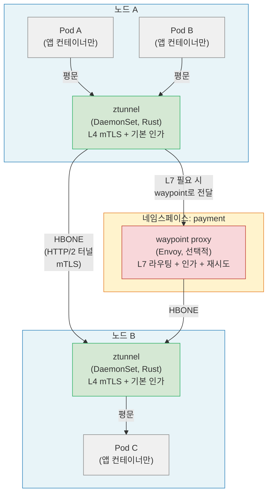
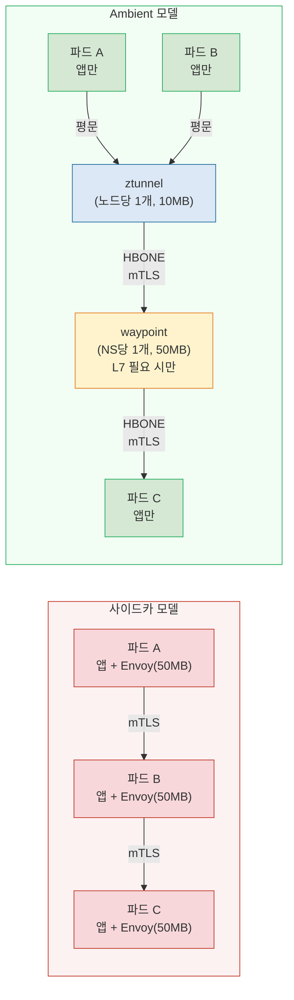
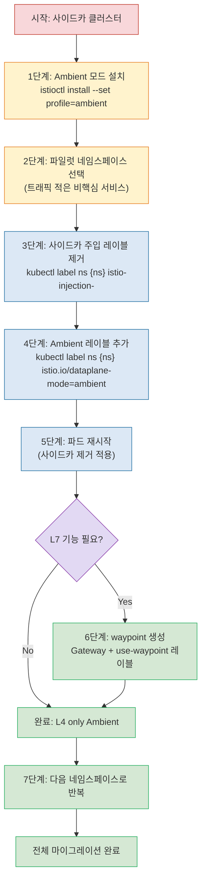

<!-- migrated: write/09_cloud/service-mesh/22-01.Istio Ambient Mesh.md (2026-04-19) -->

# Ch22. Istio Ambient Mesh

> **핵심 요약**
> Ambient Mesh는 "사이드카 없이 서비스 메시를"이라는 명제에서 출발했다. 노드당 하나의 ztunnel DaemonSet이 L4 mTLS를 처리하고, L7 기능이 필요한 워크로드만 waypoint 프록시를 선택적으로 붙인다. 1000개 파드 기준 메모리 소비가 사이드카 50GB에서 Ambient 300MB로 줄어든다. 2024년 Istio 1.24에서 GA가 됐다.

---

## 🎯 학습 목표

1. 사이드카 모델의 구조적 한계 네 가지를 열거하고 각각 실제 장애 시나리오로 설명할 수 있다
2. ztunnel의 역할과 "노드당 하나"라는 배치 전략이 갖는 의미를 설명할 수 있다
3. waypoint 프록시가 ztunnel과 어떻게 협력하는지 L4/L7 분리 아키텍처를 그림으로 그릴 수 있다
4. 사이드카 → Ambient 마이그레이션 절차를 단계별로 수행할 수 있다
5. 사이드카와 Ambient의 리소스 소비를 수치로 비교하고, 선택 기준을 제시할 수 있다

---

## 1. 왜 Ambient Mesh인가: 사이드카의 구조적 한계

사이드카 메시는 "모든 파드 옆에 프록시를 붙인다"는 단순한 아이디어에서 출발했다. 그런데 수년간 대규모 운영을 통해 네 가지 근본적인 문제가 드러났다. Ambient Mesh는 이 네 가지를 모두 해결하려는 시도다.

### 1.1 리소스 오버헤드: 수천 배의 낭비

Envoy 사이드카는 파드 하나당 약 50MB 메모리와 100m CPU를 소비한다. 1000개 파드 클러스터라면 사이드카만으로 50GB 메모리가 추가로 필요하다. 이는 노드 수십 대 분량이다.

더 심각한 문제는 트래픽이 거의 없는 파드에도 동일한 오버헤드가 붙는다는 점이다. 배치 처리 파드, 크론잡, 거의 사용되지 않는 관리 API 서버에도 Envoy가 상주하며 메모리를 점유한다. 이는 클라우드 환경에서 곧바로 비용으로 이어진다.

### 1.2 애플리케이션 수명주기 결합

사이드카는 애플리케이션 컨테이너와 같은 Pod에 속하므로 수명주기가 묶인다. 이 결합은 두 가지 문제를 낳는다.

첫째, Istio를 업그레이드하려면 모든 파드를 재시작해야 한다. 사이드카 버전을 올리는 것이 곧 애플리케이션 재시작을 의미하기 때문이다. 수천 개 파드의 롤링 재시작은 상당한 운영 부담이다. 둘째, 사이드카가 크래시하면 애플리케이션 파드 전체가 영향을 받는다. Envoy 버그로 인한 사이드카 OOM이 애플리케이션 중단으로 이어진 사례가 실제로 보고됐다.

### 1.3 일부 애플리케이션과의 충돌

iptables 기반 트래픽 가로채기는 특정 애플리케이션 패턴과 충돌한다. 예를 들어 파드 내부에서 직접 raw socket을 사용하는 네트워크 도구, 자체 iptables 규칙을 설정하는 애플리케이션, Init Container 순서에 민감한 시스템이 여기에 해당한다.

또한 `istio-init` Init Container는 `NET_ADMIN` 권한이 필요한데, 보안 정책으로 이 권한을 제한하는 환경(CIS 벤치마크 강화 클러스터 등)에서는 사이드카 주입 자체가 불가능해진다.

### 1.4 스케일: 1000개 파드 = 1000개 Envoy 인스턴스

사이드카 모델은 선형 스케일링 문제가 있다. 파드 수가 늘수록 Envoy 인스턴스 수가 정비례해서 늘고, istiod가 xDS 설정을 푸시해야 하는 대상도 정비례해서 늘어난다. 대규모 클러스터에서 istiod의 메모리 소비와 xDS 업데이트 레이턴시가 문제가 된다.

---

## 2. Ambient Mesh 아키텍처: 두 계층의 분리

Ambient Mesh는 네트워크 기능을 두 계층으로 분리한다. 비유하자면 고속도로와 지방도의 분리와 비슷하다. 모든 차량(파드)은 고속도로(L4 ztunnel)를 통과하지만, 목적지에 따라 일부 차량만 특수 검문소(L7 waypoint)를 거친다.



### 2.1 ztunnel: L4 계층의 수문장

ztunnel(zero-trust tunnel)은 Istio 팀이 Rust로 새로 작성한 경량 프록시다. 모든 노드에 DaemonSet으로 배포되므로 파드 수와 무관하게 **노드당 하나**만 존재한다.

ztunnel이 담당하는 기능은 세 가지로 한정된다.

- **mTLS 암호화/복호화**: 파드 간 통신을 자동으로 암호화
- **L4 인가**: 소스 SPIFFE 신원 기반 허용/거부 (AuthorizationPolicy의 L4 규칙)
- **L4 텔레메트리**: 연결 수, 바이트 수 등 기본 메트릭 수집

ztunnel은 HTTP 헤더나 gRPC 메서드를 파싱하지 않는다. L7 정보에 접근하지 않으므로 그만큼 단순하고 가볍다. 하나의 ztunnel 인스턴스가 노드 위의 모든 파드 트래픽을 처리하며, 메모리 소비는 약 10MB 수준이다.

ztunnel은 파드와 파드 사이의 연결을 **HBONE(HTTP-Based Overlay Network Environment)** 프로토콜로 터널링한다. HBONE은 HTTP/2 위에서 동작하며, CONNECT 메서드를 사용해 mTLS 터널을 수립한다. 표준 HTTP/2 포트(443, 80)를 사용할 수 있어 기존 방화벽 규칙과 호환성이 좋다.

### 2.2 waypoint 프록시: L7 계층의 선택적 확장

waypoint는 기존 Envoy 기반이다. 차이는 파드마다 붙는 것이 아니라 **네임스페이스 또는 서비스어카운트 단위**로 하나가 배포된다는 점이다.

waypoint가 처리하는 기능은 Envoy의 L7 기능 전체다.

- HTTP 라우팅 (헤더 기반, 경로 기반)
- 재시도·타임아웃
- 결함 주입 (Fault Injection)
- L7 인가 (HTTP 메서드, 경로, 헤더 기반 AuthorizationPolicy)
- L7 텔레메트리 (HTTP 상태 코드, 요청 레이턴시 등)

waypoint는 Gateway API를 통해 생성한다. `istio-waypoint`라는 gatewayClassName을 사용하면 istiod가 자동으로 waypoint Deployment를 만들어 준다.

```yaml
apiVersion: gateway.networking.k8s.io/v1
kind: Gateway
metadata:
  name: payment-waypoint
  namespace: payment
spec:
  gatewayClassName: istio-waypoint
  listeners:
  - name: mesh
    port: 15008
    protocol: HBONE
```

이 Gateway 리소스를 생성하고 `istio.io/use-waypoint: payment-waypoint` 레이블을 네임스페이스나 서비스에 붙이면, 해당 대상으로 향하는 트래픽이 waypoint를 거치게 된다.

---

## 3. 사이드카 vs Ambient: 아키텍처 비교



### 3.1 수치로 보는 리소스 차이

실제 숫자로 비교해보면 차이가 선명해진다. 1000개 파드, 10개 네임스페이스, 20개 노드 클러스터를 가정한다.

| 항목 | 사이드카 | Ambient (L4만) | Ambient (L4+L7) |
|------|---------|---------------|-----------------|
| Envoy 인스턴스 수 | 1000개 | 0개 | 10개 (waypoint) |
| ztunnel 인스턴스 수 | 0개 | 20개 (노드당) | 20개 (노드당) |
| 총 메모리 (프록시) | ~50GB | ~200MB | ~700MB |
| xDS 업데이트 대상 | 1000개 | 20개 | 20 + 10 = 30개 |
| 파드 재시작 없는 Istio 업그레이드 | 불가 | 가능 | 가능 |

사이드카에서 Ambient L4로 전환하면 메모리 소비가 약 **250배** 감소한다. 이는 노드 수십 대를 절약할 수 있는 규모다.

### 3.2 레이턴시: 홉 수 비교

사이드카 모델에서 파드 A → 파드 B 요청은 다음 경로를 거친다.
`앱A → Envoy A(아웃바운드) → 네트워크 → Envoy B(인바운드) → 앱B`

Ambient L4에서는 이렇게 된다.
`앱A → ztunnel A → 네트워크(HBONE) → ztunnel B → 앱B`

홉 수는 비슷하지만, ztunnel이 Rust로 작성된 경량 구현이라 CPU 사이클이 적다. 실제 벤치마크에서 Ambient L4는 사이드카 대비 레이턴시가 소폭 낮고 처리량이 높게 측정된다.

Ambient L7(waypoint 경유)에서는 홉이 하나 추가된다.
`앱A → ztunnel A → waypoint → 네트워크(HBONE) → ztunnel B → 앱B`

waypoint 경유로 레이턴시가 증가하지만, 네임스페이스 전체에 걸쳐 waypoint가 공유되므로 리소스 효율은 여전히 사이드카보다 낫다.

---

## 4. ztunnel 심층 분석

### 4.1 왜 Rust인가

Istio 팀이 ztunnel을 C++이나 Go가 아닌 Rust로 작성한 이유가 있다. ztunnel은 노드의 모든 파드 트래픽을 처리하므로 메모리 안전성이 핵심이다. C++는 메모리 안전성을 보장하지 않아 보안 취약점 위험이 있다. Go는 GC(가비지 컬렉션) 일시 정지가 레이턴시 스파이크를 유발할 수 있다. Rust는 컴파일 타임 메모리 안전성 보장과 GC 없는 예측 가능한 레이턴시를 동시에 제공한다.

linkerd2-proxy도 Rust로 작성됐고, Cloudflare의 프록시 인프라도 Rust를 채택했다. 네트워크 프록시 영역에서 Rust가 사실상 표준이 되어가는 추세다.

### 4.2 HBONE 프로토콜

HBONE(HTTP-Based Overlay Network Environment)은 Ambient Mesh의 핵심 전송 프로토콜이다. 구조는 다음과 같다.

- HTTP/2 CONNECT 메서드로 터널을 수립
- 터널 내부에서 mTLS로 암호화된 원본 트래픽을 캡슐화
- 포트 15008 사용 (기존 방화벽 규칙에 영향 최소화)

HBONE을 사용하면 중간 네트워크 장비가 내부 트래픽을 볼 수 없다. SPIFFE 인증서 기반 양방향 인증이 터널 수립 시 수행되므로, 터널이 한 번 수립되면 그 위의 모든 통신은 신뢰할 수 있는 출처임이 보장된다.

### 4.3 iptables 없는 트래픽 가로채기

사이드카 모델은 `NET_ADMIN` 권한을 요구하는 iptables 조작에 의존한다. ztunnel은 다른 방식을 택했다. Linux 네트워킹의 **network namespace**와 **eBPF** 기반 소켓 리다이렉션을 활용해 트래픽을 가로챈다.

이 방식의 장점은 파드가 `NET_ADMIN` 권한 없이도 Ambient Mesh에 참여할 수 있다는 점이다. CIS 벤치마크로 강화된 클러스터, PodSecurityStandard `restricted` 프로필 환경에서도 Ambient Mesh를 사용할 수 있다.

---

## 5. 마이그레이션: 사이드카 → Ambient

### 5.1 공존 가능성

Istio는 사이드카 모드와 Ambient 모드를 동일 클러스터에서 동시에 운영하도록 설계됐다. 한 네임스페이스는 사이드카, 다른 네임스페이스는 Ambient로 운영할 수 있다. 이 공존 설계가 점진적 마이그레이션을 가능하게 한다.



### 5.2 단계별 절차

**1단계: Ambient 모드 설치**

기존 Istio가 설치된 클러스터에 Ambient 컴포넌트를 추가한다. ztunnel DaemonSet과 CNI 플러그인이 새로 배포된다.

```bash
# Helm을 통한 Ambient 컴포넌트 추가
helm upgrade istio-base istio/base -n istio-system
helm upgrade istiod istio/istiod -n istio-system \
  --set profile=ambient

helm install istio-cni istio/cni -n istio-system \
  --set profile=ambient

helm install ztunnel istio/ztunnel -n istio-system

# 설치 검증
kubectl get pods -n istio-system
kubectl get daemonset ztunnel -n istio-system
```

**2단계: 네임스페이스 전환**

파일럿 네임스페이스의 사이드카 주입을 비활성화하고 Ambient 모드를 활성화한다.

```bash
# 사이드카 주입 레이블 제거
kubectl label namespace my-app istio-injection-

# Ambient 모드 활성화
kubectl label namespace my-app istio.io/dataplane-mode=ambient

# 기존 사이드카 제거를 위해 파드 재시작
kubectl rollout restart deployment -n my-app
```

**3단계: L7 기능이 필요한 경우 waypoint 생성**

```bash
# waypoint 생성 (네임스페이스 단위)
istioctl waypoint apply -n my-app --enroll-namespace

# 생성 확인
kubectl get gateway -n my-app
kubectl get pods -n my-app -l gateway.istio.io/managed=istio.io-mesh-controller
```

**4단계: 검증**

```bash
# Ambient 등록 확인
istioctl ztunnel-config workload -n my-app

# 트래픽 흐름 확인 (ztunnel 로그)
kubectl logs -n istio-system -l app=ztunnel -f

# mTLS 상태 확인
istioctl x describe pod <pod-name> -n my-app
```

### 5.3 롤백 방법

문제가 발생하면 Ambient 레이블을 제거하고 사이드카 주입을 재활성화하면 된다.

```bash
# Ambient 비활성화
kubectl label namespace my-app istio.io/dataplane-mode-

# 사이드카 재활성화
kubectl label namespace my-app istio-injection=enabled

# 파드 재시작 (사이드카 재주입)
kubectl rollout restart deployment -n my-app
```

---

## 6. waypoint 프록시 심층 분석

### 6.1 배포 단위: 네임스페이스 vs 서비스어카운트

waypoint는 두 가지 단위로 배포할 수 있다.

**네임스페이스 단위**: 네임스페이스 내 모든 서비스 트래픽이 하나의 waypoint를 거친다. 운영이 단순하고, 네임스페이스 간 격리가 명확하다. 대부분의 경우 이 방식이 권장된다.

**서비스어카운트 단위**: 특정 서비스에만 L7 기능을 적용하고 싶을 때 사용한다. 예를 들어 payment-service만 JWT 인가가 필요하고 나머지는 L4 mTLS만으로 충분한 경우, payment 서비스어카운트에만 waypoint를 배포한다. 이렇게 하면 waypoint 리소스 소비를 최소화할 수 있다.

```bash
# 서비스어카운트 단위 waypoint
istioctl waypoint apply -n payment --name payment-sa-waypoint
kubectl annotate serviceaccount payment \
  istio.io/use-waypoint=payment-sa-waypoint -n payment
```

### 6.2 waypoint와 ztunnel의 협력

waypoint가 존재하는 경우 트래픽 경로가 어떻게 결정되는지 이해하는 것이 중요하다.

소스 파드에서 목적지 서비스로 요청이 발생하면, 소스 노드의 ztunnel이 "목적지에 waypoint가 있는가?"를 확인한다. waypoint가 있으면 요청을 waypoint로 HBONE 터널로 전달한다. waypoint가 L7 처리(라우팅, 인가, 재시도)를 수행한 뒤, 목적지 노드의 ztunnel로 전달한다. 목적지 ztunnel은 복호화 후 애플리케이션에게 평문으로 전달한다.

이 과정에서 인가 체크는 두 번 이루어진다. ztunnel 수준에서 L4 인가(소스 SPIFFE 신원), waypoint 수준에서 L7 인가(HTTP 메서드, 경로)가 각각 독립적으로 적용된다. 하나가 우회되더라도 다른 하나가 막는 심층 방어(defense in depth) 구조다.

---

## 7. 현황과 한계 (2026 기준)

### 7.1 GA 현황

Istio 1.24 (2024년 11월)에서 Ambient Mesh가 정식 출시됐다. 이는 사이드카 모드와 동일한 지원 수준을 의미하며, 프로덕션 사용이 공식적으로 권장된다.

Istio 1.27에서는 멀티클러스터 Ambient 지원이 알파 단계로 추가됐다. 아직 프로덕션 준비가 되지 않았지만, 복수 클러스터에 걸친 Ambient Mesh가 기술적으로 가능해졌다는 의미가 있다.

### 7.2 현재 한계

Ambient Mesh가 GA가 됐음에도 몇 가지 제약이 남아있다.

**디버깅 복잡도**: 사이드카는 특정 파드의 Envoy 설정을 직접 확인할 수 있어 문제 추적이 상대적으로 직관적이다. Ambient는 트래픽이 ztunnel(노드 레벨) → waypoint(네임스페이스 레벨)를 거치므로 어느 구간에서 문제가 발생했는지 파악하기 어렵다.

**일부 L7 기능 제한**: TCP keepalive 설정, 일부 Envoy 확장 필터가 waypoint에서 아직 지원되지 않는다. Istio 1.24 기준 WASM 필터의 waypoint 지원이 베타 수준이다.

**CNI 의존성**: ztunnel은 `istio-cni` 플러그인과 함께 동작한다. CNI 플러그인을 변경하면 기존 클러스터 CNI(Calico, Cilium 등)와의 호환성을 검증해야 한다. 일부 관리형 Kubernetes(EKS, GKE)에서는 추가 설정이 필요하다.

**Windows 노드 미지원**: ztunnel은 Linux 커널 네트워킹에 의존하므로 Windows 노드를 포함한 혼합 클러스터에서는 제한이 있다.

### 7.3 Ambient가 적합한 경우

다음 조건 중 하나 이상에 해당하면 Ambient가 유리하다.

- 파드 수가 많아 사이드카 메모리 오버헤드가 비용 문제로 이어지는 경우
- 보안 정책으로 `NET_ADMIN` 권한을 제한하는 환경
- Istio 업그레이드 시 파드 재시작을 피하고 싶은 경우
- 일부 워크로드는 L7 기능이 필요하고 일부는 L4 mTLS만 필요한 혼합 환경

반면 다음 경우에는 사이드카가 여전히 나은 선택일 수 있다.

- WASM 필터를 광범위하게 사용하는 경우 (waypoint WASM 지원이 아직 성숙하지 않음)
- 팀이 사이드카 모델에 익숙하고 디버깅 도구 사용에 능숙한 경우
- 파드 수가 적어 리소스 절약 효과가 크지 않은 소규모 클러스터

---

## 8. 실전 패턴: 점진적 도입

대부분의 팀은 Ambient를 전체에 한꺼번에 도입하지 않는다. 다음 패턴이 현장에서 검증된 접근법이다.

**패턴 1: 새 네임스페이스는 Ambient로**
신규 서비스 배포 시 처음부터 Ambient 모드 네임스페이스에 배포한다. 기존 사이드카 서비스는 그대로 두고, 신규 서비스만 Ambient로 운영하면서 팀이 경험을 쌓는다.

**패턴 2: 대용량 배치 워크로드부터**
트래픽이 많지 않고 파드 수가 많은 배치 처리 네임스페이스를 우선 전환한다. 리소스 절약 효과를 즉시 확인할 수 있고, 장애 영향이 크지 않아 실험에 적합하다.

**패턴 3: L4 only로 시작**
waypoint 없이 ztunnel만으로 시작한다. mTLS와 L4 인가만으로도 보안 가치가 크고, L7 기능은 실제로 필요한 서비스에 점진적으로 추가한다.

---

## 면접 대비

**Q1. Ambient Mesh가 등장한 배경에서 사이드카 모델의 근본적 한계는 무엇인가?**

네 가지다. 파드당 ~50MB 고정 메모리 오버헤드(리소스), 사이드카-앱 수명주기 결합(업그레이드 시 파드 재시작 필요), iptables 조작에 필요한 `NET_ADMIN` 권한으로 인한 보안 정책 충돌, 파드 수에 비례하는 Envoy 인스턴스 증가(선형 스케일 문제). 이 네 가지 모두 파드 당 사이드카라는 배치 전략에서 비롯된다.

**Q2. ztunnel과 waypoint의 역할 분리 기준은 무엇인가?**

L4와 L7이다. ztunnel은 노드당 하나의 DaemonSet으로 mTLS 암호화, L4 인가, L4 텔레메트리만 처리한다. HTTP 헤더나 gRPC 메서드를 파싱하지 않는다. waypoint는 네임스페이스 또는 서비스어카운트 단위로 배포되며, HTTP 라우팅·재시도·L7 인가·L7 텔레메트리를 처리한다. L7 기능이 불필요한 워크로드는 ztunnel만 거치므로 waypoint 리소스를 소비하지 않는다.

**Q3. "1000개 파드 클러스터"에서 사이드카와 Ambient의 메모리 소비 차이를 계산하라.**

사이드카: 1000 파드 × 50MB = 50GB. Ambient(L4 only, 20노드): 20 ztunnel × 10MB = 200MB. Ambient(L4+L7, 10 네임스페이스): 200MB + 10 waypoint × 50MB = 700MB. Ambient L4 전환 시 약 250배 감소, L7 포함해도 약 70배 감소다.

**Q4. 사이드카에서 Ambient로 마이그레이션할 때 무중단으로 전환이 가능한 이유는 무엇인가?**

Istio가 동일 클러스터 내에서 사이드카와 Ambient의 공존을 지원하기 때문이다. 두 모드 간 통신도 HBONE/mTLS로 보호된다. 네임스페이스 단위로 `istio-injection` 레이블을 제거하고 `istio.io/dataplane-mode=ambient` 레이블을 추가한 뒤 파드를 재시작하면 된다. 다른 네임스페이스에는 영향이 없다.

**Q5. waypoint 프록시가 없는 Ambient L4만의 환경에서 인가 정책은 어떻게 적용되는가?**

AuthorizationPolicy의 L4 규칙(소스 principal, 네임스페이스 기반)은 ztunnel이 적용한다. SPIFFE 신원 기반으로 "이 서비스어카운트만 접근 허용" 같은 정책을 ztunnel 수준에서 강제할 수 있다. HTTP 메서드, 경로, 헤더 기반 L7 인가는 waypoint 없이는 적용할 수 없다. L7 인가가 필요하면 waypoint 배포가 필수다.

---

## 체크리스트

- [ ] 사이드카 모델의 네 가지 한계를 실제 장애 시나리오와 연결해 설명할 수 있다
- [ ] ztunnel이 Rust로 작성된 이유를 메모리 안전성·레이턴시 관점에서 설명할 수 있다
- [ ] HBONE 프로토콜의 기술적 구성(HTTP/2 CONNECT + mTLS)을 설명할 수 있다
- [ ] waypoint를 네임스페이스 단위와 서비스어카운트 단위로 각각 생성하는 명령어를 작성할 수 있다
- [ ] 사이드카 → Ambient 마이그레이션 5단계를 순서대로 수행할 수 있다
- [ ] L7 인가 정책이 적용되는 구간(waypoint)과 L4 인가 정책이 적용되는 구간(ztunnel)을 구분할 수 있다
- [ ] 1000개 파드 기준 사이드카와 Ambient의 메모리 소비를 계산할 수 있다
- [ ] Ambient가 적합한 워크로드 유형과 사이드카가 더 나은 경우를 각각 두 가지 이상 제시할 수 있다
- [ ] `istioctl ztunnel-config workload`와 `istioctl waypoint apply` 명령의 용도를 설명할 수 있다

---

## 참고 자료

- [Istio Ambient Mesh 공식 문서](https://istio.io/latest/docs/ambient/)
- [Istio 1.24 릴리스 노트 (Ambient GA)](https://istio.io/latest/news/releases/1.24.x/)
- [HBONE 프로토콜 설계 문서](https://docs.google.com/document/d/1Ofqtxqzk-c_wn0ger8YLWhRFi_LFmCTQNFxqZAAlBaw/)
- [ztunnel GitHub 저장소](https://github.com/istio/ztunnel)
- [Istio Ambient 마이그레이션 가이드](https://istio.io/latest/docs/ambient/upgrade/)
- [Ambient Mesh 성능 벤치마크 (Istio 블로그)](https://istio.io/latest/blog/2022/introducing-ambient-mesh/)
- [Gateway API 공식 문서](https://gateway-api.sigs.k8s.io/)
