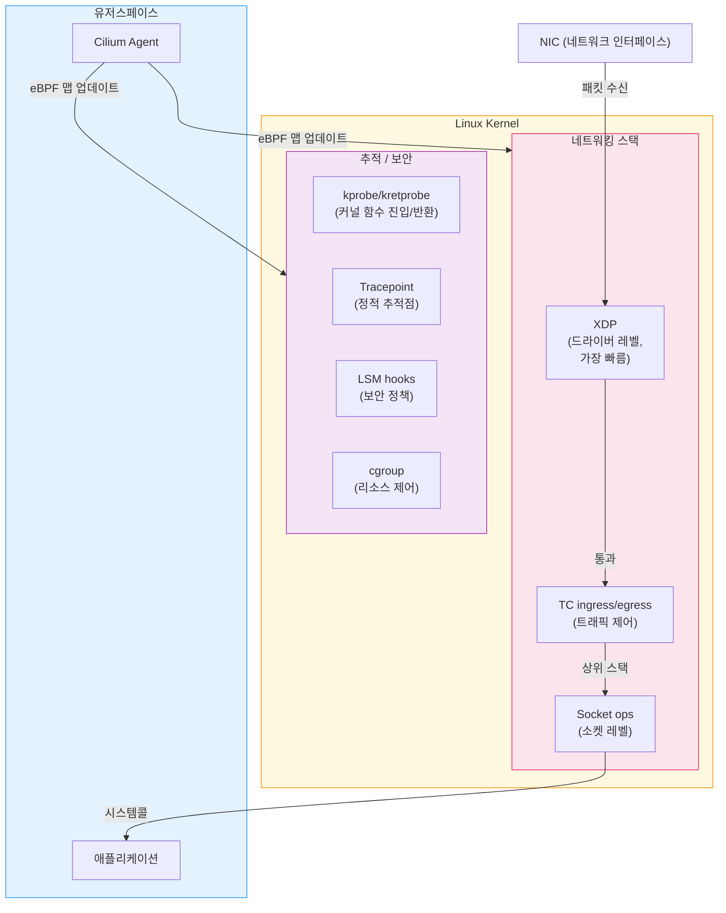
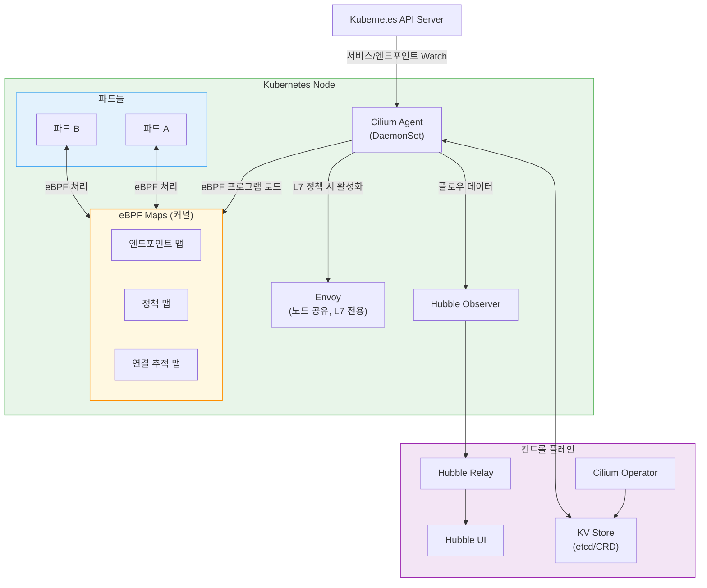
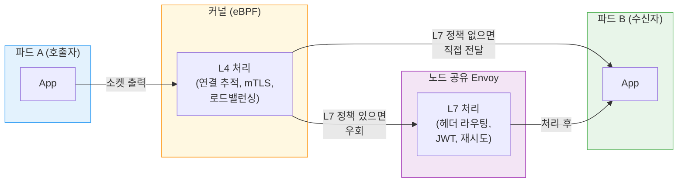
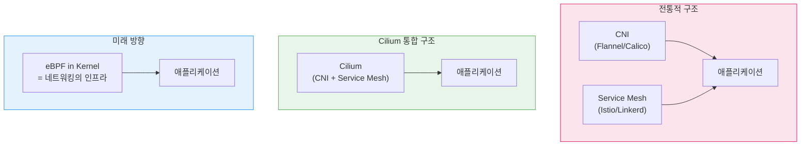

<!-- migrated: write/09_cloud/service-mesh/24-01.eBPF와 Cilium.md (2026-04-19) -->

# Ch24. eBPF와 Cilium Service Mesh

> **핵심 요약**
> eBPF는 커널을 재컴파일하지 않고 커널 안에서 프로그램을 안전하게 실행하는 기술이다. Cilium은 이 eBPF를 CNI와 서비스 메시 양쪽에 활용해 iptables 없는 고성능 네트워킹, 사이드카 없는 mTLS, L7 관측성을 단일 에이전트로 제공한다. 전통적 서비스 메시와 CNI의 경계를 허물고 있다는 점에서 Cilium은 단순한 도구가 아니라 Kubernetes 네트워킹의 패러다임 전환을 대표한다.

---

## 🎯 학습 목표

1. eBPF의 핵심 개념(검증기, 어태치 포인트, 맵)을 이해하고 설명할 수 있다.
2. eBPF가 iptables를 대체해 성능을 높이는 원리를 설명한다.
3. Cilium 아키텍처(에이전트, 오퍼레이터, Hubble)의 구성 요소별 역할을 안다.
4. Cilium의 L4(eBPF)와 L7(Envoy) 처리 계층 분리 방식을 이해한다.
5. Hubble로 클러스터 트래픽 흐름을 관측하는 방법을 파악한다.

---

## 1. eBPF란 무엇인가

### 1.1 커널 확장의 딜레마

운영체제 커널은 하드웨어를 추상화하고 프로세스 간 자원을 중재하는 핵심 소프트웨어다. 커널의 동작을 바꾸려면 전통적으로 두 가지 방법이 있었다. 하나는 커널 소스를 수정하고 재컴파일하는 방법인데 배포까지 수개월이 걸렸다. 다른 하나는 커널 모듈을 작성하는 방법인데 버그가 커널 전체를 패닉시킬 수 있어 위험했다.

eBPF(extended Berkeley Packet Filter)는 이 딜레마를 풀어낸다. 커널 소스 수정 없이, 모듈 특유의 위험 없이, 검증된 프로그램을 커널 이벤트에 붙여 실행한다. 운영체제를 다시 부팅하거나 서비스를 중단할 필요가 없다.

비유하자면, 커널은 도시 전체의 교통 시스템이고, 커널 모듈은 도로 설계를 바꾸는 공사다. eBPF는 신호등에 새 규칙을 동적으로 프로그래밍하는 것에 해당한다. 공사 없이 교통 흐름을 실시간으로 제어할 수 있다.

### 1.2 역사: BPF에서 eBPF로

1992년 Steven McCanne과 Van Jacobson이 발표한 BPF(Berkeley Packet Filter)는 tcpdump 같은 도구가 커널에서 패킷 필터링을 효율적으로 하기 위해 탄생했다. 당시 BPF는 패킷 캡처 전용의 단순한 가상 머신이었다.

2014년 Alexei Starovoitov가 eBPF를 Linux 커널 3.18에 병합했다. 레지스터 수가 2개에서 11개로 늘고, 64비트 지원, 맵(Map) 자료구조, 다양한 어태치 포인트가 추가되면서 eBPF는 패킷 필터를 넘어 범용 커널 프로그래밍 환경이 됐다. 현재 eBPF는 네트워킹, 보안, 성능 추적, 관측성 등 거의 모든 커널 기능에 걸쳐 사용된다.

### 1.3 eBPF의 세 가지 핵심 요소

**검증기(Verifier)**: eBPF 프로그램을 커널에 로드하기 전 정적 분석을 수행한다. 무한 루프, 범위 밖 메모리 접근, 초기화되지 않은 변수 사용을 거부한다. 이 검증 단계가 eBPF의 안전성을 보장한다. 검증기를 통과한 프로그램은 커널을 다운시킬 수 없다고 보장된다.

**JIT 컴파일러(Just-In-Time Compiler)**: 검증을 통과한 eBPF 바이트코드를 네이티브 기계어로 컴파일한다. 인터프리터 방식과 달리 네이티브 코드 실행 속도를 달성하므로 성능 오버헤드가 미미하다.

**맵(Map)**: eBPF 프로그램이 데이터를 저장하고 유저스페이스와 공유하는 자료구조다. 해시 맵, 배열, LRU 해시 등 여러 타입이 있으며, 커널과 유저스페이스 양쪽에서 읽고 쓸 수 있다. Cilium은 이 맵을 서비스 엔드포인트 테이블, 정책 테이블로 활용한다.

---

## 2. eBPF 어태치 포인트

eBPF 프로그램은 커널의 다양한 이벤트에 부착(attach)된다. 어디에 붙이느냐에 따라 처리할 수 있는 데이터와 행동이 달라진다.



**XDP(eXpress Data Path)**: 네트워크 드라이버 레벨에서 패킷을 처리한다. 커널 네트워크 스택에 진입하기 전이라 가장 빠르다. DDoS 차단처럼 단순하고 고속인 처리에 적합하다.

**TC(Traffic Control) ingress/egress**: 네트워크 인터페이스의 입출력 트래픽을 제어한다. XDP보다 더 많은 컨텍스트에 접근할 수 있어 Cilium의 주요 네트워킹 처리가 여기서 이루어진다.

**cgroup hooks**: 특정 cgroup(컨테이너)에 속한 소켓 연결을 제어한다. 파드 레벨의 트래픽 정책 적용에 활용된다.

**kprobe/tracepoint**: 커널 함수 호출 시점에 붙어 시스템 동작을 추적한다. Hubble이 L7 프로토콜 정보를 수집할 때 활용한다.

---

## 3. eBPF로 iptables를 대체하는 원리

### 3.1 iptables의 한계

전통적인 Kubernetes에서 kube-proxy는 iptables 규칙으로 서비스 로드 밸런싱을 구현한다. 서비스가 1개 추가될 때마다 수십 개의 iptables 체인 규칙이 추가된다. 서비스 1,000개 환경에서 iptables 규칙은 수만 개가 된다.

iptables 규칙 평가는 선형 탐색이다. 패킷 하나가 들어올 때마다 체인의 맨 위부터 순서대로 규칙을 비교한다. 규칙 수가 많아질수록 평가 시간도 비례해 늘어난다. Netflix가 2022년 공개한 자료에 따르면, 서비스 수가 수천 개인 클러스터에서 kube-proxy의 iptables 업데이트 지연이 수 분에 달하는 사례도 있었다.

### 3.2 eBPF 맵의 O(1) 처리

Cilium은 iptables 대신 eBPF 해시 맵을 사용한다. 서비스 IP와 포트를 키로, 백엔드 엔드포인트 목록을 값으로 저장한다. 패킷이 들어오면 TC 훅의 eBPF 프로그램이 맵을 O(1) 해시 조회로 백엔드를 찾아 직접 DNAT한다. 서비스가 1,000개든 10,000개든 조회 시간은 동일하다.

```
# iptables 방식 (선형)
규칙 1 → 규칙 2 → ... → 규칙 10,000 → 매칭

# eBPF 맵 방식 (해시)
hash(destIP:port) → 즉시 백엔드 조회
```

엔드포인트 업데이트도 빠르다. Cilium 에이전트가 맵 엔트리 하나를 갱신하면 즉시 반영된다. 수천 개 iptables 규칙을 재작성하는 iptables-restore 방식과 달리 원자적 업데이트가 가능하다.

### 3.3 소켓 레벨 가속

같은 노드 안의 파드 간 통신에서는 eBPF의 소켓 레벨 단축 경로(socket-level shortcut)를 사용한다. 패킷이 네트워크 스택을 올라갔다 내려오는 과정 없이 소켓 버퍼에서 직접 다른 소켓 버퍼로 전달된다. 노드 내 파드 간 통신 레이턴시를 크게 줄인다.

---

## 4. Cilium 아키텍처



### 4.1 Cilium Agent (DaemonSet)

노드마다 하나씩 실행되는 Cilium Agent는 Cilium의 두뇌다. Kubernetes API 서버를 감시해 파드, 서비스, 엔드포인트, NetworkPolicy 변경을 감지한다. 변경이 감지되면 대응하는 eBPF 프로그램을 컴파일하고 커널에 로드하며 eBPF 맵을 업데이트한다.

Agent는 또한 각 파드의 네트워크 네임스페이스에 veth 인터페이스를 설정하고, 해당 인터페이스의 TC 훅에 eBPF 프로그램을 부착한다. 이 과정이 CNI 플러그인으로서의 역할이다.

### 4.2 Cilium Operator

클러스터 전체 수준의 작업을 담당한다. 노드 IP 주소 관리(IPAM), CiliumNetworkPolicy의 클러스터 전파, Kubernetes 오브젝트와 Cilium 내부 상태 동기화를 처리한다. 클러스터당 하나만 실행되며 Agent와 달리 DaemonSet이 아닌 Deployment로 배포된다.

### 4.3 Hubble: 관측성 계층

Hubble은 Cilium의 관측성 컴포넌트다. eBPF 훅에서 수집한 네트워크 플로우 데이터를 처리한다. 사이드카 없이도 L3/L4/L7 트래픽 정보를 수집할 수 있다는 점이 Hubble의 핵심 강점이다.

Hubble은 세 컴포넌트로 구성된다. 각 노드의 Hubble Observer는 로컬 eBPF 이벤트를 수집한다. Hubble Relay는 모든 노드의 Observer 데이터를 집계한다. Hubble UI는 서비스 의존성 그래프와 플로우 필터링 인터페이스를 제공한다.

---

## 5. Cilium Service Mesh

### 5.1 두 계층의 분리

Cilium의 서비스 메시는 L4와 L7을 명확히 분리해 처리한다. 이 설계가 Cilium의 성능 특성을 결정짓는 핵심이다.

**L4 계층 (eBPF)**: TCP/UDP 연결, 포트 기반 정책, 로드 밸런싱, WireGuard/IPsec 기반 암호화를 eBPF가 처리한다. 유저스페이스 프록시를 거치지 않으므로 오버헤드가 거의 없다. mTLS도 WireGuard를 사용하면 커널 레벨에서 처리할 수 있다.

**L7 계층 (노드 공유 Envoy)**: HTTP 헤더 기반 라우팅, gRPC 트랜스코딩, JWT 검증 같은 L7 기능은 커널만으로 처리할 수 없다. 이 경우 Cilium은 노드에 하나의 Envoy 인스턴스를 실행해 L7 처리를 위임한다. 사이드카와의 차이는 이 Envoy가 파드별이 아닌 노드 공유라는 점이다. 노드에 50개 파드가 있어도 Envoy 인스턴스는 하나다.



### 5.2 CiliumNetworkPolicy

Cilium의 정책 CRD는 Kubernetes 기본 NetworkPolicy보다 표현력이 높다. L3(IP/CIDR), L4(포트/프로토콜), L7(HTTP 경로, 메서드, 헤더) 규칙을 하나의 CRD에 선언한다.

```yaml
apiVersion: cilium.io/v2
kind: CiliumNetworkPolicy
metadata:
  name: allow-payment-api
spec:
  endpointSelector:
    matchLabels:
      app: payment
  ingress:
    - fromEndpoints:
        - matchLabels:
            app: checkout
      toPorts:
        - ports:
            - port: "8080"
              protocol: TCP
          rules:
            http:
              - method: POST
                path: /api/v1/pay
```

이 정책은 `checkout` 파드만 `payment` 파드의 `/api/v1/pay` POST 엔드포인트를 호출할 수 있도록 제한한다. L7 규칙이 포함되어 있으므로 해당 파드 쌍의 트래픽은 노드 Envoy를 경유한다. L7 규칙이 없다면 순수 eBPF로 처리된다.

### 5.3 Gateway API 지원

Cilium은 Kubernetes Gateway API의 HTTPRoute, TLSRoute, GRPCRoute를 지원한다. Envoy를 Gateway 구현체로 사용하며, CiliumNetworkPolicy와 조합해 인그레스와 내부 트래픽 관리를 통합한다.

```bash
# Cilium Gateway API 활성화
cilium install --set gatewayAPI.enabled=true

# HTTPRoute 예시
kubectl apply -f - <<EOF
apiVersion: gateway.networking.k8s.io/v1
kind: HTTPRoute
metadata:
  name: payment-route
spec:
  parentRefs:
    - name: cilium-gateway
  rules:
    - matches:
        - path:
            type: PathPrefix
            value: /api/v1/pay
      backendRefs:
        - name: payment-svc
          port: 8080
EOF
```

---

## 6. Hubble 관측성

Hubble은 eBPF의 관측성 능력을 사용자 친화적 인터페이스로 제공한다. 사이드카 없이도 다음 정보를 수집한다.

- L3: 소스/목적지 IP, 프로토콜
- L4: 포트, TCP 상태(SYN, FIN, RST)
- L7: HTTP 메서드, URL, 상태 코드, gRPC 서비스/메서드, DNS 쿼리

### 6.1 Hubble CLI

```bash
# 특정 파드의 트래픽 관측
hubble observe --pod payment --follow

# HTTP 5xx 에러만 필터링
hubble observe --http-status 5xx --last 100

# 서비스 간 흐름 요약
hubble observe --from-service checkout --to-service payment

# L7 상세 정보 포함
hubble observe --pod payment --protocol HTTP --output json | jq '.flow.l7'
```

### 6.2 Hubble UI 서비스 맵

Hubble UI는 네임스페이스 내 서비스 간 의존성을 실시간 그래프로 시각화한다. 노드 간 엣지에는 초당 요청 수와 오류율이 표시된다. Istio의 Kiali와 유사한 기능이지만 사이드카 없이 동작한다는 점이 다르다.

```bash
# Hubble UI 포트 포워딩
cilium hubble ui

# Hubble Relay를 통한 클러스터 전체 관측
kubectl port-forward -n kube-system svc/hubble-relay 4245:80
```

### 6.3 Prometheus 메트릭

Cilium과 Hubble은 Prometheus 메트릭을 기본 제공한다.

```
# 서비스 간 HTTP 요청 비율
hubble_flows_processed_total{direction="egress",protocol="TCP",subtype="HTTP"}

# 정책에 의해 차단된 패킷
cilium_drop_count_total{reason="Policy denied"}

# 엔드포인트 상태
cilium_endpoint_state{state="ready"}
```

---

## 7. Cilium vs 전통적 서비스 메시 비교

### 7.1 장점

**사이드카 없음**: 파드마다 프록시를 주입하지 않아 파드 시작 속도가 빠르고 메모리 오버헤드가 낮다. 1,000개 파드 클러스터에서 사이드카 대비 수십 GB 메모리를 절약한다.

**CNI와 메시 통합**: 별도 서비스 메시를 추가 설치하지 않고 CNI 레벨에서 mTLS와 L7 정책을 함께 처리한다. 운영 포인트가 줄어들고 네트워크 스택이 단순해진다.

**iptables 없음**: O(1) eBPF 맵 조회로 서비스 수에 무관한 일정한 성능을 제공한다. 서비스 수천 개 환경에서 kube-proxy 대비 성능 차이가 드러난다.

**커널 레벨 관측성**: 사이드카 없이도 L7까지 관측하므로 레거시 파드(메시 주입 불가)도 Hubble로 트래픽을 추적할 수 있다.

### 7.2 한계

**Linux 커널 5.10+ 필수**: GKE Autopilot, 일부 온프레미스 배포처럼 커널 버전을 제어할 수 없는 환경에서는 도입이 어렵다. EKS의 경우 Amazon Linux 2023나 Bottlerocket이라면 5.10+를 보장하지만, Amazon Linux 2는 커널 5.10 이상 확인이 필요하다.

**L7 기능 성숙도**: Istio에 비해 L7 트래픽 관리 기능(세밀한 재시도 정책, 트래픽 미러링, 헤더 조작)이 덜 성숙하다. 2025년 기준 빠르게 개선 중이나, 복잡한 트래픽 관리가 필요한 경우 Istio가 여전히 앞선다.

**Cilium CNI 종속**: 서비스 메시로 Cilium을 선택하면 CNI도 Cilium이어야 한다. 기존에 다른 CNI(Flannel, Calico)를 사용 중이라면 마이그레이션 비용이 발생한다.

**eBPF 디버깅 복잡성**: eBPF 레벨 문제는 `bpftool`이나 `bpf_printk`로 디버깅해야 한다. 유저스페이스 프록시 로그보다 접근이 어렵고 전문 지식이 필요하다.

---

## 8. Cilium의 시장 위치

CNCF가 2025년 발표한 연간 설문조사에 따르면 Cilium CNI의 채택률이 50%를 넘어섰다. Flannel과 Calico를 제치고 가장 많이 사용되는 CNI가 됐다. 이 채택률은 서비스 메시 시장에도 직접적인 영향을 준다. 이미 Cilium CNI를 사용 중인 조직은 별도 서비스 메시 없이 Cilium의 L7 기능을 활성화하는 경로가 자연스럽기 때문이다.

이 흐름은 CNI와 서비스 메시의 경계를 허무는 방향을 가리킨다. 전통적으로 CNI(네트워킹)와 서비스 메시(보안/관측성/트래픽 관리)는 별개의 레이어였다. Cilium은 두 역할을 하나로 합친다. 이 접근이 성공적으로 자리잡으면 서비스 메시는 별도 설치하는 소프트웨어가 아니라 Kubernetes 네트워크 플러그인에 내장되는 기능으로 변화할 수 있다.



---

## 면접 대비

**Q1. eBPF 검증기(Verifier)가 보장하는 것과 보장하지 않는 것은?**

eBPF 검증기는 프로그램이 무한 루프를 가지지 않음(유한한 명령 수), 범위 밖 메모리에 접근하지 않음, 초기화되지 않은 포인터를 역참조하지 않음을 정적 분석으로 보장한다. 이 덕분에 eBPF 프로그램이 커널을 패닉시키거나 무한 대기 상태로 만들 수 없다. 그러나 검증기는 프로그램의 논리적 정확성을 보장하지 않는다. eBPF 프로그램이 잘못된 패킷 드롭 결정을 하거나 틀린 정책을 적용해도 검증기는 이를 감지하지 못한다.

**Q2. Cilium이 iptables보다 고성능인 이유를 데이터 구조 관점에서 설명하면?**

iptables는 체인 형태의 선형 자료구조로, 패킷이 들어올 때마다 첫 규칙부터 순서대로 비교한다. 규칙 N개 환경에서 평균 N/2번 비교가 필요하므로 O(N) 시간 복잡도다. Cilium의 eBPF 해시 맵은 목적지 IP와 포트를 해시 키로 백엔드를 즉시 조회한다. 해시 충돌이 적다면 O(1)에 가까운 조회 속도를 낸다. 서비스 수가 수천 개인 클러스터에서 이 차이는 수 밀리초 규모의 레이턴시 차이로 나타난다.

**Q3. Cilium의 L4 처리와 L7 처리를 어떻게 분리하고, 언제 Envoy가 활성화되는가?**

기본적으로 모든 트래픽은 eBPF TC 훅에서 L4(TCP/UDP) 레벨로 처리된다. CiliumNetworkPolicy에 L7 규칙(HTTP 경로, 메서드, gRPC 서비스)이 포함되거나, HTTPRoute 같은 Gateway API 규칙이 적용된 파드 쌍의 트래픽만 노드 공유 Envoy로 리디렉션된다. Envoy는 파드별 사이드카가 아니라 노드당 하나만 실행되므로, L7 Envoy를 사용하는 파드가 50개 있어도 Envoy 프로세스는 하나다. L7 규칙이 없는 파드 쌍은 계속 순수 eBPF로 처리된다.

**Q4. Hubble이 사이드카 없이 L7 정보를 수집할 수 있는 원리는?**

Hubble은 eBPF kprobe와 tracepoint를 커널의 소켓 시스템콜 경로에 부착한다. HTTP 파싱은 eBPF 프로그램이 직접 수행하는 것이 아니라, 트래픽이 Cilium의 노드 Envoy를 경유할 때 Envoy가 파싱한 L7 정보를 Hubble Observer가 수신하는 방식이다. L7 정책이 없어 Envoy를 거치지 않는 트래픽은 L4 정보(IP, 포트, 연결 상태)만 수집된다. 결과적으로 L7 정보는 L7 정책이 활성화된 서비스에서만 완전하게 수집된다.

**Q5. Cilium CNI 도입 시 기존 Calico에서 마이그레이션 절차의 핵심 위험은?**

CNI 교체는 노드의 모든 파드 네트워크 재구성을 의미한다. 가장 안전한 방법은 새 노드 그룹을 Cilium으로 프로비저닝하고, 기존 Calico 노드의 워크로드를 새 노드로 이동한 뒤, 기존 노드를 제거하는 롤링 마이그레이션이다. 가장 큰 위험은 두 CNI가 동시에 활성화된 혼재 상태에서 파드 간 통신이 끊기는 것이다. 노드 간 CIDR 충돌이나 iptables와 eBPF 규칙이 충돌하는 경우도 발생한다. 따라서 프로덕션 마이그레이션 전 동일 스펙의 스테이징 클러스터에서 완전한 검증이 필수다.

---

## 체크리스트

- [ ] eBPF 검증기가 프로그램 안전성을 보장하는 방식을 설명할 수 있다
- [ ] XDP, TC, cgroup 훅의 차이와 각 적용 사례를 이해한다
- [ ] iptables 선형 탐색 vs eBPF 해시 맵 O(1) 조회 차이를 설명할 수 있다
- [ ] Cilium Agent, Operator, Hubble의 역할을 구분한다
- [ ] L4(eBPF)와 L7(노드 Envoy)이 분리되는 조건을 이해한다
- [ ] `hubble observe` 명령으로 특정 파드의 L7 트래픽을 필터링할 수 있다
- [ ] Cilium CNI 마이그레이션의 핵심 위험을 설명할 수 있다

---

## 참고 자료

- [eBPF 공식 사이트](https://ebpf.io/what-is-ebpf/)
- [Cilium 공식 문서](https://docs.cilium.io/en/stable/)
- [Hubble 관측성 가이드](https://docs.cilium.io/en/stable/observability/hubble/)
- [Brendan Gregg: eBPF Tracing Tools](https://www.brendangregg.com/ebpf.html)
- [CNCF Annual Survey 2025](https://www.cncf.io/reports/cncf-annual-survey-2024/)
- [Cilium Service Mesh Without Sidecars](https://cilium.io/blog/2021/12/01/cilium-service-mesh-beta/)
