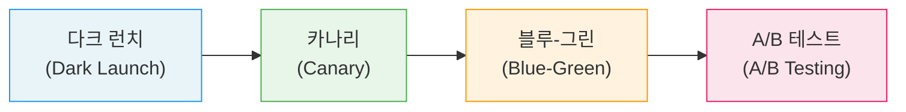
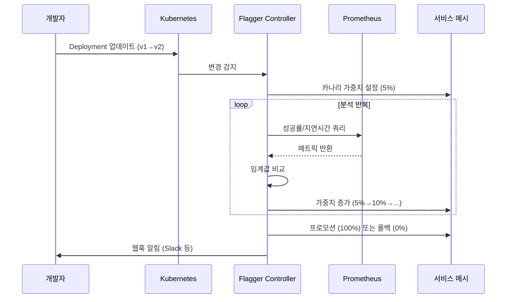
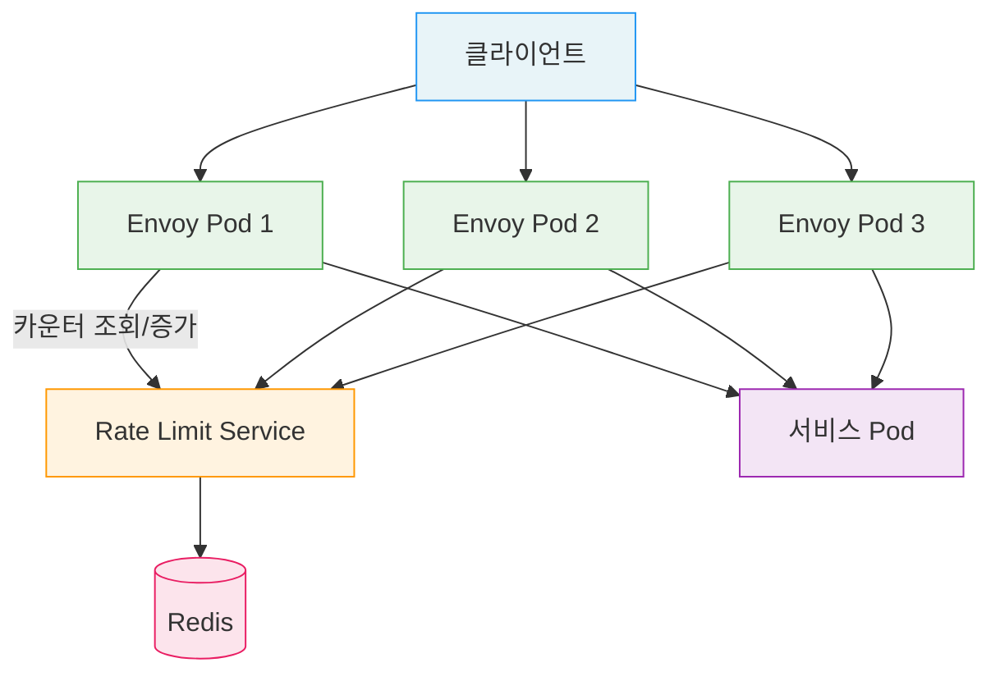
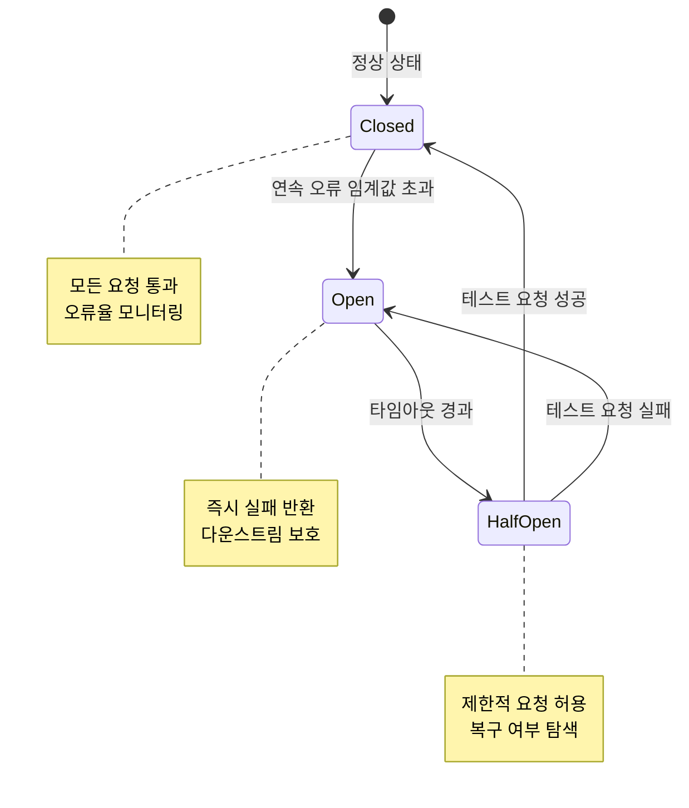

<!-- migrated: write/09_cloud/service-mesh/25-01.프로덕션 패턴.md (2026-04-19) -->

# Ch25. 프로덕션 패턴

> 📌 **핵심 요약**: 프로덕션 서비스 메시는 설치가 끝이 아니라 시작이다. 트래픽을 안전하게 전환하고, 장애를 격리하며, 신뢰성을 지표로 측정하는 패턴들이 메시의 진짜 가치를 만들어낸다. 이 챕터는 카나리 배포부터 카오스 엔지니어링까지, 서비스 메시가 프로덕션에서 어떻게 활용되는지를 다룬다.

---

## 🎯 학습 목표

1. Progressive Delivery의 네 가지 전략(카나리, 블루-그린, A/B 테스트, 다크 런치)을 구별하고 적합한 상황에 선택할 수 있다
2. Flagger의 자동 카나리 분석 워크플로우를 이해하고 `Canary` CRD를 작성할 수 있다
3. Istio와 Linkerd에서 서킷 브레이커와 타임아웃/재시도 전략을 설정할 수 있다
4. 글로벌 레이트 리미팅과 로컬 레이트 리미팅의 차이를 설명하고 구성할 수 있다
5. Istio 폴트 인젝션으로 카오스 엔지니어링을 수행하고 복원력을 검증할 수 있다
6. 프로덕션 준비 체크리스트를 적용해 메시 환경의 안전성을 평가할 수 있다

---

## 19.1 Progressive Delivery: 배포를 실험으로 만들기

전통적인 배포는 "모 아니면 도"였다. 새 버전을 올리거나 올리지 않거나. 하지만 서비스 메시는 트래픽 분배를 세밀하게 제어할 수 있어서 배포를 하나의 실험 과정으로 바꿀 수 있다. 이 접근을 **Progressive Delivery**라고 부른다.



각 전략은 위험을 관리하는 방식이 다르다. 다크 런치는 실제 사용자에게 영향을 주지 않으면서 새 버전을 테스트하고, 카나리는 소수 사용자부터 점진적으로 노출을 늘린다. 블루-그린은 순간 전환이 필요할 때, A/B 테스트는 두 버전의 비즈니스 효과를 비교할 때 선택한다.

### 카나리 배포 (Canary Deployment)

카나리는 19세기 광부들이 독가스를 감지하기 위해 탄광에 카나리아 새를 데리고 들어간 데서 유래했다. 소수의 트래픽이 새 버전에 먼저 노출되어 문제를 조기에 발견한다.

트래픽 전환 단계는 보통 `1% → 5% → 25% → 100%`로 진행한다. 각 단계에서 에러율, 지연 시간, 요청 성공률 같은 지표를 관찰한 뒤 임계값을 통과하면 다음 단계로 이동한다. 문제가 발견되면 전환을 중단하고 이전 버전으로 돌아간다.

Istio에서 카나리는 `VirtualService`의 가중치 라우팅으로 구현한다.

```yaml
# Istio 카나리 라우팅 예시
apiVersion: networking.istio.io/v1beta1
kind: VirtualService
metadata:
  name: payment-service
spec:
  http:
    - route:
        - destination:
            host: payment-service
            subset: stable
          weight: 95
        - destination:
            host: payment-service
            subset: canary
          weight: 5
```

Linkerd는 `TrafficSplit`(SMI) 또는 HTTPRoute(Gateway API)로 동일한 결과를 달성한다. 어떤 도구를 쓰든 핵심은 트래픽 비율을 코드가 아닌 컨트롤 플레인에서 제어한다는 점이다.

### 블루-그린 배포 (Blue-Green Deployment)

블루-그린은 두 개의 동일한 환경을 유지하고 순간적으로 전환한다. 블루가 현재 프로덕션이라면 그린에 새 버전을 배포하고, 테스트 후 트래픽 전체를 그린으로 전환한다.

카나리와 비교하면 블루-그린의 장점은 롤백 속도다. 문제 발생 시 단 몇 초 만에 블루로 돌아올 수 있다. 반면 두 환경을 동시에 운영해야 하므로 리소스 비용이 두 배가 된다는 단점이 있다. 데이터베이스 마이그레이션이 포함된 경우 두 버전이 동시에 같은 DB를 사용해야 하므로 스키마 변경이 복잡해진다.

### A/B 테스트

A/B 테스트는 트래픽 비율이 아닌 **사용자 특성**을 기반으로 라우팅한다. 예를 들어 특정 쿠키를 가진 사용자, 특정 지역의 사용자, 또는 베타 테스터 그룹에게만 새 버전을 보여준다.

```yaml
# Istio A/B 테스트 — 헤더 기반 라우팅
apiVersion: networking.istio.io/v1beta1
kind: VirtualService
metadata:
  name: checkout-service
spec:
  http:
    - match:
        - headers:
            x-user-group:
              exact: beta
      route:
        - destination:
            host: checkout-service
            subset: v2
    - route:
        - destination:
            host: checkout-service
            subset: v1
```

A/B 테스트는 비즈니스 메트릭(전환율, 체류 시간, 클릭률)을 비교하는 것이 목적이므로, 기술 지표만이 아니라 제품 분석 도구와 연동하는 것이 일반적이다.

### 다크 런치 (Dark Launch / Traffic Mirroring)

다크 런치는 실제 요청을 새 버전에 **복사**해서 보내되, 응답은 사용자에게 반환하지 않는 방식이다. 새 버전은 실제 트래픽을 처리하지만 결과는 버려진다. 이를 통해 실제 부하 조건에서 새 버전의 동작을 관찰할 수 있다.

```yaml
# Istio 트래픽 미러링
apiVersion: networking.istio.io/v1beta1
kind: VirtualService
metadata:
  name: product-service
spec:
  http:
    - route:
        - destination:
            host: product-service
            subset: v1
      mirror:
        host: product-service
        subset: v2
      mirrorPercentage:
        value: 100
```

다크 런치의 비유: 새 직원을 실제 고객에게 투입하기 전에 베테랑 직원 옆에서 섀도잉하게 하는 것과 같다. 실수를 해도 고객에게 영향을 주지 않는다.

---

## 19.2 Flagger: 자동화된 카나리 분석

카나리 배포를 수동으로 관리하는 것은 번거롭다. 지표를 계속 모니터링하고, 임계값을 넘으면 롤백하는 작업을 사람이 직접 해야 한다. Flagger는 이 과정을 자동화하는 CNCF 졸업 프로젝트다.

### Flagger의 동작 원리



Flagger는 Deployment 변경을 감지하면 자동으로 카나리 Deployment를 생성하고, 메시의 라우팅 설정을 업데이트하며, Prometheus에서 메트릭을 수집해 분석을 반복한다. 임계값을 통과하면 프로모션, 실패하면 롤백을 자동으로 수행한다.

### Canary CRD

Flagger의 핵심 리소스는 `Canary` CRD다. 아래는 Linkerd와 함께 사용하는 예시다.

```yaml
apiVersion: flagger.app/v1beta1
kind: Canary
metadata:
  name: payment-service
  namespace: production
spec:
  # 대상 Deployment
  targetRef:
    apiVersion: apps/v1
    kind: Deployment
    name: payment-service

  # 프로그레시브 딜리버리 설정
  progressDeadlineSeconds: 600

  service:
    port: 8080
    targetPort: 8080

  analysis:
    # 분석 주기: 60초마다 실행
    interval: 60s
    # 롤백 전 최대 실패 횟수
    threshold: 5
    # 최대 가중치 (프로모션 전)
    maxWeight: 50
    # 한 번에 증가하는 가중치
    stepWeight: 10

    # 성공 기준 메트릭
    metrics:
      - name: request-success-rate
        # Linkerd 기본 메트릭 사용
        thresholdRange:
          min: 99
        interval: 1m
      - name: request-duration
        thresholdRange:
          max: 500
        interval: 1m

    # 웹훅 — Slack 알림
    webhooks:
      - name: notify-slack
        type: event
        url: https://hooks.slack.com/services/...
```

이 설정에 따르면 Flagger는 60초마다 성공률(99% 이상)과 응답 시간(500ms 이하)을 확인하면서 트래픽을 10%씩 늘린다. 5번 실패하면 자동으로 롤백하고 Slack에 알림을 보낸다.

### Istio와 Flagger 연동

Istio를 사용하는 경우 Flagger는 `VirtualService`를 자동으로 관리한다. 개발자는 Deployment만 업데이트하면 되고, Flagger가 VirtualService의 가중치를 단계적으로 조정한다. 이 방식의 장점은 카나리 과정이 Git에 커밋된 VirtualService 파일과 무관하게 진행된다는 점이다 — Flagger가 런타임에 동적으로 관리한다.

Flagger는 Istio, Linkerd, App Mesh, Gateway API, Kuma를 지원하므로 메시를 교체해도 Canary CRD는 그대로 재사용할 수 있다.

---

## 19.3 레이트 리미팅: 과부하에서 서비스 보호하기

레이트 리미팅은 일정 시간 동안 처리할 수 있는 요청 수를 제한하는 패턴이다. 비유하자면, 콘서트장 입구에서 한 번에 들어갈 수 있는 인원을 제한하는 것과 같다. 너무 많은 사람이 동시에 들어오면 혼잡해지고, 결국 모두에게 나쁜 경험을 주기 때문이다.

### 로컬 vs 글로벌 레이트 리미팅

**로컬 레이트 리미팅**은 각 Envoy 프록시 인스턴스가 독립적으로 제한을 적용한다. 구성이 단순하고 중앙 집중식 서비스가 필요 없다는 장점이 있다. 하지만 Pod가 3개라면 실제로는 설정값의 3배 트래픽을 허용하게 되는 단점이 있다.

**글로벌 레이트 리미팅**은 중앙 집중식 레이트 리밋 서비스를 통해 전체 트래픽을 일관되게 제어한다. Envoy의 글로벌 레이트 리미팅은 Redis를 백엔드로 사용하는 `ratelimit` 서비스와 연동한다.



### Istio에서 글로벌 레이트 리미팅 설정

Istio 자체에는 레이트 리미팅 기능이 없고, Envoy의 글로벌 레이트 리밋 기능을 `EnvoyFilter`를 통해 활성화해야 한다. 설정이 복잡한 편이어서, 실제로는 Ingress Gateway 레벨에 적용하는 경우가 많다.

```yaml
# ratelimit ConfigMap (Envoy ratelimit 서비스 설정)
apiVersion: v1
kind: ConfigMap
metadata:
  name: ratelimit-config
data:
  config.yaml: |
    domain: production-ratelimit
    descriptors:
      - key: remote_address
        rate_limit:
          unit: minute
          requests_per_unit: 1000
      - key: header_match
        value: premium
        rate_limit:
          unit: minute
          requests_per_unit: 5000
```

프리미엄 사용자에게는 더 높은 한도를 적용하는 차등 레이트 리미팅도 가능하다. 이처럼 비즈니스 로직에 따른 트래픽 제어가 서비스 코드 변경 없이 메시 수준에서 이루어진다.

### Linkerd와 레이트 리미팅

Linkerd는 네이티브 레이트 리미팅을 제공하지 않는다. 대신 재시도 예산(Retry Budget)이 간접적인 보호 역할을 하고, 레이트 리미팅이 필요하다면 Ingress Controller(Nginx, Traefik) 수준에서 적용하거나 애플리케이션 레이어에서 처리해야 한다.

---

## 19.4 서킷 브레이커: 장애 전파 차단

전기 회로에서 과부하가 걸리면 차단기(Circuit Breaker)가 작동해 전체 시스템을 보호한다. 마이크로서비스에서도 같은 개념을 적용한다. 다운스트림 서비스에 문제가 생겼을 때 무한정 요청을 보내는 대신, 잠시 연결을 끊어 전체 시스템이 연쇄 장애로 빠지는 것을 막는다.

### 서킷 브레이커의 세 가지 상태



**Closed (닫힘)**: 정상 상태. 모든 요청이 통과하고 오류를 카운팅한다.
**Open (열림)**: 오류가 임계값을 초과하면 회로가 열린다. 새 요청은 다운스트림 서비스에 도달하지 않고 즉시 실패 응답을 받는다.
**Half-Open (반열림)**: 일정 시간이 지나면 소량의 요청을 허용해 서비스가 복구되었는지 확인한다.

### Istio의 Outlier Detection

Istio에서 서킷 브레이커는 `DestinationRule`의 `outlierDetection`으로 구현한다.

```yaml
apiVersion: networking.istio.io/v1beta1
kind: DestinationRule
metadata:
  name: order-service
spec:
  host: order-service
  trafficPolicy:
    outlierDetection:
      # 5번 연속 5xx 오류 발생 시 방출
      consecutiveGatewayErrors: 5
      # 분석 주기
      interval: 10s
      # 방출 후 격리 기간
      baseEjectionTime: 30s
      # 최대 방출 비율 (전체 엔드포인트 중)
      maxEjectionPercent: 50
    # 벌크헤드 패턴: 연결 풀 제한
    connectionPool:
      tcp:
        maxConnections: 100
      http:
        http1MaxPendingRequests: 50
        http2MaxRequests: 100
```

`outlierDetection`은 Pod 단위로 동작한다. 특정 Pod에서 연속으로 오류가 발생하면 해당 Pod를 로드밸런서 풀에서 일시적으로 제거한다. 이것이 Envoy의 Outlier Detection이고, 고전적인 서킷 브레이커 개념과 유사하다.

### Linkerd의 암묵적 서킷 브레이킹

Linkerd에는 명시적인 서킷 브레이커 설정이 없다. 대신 **재시도 예산(Retry Budget)**이 간접적인 보호 역할을 한다. Linkerd의 기본 재시도 예산은 전체 요청의 20%로 제한되어 있어서, 장애 상황에서 재시도로 인한 증폭 현상(retry storm)을 방지한다.

또한 Linkerd는 P2C(Power of Two Choices) 알고리즘으로 부하를 분산해, 느린 Pod로 요청이 집중되는 것을 자동으로 방지한다.

### 벌크헤드 패턴 (Bulkhead)

벌크헤드는 선박의 격벽에서 유래한 개념이다. 선박이 일부 구역에 물이 차도 전체가 가라앉지 않도록 격벽으로 나눈다. 마이크로서비스에서는 연결 풀을 서비스별로 분리해 한 서비스의 장애가 다른 서비스의 스레드/연결을 고갈시키지 못하도록 막는다.

Istio의 `connectionPool` 설정이 바로 이 역할을 한다. `http1MaxPendingRequests: 50`이면 해당 서비스를 향한 대기 요청이 50개를 초과하는 순간 새 요청은 즉시 거부된다.

---

## 19.5 타임아웃과 재시도 전략

### 타임아웃 예산 (Timeout Budget)

분산 시스템에서 타임아웃 설정은 생각보다 복잡하다. 클라이언트 A가 서비스 B를 호출하고, B가 다시 C를 호출하는 3단계 체인을 생각해보자. A의 타임아웃을 10초로 설정했는데, B→C 호출의 타임아웃도 10초라면 A는 타임아웃이 발생해도 B와 C는 계속 요청을 처리하고 있다는 모순이 생긴다.

이를 해결하는 것이 **타임아웃 예산** 개념이다. 각 홉의 타임아웃 합산이 전체 엔드투엔드 타임아웃보다 작아야 한다.

```
엔드투엔드 타임아웃: 10초
  └─ A → B 타임아웃: 8초
       └─ B → C 타임아웃: 6초
            └─ C → DB 타임아웃: 4초
```

Istio에서는 서비스별로 타임아웃을 VirtualService에 설정한다.

```yaml
apiVersion: networking.istio.io/v1beta1
kind: VirtualService
metadata:
  name: inventory-service
spec:
  http:
    - timeout: 6s
      retries:
        attempts: 3
        perTryTimeout: 2s
        retryOn: gateway-error,reset,connect-failure,retriable-4xx
      route:
        - destination:
            host: inventory-service
```

### 재시도 예산과 재시도 폭풍

재시도는 일시적 오류를 자동으로 처리하는 강력한 도구다. 하지만 무분별한 재시도는 오히려 시스템을 더 나쁘게 만든다. 서비스 A가 B를 3번 재시도하고, B가 다시 C를 3번 재시도하면 C는 원래보다 9배의 요청을 받게 된다. 이를 재시도 폭풍(Retry Storm)이라고 한다.

Linkerd는 이를 재시도 예산으로 해결한다. 전체 요청의 20%를 초과하는 재시도는 자동으로 차단되어, 재시도 폭풍이 발생할 수 없다.

### 헤지드 요청 (Hedged Requests)

헤지드 요청은 같은 요청을 여러 인스턴스에 동시에 보내고, 가장 먼저 응답한 것을 사용하는 패턴이다. 꼬리 지연(Tail Latency)을 줄이는 데 효과적이다. 예를 들어 P99 지연이 높은 서비스라면, 두 번째 요청을 50ms 후에 추가로 보내서 둘 중 빠른 응답을 받는다. 비용은 약간 늘어나지만 사용자 경험이 크게 개선된다.

서비스 메시 수준에서 헤지드 요청을 지원하는 구현은 아직 제한적이지만, 애플리케이션 라이브러리(gRPC, Finagle)에서는 이미 사용 중이다.

---

## 19.6 카오스 엔지니어링과 서비스 메시

카오스 엔지니어링은 의도적으로 장애를 만들어 시스템의 복원력을 검증하는 방법론이다. Netflix의 Chaos Monkey가 대표적이다. 서비스 메시는 애플리케이션 코드를 건드리지 않고 실제와 동일한 조건에서 장애를 주입할 수 있어서 카오스 엔지니어링의 이상적인 도구가 된다.

### Istio 폴트 인젝션

```yaml
apiVersion: networking.istio.io/v1beta1
kind: VirtualService
metadata:
  name: payment-service-chaos
spec:
  http:
    - fault:
        # 지연 인젝션: 10%의 요청에 5초 지연 추가
        delay:
          percentage:
            value: 10
          fixedDelay: 5s
        # 오류 인젝션: 5%의 요청에 503 오류 반환
        abort:
          percentage:
            value: 5
          httpStatus: 503
      route:
        - destination:
            host: payment-service
```

이 설정 하나로 실제 결제 서비스 코드를 한 줄도 바꾸지 않고 네트워크 지연과 서비스 오류를 시뮬레이션할 수 있다. 이를 통해 서킷 브레이커가 올바르게 동작하는지, 타임아웃 설정이 적절한지, 재시도 로직이 의도대로 작동하는지 검증한다.

### 카오스 엔지니어링 시나리오

**시나리오 1: 지연 테스트**
결제 서비스에 3초 지연을 주입한다. 주문 서비스의 타임아웃이 2초라면 즉시 오류가 발생해야 한다. 만약 오류가 발생하지 않는다면 타임아웃 설정이 누락된 것이다.

**시나리오 2: 부분 장애 테스트**
재고 서비스의 30%에서 500 오류를 주입한다. 서킷 브레이커가 50%에서 트리거된다면 70%의 성공으로는 서킷 브레이커가 열리지 않아야 한다. 그리고 재시도 로직이 정상 인스턴스로 재전송해야 한다.

**시나리오 3: 연쇄 장애 테스트**
사용자 서비스가 완전히 다운됐을 때, 사용자 서비스에 의존하는 모든 서비스가 격리되는지 확인한다. 서킷 브레이커가 없다면 전체 시스템이 느려지고 스레드 풀이 고갈된다.

---

## 19.7 프로덕션 준비 체크리스트

서비스 메시를 프로덕션에 도입하기 전, 다음 항목을 점검해야 한다.

### 보안
- [ ] mTLS strict 모드 활성화 (PERMISSIVE → STRICT)
- [ ] PeerAuthentication이 모든 네임스페이스에 적용됨
- [ ] AuthorizationPolicy로 서비스 간 최소 권한 설정 완료
- [ ] 인증서 갱신 주기 확인 (Istiod 기본 24시간)

### 리소스
- [ ] 사이드카 프록시 CPU/메모리 limits 설정 (`resources.limits`)
- [ ] HPA(Horizontal Pod Autoscaler) 설정 시 프록시 오버헤드 포함
- [ ] 컨트롤 플레인 컴포넌트 리소스 limits 설정

### 관찰가능성
- [ ] Prometheus 메트릭 수집 확인 (골든 시그널: 성공률, 지연시간, 처리량)
- [ ] Grafana 대시보드 구성 (서비스별, 클러스터 전체)
- [ ] 분산 추적 활성화 (Jaeger/Zipkin)
- [ ] 알림 규칙 설정 (성공률 < 99.5%, P99 > 500ms)

### 헬스체크
- [ ] Liveness/Readiness 프로브가 메시 초기화 완료 후 시작되도록 구성
- [ ] 메시 사이드카 시작 전 애플리케이션 시작 방지 (`holdApplicationUntilProxyStarts: true`)

### 업그레이드 절차
- [ ] 메시 버전 업그레이드 runbook 작성
- [ ] 롤백 절차 테스트 완료
- [ ] 카나리 업그레이드 방식 숙지 (canary revision 방식)

### 트래픽 관리
- [ ] 서킷 브레이커 및 outlier detection 설정
- [ ] 재시도 전략 및 타임아웃 설정
- [ ] 서비스 간 트래픽 정책 문서화

---

## 면접 대비

**Q1. 카나리 배포와 블루-그린 배포의 차이를 설명하고, 각각 어떤 상황에 선택해야 하는지 말해주세요.**

카나리는 점진적 트래픽 전환, 블루-그린은 순간 전환이라는 점이 핵심 차이입니다. 카나리는 리소스를 점진적으로 사용하고 문제를 조기에 발견할 수 있어서 신뢰성이 중요한 서비스에 적합합니다. 데이터베이스 스키마 변경 없이 API 변경만 배포할 때 효과적입니다. 블루-그린은 리소스가 두 배 필요하지만 롤백 속도가 즉각적이어서 규제상 정확한 배포 시점이 중요하거나, 마이그레이션 후 즉시 이전 환경을 복구해야 하는 경우에 선택합니다.

**Q2. Flagger를 사용할 때 카나리 분석이 실패하는 주요 원인과 대처법은?**

가장 흔한 원인은 메트릭 임계값을 너무 엄격하게 설정하는 것입니다. 예를 들어 99.99% 성공률을 요구하면 아주 적은 트래픽에서도 실패처럼 보일 수 있습니다. `interval`이 너무 짧으면 통계적으로 유의미한 데이터가 쌓이기 전에 판단하는 문제도 있습니다. 대처법은 초기에는 느슨한 임계값으로 시작해 프로덕션 베이스라인을 측정하고, 그 데이터를 바탕으로 임계값을 조정하는 것입니다. 또한 `preRollout` 웹훅으로 사전 검증을 추가할 수 있습니다.

**Q3. Istio의 outlierDetection과 서킷 브레이커의 관계를 설명하세요.**

Istio의 `outlierDetection`은 Pod(엔드포인트) 단위의 서킷 브레이커입니다. 특정 Pod에서 연속으로 오류가 발생하면 해당 Pod를 로드밸런서 풀에서 일시적으로 방출(eject)합니다. 고전적인 서킷 브레이커가 서비스 전체를 차단하는 반면, Istio는 개별 비정상 인스턴스만 격리해 다른 정상 인스턴스는 계속 트래픽을 받습니다. `baseEjectionTime`으로 방출 기간을 설정하고, 반복 방출 시 지수적으로 증가하는 방식이 Half-Open 상태와 유사하게 동작합니다.

**Q4. 재시도 폭풍(Retry Storm)이란 무엇이고, 서비스 메시에서 어떻게 방지하나요?**

재시도 폭풍은 장애 상황에서 각 서비스가 재시도를 수행할 때 요청이 기하급수적으로 증폭되는 현상입니다. A→B→C 3단계 체인에서 각각 3번 재시도하면 C는 원래의 최대 27배 요청을 받을 수 있습니다. Linkerd는 재시도 예산으로 이를 방지합니다 — 재시도는 전체 요청의 20%를 초과할 수 없습니다. Istio에서는 `retries.attempts`를 제한하고, `retryOn`을 통해 실제로 재시도해야 할 오류 유형(5xx, 연결 실패)만 선택적으로 재시도하도록 설정합니다.

**Q5. Istio 폴트 인젝션을 카오스 엔지니어링에 활용할 때 고려해야 할 사항은?**

첫째, 프로덕션에서 폴트를 주입할 때는 반드시 특정 헤더나 사용자 그룹에만 적용되도록 match 조건을 설정해야 합니다. 전체 트래픽에 주입하면 실제 사용자에게 영향을 줍니다. 둘째, 점진적으로 시작해야 합니다 — 처음에는 1%만, 그리고 차차 비율을 늘려가며 복원력을 확인합니다. 셋째, 관찰가능성 인프라(Prometheus, Grafana)가 충분히 갖춰진 상태에서 수행해야 결과를 측정할 수 있습니다. 마지막으로, 각 테스트 전에 기대 결과를 명시적으로 정의하고 실제 결과와 비교하는 과학적 접근이 필요합니다.

---

## 체크리스트

- [ ] 카나리, 블루-그린, A/B 테스트, 다크 런치의 차이를 설명할 수 있다
- [ ] Flagger `Canary` CRD의 주요 필드(`analysis`, `metrics`, `webhooks`)를 작성할 수 있다
- [ ] Istio `outlierDetection` 설정으로 서킷 브레이커를 구성할 수 있다
- [ ] `connectionPool`로 벌크헤드 패턴을 구현할 수 있다
- [ ] 타임아웃 예산 개념을 설명하고 VirtualService에 타임아웃을 설정할 수 있다
- [ ] Istio 폴트 인젝션으로 지연과 오류를 주입할 수 있다
- [ ] 프로덕션 준비 체크리스트를 바탕으로 메시 환경을 점검할 수 있다

---

## 참고 자료

- [Flagger 공식 문서](https://flagger.app)
- [Istio Traffic Management](https://istio.io/latest/docs/concepts/traffic-management/)
- [Envoy Rate Limiting](https://www.envoyproxy.io/docs/envoy/latest/intro/arch_overview/other_features/global_rate_limiting)
- [Linkerd Retry Budget](https://linkerd.io/2.14/features/retries-and-timeouts/)
- [Google SRE Book — Handling Overload](https://sre.google/sre-book/handling-overload/)
- [Netflix Tech Blog — Chaos Engineering](https://netflixtechblog.com/tagged/chaos-engineering)
