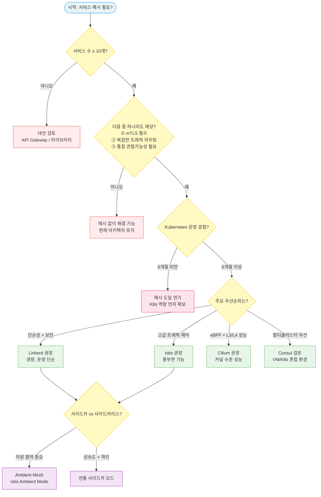
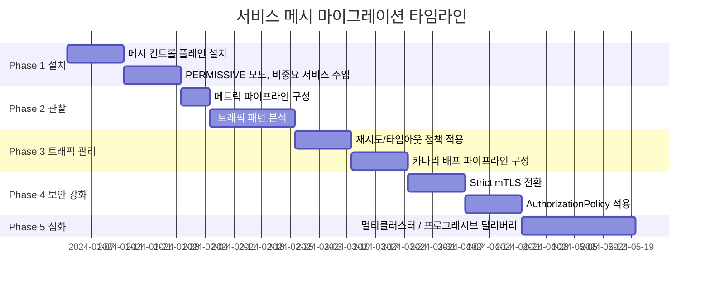
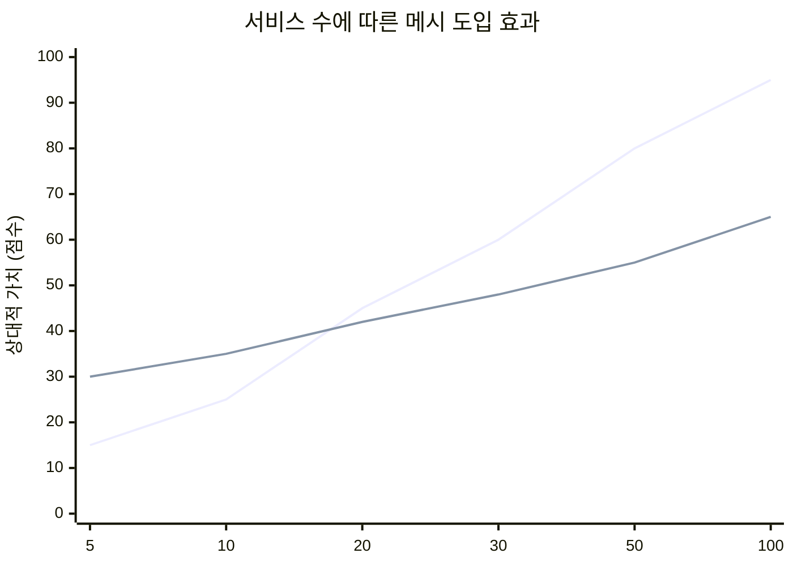
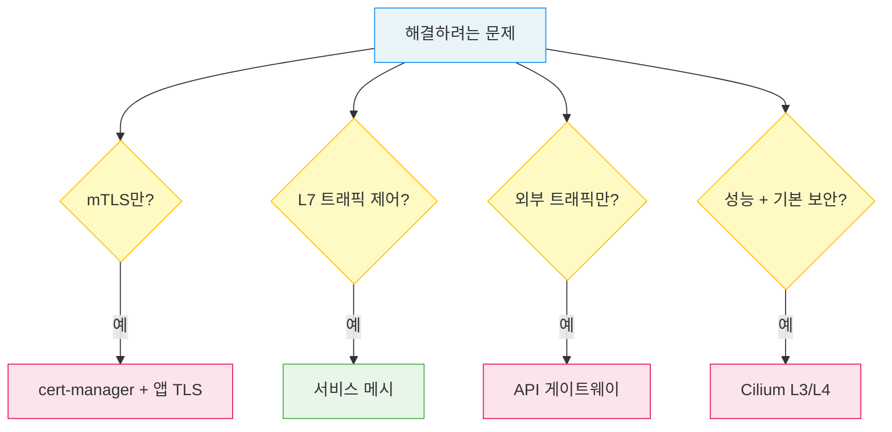

<!-- migrated: write/09_cloud/service-mesh/26-01.도입 전략과 의사결정.md (2026-04-19) -->

# Ch26. 도입 전략과 의사결정

> 📌 **핵심 요약**: 서비스 메시는 강력한 도구지만, 모든 문제의 해답이 아니다. 10개 미만의 서비스를 운영하는 팀이 메시를 도입하면 운영 복잡도만 높아질 수 있다. 이 챕터는 메시를 도입해야 할 시점과 그렇지 않아야 할 시점을 구분하고, 이미 운영 중인 시스템을 무중단으로 마이그레이션하는 전략을 다룬다.

---

## 🎯 학습 목표

1. 서비스 메시 도입이 적합한 상황과 그렇지 않은 상황을 구체적 기준으로 판단할 수 있다
2. 4단계 의사결정 프레임워크를 적용해 조직에 맞는 메시를 선택할 수 있다
3. 운영 중인 시스템에 서비스 메시를 단계적으로 도입하는 마이그레이션 계획을 수립할 수 있다
4. 서비스 메시의 비용(리소스, 복잡도)과 이점(보안, 관찰가능성)의 손익분기점을 이해한다
5. 일반적인 도입 실수 5가지를 인식하고 사전에 방지할 수 있다
6. 서비스 메시의 대안들을 이해하고 메시 없이도 해결 가능한 문제를 구별할 수 있다

---

## 20.1 언제 서비스 메시가 필요한가

### "You Probably Don't Need a Service Mesh"

2019년 Christian Posta가 블로그에 쓴 제목이다. 서비스 메시가 주목받던 시절, 모든 마이크로서비스 팀이 메시를 도입해야 한다는 압박이 있었다. 하지만 그는 "대부분의 팀은 메시 없이도 충분하다"고 주장했다.

이 주장은 지금도 유효하다. 서비스 메시는 특정 규모와 복잡도 이상에서 비로소 그 비용을 정당화할 수 있다. 5개 서비스를 운영하는 팀이 메시를 도입하면 운영팀의 학습 곡선, 사이드카 오버헤드, 디버깅 복잡도만 늘어날 수 있다.

### 도입이 적합한 조건

**조건 1: 10개 이상의 마이크로서비스**
서비스가 많아질수록 서비스 간 통신의 가짓수는 제곱으로 늘어난다. 10개 서비스라면 최대 90개의 통신 경로가 존재하고, 각 경로마다 mTLS 설정, 재시도, 타임아웃을 라이브러리 수준에서 관리하는 것은 실질적으로 불가능해진다. 메시는 이 복잡도를 중앙에서 선언적으로 관리한다.

**조건 2: 제로 트러스트 보안 요구사항**
규제 산업(금융, 의료, 공공)에서 서비스 간 mTLS 인증이 의무화되는 경우가 늘고 있다. 각 서비스에 TLS 코드를 직접 구현하는 것보다, 메시가 애플리케이션 코드 변경 없이 자동으로 mTLS를 적용하는 방식이 훨씬 현실적이다.

**조건 3: 복잡한 트래픽 라우팅**
여러 팀이 독립적으로 배포하면서 카나리 배포, A/B 테스트, 점진적 전환이 필요한 경우. 이를 Deployment 수준에서만 관리하면 kubectl apply 한 번에 모든 트래픽이 전환되는 위험이 있다.

**조건 4: 다중 팀 운영**
20개 팀이 50개 서비스를 운영한다면, 각 팀이 자체적으로 모니터링, 보안, 트래픽 정책을 구현하는 것은 중복 투자다. 메시는 이 공통 인프라를 플랫폼 팀이 일괄 제공하는 방식을 가능하게 한다.

### 도입이 부적합한 조건

**조건 1: 모놀리식 또는 소수 서비스**
모놀리스는 서비스 간 통신이 프로세스 내 함수 호출이므로 메시가 개입할 여지가 없다. 2~5개의 서비스도 마찬가지다. 이 경우 단순한 API 게이트웨이나 라이브러리 수준 솔루션이 더 적합하다.

**조건 2: 리소스 제약 환경**
각 Pod마다 Envoy 사이드카가 추가되면 메모리 50~100MB, CPU 100~200m 오버헤드가 발생한다. 50개 Pod 클러스터라면 5~10GB RAM이 메시 프록시에 소비된다. 비용이 제한된 스타트업이나 엣지 컴퓨팅 환경에서는 이 비용이 결정적이다.

**조건 3: 팀의 쿠버네티스 경험 부족**
메시는 쿠버네티스 위에서 동작한다. 쿠버네티스 자체에 익숙하지 않은 팀이 메시까지 도입하면 장애 시 원인 파악이 극도로 어려워진다. "메시 때문인가, 쿠버네티스 때문인가, 앱 때문인가"를 구분하지 못하면 장애 대응 시간이 늘어난다.

**조건 4: 단순한 배포 요구사항**
모든 트래픽을 새 버전으로 한 번에 전환해도 되는 경우, 카나리나 A/B 테스트가 불필요한 경우, 메시의 복잡도를 감수할 이유가 없다.

---

## 20.2 의사결정 프레임워크



### Step 1: 메시 기능이 정말 필요한가?

먼저 해결하려는 문제를 명확히 정의한다. "서비스 메시를 도입하고 싶다"가 아니라 "서비스 간 mTLS가 필요하다" 혹은 "배포 실패율을 줄이고 싶다"처럼 구체적인 문제를 적는다. 그 다음 메시 없이 해결할 수 없는지 검토한다.

### Step 2: 메시 없이 해결 가능한가?

mTLS가 목적이라면 cert-manager + 각 앱의 TLS 설정으로도 가능하다. 트래픽 제어가 목적이라면 Ingress Controller(Kong, APISIX)로도 어느 정도 해결된다. 관찰가능성이 목적이라면 OpenTelemetry SDK를 각 서비스에 추가하는 방법도 있다. 메시는 이 모든 것을 코드 변경 없이 제공하지만, 단일 목적이라면 더 가벼운 도구가 나을 수 있다.

### Step 3: 어떤 메시가 조직에 맞는가?

| 기준 | Linkerd | Istio | Cilium |
|------|---------|-------|--------|
| 학습 곡선 | 낮음 | 높음 | 중간 |
| L7 기능 | 제한적 | 풍부 | 제한적 |
| 리소스 오버헤드 | 낮음 (Rust 프록시) | 중간 (Envoy) | 최소 (eBPF) |
| 멀티클러스터 | 지원 | 지원 | 지원 |
| 성숙도 | 높음 | 높음 | 성장 중 |
| 사용 사례 | 단순/안정성 | 고급 제어 | 성능/보안 |

### Step 4: 사이드카 vs 사이드카리스?

Istio Ambient Mode는 사이드카 없이 노드 수준 프록시(ztunnel + waypoint)로 동작해 리소스 오버헤드를 크게 줄인다. 2024년 Istio 1.22에서 안정화되었고 프로덕션 사용이 가능하다. 하지만 Pod 수준 격리가 필요하거나, L7 정책을 세밀하게 적용해야 한다면 여전히 사이드카 모드가 더 적합하다.

---

## 20.3 마이그레이션 전략: 운영 중단 없이 메시 도입하기

운영 중인 시스템에 메시를 도입하는 것은 고속도로를 달리는 차에 엔진을 교체하는 것과 비슷하다. 불가능하지 않지만, 단계별 계획 없이는 사고가 난다.



### Phase 1: 설치와 초기 주입 (1~4주)

**목표**: 메시를 설치하되 기존 서비스에 영향을 주지 않는다.

메시를 설치한 뒤 mTLS 정책을 `PERMISSIVE` 모드로 설정한다. PERMISSIVE는 mTLS와 일반 HTTP 트래픽을 모두 허용해 기존 서비스가 메시를 통해 통신하더라도 오류가 발생하지 않는다. 이 상태에서 비중요 서비스(예: 내부 대시보드, 배치 작업)에 먼저 사이드카를 주입한다.

```bash
# 네임스페이스에 자동 주입 활성화 (Istio)
kubectl label namespace staging istio-injection=enabled

# 또는 특정 Deployment에만 주입
kubectl patch deployment my-app -p '{"spec":{"template":{"metadata":{"labels":{"sidecar.istio.io/inject":"true"}}}}}'
```

이 단계에서는 메트릭이 Prometheus에 수집되기 시작한다. 아직 정책을 적용하지 않았으므로 기존 동작은 그대로다.

### Phase 2: 관찰가능성 구축 (5~8주)

**목표**: 트래픽 패턴을 이해하고 베이스라인을 확보한다.

Grafana 대시보드를 구성하고 서비스 토폴로지를 시각화한다. Kiali(Istio) 또는 Linkerd Viz를 통해 어떤 서비스가 어떤 서비스를 호출하는지, 에러율과 지연 시간 분포가 어떤지 파악한다. 이 관찰 결과가 Phase 3~4의 정책 설계 근거가 된다.

예상치 못한 발견이 자주 나온다. 문서에는 없던 레거시 서비스 간 호출, 비정상적으로 높은 재시도율, 타임아웃 없이 운영 중인 서비스 등이 이 단계에서 드러난다.

### Phase 3: 트래픽 관리 정책 적용 (9~12주)

**목표**: 재시도, 타임아웃, 서킷 브레이커를 점진적으로 적용한다.

Phase 2에서 얻은 베이스라인 데이터를 기반으로 정책을 설계한다. 예를 들어 P99 지연이 800ms인 서비스의 타임아웃을 2초로 설정하는 것이 합리적이다. 하나의 서비스부터 시작해 정책을 적용하고 이상 동작이 없는지 확인한 뒤 다음 서비스로 넘어간다.

```yaml
# 비중요 서비스부터 시작 — 타임아웃 + 재시도
apiVersion: networking.istio.io/v1beta1
kind: VirtualService
metadata:
  name: notification-service
spec:
  http:
    - timeout: 3s
      retries:
        attempts: 2
        perTryTimeout: 1s
        retryOn: 5xx,reset
      route:
        - destination:
            host: notification-service
```

### Phase 4: Strict mTLS와 인가 정책 (13~16주)

**목표**: 제로 트러스트 보안을 완성한다.

이 단계는 가장 주의가 필요하다. PERMISSIVE에서 STRICT로 전환하면 mTLS 없이 통신하던 기존 클라이언트(레거시 서비스, 직접 curl 호출 등)의 요청이 모두 거부된다.

```yaml
# 네임스페이스 전체 Strict mTLS (Istio)
apiVersion: security.istio.io/v1beta1
kind: PeerAuthentication
metadata:
  name: default
  namespace: production
spec:
  mtls:
    mode: STRICT
```

전환 전에 반드시 PERMISSIVE 상태에서 메트릭으로 모든 통신이 mTLS로 이루어지고 있는지 확인한다. Kiali의 서비스 그래프에서 mTLS 적용 상태를 시각적으로 확인할 수 있다.

### Phase 5: 심화 기능 (17주~)

**목표**: 멀티클러스터, Progressive Delivery, 카오스 엔지니어링을 도입한다.

Phase 4까지 완료하면 메시의 기초가 완성된다. Phase 5는 팀의 필요에 따라 선택적으로 진행한다. Flagger를 도입해 카나리 배포를 자동화하거나, 멀티클러스터 구성으로 지역 간 트래픽을 제어할 수 있다.

전체 타임라인은 팀 규모와 서비스 수에 따라 3~6개월이 일반적이다.

---

## 20.4 비용-편익 분석

### 비용 항목

**리소스 오버헤드**: Envoy 사이드카 하나당 메모리 약 50~100MB, CPU 약 0.1~0.2 코어가 필요하다. 100개 Pod 클러스터라면 사이드카만으로 5~10GB RAM을 추가로 사용한다. 이를 클라우드 비용으로 환산하면 월 수백 달러에서 수천 달러에 달할 수 있다.

**운영 복잡도**: 메시 자체를 운영하는 인력이 필요하다. 컨트롤 플레인 업그레이드, 인증서 갱신, 메시 관련 장애 디버깅은 전문 지식이 필요하다. 소규모 팀에서는 이 오버헤드가 개발 속도를 늦출 수 있다.

**학습 곡선**: CRD(VirtualService, DestinationRule, AuthorizationPolicy 등)를 이해하고, 장애 시 Envoy 로그를 읽는 능력을 갖추는 데 2~3개월이 걸린다.

### 이점 항목

**개발 생산성**: 서비스 간 mTLS, 재시도, 타임아웃을 각 서비스가 직접 구현하지 않아도 된다. 하나의 서비스를 기준으로 이 코드를 제거하면 수백 줄이 줄어든다. 50개 서비스라면 수만 줄의 중복 코드가 사라진다.

**균일한 관찰가능성**: 각 서비스가 로깅/메트릭 라이브러리를 제각각 구현하던 방식에서, 메시가 일관된 메트릭과 추적을 자동으로 제공하는 방식으로 전환된다. 새 서비스를 배포하면 즉시 대시보드에 나타난다.

**보안 감사 간소화**: mTLS와 AuthorizationPolicy 설정이 Git에 선언적으로 관리되므로, 감사자에게 "어떤 서비스가 어떤 서비스에 접근할 수 있는가"를 YAML로 증명할 수 있다.

### 손익분기점



일반적으로 **20~50개 서비스**가 손익분기점으로 언급된다. 이 지점 이하에서는 메시의 비용이 이점을 상회할 수 있고, 이 지점 이상에서는 메시 없이 서비스 간 통신을 관리하는 것 자체가 더 큰 비용이 된다.

---

## 20.5 흔한 도입 실수 5가지

### 실수 1: 너무 이른 도입

가장 흔한 실수다. "나중에 필요할 것 같아서" 미리 도입하는 경우, 팀은 메시를 운영하는 데 시간을 쓰면서도 실제 이점을 얻지 못한다. 메시는 실제 문제가 발생했을 때 도입해야 하며, 예방적 설치는 대부분 불필요한 복잡도만 더한다.

**예방**: 구체적인 Pain Point 목록을 먼저 작성하라. "서비스 간 mTLS 감사 요건이 생겼다", "카나리 배포 실패로 다운타임이 발생했다" 같은 실제 문제가 있어야 도입이 정당화된다.

### 실수 2: 가장 기능이 많은 메시 선택

"Istio는 가장 많은 기능을 제공하니 당연히 최선"이라는 논리로 복잡도가 높은 메시를 선택하는 경우다. 사용하지 않는 기능이 90%인 메시를 운영하는 것은 자동차 레이싱 트랙을 출퇴근에 빌리는 것과 같다.

**예방**: 현재 필요한 기능만 목록으로 작성하고, 그것을 제공하는 가장 단순한 메시를 선택한다. 대부분의 팀에게는 Linkerd로 충분하다.

### 실수 3: Strict mTLS를 한 번에 전환

PERMISSIVE 모드로 몇 주 운영하다가 "이제 됐겠지"라며 클러스터 전체를 STRICT로 바꾸는 경우, 메시 외부에서 들어오는 레거시 트래픽이나 사이드카가 없는 Pod에서의 호출이 일시에 차단된다. 이것은 메시 도입 중 가장 위험한 순간이다.

**예방**: PERMISSIVE 상태에서 Prometheus 메트릭으로 mTLS 통신 비율이 100%인지 확인한 뒤 STRICT로 전환한다. 네임스페이스별로 단계적으로 전환한다.

### 실수 4: 프록시 리소스 한도 설정 누락

사이드카 컨테이너에 `resources.limits`를 설정하지 않으면, 트래픽 급증 시 Envoy 프록시가 노드의 메모리를 무한정 사용하다 OOMKill이 발생한다. 프록시가 재시작되는 순간 해당 Pod의 모든 인바운드/아웃바운드 트래픽이 중단된다.

**예방**: 메시 설치 시 기본 사이드카 리소스를 MeshConfig 또는 IstioOperator에 설정한다.

```yaml
# Istio — 기본 사이드카 리소스 설정
apiVersion: install.istio.io/v1alpha1
kind: IstioOperator
spec:
  meshConfig:
    defaultConfig:
      resources:
        requests:
          cpu: 100m
          memory: 128Mi
        limits:
          cpu: 500m
          memory: 256Mi
```

### 실수 5: 업그레이드 계획 부재

메시를 설치하고 운영하다가 6개월 후 컨트롤 플레인 버전이 두 버전 이상 뒤처진 것을 발견하는 경우가 많다. Istio는 N-1 버전까지만 지원하므로, 업그레이드 없이 방치하면 보안 패치도 받을 수 없게 된다.

**예방**: 분기별 업그레이드 일정을 캘린더에 등록하고, 카나리 업그레이드(리비전 기반) 방식을 사전에 연습한다.

---

## 20.6 서비스 메시의 대안

메시를 도입하지 않기로 결정했다면, 그 목적을 달성하는 다른 방법들이 있다.

### 라이브러리 접근 (Library Approach)

Netflix OSS(Hystrix, Ribbon), gRPC 인터셉터, Spring Cloud 같은 라이브러리를 각 서비스에 추가하는 방식이다.

**장점**: 메시 인프라 없이 바로 사용 가능하고, 세밀한 커스터마이징이 가능하다.
**단점**: 언어/프레임워크마다 별도 라이브러리가 필요하고(폴리글랏 환경에서 비효율적), 라이브러리 버전을 모든 서비스에서 통일하기 어렵다. Hystrix는 이미 유지보수 종료 상태다.

### API 게이트웨이 (API Gateway)

Kong, APISIX, Traefik 같은 게이트웨이는 노스-사우스 트래픽(외부→내부)을 제어한다. 레이트 리미팅, 인증, SSL 종단 등을 처리한다.

**한계**: 이스트-웨스트 트래픽(서비스 간 내부 통신)에는 적용되지 않는다. 서비스 A가 서비스 B를 직접 호출할 때 API 게이트웨이는 개입하지 않는다.

### eBPF 전용 (Cilium without L7)

Cilium을 L3/L4 수준에서만 사용하면 커널 수준의 네트워크 정책과 관찰가능성을 제공하면서, 사이드카 오버헤드 없이 동작한다.

**한계**: HTTP 헤더 기반 라우팅, 재시도, 타임아웃 같은 L7 기능이 없다. 카나리 배포가 불가능하다.

### cert-manager + 앱 TLS

각 서비스가 cert-manager로 발급받은 인증서를 사용해 직접 mTLS를 구현한다.

**한계**: 각 앱이 TLS 코드를 직접 처리해야 하고, 인증서 갱신 로직을 직접 구현해야 한다. 언어별로 구현이 다르다.



---

## 면접 대비

**Q1. 귀사에 30개의 마이크로서비스가 있고 서비스 메시 도입을 검토 중입니다. 의사결정 과정을 설명해주세요.**

먼저 도입 목적을 명확히 정의합니다. "왜 메시가 필요한가?"에 대해 구체적인 Pain Point를 나열합니다. 30개 서비스라면 서비스 간 통신 경로가 수백 개에 달하므로, 메시 없이 각 서비스가 개별적으로 재시도, 타임아웃, mTLS를 구현하는 것의 비효율이 실질적입니다.

다음으로 팀의 쿠버네티스 운영 경험을 확인합니다. 6개월 이상의 K8s 경험이 있어야 메시 도입이 현실적입니다. 그 다음 어떤 기능이 주요 요구사항인지 파악합니다. 단순 mTLS + 기본 재시도라면 Linkerd를, 고급 트래픽 라우팅과 카나리 배포 자동화가 필요하다면 Istio + Flagger를 권장합니다. 마지막으로 POC를 비프로덕션 환경에서 2주간 진행해 팀의 운영 역량을 검증한 뒤 프로덕션 도입 여부를 결정합니다.

**Q2. 운영 중인 프로덕션 시스템에 서비스 메시를 무중단으로 도입하려면 어떻게 해야 하나요?**

단계적 접근이 핵심입니다. 1단계는 mTLS를 PERMISSIVE 모드로 설치하고, 비중요 서비스(내부 툴, 배치 작업)에 먼저 사이드카를 주입합니다. 트래픽에 영향을 주지 않으면서 메시 동작을 관찰합니다. 2단계에서는 Prometheus와 Grafana를 구성해 서비스별 성공률, 지연 시간 베이스라인을 2~3주간 수집합니다. 3단계에서는 그 데이터를 기반으로 타임아웃과 재시도 정책을 서비스별로 적용하면서 이상 여부를 모니터링합니다. 4단계에서 STRICT mTLS로 전환합니다 — 반드시 네임스페이스 단위로 순차적으로 전환하고, 각 전환 후 24시간 모니터링 기간을 둡니다. 전체 과정에 3~4개월을 할애하는 것이 현실적입니다.

**Q3. 서비스 메시로 인해 레이턴시가 증가했다는 보고가 들어왔습니다. 어떻게 트러블슈팅하시겠습니까?**

먼저 증가된 레이턴시가 메시 때문인지 확인합니다. Istio라면 `istioctl proxy-config log <pod> --level debug`로 Envoy 로그를 활성화하고, `istioctl experimental dashboard envoy <pod>`로 Envoy Admin UI를 열어 `stats` 페이지에서 업스트림 연결 수와 응답 시간을 확인합니다. Kiali의 서비스 그래프에서 P99 지연이 어느 서비스에서 발생하는지 범위를 좁힙니다. 일반적인 원인은 세 가지입니다. 첫째, 사이드카 CPU 한도 초과로 쓰로틀링 발생 — `kubectl top pod --containers`로 확인합니다. 둘째, mTLS 핸드셰이크 오버헤드 — 같은 Pod 안에서 mTLS가 적용되는 경우 `DestinationRule`에 예외를 추가합니다. 셋째, 재시도 정책이 느린 요청을 증폭시키는 경우 — `retries.attempts`를 줄이거나 `retryOn` 조건을 좁힙니다. 원인을 파악했다면 한 번에 하나씩 변경하고 효과를 측정합니다.

**Q4. 서비스 메시 없이도 mTLS를 구현할 수 있는데, 메시를 사용하는 이유가 무엇인가요?**

기술적으로는 cert-manager와 각 서비스의 TLS 설정으로 mTLS를 구현할 수 있습니다. 하지만 이 접근에는 세 가지 현실적 문제가 있습니다. 첫째, 언어마다 TLS 설정 방식이 다릅니다. Go, Java, Python, Node.js 서비스가 혼재하면 각각 다른 방식으로 구현해야 합니다. 둘째, 인증서 갱신 로직을 각 서비스가 직접 처리해야 하고, 갱신 실패 시 해당 서비스의 통신이 끊깁니다. 셋째, mTLS가 올바르게 동작하는지 감사할 방법이 없습니다. 반면 메시는 사이드카가 모든 TLS를 투명하게 처리하고, 컨트롤 플레인이 인증서를 자동 갱신하며, Kiali나 Linkerd Viz로 어떤 연결이 mTLS인지 시각적으로 확인할 수 있습니다. 단순히 기술적 가능성이 아니라 운영 현실성 측면에서 메시가 더 나은 선택입니다.

**Q5. 서비스 메시를 도입한 후 6개월이 지났는데, 컨트롤 플레인 업그레이드를 어떻게 수행하시겠습니까?**

Istio 기준으로 카나리 리비전 방식을 사용합니다. 먼저 새 버전의 컨트롤 플레인을 기존과 별도 리비전으로 설치합니다(`istioctl install --set revision=1-20`). 이 상태에서 기존 사이드카는 구버전 컨트롤 플레인에 연결된 채로 정상 동작합니다. 다음으로 비중요 네임스페이스의 레이블을 변경해 새 리비전으로 재주입합니다(`istio.io/rev=1-20`). Pod를 롤링 재시작하면 새 버전 사이드카로 교체됩니다. 2~3일간 모니터링 후 문제가 없으면 다음 네임스페이스로 이동합니다. 모든 네임스페이스가 전환되면 구버전 컨트롤 플레인을 제거합니다. 이 방식의 장점은 롤백이 쉽다는 점입니다. 새 버전에서 문제가 발생하면 네임스페이스 레이블을 구버전 리비전으로 되돌리고 Pod를 재시작하면 됩니다. Linkerd는 `linkerd upgrade` 명령어가 이 과정을 대부분 자동화해줍니다.

---

## 체크리스트

- [ ] 서비스 메시 도입이 적합한 4가지 조건을 설명할 수 있다
- [ ] 도입이 부적합한 상황에서 더 간단한 대안을 제안할 수 있다
- [ ] 4단계 의사결정 프레임워크로 조직에 맞는 메시를 선택할 수 있다
- [ ] 5단계 마이그레이션 계획을 작성하고 각 단계의 목표를 설명할 수 있다
- [ ] PERMISSIVE → STRICT mTLS 전환 절차와 주의사항을 설명할 수 있다
- [ ] 서비스 메시의 5가지 흔한 도입 실수를 인식하고 예방책을 제시할 수 있다
- [ ] 라이브러리 접근, API 게이트웨이, eBPF 전용 방식의 한계를 설명할 수 있다
- [ ] 레이턴시 문제 발생 시 트러블슈팅 접근법을 단계별로 설명할 수 있다

---

## 참고 자료

- [You Probably Don't Need a Service Mesh — Christian Posta (2019)](https://blog.christianposta.com/microservices/do-i-need-a-service-mesh/)
- [Istio Upgrade Guide — Canary Upgrades](https://istio.io/latest/docs/setup/upgrade/canary/)
- [Linkerd Getting Started](https://linkerd.io/2.14/getting-started/)
- [CNCF Service Mesh Landscape](https://landscape.cncf.io/?category=service-mesh)
- [William Morgan — Service Mesh Comparison (2024)](https://servicemesh.es/)
- [Google Cloud — Traffic Director vs Anthos Service Mesh 선택 기준](https://cloud.google.com/architecture/service-mesh)
- [InfoQ — Service Mesh at Scale: Lessons Learned from Production](https://www.infoq.com/articles/service-mesh-production-lessons/)
