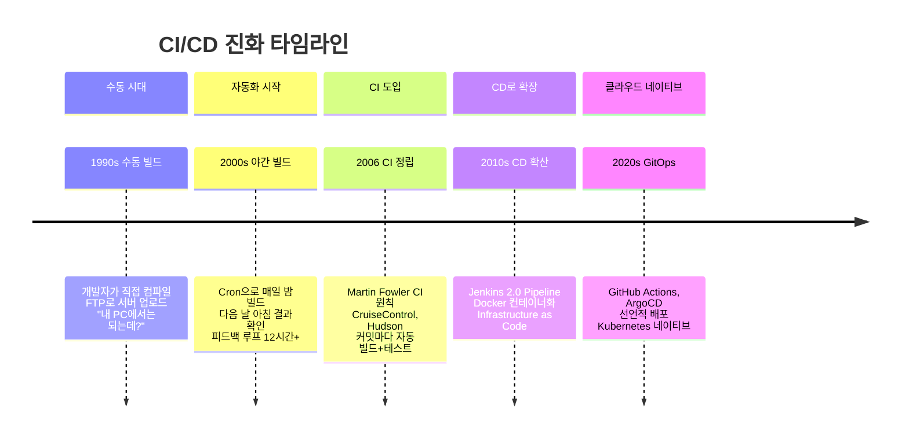
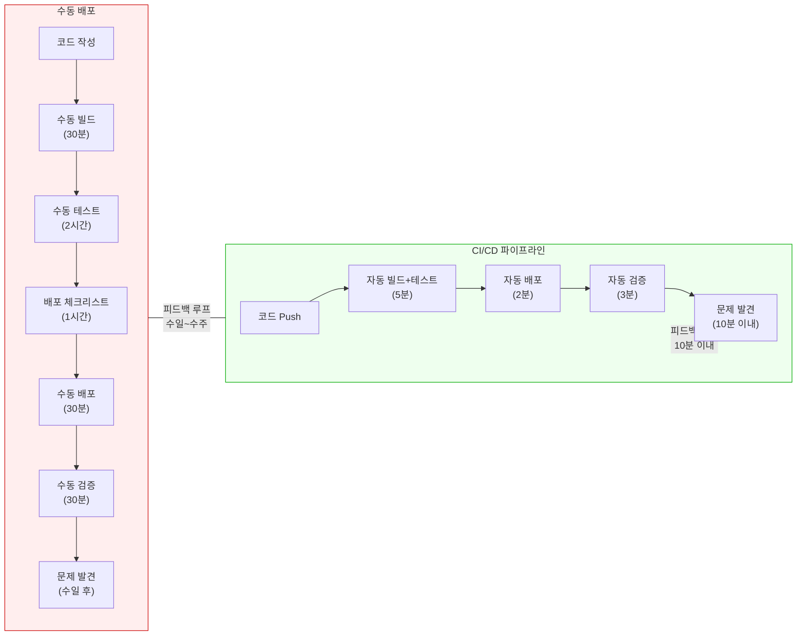
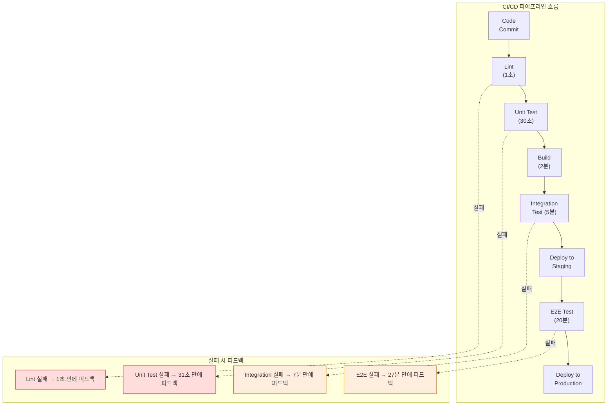

# Ch01. CI/CD Fundamentals

**핵심 질문**: "왜 코드를 머지할 때마다 수동으로 빌드하고 배포하면 안 되는가?"

---

## 1. CI/CD의 정의와 진화

### Continuous Integration (CI)

Continuous Integration은 개발자가 코드를 공유 저장소에 **자주** 통합하는 프랙티스입니다. 여기서 "자주"가 핵심인데, 하루에 한 번 이상, 이상적으로는 기능 하나를 완성할 때마다 통합하는 것을 의미합니다. 단순히 `git merge`를 하는 것이 CI가 아닙니다. 통합할 때마다 자동으로 빌드하고 테스트하여 **문제를 조기에 발견하는 것**이 CI의 본질입니다.

왜 "자주" 통합해야 할까요? 통합 간격이 길어질수록 충돌의 규모가 커지기 때문입니다. 2주 동안 5명의 개발자가 각자의 브랜치에서 작업한 뒤 한꺼번에 머지하면, 충돌이 복잡하게 얽혀서 해결에 수일이 걸릴 수 있습니다. 이것이 소위 **"Integration Hell"**이라 불리는 상황입니다. Martin Fowler가 2006년에 정리한 CI의 원칙은 이 고통을 없애는 데 집중합니다. 매일 머지하면 충돌이 작고 단순해서 몇 분 만에 해결할 수 있습니다.

CI가 제대로 동작하려면 세 가지 전제 조건이 필요합니다. 첫째, 단일 소스 저장소(Single Source Repository)가 있어야 합니다. 둘째, 빌드가 자동화되어 있어야 합니다. 셋째, 자동화된 테스트 스위트가 존재해야 합니다. 이 세 가지 중 하나라도 빠지면 CI를 도입했다고 말하기 어렵습니다. Jenkins 서버를 설치했지만 테스트가 없다면, 그것은 "자동 빌드"일 뿐 CI가 아닙니다.

### Continuous Delivery vs Continuous Deployment

CI 이후의 단계에서 두 가지 "CD"가 등장하며, 이 둘의 차이를 정확히 아는 것이 중요합니다.

**Continuous Delivery**는 코드 변경이 빌드, 테스트를 거쳐 **프로덕션에 배포 가능한 상태까지 자동으로 도달**하는 것을 의미합니다. 핵심은 "배포 가능한 상태"입니다. 실제 프로덕션 배포는 비즈니스 의사결정에 의해 수동으로 승인됩니다. 예를 들어, 마케팅 캠페인 시작일에 맞춰 배포하거나, QA 팀의 최종 검증 후 배포 버튼을 누르는 방식입니다. Delivery가 보장하는 것은 "언제든 버튼 하나로 배포할 수 있다"는 상태입니다.

**Continuous Deployment**는 Delivery에서 한 단계 더 나아갑니다. 모든 검증 단계를 통과한 코드가 **자동으로 프로덕션에 배포**됩니다. 사람의 승인 단계가 없습니다. 개발자가 커밋을 푸시하면, 파이프라인이 lint, 단위 테스트, 통합 테스트, 스테이징 배포, E2E 테스트를 순서대로 실행하고, 모두 통과하면 프로덕션까지 자동으로 올라갑니다. Netflix, Etsy, GitHub 같은 조직이 이 방식을 사용합니다.

왜 모든 조직이 Continuous Deployment를 하지 않을까요? 규제 요건(금융, 의료), 비즈니스 타이밍(마케팅 런칭), 기술적 성숙도(테스트 커버리지 부족) 등의 이유로 수동 승인 단계가 필요한 경우가 많기 때문입니다. Continuous Delivery는 이런 현실을 인정하면서도 자동화의 이점을 최대한 가져가는 실용적 선택입니다.

### CI/CD의 진화

소프트웨어 배포 방식은 수십 년에 걸쳐 점진적으로 발전해왔습니다. 각 단계는 이전 단계의 고통에서 비롯된 자연스러운 반응이었습니다.

**수동 빌드 시대(1990년대)**에는 개발자가 직접 소스 코드를 컴파일하고, FTP로 서버에 올렸습니다. "내 PC에서는 되는데?"라는 말이 일상이었던 시기입니다. 개발 환경과 운영 환경의 차이를 아무도 체계적으로 관리하지 않았기 때문입니다.

**야간 빌드(2000년대 초)**는 수동 빌드의 반복 노동을 줄이기 위한 첫 번째 시도였습니다. Cron 작업으로 매일 밤 전체 코드를 빌드하고, 다음 날 아침 결과를 확인했습니다. 하지만 피드백 루프가 12시간 이상이어서, 어제 커밋한 코드가 빌드를 깨뜨렸다는 사실을 다음 날에야 알 수 있었습니다. 그 사이에 다른 개발자들이 깨진 코드 위에 추가 작업을 해버리면 문제 해결이 훨씬 어려워졌습니다.

**CI의 정립(2006년)**은 이 피드백 루프를 극적으로 단축했습니다. CruiseControl, Hudson(이후 Jenkins) 같은 도구가 등장하면서 커밋할 때마다 즉시 빌드와 테스트가 실행되었습니다. 문제를 만든 커밋이 무엇인지 바로 알 수 있게 되었고, "누가 빌드를 깨뜨렸는가"가 몇 분 안에 드러났습니다.

**CD의 확산(2010년대)**은 "빌드와 테스트는 자동화했는데, 배포는 왜 수동인가?"라는 질문에서 시작되었습니다. Jenkins 2.0이 Pipeline-as-Code를 도입하고, Docker가 환경 일관성 문제를 해결하면서, 빌드부터 배포까지의 전체 흐름을 코드로 정의하고 자동화할 수 있게 되었습니다.

**클라우드 네이티브 시대(2020년대)**에는 CI/CD 자체가 인프라에 내장되기 시작했습니다. GitHub Actions는 코드 저장소 안에서 워크플로를 정의하고, ArgoCD는 Kubernetes 클러스터의 상태를 Git 저장소와 자동으로 동기화합니다. "CI/CD 서버를 운영한다"는 개념 자체가 사라지는 방향으로 진화하고 있습니다.

---

## 2. 왜 CI/CD가 필요한가

### 수동 배포의 문제점

수동 배포가 왜 위험한지를 이해하려면, 실제로 수동 배포 과정에서 무엇이 일어나는지를 구체적으로 살펴봐야 합니다.

**Human Error(인적 오류)**는 수동 배포에서 가장 빈번하고 치명적인 문제입니다. 배포 체크리스트가 20단계라면, 피곤한 금요일 오후에 3번째 단계를 건너뛸 확률은 결코 0이 아닙니다. 환경변수를 staging 값으로 놓고 프로덕션에 배포하는 실수, 마이그레이션 스크립트 실행을 잊는 실수, 배포 순서를 잘못 지키는 실수 등이 반복됩니다. 사람은 실수하는 존재이고, 반복 작업에서의 실수는 프로세스의 문제이지 개인의 문제가 아닙니다.

**배포 공포(Deployment Fear)**는 수동 배포의 심리적 부작용입니다. 배포할 때마다 장애가 날 수 있다는 공포 때문에, 팀은 배포 빈도를 줄이려 합니다. "금요일에는 배포하지 말자"는 암묵적 규칙이 생기고, 배포를 2주에 한 번으로 제한합니다. 하지만 배포 빈도를 줄이면 한 번의 배포에 포함되는 변경량이 커지고, 변경량이 크면 문제 발생 시 원인 파악이 어려워지고, 원인 파악이 어려우면 배포가 더 무서워집니다. 이것이 **악순환**입니다.

**긴 피드백 루프**는 수동 배포의 시간적 문제입니다. 코드를 작성하고 실제 사용자에게 도달하기까지 수일에서 수주가 걸리면, 버그가 발견되었을 때 해당 코드를 작성한 개발자는 이미 다른 작업에 몰입해 있습니다. 컨텍스트 스위칭 비용이 발생하고, "이 코드를 왜 이렇게 짰지?"라고 자문하게 됩니다.

### CI/CD가 해결하는 것

위 다이어그램은 수동 배포와 CI/CD 파이프라인의 피드백 루프 차이를 보여줍니다. 수동 배포는 코드 작성부터 문제 발견까지 수일이 걸리는 반면, CI/CD는 10분 이내에 피드백을 받습니다. 이 시간 차이가 단순한 효율성 개선이 아니라 **근본적으로 다른 개발 문화**를 만듭니다.

CI/CD가 구체적으로 해결하는 문제들은 다음과 같습니다.

**반복 작업 자동화**: 빌드, 테스트, 배포라는 반복 작업에서 사람을 제거합니다. 사람은 창의적인 작업(설계, 코드 리뷰, 아키텍처 결정)에 집중하고, 기계적인 작업은 파이프라인에 맡깁니다.

**빠른 피드백**: 커밋 후 10분 이내에 빌드가 성공했는지, 테스트가 통과했는지 알 수 있습니다. 문제가 발견되면 방금 작성한 코드에서 원인을 찾으면 되므로 디버깅 시간이 극적으로 줄어듭니다.

**배포 빈도 증가를 통한 위험 감소**: 직관에 반하지만, 배포를 더 자주 하면 각 배포의 위험이 줄어듭니다. 10줄 변경을 배포하면 문제 발생 시 10줄만 확인하면 됩니다. 10,000줄 변경을 한꺼번에 배포하면 문제 범위가 10,000줄입니다. 작은 배포는 롤백도 간단합니다.

### DORA 메트릭

Google의 DORA(DevOps Research and Assessment) 팀은 수만 개 조직의 데이터를 분석하여 소프트웨어 딜리버리 성과를 측정하는 네 가지 핵심 메트릭을 정의했습니다. 이 메트릭은 CI/CD의 효과를 객관적으로 증명하는 데 사용됩니다.

| 메트릭 | 정의 | Elite 수준 | Low 수준 |
|--------|------|-----------|----------|
| **Deployment Frequency** | 프로덕션 배포 빈도 | 하루 여러 번 | 월 1회 미만 |
| **Lead Time for Changes** | 커밋부터 프로덕션 배포까지 시간 | 1시간 미만 | 1개월 이상 |
| **Change Failure Rate** | 배포 후 장애/롤백 비율 | 0-15% | 46-60% |
| **MTTR (Mean Time to Recovery)** | 장애 발생 후 복구까지 시간 | 1시간 미만 | 1주 이상 |

Elite 팀과 Low 팀의 차이가 수백 배에 달한다는 점이 주목할 만합니다. CI/CD는 이 네 가지 메트릭을 모두 개선하는 가장 효과적인 방법입니다. 배포 자동화로 Deployment Frequency가 올라가고, 파이프라인 최적화로 Lead Time이 줄어들고, 자동 테스트로 Change Failure Rate가 낮아지고, 자동 롤백으로 MTTR이 단축됩니다.

---

## 3. Jenkins의 위치

### CI/CD 도구 생태계에서의 역할

Jenkins는 2011년에 Hudson 프로젝트에서 포크된 오픈소스 CI/CD 서버입니다. 이 포크의 배경에는 기업 정치가 있었습니다. Hudson은 Sun Microsystems에서 시작되었고, Oracle이 Sun을 인수한 후 Hudson의 상표권을 주장했습니다. 커뮤니티는 이에 반발하여 프로젝트를 Jenkins라는 이름으로 포크했고, 대다수의 핵심 기여자와 사용자가 Jenkins로 이동했습니다. 이 사건은 오픈소스 거버넌스의 중요성을 보여주는 대표적 사례입니다.

Jenkins가 CI/CD 생태계에서 독특한 위치를 차지하는 이유는 **1800개 이상의 플러그인 생태계** 때문입니다. 거의 모든 개발 도구, 클라우드 서비스, 빌드 시스템, 테스트 프레임워크와 통합할 수 있습니다. 이 확장성은 양날의 검이기도 합니다. 플러그인 간 호환성 문제, 보안 취약점, 업데이트 관리가 운영 부담으로 작용합니다.

### Jenkins가 여전히 쓰이는 이유

GitHub Actions, GitLab CI 같은 SaaS CI/CD 서비스가 등장한 2020년대에도 Jenkins가 여전히 광범위하게 사용되는 이유는 세 가지입니다.

첫째, **온프레미스 환경**입니다. 금융, 의료, 공공 부문처럼 코드와 빌드 아티팩트가 외부 클라우드로 나가면 안 되는 환경에서는 Self-hosted CI/CD가 필수입니다. Jenkins는 자체 서버에서 완전히 통제할 수 있습니다.

둘째, **레거시 시스템 통합**입니다. 20년 된 빌드 스크립트, 독자적인 배포 프로세스, 사내 도구와의 연동이 이미 Jenkins 플러그인으로 구축되어 있는 조직이 많습니다. 이 연동을 다른 CI/CD로 마이그레이션하는 비용이 Jenkins를 유지하는 비용보다 큰 경우가 흔합니다.

셋째, **커스터마이징 자유도**입니다. Jenkins는 Groovy 스크립트로 파이프라인의 모든 단계를 프로그래밍할 수 있습니다. SaaS CI/CD 서비스는 제공하는 기능의 범위 안에서만 작업해야 하지만, Jenkins는 필요하면 플러그인을 직접 만들 수도 있습니다.

---

## 4. CI/CD 도구 비교

도구 선택은 조직의 상황에 따라 결정되어야 합니다. 아래 테이블은 주요 CI/CD 도구의 특성을 비교한 것입니다. "최고의 도구"는 없으며, 각 도구가 빛나는 맥락이 다릅니다.

| 도구 | 타입 | 장점 | 단점 | 적합한 상황 |
|------|------|------|------|------------|
| **Jenkins** | Self-hosted | 무한 커스터마이징, 1800+ 플러그인 생태계, 온프레미스 완전 통제 | 운영 부담(서버, 플러그인 관리), 플러그인 호환성 이슈, 초기 설정 복잡 | 온프레미스 환경, 복잡한 파이프라인, 레거시 통합 |
| **GitHub Actions** | SaaS | GitHub 저장소와 완벽 통합, 마켓플레이스 액션 풍부, YAML 기반 간결한 설정 | GitHub 종속(Vendor Lock-in), Self-hosted runner 비용, 복잡한 워크플로 디버깅 어려움 | GitHub 기반 프로젝트, 오픈소스, 스타트업 |
| **GitLab CI** | SaaS / Self-hosted | GitLab 올인원(SCM+CI/CD+레지스트리), Auto DevOps, 강력한 보안 스캔 | GitLab 종속, 대규모 인스턴스 성능 이슈 | GitLab 기반 조직, DevSecOps 중시 |
| **ArgoCD** | GitOps (CD만) | 선언적 배포, Kubernetes 네이티브, Git을 Single Source of Truth로 사용 | CI 기능 없음(별도 CI 도구 필요), Kubernetes 외 환경 미지원 | Kubernetes 환경, GitOps 전략 채택 조직 |

도구를 선택할 때 흔히 하는 실수는 기술적 우월성만 비교하는 것입니다. 실제로는 **조직의 기존 인프라, 팀의 기술 역량, 보안 요구사항, 예산** 등이 더 중요한 결정 요인입니다. Jenkins가 "구식"이라고 GitHub Actions로 전환했다가, 온프레미스 요구사항을 만족시키지 못해 다시 돌아오는 사례도 적지 않습니다.

또한 CI와 CD 도구를 분리하는 전략도 유효합니다. 예를 들어 Jenkins(CI) + ArgoCD(CD) 조합은 빌드/테스트는 Jenkins의 유연성을 활용하고, Kubernetes 배포는 ArgoCD의 선언적 모델을 활용하는 실용적 선택입니다.

---

## 5. CI/CD 파이프라인 설계 원칙

### 원칙 1: 빠른 피드백 (Fast Feedback)

파이프라인의 단계 배치 순서는 **비용이 낮은 검증을 먼저** 실행하는 것이 원칙입니다. 왜 그럴까요? 파이프라인의 목적은 "이 코드 변경이 안전한가?"를 가능한 빨리 판단하는 것이기 때문입니다. Lint 검사는 1초, 단위 테스트는 30초, 통합 테스트는 5분, E2E 테스트는 20분 걸린다면, Lint에서 이미 잡을 수 있는 문제를 E2E까지 가서 발견하는 것은 19분 59초의 낭비입니다.

이 원칙을 **테스트 피라미드(Test Pyramid)**라고 합니다. 아래로 갈수록 빠르고 저렴한 테스트를 많이, 위로 갈수록 느리고 비싼 테스트를 적게 배치합니다.

위 다이어그램은 파이프라인의 각 단계에서 실패했을 때 피드백까지 걸리는 시간을 보여줍니다. Lint에서 잡히면 1초, E2E까지 가야 잡히면 27분입니다. 단계 순서를 비용 기준으로 배치하는 것만으로 팀의 평균 피드백 시간을 극적으로 줄일 수 있습니다. 실제 대규모 프로젝트에서는 E2E 테스트가 1시간 이상 걸리는 경우도 흔하므로, 이 원칙의 효과는 프로젝트가 클수록 커집니다.

### 원칙 2: 환경 일관성 (Environment Consistency)

**동일한 아티팩트가 모든 환경을 통과해야 합니다.** 이것은 "각 환경에서 새로 빌드하지 말라"는 의미입니다.

흔한 실수는 staging 환경에서 빌드한 아티팩트를 테스트하고, 프로덕션에서는 다시 빌드해서 배포하는 것입니다. 동일한 소스코드라도 빌드 시점의 의존성 버전, 환경변수, 빌드 도구 버전이 미세하게 달라서 다른 바이너리가 만들어질 수 있습니다. "staging에서는 됐는데 프로덕션에서 안 된다"는 상황의 상당 부분이 이 이유입니다.

올바른 방식은 CI 단계에서 아티팩트(JAR, Docker 이미지 등)를 **한 번만** 빌드하고, 이 동일한 아티팩트를 dev → staging → production 순서로 통과시키는 것입니다. 환경별로 달라지는 것은 설정(환경변수, config 파일)뿐이어야 합니다. Docker가 이 원칙을 실현하는 데 결정적인 역할을 했는데, 컨테이너 이미지는 빌드 환경의 모든 의존성을 포함하므로 어디서 실행해도 동일한 동작을 보장하기 때문입니다.

### 원칙 3: 원자적 배포 (Atomic Deployment)

**배포는 성공하거나 완전히 롤백되어야 합니다.** 중간 상태(일부 서버만 새 버전, 나머지는 구 버전)가 존재하면 안 됩니다.

왜 중간 상태가 위험할까요? API 스키마가 변경된 경우를 생각해 보면 명확합니다. 서버 A는 새 API를 제공하고 서버 B는 구 API를 제공하는 상태에서, 로드밸런서가 요청을 랜덤으로 분배하면 클라이언트는 때로는 성공하고 때로는 실패합니다. 이런 간헐적 오류는 디버깅이 매우 어렵습니다.

원자적 배포를 구현하는 전략으로 Blue-Green Deployment(새 버전을 별도 환경에 준비한 후 트래픽을 한 번에 전환), Canary Deployment(전체 트래픽의 일부만 새 버전으로 보내며 점진적으로 확대), Rolling Update(서버를 순차적으로 업데이트하되 충분한 헬스체크 후 진행) 등이 있습니다. 이 전략들은 이후 챕터에서 Jenkins 파이프라인으로 직접 구현해 볼 것입니다.

### 원칙 4: 모든 것을 코드로 (Everything as Code)

파이프라인 설정, 인프라 구성, 배포 스크립트 등 모든 것이 버전 관리되는 코드여야 합니다. UI에서 클릭으로 설정한 파이프라인은 재현이 불가능하고, 변경 이력을 추적할 수 없으며, 코드 리뷰를 받을 수 없습니다. Jenkins의 초기 버전은 웹 UI에서 Job을 설정하는 방식이었고, 이것이 "Jenkins is fragile"이라는 인식의 주요 원인이었습니다. Jenkins 2.0에서 도입된 Jenkinsfile(Pipeline-as-Code)은 이 문제를 해결하려는 직접적 대응이었습니다.

---

## 정리

이 챕터에서 다룬 핵심 개념들을 요약하면 다음과 같습니다.

- **CI**는 자주 통합하고 자동으로 검증하여 Integration Hell을 방지하는 것이고, **CD**는 이를 배포까지 확장한 것입니다.
- 수동 배포의 핵심 문제는 Human Error, 배포 공포, 긴 피드백 루프이며, CI/CD는 자동화를 통해 이 세 가지를 모두 해결합니다.
- Jenkins는 온프레미스 환경과 복잡한 커스터마이징이 필요한 상황에서 여전히 유효한 선택이며, 도구 선택은 기술적 우월성이 아니라 조직의 맥락에 따라 결정해야 합니다.
- 파이프라인 설계의 핵심 원칙은 빠른 피드백, 환경 일관성, 원자적 배포, Everything as Code입니다.

다음 챕터에서는 Jenkins의 아키텍처(Controller-Agent 구조, 플러그인 시스템, 파일 시스템 레이아웃)를 깊이 있게 살펴봅니다.
