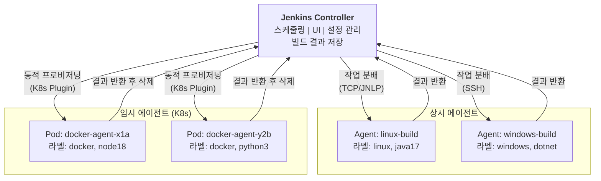
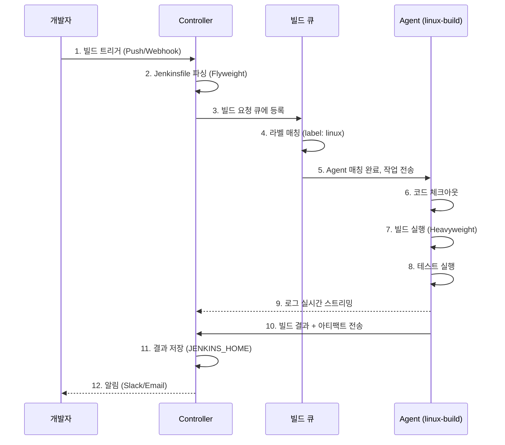
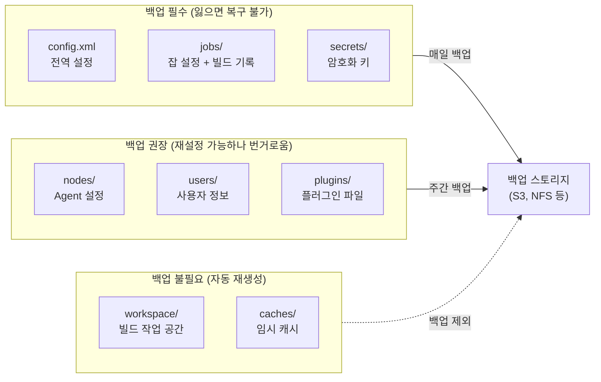

# Ch02. Jenkins Architecture

> **핵심 질문**: "Jenkins Controller가 죽으면 파이프라인은 어떻게 되는가?"

Jenkins를 단일 서버에서 돌리면 처음에는 편하다. 하지만 팀이 커지고 빌드가 늘어나면 그 편안함은 곧 병목과 장애의 원인이 된다. 이 챕터에서는 Jenkins가 왜 Controller-Agent 분산 아키텍처를 채택했는지, 그 내부가 어떻게 동작하는지, 그리고 장애가 발생했을 때 무엇이 살아남고 무엇이 죽는지를 다룬다.

---

## 1. Controller-Agent 모델

### 왜 분리하는가

Jenkins를 하나의 서버에서 모든 것을 처리하도록 구성하면 세 가지 문제가 동시에 발생한다.

**리소스 경쟁**: Controller는 웹 UI 제공, 빌드 스케줄링, 설정 관리, 결과 저장 등 상시 운영 작업을 수행한다. 여기에 빌드까지 직접 실행하면 CPU와 메모리를 빌드 프로세스가 잡아먹어서 UI 응답이 느려지고, 심하면 Jenkins 자체가 OOM(Out of Memory)으로 죽는다. 빌드는 본질적으로 자원 소모가 크다. Maven 빌드 하나가 수 GB의 메모리를 사용하는 일은 흔하며, 이것이 Jenkins Controller 프로세스와 같은 JVM에서 돌아가면 서로를 죽이는 결과를 낳는다.

**보안 위험**: 빌드 스크립트는 외부 코드를 체크아웃하고 임의의 명령을 실행한다. 만약 악의적인 빌드 스크립트가 Controller에서 직접 실행되면, Jenkins 설정 파일(`config.xml`), 크레덴셜(`secrets/`), 다른 잡의 빌드 기록에 직접 접근할 수 있다. Controller와 빌드 실행 환경을 분리하면, 빌드 스크립트가 접근할 수 있는 범위를 Agent의 파일시스템으로 제한할 수 있다.

**확장성 한계**: 팀이 10개의 빌드를 동시에 돌려야 할 때, 단일 서버로는 수직 확장(더 큰 서버)밖에 방법이 없다. Agent를 분리하면 필요할 때 Agent를 추가하는 수평 확장이 가능해진다. Kubernetes 환경에서는 빌드마다 Pod을 띄우고 끝나면 삭제하는 동적 프로비저닝까지 가능하다.

### 용어 변화: Master/Slave → Controller/Agent

2020년까지 Jenkins 공식 문서는 Master/Slave라는 용어를 사용했다. 이후 소프트웨어 업계 전반의 포용적 언어(Inclusive Language) 운동에 따라 Controller/Agent로 변경되었다. 기술적 의미는 동일하지만, 오래된 블로그나 문서에서는 여전히 Master/Slave를 사용하므로 둘 다 알아두어야 한다. Jenkins의 공식 JEP-16(Jenkins Enhancement Proposal)에서 이 변경을 추적할 수 있다.

### Controller의 역할

Controller(이전 Master)는 Jenkins 시스템의 두뇌다. 직접 빌드를 실행하지 않더라도 해야 할 일이 많다.

- **스케줄링**: 빌드 요청이 들어오면 큐에 넣고, 조건에 맞는 Agent를 찾아 배정한다. 크론 트리거, 웹훅 트리거, 수동 트리거 모두 Controller가 받아 처리한다.
- **UI 제공**: Jenkins 웹 대시보드를 서빙한다. 빌드 상태 확인, 설정 변경, 로그 조회 등 모든 사용자 인터랙션이 Controller를 통한다.
- **설정 관리**: 잡 정의, 플러그인 설정, 시스템 설정을 `JENKINS_HOME`에 XML 파일로 저장하고 관리한다.
- **빌드 결과 저장**: Agent에서 빌드가 완료되면 결과(로그, 아티팩트, 테스트 리포트)를 Controller로 전송하여 영구 저장한다.

### Agent의 역할

Agent는 실제 빌드를 실행하는 워커 노드다. Controller로부터 `agent.jar`(또는 `remoting.jar`)를 받아 실행하며, Controller와 지속적인 연결을 유지한다.

- **상시 에이전트(Permanent Agent)**: 물리 서버나 VM에 설치하여 항상 실행 중인 에이전트. 설정이 간단하지만 빌드가 없을 때도 리소스를 점유한다.
- **임시 에이전트(Ephemeral Agent)**: Docker 컨테이너나 Kubernetes Pod으로 빌드 시에만 생성되고, 빌드 완료 후 삭제된다. 리소스 효율이 높고, 빌드 환경이 매번 깨끗한 상태에서 시작되므로 재현성도 좋다.

Kubernetes 환경이라고 해서 반드시 임시 에이전트만 사용하는 것은 아니다. 대부분은 Kubernetes Plugin으로 빌드마다 Pod을 생성/삭제하는 임시 방식을 쓰지만, GPU 노드나 라이선스 소프트웨어처럼 초기화 비용이 큰 특수 환경에서는 StatefulSet으로 Agent Pod을 상시 유지하고 JNLP로 Controller에 연결하는 구성도 존재한다. 다만 이 경우 K8s의 탄력적 스케일링 장점을 포기하는 셈이므로, 특별한 이유가 없으면 임시 방식이 권장된다.



위 다이어그램에서 Controller는 중앙에 위치하여 모든 Agent에 작업을 분배한다. 상시 에이전트는 SSH 또는 JNLP(TCP) 프로토콜로 연결되며 항상 대기 상태다. 임시 에이전트는 Kubernetes 플러그인이 필요할 때 Pod을 생성하고, 빌드가 끝나면 자동으로 삭제한다. 결과는 항상 Controller로 돌아오는데, 이것이 Controller가 SPOF(Single Point of Failure)가 되는 이유이기도 하다.

---

## 2. 실행 모델과 라우팅

### 빌드 실행 위치 결정

Declarative Pipeline에서 `agent` 지시문은 빌드가 어디에서 실행될지를 결정한다. 이 선택이 중요한 이유는, 잘못된 Agent에서 빌드가 실행되면 필요한 도구가 없어 실패하거나, 보안 경계를 넘어 민감한 환경에 접근할 수 있기 때문이다.

| 지시문 | 의미 | 사용 시나리오 |
|--------|------|--------------|
| `agent any` | 사용 가능한 아무 Agent에서 실행 | 환경 무관한 간단한 빌드 |
| `agent { label 'docker' }` | 해당 라벨을 가진 Agent에서만 실행 | 특정 도구/환경이 필요한 빌드 |
| `agent none` | Pipeline 수준에서 Agent를 지정하지 않음 | 각 stage마다 다른 Agent 사용 시 |
| `agent { docker { image 'node:18' } }` | Docker 컨테이너 안에서 실행 | 빌드 환경 격리가 필요할 때 |
| `agent { kubernetes { ... } }` | K8s Pod으로 임시 Agent 생성 | K8s 환경에서 동적 프로비저닝 |

#### agent any

```groovy
pipeline {
    agent any
    stages {
        stage('Build') {
            steps {
                sh 'echo "아무 Agent에서 실행"'
            }
        }
    }
}
```

#### agent label

```groovy
pipeline {
    agent { label 'java17 && linux' }
    stages {
        stage('Build') {
            steps {
                sh './gradlew build'
            }
        }
    }
}
```

#### agent none (stage별 Agent 지정)

```groovy
pipeline {
    agent none
    stages {
        stage('Build') {
            agent { label 'java17' }
            steps {
                sh './gradlew build'
            }
        }
        stage('Docker') {
            agent { label 'docker' }
            steps {
                sh 'docker build -t myapp .'
            }
        }
    }
}
```

#### agent docker

```groovy
pipeline {
    agent {
        docker { image 'node:18-alpine' }
    }
    stages {
        stage('Install') {
            steps {
                sh 'npm ci'
            }
        }
    }
}
```

#### agent kubernetes

```groovy
pipeline {
    agent {
        kubernetes {
            yaml '''
apiVersion: v1
kind: Pod
spec:
  containers:
  - name: maven
    image: maven:3.9-eclipse-temurin-17
    command: ['sleep', 'infinity']
'''
        }
    }
    stages {
        stage('Build') {
            steps {
                container('maven') {
                    sh 'mvn package -DskipTests'
                }
            }
        }
    }
}
```

### 라벨 기반 라우팅

Agent에 라벨을 부여하면 Pipeline에서 그 라벨로 Agent를 선택할 수 있다. 예를 들어 Java 빌드를 위한 Agent에는 `java17`, `linux`을 부여하고, Node.js 빌드를 위한 Agent에는 `node18`, `linux`을 부여한다. Pipeline에서 `agent { label 'java17 && linux' }` 같은 논리 표현식으로 정확한 Agent를 지정할 수 있다.

이 방식이 중요한 이유는 팀 규모가 커지면 다양한 기술 스택의 빌드가 공존하기 때문이다. Python 빌드가 Java Agent에서 실행되면 당연히 실패한다. 라벨은 이 매칭을 자동화하는 메커니즘이다.

### Flyweight vs Heavyweight 실행

Jenkins Pipeline은 두 종류의 실행 모드를 사용한다. 이 구분을 이해하는 것이 Controller 리소스 관리의 핵심이다.

- **Flyweight Execution**: Pipeline 스크립트 자체(Groovy 코드 파싱, stage 흐름 제어, 조건 평가)는 Controller의 경량 스레드에서 실행된다. 이것이 가능한 이유는 파이프라인 오케스트레이션 로직은 CPU/메모리를 거의 쓰지 않기 때문이다.
- **Heavyweight Execution**: 각 stage 안의 `sh`, `bat`, `docker` 같은 실제 빌드 명령은 Agent에서 실행된다. 이것이 무거운 이유는 코드 컴파일, 테스트 실행, 도커 이미지 빌드 등이 실제 자원을 소모하기 때문이다.

따라서 `agent none`으로 Pipeline을 시작하고, 각 stage에서 개별 Agent를 지정하면, Controller는 오케스트레이션만 담당하고 무거운 작업은 전부 Agent에서 처리된다.



위 시퀀스 다이어그램은 빌드의 전체 생명주기를 보여준다. 핵심은 단계 2에서 Jenkinsfile 파싱이 Controller에서 경량으로 이루어지고, 단계 6~8의 실제 빌드는 Agent에서 수행된다는 점이다. 단계 9에서 Agent는 빌드 중에도 로그를 실시간으로 Controller에 스트리밍하는데, 이것이 Controller 네트워크 대역폭을 소모하는 원인 중 하나다. Agent가 많아지면 Controller의 네트워크 I/O가 병목이 될 수 있으므로, 로그 수준 조절이나 별도 로그 수집 시스템(ELK 등) 도입을 고려해야 한다.

---

## 3. 플러그인 시스템

### Jenkins 확장성의 핵심

Jenkins Core는 의도적으로 최소한의 기능만 제공한다. 빌드 실행, 잡 관리, 사용자 인증 같은 기본 기능만 내장하고, 나머지는 전부 플러그인으로 확장한다. Git 연동, Docker 지원, Slack 알림, Kubernetes Agent 프로비저닝 모두 플러그인이다.

이 설계가 강력한 이유는 필요한 기능만 골라 설치할 수 있어 시스템을 가볍게 유지할 수 있기 때문이다. Jenkins 플러그인 생태계는 1,800개 이상으로, 거의 모든 CI/CD 시나리오를 커버한다.

### 플러그인 의존성 문제

그러나 이 유연성에는 대가가 따른다. 플러그인은 다른 플러그인에 의존하는 경우가 많고, 이 의존성 체인이 복잡해지면 관리가 어려워진다.

**버전 충돌**: 플러그인 A가 commons-lang 1.x를 요구하고, 플러그인 B가 commons-lang 2.x를 요구하면 둘 중 하나가 깨진다. Jenkins의 클래스로딩은 이런 충돌을 항상 깨끗하게 해결하지 못한다.

**업데이트 연쇄 반응**: 하나의 플러그인을 업데이트하면 의존하는 다른 플러그인도 최소 버전이 올라가면서 줄줄이 업데이트가 필요해진다. 이 과정에서 호환성이 깨지면 Jenkins가 시작조차 못 할 수 있다.

**보안 패치 지연**: 취약점이 발견된 플러그인을 업데이트하고 싶지만, 의존성 문제로 업데이트가 불가능한 상황이 실제로 빈번하게 발생한다.

### 플러그인 관리 전략

프로덕션 환경에서 플러그인을 안전하게 관리하기 위한 전략은 다음과 같다.

**`plugins.txt`로 버전 고정**: Docker 기반 Jenkins에서 설치할 플러그인과 버전을 명시적으로 선언한다. 이렇게 하면 환경이 재현 가능하고, 의도하지 않은 업데이트를 방지할 수 있다.

```
# plugins.txt 예시
git:5.2.0
pipeline-model-definition:2.2144.0
docker-workflow:563.vd5d2e5c4007f
kubernetes:3900.va_dce992317b_4
credentials-binding:604.vb_64480b_c56d_v
```

**최소 필수 플러그인만 설치**: 설치된 플러그인이 많을수록 Jenkins 시작 시간이 길어지고, 충돌 확률이 높아지며, 공격 표면(Attack Surface)이 넓어진다. "혹시 쓸까?" 싶은 플러그인은 설치하지 않는다.

**스테이징 환경에서 먼저 테스트**: 플러그인 업데이트는 반드시 비프로덕션 환경에서 먼저 적용하고, 기존 파이프라인이 정상 동작하는지 확인한 후 프로덕션에 반영한다.

---

## 4. JENKINS_HOME 디렉토리 구조

`JENKINS_HOME`은 Jenkins의 모든 상태가 저장되는 디렉토리다. 이 디렉토리를 이해하는 것이 백업, 마이그레이션, 장애 복구의 기본이다. Jenkins는 데이터베이스를 사용하지 않고 파일시스템에 XML과 바이너리 파일로 모든 것을 저장하기 때문이다.

```
JENKINS_HOME/
├── config.xml           # 전역 설정 (보안, 도구, 환경변수)
├── jobs/                # 잡 설정 및 빌드 기록
│   └── my-pipeline/
│       ├── config.xml   # 잡 설정 (트리거, 파라미터 등)
│       └── builds/      # 빌드 히스토리
│           ├── 1/
│           │   ├── log           # 빌드 로그
│           │   ├── build.xml     # 빌드 메타데이터
│           │   └── archive/      # 아카이브된 아티팩트
│           └── 2/
├── plugins/             # 설치된 플러그인 (.jpi/.hpi 파일)
├── nodes/               # Agent 설정
│   └── linux-build/
│       └── config.xml   # Agent 연결 정보, 라벨 등
├── secrets/             # 암호화된 크레덴셜
│   ├── master.key       # 마스터 암호화 키
│   └── hudson.util.Secret  # 시크릿 암호화 키
├── users/               # 사용자 정보
│   └── admin/
│       └── config.xml   # 사용자 설정, API 토큰
└── workspace/           # 빌드 작업 공간 (체크아웃된 소스)
    └── my-pipeline/     # 빌드 시 사용, 완료 후 유지
```

### 백업 전략

모든 디렉토리가 동일한 중요도를 가지는 것은 아니다. 백업 대상을 구분하는 기준은 "이 데이터를 잃으면 복구할 수 있는가?"이다.

| 경로 | 백업 필수 | 이유 |
|------|----------|------|
| `config.xml` | **필수** | 전역 설정, 보안 설정. 잃으면 처음부터 재설정 필요 |
| `jobs/` | **필수** | 잡 정의와 빌드 기록. 잡 설정이 없으면 파이프라인 재생성 필요 |
| `secrets/` | **필수** | 크레덴셜 암호화 키. 잃으면 모든 저장된 비밀값이 복호화 불가 |
| `nodes/` | 권장 | Agent 설정. 잃으면 Agent를 수동으로 다시 등록해야 함 |
| `users/` | 권장 | 사용자 정보, API 토큰. 잃으면 사용자 재등록 필요 |
| `plugins/` | 선택 | `plugins.txt`가 있으면 재설치 가능. 없으면 백업 필요 |
| `workspace/` | **불필요** | 빌드 시 자동 생성. 백업하면 용량만 낭비 |



위 다이어그램은 `JENKINS_HOME`의 각 경로를 백업 중요도에 따라 세 단계로 분류한다. 핵심은 `secrets/` 디렉토리다. 이 안의 `master.key`를 잃으면 Jenkins에 저장된 모든 크레덴셜(Git 토큰, AWS 키, DB 비밀번호 등)을 복호화할 수 없게 되므로, 모든 크레덴셜을 다시 등록해야 한다. 이것이 `secrets/`를 최우선 백업 대상으로 분류하는 이유다.

---

## 5. 보안 모델

Jenkins는 인증(Authentication)과 인가(Authorization)를 분리하여 관리한다. 이 분리가 중요한 이유는 "누구인지 확인하는 것"과 "무엇을 할 수 있는지 결정하는 것"은 별개의 관심사이기 때문이다.

### 인증(Authentication): "너는 누구인가?"

Jenkins는 여러 인증 방식을 지원하며, 조직의 기존 인프라에 맞춰 선택한다.

- **Jenkins 내부 데이터베이스**: Jenkins가 자체적으로 사용자 정보를 관리한다. 소규모 팀이나 테스트 환경에 적합하지만, 사용자가 늘어나면 관리 부담이 커진다. 비밀번호 정책 적용도 제한적이다.
- **LDAP/Active Directory**: 기업 환경에서 이미 운영 중인 디렉토리 서비스와 연동한다. 사용자가 회사 계정으로 로그인할 수 있어 별도의 계정 관리가 불필요하다. 대부분의 엔터프라이즈 환경에서 표준 방식이다.
- **SAML/OAuth**: SSO(Single Sign-On) 환경에서 사용한다. Okta, Azure AD, Google Workspace 같은 IdP(Identity Provider)와 연동하여, 한 번의 로그인으로 Jenkins를 포함한 여러 서비스에 접근할 수 있다.

### 인가(Authorization): "너는 무엇을 할 수 있는가?"

인증을 통과한 사용자가 Jenkins 내에서 어떤 작업을 수행할 수 있는지 결정하는 것이 인가다.

- **Matrix-based Security**: 사용자별 또는 그룹별로 권한을 세밀하게 설정할 수 있다. 행(Row)에 사용자/그룹을, 열(Column)에 권한(Overall Read, Job Build, Job Configure 등)을 배치한 매트릭스로 관리한다. 예를 들어 `developer` 그룹에게는 Job Build 권한만 주고, `admin` 그룹에게는 모든 권한을 부여할 수 있다.
- **Role-based Strategy**: Role Strategy 플러그인을 설치하면, 역할(Role)을 정의하고 사용자를 역할에 매핑하는 RBAC 방식으로 관리할 수 있다. 프로젝트가 많은 환경에서 Matrix-based보다 관리가 편하다.
- **Project-based Matrix Authorization**: Matrix-based Security의 확장으로, 프로젝트(잡) 단위로 별도의 권한을 설정할 수 있다. 팀 A는 팀 A의 파이프라인만 보고, 팀 B는 팀 B의 파이프라인만 볼 수 있도록 격리할 때 사용한다.

### Agent 보안

Agent는 빌드를 실행하면서 Controller와 지속적으로 통신한다. 이때 Agent가 Controller의 파일시스템에 자유롭게 접근할 수 있다면 심각한 보안 문제가 발생한다. 악의적인 빌드 스크립트가 Agent를 통해 Controller의 `secrets/` 디렉토리에 접근하여 모든 크레덴셜을 탈취할 수 있기 때문이다.

Jenkins는 이를 방지하기 위해 Agent → Controller 접근 제어(Agent-to-Controller Access Control) 기능을 제공한다. 이 기능을 활성화하면 Agent가 Controller에서 실행할 수 있는 명령을 화이트리스트로 제한한다. Jenkins 보안 설정에서 반드시 "Agent → Controller Security" 옵션을 활성화해야 하며, 기본값이 비활성화인 경우가 있으므로 확인이 필요하다.

### 크레덴셜 스토어

Jenkins는 크레덴셜(비밀번호, API 토큰, SSH 키 등)을 `JENKINS_HOME/secrets/` 디렉토리에 암호화하여 저장한다. 암호화 과정은 다음과 같다.

1. Jenkins 최초 시작 시 `master.key`와 `hudson.util.Secret`을 생성한다.
2. 사용자가 크레덴셜을 등록하면, AES-128-CBC 알고리즘으로 암호화하여 저장한다.
3. 파이프라인에서 크레덴셜을 사용할 때 런타임에 복호화하여 환경변수로 주입한다.

중요한 점은, 이 암호화는 Jenkins Controller의 파일시스템에 접근할 수 있는 사람에게는 무력하다는 것이다. `master.key`와 `hudson.util.Secret` 파일만 있으면 모든 크레덴셜을 복호화할 수 있다. 따라서 Controller 서버의 OS 수준 접근 제어가 보안의 실질적인 최종 방어선이다.

---

## 6. 고가용성과 장애 대응

### Controller 장애 시 무슨 일이 벌어지는가

이 챕터의 핵심 질문에 대한 답이다. Jenkins Controller가 죽으면 다음과 같은 상황이 발생한다.

**실행 중인 빌드**: Agent에서 이미 실행 중인 빌드는 Agent의 프로세스이므로, Controller가 죽더라도 Agent 위에서 계속 실행된다. 그러나 결과를 Controller에 보고할 수 없으므로, 빌드가 완료되어도 로그와 아티팩트가 손실된다. Agent는 Controller와의 연결이 끊어진 것을 감지하고, 일정 시간 재연결을 시도한다. 재연결에 실패하면 Agent 프로세스도 결국 종료된다.

**새 빌드 요청**: 웹훅이나 크론 트리거가 발생해도, Controller가 없으므로 아무도 이를 처리하지 못한다. 빌드 큐 자체가 Controller의 메모리에 있으므로, 큐에 대기 중이던 빌드도 모두 사라진다.

**UI 접근 불가**: Jenkins 대시보드는 Controller가 서빙하므로, 사용자는 빌드 상태를 확인할 수도, 설정을 변경할 수도 없다.

### 복구 전략

**즉시 복구: Controller 재시작**

가장 일반적인 복구 방법이다. `JENKINS_HOME`이 온전하다면 Controller 프로세스만 재시작하면 된다. Jenkins는 시작 시 `JENKINS_HOME`에서 모든 설정과 잡 정의를 로드하므로, 재시작만으로 이전 상태를 복원할 수 있다. 다만 Controller가 죽는 동안 완료된 빌드의 결과는 유실된다.

**데이터 손상 시: 백업에서 복원**

`JENKINS_HOME`이 손상된 경우(디스크 장애 등), 백업에서 `config.xml`, `jobs/`, `secrets/`를 복원한 후 Controller를 시작한다. 마지막 백업 이후에 추가된 변경사항은 유실되므로, 백업 주기가 짧을수록 유실 범위가 줄어든다.

**미완료 빌드 처리**

Controller를 복구한 후, 장애 중에 Agent에서 실행 중이던 빌드는 "Aborted" 상태로 표시된다. 이 빌드들은 수동으로 다시 트리거해야 한다. Pipeline에 `retry`나 `milestone`을 적절히 사용하면, 재실행 시 중복 작업을 줄일 수 있다.

### HA(High Availability) 구성

Jenkins 오픈소스 버전은 기본적으로 Controller의 HA를 지원하지 않는다. Controller 하나가 모든 상태를 파일시스템에 관리하는 구조이기 때문에, 두 개의 Controller가 같은 `JENKINS_HOME`을 동시에 쓰면 데이터가 깨진다.

HA가 필요한 환경에서 선택할 수 있는 방법은 다음과 같다.

- **CloudBees CI (유료)**: Jenkins 상용 버전으로, Controller의 HA와 클러스터링을 지원한다. 비용이 발생하지만 엔터프라이즈 환경에서는 가장 안정적인 방법이다.
- **Stateless Controller + 외부 스토리지**: `JENKINS_HOME`을 NFS나 EFS 같은 공유 스토리지에 두고, Controller가 죽으면 다른 노드에서 같은 스토리지를 마운트하여 새 Controller를 시작한다. Active-Passive 방식이며, 전환 시간(수 분)이 발생한다.
- **Configuration as Code (JCasC)**: Jenkins 설정을 코드로 관리하면, Controller를 처음부터 다시 구축하는 시간을 크게 단축할 수 있다. HA 자체는 아니지만, 복구 시간(RTO)을 줄이는 실용적인 전략이다.

---

## 정리

Jenkins 아키텍처의 핵심은 Controller가 오케스트레이션을 담당하고, Agent가 실제 작업을 수행하는 분산 모델이다. 이 분리를 통해 확장성과 보안을 확보하지만, Controller가 SPOF라는 근본적인 한계를 안고 있다. 이 한계를 인식하고, 적절한 백업 전략과 복구 절차를 갖추는 것이 운영의 핵심이다.

| 주제 | 핵심 포인트 |
|------|------------|
| Controller-Agent 분리 | 리소스 경쟁 방지, 보안 격리, 수평 확장 가능 |
| 실행 모델 | Flyweight(Controller) + Heavyweight(Agent) |
| 플러그인 | 유연하지만 의존성 지옥 주의, 버전 고정 필수 |
| JENKINS_HOME | `secrets/`와 `jobs/`가 최우선 백업 대상 |
| 보안 | 인증/인가 분리, Agent→Controller 접근 제한 필수 |
| 장애 대응 | Controller 죽으면 결과 유실, JCasC로 복구 시간 단축 |
