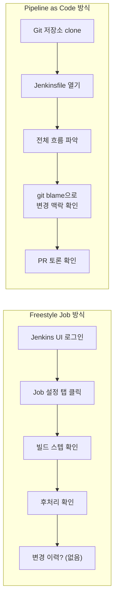
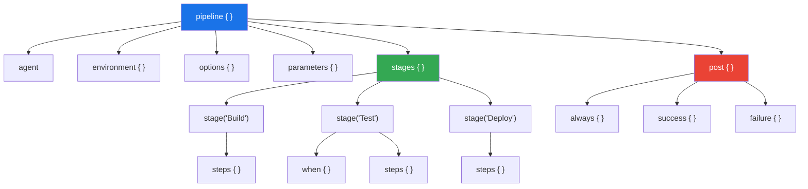
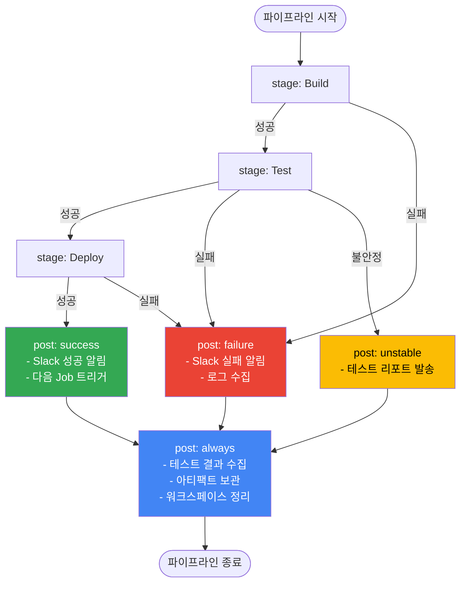

# Ch03. Declarative Pipeline

> **핵심 질문**: "Jenkinsfile을 코드로 관리하면 뭐가 달라지는가?"

---

## 1. Pipeline as Code

### 왜 UI 설정 대신 코드로 관리하는가

Jenkins의 초기 사용 방식인 Freestyle Job은 웹 UI에서 마우스 클릭으로 빌드 설정을 구성한다. 이 방식은 처음에는 직관적이지만, 팀 규모가 커지고 파이프라인이 복잡해지면 치명적인 한계에 부딪힌다. **Pipeline as Code는 빌드/배포 파이프라인을 소스 코드처럼 파일(Jenkinsfile)로 정의하고 Git 저장소에 함께 관리하는 접근법이다.**

Freestyle Job의 구체적 한계는 다음과 같다.

| 문제 | Freestyle Job | Pipeline as Code |
|------|---------------|-----------------|
| **변경 추적** | UI에서 설정 변경 시 누가 언제 뭘 바꿨는지 기록 없음 | Git 커밋 히스토리로 모든 변경 추적 가능 |
| **코드 리뷰** | 빌드 설정을 PR로 리뷰할 방법 없음 | Jenkinsfile도 PR 리뷰 대상에 포함 |
| **재현성** | Jenkins 서버 장애 시 설정 복구 어려움 | Git에서 clone하면 파이프라인 즉시 복원 |
| **환경 일관성** | 개발/스테이징/운영 환경별 Job을 각각 수동 설정 | 하나의 Jenkinsfile이 매개변수로 환경 분기 |
| **테스트 가능성** | 빌드 설정 자체를 테스트할 방법 없음 | Jenkinsfile 문법 검증(lint), 로컬 테스트 가능 |

### 실무 시나리오: 신규 입사자의 온보딩

신규 입사자가 프로젝트의 빌드/배포 파이프라인을 이해해야 하는 상황을 생각해보자. Freestyle Job 환경에서는 Jenkins UI에 로그인해서 각 Job의 설정 탭을 하나하나 클릭하며 빌드 스텝, 후처리 액션, 환경 변수를 파악해야 한다. 어떤 맥락에서 그 설정이 추가되었는지 알 수 없고, 관련 문서가 별도로 존재하지 않는 경우가 대부분이다.

반면 Pipeline as Code 환경에서는 저장소 루트의 `Jenkinsfile`을 열면 전체 파이프라인 흐름이 한 눈에 보인다. Git blame으로 각 라인이 언제, 누가, 왜 추가했는지 확인할 수 있고, 관련 PR의 토론 내용까지 추적할 수 있다. **파이프라인 자체가 살아있는 문서가 되는 것이다.**



> **다이어그램 설명**: Freestyle Job은 UI 탐색에 의존하며 변경 이력이 부재하다. Pipeline as Code는 Git 생태계의 모든 도구(blame, log, PR)를 활용해 파이프라인의 현재 상태뿐 아니라 변경 맥락까지 파악할 수 있다.

---

## 2. Declarative vs Scripted Pipeline

Jenkins Pipeline은 두 가지 문법을 지원한다. **Declarative Pipeline**과 **Scripted Pipeline**이다. 이 둘은 같은 Pipeline 엔진 위에서 동작하지만, 코드를 작성하는 방식과 제약 사항이 근본적으로 다르다.

### Declarative Pipeline

Declarative Pipeline은 Jenkins가 제공하는 구조화된 DSL(Domain Specific Language)이다. `pipeline {}` 블록을 최상위로 하여 정해진 블록 구조(`agent`, `stages`, `post` 등)를 따른다. Jenkins가 이 구조를 파싱하여 문법 오류를 빌드 실행 전에 검증할 수 있기 때문에, 잘못된 파이프라인이 실행되는 것을 사전에 방지한다.

```groovy
pipeline {
    agent any
    stages {
        stage('Build') {
            steps {
                sh 'mvn clean package'
            }
        }
    }
}
```

### Scripted Pipeline

Scripted Pipeline은 순수 Groovy 스크립트다. `node {}` 블록 안에서 자유롭게 Groovy 코드를 작성할 수 있어 조건 분기, 반복문, 예외 처리 등 프로그래밍 언어의 모든 기능을 사용할 수 있다. 그러나 이 자유도는 곧 복잡성으로 이어지며, 구조적 검증이 불가능하다.

```groovy
node {
    stage('Build') {
        try {
            sh 'mvn clean package'
        } catch (Exception e) {
            currentBuild.result = 'FAILURE'
            throw e
        }
    }
}
```

### 비교 테이블

| 항목 | Declarative | Scripted |
|------|-------------|----------|
| **문법** | 구조화된 DSL (`pipeline {}`) | 순수 Groovy (`node {}`) |
| **유연성** | 제한적 (정해진 블록 구조) | 완전한 Groovy 프로그래밍 |
| **사전 검증** | 문법 오류 실행 전 검출 | 실행 시점에만 오류 발견 |
| **에러 핸들링** | `post {}` 블록으로 선언적 처리 | `try-catch-finally` 직접 작성 |
| **러닝 커브** | 낮음 (블록 구조만 익히면 됨) | 높음 (Groovy 문법 필요) |
| **재시작** | 특정 stage부터 재시작 가능 | 처음부터 재실행만 가능 |
| **시각화** | Blue Ocean에서 구조 자동 표시 | 시각화 제한적 |
| **권장 상황** | 대부분의 CI/CD 파이프라인 | 동적 스테이지 생성, 복잡한 조건 로직 |

### 실무 가이드: 90/10 법칙

**실무에서 90%의 유스케이스는 Declarative Pipeline으로 충분하다.** 빌드, 테스트, 코드 분석, 도커 빌드, 배포라는 일반적 CI/CD 흐름은 Declarative의 구조화된 블록으로 깔끔하게 표현된다. 나머지 10%의 복잡한 로직(동적으로 병렬 스테이지를 생성하거나, 외부 API 응답에 따라 분기하는 경우)은 Declarative Pipeline 내부의 `script {}` 블록으로 "탈출"하여 Groovy 코드를 작성하면 된다. 전체를 Scripted로 작성할 필요가 없다.

```groovy
// Declarative 안에서 script {} 블록으로 탈출
pipeline {
    agent any
    stages {
        stage('Dynamic Stage') {
            steps {
                script {
                    // 여기서는 Groovy 코드 자유롭게 사용 가능
                    def services = ['api', 'web', 'worker']
                    services.each { svc ->
                        echo "Processing ${svc}"
                    }
                }
            }
        }
    }
}
```

---

## 3. 핵심 구조

Declarative Pipeline은 명확한 계층 구조를 갖는다. 이 구조를 이해하는 것이 Jenkinsfile 작성의 출발점이다.

```groovy
pipeline {                    // (1) 최상위 블록: 모든 것을 감싸는 컨테이너
    agent any                 // (2) 실행 환경: 어디서 실행할 것인가

    environment {             // (3) 환경 변수: 파이프라인 전역 변수
        APP_NAME = 'my-app'
        DEPLOY_ENV = 'staging'
    }

    options {                 // (4) 옵션: 파이프라인 동작 설정
        timeout(time: 30, unit: 'MINUTES')
        disableConcurrentBuilds()
    }

    parameters {              // (5) 매개변수: 빌드 시 사용자 입력
        string(name: 'BRANCH', defaultValue: 'main')
        booleanParam(name: 'SKIP_TESTS', defaultValue: false)
    }

    stages {                  // (6) 스테이지 컨테이너
        stage('Build') {      // (7) 개별 스테이지
            steps {           // (8) 실행할 명령들
                sh 'make build'
            }
        }
        stage('Test') {
            when {            // (9) 조건부 실행
                expression { !params.SKIP_TESTS }
            }
            steps {
                sh 'make test'
            }
        }
    }

    post {                    // (10) 후처리: 파이프라인 완료 후 실행
        always {
            cleanWs()
        }
        success {
            echo 'Build succeeded!'
        }
        failure {
            echo 'Build failed!'
        }
    }
}
```

### 각 블록의 역할과 존재 이유

- **`pipeline {}`**: 최상위 컨테이너다. Jenkins가 이 블록을 인식하여 Declarative Pipeline으로 파싱한다. 하나의 Jenkinsfile에는 하나의 `pipeline {}` 블록만 존재해야 한다.

- **`agent`**: 파이프라인이 실행될 환경을 지정한다. `any`는 사용 가능한 아무 에이전트에서 실행한다는 뜻이다. Docker 컨테이너나 특정 라벨의 노드를 지정할 수도 있다. 에이전트를 명시적으로 선언하는 이유는 빌드 환경의 재현성을 보장하기 위해서다.

- **`environment {}`**: 파이프라인 전역에서 사용할 환경 변수를 선언한다. 하드코딩 대신 환경 변수를 사용하면 동일한 Jenkinsfile로 여러 환경(dev/staging/prod)에 대응할 수 있다.

- **`stages {}`와 `stage()`**: stages는 순차적으로 실행될 스테이지들의 컨테이너이고, 각 stage는 논리적인 작업 단위다. 빌드, 테스트, 배포를 별도 스테이지로 분리하면 어디서 실패했는지 즉시 파악할 수 있고, Blue Ocean UI에서 각 스테이지의 상태를 시각적으로 확인할 수 있다.

- **`steps {}`**: 실제로 실행할 명령을 정의한다. `sh`, `bat`, `echo`, `archiveArtifacts` 등의 스텝을 나열한다.

- **`post {}`**: 파이프라인 실행 결과에 따라 후속 작업을 정의한다. 이것이 별도 블록으로 존재하는 이유는, 성공/실패와 무관하게 반드시 실행해야 하는 정리 작업이 있기 때문이다. Scripted Pipeline에서는 이를 `try-catch-finally`로 직접 구현해야 하지만, Declarative에서는 선언적으로 표현한다.



> **다이어그램 설명**: Declarative Pipeline의 블록 계층 구조를 나타낸다. `pipeline`이 최상위 컨테이너이며, 그 안에 `agent`, `environment`, `stages`, `post` 등이 동일 레벨로 존재한다. `stages` 아래에 개별 `stage`가 순서대로 배치되고, 각 stage는 `when` 조건과 `steps`를 포함할 수 있다. `post`는 실행 결과에 따라 분기하는 후처리 영역이다. 이 계층 구조 덕분에 Jenkins는 실행 전 문법을 검증하고, UI에서 각 stage를 시각적으로 표현할 수 있다.

---

## 4. Groovy DSL 핵심

Declarative Pipeline은 내부적으로 Groovy 기반 DSL이다. 자주 사용하는 핵심 기능들을 실무 패턴과 함께 살펴본다.

### 환경 변수

환경 변수는 세 가지 레벨에서 정의할 수 있다.

```groovy
pipeline {
    agent any

    // (1) 파이프라인 레벨: 모든 stage에서 접근 가능
    environment {
        APP_NAME = 'my-service'
        VERSION = sh(script: 'cat VERSION', returnStdout: true).trim()
    }

    stages {
        stage('Build') {
            // (2) 스테이지 레벨: 해당 stage 내에서만 유효
            environment {
                BUILD_OPTS = '-DskipTests'
            }
            steps {
                // (3) Jenkins 내장 변수: 자동으로 제공됨
                echo "빌드 번호: ${env.BUILD_NUMBER}"
                echo "작업 이름: ${env.JOB_NAME}"
                echo "앱 이름: ${env.APP_NAME}"
                sh "mvn clean package ${BUILD_OPTS}"
            }
        }
    }
}
```

환경 변수를 레벨별로 분리하는 이유는 **스코프 최소화 원칙** 때문이다. 모든 변수를 파이프라인 레벨에 선언하면 의도치 않은 참조가 발생할 수 있다. 특정 stage에서만 필요한 변수는 해당 stage의 `environment` 블록에 선언하여 영향 범위를 명확히 한다.

### 크레덴셜 바인딩

Jenkins는 **Credentials**라는 중앙 비밀값 저장소를 내장하고 있다(Manage Jenkins > Credentials). 비밀번호, API 토큰, SSH 키, 인증서 같은 민감 정보를 Jenkins가 암호화하여 보관하고, 파이프라인에서 ID로 참조하는 구조다. 환경변수에 직접 넣거나 파일로 서버에 두는 방식 대신 Credentials를 쓰는 이유는 세 가지다. 첫째, 비밀값이 Jenkinsfile이나 Git 히스토리에 노출되지 않는다. 둘째, Jenkins가 콘솔 로그에서 크레덴셜 값을 자동으로 마스킹(`****`)한다. 셋째, 접근 권한을 Jenkins의 폴더/도메인 단위로 제어할 수 있어, 특정 팀만 특정 크레덴셜을 사용하도록 격리할 수 있다.

**Jenkinsfile에 비밀값을 평문으로 작성하면 Git 히스토리에 영구히 남기 때문에 절대 하면 안 된다.**

```groovy
pipeline {
    agent any

    environment {
        // credentials()는 Jenkins에 저장된 크레덴셜을 참조한다
        // 로그에 마스킹(****)되어 출력됨
        DOCKER_CREDS = credentials('docker-hub-credentials')
        // Username/Password 타입이면 _USR, _PSW 접미사로 분리 접근 가능
        // DOCKER_CREDS_USR = username
        // DOCKER_CREDS_PSW = password
    }

    stages {
        stage('Docker Push') {
            steps {
                sh '''
                    echo ${DOCKER_CREDS_PSW} | docker login -u ${DOCKER_CREDS_USR} --password-stdin
                    docker push my-app:latest
                '''
            }
        }

        stage('Deploy with SSH Key') {
            steps {
                // withCredentials는 블록 스코프 내에서만 크레덴셜 노출
                withCredentials([
                    sshUserPrivateKey(
                        credentialsId: 'deploy-ssh-key',
                        keyFileVariable: 'SSH_KEY',
                        usernameVariable: 'SSH_USER'
                    )
                ]) {
                    sh '''
                        ssh -i ${SSH_KEY} ${SSH_USER}@prod-server "deploy.sh"
                    '''
                }
                // 이 시점에서 SSH_KEY, SSH_USER는 더 이상 접근 불가
            }
        }
    }
}
```

`credentials()` 함수와 `withCredentials` 블록의 차이를 이해해야 한다. `credentials()`는 `environment` 블록에서 사용하며 파이프라인 전체에서 접근 가능하다. `withCredentials`는 특정 블록 안에서만 크레덴셜을 바인딩하므로 스코프가 더 좁다. 보안 관점에서 **필요한 곳에서만 최소한의 범위로 크레덴셜을 노출하는 것이 원칙이다.**

위 코드에서 `sshUserPrivateKey`는 Jenkins 내장 함수가 아니라 **Credentials Binding Plugin**이 제공하는 바인딩 타입이다. 이 플러그인은 Jenkins에 저장된 크레덴셜을 파이프라인 변수에 매핑하는 역할을 하며, `withCredentials` 블록 안에서 사용할 수 있는 바인딩 타입을 여러 가지 제공한다. `usernamePassword`는 사용자명/비밀번호 쌍을, `string`은 Secret Text를, `file`은 Secret File을, 그리고 `sshUserPrivateKey`는 SSH 개인키를 바인딩한다. 어떤 바인딩 타입을 사용할 수 있는지는 Jenkins의 Pipeline Syntax 페이지(`<JENKINS_URL>/pipeline-syntax/`)에서 조회할 수 있다.

`ssh -i ${SSH_KEY}` 부분도 짚고 넘어갈 필요가 있다. SSH 프로토콜에서 `-i` 플래그는 identity file, 즉 인증에 사용할 개인키 파일의 경로를 지정하는 옵션이다. Jenkins가 하는 일은 Credentials 저장소에서 SSH 개인키를 꺼내 워크스페이스 내 임시 파일로 추출한 뒤, 그 파일 경로를 `keyFileVariable`로 지정한 변수(`SSH_KEY`)에 바인딩하는 것이다. `withCredentials` 블록이 끝나면 임시 키 파일은 자동으로 삭제되어 디스크에 남지 않는다.

### 조건부 실행 (when)

`when` 지시자는 특정 조건에서만 stage를 실행하도록 제어한다. 하나의 Jenkinsfile로 브랜치별, 환경별 분기 로직을 구현할 수 있다.

아래 코드에 등장하는 조건들의 출처를 먼저 정리하자. `branch`, `buildingTag()`, `allOf`, `anyOf`, `expression`은 모두 Jenkins Pipeline의 **내장 조건(built-in condition)**이다. 별도 플러그인 설치 없이 Declarative Pipeline에서 바로 사용할 수 있다.

`branch 'main'`이 동작하는 원리는 이렇다. Multibranch Pipeline에서 Jenkins가 각 브랜치를 스캔하면, 해당 빌드에 `env.BRANCH_NAME` 환경변수를 자동으로 주입한다. `branch` 조건은 내부적으로 이 `env.BRANCH_NAME` 값을 읽어서 지정된 패턴과 비교한다. 따라서 일반 Pipeline Job(단일 브랜치)에서는 `env.BRANCH_NAME`이 설정되지 않으므로 `branch` 조건이 항상 false가 된다는 점에 주의해야 한다. 일반 Pipeline Job에서 브랜치 분기가 필요하면 `expression { env.GIT_BRANCH?.contains('main') }` 같은 방식으로 우회한다.

`buildingTag()`는 Git 태그 push로 트리거된 빌드인지 확인하는 내장 조건이다. Jenkins가 태그를 감지하면 `env.TAG_NAME` 환경변수를 설정하는데, `buildingTag()`는 이 값이 존재하는지를 판별한다. 릴리스 태그(`v1.0.0` 등)를 push했을 때만 배포 stage를 실행하는 패턴에서 자주 쓰인다. `allOf`와 `anyOf`는 논리 연산자 역할의 내장 조건으로, 각각 AND와 OR에 해당한다. 여러 조건을 조합할 때 사용하며 중첩도 가능하다.

```groovy
stages {
    stage('Unit Test') {
        // 항상 실행 (when 없음)
        steps {
            sh 'mvn test'
        }
    }

    stage('SonarQube Analysis') {
        when {
            // main 또는 develop 브랜치에서만 실행
            anyOf {
                branch 'main'
                branch 'develop'
            }
        }
        steps {
            sh 'mvn sonar:sonar'
        }
    }

    stage('Deploy to Production') {
        when {
            // 복합 조건: main 브랜치이면서 태그가 있을 때만
            allOf {
                branch 'main'
                buildingTag()
            }
        }
        steps {
            sh './deploy.sh production'
        }
    }

    stage('Experimental Feature') {
        when {
            // 자유로운 Groovy 표현식
            expression {
                return env.BRANCH_NAME.startsWith('feature/') &&
                       params.ENABLE_EXPERIMENTAL == true
            }
        }
        steps {
            sh './experimental-build.sh'
        }
    }
}
```

`when`을 적극적으로 활용하면 **브랜치별로 별도의 Jenkins Job을 만들 필요가 없다.** 하나의 Jenkinsfile이 모든 브랜치의 파이프라인을 정의하면서, 브랜치 종류에 따라 실행할 스테이지를 동적으로 결정한다. 이것이 Multibranch Pipeline과 결합하면 강력한 자동화가 완성된다.

### 스크립트 블록

Declarative Pipeline의 구조적 제약을 벗어나야 할 때 `script {}` 블록을 사용한다.

```groovy
stage('Dynamic Parallel') {
    steps {
        script {
            // 외부 파일에서 서비스 목록을 읽어 동적으로 병렬 빌드
            def services = readJSON file: 'services.json'
            def parallelStages = [:]

            services.each { svc ->
                parallelStages[svc.name] = {
                    sh "docker build -t ${svc.name}:${env.BUILD_NUMBER} ${svc.path}"
                }
            }

            parallel parallelStages
        }
    }
}
```

---

## 5. Post Actions

`post` 블록은 파이프라인 또는 개별 stage의 실행이 완료된 후에 실행되는 후처리 영역이다. 실행 결과에 따라 다른 동작을 선언적으로 정의할 수 있다.

### Post Condition 종류

| 조건 | 실행 시점 | 실무 용도 |
|------|----------|----------|
| **always** | 성공/실패 무관하게 항상 | 워크스페이스 정리, 로그 아카이브 |
| **success** | 파이프라인 성공 시 | 성공 알림, 다음 파이프라인 트리거, 아티팩트 배포 |
| **failure** | 파이프라인 실패 시 | 실패 알림, 이슈 자동 생성, 디버그 로그 수집 |
| **unstable** | 테스트 실패 등으로 불안정 상태 | 테스트 리포트 발송, 담당자 알림 |
| **changed** | 이전 빌드와 결과가 달라졌을 때 | "다시 정상" 알림, 장애 복구 알림 |
| **aborted** | 빌드가 중단되었을 때 | 리소스 정리, 중단 사유 기록 |

### 스텝 출처 분류

아래 실무 패턴에 등장하는 함수들은 Jenkins 내장과 플러그인 제공이 섞여 있다. Jenkins 파이프라인에서 사용하는 스텝 대부분은 플러그인이 제공한다는 사실을 인지하는 것이 중요하다. "이 함수가 왜 안 되지?"라는 문제의 원인이 대부분 해당 플러그인 미설치이기 때문이다.

| 스텝 | 출처 | 설명 |
|------|------|------|
| `archiveArtifacts` | Jenkins 내장 | 빌드 결과물을 영구 저장, 별도 설치 불필요 |
| `build job` | Jenkins 내장 (Pipeline: Build Step) | 다른 Jenkins Job을 트리거 |
| `junit` | JUnit Plugin (기본 번들) | 테스트 결과 XML 파싱 및 리포팅, Jenkins 설치 시 기본 포함 |
| `jacoco` | JaCoCo Plugin | Java 코드 커버리지 리포트 수집 |
| `cleanWs()` | Workspace Cleanup Plugin | 워크스페이스 파일 전체 삭제 |
| `slackSend` | Slack Notification Plugin | Slack 채널로 메시지 발송 |
| `publishHTML` | HTML Publisher Plugin | HTML 리포트를 Jenkins UI에서 조회 가능하게 게시 |

어떤 스텝이 사용 가능한지 확인하려면 Jenkins의 Pipeline Syntax 페이지(`<JENKINS_URL>/pipeline-syntax/`)를 활용한다. 이 페이지는 현재 설치된 플러그인이 제공하는 모든 스텝을 조회할 수 있고, 파라미터를 GUI로 설정한 뒤 코드 스니펫을 생성해주므로 문법을 외울 필요가 없다.

### 실무 패턴

```groovy
post {
    always {
        // (1) 테스트 결과 리포트 수집 (성공/실패 무관)
        junit testResults: '**/target/surefire-reports/*.xml',
              allowEmptyResults: true

        // (2) 빌드 아티팩트 보관
        archiveArtifacts artifacts: '**/target/*.jar',
                         allowEmptyArchive: true

        // (3) 워크스페이스 정리 (디스크 공간 확보)
        cleanWs()
    }

    success {
        // (4) Slack 성공 알림
        slackSend(
            channel: '#ci-notifications',
            color: 'good',
            message: "${env.JOB_NAME} #${env.BUILD_NUMBER} 성공\n${env.BUILD_URL}"
        )

        // (5) 다음 파이프라인 트리거 (CD 연계)
        build job: 'deploy-to-staging',
              parameters: [string(name: 'VERSION', value: env.BUILD_NUMBER)],
              wait: false
    }

    failure {
        // (6) Slack 실패 알림 (멘션 포함)
        slackSend(
            channel: '#ci-notifications',
            color: 'danger',
            message: "@here ${env.JOB_NAME} #${env.BUILD_NUMBER} 실패!\n${env.BUILD_URL}console"
        )

        // (7) 실패 로그 수집
        archiveArtifacts artifacts: '**/target/*.log',
                         allowEmptyArchive: true
    }

    changed {
        // (8) 상태 변경 알림 (실패→성공: "복구됨", 성공→실패: "깨짐")
        script {
            if (currentBuild.currentResult == 'SUCCESS') {
                slackSend(color: 'good', message: "${env.JOB_NAME} 복구됨!")
            }
        }
    }
}
```

`post` 블록이 중요한 이유는, 빌드 실패 시에도 반드시 실행해야 하는 작업이 존재하기 때문이다. 테스트 결과 수집, 임시 파일 정리, 알림 발송은 빌드 성공 여부와 관계없이 수행되어야 한다. `post`의 `always` 조건이 이를 보장하며, Scripted Pipeline의 `try-catch-finally`보다 의도가 명확하게 드러난다.



> **다이어그램 설명**: 파이프라인의 실행 라이프사이클과 post actions의 실행 흐름을 나타낸다. stages가 순차적으로 실행되며, 어느 시점에서든 실패가 발생하면 남은 stages를 건너뛰고 `post: failure`로 이동한다. 핵심은 **`post: always`가 어떤 결과든 마지막에 반드시 실행된다는 점**이다. success/failure/unstable 등 결과별 post가 먼저 실행되고, 그 후 always가 실행된다. 이 순서를 이해해야 리소스 정리 로직을 올바른 위치에 배치할 수 있다.

---

## 6. 실전 Jenkinsfile 예시

아래는 Spring Boot 애플리케이션의 완전한 CI/CD 파이프라인 예시다. 각 스테이지가 왜 그 순서로 배치되었는지 주석으로 설명한다.

```groovy
pipeline {
    agent {
        docker {
            image 'maven:3.9-eclipse-temurin-17'
            args '-v /root/.m2:/root/.m2'   // Maven 캐시 공유로 빌드 속도 향상
        }
    }

    environment {
        APP_NAME = 'order-service'
        DOCKER_REGISTRY = 'registry.example.com'
        DOCKER_CREDS = credentials('docker-registry-creds')
        SONAR_TOKEN = credentials('sonarqube-token')
    }

    options {
        timeout(time: 30, unit: 'MINUTES')       // 무한 빌드 방지
        disableConcurrentBuilds()                  // 동시 빌드 충돌 방지
        buildDiscarder(logRotator(numToKeepStr: '10'))  // 오래된 빌드 자동 삭제
    }

    parameters {
        choice(name: 'DEPLOY_ENV', choices: ['none', 'dev', 'staging', 'prod'],
               description: '배포 대상 환경')
        booleanParam(name: 'SKIP_SONAR', defaultValue: false,
                     description: 'SonarQube 분석 건너뛰기')
    }

    stages {
        // 1단계: 컴파일 + 패키징
        // 가장 먼저 실행하여 코드가 기본적으로 컴파일되는지 확인한다.
        // 컴파일조차 실패하면 이후 단계를 진행할 의미가 없다.
        stage('Build') {
            steps {
                sh 'mvn clean package -DskipTests'
                stash includes: '**/target/*.jar', name: 'app-jar'
            }
        }

        // 2단계: 단위 테스트
        // 빌드 성공 후 테스트를 실행한다. 빌드와 분리하는 이유는
        // 빌드 실패와 테스트 실패를 구분하여 원인 파악을 빠르게 하기 위함이다.
        stage('Unit Test') {
            steps {
                sh 'mvn test'
            }
            post {
                always {
                    junit '**/target/surefire-reports/*.xml'
                    jacoco execPattern: '**/target/jacoco.exec'
                }
            }
        }

        // 3단계: 정적 코드 분석
        // 테스트 통과 후 코드 품질을 검사한다. 테스트 후에 배치하는 이유는
        // SonarQube가 테스트 커버리지 데이터(jacoco)를 함께 분석하기 때문이다.
        stage('SonarQube Analysis') {
            when {
                allOf {
                    not { expression { params.SKIP_SONAR } }
                    anyOf {
                        branch 'main'
                        branch 'develop'
                    }
                }
            }
            steps {
                withSonarQubeEnv('sonarqube-server') {
                    sh '''
                        mvn sonar:sonar \
                            -Dsonar.projectKey=${APP_NAME} \
                            -Dsonar.token=${SONAR_TOKEN}
                    '''
                }
            }
        }

        // 4단계: Docker 이미지 빌드
        // 코드 품질 검증까지 완료된 코드만 이미지로 만든다.
        // 불량 코드가 이미지로 만들어지는 것을 방지하기 위함이다.
        stage('Docker Build & Push') {
            when {
                anyOf {
                    branch 'main'
                    branch 'develop'
                }
            }
            steps {
                unstash 'app-jar'
                sh '''
                    docker build -t ${DOCKER_REGISTRY}/${APP_NAME}:${BUILD_NUMBER} .
                    docker tag ${DOCKER_REGISTRY}/${APP_NAME}:${BUILD_NUMBER} \
                               ${DOCKER_REGISTRY}/${APP_NAME}:latest
                    echo ${DOCKER_CREDS_PSW} | docker login ${DOCKER_REGISTRY} \
                        -u ${DOCKER_CREDS_USR} --password-stdin
                    docker push ${DOCKER_REGISTRY}/${APP_NAME}:${BUILD_NUMBER}
                    docker push ${DOCKER_REGISTRY}/${APP_NAME}:latest
                '''
            }
        }

        // 5단계: 배포
        // 모든 검증을 통과한 이미지만 배포한다.
        // 매개변수로 배포 환경을 제어하여 실수로 프로덕션에 배포하는 것을 방지한다.
        stage('Deploy') {
            when {
                expression { params.DEPLOY_ENV != 'none' }
            }
            steps {
                script {
                    if (params.DEPLOY_ENV == 'prod') {
                        // 프로덕션 배포는 수동 승인 필요
                        input message: "프로덕션에 배포하시겠습니까?",
                              ok: '배포 승인'
                    }
                }
                sh """
                    kubectl set image deployment/${APP_NAME} \
                        ${APP_NAME}=${DOCKER_REGISTRY}/${APP_NAME}:${BUILD_NUMBER} \
                        --namespace=${params.DEPLOY_ENV}
                """
            }
        }
    }

    post {
        always {
            cleanWs()
        }
        success {
            slackSend(
                channel: '#ci-cd',
                color: 'good',
                message: "${APP_NAME} #${BUILD_NUMBER} 파이프라인 성공 (${params.DEPLOY_ENV})"
            )
        }
        failure {
            slackSend(
                channel: '#ci-cd',
                color: 'danger',
                message: "@here ${APP_NAME} #${BUILD_NUMBER} 파이프라인 실패!\n${BUILD_URL}"
            )
        }
    }
}
```

### 스테이지 순서의 논리

위 파이프라인의 스테이지 순서에는 명확한 이유가 있다.

1. **Build** - 컴파일 실패를 가장 먼저 감지한다. 가장 빠르게 실패하여 피드백 루프를 최소화한다.
2. **Unit Test** - 빌드 성공 후 로직 검증을 수행한다. 빌드와 분리해야 어디서 문제가 생겼는지 한 눈에 파악된다.
3. **SonarQube** - 테스트 커버리지 데이터를 활용하므로 테스트 이후에 배치한다.
4. **Docker Build** - 품질 검증을 통과한 코드만 이미지로 만든다. 불량 코드를 이미지로 만드는 낭비를 방지한다.
5. **Deploy** - 최종 관문이다. 모든 검증이 완료된 이미지만 배포 대상이 된다.

이 순서를 **"빠른 실패(Fail Fast)"** 원칙이라고 한다. 비용이 낮은 단계(컴파일)를 먼저 실행하고, 비용이 높은 단계(배포)를 나중에 실행하여 불필요한 리소스 소모를 방지한다.

### 안티패턴

Jenkinsfile을 작성할 때 흔히 저지르는 실수들이 있다.

| 안티패턴 | 문제점 | 올바른 방식 |
|---------|--------|------------|
| **하나의 stage에 모든 steps** | 실패 원인 파악 불가, UI에서 진행 상황 불명확 | 논리적 단위로 stage 분리 |
| **하드코딩된 서버 주소/포트** | 환경 변경 시 Jenkinsfile 수정 필요 | `environment {}` 또는 `parameters`로 외부화 |
| **크레덴셜 평문 노출** | Git 히스토리에 비밀값 영구 기록 | `credentials()` 또는 `withCredentials` 사용 |
| **`script {}` 블록 남용** | Declarative의 구조적 이점(검증, 시각화) 상실 | `when`, `environment`, `post` 등 선언적 기능 우선 사용 |
| **`post` 미사용** | 실패 시 알림 없음, 워크스페이스 정리 안 됨 | 최소한 `always { cleanWs() }`와 `failure` 알림 |
| **타임아웃 미설정** | 무한 대기 빌드가 에이전트 점유 | `options { timeout(...) }` 필수 설정 |

---

## 7. 파이프라인 문법 레퍼런스

이 섹션은 Declarative Pipeline에서 자주 사용하는 블록과 스텝을 유형별로 정리한다. 앞선 섹션에서 개념을 설명했다면, 여기서는 "어떤 상황에서 어떤 문법을 사용하는가"를 빠르게 찾아볼 수 있도록 구성한다.

### 7.1 agent 유형별 사용법

`agent`는 파이프라인이 어디에서 실행될지를 결정한다. 유형에 따라 빌드 환경의 격리 수준과 재현성이 달라진다.

```groovy
// (1) any: 사용 가능한 아무 Agent에서 실행
// 용도: 간단한 파이프라인, Agent 선택이 중요하지 않을 때
pipeline {
    agent any
    stages { ... }
}

// (2) none: 파이프라인 레벨에서 Agent를 지정하지 않음
// 용도: stage마다 다른 Agent를 사용할 때 (멀티 환경 빌드)
pipeline {
    agent none
    stages {
        stage('Build on Linux') {
            agent { label 'linux' }
            steps { sh 'make build' }
        }
        stage('Build on Windows') {
            agent { label 'windows' }
            steps { bat 'msbuild /p:Configuration=Release' }
        }
    }
}

// (3) label: 특정 라벨이 붙은 Agent에서 실행
// 용도: GPU 서버, 특정 OS, 전용 빌드 머신 지정
pipeline {
    agent { label 'gpu && linux' }  // AND 조건
    stages { ... }
}

// (4) docker: Docker 컨테이너 안에서 실행
// 용도: 빌드 도구 버전을 고정하여 재현성 보장
pipeline {
    agent {
        docker {
            image 'maven:3.9-eclipse-temurin-17'
            args '-v $HOME/.m2:/root/.m2'          // 캐시 마운트
            label 'docker-capable'                  // Docker가 설치된 Agent에서
        }
    }
    stages { ... }
}

// (5) dockerfile: 저장소 내 Dockerfile로 빌드 환경 생성
// 용도: 프로젝트 전용 빌드 도구가 필요할 때 (커스텀 이미지)
pipeline {
    agent {
        dockerfile {
            filename 'Dockerfile.build'
            dir 'ci'                                // ci/Dockerfile.build 경로
            additionalBuildArgs '--build-arg HTTP_PROXY=http://proxy:3128'
        }
    }
    stages { ... }
}

// (6) kubernetes: K8s Pod으로 Agent 실행
// 용도: Kubernetes 환경에서 동적 Agent 프로비저닝
pipeline {
    agent {
        kubernetes {
            yaml '''
apiVersion: v1
kind: Pod
spec:
  containers:
  - name: maven
    image: maven:3.9-eclipse-temurin-17
    command: ['sleep']
    args: ['infinity']
  - name: docker
    image: docker:27-dind
    securityContext:
      privileged: true
'''
            defaultContainer 'maven'
        }
    }
    stages {
        stage('Build') {
            steps {
                sh 'mvn clean package'               // maven 컨테이너에서 실행
            }
        }
        stage('Docker Build') {
            steps {
                container('docker') {                 // docker 컨테이너로 전환
                    sh 'docker build -t my-app .'
                }
            }
        }
    }
}
```

`docker` agent와 `dockerfile` agent의 선택 기준은 명확하다. 공식 이미지(maven, node, gradle 등)로 충분하면 `docker`를 사용하고, 프로젝트 전용 도구나 라이브러리가 필요하면 `dockerfile`로 커스텀 이미지를 빌드한다. `dockerfile` 방식은 빌드 환경 자체를 Git에서 관리할 수 있으므로 재현성이 가장 높다.

### 7.2 steps 내장 함수

파이프라인 `steps {}` 블록에서 사용할 수 있는 주요 함수들이다.

#### 셸 명령 실행

```groovy
steps {
    // sh: Unix/Linux 셸 명령 실행
    sh 'echo "Hello World"'

    // 멀티라인 명령 (따옴표 주의)
    sh '''
        echo "Step 1"
        mvn clean package
        echo "Step 2"
    '''

    // 반환값 캡처 (returnStdout)
    script {
        def version = sh(
            script: 'cat pom.xml | grep "<version>" | head -1 | sed "s/.*>\\(.*\\)<.*/\\1/"',
            returnStdout: true
        ).trim()
        echo "Version: ${version}"
    }

    // 종료 코드 캡처 (returnStatus)
    script {
        def exitCode = sh(script: 'docker ps | grep my-container', returnStatus: true)
        if (exitCode != 0) {
            echo "컨테이너가 실행 중이 아님"
        }
    }

    // bat: Windows 배치 명령
    bat 'msbuild /p:Configuration=Release'

    // powershell: PowerShell 명령
    powershell 'Get-Process | Sort-Object CPU -Descending | Select-Object -First 5'
}
```

`returnStdout`과 `returnStatus`는 동시에 사용할 수 없다. 둘 다 `sh` 스텝의 동작을 변경하는데, `returnStdout: true`는 표준 출력을 문자열로 반환하고(실패 시 예외 발생), `returnStatus: true`는 종료 코드를 정수로 반환한다(실패해도 예외 발생 안 함). 상황에 따라 선택한다.

#### 파일 조작

```groovy
steps {
    // readFile: 파일 읽기
    script {
        def content = readFile(file: 'config.properties', encoding: 'UTF-8')
        echo content
    }

    // writeFile: 파일 쓰기
    writeFile(file: 'output/result.txt', text: 'Build successful', encoding: 'UTF-8')

    // readJSON: JSON 파일 파싱 (pipeline-utility-steps 플러그인 필요)
    script {
        def config = readJSON file: 'package.json'
        echo "App name: ${config.name}, Version: ${config.version}"
    }

    // readYaml: YAML 파일 파싱
    script {
        def deploy = readYaml file: 'deploy.yaml'
        echo "Replicas: ${deploy.spec.replicas}"
    }

    // fileExists: 파일 존재 확인
    script {
        if (fileExists('Dockerfile')) {
            sh 'docker build -t my-app .'
        } else {
            echo 'Dockerfile 없음, Docker 빌드 건너뜀'
        }
    }

    // dir: 작업 디렉토리 변경 (블록 스코프)
    dir('frontend') {
        sh 'npm install && npm run build'
    }
    // 이 시점에서 원래 디렉토리로 복귀
}
```

#### 아티팩트 관리

```groovy
steps {
    // stash: 파일을 Jenkins Controller 메모리에 임시 저장
    // 용도: stage 간 또는 Agent 간 파일 전달
    stash includes: '**/target/*.jar', name: 'build-artifacts'
    stash includes: 'frontend/dist/**', name: 'frontend-build'

    // unstash: stash한 파일 복원
    unstash 'build-artifacts'

    // archiveArtifacts: 빌드 결과물을 영구 저장
    // stash와 차이: stash는 파이프라인 내에서만, archive는 빌드 완료 후에도 접근 가능
    archiveArtifacts(
        artifacts: '**/target/*.jar, **/build/reports/**',
        fingerprint: true,         // 파일 핑거프린트로 추적 가능
        allowEmptyArchive: true    // 아티팩트 없어도 빌드 실패시키지 않음
    )
}
```

`stash`/`unstash`와 `archiveArtifacts`의 차이를 혼동하기 쉽다. `stash`는 파이프라인 실행 중에만 유효한 임시 저장소이며, 같은 파이프라인의 다른 stage나 다른 Agent로 파일을 전달할 때 사용한다. `archiveArtifacts`는 빌드 완료 후에도 Jenkins UI에서 다운로드할 수 있는 영구 저장이다.

### 7.3 흐름 제어

```groovy
stages {
    stage('Resilient Deploy') {
        steps {
            // retry: 실패 시 재시도
            // 용도: 일시적 네트워크 오류, 외부 서비스 불안정
            retry(3) {
                sh 'curl -f http://api.example.com/health'
            }

            // timeout: 시간 제한
            // 용도: 무한 대기 방지
            timeout(time: 5, unit: 'MINUTES') {
                sh './long-running-test.sh'
            }

            // waitUntil: 조건이 true가 될 때까지 반복
            // 용도: 배포 후 서비스가 준비될 때까지 대기
            timeout(time: 3, unit: 'MINUTES') {
                waitUntil(initialRecurrencePeriod: 5000) {   // 5초 간격
                    script {
                        def status = sh(
                            script: 'curl -s -o /dev/null -w "%{http_code}" http://app:8080/health',
                            returnStdout: true
                        ).trim()
                        return status == '200'
                    }
                }
            }

            // catchError: 에러를 잡되 빌드를 UNSTABLE로 표시
            // 용도: 실패해도 다음 stage를 계속 진행하고 싶을 때
            catchError(buildResult: 'UNSTABLE', stageResult: 'FAILURE') {
                sh './optional-integration-test.sh'
            }
        }
    }

    // input: 사람의 승인을 기다림
    stage('Production Deploy') {
        input {
            message '프로덕션에 배포하시겠습니까?'
            ok '배포 승인'
            submitter 'admin,devops-team'           // 승인 가능한 사용자/그룹
            parameters {
                choice(name: 'TARGET', choices: ['prod-a', 'prod-b', 'prod-all'],
                       description: '배포 대상 클러스터')
            }
        }
        steps {
            echo "배포 대상: ${TARGET}"
            sh "./deploy.sh ${TARGET}"
        }
    }
}
```

`retry`와 `timeout`은 반드시 함께 사용해야 한다. `retry(3)` 안에서 외부 API를 호출하는데 타임아웃이 없으면, 한 번의 시도가 무한히 걸릴 수 있어 retry가 의미 없어진다. `timeout` 안에 `retry`를 넣으면 전체 재시도에 상한을 두고, 개별 호출에도 curl의 `--max-time` 같은 내부 타임아웃을 설정하는 것이 안전하다.

### 7.4 병렬 실행

```groovy
// (1) 선언적 병렬 실행
stage('Parallel Tests') {
    parallel {
        stage('Unit Test') {
            agent { label 'linux' }
            steps {
                sh 'mvn test -pl unit-tests'
            }
        }
        stage('Integration Test') {
            agent { label 'linux' }
            steps {
                sh 'mvn test -pl integration-tests'
            }
        }
        stage('E2E Test') {
            agent { label 'browser' }
            steps {
                sh 'npm run test:e2e'
            }
        }
    }
}

// (2) failFast: 하나라도 실패하면 나머지 즉시 중단
stage('Parallel with failFast') {
    failFast true
    parallel {
        stage('Lint') {
            steps { sh 'npm run lint' }
        }
        stage('Type Check') {
            steps { sh 'npx tsc --noEmit' }
        }
        stage('Unit Test') {
            steps { sh 'npm test' }
        }
    }
}

// (3) 동적 병렬 실행 (script 블록 필요)
stage('Dynamic Parallel') {
    steps {
        script {
            def services = ['user-service', 'order-service', 'payment-service']
            def branches = [:]

            services.each { svc ->
                branches[svc] = {
                    node('docker') {
                        checkout scm
                        dir(svc) {
                            sh "docker build -t ${svc}:${BUILD_NUMBER} ."
                            sh "docker push registry.example.com/${svc}:${BUILD_NUMBER}"
                        }
                    }
                }
            }
            branches['failFast'] = true
            parallel branches
        }
    }
}
```

병렬 실행에서 `failFast`를 켤지 말지는 상황에 따라 다르다. CI의 빠른 피드백이 목적이면 `failFast: true`로 첫 실패 시 즉시 중단하는 것이 좋다. 반면, 모든 테스트 결과를 한 번에 확인하고 싶다면 `failFast: false`로 전체를 완료시킨 후 실패 목록을 리포팅하는 것이 유용하다.

### 7.5 Matrix 빌드

Matrix는 여러 축(axis)의 조합으로 빌드를 자동 생성한다. N*M 조합을 수동으로 나열하지 않아도 된다.

```groovy
// Java 버전 x OS 조합 = 6개 빌드 자동 생성
stage('Cross-Platform Test') {
    matrix {
        axes {
            axis {
                name 'JAVA_VERSION'
                values '17', '21'
            }
            axis {
                name 'OS'
                values 'linux', 'windows', 'macos'
            }
        }
        excludes {
            // 특정 조합 제외 (macOS + Java 17은 불필요)
            exclude {
                axis { name 'OS'; values 'macos' }
                axis { name 'JAVA_VERSION'; values '17' }
            }
        }
        stages {
            stage('Test') {
                agent { label "${OS}" }
                steps {
                    sh "java -version"
                    sh "./gradlew test -Pjava=${JAVA_VERSION}"
                }
            }
        }
    }
}
```

Matrix 빌드는 라이브러리나 프레임워크처럼 여러 런타임 환경을 지원해야 하는 프로젝트에서 특히 유용하다. 각 조합이 별도의 셀(cell)로 실행되므로 Jenkins UI에서 어떤 조합이 실패했는지 한눈에 파악할 수 있다.

### 7.6 triggers와 tools

```groovy
pipeline {
    agent any

    // triggers: 파이프라인을 자동으로 실행하는 트리거
    triggers {
        // cron: 정기적 실행 (Jenkins cron 문법)
        // H는 해시 기반 분산 — 모든 Job이 같은 시각에 실행되지 않도록 분산
        cron('H 2 * * 1-5')    // 평일 새벽 2시대에 실행

        // pollSCM: Git 변경 감지 (Webhook을 쓸 수 없을 때 대안)
        pollSCM('H/5 * * * *')  // 5분마다 Git 변경 확인

        // upstream: 다른 Job 완료 시 트리거
        upstream(upstreamProjects: 'build-library', threshold: hudson.model.Result.SUCCESS)
    }

    // tools: 빌드 도구 자동 설치 (Global Tool Configuration에 등록된 것)
    tools {
        maven 'Maven3'      // casc.yaml에서 정의한 Maven 설치
        jdk 'JDK17'         // casc.yaml에서 정의한 JDK 설치
        nodejs 'NodeJS22'   // casc.yaml에서 정의한 Node.js 설치
    }

    stages {
        stage('Build') {
            steps {
                sh 'mvn --version'     // Maven3가 PATH에 자동 추가됨
                sh 'java --version'    // JDK17이 JAVA_HOME에 설정됨
                sh 'node --version'    // NodeJS22가 PATH에 추가됨
            }
        }
    }
}
```

`cron`의 `H` 기호는 Jenkins 특유의 문법으로, 해시 기반 시간 분산을 의미한다. `H 2 * * *`는 "2시 00분~59분 사이의 어떤 시각"에 실행된다는 뜻이다. 모든 Job이 `0 2 * * *`(2시 정각)으로 설정되면 동시에 수십 개 빌드가 트리거되어 Agent 경합이 발생한다. `H`를 사용하면 Jenkins가 Job 이름의 해시값을 기반으로 시간을 분산시켜 이 문제를 방지한다.

### 7.8 실전 예시: Node.js + React 프로젝트

```groovy
pipeline {
    agent {
        docker {
            image 'node:22-alpine'
            args '-v $HOME/.npm:/root/.npm'
        }
    }

    environment {
        CI = 'true'
        DEPLOY_BUCKET = credentials('s3-deploy-bucket')
    }

    options {
        timeout(time: 15, unit: 'MINUTES')
        buildDiscarder(logRotator(numToKeepStr: '20'))
    }

    stages {
        stage('Install') {
            steps {
                sh 'npm ci'    // ci는 lock 파일 기반 정확한 설치 (install보다 빠르고 안정적)
            }
        }

        stage('Quality') {
            failFast true
            parallel {
                stage('Lint') {
                    steps { sh 'npm run lint' }
                }
                stage('Type Check') {
                    steps { sh 'npx tsc --noEmit' }
                }
                stage('Unit Test') {
                    steps { sh 'npm test -- --coverage' }
                    post {
                        always {
                            junit 'coverage/junit.xml'
                            publishHTML(target: [
                                reportName: 'Coverage Report',
                                reportDir: 'coverage/lcov-report',
                                reportFiles: 'index.html'
                            ])
                        }
                    }
                }
            }
        }

        stage('Build') {
            steps {
                sh 'npm run build'
                stash includes: 'dist/**', name: 'frontend-build'
            }
        }

        stage('Deploy to S3') {
            when { branch 'main' }
            agent { label 'aws-cli' }
            steps {
                unstash 'frontend-build'
                sh '''
                    aws s3 sync dist/ s3://${DEPLOY_BUCKET}/ \
                        --delete \
                        --cache-control "public, max-age=31536000"
                    aws cloudfront create-invalidation \
                        --distribution-id ${CF_DIST_ID} \
                        --paths "/*"
                '''
            }
        }
    }

    post {
        always { cleanWs() }
        failure {
            slackSend(
                channel: '#frontend',
                color: 'danger',
                message: "프론트엔드 빌드 실패: ${JOB_NAME} #${BUILD_NUMBER}\n${BUILD_URL}"
            )
        }
    }
}
```

### 7.9 실전 예시: Go 멀티모듈 프로젝트

```groovy
pipeline {
    agent {
        docker {
            image 'golang:1.23-alpine'
            args '-v go-mod-cache:/go/pkg/mod'
        }
    }

    environment {
        CGO_ENABLED = '0'
        GOFLAGS = '-mod=vendor'
        REGISTRY = 'registry.example.com'
    }

    stages {
        stage('Verify') {
            failFast true
            parallel {
                stage('Vet') {
                    steps { sh 'go vet ./...' }
                }
                stage('Lint') {
                    steps {
                        sh 'go install github.com/golangci/golangci-lint/cmd/golangci-lint@latest'
                        sh 'golangci-lint run ./...'
                    }
                }
                stage('Test') {
                    steps {
                        sh 'go test -race -coverprofile=coverage.out ./...'
                        sh 'go tool cover -func=coverage.out'
                    }
                }
            }
        }

        stage('Build Binaries') {
            steps {
                script {
                    def services = ['api-gateway', 'user-service', 'order-service']
                    def builds = [:]
                    services.each { svc ->
                        builds[svc] = {
                            sh """
                                go build -ldflags='-s -w -X main.version=${BUILD_NUMBER}' \
                                    -o bin/${svc} ./cmd/${svc}
                            """
                        }
                    }
                    parallel builds
                }
            }
        }

        stage('Docker Build & Push') {
            when { anyOf { branch 'main'; branch 'develop' } }
            steps {
                script {
                    def services = ['api-gateway', 'user-service', 'order-service']
                    def builds = [:]
                    services.each { svc ->
                        builds[svc] = {
                            sh """
                                docker build --build-arg BINARY=${svc} \
                                    -t ${REGISTRY}/${svc}:${BUILD_NUMBER} \
                                    -f deploy/Dockerfile .
                                docker push ${REGISTRY}/${svc}:${BUILD_NUMBER}
                            """
                        }
                    }
                    parallel builds
                }
            }
        }
    }

    post {
        always { cleanWs() }
    }
}
```

### 7.10 실전 예시: Gradle 멀티모듈 (Spring Boot)

```groovy
pipeline {
    agent {
        docker {
            image 'gradle:8.5-jdk17'
            args '-v gradle-cache:/home/gradle/.gradle'
        }
    }

    environment {
        GRADLE_OPTS = '-Dorg.gradle.daemon=false -Dorg.gradle.parallel=true'
    }

    options {
        timeout(time: 20, unit: 'MINUTES')
        buildDiscarder(logRotator(numToKeepStr: '10'))
    }

    stages {
        stage('Build') {
            steps {
                sh 'gradle clean build -x test'
            }
        }

        stage('Test') {
            steps {
                sh 'gradle test'
            }
            post {
                always {
                    junit '**/build/test-results/test/*.xml'
                    jacoco(
                        execPattern: '**/build/jacoco/*.exec',
                        classPattern: '**/build/classes/java/main',
                        sourcePattern: '**/src/main/java'
                    )
                }
            }
        }

        stage('SonarQube') {
            when { anyOf { branch 'main'; branch 'develop' } }
            steps {
                withSonarQubeEnv('sonarqube') {
                    sh 'gradle sonar'
                }
                timeout(time: 5, unit: 'MINUTES') {
                    waitForQualityGate abortPipeline: true
                }
            }
        }

        stage('Docker') {
            when { branch 'main' }
            steps {
                sh '''
                    gradle :app:bootBuildImage \
                        --imageName=registry.example.com/my-app:${BUILD_NUMBER}
                '''
                sh 'docker push registry.example.com/my-app:${BUILD_NUMBER}'
            }
        }
    }

    post {
        always { cleanWs() }
        failure {
            slackSend(channel: '#backend', color: 'danger',
                message: "백엔드 빌드 실패: ${JOB_NAME} #${BUILD_NUMBER}")
        }
    }
}
```

`waitForQualityGate`는 SonarQube의 Quality Gate 결과를 기다리는 스텝이다. SonarQube 분석은 비동기적으로 수행되므로, 분석 완료 후 품질 기준(커버리지 80% 이상 등)을 통과했는지 확인해야 한다. `abortPipeline: true`로 설정하면 Quality Gate를 통과하지 못한 빌드가 배포 단계로 진행되지 않는다.

---

## 핵심 요약

| 개념 | 한줄 요약 |
|------|----------|
| Pipeline as Code | 빌드 설정을 Git에서 코드처럼 관리하여 추적/리뷰/재현 가능하게 만드는 접근법 |
| Declarative Pipeline | 구조화된 DSL로 정의하는 파이프라인, 90%의 유스케이스를 커버하며 사전 검증이 가능 |
| Scripted Pipeline | 순수 Groovy 기반 파이프라인, 완전한 프로그래밍 자유도가 필요할 때 사용 |
| `agent` | 파이프라인이 실행될 환경(노드, Docker)을 지정하여 빌드 환경의 재현성 보장 |
| `environment` / `credentials()` | 하드코딩 방지와 비밀값 안전 관리를 위한 선언적 메커니즘 |
| `when` | 브랜치/조건별 stage 분기로 하나의 Jenkinsfile이 모든 환경을 커버 |
| `post` | 빌드 결과에 따른 후처리를 선언적으로 정의, 정리/알림/트리거 자동화 |
| Fail Fast 원칙 | 비용이 낮은 검증(컴파일)을 먼저, 비용이 높은 작업(배포)을 나중에 실행 |
