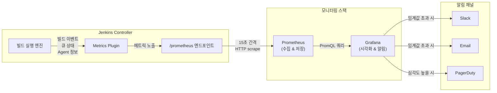
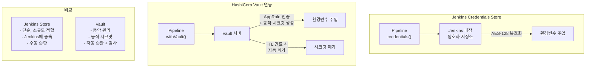
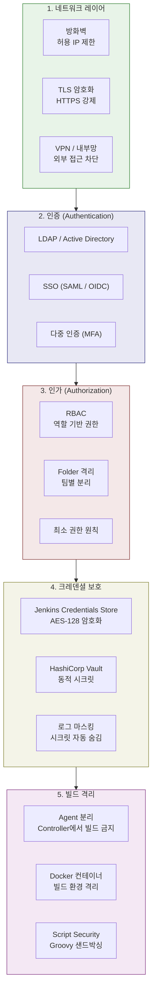
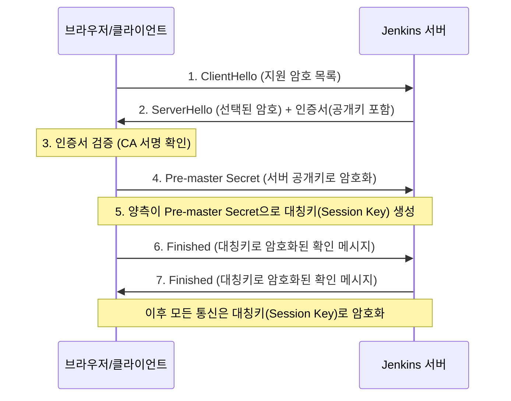

# Ch08. Observability & Security

**핵심 질문**: "Jenkins가 느려졌을 때 어디를 봐야 하는가?"

---

## 1. Jenkins 메트릭

### 왜 메트릭이 필요한가

Jenkins를 운영하다 보면 "빌드가 예전보다 느려졌다"는 불만이 나옵니다. 하지만 느려졌다는 것을 체감이 아닌 수치로 증명하지 못하면, 원인을 추적할 수 없습니다. "어제보다 30초 느려졌다"와 "지난 주 대비 P95가 2분 증가했다"는 완전히 다른 정보입니다. 전자는 감각이고 후자는 데이터입니다. 메트릭은 Jenkins의 건강 상태를 정량적으로 파악하고, 문제가 발생하기 전에 추세를 감지하여 선제적으로 대응할 수 있게 해줍니다.

### 빌드 시간 (Build Duration)

빌드 시간은 Jenkins 성능의 가장 직관적인 지표입니다. 평균 빌드 시간도 중요하지만, **P95(상위 5% 빌드 시간)**를 함께 봐야 하는 이유가 있습니다. 평균이 3분인데 P95가 15분이라면, 20번 중 1번은 개발자가 15분을 기다린다는 뜻입니다. 이런 편차는 특정 조건에서만 발생하는 병목을 암시합니다. 예를 들어, 특정 테스트가 외부 서비스 타임아웃을 기다리거나, Docker 이미지 풀이 캐시 미스로 오래 걸리는 상황입니다.

빌드 시간 트렌드를 주 단위로 관찰하면 더 유용한 패턴이 보입니다. 빌드 시간이 점진적으로 증가하는 추세는 코드베이스 성장에 따른 자연스러운 현상일 수 있지만, 급격한 점프가 있다면 특정 커밋이 무거운 의존성을 추가했거나 테스트 스위트가 비효율적으로 변경되었을 가능성이 높습니다. 이때 해당 시점의 커밋 로그를 역추적하면 원인을 빠르게 찾을 수 있습니다.

### 큐 대기시간 (Queue Wait Time)

큐 대기시간은 빌드가 트리거된 시점부터 실제로 Agent에서 실행되기 시작한 시점까지의 시간입니다. 이 지표가 중요한 이유는 개발자의 체감 빌드 시간에 직접 영향을 미치기 때문입니다. 빌드 자체는 3분이지만 큐에서 10분을 기다렸다면, 개발자 입장에서는 13분짜리 빌드입니다.

큐 대기시간이 길어지는 근본 원인은 **Agent 부족**입니다. 동시에 10개의 빌드가 트리거되었는데 Agent가 3개뿐이라면, 7개는 줄을 서야 합니다. 이 지표를 Agent 스케일링의 판단 기준으로 사용해야 합니다. 큐 대기시간의 평균이 2분을 초과하면 Agent 추가를 고려하고, 5분을 초과하면 즉시 스케일링이 필요하다는 것이 일반적인 기준입니다. 반대로, Agent 활용률이 20% 미만이면서 큐 대기시간이 0에 가깝다면 Agent가 과도하게 프로비저닝된 것이므로 비용 절감을 위해 축소를 검토할 수 있습니다.

### 에이전트 활용률 (Agent Utilization)

Agent 활용률은 전체 Agent 시간 중 실제 빌드에 사용된 시간의 비율입니다. 유휴 Agent가 많으면 인프라 비용이 낭비되고, Agent가 부족하면 큐 대기시간이 증가하여 개발자 생산성이 떨어집니다. 이 두 극단 사이에서 적정 수준을 찾는 것이 핵심입니다.

이상적인 활용률은 **60~80%**입니다. 100%에 가까우면 여유가 없어서 피크 시간대에 큐가 쌓이고, 50% 미만이면 비용 대비 효율이 떨어집니다. 시간대별 활용률 패턴을 분석하면 더 정교한 운영이 가능합니다. 예를 들어, 오전 10시~12시에 활용률이 90%를 넘고 야간에는 10%라면, 클라우드 기반 Agent의 오토스케일링을 설정하여 피크 시간에만 Agent를 늘리는 전략이 효과적입니다.

### 실패율 (Failure Rate)

빌드 실패율은 단순한 성공/실패 비율을 넘어서 **코드 품질의 간접 지표**로 활용할 수 있습니다. 전체 실패율보다는 프로젝트별, 브랜치별 실패율을 추적하는 것이 유용합니다. 특정 프로젝트의 실패율이 30%를 넘는다면, 해당 프로젝트의 테스트가 불안정(flaky)하거나 코드 품질에 구조적 문제가 있을 가능성이 높습니다.

실패 원인을 카테고리별로 분류하면 더 깊은 통찰을 얻을 수 있습니다. 컴파일 에러, 테스트 실패, 타임아웃, 인프라 장애(Agent 디스크 부족 등) 등으로 나누면, "우리 팀의 빌드 실패 중 40%는 flaky 테스트 때문"이라는 구체적인 개선 방향이 도출됩니다.

### 메트릭 수집 아키텍처



이 아키텍처에서 Jenkins는 메트릭을 생성하는 역할만 하고, 수집과 저장은 Prometheus가, 시각화와 알림은 Grafana가 담당합니다. 관심사를 분리함으로써 각 컴포넌트를 독립적으로 스케일링하고 관리할 수 있습니다. Jenkins Controller에 모니터링 부하를 주지 않는 것이 중요한데, Controller는 이미 빌드 오케스트레이션이라는 핵심 작업을 수행하고 있기 때문입니다.

---

## 2. Prometheus 연동

### Jenkins Prometheus Plugin

Jenkins Prometheus Plugin을 설치하면 `/prometheus` 엔드포인트가 생성되어, Prometheus가 HTTP GET 요청으로 메트릭을 수집(scrape)할 수 있습니다. 이 방식이 Jenkins가 Prometheus에 메트릭을 밀어넣는(push) 방식보다 나은 이유가 있습니다. Pull 방식은 Prometheus가 수집 주기와 대상을 제어하므로, Jenkins 장애 시에도 "메트릭이 오지 않는다"는 사실 자체가 장애 감지 신호가 됩니다. Push 방식에서는 Jenkins가 죽으면 메트릭도 함께 사라져서 장애를 늦게 인지할 수 있습니다.

### 주요 메트릭

**`jenkins_builds_total`**: 전체 빌드 수를 결과(result) 레이블별로 카운팅합니다. `jenkins_builds_total{result="SUCCESS"}`와 `jenkins_builds_total{result="FAILURE"}`의 비율을 계산하면 실패율을 구할 수 있습니다. 이 메트릭은 카운터(Counter) 타입이므로 누적값이며, `rate()` 함수를 사용하여 초당 빌드 수를 계산합니다.

**`jenkins_builds_duration_milliseconds`**: 빌드 소요 시간을 히스토그램(Histogram)으로 기록합니다. 히스토그램이므로 평균뿐 아니라 P50, P90, P95, P99 같은 분위수(quantile)를 계산할 수 있습니다. `histogram_quantile(0.95, rate(jenkins_builds_duration_milliseconds_bucket[1h]))`로 최근 1시간의 P95 빌드 시간을 구할 수 있습니다.

**`jenkins_queue_size`**: 현재 큐에서 대기 중인 빌드 수를 게이지(Gauge)로 나타냅니다. 이 값이 지속적으로 0보다 크면 Agent가 부족하다는 신호입니다. 순간적인 스파이크는 정상적이지만, 5분 이상 큐가 쌓여 있으면 조사가 필요합니다.

**`jenkins_agents_online`**: 현재 온라인 상태의 Agent 수입니다. 이 값이 갑자기 줄어들면 Agent 장애를 의미합니다. `jenkins_agents_online / jenkins_agents_total`로 Agent 가용률을 계산할 수 있고, 이 비율이 70% 미만이면 인프라 점검이 필요합니다.

### Prometheus 설정

```yaml
# prometheus.yml
scrape_configs:
  - job_name: 'jenkins'
    metrics_path: '/prometheus'
    scrape_interval: 15s
    static_configs:
      - targets: ['jenkins-controller:8080']
    # Jenkins 인증이 필요한 경우
    basic_auth:
      username: 'prometheus-user'
      password_file: '/etc/prometheus/jenkins-password'
```

### Grafana 대시보드 설정

Grafana에서 Jenkins 대시보드를 구성할 때, 네 가지 핵심 패널을 권장합니다.

**빌드 현황 패널**: 최근 24시간의 빌드 성공/실패 수를 시계열 그래프로 표시합니다. 색상으로 성공(녹색)과 실패(빨간색)를 구분하여 한눈에 상태를 파악할 수 있어야 합니다.

**Agent 상태 패널**: 온라인/오프라인 Agent 수를 게이지로 표시하고, 활용률을 퍼센트로 보여줍니다. Agent가 오프라인으로 전환되면 즉시 시각적으로 감지할 수 있어야 합니다.

**큐 트렌드 패널**: 큐 크기와 대기시간의 시계열 변화를 보여줍니다. 피크 시간대를 식별하고 스케일링 정책을 수립하는 데 활용합니다.

**실패율 히트맵**: 프로젝트별 실패율을 히트맵으로 표시하여, 어떤 프로젝트가 가장 많이 실패하는지 직관적으로 파악할 수 있게 합니다.

### 알림 규칙

```yaml
# Grafana Alert Rules
groups:
  - name: jenkins-alerts
    rules:
      - alert: JenkinsQueueTooLong
        expr: jenkins_queue_size > 5
        for: 5m
        labels:
          severity: warning
        annotations:
          summary: "Jenkins 큐 대기 빌드 {{ $value }}개 (5분 이상 지속)"
          description: "Agent 부족 가능성. Agent 스케일링 검토 필요."

      - alert: JenkinsHighFailureRate
        expr: |
          rate(jenkins_builds_total{result="FAILURE"}[1h])
          / rate(jenkins_builds_total[1h]) > 0.2
        for: 10m
        labels:
          severity: critical
        annotations:
          summary: "Jenkins 빌드 실패율 {{ $value | humanizePercentage }}"
          description: "최근 1시간 실패율 20% 초과. 빌드 로그 확인 필요."

      - alert: JenkinsAgentDown
        expr: jenkins_agents_online < jenkins_agents_total * 0.7
        for: 2m
        labels:
          severity: critical
        annotations:
          summary: "Jenkins Agent 가용률 70% 미만"
```

큐 대기시간이 5분을 초과하면 Warning, 실패율이 20%를 넘으면 Critical로 Slack 알림을 보내는 것이 일반적인 기준입니다. 알림 피로(Alert Fatigue)를 방지하기 위해 `for` 절을 사용하여 일시적인 스파이크에는 반응하지 않도록 설정합니다. 5분간 지속적으로 조건을 만족해야 알림이 발생하므로, 순간적인 빌드 몰림에는 불필요한 알림이 가지 않습니다.

---

## 3. 크레덴셜 관리

### 왜 크레덴셜 관리가 중요한가

CI/CD 파이프라인은 다양한 시크릿에 접근해야 합니다. Docker Hub 인증 정보, AWS 접근 키, 데이터베이스 비밀번호, API 토큰 등이 파이프라인 곳곳에서 사용됩니다. 이 시크릿들이 Jenkinsfile에 하드코딩되거나 환경변수로 노출되면, 소스 코드 저장소에 접근할 수 있는 모든 사람이 프로덕션 인프라에 대한 열쇠를 갖게 됩니다. 2021년 Codecov 사건처럼, CI/CD 파이프라인에서 유출된 시크릿이 수백 개 기업의 보안 사고로 이어진 사례가 이를 잘 보여줍니다.

### Jenkins Credentials Store

Jenkins는 빌트인 암호화 저장소인 Credentials Store를 제공합니다. 시크릿은 Jenkins Controller의 디스크에 AES-128로 암호화되어 저장되며, 마스터 키는 `$JENKINS_HOME/secrets/` 디렉토리에 보관됩니다.

**크레덴셜 종류**:

| 종류 | 용도 | 예시 |
|------|------|------|
| Username/Password | 기본 인증 | Docker Hub, Nexus, GitLab |
| SSH Key | SSH 기반 접근 | Git clone, 원격 서버 배포 |
| Secret Text | 단일 문자열 | API 토큰, Slack Webhook URL |
| Secret File | 파일 전체 | kubeconfig, GCP 서비스 계정 JSON |
| Certificate | X.509 인증서 | TLS 클라이언트 인증 |

**스코프(Scope)**는 크레덴셜의 접근 범위를 제어합니다. **Global** 스코프는 모든 Job에서 접근 가능하므로 공용 크레덴셜(Docker Hub 등)에 적합합니다. **System** 스코프는 Jenkins 시스템 설정에서만 사용 가능하고 Job에서는 접근할 수 없으므로, Jenkins 내부 통신용 크레덴셜(SMTP 비밀번호 등)에 사용합니다. **Folder** 스코프는 특정 폴더 하위의 Job에서만 접근 가능하므로, 팀별로 시크릿을 격리할 때 유용합니다.

```groovy
// Jenkinsfile에서 크레덴셜 사용
pipeline {
    agent any
    stages {
        stage('Deploy') {
            steps {
                withCredentials([
                    usernamePassword(
                        credentialsId: 'docker-hub-creds',
                        usernameVariable: 'DOCKER_USER',
                        passwordVariable: 'DOCKER_PASS'
                    ),
                    string(
                        credentialsId: 'slack-webhook',
                        variable: 'SLACK_URL'
                    )
                ]) {
                    sh 'docker login -u $DOCKER_USER -p $DOCKER_PASS'
                    sh 'curl -X POST $SLACK_URL -d "배포 완료"'
                }
            }
        }
    }
}
```

`withCredentials` 블록 내부에서 시크릿은 환경변수로 주입되며, 빌드 로그에서 자동으로 마스킹(`****`)됩니다. 블록을 벗어나면 환경변수가 해제되어 시크릿의 노출 범위를 최소화합니다.

### HashiCorp Vault 연동

Jenkins Credentials Store는 소규모 팀에서 충분하지만, 조직이 성장하면 한계가 드러납니다. Jenkins가 시크릿을 직접 저장하지 않고 **Vault에서 런타임에 가져오는** 방식이 더 안전한 이유는 세 가지입니다.

**중앙 집중 관리**: Jenkins뿐 아니라 Kubernetes, 애플리케이션 서버, CI/CD 도구 등 모든 시스템이 동일한 Vault에서 시크릿을 가져옵니다. 시크릿이 여러 시스템에 복제되지 않으므로 변경 시 한 곳만 수정하면 됩니다.

**시크릿 순환(Rotation) 자동화**: Vault는 데이터베이스 비밀번호 같은 동적 시크릿(Dynamic Secrets)을 지원합니다. 빌드가 실행될 때마다 임시 DB 크레덴셜을 생성하고, 빌드가 끝나면 자동으로 폐기합니다. 시크릿이 유출되더라도 TTL이 만료되면 무효화되므로 피해 범위가 제한됩니다.

**감사 로그**: Vault는 누가, 언제, 어떤 시크릿에 접근했는지를 상세히 기록합니다. Jenkins Credentials Store는 "누가 크레덴셜을 생성/수정했는지"는 기록하지만, "어떤 빌드가 런타임에 어떤 시크릿을 읽었는지"까지는 추적하기 어렵습니다.

```groovy
// Vault Plugin을 사용한 시크릿 주입
pipeline {
    agent any
    stages {
        stage('Deploy') {
            steps {
                withVault(
                    configuration: [
                        vaultUrl: 'https://vault.company.com',
                        vaultCredentialId: 'vault-approle'
                    ],
                    vaultSecrets: [[
                        path: 'secret/data/jenkins/docker',
                        secretValues: [
                            [envVar: 'DOCKER_USER', vaultKey: 'username'],
                            [envVar: 'DOCKER_PASS', vaultKey: 'password']
                        ]
                    ]]
                ) {
                    sh 'docker login -u $DOCKER_USER -p $DOCKER_PASS'
                }
            }
        }
    }
}
```

### 크레덴셜 흐름 비교



Vault 도입을 고려해야 하는 시점은 다음과 같습니다. 시크릿을 관리하는 시스템이 3개 이상이 되었을 때, 시크릿 순환 주기를 90일 이하로 유지해야 할 때, 컴플라이언스 감사에서 시크릿 접근 로그를 요구할 때입니다. 소규모 팀에서는 Jenkins Credentials Store로 충분하며, 불필요한 복잡성을 도입할 필요는 없습니다.

---

## 4. RBAC (Role-Based Access Control)

### Jenkins 기본 인가

Jenkins의 기본 보안 설정인 **Matrix-based Security**는 사용자별로 개별 권한을 부여합니다. 하지만 사용자가 50명이 넘어가면 관리가 비현실적이 됩니다. 새로운 프로젝트가 추가될 때마다 50명의 권한을 하나씩 조정해야 하기 때문입니다. 이것이 역할(Role) 기반 접근 제어가 필요한 이유입니다.

### Role Strategy Plugin

Role Strategy Plugin은 **역할을 정의하고, 사용자에게 역할을 부여**하는 방식으로 권한을 관리합니다. 역할은 세 가지 수준으로 나뉩니다.

**Global Roles**: Jenkins 전체에 적용되는 역할입니다. `admin`은 모든 권한을 가지고, `reader`는 조회만 가능합니다. 모든 사용자는 최소한 하나의 Global Role을 가져야 합니다.

**Project Roles**: 정규식으로 프로젝트를 매칭하여 해당 프로젝트에 대한 권한을 부여합니다. `frontend-.*` 패턴에 매칭되는 모든 Job에 대해 `frontend-team` 역할을 부여하면, 프론트엔드 팀은 `frontend-api`, `frontend-admin`, `frontend-mobile` 등 패턴에 맞는 Job만 접근할 수 있습니다. 새로운 프론트엔드 프로젝트가 추가되어도 네이밍 규칙만 지키면 자동으로 권한이 적용됩니다.

**Agent Roles**: 특정 Agent에 대한 접근을 제어합니다. GPU Agent는 ML 팀만, 프로덕션 배포 Agent는 DevOps 팀만 사용할 수 있도록 제한할 수 있습니다.

### 최소 권한 원칙 (Principle of Least Privilege)

최소 권한 원칙은 사용자에게 업무 수행에 필요한 최소한의 권한만 부여하는 보안 원칙입니다. Jenkins에 적용하면 다음과 같습니다.

- **개발자**: 자기 프로젝트의 빌드 조회 및 실행만 가능. 시스템 설정, 플러그인 관리, 다른 팀 프로젝트에는 접근 불가
- **테크리드**: 자기 팀 프로젝트의 Job 설정 변경 가능. 크레덴셜 생성은 불가
- **DevOps 엔지니어**: 시스템 설정, 크레덴셜 관리, Agent 관리 가능. 전체 Job 조회 가능
- **관리자**: 모든 권한. 플러그인 설치, 보안 설정 변경, 사용자 관리 포함

### JCasC로 RBAC 코드화

Jenkins Configuration as Code(JCasC)를 사용하면 RBAC 설정을 YAML 파일로 관리할 수 있습니다. 이렇게 하면 권한 변경이 Git을 통해 추적 가능해지고, 코드 리뷰를 거칠 수 있습니다.

```yaml
# jenkins.yaml (JCasC)
jenkins:
  authorizationStrategy:
    roleBased:
      roles:
        global:
          - name: "admin"
            permissions:
              - "Overall/Administer"
            entries:
              - user: "admin-user"
          - name: "reader"
            permissions:
              - "Overall/Read"
              - "Job/Read"
            entries:
              - group: "all-developers"
        items:
          - name: "frontend-developer"
            pattern: "frontend-.*"
            permissions:
              - "Job/Build"
              - "Job/Read"
              - "Job/Workspace"
              - "Run/Replay"
            entries:
              - group: "frontend-team"
          - name: "backend-developer"
            pattern: "backend-.*"
            permissions:
              - "Job/Build"
              - "Job/Read"
              - "Job/Workspace"
              - "Run/Replay"
            entries:
              - group: "backend-team"
          - name: "devops-engineer"
            pattern: ".*"
            permissions:
              - "Job/Build"
              - "Job/Read"
              - "Job/Configure"
              - "Job/Delete"
              - "Run/Delete"
              - "Run/Replay"
              - "Credentials/View"
            entries:
              - group: "devops-team"
```

이 설정에서 주목할 점은 `frontend-developer` 역할에 `Job/Configure` 권한이 없다는 것입니다. 프론트엔드 개발자는 빌드를 실행하고 결과를 확인할 수 있지만, Jenkinsfile 외의 Job 설정은 변경할 수 없습니다. 이렇게 하면 실수로 빌드 트리거나 파라미터를 잘못 변경하는 것을 방지할 수 있습니다.

---

## 5. 감사 로그 (Audit Trail)

### 왜 감사 로그가 필요한가

"어제 저녁에 누가 Jenkins 설정을 바꿨는데, 오늘 아침부터 빌드가 다 깨진다." 감사 로그 없이는 이 상황에서 원인을 찾기 위해 모든 팀원에게 물어봐야 합니다. 감사 로그가 있으면 "어제 19:32에 user-A가 Global Tool Configuration에서 JDK 경로를 변경했다"는 사실을 즉시 확인할 수 있습니다.

### Audit Trail Plugin

Audit Trail Plugin은 Jenkins에서 발생하는 주요 이벤트를 기록합니다.

**추적 대상**:
- 설정 변경: 시스템 설정, Job 설정, 플러그인 설정 변경
- 빌드 실행: 누가 어떤 빌드를 트리거했는지
- 크레덴셜 접근: 크레덴셜 생성, 수정, 삭제
- 플러그인 관리: 플러그인 설치, 업데이트, 삭제
- 사용자 관리: 사용자 생성, 권한 변경

### 컴플라이언스 요구사항

SOC2, ISO 27001, GDPR 같은 컴플라이언스 프레임워크는 **"누가, 언제, 무엇을 했는지"에 대한 추적 가능성(Traceability)**을 요구합니다. CI/CD 파이프라인은 프로덕션 코드를 변경하는 핵심 경로이므로, 감사 로그가 없으면 컴플라이언스 감사에서 지적 사항이 됩니다.

### 로그 저장 옵션

로그를 Jenkins 로컬 파일에만 저장하면 디스크 공간 부족이나 Jenkins 재설치 시 유실될 수 있습니다. 운영 환경에서는 **Syslog** 또는 **Elasticsearch**로 전송하여 중앙 집중 로그 시스템에 보관하는 것이 권장됩니다. Elasticsearch에 저장하면 Kibana를 통해 "지난 한 달 동안 크레덴셜을 수정한 모든 이벤트"를 검색할 수 있어 감사 대응이 훨씬 수월합니다.

---

## 6. 보안 베스트 프랙티스

### Controller에서 빌드 실행하지 않기

가장 중요한 보안 원칙입니다. Jenkins Controller는 모든 설정, 크레덴셜, 빌드 히스토리를 저장하는 핵심 노드입니다. 여기서 빌드를 실행하면 빌드 스크립트가 Controller의 파일 시스템에 접근할 수 있습니다. 악의적인 Jenkinsfile이 `$JENKINS_HOME/secrets/` 디렉토리를 읽거나, 다른 Job의 크레덴셜을 탈취할 수 있습니다. 빌드는 반드시 Agent에서만 실행해야 합니다.

```groovy
// jenkins.yaml (JCasC) - Controller에서 빌드 비활성화
jenkins:
  numExecutors: 0  # Controller의 executor를 0으로 설정
```

### Agent의 Controller 접근 제한

Jenkins Agent는 Controller와 통신하여 빌드 작업을 받고 결과를 보고합니다. 하지만 기본 설정에서는 Agent가 Controller의 파일 시스템에 접근할 수 있는 API를 호출할 수 있습니다. **Agent → Controller Access Control**을 활성화하면 Agent가 수행할 수 있는 Controller API 호출을 화이트리스트 방식으로 제한합니다.

### CSRF Protection

Cross-Site Request Forgery 공격은 인증된 사용자의 브라우저를 이용하여 악의적인 요청을 Jenkins에 보내는 것입니다. 예를 들어, 관리자가 악성 웹사이트를 방문하면 해당 사이트의 JavaScript가 관리자의 세션 쿠키를 이용하여 Jenkins에 "모든 Job 삭제" 요청을 보낼 수 있습니다. CSRF Protection을 활성화하면 모든 상태 변경 요청에 crumb(토큰)을 요구하므로 외부에서의 위조 요청을 차단합니다.

### Script Security Plugin

Groovy 스크립트는 Jenkins에서 강력한 기능을 제공하지만, 동시에 **가장 위험한 공격 벡터**이기도 합니다. 샌드박스 없이 Groovy를 실행하면 Jenkins JVM의 모든 권한으로 코드가 실행되어, 운영체제 명령 실행, 파일 시스템 접근, 네트워크 요청 등이 가능합니다. Script Security Plugin은 Groovy 코드를 **샌드박스** 환경에서 실행하여 허용된 API만 호출할 수 있도록 제한합니다. 새로운 API를 사용하려면 관리자가 명시적으로 승인해야 합니다.

### 정기적 플러그인 보안 업데이트

Jenkins 보안 취약점의 대부분은 플러그인에서 발생합니다. Jenkins Security Advisory는 정기적으로 플러그인 취약점을 공개하며, 패치가 나오면 즉시 업데이트해야 합니다. 오래된 플러그인은 알려진 CVE가 있을 수 있으므로, 최소 월 1회 플러그인 업데이트를 수행하는 프로세스를 갖추는 것이 좋습니다.

### 보안 레이어 아키텍처



이 다이어그램은 Jenkins의 보안을 다섯 개의 동심원 레이어로 보여줍니다. 각 레이어는 이전 레이어가 뚫렸을 때의 방어선 역할을 합니다. 네트워크 레이어가 뚫려도 인증이 막고, 인증이 뚫려도 인가가 막고, 인가가 뚫려도 크레덴셜이 암호화되어 있고, 최종적으로 빌드 격리가 피해 범위를 제한합니다. **심층 방어(Defense in Depth)**의 원칙입니다. 단일 보안 조치에 의존하면 그 조치가 무력화될 때 전체가 노출되지만, 여러 레이어를 갖추면 공격자가 모든 레이어를 동시에 뚫어야 하므로 공격 비용이 기하급수적으로 증가합니다.

---

## 요약

| 영역 | 핵심 질문 | 도구/플러그인 |
|------|----------|---------------|
| 메트릭 | 빌드가 느려지고 있는가? | Metrics Plugin, Prometheus |
| 시각화 | 어떤 프로젝트가 가장 문제인가? | Grafana |
| 크레덴셜 | 시크릿이 안전하게 관리되는가? | Credentials Store, Vault |
| 인가 | 누가 무엇에 접근할 수 있는가? | Role Strategy Plugin, JCasC |
| 감사 | 누가 무엇을 변경했는가? | Audit Trail Plugin |
| 보안 | 공격 표면을 최소화했는가? | Script Security, CSRF Protection |

관측 가능성(Observability)과 보안(Security)은 Jenkins 운영의 양 날개입니다. 관측 가능성 없이는 문제를 감지할 수 없고, 보안 없이는 시스템을 신뢰할 수 없습니다. 이 두 가지가 갖춰져야 Jenkins가 단순한 빌드 도구를 넘어서 팀의 소프트웨어 딜리버리를 안정적으로 지탱하는 플랫폼이 됩니다.

---

## 7. SSL/TLS와 Jenkins HTTPS 설정

### TLS 기초 개념

Jenkins를 운영 환경에서 사용할 때 HTTPS는 선택이 아닌 필수이다. HTTP로 Jenkins에 접근하면 로그인 비밀번호, API 토큰, 빌드 로그가 모두 평문으로 네트워크를 통해 전송된다. 같은 네트워크에 있는 공격자가 패킷을 캡처하면 Jenkins의 관리자 계정을 탈취할 수 있고, 이는 전체 CI/CD 파이프라인과 크레덴셜의 유출로 이어진다.

#### 대칭키와 비대칭키 암호화

TLS는 두 가지 암호화 방식을 조합하여 사용한다.

**대칭키 암호화**(AES 등)는 하나의 키로 암호화와 복호화를 모두 수행한다. 속도가 빠르기 때문에 실제 데이터 전송에 사용된다. 문제는 이 키를 상대방에게 어떻게 안전하게 전달하느냐이다. 키를 평문으로 전송하면 도청자가 키를 얻어 모든 통신을 복호화할 수 있다.

**비대칭키 암호화**(RSA, ECDSA 등)는 공개키와 개인키 쌍을 사용한다. 공개키로 암호화한 데이터는 개인키로만 복호화할 수 있다. 대칭키보다 수백 배 느리지만, 공개키를 누구에게나 공개해도 안전하다는 장점이 있다. TLS에서는 비대칭키로 대칭키를 안전하게 교환한 후, 실제 데이터 전송은 대칭키로 수행한다.

#### 인증서와 CA (Certificate Authority)

인증서는 "이 서버가 진짜 jenkins.example.com이 맞다"는 것을 증명하는 디지털 문서이다. 인증서에는 서버의 공개키, 도메인 이름, 유효 기간, 발급자 정보가 포함된다.

CA(인증 기관)는 인증서를 발급하는 신뢰할 수 있는 제3자이다. 브라우저와 운영체제에는 신뢰하는 CA 목록(Root CA)이 내장되어 있다. 서버가 인증서를 제시하면 클라이언트는 "이 인증서가 내가 신뢰하는 CA에 의해 서명되었는가?"를 검증한다. 서명이 유효하면 서버를 신뢰하고 TLS 연결을 수립한다.

자체 서명 인증서(Self-signed Certificate)는 CA 없이 직접 만든 인증서이다. 개발 환경에서는 사용할 수 있지만, 브라우저가 경고를 표시하고 자동화 스크립트에서 인증서 검증을 비활성화해야 하는 번거로움이 있다. 운영 환경에서는 반드시 CA가 서명한 인증서를 사용해야 한다.

#### TLS 핸드셰이크 과정



핸드셰이크는 약 1-2 RTT(Round Trip Time)가 소요된다. 이 오버헤드는 첫 연결 시에만 발생하며, TLS 세션 재사용(Session Resumption)으로 후속 연결에서는 단축된다.

### Jenkins HTTPS 설정 방법

Jenkins에 HTTPS를 적용하는 방법은 두 가지이다. 어떤 방식을 선택하느냐는 인프라 아키텍처에 달려 있다.

#### 방법 1: 리버스 프록시에서 TLS 종료 (권장)

가장 권장되는 방식이다. Nginx나 Apache 같은 리버스 프록시가 HTTPS를 처리하고, Jenkins에는 HTTP로 프록시한다. Jenkins 자체는 TLS를 모르므로 설정이 단순하다.

```nginx
# /etc/nginx/conf.d/jenkins.conf
server {
    listen 443 ssl http2;
    server_name jenkins.example.com;

    # 인증서 파일 경로
    ssl_certificate     /etc/letsencrypt/live/jenkins.example.com/fullchain.pem;
    ssl_certificate_key /etc/letsencrypt/live/jenkins.example.com/privkey.pem;

    # TLS 보안 설정
    ssl_protocols TLSv1.2 TLSv1.3;
    ssl_ciphers ECDHE-ECDSA-AES128-GCM-SHA256:ECDHE-RSA-AES128-GCM-SHA256;
    ssl_prefer_server_ciphers off;

    # HSTS: 브라우저에게 HTTPS만 사용하도록 강제
    add_header Strict-Transport-Security "max-age=63072000" always;

    location / {
        proxy_pass http://localhost:8080;

        # Jenkins가 프록시 뒤에 있음을 인식하도록 하는 헤더
        proxy_set_header Host              $host;
        proxy_set_header X-Real-IP         $remote_addr;
        proxy_set_header X-Forwarded-For   $proxy_add_x_forwarded_for;
        proxy_set_header X-Forwarded-Proto $scheme;
        proxy_set_header X-Forwarded-Port  443;

        # WebSocket 지원 (JNLP Agent 연결에 필요)
        proxy_http_version 1.1;
        proxy_set_header   Upgrade $http_upgrade;
        proxy_set_header   Connection "upgrade";

        # Jenkins UI의 큰 응답을 처리하기 위한 버퍼 설정
        proxy_buffering    off;
        proxy_request_buffering off;
    }
}

# HTTP → HTTPS 리다이렉트
server {
    listen 80;
    server_name jenkins.example.com;
    return 301 https://$host$request_uri;
}
```

이 방식이 권장되는 이유는 세 가지이다. 첫째, TLS 인증서 관리가 Jenkins와 분리되어 인증서 갱신 시 Jenkins를 재시작할 필요가 없다. 둘째, Nginx가 TLS 핸드셰이크를 처리하므로 Jenkins의 JVM 리소스를 절약한다. 셋째, 같은 Nginx에서 여러 서비스의 TLS를 일괄 관리할 수 있다.

Jenkins가 리버스 프록시 뒤에 있음을 인식하도록 `X-Forwarded-*` 헤더 설정이 필수이다. 이 헤더가 없으면 Jenkins가 자기 URL을 `http://localhost:8080`으로 생성하여 리다이렉트 루프나 링크 깨짐이 발생한다.

#### 방법 2: Jenkins에 직접 TLS 설정

리버스 프록시 없이 Jenkins가 직접 HTTPS를 처리하는 방법이다. 소규모 환경이나 테스트 목적에 적합하다.

```bash
# 1. Java KeyStore 생성 (PKCS12 형식)
# Let's Encrypt에서 발급받은 인증서를 KeyStore로 변환
openssl pkcs12 -export \
    -in /etc/letsencrypt/live/jenkins.example.com/fullchain.pem \
    -inkey /etc/letsencrypt/live/jenkins.example.com/privkey.pem \
    -out /var/jenkins_home/jenkins.p12 \
    -name jenkins \
    -passout pass:changeit

# 2. Jenkins 시작 시 HTTPS 옵션 추가
java -jar jenkins.war \
    --httpsPort=8443 \
    --httpsKeyStore=/var/jenkins_home/jenkins.p12 \
    --httpsKeyStorePassword=changeit \
    --httpPort=-1    # HTTP 비활성화 (HTTPS만 허용)
```

Docker 환경에서는 docker-compose.yml에 환경변수로 설정한다.

```yaml
jenkins-controller:
    image: jenkins/jenkins:lts-jdk17
    ports:
      - "8443:8443"
    environment:
      - JENKINS_OPTS=--httpsPort=8443 --httpsKeyStore=/var/jenkins_home/jenkins.p12 --httpsKeyStorePassword=changeit --httpPort=-1
    volumes:
      - jenkins-data:/var/jenkins_home
      - ./certs/jenkins.p12:/var/jenkins_home/jenkins.p12:ro
```

이 방식의 단점은 인증서 갱신 시 Jenkins를 재시작해야 한다는 것이다. JVM이 KeyStore를 시작 시점에 로드하므로, 인증서가 변경되면 재시작 없이는 반영되지 않는다.

### Let's Encrypt 자동 갱신

Let's Encrypt는 무료 CA로, 90일짜리 인증서를 자동으로 발급하고 갱신할 수 있다. certbot을 사용한 자동 갱신 설정이다.

```bash
# certbot 설치 (Ubuntu)
sudo apt install certbot python3-certbot-nginx

# 인증서 발급 (Nginx 플러그인)
sudo certbot --nginx -d jenkins.example.com

# 자동 갱신 테스트
sudo certbot renew --dry-run

# cron으로 자동 갱신 (이미 certbot이 설정함)
# /etc/cron.d/certbot
0 0,12 * * * root certbot renew --quiet --deploy-hook "systemctl reload nginx"
```

`--deploy-hook`은 인증서 갱신 성공 후에만 실행되는 훅이다. Nginx를 reload하면 새 인증서를 반영한다. Jenkins를 재시작할 필요 없이 Nginx만 reload하면 되므로, 리버스 프록시 방식의 운영 편의성이 여기서도 드러난다.

### Kubernetes Ingress TLS

Kubernetes 환경에서는 Ingress Controller와 cert-manager로 TLS를 자동화한다.

```yaml
# cert-manager ClusterIssuer (Let's Encrypt)
apiVersion: cert-manager.io/v1
kind: ClusterIssuer
metadata:
  name: letsencrypt-prod
spec:
  acme:
    server: https://acme-v02.api.letsencrypt.org/directory
    email: devops@example.com
    privateKeySecretRef:
      name: letsencrypt-prod-key
    solvers:
      - http01:
          ingress:
            class: nginx

---
# Jenkins Ingress with TLS
apiVersion: networking.k8s.io/v1
kind: Ingress
metadata:
  name: jenkins
  namespace: jenkins
  annotations:
    cert-manager.io/cluster-issuer: letsencrypt-prod    # 자동 인증서 발급
    nginx.ingress.kubernetes.io/proxy-body-size: "50m"   # 큰 아티팩트 업로드 허용
    nginx.ingress.kubernetes.io/proxy-read-timeout: "120" # 긴 API 호출 대응
spec:
  ingressClassName: nginx
  tls:
    - hosts:
        - jenkins.example.com
      secretName: jenkins-tls     # cert-manager가 자동 생성/갱신하는 Secret
  rules:
    - host: jenkins.example.com
      http:
        paths:
          - path: /
            pathType: Prefix
            backend:
              service:
                name: jenkins
                port:
                  number: 8080
```

cert-manager는 인증서 만료 30일 전에 자동으로 갱신하고, Kubernetes Secret을 업데이트한다. Ingress Controller(Nginx)가 Secret 변경을 감지하여 새 인증서를 자동 적용하므로, 운영자가 인증서 만료를 걱정할 필요가 없다. 이것이 Kubernetes 환경에서 TLS를 관리하는 가장 성숙한 방법이다.

### TLS 설정 검증

TLS를 설정한 후에는 반드시 검증해야 한다. 설정이 잘못되면 보안이 보장되지 않거나 브라우저 경고가 발생한다.

```bash
# 인증서 체인 확인
openssl s_client -connect jenkins.example.com:443 -servername jenkins.example.com < /dev/null 2>/dev/null | openssl x509 -noout -dates -subject -issuer

# TLS 버전 확인 (TLS 1.2 이상만 허용되는지)
nmap --script ssl-enum-ciphers -p 443 jenkins.example.com

# curl로 HTTPS 접근 테스트
curl -vI https://jenkins.example.com/login 2>&1 | grep -E "SSL|TLS|subject|issuer|expire"

# SSL Labs 온라인 검증 (가장 종합적)
# https://www.ssllabs.com/ssltest/ 에서 도메인 입력
# A+ 등급을 목표로 한다
```

TLS 1.0과 1.1은 알려진 취약점(BEAST, POODLE)이 있으므로 반드시 비활성화해야 한다. 2026년 기준으로 TLS 1.2와 1.3만 허용하는 것이 표준이다.

### 파이프라인 내부 통신의 TLS 고려사항

Jenkins에 HTTPS를 적용하면 브라우저 접근은 안전해지지만, 파이프라인 내부에서 발생하는 통신까지 자동으로 보호되지는 않는다. Controller↔Agent 연결, 파이프라인에서 호출하는 외부 서비스, Webhook 수신 등 각 통신 경로를 개별적으로 점검해야 한다.

#### Controller ↔ Agent 통신

Jenkins Agent는 두 가지 방식으로 Controller에 연결된다.

**SSH Agent**(practice 환경에서 사용)는 SSH 프로토콜 자체가 암호화를 제공하므로 별도의 TLS 설정이 필요 없다. SSH 키 쌍으로 인증과 암호화가 모두 처리된다. 다만 Agent의 `known_hosts` 검증을 비활성화(`manuallyTrustedKeyVerificationStrategy`)하면 중간자 공격에 취약해지므로, 운영 환경에서는 Host Key를 고정하는 것이 안전하다.

**JNLP/WebSocket Agent**는 Controller의 50000번 포트(TCP) 또는 WebSocket으로 연결된다. Controller가 HTTPS 뒤에 있으면 WebSocket 연결도 WSS(WebSocket Secure)로 자동 보호된다. 그러나 TCP 방식(Inbound Agent)은 TLS와 별개이므로 추가 설정이 필요하다.

```groovy
// Jenkinsfile에서 JNLP Agent의 TLS 연결 확인
// Jenkins 관리 > Configure Global Security > Agent protocols
// "Inbound TCP Agent Protocol/4 (TLS)" 만 활성화하고 나머지는 비활성화한다
```

```yaml
# CasC로 Agent 프로토콜 제한
jenkins:
  agentProtocols:
    - "JNLP4-connect"    # TLS 기반 프로토콜만 허용
    # "JNLP-connect", "JNLP2-connect" 등 구버전 비활성화
```

#### K8s Controller + VM Agent 혼합 환경의 보안 갭

Controller가 Kubernetes에서 Istio 서비스 메시 안에 있고, Agent가 VM에서 메시 밖에 있는 환경은 주의가 필요하다. Controller 측은 Istio mTLS, NetworkPolicy, PeerAuthentication으로 보호되지만, 실제 외부 통신(git clone, docker push, API 호출 등)은 **Agent VM에서 발생**한다. Agent가 메시 밖이므로 이 구간에는 Istio 보안이 적용되지 않는다. 결국 보안 체인은 가장 약한 링크(VM Agent)가 결정하게 된다.

대응 방안은 세 가지다. 첫째, Agent도 K8s Pod으로 전환하여 Istio 메시 안으로 진입시키는 것이 근본 해결이다(Ch09 참조). 둘째, VM Agent를 유지해야 한다면 SSH Agent + VPN/WireGuard 터널링으로 Controller-Agent 구간을 암호화한다. 셋째, Agent VM의 방화벽에서 외부 통신 허용 목록을 최소화하고, 크레덴셜은 Vault 동적 시크릿으로 발급하여 Agent에 장기 시크릿이 남지 않도록 한다.

> **교차 참조**: Service Mesh 보안 아키텍처 → `03_CloudNative/03-service-mesh/learning/04` (mTLS/제로트러스트)

#### Java TrustStore와 사내 CA 인증서

파이프라인에서 사내 HTTPS 서비스(GitLab, SonarQube, Nexus, Docker Registry 등)에 접근할 때 가장 흔한 오류는 `PKIX path building failed`이다. 이 오류는 Jenkins JVM이 해당 서버의 인증서를 발급한 CA를 신뢰하지 않기 때문에 발생한다. 공인 CA(Let's Encrypt, DigiCert 등)가 발급한 인증서는 문제없지만, 사내 자체 CA가 발급한 인증서는 JVM의 TrustStore(`cacerts`)에 수동으로 등록해야 한다.

```bash
# 1. 사내 CA 인증서를 Jenkins Controller JVM의 cacerts에 추가
# Jenkins Controller 컨테이너 내부에서 실행
keytool -importcert \
    -alias company-root-ca \
    -file /tmp/company-root-ca.crt \
    -keystore $JAVA_HOME/lib/security/cacerts \
    -storepass changeit \
    -noprompt

# 2. 등록 확인
keytool -list \
    -keystore $JAVA_HOME/lib/security/cacerts \
    -storepass changeit \
    -alias company-root-ca

# 3. Jenkins 재시작 (JVM이 cacerts를 시작 시점에 로드하므로)
```

Docker 환경에서는 Dockerfile로 CA 인증서를 빌드 시점에 포함시키는 것이 권장된다. 컨테이너가 재생성되어도 CA 인증서가 유지되기 때문이다.

```dockerfile
# Jenkins Controller 커스텀 이미지
FROM jenkins/jenkins:lts-jdk17

# 사내 CA 인증서 복사 및 JVM TrustStore에 등록
COPY company-root-ca.crt /tmp/company-root-ca.crt
USER root
RUN keytool -importcert \
        -alias company-root-ca \
        -file /tmp/company-root-ca.crt \
        -keystore $JAVA_HOME/lib/security/cacerts \
        -storepass changeit \
        -noprompt \
    && rm /tmp/company-root-ca.crt
USER jenkins
```

Agent에서도 동일한 작업이 필요하다. Agent가 Docker 이미지를 빌드하거나 Maven/Gradle로 의존성을 다운로드할 때 사내 레지스트리에 HTTPS로 접근하기 때문이다.

```dockerfile
# Jenkins Agent 커스텀 이미지
FROM jenkins/ssh-agent:jdk17

COPY company-root-ca.crt /tmp/company-root-ca.crt
USER root
RUN keytool -importcert \
        -alias company-root-ca \
        -file /tmp/company-root-ca.crt \
        -keystore $JAVA_HOME/lib/security/cacerts \
        -storepass changeit \
        -noprompt \
    # OS 레벨 인증서도 등록 (curl, git 등 non-Java 도구용)
    && cp /tmp/company-root-ca.crt /usr/local/share/ca-certificates/ \
    && update-ca-certificates \
    && rm /tmp/company-root-ca.crt
USER jenkins
```

중요한 점은 JVM TrustStore(`keytool`)와 OS TrustStore(`update-ca-certificates`)를 **모두** 등록해야 한다는 것이다. Java 기반 도구(Maven, Gradle)는 JVM TrustStore를, 네이티브 도구(curl, git, docker)는 OS TrustStore를 사용한다.

#### 파이프라인에서 HTTPS 서비스 호출 시 도구별 설정

파이프라인 단계에서 다양한 도구가 HTTPS 엔드포인트에 접근한다. CA 인증서가 TrustStore에 등록되어 있으면 대부분 자동으로 작동하지만, 도구별로 추가 설정이 필요한 경우가 있다.

```groovy
pipeline {
    agent { label 'docker' }

    stages {
        // 1. Git Clone — 사내 GitLab (HTTPS)
        // CA가 TrustStore에 등록되어 있으면 추가 설정 불필요
        // 등록되지 않은 경우의 임시 우회 (운영 환경에서는 금지)
        stage('Checkout') {
            steps {
                // 정상: CA 등록 후 그냥 사용
                git url: 'https://gitlab.company.com/team/app.git',
                    credentialsId: 'gitlab-token'

                // ❌ 비권장: sslVerify 비활성화 (개발 디버깅용으로만)
                // sh 'git -c http.sslVerify=false clone https://...'
            }
        }

        // 2. Maven/Gradle — 사내 Nexus (HTTPS)
        // JVM TrustStore에 CA가 등록되어 있으면 자동 작동
        stage('Build') {
            steps {
                sh './mvnw clean package -s settings.xml'
                // settings.xml의 <repository> URL이 https://nexus.company.com/...
                // 이면 JVM이 자동으로 TLS 검증을 수행한다
            }
        }

        // 3. Docker Push — 사내 Registry (HTTPS)
        stage('Push Image') {
            steps {
                sh '''
                    # Docker daemon이 사내 Registry의 인증서를 신뢰해야 한다
                    # 방법 1: daemon.json에 insecure-registries 추가 (HTTP용, HTTPS와 무관)
                    # 방법 2: CA 인증서를 Docker의 cert 디렉토리에 배치
                    #   /etc/docker/certs.d/registry.company.com:5000/ca.crt

                    docker build -t registry.company.com:5000/app:${BUILD_NUMBER} .
                    docker push registry.company.com:5000/app:${BUILD_NUMBER}
                '''
            }
        }

        // 4. SonarQube 분석 — HTTPS 엔드포인트
        stage('SonarQube') {
            steps {
                withSonarQubeEnv('SonarQube') {
                    // SonarQube Scanner는 JVM 기반이므로 cacerts에 CA가 있으면 작동
                    sh './mvnw sonar:sonar'
                }
            }
        }

        // 5. curl로 외부 API 호출
        stage('Notify') {
            steps {
                sh '''
                    # OS TrustStore에 CA가 등록되어 있으면 자동 작동
                    curl -X POST https://hooks.company.com/deploy \
                        -H "Content-Type: application/json" \
                        -d '{"status": "success"}'

                    # CA가 등록되지 않은 경우 인증서 직접 지정 (insecure보다 안전)
                    # curl --cacert /path/to/company-ca.crt https://...
                '''
            }
        }
    }
}
```

#### docker build 내부의 CA 중첩 문제

Agent 컨테이너에 CA를 등록했더라도, `docker build`의 `RUN` 명령은 **빌드 컨테이너 내부**의 Trust Store를 참조한다. Agent에서 직접 `mvn install`을 실행하면 Agent JVM의 cacerts를 사용하므로 성공하지만, `docker build` 안의 `RUN mvn install`은 빌드 컨테이너의 Trust Store를 사용하므로 사내 Nexus 접근에 실패한다. 같은 명령인데 실행 위치에 따라 결과가 달라지는 것이 혼란의 원인이다.

```
┌─ Agent 컨테이너 ──────────────────────────────────────┐
│  OS Trust Store ③ + JVM Trust Store ④                 │
│  sh 'mvn install'  → ④ 참조 → 성공                   │
│                                                       │
│  sh 'docker build .'                                  │
│  ┌─ docker build 내부 (RUN 명령) ──────────────────┐  │
│  │  OS Trust Store ⑤  (빌드 컨테이너, CA 없음)     │  │
│  │  RUN mvn install  → ⑤ 참조 → 실패              │  │
│  └─────────────────────────────────────────────────┘  │
└───────────────────────────────────────────────────────┘
```

**방법 1: Dockerfile에 CA를 COPY하여 등록**

빌드 대상 애플리케이션의 Dockerfile에 CA를 포함시킨다. 멀티 스테이지 빌드를 사용하면 최종 런타임 이미지에는 CA가 포함되지 않는다.

```dockerfile
# 애플리케이션 Dockerfile
FROM maven:3.9-eclipse-temurin-17 AS build
COPY company-root-ca.crt /usr/local/share/ca-certificates/
RUN update-ca-certificates \
    && keytool -importcert -alias company-ca \
        -file /usr/local/share/ca-certificates/company-root-ca.crt \
        -keystore $JAVA_HOME/lib/security/cacerts \
        -storepass changeit -noprompt
COPY pom.xml .
RUN mvn dependency:go-offline   # 이제 사내 Nexus 접근 가능

FROM eclipse-temurin:17-jre
COPY --from=build /app/target/*.jar /app.jar
# 최종 이미지에는 CA 불필요
```

CA 파일을 소스 저장소에 포함시키기 꺼려지면, Jenkins Pipeline에서 Credential로 주입한다.

```groovy
stage('Docker Build') {
    steps {
        withCredentials([file(credentialsId: 'company-ca-cert', variable: 'CA_CERT')]) {
            sh '''
                cp $CA_CERT company-root-ca.crt
                docker build -t registry.company.com:5000/app:${BUILD_NUMBER} .
            '''
        }
    }
}
```

**방법 2: BuildKit secret mount (CA가 최종 이미지 레이어에 남지 않음)**

BuildKit의 `--mount=type=secret`을 사용하면 CA 파일이 빌드 캐시나 최종 이미지 레이어에 포함되지 않는다. 보안 관점에서 가장 깔끔한 방법이다.

```dockerfile
# syntax=docker/dockerfile:1
FROM maven:3.9-eclipse-temurin-17 AS build
RUN --mount=type=secret,id=ca_cert,target=/usr/local/share/ca-certificates/company-ca.crt \
    update-ca-certificates && mvn dependency:go-offline
```

```bash
docker buildx build --secret id=ca_cert,src=company-root-ca.crt -t my-app .
```

**CA가 필요한 전체 레이어 정리:**

| 레이어 | 대상 도구 | CA 필요 시점 |
|---|---|---|
| ② Docker Daemon | `docker pull/push` | 사내 레지스트리 접근 시 |
| ③ Agent OS | curl, git, docker CLI | 사내 HTTPS 서비스 접근 시 |
| ④ Agent JVM | Maven, Gradle, SonarQube | Agent에서 직접 실행 시 |
| ⑤ docker build 내부 | `RUN mvn/npm/pip install` | Dockerfile 빌드 중 사내 의존성 다운로드 시 |

DinD(Docker-in-Docker) 사이드카를 사용하는 경우, ②도 별도 컨테이너이므로 DinD 이미지에도 CA를 포함시켜야 한다. 결국 사내 CA 환경에서 `docker build` 안에 사내 의존성 다운로드가 있으면, Agent 이미지와 애플리케이션 Dockerfile **양쪽 모두**에 CA를 등록해야 한다.

#### npm, pip 등 패키지 매니저의 TLS 설정

Node.js와 Python 기반 빌드에서 사내 레지스트리를 HTTPS로 사용하는 경우 각 패키지 매니저의 CA 설정이 필요하다.

```groovy
stage('Node.js Build') {
    steps {
        // npm: 사내 Registry + 사내 CA
        sh '''
            npm config set registry https://nexus.company.com/repository/npm-group/
            npm config set cafile /etc/ssl/certs/company-root-ca.crt
            npm install
        '''
    }
}

stage('Python Build') {
    steps {
        // pip: 사내 PyPI + 사내 CA
        sh '''
            pip install --index-url https://nexus.company.com/repository/pypi/simple/ \
                        --cert /etc/ssl/certs/company-root-ca.crt \
                        -r requirements.txt
        '''
    }
}
```

`strict-ssl=false`나 `--trusted-host` 같은 검증 비활성화 옵션은 중간자 공격을 허용하므로 운영 환경에서는 절대 사용하지 않는다. 반드시 CA 인증서를 등록하는 방식으로 해결해야 한다.

#### Webhook 수신 TLS

GitHub, GitLab 등이 Jenkins에 Webhook을 보낼 때, Jenkins가 HTTPS 뒤에 있어야 Webhook 페이로드가 암호화된다. 이 부분은 앞서 다룬 리버스 프록시 또는 Ingress TLS 설정으로 이미 보호되지만, Webhook 발신 측에서 Jenkins의 인증서를 검증한다는 점을 알아야 한다.

```yaml
# GitHub Webhook 설정 시
# Webhook URL: https://jenkins.example.com/github-webhook/
# SSL verification: Enable (기본값, 반드시 활성화 유지)
#
# 자체 서명 인증서를 사용하면 GitHub가 Webhook 전송을 거부한다.
# → 운영 환경에서는 공인 CA 인증서 필수
#
# GitHub Enterprise (사내 설치형)의 경우:
# Settings > SSL verification > "Disable" 가능하지만 비권장
# 사내 CA를 GitHub Enterprise에도 등록하는 것이 올바른 해결책
```

#### 내부 통신 TLS 체크리스트

| 통신 경로 | 프로토콜 | TLS 적용 방법 | 확인 사항 |
|----------|---------|-------------|----------|
| 브라우저 → Jenkins | HTTPS | 리버스 프록시 또는 직접 TLS | 인증서 유효기간, HSTS |
| Controller → Agent (SSH) | SSH | SSH 키 인증 (자체 암호화) | Host Key 검증 활성화 |
| Controller ↔ Agent (JNLP) | TCP/WSS | JNLP4 프로토콜 + WebSocket | JNLP4만 활성화 |
| Pipeline → Git (사내) | HTTPS | JVM/OS TrustStore에 CA 등록 | `git ls-remote` 테스트 |
| Pipeline → Maven/Gradle (사내) | HTTPS | JVM TrustStore에 CA 등록 | 의존성 다운로드 테스트 |
| Pipeline → Docker Registry | HTTPS | Docker cert 디렉토리에 CA 배치 | `docker pull` 테스트 |
| Pipeline → SonarQube | HTTPS | JVM TrustStore에 CA 등록 | Scanner 분석 실행 |
| Pipeline → npm/pip | HTTPS | 각 도구의 cafile 설정 | `npm install` 테스트 |
| GitHub/GitLab → Jenkins | HTTPS | 리버스 프록시 TLS | Webhook 전송 로그 확인 |

자체 서명 인증서(Self-signed) 환경에서 가장 흔한 실수는 검증을 비활성화(`-k`, `sslVerify=false`, `strict-ssl=false`)하는 것이다. 이런 우회는 개발 환경에서의 임시 디버깅용으로만 허용되며, 운영 환경에서는 반드시 CA 인증서를 각 TrustStore에 등록하는 방식으로 해결해야 한다. 하나의 사내 CA 인증서를 커스텀 Docker 이미지에 포함시키면 모든 도구에서 일관되게 작동한다.

---

## 8. 환경별 운영 체크리스트

Jenkins를 어떤 인프라에서 운영하느냐에 따라 신경 써야 할 포인트가 달라진다. 이 섹션은 VM, Docker, Kubernetes 세 가지 환경에서 Jenkins를 안정적으로 운영하기 위한 체크리스트를 정리한다.

### VM 환경

| 항목 | 권장 설정 | 확인 주기 |
|------|----------|----------|
| JENKINS_HOME 백업 | thinBackup 플러그인 + 파일 시스템 스냅샷 병행 | 일 1회 |
| JVM 힙 메모리 | `-Xmx` 물리 메모리의 50% 이하, G1GC 사용 | 분기 1회 재검토 |
| 디스크 사용률 | 빌드 보존 정책(`Discard old builds`) + `cleanWs()` 필수 | 주 1회 모니터링 |
| 플러그인 업데이트 | 스테이징 Jenkins에서 먼저 테스트 후 프로덕션 적용 | 월 1회 |
| Jenkins LTS 업그레이드 | 현재 버전 + 2 LTS 이내 유지, 업그레이드 전 백업 필수 | 분기 1회 |
| OS 패치 | 커널, OpenSSL 등 보안 패치 | 월 1회 |

**JVM 튜닝**: Jenkins Controller가 100개 이상의 Job을 관리하면 기본 힙 설정으로는 부족하다. `-Xmx2g -Xms1g -XX:+UseG1GC`가 일반적인 시작점이며, GC 로그(`-Xlog:gc*`)를 활성화하여 Full GC 빈도를 모니터링해야 한다. Full GC가 하루 3회 이상이면 힙 증설을 검토한다.

**디스크 관리**: 빌드 아티팩트와 워크스페이스가 쌓이면서 디스크가 차는 것은 VM Jenkins에서 가장 흔한 장애 원인이다. Job 설정에서 `Discard old builds`로 보존 개수를 제한하고, 파이프라인 `post { always { cleanWs() } }`로 워크스페이스를 정리한다. `/var/jenkins_home/workspace/`와 `/var/jenkins_home/jobs/*/builds/`의 디스크 사용량을 주기적으로 확인한다.

**업그레이드 절차**: Jenkins LTS 업그레이드는 (1) 백업 → (2) 스테이징에서 테스트 → (3) 플러그인 호환성 확인 → (4) 프로덕션 적용 순서로 진행한다. 업그레이드 후 문제가 발생하면 백업에서 JENKINS_HOME을 복원하고 이전 WAR 파일로 롤백한다.

### Docker 환경

| 항목 | 권장 설정 | 확인 주기 |
|------|----------|----------|
| 컨테이너 리소스 제한 | `mem_limit: 1536m`, `cpus: 1.5` (Controller 기준) | 초기 설정 |
| 헬스체크 | `curl -f http://localhost:8080/login` (interval 30s) | 초기 설정 |
| 로그 로테이션 | Docker 로그 드라이버 `max-size: 10m`, `max-file: 3` | 초기 설정 |
| 볼륨 백업 | `docker run --rm -v jenkins-data:/data alpine tar czf` | 주 1회 |
| Docker Socket 보안 | Controller에 마운트 금지, Agent에만 제한적 마운트 | 초기 설정 |
| 이미지 태그 고정 | `jenkins/jenkins:2.479.2-lts-jdk17` 형태로 특정 버전 | 업그레이드 시 |

**리소스 제한의 중요성**: Docker 환경에서 리소스 제한을 설정하지 않으면 Jenkins Controller가 호스트의 메모리를 모두 소모하여 다른 컨테이너까지 영향을 줄 수 있다. `deploy.resources.limits`로 상한을 설정하되, JVM 힙(`-Xmx`)은 컨테이너 메모리 제한의 60-70%로 맞춘다. 나머지 30-40%는 메타스페이스, 스레드 스택, OS 오버헤드에 필요하다.

**Docker Socket 보안**: `/var/run/docker.sock`을 컨테이너에 마운트하면 해당 컨테이너가 호스트의 모든 컨테이너를 제어할 수 있다. Controller에는 Docker 접근이 불필요하므로 마운트하지 않고, Agent에만 마운트한다. 더 안전한 대안은 Kaniko나 BuildKit rootless를 사용하여 Docker Socket 없이 이미지를 빌드하는 것이다.

**이미지 태그 고정**: `lts-jdk17` 같은 롤링 태그는 개발 환경에서는 편리하지만, 운영 환경에서는 예고 없는 업그레이드가 발생할 수 있다. `2.479.2-lts-jdk17` 형태로 특정 버전을 고정하고, 업그레이드는 의도적으로 수행해야 한다.

### Kubernetes 환경

| 항목 | 권장 설정 | 확인 주기 |
|------|----------|----------|
| PodDisruptionBudget | `minAvailable: 1` (Controller) | 초기 설정 |
| Liveness Probe | `/login` HTTP GET, initialDelay 120s | 초기 설정 |
| Readiness Probe | `/login` HTTP GET, initialDelay 60s | 초기 설정 |
| PV ReclaimPolicy | `Retain` (삭제 시 데이터 보존) | 초기 설정 |
| PV 백업 | VolumeSnapshot 또는 Velero | 일 1회 |
| Resource Quota | Agent 네임스페이스에 총 CPU/메모리 상한 설정 | 초기 설정 |
| NetworkPolicy | Agent → Controller(8080, 50000), Registry만 허용 | 초기 설정 |
| Ingress + TLS | cert-manager로 인증서 자동 갱신 | 초기 설정 |

**PodDisruptionBudget**: 노드 업그레이드나 drain 이벤트 시 Controller Pod이 강제 종료되면 진행 중인 모든 빌드가 실패한다. PDB를 설정하면 최소 1개의 Controller Pod이 항상 가용하도록 보장하여, 클러스터 유지보수 중에도 Jenkins가 중단되지 않는다.

**Liveness/Readiness Probe**: Controller Pod이 OOM이나 교착 상태로 응답 불능이 되면 Kubernetes가 자동으로 재시작해야 한다. `initialDelaySeconds`를 충분히 길게 설정해야 하는 이유는 Jenkins 시작(플러그인 로딩, JCasC 적용)에 60-120초가 걸리기 때문이다. 시작 중에 Probe가 실패하면 무한 재시작 루프에 빠진다.

**PV 백업 전략**: `ReclaimPolicy: Delete`가 기본값인 StorageClass가 많으므로, Helm 릴리즈를 삭제하면 PVC와 PV가 함께 삭제되어 Jenkins 데이터가 영구 유실된다. `Retain`으로 변경하면 PVC 삭제 후에도 PV가 보존된다. VolumeSnapshot이 지원되는 클라우드 환경이라면 일 1회 스냅샷으로 시점 복구가 가능하고, 온프레미스에서는 Velero로 PV를 포함한 전체 백업을 수행한다.

### 공통 알림 규칙 (Prometheus Alertmanager)

환경에 관계없이 다음 알림 규칙은 필수적이다.

```yaml
# 예시: Prometheus alerting rules
groups:
  - name: jenkins
    rules:
      - alert: JenkinsBuildQueueStuck
        expr: jenkins_queue_size > 0
        for: 10m
        labels:
          severity: warning
        annotations:
          summary: "빌드 큐가 10분 이상 비어지지 않음 — Agent 부족 가능성"

      - alert: JenkinsBuildSuccessRateLow
        expr: |
          rate(jenkins_builds_total{result="SUCCESS"}[1h])
          / rate(jenkins_builds_total[1h]) < 0.8
        for: 30m
        labels:
          severity: critical
        annotations:
          summary: "빌드 성공률이 30분간 80% 미만 — 코드 또는 인프라 문제"

      - alert: JenkinsAgentOffline
        expr: jenkins_agents_online / jenkins_agents_total < 0.7
        for: 5m
        labels:
          severity: critical
        annotations:
          summary: "Agent 가용률 70% 미만 — Agent 장애 확인 필요"
```

이 알림이 없으면 "빌드가 안 돌아간다"는 개발자의 신고로 문제를 인지하게 되는데, 그때는 이미 큐에 빌드가 수십 개 쌓인 후이다. 알림을 통해 문제를 조기에 감지하면 Agent 스케일링이나 장애 복구를 개발자가 체감하기 전에 완료할 수 있다.
