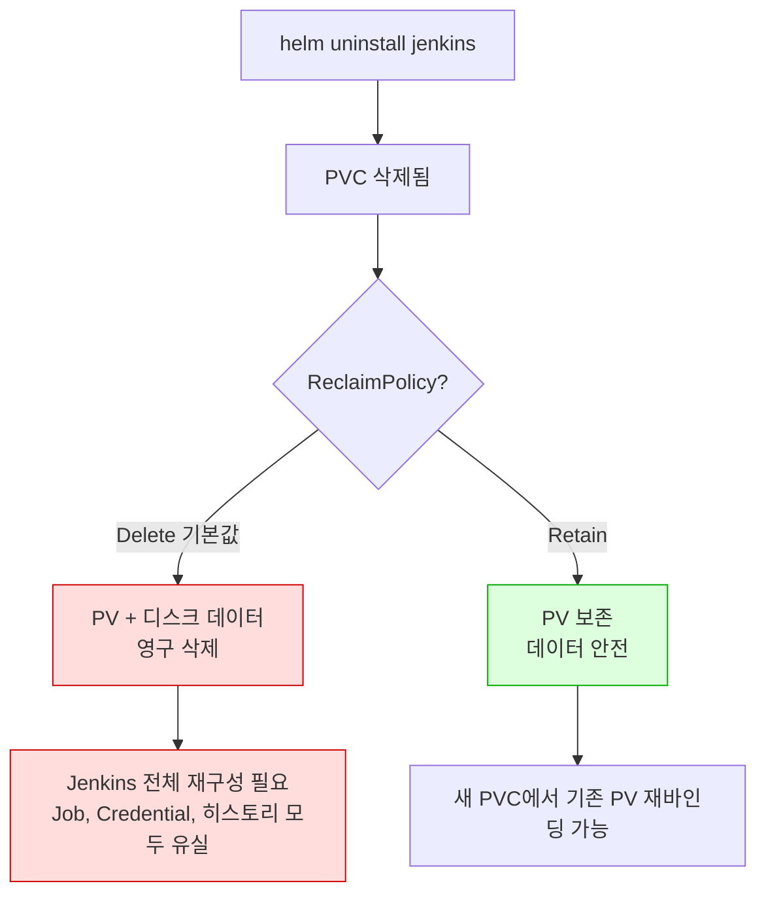
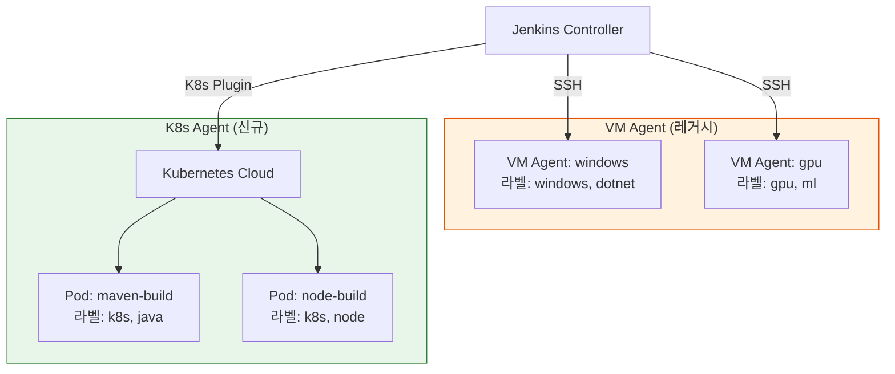

# Jenkins on Kubernetes: 운영 이슈 분석

> **핵심 질문**: "K8s Jenkins가 VM Jenkins보다 정말 나은가? 어떤 조건에서, 어떤 대가를 치르는가?"

Jenkins를 Kubernetes로 이전하면 동적 Agent의 이점을 얻지만, 운영 복잡도는 단순히 "인프라가 바뀌는 것" 이상으로 증가한다. 이 문서는 기존 Ch02(아키텍처), Ch08(관측성/보안), Ch09(K8s Jenkins) 학습 내용을 **운영자 관점에서 통합 분석**한다. 각 챕터에서 이미 다룬 설정 방법이나 개념 설명은 반복하지 않고, 운영 이슈와 함정, 의사결정 기준에 집중한다.

---

## 1. VM vs K8s Jenkins: 운영 관점 비교

Ch09 LEARN.md §1의 비교 테이블은 기능적 차이를 다룬다. 여기서는 같은 축을 **운영자가 실제로 겪는 고통** 관점에서 재분석한다.

### 비교 테이블

| 축 | VM Jenkins | K8s Jenkins | 운영자 체감 |
|---|---|---|---|
| **Agent 관리** | SSH/JNLP 설정 후 방치 가능 | Pod Template YAML 관리 필수 | K8s는 초기 설정 후에도 지속적 YAML 유지보수 발생 |
| **리소스 효율** | 유휴 VM 비용 발생하지만 예측 가능 | 유휴 리소스 0에 수렴하지만 피크 시 노드 부족 가능 | K8s는 Cluster Autoscaler 없으면 오히려 불안정 |
| **환경 일관성** | Configuration Drift 누적 | 이미지 기반 보장 | K8s 승리, 단 이미지 관리 파이프라인이 새로운 부담 |
| **스케일링** | VM 부팅 수 분, 수동/반자동 | Pod 생성 수 초, 자동 | K8s 승리, 단 이미지 Pull 시간이 숨은 병목 |
| **운영 복잡도** | OS 패치, 패키지 관리 | K8s 클러스터 운영 + Jenkins 운영 이중 부담 | K8s는 문제 발생 시 디버깅 레이어가 2배 |
| **초기 진입 장벽** | 낮음 | K8s + Helm + YAML + RBAC 학습 필요 | 팀 전체의 K8s 숙련도가 성패를 결정 |

### 왜 K8s가 항상 답은 아닌가

동적 Agent의 이점은 분명하지만, K8s Jenkins는 세 가지 비용을 수반한다.

**첫째, 스크립트 복잡도 증가.** VM Jenkins에서 Agent를 지정하는 코드는 `agent { label 'linux' }` 한 줄이다. K8s Jenkins에서 같은 일을 하려면 `podTemplate` 안에 컨테이너 이미지, 리소스 requests/limits, 볼륨 마운트, 환경변수, securityContext를 인라인 YAML로 작성해야 한다. 단일 컨테이너만 써도 10-15줄, 멀티 컨테이너(사이드카)를 사용하면 30-50줄이 추가된다. Jenkinsfile의 절반이 인프라 선언이 되는 것이다.

```groovy
// VM Jenkins: 1줄
agent { label 'linux' }

// K8s Jenkins: 20줄+ (단일 컨테이너)
agent {
    kubernetes {
        yaml '''
        apiVersion: v1
        kind: Pod
        spec:
          containers:
          - name: maven
            image: maven:3.9-eclipse-temurin-17
            command: ['sleep']
            args: ['infinity']
            resources:
              requests:
                cpu: "500m"
                memory: "1Gi"
              limits:
                cpu: "2"
                memory: "4Gi"
            volumeMounts:
            - name: maven-cache
              mountPath: /root/.m2/repository
          volumes:
          - name: maven-cache
            persistentVolumeClaim:
              claimName: maven-cache-pvc
        '''
    }
}
```

이 복잡도를 완화하는 방법은 두 가지다.

- **Shared Library로 추출**: podTemplate YAML을 Shared Library 함수로 감싸서 `myPodTemplate('maven')` 한 줄로 호출한다. YAML은 라이브러리 내부에 숨기고, 파이프라인 작성자는 라벨만 지정한다. 단점은 라이브러리 자체의 유지보수 부담이 생긴다는 것이다.
- **JCasC 글로벌 Pod Template**: Jenkins Configuration as Code에서 기본 Pod Template을 정의하면, Jenkinsfile에서 `agent { label 'maven' }`만으로 사전 정의된 Pod 스펙이 적용된다. VM Jenkins의 사용 경험과 거의 동일해지지만, 글로벌 템플릿과 인라인 오버라이드가 충돌할 때 디버깅이 까다롭다.

**둘째, 디버깅 레이어 증가.** VM Jenkins에서 빌드가 실패하면 Agent SSH 접속 → 로그 확인 → 환경 점검의 단선적 경로로 원인을 추적한다. K8s Jenkins에서는 Pod 스케줄링 실패, 이미지 Pull 실패, 컨테이너 OOMKilled, JNLP 연결 타임아웃, NetworkPolicy 차단 등 Kubernetes 레이어의 문제가 Jenkins 빌드 실패로 표출되므로, `kubectl describe pod`, `kubectl logs`, `kubectl get events`를 함께 봐야 한다. Jenkins 로그만으로는 원인을 알 수 없는 경우가 빈번하다.

**셋째, Controller SPOF는 동일하되 양면적이다.** K8s로 이전해도 Jenkins Controller의 단일 장애점 문제는 해결되지 않는다. 오히려 K8s 환경에서는 노드 장애, PVC 마운트 실패, Probe 오설정에 의한 무한 재시작 등 Controller가 죽는 경로가 더 늘어난다. 반면, K8s는 StatefulSet이 Pod을 자동 재스케줄링하고 JCasC로 선언적 재구성이 가능하므로, **복구 자동화** 측면에서는 VM보다 유리하다. Ch02 §6의 HA 전략(PVC + JCasC 빠른 복구)은 K8s에서도 동일하게 적용되지만, 복구 과정에서 PV 재마운트, DNS 전파 등 추가 단계가 필요하다.

---

## 2. 자원 이슈 분석

K8s Jenkins의 자원 문제는 VM Jenkins와 본질이 다르다. VM에서는 "서버를 얼마나 크게 잡느냐"의 문제이지만, K8s에서는 "requests/limits를 어떻게 설정하느냐"와 "클러스터 전체 자원을 어떻게 분배하느냐"의 문제다.

### 2.1 Controller 리소스

Jenkins Controller의 JVM은 힙(Heap) + 메타스페이스(Metaspace) + 스레드 스택 + 네이티브 메모리를 소비한다. 여기에 Kubernetes의 컨테이너 오버헤드(cgroup 관리, 프로세스 격리)가 추가된다.

흔한 실수는 `-Xmx`를 컨테이너 `limits.memory`와 동일하게 설정하는 것이다. JVM 힙이 1Gi인데 컨테이너 제한도 1Gi이면, 메타스페이스와 스레드 스택이 사용하는 200-400Mi가 초과되어 OOMKilled가 발생한다. 올바른 비율은 JVM 힙을 컨테이너 메모리 제한의 **60-70%**로 설정하는 것이다.

```
컨테이너 limits.memory = 2Gi
├── JVM Heap (-Xmx)    = 1.2Gi (60%)
├── Metaspace           = ~300Mi
├── Thread Stacks       = ~200Mi (스레드당 1Mi x 200)
├── Native Memory       = ~100Mi
└── OS/cgroup 오버헤드  = ~100Mi
```

**PVC I/O 병목**: Controller의 JENKINS_HOME은 PVC에 저장된다. 빌드 히스토리가 쌓이면 `jobs/` 디렉토리의 파일 수가 수만 개에 달하고, Jenkins 시작 시 이 파일들을 모두 스캔한다. NFS 기반 PVC는 IOPS가 낮아 시작 시간이 5-10분까지 늘어날 수 있다. 클라우드 환경에서는 SSD 기반 StorageClass(AWS gp3, GCP pd-ssd)를 사용하고, 온프레미스에서는 local-path 또는 Ceph RBD를 권장한다.

**GC 압박과 플러그인 메모리**: Jenkins Controller의 JVM 힙은 빌드 큐, 파이프라인 실행 상태, 플러그인 캐시에 의해 소비된다. 플러그인 30개 이상을 설치하면 시작 시 메타스페이스만 200Mi 이상 차지하는 경우가 있다. `-Xlog:gc*` 옵션으로 GC 로그를 활성화하고, Full GC가 하루 3회 이상 발생하면 힙을 증설해야 한다. K8s 환경에서 힙 증설은 곧 `limits.memory` 증가를 의미하므로, Pod이 스케줄링될 수 있는 노드 범위가 줄어든다는 점도 고려해야 한다.

**CPU throttling**: `limits.cpu`를 설정하면 CFS(Completely Fair Scheduler) 쿼터가 적용된다. Jenkins Controller가 시작 중에 CPU를 집중적으로 사용하는데, 이때 쿼터에 의해 throttling이 걸리면 시작 시간이 2-3배로 늘어난다. 시작 시간이 비정상적으로 길다면 `kubectl top pod`으로 CPU 사용률을 확인하고, `limits.cpu`를 일시적으로 제거하여 throttling 여부를 판별한다. 일부 팀은 Controller에 대해 CPU limits를 의도적으로 설정하지 않고 requests만 설정하는 전략을 사용하기도 한다(burstable QoS).

### 2.2 Agent Pod 리소스

Agent Pod의 `requests`와 `limits` 설정은 클러스터 안정성과 빌드 성능의 균형점이다.

**requests 과소 설정 → 과밀 스케줄링**: Maven 빌드가 실제로 2Gi를 사용하는데 `requests.memory`를 512Mi로 설정하면, 스케줄러는 512Mi만 확보한 노드에 Pod을 배치한다. 빌드가 진행되면서 실제 메모리가 2Gi까지 올라가면 두 가지 경로로 문제가 발생한다. limits도 부적절하게 낮으면 컨테이너가 OOMKilled로 종료되고, limits가 충분하더라도 노드 전체 메모리가 부족해지면 kubelet이 eviction으로 Pod을 축출한다. Jenkins 로그에는 "빌드 실패"만 표시되고, 원인은 `kubectl describe pod`의 `Last State: OOMKilled` 또는 `Evicted`에서만 확인된다.

**requests 과대 설정 → Pending 무한 대기**: 반대로 `requests.memory`를 8Gi로 설정하면, 클러스터의 어떤 노드에도 8Gi 여유가 없을 때 Pod이 Pending 상태에 머문다. Jenkins에서는 "빌드가 큐에서 대기 중"으로만 보이므로, Agent 부족인지 리소스 부족인지 구분하기 어렵다.

**limits 미설정 → 노드 전체 영향**: limits를 설정하지 않으면 하나의 빌드가 노드 전체 메모리를 소비하여 같은 노드의 다른 Pod(다른 빌드, 심지어 프로덕션 워크로드)까지 OOM으로 죽일 수 있다.

적절한 설정을 찾는 방법은 Prometheus + Grafana로 실제 빌드의 CPU/메모리 사용량을 2주 이상 수집한 후, P95 사용량을 `requests`로, P99 사용량에 20% 버퍼를 더한 값을 `limits`로 설정하는 것이다.

**CPU requests/limits의 함정**: CPU limits를 너무 낮게 설정하면 CFS throttling이 발생하여 빌드 시간이 비정상적으로 늘어난다. Maven 컴파일이나 Gradle 빌드는 순간적으로 여러 코어를 사용하므로, `limits.cpu`를 `requests.cpu`의 2-4배로 설정하는 것이 일반적이다. 예를 들어 `requests.cpu: 500m, limits.cpu: 2000m`이면 평소에는 0.5코어를 보장받고, 피크 시에는 2코어까지 사용할 수 있다. throttling이 의심되면 Agent Pod 내부에서 cgroup 통계를 확인한다. cgroup v1 환경에서는 `/sys/fs/cgroup/cpu/cpu.stat`, cgroup v2 환경(현행 대부분 노드 OS)에서는 `/sys/fs/cgroup/cpu.stat`의 `nr_throttled` 값을 본다.

### 2.3 캐시 PVC 문제

Maven/Gradle 캐시를 PVC로 공유하면 의존성 재다운로드를 방지할 수 있지만, RWX(ReadWriteMany) PVC에는 두 가지 운영 이슈가 있다.

**성능 저하**: RWX를 지원하는 스토리지(NFS, CephFS, EFS)는 RWO(ReadWriteOnce) 블록 스토리지보다 IOPS가 현저히 낮다. Maven 빌드가 수백 개의 JAR 파일을 읽고 쓸 때 I/O 대기 시간이 빌드 시간에 직접 반영된다. 특히 EFS는 첫 접근 시 지연(cold start latency)이 크다.

**동시 쓰기 충돌**: 여러 빌드 Pod이 동시에 같은 캐시 PVC에 같은 아티팩트를 다운로드하면 파일 충돌이 발생할 수 있다. Maven은 대부분 안전하게 처리하지만, Gradle의 `.lock` 파일은 NFS 위에서 불안정하게 동작하는 사례가 보고되어 있다.

대안으로 Pod-local 캐시 + 캐시 워밍(cache warming) 전략이 있다. emptyDir에 캐시를 두되, initContainer에서 S3/GCS 같은 오브젝트 스토리지에서 캐시 아카이브를 다운로드하는 방식이다. 빌드 완료 후 갱신된 캐시를 다시 업로드한다. RWX PVC가 필요 없고 동시성 문제도 사라지지만, 캐시 업로드/다운로드 스크립트를 유지해야 하는 부담이 생긴다.

### 2.4 이미지 Pull 시간

K8s Jenkins의 숨은 병목은 Agent Pod의 컨테이너 이미지 Pull 시간이다. VM Agent는 한 번 프로비저닝하면 이미지 Pull이 없지만, K8s Agent는 매 빌드마다 이미지를 가져올 수 있다.

| 이미지 크기 | 캐시 미스 시 Pull 시간 | 빌드 체감 영향 |
|---|---|---|
| 100MB (alpine 기반) | 5-15초 | 무시 가능 |
| 500MB (maven, node) | 30-60초 | 빌드 시간의 10-20% |
| 1GB+ (DinD, 커스텀 통합 이미지) | 1-3분 | 빌드 시간의 30%+ |

완화 방법은 세 가지다.

- **이미지 경량화**: 멀티 스테이지 빌드로 최종 이미지 크기를 줄이고, 불필요한 도구를 제거한다.
- **노드 이미지 캐시**: 자주 사용하는 이미지를 노드에 사전 Pull(DaemonSet으로 구현)해두면, imagePullPolicy가 IfNotPresent일 때 로컬 캐시에서 즉시 로드된다.
- **사내 레지스트리**: 퍼블릭 레지스트리(Docker Hub)에서 Pull하면 네트워크 지연과 Rate Limit에 걸린다. 사내 Harbor나 ECR/GCR 미러를 운영하면 Pull 시간이 크게 줄어든다.

### 2.5 노드 리소스 경합

Jenkins Agent Pod이 프로덕션 워크로드와 같은 노드에서 실행되면 자원 경쟁이 발생한다. 빌드는 본질적으로 CPU-intensive하므로, 빌드 피크 시간에 프로덕션 Pod의 응답 시간이 느려지는 상황이 생길 수 있다.

해결 방법은 노드를 용도별로 분리하는 것이다. CI/CD 전용 노드 풀에 Taint를 걸고, Agent Pod Template에 해당 Toleration을 추가한다. Cluster Autoscaler가 이 노드 풀을 관리하면, 빌드 수요에 따라 CI/CD 노드만 독립적으로 스케일링된다.

```yaml
# Agent Pod Template에 nodeSelector + toleration 추가
spec:
  nodeSelector:
    node-role: ci-agent
  tolerations:
  - key: "dedicated"
    value: "ci-agent"
    effect: "NoSchedule"
```

---

## 3. 운영 문제점 및 함정

이 섹션은 K8s Jenkins 운영에서 실제로 마주치는 문제들을 사례 중심으로 다룬다. Ch08 §8의 환경별 체크리스트가 "무엇을 설정해야 하는가"를 다룬다면, 여기서는 "설정을 잘못하면 무슨 일이 벌어지는가"를 다룬다.

### 3.1 PV ReclaimPolicy Delete → 데이터 유실

동적 프로비저닝으로 생성된 PV의 기본 `reclaimPolicy`는 `Delete`이다(수동 생성 PV는 예외). PVC가 삭제되면 PV와 실제 디스크 데이터가 연쇄적으로 삭제되어 Jenkins의 모든 Job 정의, 빌드 히스토리, Credential이 영구 유실된다.

이것이 함정인 이유는 PVC 삭제 경로가 다양하기 때문이다. `helm uninstall` 시 PVC가 삭제되는지 여부는 차트 설정과 annotation(`helm.sh/resource-policy: keep`)에 따라 다르다. StatefulSet의 volumeClaimTemplate으로 생성된 PVC는 StatefulSet 삭제 시에도 보존되지만, 별도 PVC 리소스로 정의된 경우에는 함께 삭제될 수 있다. 어떤 구성이든 ReclaimPolicy가 `Delete`이면 PVC 삭제 시점에 데이터가 사라진다.



**예방**: 프로덕션 Jenkins PV는 설치 직후 `kubectl patch pv <name> -p '{"spec":{"persistentVolumeReclaimPolicy":"Retain"}}'`으로 변경한다. 또는 StorageClass 자체의 reclaimPolicy를 Retain으로 정의한 전용 클래스를 사용한다.

### 3.2 Probe 오설정 → 무한 재시작 루프

Jenkins Controller는 시작에 60-120초가 소요된다. 플러그인이 30개 이상이거나 JCasC 설정이 복잡하면 3-5분까지 걸릴 수 있다. Liveness Probe의 `initialDelaySeconds`가 이 시작 시간보다 짧으면, 시작이 완료되기 전에 Probe가 실패하고 kubelet이 컨테이너를 재시작한다. 재시작 후 또 시작에 시간이 걸리고, 또 Probe가 실패하여 무한 루프에 빠진다.

**증상**: `kubectl get pod`에서 RESTARTS 카운터가 계속 증가하고, Pod 상태가 Running ↔ CrashLoopBackOff를 반복한다. Jenkins 로그를 보면 매번 시작 도중에 끊기는 패턴이 보인다.

**해결**: Startup Probe를 사용하면 시작 완료까지 Liveness Probe를 비활성화할 수 있다. `failureThreshold: 30, periodSeconds: 10`이면 최대 5분까지 시작을 기다린다. Startup Probe가 성공한 후에야 Liveness Probe가 활성화되므로, 시작 시간 변동에 유연하게 대응할 수 있다. (상세 설정은 Ch09 LEARN.md §7 참조)

### 3.3 JNLP 연결 실패

Agent Pod이 생성되었지만 Controller에 연결하지 못하면, Pod은 Running 상태이지만 빌드는 시작되지 않는다. Jenkins 큐에는 "Waiting for next available executor"가 표시되고, Agent 목록에는 해당 Agent가 나타나지 않는다.

원인은 대개 세 가지 중 하나다.

**NetworkPolicy 차단**: Agent Pod에서 Controller의 50000번 포트(JNLP)로의 트래픽이 NetworkPolicy에 의해 차단된다. Agent와 Controller가 다른 네임스페이스에 있으면 네임스페이스 간 통신을 명시적으로 허용해야 한다.

**DNS 해석 실패**: Agent Pod이 Controller의 Service 이름(`jenkins-agent.jenkins.svc.cluster.local`)을 해석하지 못한다. CoreDNS가 과부하이거나, Agent가 다른 클러스터에 있는 경우다. `kubectl exec <agent-pod> -- nslookup jenkins-agent.jenkins.svc.cluster.local`로 확인한다.

**방화벽/보안 그룹**: 클라우드 환경에서 노드 간 통신이 보안 그룹에 의해 제한된 경우, Agent 노드에서 Controller 노드의 50000번 포트로의 TCP 통신이 차단될 수 있다. 특히 Controller와 Agent가 다른 노드 그룹에 있을 때 발생한다.

디버깅 순서는 `kubectl logs <agent-pod> -c jnlp` → DNS 확인 → 포트 연결 테스트(`nc -zv`) → NetworkPolicy 검토 순이다.

**WebSocket 모드**: JNLP TCP 포트(50000) 대신 WebSocket을 사용하면 별도 Service 없이 HTTP(8080) 포트만으로 Agent 연결이 가능하다. Ingress를 통해 외부 클러스터의 Agent도 연결할 수 있어 NetworkPolicy와 방화벽 설정이 단순해진다. 현재 Kubernetes Plugin에서 권장되는 방식이며(정확한 최소 버전은 Jenkins LTS/플러그인 릴리즈 노트로 확인), Pod Template에 `websocket: true`를 추가한다. 다만 WebSocket은 HTTP Upgrade를 사용하므로 Ingress Controller가 WebSocket을 지원해야 하고, 프록시 타임아웃 설정이 빌드 시간보다 길어야 한다.

### 3.4 플러그인 호환성 매트릭스

Kubernetes Plugin은 Jenkins Core 버전과의 호환성 매트릭스가 존재한다. Jenkins를 업그레이드하면서 Kubernetes Plugin은 그대로 두거나, 그 반대의 경우에 호환성이 깨질 수 있다. 증상은 Agent Pod이 생성되지 않거나, Pod Template 파싱 오류, JNLP 프로토콜 버전 불일치 등 다양하다.

이 문제가 특히 위험한 이유는 Jenkins 업그레이드 후에 바로 드러나지 않을 수 있기 때문이다. 업그레이드 직후에는 정상으로 보이다가, 특정 Pod Template 설정이나 특정 API 호출 경로에서만 실패하는 경우가 있다.

**예방**: `plugins.txt`에서 Kubernetes Plugin 버전을 명시적으로 고정하고, Jenkins 업그레이드 시 반드시 스테이징 환경에서 기존 파이프라인을 전부 실행하여 호환성을 확인한다. Jenkins 공식 플러그인 호환성 페이지(plugins.jenkins.io)에서 각 플러그인의 최소 Jenkins 버전 요구사항을 확인한다.

### 3.5 Jenkinsfile 스크립트 비대화

§1에서 다룬 스크립트 복잡도 문제는 단순히 "줄 수가 늘어나는 것"을 넘어 유지보수 비용을 증가시킨다.

- **가독성 저하**: 비즈니스 로직(빌드, 테스트, 배포)과 인프라 선언(Pod Template)이 한 파일에 섞여서, Jenkinsfile을 읽을 때 "이 파이프라인이 무엇을 하는가"를 파악하기 어렵다.
- **중복 확산**: 팀마다 Pod Template을 복사하여 사용하면, 이미지 버전 변경이나 리소스 조정 시 수십 개의 Jenkinsfile을 일괄 수정해야 한다.
- **디버깅 난이도**: YAML 인라인 문법 오류는 Groovy 문법 오류와 혼재되어, 에러 메시지만으로는 YAML 문제인지 Pipeline 로직 문제인지 구분하기 어렵다.

Shared Library로 추출하면 이 문제들이 완화되지만, 라이브러리 자체의 테스트와 버전 관리라는 새로운 운영 부담이 생긴다. 결국 K8s Jenkins를 도입하면 "파이프라인 플랫폼 팀"의 역할이 필요해지는 것이다.

### 3.6 Controller Pod 재스케줄링 시 빌드 유실

Kubernetes 노드가 메모리 압박(memory pressure)에 빠지면 kubelet이 우선순위가 낮은 Pod을 축출(evict)한다. Controller Pod이 축출되면 진행 중인 모든 빌드가 중단되고, 빌드 큐에 있던 작업도 사라진다. VM Jenkins에서는 서버 자체가 죽지 않는 한 이런 일이 발생하지 않지만, K8s에서는 같은 노드의 다른 Pod이 메모리를 과도하게 사용하는 것만으로도 Controller가 축출될 수 있다.

**예방**: Controller Pod에 `PriorityClass`를 높게 설정하여 축출 우선순위를 낮춘다. `system-cluster-critical`이나 커스텀 PriorityClass(priority 값 1000000 이상)를 사용하면, 노드 자원이 부족할 때 다른 Pod이 먼저 축출된다. 또한 §2.5에서 다룬 전용 노드 풀에 Controller를 배치하면, CI Agent Pod의 자원 소비가 Controller에 영향을 주지 않는다.

```yaml
# Controller PriorityClass
apiVersion: scheduling.k8s.io/v1
kind: PriorityClass
metadata:
  name: jenkins-controller-critical
value: 1000000
globalDefault: false
description: "Jenkins Controller는 축출 방지 대상"
```

### 3.7 Helm 업그레이드 시 다운타임

`helm upgrade`를 실행하면 기존 Controller Pod이 종료되고 새 Pod이 시작된다. Jenkins Controller는 단일 인스턴스이므로, 이 과정에서 2-5분의 다운타임이 발생한다. VM Jenkins의 업그레이드도 다운타임이 있지만, K8s에서는 Pod 종료 → 이미지 Pull → 시작 → Probe 통과까지의 시간이 더 길 수 있다.

다운타임을 최소화하는 방법은 세 가지다.

- **빌드 없는 시간대에 업그레이드**: Jenkins의 Quiet Down 모드(`/quietDown`)를 먼저 활성화하여 새 빌드를 막고, 진행 중인 빌드가 완료될 때까지 기다린 후 upgrade를 실행한다.
- **이미지 사전 Pull**: 업그레이드 전에 새 이미지를 해당 노드에 미리 Pull해두면 Pod 시작 시 이미지 다운로드 시간을 절약할 수 있다.
- **`helm diff`로 사전 검토**: `helm diff upgrade` 명령으로 변경 내용을 미리 확인하여, 예상치 못한 설정 변경이 없는지 검증한다.

---

## 4. VM → K8s 전환 의사결정

### 전환이 이득인 조건

| 조건 | 설명 |
|---|---|
| 동시 빌드 > 10 | Agent 유휴 비용이 동적 프로비저닝의 복잡도 비용을 초과 |
| 빌드 패턴이 불규칙 | 스프린트 마감/릴리즈 시 피크, 평소는 한산 → 고정 Agent는 낭비 |
| 다양한 빌드 환경 | Java 11/17/21, Node 16/18/20, Python 3.8-3.12 등 → VM마다 설치하는 것보다 이미지가 효율적 |
| 팀 K8s 숙련도 높음 | kubectl, Helm, YAML에 팀 전체가 익숙 → 진입 장벽 낮음 |
| 기존 K8s 클러스터 존재 | 인프라 추가 비용 없이 네임스페이스만 추가 |

### 전환하지 않는 것이 나은 조건

| 조건 | 설명 |
|---|---|
| 동시 빌드 < 5 | Agent 2-3대로 충분, 동적 프로비저닝의 ROI가 낮음 |
| 빌드 환경 단일 | Java 17 + Maven만 사용 → VM Agent 하나로 해결 |
| K8s 경험 없음 | K8s 학습 비용 + Jenkins 운영 비용이 이중으로 발생 |
| 레거시 빌드 도구 | GUI 설치가 필요한 도구, 라이선스 동글 등 컨테이너화 불가 |
| 보안 규제 환경 | 컨테이너 privileged 모드 금지, 외부 이미지 Pull 금지 등 |

### 하이브리드 전략

VM과 K8s를 동시에 사용하는 하이브리드 전략은 점진적 전환의 현실적인 방법이다.



Jenkins Controller는 VM(또는 K8s)에서 단일 인스턴스로 운영하고, Agent를 용도에 따라 분배한다.

- **컨테이너화 가능한 빌드**(Java, Node.js, Python): K8s Agent로 전환
- **컨테이너화 불가능한 빌드**(Windows GUI, GPU, 특수 하드웨어): VM Agent 유지

Pipeline에서 `agent { label 'k8s && java' }`와 `agent { label 'windows' }`로 자연스럽게 분기된다. 이 방식의 장점은 한 번에 전부 전환하지 않아도 되고, 전환 실패 시 해당 빌드만 VM으로 되돌릴 수 있다는 것이다.

전환 순서는 리스크가 낮은 것부터 진행한다.

1. CI 빌드(컴파일, 테스트) — 실패해도 재실행하면 됨
2. 아티팩트 빌드(Docker 이미지, JAR 패키징) — 캐시 전략 검증 필요
3. CD 배포 — 프로덕션에 영향, 가장 마지막에 전환

### 전환 단계별 체크리스트

전환을 결정했다면, 아래 단계를 순서대로 진행한다. 각 단계를 건너뛰면 운영 중에 문제가 발생하므로 순서를 지키는 것이 중요하다.

**Phase 1: 인프라 준비 (1-2주)**

| 항목 | 완료 기준 |
|---|---|
| K8s 클러스터에 Jenkins 네임스페이스 생성 | `kubectl get ns jenkins` 성공 |
| CI 전용 노드 풀 구성 (Taint/Toleration) | Agent Pod이 전용 노드에만 스케줄링됨 |
| StorageClass 선정 + ReclaimPolicy Retain 확인 | `kubectl get sc` 출력에서 reclaimPolicy 확인 |
| 사내 레지스트리에 Agent 이미지 미러링 | 사내 레지스트리에서 Pull 테스트 성공 |
| NetworkPolicy 초안 작성 | Agent → Controller(8080, 50000) 통신 허용 확인 |

**Phase 2: 파일럿 (2-4주)**

| 항목 | 완료 기준 |
|---|---|
| Helm으로 Jenkins Controller 설치 | `/login` 페이지 접근 가능 |
| 기존 Jenkinsfile 1-2개를 K8s Agent로 전환 | VM과 동일한 빌드 결과 확인 |
| Pod Template을 Shared Library로 추출 | 파이프라인 작성자가 `agent { label 'maven' }` 한 줄로 사용 |
| 캐시 전략 검증 (PVC 또는 오브젝트 스토리지) | 기준선 대비 의존성 다운로드 시간 40-70% 감소 + P95 빌드 시간 안정화 |
| 모니터링 설정 (Prometheus + Grafana) | 빌드 시간, 큐 대기시간, Agent Pod 메트릭 대시보드 |

**Phase 3: 확대 (4-8주)**

| 항목 | 완료 기준 |
|---|---|
| 컨테이너화 가능 CI 빌드를 K8s Agent로 전환 | 컨테이너화 가능 워크로드의 80-90% 이상 K8s 전환 |
| requests/limits 실측 기반 튜닝 | 2주간 메트릭 수집 후 P95/P99 기반 설정 |
| Cluster Autoscaler 연동 | 피크 시간에 노드가 자동 추가되는지 확인 |
| 장애 대응 훈련 | Controller Pod 강제 삭제 후 복구 시간 측정 |
| VM Agent 축소 또는 하이브리드 확정 | 컨테이너화 불가 빌드만 VM에 잔류 |

---

## 5. 환경별 운영 체크리스트 (요약)

Ch08 LEARN.md §8에 VM/Docker/K8s 환경별 상세 체크리스트가 있다. 여기서는 K8s 환경에서 **가장 빈번하게 누락되는** 항목만 요약한다.

### K8s Jenkins 필수 점검 항목

| 카테고리 | 점검 항목 | 누락 시 위험 | 확인 방법 |
|---|---|---|---|
| **스토리지** | PV ReclaimPolicy = Retain | helm uninstall 시 데이터 유실 | `kubectl get pv -o jsonpath='{.spec.persistentVolumeReclaimPolicy}'` |
| **스토리지** | PV 백업 스케줄 활성화 | 디스크 장애 시 복구 불가 | VolumeSnapshot CronJob 또는 Velero 스케줄 확인 |
| **안정성** | Startup Probe 설정 | 플러그인 추가 시 무한 재시작 | `kubectl describe pod` → Probe 설정 확인 |
| **안정성** | PodDisruptionBudget 설정 | 노드 drain 시 빌드 전부 실패 | `kubectl get pdb -n jenkins` |
| **네트워크** | JNLP Service(50000) 접근 가능 | Agent 연결 불가, 빌드 안 됨 | Agent Pod에서 `nc -zv jenkins-agent 50000` |
| **네트워크** | NetworkPolicy: Agent → Controller 허용 | Agent 생성되지만 연결 실패 | NetworkPolicy YAML 검토 |
| **리소스** | Controller JVM 힙 < limits의 70% | OOMKilled 반복 | `-Xmx` 값과 `limits.memory` 비교 |
| **리소스** | Agent Pod requests/limits 설정 | OOMKilled 또는 Pending 무한 대기 | Pod Template YAML 검토 |
| **리소스** | ResourceQuota(Agent 네임스페이스) | Agent Pod이 클러스터 자원 독점 | `kubectl describe quota -n jenkins` |
| **보안** | ServiceAccount 최소 권한 | 빌드 스크립트가 K8s API 악용 가능 | Role/RoleBinding 검토 |
| **보안** | Controller `numExecutors: 0` | Controller에서 빌드 실행 → 보안 위험 | JCasC 또는 UI 확인 |
| **이미지** | Agent 이미지 사내 레지스트리 미러 | Docker Hub Rate Limit으로 빌드 실패 | Pod Template의 image 경로 확인 |

### VM/Docker 환경 핵심 항목 (교차 비교)

| 항목 | VM | Docker | K8s |
|---|---|---|---|
| 백업 방식 | thinBackup + FS 스냅샷 | 볼륨 tar 아카이브 | VolumeSnapshot / Velero |
| 리소스 제한 | OS 수준 (ulimit) | `mem_limit`, `cpus` | requests/limits |
| 헬스체크 | systemd watchdog | Docker HEALTHCHECK | Liveness/Readiness/Startup Probe |
| 로그 관리 | logrotate | Docker 로그 드라이버 | kubectl logs + 중앙 로깅(EFK) |
| 업그레이드 | WAR 교체 + 재시작 | 이미지 태그 변경 | helm upgrade |
| 롤백 | 이전 WAR + JENKINS_HOME 백업 | 이전 이미지 태그 | helm rollback |

> **상세 체크리스트**: Ch08 LEARN.md §8 참조

---

## 정리

K8s Jenkins는 동적 Agent, 환경 일관성, 자동 스케일링이라는 확실한 이점을 제공한다. 하지만 스크립트 복잡도 증가, 디버깅 난이도 상승, K8s 운영 부담이라는 대가가 따른다. Controller SPOF 문제는 VM이든 K8s이든 동일하게 존재하며, K8s에서는 오히려 장애 경로가 더 늘어난다.

전환 여부는 기술적 우월성이 아니라 **팀의 상황**으로 결정해야 한다. 동시 빌드가 10개 이상이고, 빌드 환경이 다양하며, 팀이 K8s에 숙련되어 있다면 전환의 ROI가 높다. 그렇지 않다면 VM Jenkins로 충분하거나, 하이브리드로 점진 전환하는 것이 현실적이다.

| 핵심 교훈 | 요약 |
|---|---|
| K8s ≠ 자동으로 더 나음 | 팀 숙련도와 빌드 패턴에 따라 판단 |
| requests/limits 실측 기반 설정 | 감으로 잡으면 OOMKilled 또는 Pending |
| PV ReclaimPolicy 즉시 확인 | Delete 기본값은 데이터 유실 시한폭탄 |
| Startup Probe 필수 | 없으면 플러그인 추가 때마다 무한 재시작 위험 |
| 스크립트 복잡도는 Shared Library로 관리 | Pod Template을 Jenkinsfile에서 분리 |
| 하이브리드 전략이 현실적 | 한 번에 전환하지 않고 점진적으로 |
