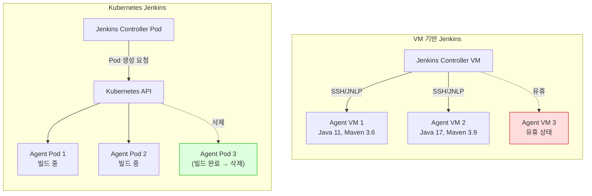
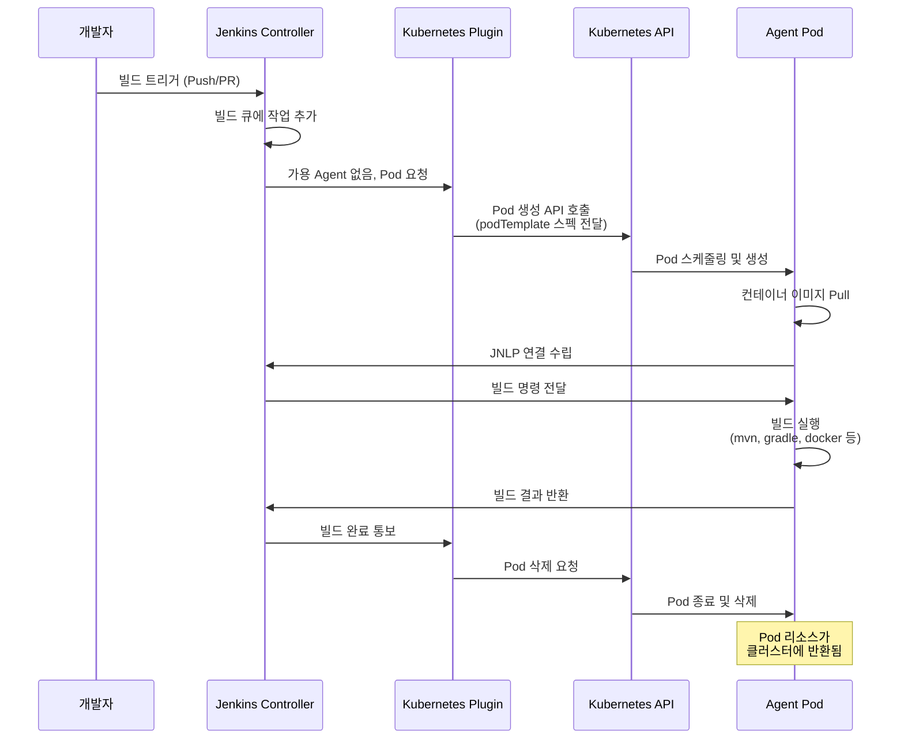
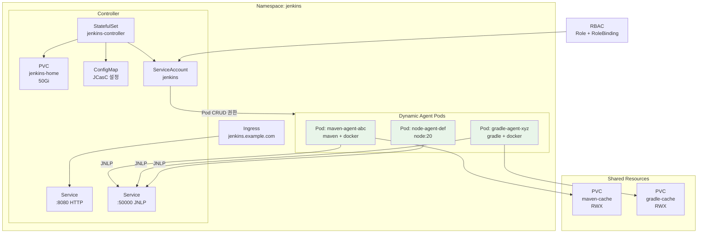

# Ch09. Kubernetes 환경의 Jenkins

**핵심 질문**: "전통적인 VM 기반 Jenkins와 Kubernetes 위의 Jenkins는 어떻게 다르고, 왜 K8s로 이전하는가?"

Jenkins를 Kubernetes 위에서 운영하면 빌드 에이전트가 Pod 단위로 동적 생성되고, 빌드 완료 후 자동 삭제된다. 이 패러다임 전환은 단순한 인프라 변경이 아니라, CI/CD 파이프라인의 리소스 관리 방식 자체를 근본적으로 바꾸는 것이다. 이 장에서는 VM 기반 Jenkins의 한계부터 Kubernetes 네이티브 대안까지 전체 스펙트럼을 다룬다.

---

## 1. 전통적 Jenkins vs Kubernetes Jenkins

### VM 기반 Jenkins의 한계

전통적인 Jenkins 환경에서는 Agent를 VM이나 베어메탈 서버에 미리 프로비저닝해야 한다. 이 방식은 다음과 같은 구조적 문제를 안고 있다.

**사전 프로비저닝의 비효율성**: Agent 서버를 미리 준비해놓아야 하므로, 빌드가 없는 시간에도 서버가 유휴 상태로 리소스를 소비한다. 10대의 Agent를 운영하는데 평균 사용률이 30%라면 70%의 리소스가 낭비되는 셈이다.

**스케일링의 어려움**: 빌드 요청이 갑자기 몰리면(예: 스프린트 마감일, 릴리즈 전날) Agent가 부족해져 빌드가 큐에 쌓인다. 반대로 VM을 추가하면 평소에는 유휴 상태가 된다. 이 문제를 해결하려면 수동으로 VM을 추가/제거하거나 클라우드 VM Auto Scaling을 설정해야 하는데, VM 부팅에 수 분이 걸려 반응 속도가 느리다.

**환경 불일치(Configuration Drift)**: Agent VM은 시간이 지남에 따라 각기 다른 패키지 버전, 환경 변수, OS 패치 상태를 가지게 된다. "내 Agent에서는 빌드가 되는데 저 Agent에서는 안 된다"는 문제가 빈번하게 발생한다. 이는 빌드의 재현성(Reproducibility)을 해치는 근본 원인이다.

**격리성 부족**: 하나의 VM Agent에서 여러 빌드가 순차적으로 실행되면, 이전 빌드가 남긴 파일이나 프로세스가 다음 빌드에 영향을 줄 수 있다. Workspace 격리를 시도할 수 있지만, 시스템 레벨 의존성(글로벌 패키지, 포트 충돌 등)은 완전히 분리되지 않는다.

### Kubernetes Jenkins의 핵심 차별점

Kubernetes 위의 Jenkins는 이 모든 문제를 컨테이너 오케스트레이션의 본질적인 속성으로 해결한다.

**빌드마다 새 Pod 생성**: 빌드 요청이 들어오면 Kubernetes API를 통해 Agent Pod을 새로 생성한다. 이 Pod은 항상 깨끗한 상태에서 시작하므로 환경 불일치 문제가 원천적으로 사라진다.

**자동 삭제로 리소스 회수**: 빌드가 완료되면 Pod이 자동으로 삭제되어 클러스터 리소스가 즉시 반환된다. 유휴 리소스가 0에 수렴하는 것이다.

**선언적 Pod 스펙**: Agent 환경을 YAML로 선언하므로, 어떤 빌드든 동일한 환경에서 실행된다. 이 선언은 Jenkinsfile에 포함되어 코드와 함께 버전 관리된다.

### 비교 테이블

| 관점 | VM 기반 Jenkins | Kubernetes Jenkins |
|------|----------------|-------------------|
| **Agent 관리** | 사전 프로비저닝, 수동 관리 | 빌드 시 동적 생성, 자동 삭제 |
| **스케일링** | VM 추가/제거 (수 분 소요) | Pod 생성 (수 초 소요) |
| **리소스 효율** | 유휴 VM 비용 발생 | 빌드 시에만 리소스 사용 |
| **격리성** | VM 내 잔여 상태 간섭 가능 | Pod마다 깨끗한 환경 보장 |
| **환경 일관성** | Configuration Drift 발생 | 선언적 Pod 스펙으로 보장 |
| **운영 복잡도** | OS 패치, 패키지 관리 필요 | 이미지 업데이트로 일괄 적용 |
| **초기 진입 장벽** | 낮음 (익숙한 VM 관리) | K8s 지식 필요 |

### 아키텍처 비교



이 다이어그램에서 VM 기반 환경의 Agent VM 3은 유휴 상태임에도 리소스를 점유하고 있다(빨간색). 반면 Kubernetes 환경에서는 빌드가 완료된 Pod 3이 즉시 삭제되어 리소스가 반환된다(녹색). 이것이 두 아키텍처의 근본적 차이다.

---

## 2. Jenkins on Kubernetes 아키텍처

### Jenkins Controller 배포

Jenkins Controller는 Kubernetes 위에서 Deployment 또는 StatefulSet으로 배포된다. 둘 중 StatefulSet이 더 적합한데, 그 이유는 Jenkins Controller가 상태를 가지는(stateful) 애플리케이션이기 때문이다. 빌드 히스토리, 플러그인 설정, Job 정의 등이 JENKINS_HOME 디렉토리에 저장되므로, Pod이 재시작되더라도 이 데이터가 유지되어야 한다.

StatefulSet은 안정적인 네트워크 ID와 영구 스토리지를 보장하므로, Controller Pod이 재스케줄링되더라도 동일한 PersistentVolume에 다시 마운트된다. Deployment를 사용할 수도 있지만, 이 경우 PVC를 별도로 관리해야 하며, Replicas를 반드시 1로 제한해야 한다(Jenkins Controller는 기본적으로 Active-Active를 지원하지 않으므로).

### Dynamic Agent Provisioning

Kubernetes Plugin은 Jenkins의 핵심 확장 포인트인 Cloud 인터페이스를 구현한다. 빌드 큐에 작업이 들어오면, Plugin이 Kubernetes API를 호출하여 Agent Pod을 생성한다. 이 Pod은 JNLP(Jenkins Remoting) 프로토콜로 Controller에 연결되어 빌드를 실행한다.

이 동적 프로비저닝이 동작하는 과정을 시퀀스로 살펴보면 다음과 같다.



이 시퀀스에서 핵심은 Agent Pod의 생명주기가 빌드 작업의 생명주기와 정확히 일치한다는 점이다. Pod은 빌드를 위해 태어나고, 빌드가 끝나면 죽는다. 이 때문에 "Ephemeral Agent(일회용 에이전트)"라고 부른다.

### Pod Template

Pod Template은 Agent Pod의 스펙을 정의한다. 여기에는 사용할 컨테이너 이미지, CPU/메모리 리소스 제한, 볼륨 마운트, 환경 변수 등이 포함된다. Pod Template은 세 가지 방법으로 정의할 수 있다.

1. **Jenkins UI**: Manage Jenkins > Cloud > Kubernetes에서 GUI로 설정
2. **JCasC(Configuration as Code)**: YAML 파일로 선언적 관리
3. **Jenkinsfile 인라인**: 파이프라인 코드에 직접 Pod 스펙 작성 (가장 권장)

Jenkinsfile에 인라인으로 작성하면 "이 파이프라인은 어떤 환경에서 실행되는가?"라는 질문에 코드 자체가 답이 된다. 환경 정의가 파이프라인과 함께 버전 관리되므로 재현성이 보장된다.

### PersistentVolume 전략

JENKINS_HOME은 PersistentVolumeClaim(PVC)에 저장되어야 한다. 이 디렉토리에는 다음이 포함된다.

- Job 정의 및 빌드 히스토리
- 플러그인 바이너리 및 설정
- 사용자/권한 설정
- Credential 저장소

PVC 없이 운영하면 Controller Pod이 재시작될 때마다 모든 설정이 초기화된다. StorageClass를 지정하여 동적 PV 프로비저닝을 활용하면, 클러스터 관리자가 PV를 수동으로 생성할 필요가 없다.

---

## 3. Kubernetes Plugin 설정

### podTemplate 문법

가장 유연한 방식은 Jenkinsfile 내에서 직접 Pod YAML을 작성하는 것이다.

```groovy
pipeline {
    agent {
        kubernetes {
            yaml '''
            apiVersion: v1
            kind: Pod
            spec:
              containers:
              - name: maven
                image: maven:3.9-eclipse-temurin-17
                command: ['sleep']
                args: ['infinity']
                volumeMounts:
                - name: maven-cache
                  mountPath: /root/.m2/repository
              - name: docker
                image: docker:24-dind
                securityContext:
                  privileged: true
                env:
                - name: DOCKER_TLS_CERTDIR
                  value: ""
              volumes:
              - name: maven-cache
                persistentVolumeClaim:
                  claimName: maven-cache-pvc
            '''
        }
    }
    stages {
        stage('Build') {
            steps {
                container('maven') {
                    sh 'mvn clean package -DskipTests'
                }
            }
        }
        stage('Test') {
            steps {
                container('maven') {
                    sh 'mvn test'
                }
            }
        }
        stage('Docker Build') {
            steps {
                container('docker') {
                    sh 'docker build -t my-app:latest .'
                }
            }
        }
    }
}
```

`command: ['sleep']`과 `args: ['infinity']`를 지정하는 이유는, JNLP Agent가 이 컨테이너를 제어하기 위해 컨테이너가 계속 실행 중이어야 하기 때문이다. 기본 이미지의 엔트리포인트(예: Maven은 `mvn`)가 즉시 종료되면 컨테이너가 사라져 빌드 명령을 보낼 수 없다.

### 멀티 컨테이너 Pod (사이드카 패턴)

위 예시에서 `maven`과 `docker` 컨테이너는 하나의 Pod 안에서 사이드카로 함께 실행된다. 이 구조가 필요한 이유는 다음과 같다.

**관심사의 분리**: Maven 컨테이너는 Java 빌드에 필요한 도구만 포함하고, Docker 컨테이너는 Docker 데몬만 포함한다. 하나의 거대한 이미지에 모든 도구를 넣는 것보다 각 이미지의 크기가 작고 관리가 쉽다.

**동일 Pod 내 리소스 공유**: 같은 Pod의 컨테이너들은 네트워크 네임스페이스와 볼륨을 공유한다. 따라서 Maven이 빌드한 결과물을 Docker 컨테이너가 바로 접근할 수 있다(공유 볼륨 또는 워크스페이스를 통해).

**독립적 이미지 업데이트**: Maven 버전을 올리고 싶으면 `maven` 이미지만 바꾸면 된다. Docker 이미지는 건드릴 필요가 없다.

### 리소스 제한

Kubernetes 클러스터의 안정성을 위해 Agent Pod에 리소스 제한을 설정해야 한다.

```yaml
containers:
- name: maven
  image: maven:3.9-eclipse-temurin-17
  resources:
    requests:
      cpu: "500m"
      memory: "1Gi"
    limits:
      cpu: "2"
      memory: "4Gi"
```

`requests`는 Pod이 스케줄링될 때 보장받는 최소 리소스이고, `limits`는 사용할 수 있는 최대 리소스이다. requests를 너무 크게 설정하면 클러스터에 Pod을 배치할 노드가 부족해지고, limits 없이 운영하면 하나의 빌드가 노드 전체 리소스를 잡아먹어 다른 Pod들이 OOM으로 죽을 수 있다. 일반적으로 requests는 평균 사용량, limits는 피크 사용량 기준으로 설정한다.

### 캐시 전략

Maven/Gradle 빌드는 의존성 다운로드에 상당한 시간이 소요된다. 매번 새 Pod에서 시작하므로, 캐시를 외부에 저장하지 않으면 모든 빌드마다 의존성을 다시 다운로드해야 한다.

**PVC 기반 캐시**: PersistentVolumeClaim을 생성하여 `.m2/repository`나 `.gradle/caches`를 마운트한다. 여러 빌드 Pod이 동시에 같은 PVC를 읽어야 하므로 `ReadWriteMany(RWX)` 접근 모드가 필요하다. NFS나 CephFS 등 RWX를 지원하는 StorageClass를 사용해야 한다.

**주의사항**: RWX PVC에 여러 Pod이 동시에 쓰면 캐시 파일 충돌이 발생할 수 있다. Maven의 경우 `-Dmaven.repo.local`을 Pod별로 분리하거나, 읽기 전용 캐시 볼륨 + Pod 로컬 쓰기 레이어를 조합하는 전략을 고려해야 한다.

---

## 4. Helm Chart로 Jenkins 배포

### jenkins/jenkins Helm Chart

Helm Chart는 Kubernetes 애플리케이션의 패키지 매니저 역할을 한다. Jenkins 공식 Helm Chart(`jenkins/jenkins`)는 프로덕션 수준의 Jenkins를 한 번의 명령으로 설치할 수 있게 해준다.

```bash
# Helm 저장소 추가
helm repo add jenkins https://charts.jenkins.io
helm repo update

# Jenkins 설치
helm install jenkins jenkins/jenkins \
  --namespace jenkins \
  --create-namespace \
  --values custom-values.yaml

# 업그레이드 (설정 변경, 버전 업그레이드)
helm upgrade jenkins jenkins/jenkins \
  --namespace jenkins \
  --values custom-values.yaml
```

### values.yaml 핵심 설정

```yaml
controller:
  # Controller 리소스
  resources:
    requests:
      cpu: "1"
      memory: "2Gi"
    limits:
      cpu: "2"
      memory: "4Gi"

  # JCasC로 선언적 설정
  JCasC:
    configScripts:
      welcome-message: |
        jenkins:
          systemMessage: "K8s Jenkins - Managed by Helm"

  # 설치할 플러그인 목록
  installPlugins:
    - kubernetes:latest
    - workflow-aggregator:latest
    - git:latest
    - configuration-as-code:latest
    - job-dsl:latest

  # Ingress 설정
  ingress:
    enabled: true
    hostName: jenkins.example.com
    annotations:
      kubernetes.io/ingress.class: nginx

# PVC 설정
persistence:
  enabled: true
  size: 50Gi
  storageClass: standard

# Agent 기본 설정
agent:
  enabled: true
  podTemplates:
    maven: |
      - name: maven
        label: maven
        containers:
          - name: maven
            image: maven:3.9-eclipse-temurin-17
            command: "/bin/sh -c"
            args: "cat"
            ttyEnabled: true
```

이 Chart가 내부적으로 생성하는 Kubernetes 리소스는 다음과 같다: StatefulSet(Controller), Service(HTTP + JNLP), PVC(JENKINS_HOME), ServiceAccount, ConfigMap(JCasC 설정), Ingress(외부 접근). 이 모든 것을 직접 YAML로 작성하면 수백 줄이 되지만, Helm Chart는 `values.yaml` 하나로 관리할 수 있게 추상화한다.

### 업그레이드 전략

`helm upgrade`를 실행하면 Kubernetes가 Rolling Update를 수행한다. 다만 Jenkins Controller는 단일 인스턴스이므로, 업그레이드 중 잠시 다운타임이 발생할 수 있다. 이를 최소화하려면 다음을 고려해야 한다.

- 빌드가 없는 시간(야간, 주말)에 업그레이드
- `helm diff` 플러그인으로 변경 사항을 사전 검토
- `helm rollback`으로 문제 발생 시 즉시 롤백

---

## 5. K8s Jenkins의 운영 과제

### Controller 고가용성 (HA)

Jenkins Controller는 기본적으로 단일 인스턴스(Single Point of Failure)이다. Controller가 죽으면 모든 빌드가 중단된다. Kubernetes의 StatefulSet은 Pod이 죽으면 자동으로 재시작하지만, 재시작 동안의 다운타임은 피할 수 없다.

CloudBees CI(상용)는 Active-Passive HA를 제공하지만, 오픈소스 Jenkins에서는 다음 전략으로 복원력을 높인다.

- **빠른 복구**: PVC에 상태가 보존되므로 Pod 재시작 시 데이터 손실 없음
- **JCasC**: 설정이 코드화되어 있으므로 새 클러스터에 빠르게 재구축 가능
- **PVC 백업**: Velero 등으로 PVC를 주기적으로 백업

### 네트워크 구성

Agent Pod이 Controller에 연결할 때 JNLP 프로토콜(TCP 50000번 포트)을 사용한다. Helm Chart는 이를 위한 Service를 자동으로 생성한다.

```yaml
# Helm Chart가 생성하는 JNLP Service
apiVersion: v1
kind: Service
metadata:
  name: jenkins-agent
spec:
  ports:
  - port: 50000
    targetPort: 50000
    name: agent
  selector:
    app.kubernetes.io/name: jenkins
```

Agent Pod은 이 Service의 DNS 이름(`jenkins-agent.jenkins.svc.cluster.local`)으로 Controller를 찾는다. Kubernetes의 내장 DNS가 Service Discovery를 담당하므로, Agent는 Controller의 구체적인 IP를 알 필요가 없다.

### 보안

K8s Jenkins의 보안은 Kubernetes 보안 모델과 Jenkins 보안 모델이 교차하는 지점에서 특히 중요하다.

**ServiceAccount 권한 최소화**: Jenkins Controller의 ServiceAccount는 Pod 생성/삭제 권한이 필요하지만, 그 이상의 권한(Secret 조회, 다른 네임스페이스 접근 등)은 부여하지 않아야 한다. RBAC Role/RoleBinding으로 최소 권한 원칙을 적용한다.

**Pod SecurityContext**: Agent Pod에서 Docker 빌드를 위해 `privileged: true`를 설정하는 것은 보안 위험이 크다. 대안으로 Kaniko(비특권 컨테이너에서 이미지 빌드)나 BuildKit의 rootless 모드를 사용한다.

**NetworkPolicy**: Agent Pod이 접근할 수 있는 네트워크 범위를 제한한다. 예를 들어, Agent는 내부 레지스트리와 소스 코드 저장소에만 접근 가능하게 하고, 프로덕션 데이터베이스 네트워크는 차단한다.

### 모니터링

Jenkins Controller와 Agent Pod의 상태를 모니터링하기 위해 두 가지 축이 필요하다.

- **Controller 메트릭**: Prometheus Plugin으로 빌드 큐 길이, 빌드 시간, 실패율 등을 노출
- **Kubernetes 메트릭**: Agent Pod의 CPU/메모리 사용량, Pod 생성/삭제 빈도, 스케줄링 대기 시간

### K8s Jenkins 전체 아키텍처



이 아키텍처 다이어그램은 K8s Jenkins의 전체 구성 요소와 그 관계를 보여준다. Controller는 StatefulSet으로 배포되어 PVC에 상태를 저장하고, ConfigMap에서 JCasC 설정을 로드한다. Agent Pod들은 JNLP Service를 통해 Controller에 연결되며, 빌드 캐시용 공유 PVC를 마운트한다. ServiceAccount에는 RBAC으로 Pod CRUD 권한만 부여되어 최소 권한 원칙을 따른다.

---

## 6. Jenkins X와 Tekton — K8s 네이티브 대안

Jenkins를 Kubernetes 위에 올리는 것은 "전통적 도구를 새 인프라에 적응시키는 것"이다. 반면, 처음부터 Kubernetes를 위해 설계된 CI/CD 도구들이 있다.

### Jenkins X

Jenkins X는 이름에 "Jenkins"가 포함되어 있지만, 내부 아키텍처는 전통적 Jenkins와 완전히 다르다. Jenkins X v3부터는 파이프라인 엔진으로 Tekton을 사용하며, 전통적 Jenkins Controller를 전혀 포함하지 않는다.

핵심 특징은 다음과 같다.

- **GitOps 내장**: 모든 환경 설정이 Git 저장소에 선언되고, Git 변경이 곧 환경 변경이다
- **자동 환경 프로모션**: PR이 머지되면 자동으로 Staging → Production으로 프로모션
- **Preview Environments**: PR마다 독립적인 미리보기 환경이 자동 생성
- **Lighthouse**: GitHub/GitLab 웹훅을 처리하는 경량 이벤트 핸들러

### Tekton

Tekton은 Kubernetes CRD(Custom Resource Definition)로 CI/CD 파이프라인을 정의하는 엔진이다. Jenkins의 Jenkinsfile 대신 Kubernetes 네이티브 리소스를 사용한다.

```yaml
# Tekton Task 예시
apiVersion: tekton.dev/v1
kind: Task
metadata:
  name: maven-build
spec:
  steps:
  - name: build
    image: maven:3.9-eclipse-temurin-17
    script: |
      mvn clean package -DskipTests
  - name: test
    image: maven:3.9-eclipse-temurin-17
    script: |
      mvn test
```

Tekton의 핵심 개념은 다음과 같다.

- **Step**: 하나의 컨테이너에서 실행되는 단일 작업
- **Task**: Step들의 순서 있는 집합 (하나의 Pod으로 실행)
- **Pipeline**: Task들의 DAG(Directed Acyclic Graph)
- **PipelineRun**: Pipeline의 실행 인스턴스

Tekton은 자체 UI가 제한적이지만, Tekton Dashboard나 Tekton Chains(보안 서명)와 같은 생태계 도구가 있다.

### 비교 테이블

| 관점 | Jenkins on K8s | Jenkins X | Tekton |
|------|---------------|-----------|--------|
| **아키텍처** | 전통 Jenkins + K8s Plugin | Tekton + Lighthouse + GitOps | K8s CRD 기반 순수 엔진 |
| **상태 관리** | Controller에 상태 저장 (PVC) | Stateless, Git이 진실의 원천 | Stateless, CRD가 상태 |
| **파이프라인 정의** | Jenkinsfile (Groovy) | Tekton YAML + Lighthouse | Tekton YAML |
| **플러그인 생태계** | 1,800+ 플러그인 | 제한적 | 성장 중 (Tekton Hub) |
| **학습 곡선** | Jenkins 경험 활용 가능 | 높음 (GitOps + K8s + Tekton) | 중간 (K8s 경험 필요) |
| **UI** | 풍부한 Jenkins UI | 제한적 (CLI 중심) | Tekton Dashboard (기본적) |
| **적합한 상황** | 기존 Jenkins 자산 활용 | 새 프로젝트, GitOps 지향 | 커스텀 CI/CD 엔진 구축 |

### 언제 무엇을 선택하는가

**Jenkins on K8s를 선택해야 하는 경우**: 이미 수백 개의 Jenkinsfile과 Shared Library가 있고, 팀이 Jenkins UI와 플러그인에 익숙하며, 점진적으로 Kubernetes로 이전하고 싶을 때이다. 기존 투자를 보호하면서 Kubernetes의 동적 Agent 이점을 얻는 현실적인 선택이다.

**Jenkins X를 선택해야 하는 경우**: 신규 프로젝트에서 처음부터 GitOps와 Kubernetes 네이티브 CI/CD를 도입하고, Preview Environment 같은 고급 기능이 필요하며, 팀이 Kubernetes에 충분히 숙련되어 있을 때이다.

**Tekton을 선택해야 하는 경우**: CI/CD 플랫폼 팀이 내부 개발자 플랫폼의 파이프라인 엔진으로 사용하고 싶을 때이다. Tekton은 최종 사용자용 도구라기보다 CI/CD 시스템을 구축하기 위한 빌딩 블록에 가깝다. Google Cloud Build가 Tekton 위에 구축된 것이 대표적인 사례이다.

---

## 핵심 요약

| 개념 | 한 줄 정리 |
|------|-----------|
| 동적 Agent | 빌드마다 Pod 생성/삭제 → 유휴 리소스 제로 |
| Pod Template | Agent 환경을 YAML로 선언 → Jenkinsfile과 함께 버전 관리 |
| 사이드카 패턴 | 빌드 도구와 Docker를 별도 컨테이너로 분리 → 관심사 분리 |
| PVC | JENKINS_HOME과 빌드 캐시를 영속적으로 저장 |
| Helm Chart | 프로덕션 Jenkins를 한 번의 명령으로 설치/업그레이드 |
| Controller HA | 오픈소스 Jenkins는 단일 SPOF → PVC + JCasC로 빠른 복구 |
| K8s 네이티브 대안 | Jenkins X(GitOps), Tekton(CRD 엔진) — 기존 자산 없으면 고려 |

---

## 7. 프로덕션 배포: Helm과 운영 설정

### Helm 차트 기반 배포

실무에서 Jenkins on Kubernetes를 배포할 때는 거의 대부분 `jenkins/jenkins` 공식 Helm 차트를 사용한다. 직접 StatefulSet YAML을 작성하는 것보다 Helm 차트를 사용하는 이유는 세 가지이다. 첫째, JCasC, 플러그인 사전 설치, Agent Pod Template, Ingress, PV 등 수십 가지 설정이 `values.yaml` 하나로 통합된다. 둘째, 업그레이드와 롤백이 `helm upgrade`와 `helm rollback` 명령 하나로 가능하다. 셋째, 커뮤니티에서 검증된 기본값(보안 설정, 리소스 제한 등)이 포함되어 있으므로 설정 누락이 줄어든다.

```bash
# Helm 차트 설치
helm repo add jenkins https://charts.jenkins.io
helm repo update

# 커스텀 values로 설치
helm install jenkins jenkins/jenkins -n jenkins -f values.yaml

# 업그레이드
helm upgrade jenkins jenkins/jenkins -n jenkins -f values.yaml

# 롤백 (이전 릴리즈로)
helm rollback jenkins 1 -n jenkins
```

### values.yaml 핵심 설정

```yaml
# values.yaml (주요 설정만 발췌)
controller:
  image:
    tag: "2.479.2-lts-jdk17"     # 롤링 태그 대신 버전 고정
  resources:
    requests:
      cpu: "500m"
      memory: "1Gi"
    limits:
      cpu: "1500m"
      memory: "2Gi"
  javaOpts: "-Xmx1g -Xms512m"

  # JCasC 설정을 values.yaml에 인라인으로 포함
  JCasC:
    configScripts:
      security: |
        jenkins:
          numExecutors: 0
          remotingSecurity:
            enabled: true

  # 플러그인 사전 설치
  installPlugins:
    - configuration-as-code
    - kubernetes
    - workflow-aggregator
    - git
    - prometheus

  # Ingress 설정
  ingress:
    enabled: true
    ingressClassName: nginx
    hostName: jenkins.example.com
    tls:
      - secretName: jenkins-tls
        hosts:
          - jenkins.example.com

persistence:
  enabled: true
  size: 50Gi
  storageClass: "gp3"       # 클라우드 환경에 맞는 StorageClass

agent:
  enabled: true
  resources:
    requests:
      cpu: "256m"
      memory: "512Mi"
    limits:
      cpu: "1000m"
      memory: "1Gi"
```

`controller.image.tag`를 고정하는 것이 중요한 이유는, `lts` 같은 롤링 태그를 사용하면 Pod이 재시작될 때 의도치 않은 Jenkins 업그레이드가 발생할 수 있기 때문이다. 버전을 고정하고 `helm upgrade` 시 명시적으로 태그를 변경하면 업그레이드 시점을 제어할 수 있다.

### PodDisruptionBudget (PDB)

Kubernetes 클러스터의 노드를 업그레이드하거나 drain할 때, Controller Pod이 강제 종료되면 진행 중인 모든 빌드가 실패한다. PDB는 이 상황을 방지한다.

```yaml
# pdb.yaml
apiVersion: policy/v1
kind: PodDisruptionBudget
metadata:
  name: jenkins-controller-pdb
  namespace: jenkins
spec:
  minAvailable: 1
  selector:
    matchLabels:
      app.kubernetes.io/name: jenkins
      app.kubernetes.io/component: jenkins-controller
```

`minAvailable: 1`은 "최소 1개의 Pod이 항상 가용해야 한다"는 의미이다. Jenkins Controller는 단일 인스턴스(replica 1)로 운영되므로, PDB가 설정되면 클러스터 관리자가 해당 노드를 drain하려 할 때 Controller Pod이 다른 노드로 안전하게 마이그레이션될 때까지 대기한다. 공식 Helm 차트에서는 `controller.disruptionBudget.enabled: true`로 간단히 활성화할 수 있다.

### Liveness와 Readiness Probe

```yaml
# Helm values.yaml에서 Probe 설정
controller:
  healthProbes: true
  probes:
    livenessProbe:
      httpGet:
        path: /login
        port: http
      initialDelaySeconds: 120
      periodSeconds: 10
      timeoutSeconds: 5
      failureThreshold: 5
    readinessProbe:
      httpGet:
        path: /login
        port: http
      initialDelaySeconds: 60
      periodSeconds: 10
      timeoutSeconds: 5
      failureThreshold: 3
    startupProbe:
      httpGet:
        path: /login
        port: http
      initialDelaySeconds: 0
      periodSeconds: 10
      failureThreshold: 24       # 24 * 10s = 4분까지 시작 대기
```

세 가지 Probe의 역할이 다르다. **Startup Probe**는 Jenkins가 초기 시작(플러그인 로딩, JCasC 적용)을 완료할 때까지 다른 Probe를 비활성화한다. 이것이 없으면 시작 중에 Liveness Probe가 실패하여 무한 재시작 루프에 빠질 수 있다. **Readiness Probe**는 Jenkins가 요청을 처리할 준비가 되었는지 확인하여, 준비 전에는 Service에서 트래픽을 제외한다. **Liveness Probe**는 Jenkins가 교착 상태나 메모리 부족으로 응답 불능이 된 경우를 감지하여 자동 재시작을 트리거한다.

`initialDelaySeconds`를 충분히 길게 설정해야 하는 이유는 Jenkins 시작에 60-120초가 소요되기 때문이다. 플러그인이 많거나 JCasC 설정이 복잡할수록 시작 시간이 길어진다. Startup Probe를 사용하면 `initialDelaySeconds` 대신 `failureThreshold * periodSeconds`로 최대 시작 대기 시간을 유연하게 설정할 수 있다.

### PV 백업 전략

Jenkins Controller의 PersistentVolume에는 Job 정의, 빌드 히스토리, 플러그인, Credential이 저장된다. 이 데이터가 유실되면 Jenkins를 처음부터 재구성해야 하므로 백업은 필수이다.

**ReclaimPolicy 설정**: 많은 StorageClass의 기본 `reclaimPolicy`가 `Delete`이다. 이 상태에서 `helm uninstall`을 실행하면 PVC가 삭제되면서 PV와 데이터가 함께 사라진다. 프로덕션에서는 반드시 `Retain`으로 변경한다.

```bash
# 기존 PV의 ReclaimPolicy 변경
kubectl patch pv <pv-name> -p '{"spec":{"persistentVolumeReclaimPolicy":"Retain"}}'
```

**VolumeSnapshot (클라우드 환경)**: AWS EBS, GCP PD, Azure Disk 등 CSI 드라이버가 VolumeSnapshot을 지원하면 시점 복구(Point-in-Time Recovery)가 가능하다. CronJob으로 일 1회 스냅샷을 생성하면 최대 1일치 데이터 손실로 복구할 수 있다.

```yaml
# snapshot-cronjob.yaml (개념 예시)
apiVersion: snapshot.storage.k8s.io/v1
kind: VolumeSnapshot
metadata:
  name: jenkins-backup-20260101
  namespace: jenkins
spec:
  volumeSnapshotClassName: csi-snapclass
  source:
    persistentVolumeClaimName: jenkins-pvc
```

**Velero (온프레미스)**: VolumeSnapshot을 지원하지 않는 환경에서는 Velero를 사용하여 PV를 포함한 전체 네임스페이스를 백업한다. S3 호환 스토리지(MinIO 등)에 백업을 저장하고, 일 1회 스케줄로 자동 백업을 수행한다.

어떤 방식이든 백업의 핵심은 **복원 테스트**이다. 백업이 존재하더라도 복원 절차를 실제로 실행해 본 적이 없다면, 장애 상황에서 복원에 실패할 가능성이 높다. 분기 1회 이상 백업 복원 훈련을 수행하여 RTO(복구 목표 시간)가 기대치 이내인지 확인해야 한다.
