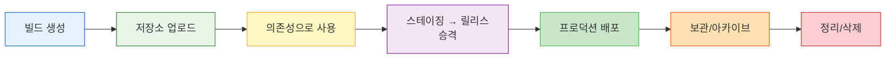
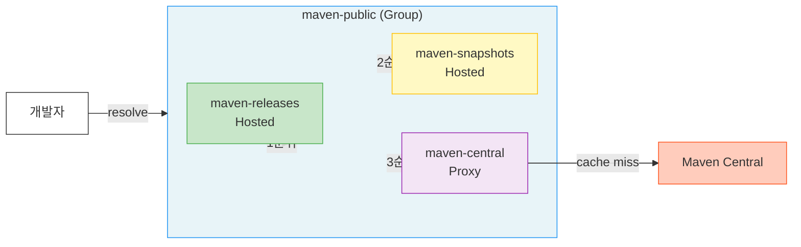
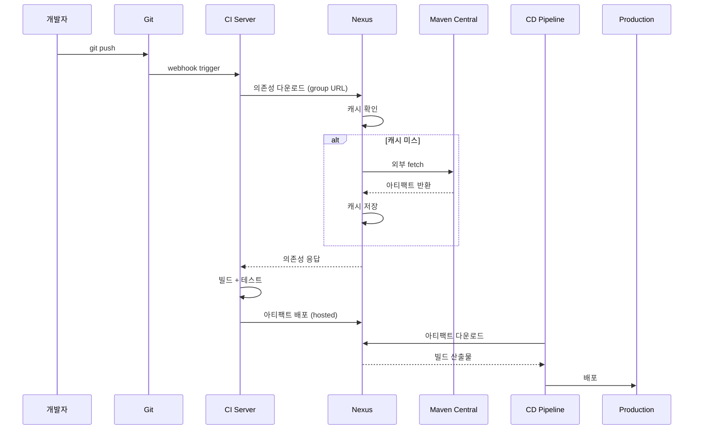

# Ch01: 아티팩트 관리의 기초

> **핵심 질문**: JAR를 슬랙에 올려서 공유하면 안 되는 이유는?

---

## 1. 아티팩트란 무엇인가

소프트웨어를 빌드하면 결과물이 나온다. Java 프로젝트라면 JAR/WAR, Node.js라면 tarball, Go라면 바이너리 하나.
이 빌드 산출물을 **아티팩트(artifact)**라 부른다.
Docker 이미지도 아티팩트이고, Helm chart도 아티팩트이며, Terraform 모듈도 결국 아티팩트에 해당한다.

그런데 여기서 한 가지 구분이 필요하다.
소스 코드와 아티팩트는 다르다.
소스 코드는 Git에 저장하지만, 아티팩트는 Git에 넣으면 안 된다.
왜일까?
JAR 하나가 50MB라면 Git 히스토리가 순식간에 수 GB로 불어나고, `git clone`에 30분이 걸리는 사태가 벌어진다.
Git은 텍스트 diff에 최적화되어 있지, 바이너리 파일의 버전 관리에는 적합하지 않다.
아티팩트는 아티팩트를 위한 저장소가 따로 필요하다는 뜻이다.

### 1.1 아티팩트의 종류

각 언어 생태계마다 아티팩트 형식이 다르다.
이 형식의 차이가 곧 아티팩트 저장소가 "포맷"을 구분하는 이유이기도 하다.

| 생태계 | 아티팩트 형식 | 확장자/형태 | 특징 |
|--------|-------------|-----------|------|
| Java/JVM | JAR, WAR, EAR | `.jar`, `.war` | ZIP 기반, 내부에 클래스파일+매니페스트 |
| JavaScript | npm package | `.tgz` | tarball, `package.json`이 메타데이터 |
| Python | wheel, sdist | `.whl`, `.tar.gz` | wheel은 사전 빌드, sdist는 소스 배포 |
| Go | 모듈 | 소스 zip | `go.sum`으로 무결성 검증 |
| Container | Docker/OCI image | layer + manifest | content-addressable, layer 공유 |
| IaC | Helm chart | `.tgz` | K8s 배포 단위, Chart.yaml이 메타데이터 |
| .NET | NuGet package | `.nupkg` | ZIP 기반, `.nuspec` 메타데이터 포함 |
| 범용 | Raw file | 아무 파일 | 좌표 체계 없음, URL 경로가 곧 식별자 |

**JAR**는 사실 ZIP 파일에 `.jar` 확장자를 붙인 것이다.
내부에 컴파일된 `.class` 파일, `META-INF/MANIFEST.MF`, 리소스 파일이 들어 있으며, 실행 가능 JAR라면 `Main-Class` 속성이 매니페스트에 선언되어 있다.
WAR는 웹 애플리케이션 배포 단위로 `WEB-INF/web.xml`을 포함하고, EAR는 JAR와 WAR를 묶은 엔터프라이즈 배포 단위다.
Spring Boot의 fat JAR는 의존성 JAR까지 하나에 패키징하므로 50-100MB에 달하기도 한다.

**npm package**는 `package.json`을 루트에 가진 tarball이다.
`npm pack` 명령으로 생성되며, `name`과 `version` 필드가 유일 식별자 역할을 한다.
scoped package(`@mycompany/utils`)는 조직 단위로 네임스페이스를 분리해서 이름 충돌을 방지하는데, 이 구조는 Ch03에서 자세히 다룬다.

**Docker image**는 다른 아티팩트와 구조 자체가 다르다.
단일 파일이 아니라 **manifest**(어떤 레이어로 구성되는지)와 **layer**(파일시스템 차분)의 조합이다.
각 layer는 SHA256 해시로 식별되고, 같은 내용의 layer는 여러 이미지가 공유한다.
`openjdk:17-slim` 위에 10개 서비스를 올리면 base layer는 한 벌만 저장되는 셈이니, 스토리지 효율이 높다.

**Helm chart**는 K8s 리소스 템플릿의 묶음이다.
`Chart.yaml`에 이름, 버전, 의존성이 선언되어 있고, `values.yaml`로 환경별 설정을 주입한다.
OCI 레지스트리에 저장할 수도 있어서 Docker image와 같은 저장소에서 관리하는 추세가 생기고 있다.

**Python wheel**은 사전 빌드된 배포 형식으로, 설치 시 컴파일이 불필요하다.
sdist(source distribution)는 소스를 배포하는 형식이라 설치 시 빌드가 필요할 수 있다.
C 확장을 포함하는 패키지(numpy 등)에서 이 차이가 체감되는데, wheel은 즉시 설치 가능하지만 sdist는 C 컴파일러가 있어야 한다.

### 1.2 아티팩트의 생명주기

아티팩트에도 수명이 있다.
이걸 인식하지 못하면 저장소가 한없이 커지기만 한다.

SNAPSHOT은 개발 중에 수십 번 올라갔다가 릴리스 후에는 더 이상 필요 없어진다.
30일 이상 아무도 다운로드하지 않은 SNAPSHOT은 삭제 후보로 봐도 무방하다.
RELEASE는 프로덕션에서 사용 중이면 반드시 보존해야 하지만, EOL(End of Life)된 버전은 아카이브로 이동하거나 삭제할 수 있다.
이 생명주기를 자동화하는 것이 Nexus의 Cleanup Policy이고, Ch09에서 상세히 다룬다.

### 1.3 소스 코드 vs 아티팩트: 왜 저장소가 달라야 할까?

이 구분을 명확히 해두지 않으면 "Git에 JAR 넣으면 안 돼?" 같은 질문이 계속 나온다.

| 특성 | 소스 코드 (Git) | 아티팩트 (Nexus 등) |
|------|----------------|-------------------|
| 파일 유형 | 텍스트 | 바이너리 |
| 크기 | 수 KB/파일 | 수 MB~수 GB/파일 |
| diff | 줄 단위 diff 가능 | 불가능 (바이너리) |
| 버전 관리 | 브랜치, 태그, 커밋 | 좌표 체계 (GAV 등) |
| 접근 패턴 | 전체 히스토리 clone | 특정 버전만 다운로드 |
| 삭제 | 히스토리에 영원히 남음 | 삭제 가능 (공간 회수) |

Git LFS가 바이너리를 처리하긴 하지만, 이건 "Git의 한계를 우회하는 도구"이지 아티팩트 관리 솔루션이 아니다.
GAV 좌표 기반 의존성 해결, 프록시 캐싱, 접근 제어 같은 기능은 Git LFS에 없다.

## 2. 아티팩트 관리가 필요한 이유

"그냥 JAR 파일 슬랙에 올리면 되지 않나?"
3인 팀에서 주 1회 배포하는 프로젝트라면 어쩌면 괜찮을 수도 있다.
하지만 현실은 이렇다.

### 2.1 JAR를 슬랙에 올려서 공유하면 안 되는 이유

구체적인 시나리오를 그려보자.

**월요일 오전 10시.**
팀원 A가 공통 라이브러리 `common-utils`를 수정하고 로컬에서 `./gradlew build`를 실행한다.
생성된 `common-utils-1.0.jar`를 슬랙 `#dev-artifacts` 채널에 올린다.
"utils 라이브러리 업데이트했어요~"

**월요일 오후 2시.**
팀원 B가 해당 JAR를 다운로드하여 자기 프로젝트의 `libs/` 디렉토리에 넣는다.
잘 동작한다.

**화요일 오전.**
팀원 A가 긴급 버그를 발견하고 수정 후 다시 빌드한다.
같은 이름의 `common-utils-1.0.jar`를 슬랙에 다시 올린다.
"버그 수정했어요~"

**수요일.**
팀원 C가 `#dev-artifacts` 채널을 스크롤하다가 월요일 버전을 다운로드한다.
화요일 버전이 있는 줄 모른다.
C의 프로젝트에서 버그가 재현되고, 원인을 찾는 데 반나절이 날아간다.

**2주 후.**
프로덕션 장애가 터진다.
"common-utils 어떤 버전 쓰고 있어?"
아무도 답하지 못한다.
슬랙에는 `common-utils-1.0.jar`가 3개 올라와 있고, 어떤 게 프로덕션에 들어간 건지 추적할 방법이 없다.
체크섬? 기록한 사람이 없다.

이것은 과장이 아니다.
아티팩트 저장소 없이 운영하는 스타트업에서 실제로 반복되는 패턴이다.

### 2.2 네 가지 근본 문제

**버전 추적 불가.**
`payment-service-final.jar`, `payment-service-final-v2.jar`, `payment-service-진짜최종.jar`가 슬랙 채널에 쌓인다.
프로덕션에 어떤 버전이 올라갔는지 아무도 모른다.
장애가 터지면 "지난주 올렸던 그 JAR"을 찾는 데 30분이 걸린다.

**재현 가능한 빌드 붕괴.**
6개월 전 릴리스를 다시 빌드해야 하는 상황이 온다.
그때 사용한 의존성 라이브러리가 Maven Central에서 삭제됐거나 버전이 변경됐다면?
동일한 결과물을 다시 만들 수 없다.
아티팩트 저장소에 프록시 캐시가 있었다면 이런 일은 일어나지 않았을 것이다.

**의존성 해결의 지옥.**
팀 A가 만든 공통 라이브러리를 팀 B가 사용한다.
슬랙으로 JAR를 주고받으면 Gradle/Maven이 의존성을 자동으로 해결하지 못한다.
`libs/` 디렉토리에 수동으로 넣는 순간, 전이 의존성(transitive dependency) 관리는 포기한 셈이다.
`common-utils`가 `guava:32.1`을 쓰는데, `libs/`에 JAR만 넣으면 guava가 자동으로 딸려오지 않는다.
그러면 또 guava JAR를 수동으로 넣어야 하고, guava가 쓰는 라이브러리를 또 넣어야 하고... 끝이 없다.

**보안과 감사.**
누가 어떤 아티팩트를 언제 올렸는지 추적이 안 된다.
악성 코드가 포함된 패키지를 누군가 올려도 알 길이 없다.
규제 산업(금융, 의료)에서는 이것만으로 감사에 걸린다.
"이 바이너리가 어떤 소스에서 빌드됐는지 증명하세요"라는 질문에 답할 수 없으면 컴플라이언스 위반이다.
SBOM(Software Bill of Materials) 요구가 강해지는 추세에서, 아티팩트 저장소의 메타데이터는 SBOM 생성의 기반이 된다.

## 3. 아티팩트 저장소의 세 가지 유형

아티팩트 저장소는 크게 세 종류로 나뉜다.
이 구분을 이해하면 Nexus 설정의 70%는 끝난다.

### 3.1 Hosted Repository

내부에서 빌드한 아티팩트를 저장하는 곳이다.
`mvn deploy`나 `npm publish`로 올리는 대상이 바로 hosted 리포지토리다.
팀이 만든 공통 라이브러리, 서비스의 릴리스 아티팩트가 여기 들어간다.

hosted는 두 가지로 나뉘는데, RELEASE용과 SNAPSHOT용을 분리하는 것이 관례다.
RELEASE는 한번 올리면 덮어쓸 수 없고(immutable), SNAPSHOT은 개발 중이므로 같은 버전을 반복 업로드할 수 있다.
이 분리를 왜 하는 걸까?
RELEASE와 SNAPSHOT의 **Write Policy**가 다르기 때문이다.
RELEASE는 `ALLOW_ONCE`(한 번만 쓰기), SNAPSHOT은 `ALLOW`(반복 쓰기).
하나의 리포지토리에 하나의 Write Policy만 적용되므로, 섞으면 둘 중 하나의 정책을 포기해야 한다.

### 3.2 Proxy Repository

외부 저장소를 캐싱하는 리포지토리다.
Maven Central, npmjs.org, Docker Hub 같은 공개 저장소 앞에 프록시를 두는 것이다.

비유하면 **동네 편의점**과 같다.
코카콜라 공장(Maven Central)에서 직접 사올 수도 있지만, 편의점(proxy)에 가면 이미 있다.
편의점에 없는 제품을 요청하면 편의점이 공장에서 가져다 놓고(캐싱), 다음 손님부터는 편의점 재고에서 바로 꺼내준다.

여기서 핵심은 **캐싱**이다.
처음 요청할 때 외부에서 다운로드하고 로컬에 저장한다.
두 번째 요청부터는 로컬 캐시에서 바로 응답한다.
이게 왜 중요할까?

첫째, 빌드 속도.
20명이 동시에 `mvn clean install`을 돌리면 Maven Central에 20번 요청하는 대신 프록시 캐시에서 가져온다.
둘째, 외부 장애 격리.
Maven Central이 다운되어도 캐시에 있으면 빌드가 멈추지 않는다.
셋째, 네트워크 비용.
특히 클라우드 환경에서 외부 트래픽은 돈이다.

### 3.3 Group Repository

hosted와 proxy를 하나로 묶어주는 가상 리포지토리다.
비유하자면 **편의점+마트+온라인몰을 하나의 주소로 접근**하는 것과 같다.
개발자는 `settings.xml`이나 `.npmrc`에 group URL 하나만 넣으면 된다.
내부 아티팩트든 외부 의존성이든 한 곳에서 해결된다.

group의 **멤버 순서**가 중요하다.
같은 좌표의 아티팩트가 hosted에도 있고 proxy에도 있다면, 순서가 앞인 쪽이 우선한다.
보통 hosted를 먼저, proxy를 나중에 배치한다.
왜?
내부 라이브러리가 우선되어야 dependency confusion 공격(외부에 같은 이름의 악성 패키지를 올리는 공격)을 막을 수 있기 때문이다.

## 4. 아티팩트 흐름: 코드에서 프로덕션까지

개발자가 코드를 푸시하면 CI가 빌드하고, 빌드 결과물이 아티팩트 저장소에 올라가고, CD가 저장소에서 아티팩트를 꺼내 배포한다.
이 흐름을 끊김 없이 만드는 것이 아티팩트 관리의 핵심이다.

이 흐름에서 Nexus는 **두 가지 역할**을 동시에 수행한다.
빌드 시점에는 의존성 제공자(proxy)로, 배포 시점에는 아티팩트 저장소(hosted)로 동작한다.
이 이중 역할 때문에 Nexus가 죽으면 빌드도 배포도 전부 멈추는 것이며, HA 구성이 중요한 이유가 바로 여기에 있다.

## 5. Nexus vs Artifactory vs Harbor

아티팩트 저장소를 고를 때 후보는 보통 세 개다.
각각의 설계 철학이 다르므로 팀 상황에 맞는 선택이 필요하다.

| 항목 | Nexus Repository 3 | JFrog Artifactory | Harbor |
|------|--------------------|--------------------|--------|
| 라이선스 | OSS (무료) / Pro | OSS / Pro / Enterprise | 무료 (CNCF) |
| 지원 포맷 | Maven, npm, Docker, PyPI 등 20+ | 30+ (가장 많음) | Docker/OCI 전용 |
| 아키텍처 | Java/Karaf, 단일 노드 | Java, HA 지원 | Go, K8s 네이티브 |
| HA | Pro 라이선스 필요 | Pro 이상 | 기본 지원 |
| 보안 스캔 | Pro에서 Lifecycle (구 IQ Server) | Xray (내장, 유료) | Trivy (내장, 무료) |
| 메타데이터 | 기본 | Properties, Build Info 풍부 | OCI annotations |
| CLI 도구 | REST API | JFrog CLI (강력) | 없음 (docker CLI 활용) |
| 커뮤니티 | 활발, Sonatype 주도 | 활발, 상업 지원 강점 | CNCF graduated |
| 가격 (연간) | OSS 무료, Pro ~$12K+ | OSS 무료, Pro ~$3K+ | 무료 |

어떤 걸 고를까?

**Nexus OSS**를 선택하는 팀이 많은 이유가 있다.
무료이면서 Maven+npm+Docker+PyPI를 모두 지원하고, 설치가 단순하며, 메모리 2GB면 돌아간다.
중소 규모 팀에서 비용 대비 가성비가 가장 좋은 선택이다.

**Artifactory**는 메타데이터와 빌드 통합이 강점이다.
JFrog CLI로 CI/CD 파이프라인과 긴밀하게 연동되고, Xray로 보안 취약점을 자동 스캔한다.
포맷 지원도 가장 넓다.
다만 의미 있는 기능 대부분이 유료 버전에 들어 있다.

**Harbor**는 Docker/OCI 이미지 전용이라는 점이 명확한 차별점이다.
K8s 네이티브로 설계되어 있고, Trivy 기반 이미지 스캔이 무료로 포함된다.
컨테이너 이미지만 관리한다면 Harbor가 가장 깔끔한 선택이지만, Maven이나 npm까지 커버하지는 못한다.

정리하면: Docker 이미지만 관리한다면 Harbor.
다양한 포맷을 비용 없이 관리하고 싶다면 Nexus OSS.
엔터프라이즈급 기능(HA, Xray, 빌드 통합)이 필요하다면 Artifactory Pro.

## 6. Nexus Repository Manager 3 아키텍처

Nexus 3의 내부 구조를 이해하면 운영 중 문제를 진단하기 훨씬 수월해진다.

### 6.1 런타임: Karaf/OSGi 컨테이너

Nexus 3은 **Java 애플리케이션**이다.
Apache Karaf(OSGi 컨테이너) 위에서 동작하며, 번들 단위로 기능이 로드된다.
시작 시간이 1-2분 걸리는 이유가 여기 있다.
수십 개의 OSGi 번들이 순차적으로 초기화되기 때문이다.

OSGi가 뭔지 모르겠다면 이렇게 생각하면 된다.
Java 세계의 "플러그인 시스템"이다.
각 기능(Maven 포맷 지원, Docker 포맷 지원, 보안 모듈 등)이 독립된 번들로 패키징되어 있고, 런타임에 동적으로 로드/언로드할 수 있다.
Nexus OSS와 Pro의 차이도 실은 로드되는 번들이 다른 것이다.
Pro 라이선스를 적용하면 HA, Replication 같은 추가 번들이 활성화되는 구조다.

Nexus의 기본 JVM 힙은 2703MB(`-Xms2703m -Xmx2703m`)로 설정되어 있다.
리포지토리 수가 50개를 넘거나, Docker 이미지를 대량으로 다루면 4-8GB로 늘려야 할 수 있다.
Direct memory(`-XX:MaxDirectMemorySize`)도 별도로 할당되므로, 실제 메모리 사용량은 힙 설정의 1.5-2배로 잡아야 한다.

### 6.2 데이터베이스: OrientDB에서 H2로

Nexus 3 초기 버전은 OrientDB를 내장 DB로 사용했다.
리포지토리 메타데이터, 사용자 정보, 보안 설정 등을 저장했는데, OrientDB 프로젝트 자체가 유지보수 불확실성이 커지면서 **H2 데이터베이스로 마이그레이션**했다 (3.71.0+부터 H2가 기본).
SAP가 인수한 뒤 커뮤니티 활동이 줄었고, 버그 수정과 보안 패치 주기가 불안정해진 것이 결정적이었다.
H2는 Java 생태계에서 수십 년간 검증됐고, 임베디드 모드에서의 안정성이 뛰어나다.
마이그레이션 도구(`nexus-db-migrator`)를 제공해 기존 OrientDB 데이터를 H2로 변환할 수 있다.

H2 DB 파일은 `$NEXUS_DATA/db/` 디렉토리에 저장된다.
주요 데이터베이스는 세 가지다:

- **component**: 아티팩트 메타데이터 (GAV 좌표, 체크섬, 파일 크기 등)
- **config**: 리포지토리 설정, 스케줄 태스크, Blob Store 설정
- **security**: 사용자, 역할, 권한, Realm 설정

### 6.3 Blob Store: 바이너리 저장소

실제 아티팩트 바이너리(JAR, Docker layer 등)는 DB가 아니라 **Blob Store**에 저장된다.
Blob Store는 두 가지 구현이 있다:

- **File**: 로컬 파일시스템. 기본값이며 대부분의 환경에서 충분하다.
- **S3**: AWS S3 호환 스토리지. 대용량이거나 내구성이 중요할 때 선택한다.

Blob Store와 DB의 관계를 이해해야 한다.
DB에는 메타데이터(이름, 버전, 체크섬, 경로)가 들어가고, Blob Store에는 실제 파일이 들어간다.
DB를 잃으면 Blob Store의 파일이 있어도 복구가 어렵다.
백업 시 **DB와 Blob Store를 함께** 백업해야 하는 이유다.
반대로 Blob Store 없이 DB만 있으면 "메타데이터는 있는데 파일이 없다"는 missing blob 오류가 발생한다.

Blob Store의 File 구현을 좀 더 들여다보면, 아티팩트 하나당 두 개의 파일이 생긴다.
`.bytes` 파일(실제 바이너리)과 `.properties` 파일(메타데이터: SHA1, 크기, 생성 시간 등)이다.
이 파일들은 해시 기반 디렉토리 구조로 분산 저장되어, 단일 디렉토리에 파일이 몰리는 것을 방지한다.

### 6.4 플러그인 시스템

OSGi 번들 구조 덕분에 Nexus는 포맷 지원을 플러그인으로 확장할 수 있다.
`nexus-repository-<format>` 형태의 커뮤니티 플러그인이 다수 존재하며, Conan(C++), Conda, APT 등이 이런 방식으로 추가된다.
단, 커뮤니티 플러그인은 Nexus 버전 업그레이드 시 호환성이 깨질 수 있으므로 프로덕션에서는 검증 후 사용해야 한다.

### 6.5 보안 모델

Nexus의 보안은 세 계층으로 구성된다:

1. **Realm**: 인증 방식 (Local, LDAP, Docker Bearer Token 등). 여러 Realm을 동시에 활성화할 수 있고, 순서대로 시도한다.
2. **Role**: 권한 묶음 (nx-admin, nx-anonymous 등). 역할 상속도 가능하다.
3. **Privilege**: 개별 권한 (리포지토리 읽기, 쓰기, 관리 등). Content Selector와 결합하면 경로 레벨까지 세밀한 제어가 된다.

## 7. 실무 시나리오: 저장소 없이 겪는 문제들

실제로 아티팩트 저장소 없이 운영하는 팀에서 반복되는 문제를 나열해 보자.

**월요일 아침 빌드 실패.**
주말에 npmjs.org에서 특정 패키지가 unpublish되었다.
2016년 left-pad 사건이 대표적인 예다.
11줄짜리 패키지 하나가 unpublish되어 수천 개 프로젝트의 빌드가 깨졌다.
프록시 캐시가 있었다면 이미 캐싱된 버전으로 빌드가 성공했을 텐데, 직접 외부를 바라보고 있으니 팀 전체가 블로킹된다.

**내부 라이브러리 배포 지옥.**
공통 유틸 라이브러리를 수정할 때마다 JAR를 빌드해서 슬랙에 올리고, 사용하는 팀이 다운받아 `libs/`에 넣고 커밋한다.
3주 후 "어떤 버전 쓰고 있어?"라는 질문에 아무도 답하지 못한다.

**보안 사고.**
인턴이 `npm install`로 typosquatting 공격 패키지를 설치했다.
`lodash` 대신 `lodahs`를 타이핑한 것인데, 공격자가 이 이름으로 악성 패키지를 올려둔 상황이다.
아티팩트 저장소의 Routing Rule이나 Content Selector로 허용된 패키지만 통과시켰다면 막을 수 있었을 것이다.

**감사 대응 실패.**
프로덕션에 배포된 아티팩트가 어떤 소스 코드에서 빌드되었는지, 어떤 의존성을 포함하는지 증빙할 수 없다.
아티팩트 저장소의 메타데이터와 감사 로그가 이 문제를 해결한다.

## 8. 저장소 설계 원칙

아티팩트 저장소를 처음 구성할 때 따라야 할 원칙이 몇 가지 있다.

**포맷별로 분리하라.**
Maven과 npm을 하나의 리포지토리에 섞지 않는다.
각 포맷은 고유한 메타데이터 구조와 해석 규칙이 있기 때문이다.

**환경별로 분리하라.**
development와 production 아티팩트를 같은 hosted에 넣지 않는다.
SNAPSHOT은 dev 용도, RELEASE는 prod 배포 후보다.

**proxy는 넉넉하게, hosted는 보수적으로.**
proxy 리포지토리는 필요한 외부 저장소마다 하나씩 만들어도 괜찮다.
hosted는 명확한 목적이 있을 때만 추가한다.

**group으로 클라이언트를 단순하게.**
개발자가 알아야 할 URL은 group 하나뿐이어야 한다.
내부 구조를 클라이언트에 노출하지 않는다.
나중에 hosted를 분리하거나 proxy를 추가해도 group URL은 그대로이므로, 클라이언트 설정을 변경할 필요가 없다.

**Blob Store를 포맷별로 분리하라.**
Docker 이미지는 수 GB 단위로 쌓이는데 Maven JAR와 같은 Blob Store에 넣으면 디스크 예측이 어렵다.
최소한 Docker는 별도 Blob Store를 권장한다.

## 9. 정리

| 개념 | 핵심 |
|------|------|
| 아티팩트 | 빌드 산출물. Git이 아닌 전용 저장소에 보관 |
| 아티팩트 종류 | JAR, npm tarball, Docker image, Helm chart, wheel 등 |
| 아티팩트 생명주기 | 빌드 → 업로드 → 소비 → 승격 → 배포 → 아카이브 → 정리 |
| Hosted | 내부 빌드 결과물 저장. RELEASE(불변) + SNAPSHOT(가변) 분리 |
| Proxy | 외부 저장소 캐싱. 속도, 안정성, 비용 절감. 편의점 비유 |
| Group | hosted + proxy를 하나의 URL로 통합. 클라이언트 단순화 |
| Blob Store | 바이너리 실체가 저장되는 곳 (File 또는 S3) |
| DB | 메타데이터 저장 (H2, 과거 OrientDB). component/config/security |
| Nexus 3 | Java/Karaf/OSGi, 플러그인 구조, OSS/Pro 이중 라이선스 |
| Artifactory | 메타데이터 풍부, Xray 보안 스캔, JFrog CLI |
| Harbor | Docker/OCI 전용, Trivy 무료 스캔, K8s 네이티브 |
| 설계 원칙 | 포맷별 분리, 환경별 분리, group으로 단순화, Blob Store 분리 |

아티팩트 관리는 "편의" 기능이 아니라 **소프트웨어 공급망의 기반 인프라**다.
팀 규모가 10명을 넘거나 서비스가 3개 이상이면 아티팩트 저장소 없이 운영하는 것 자체가 기술 부채를 쌓는 행위에 해당한다.
다음 장에서는 Nexus를 실제로 설치하고 띄워본다.

---

> **다음**: [Ch02 - 설치와 배포 환경](../02-installation-deployment/LEARN.md)
