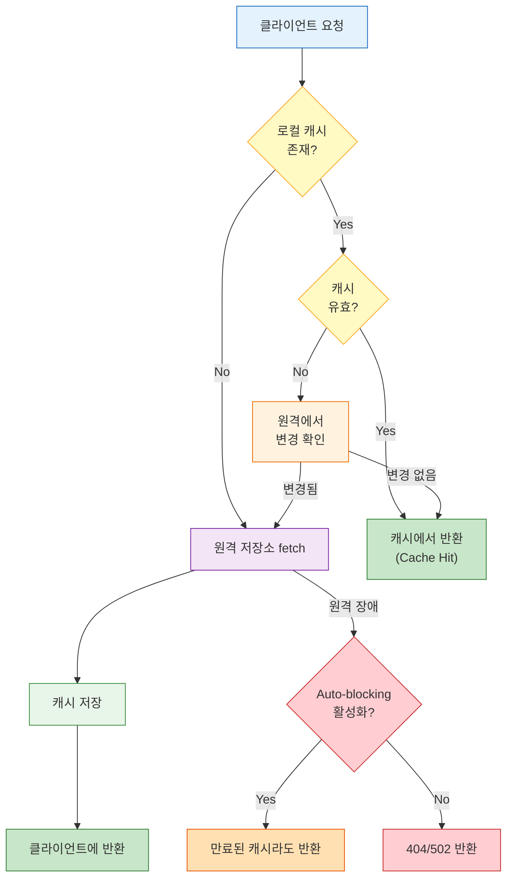
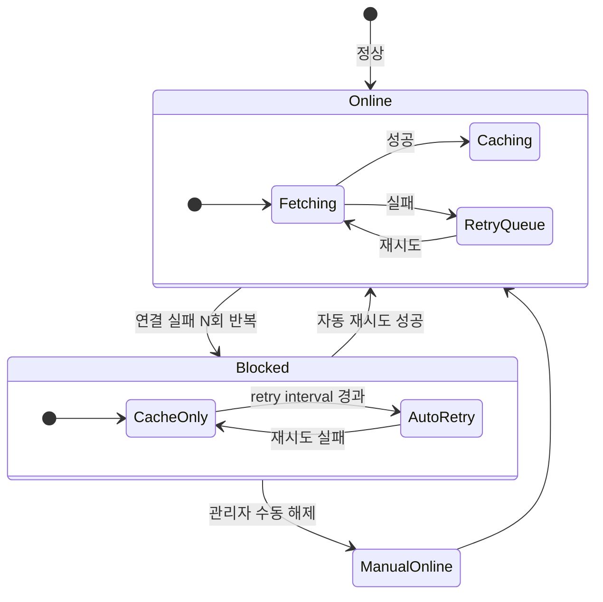

# Ch04: 프록시와 캐싱 전략

> **핵심 질문**: 외부 레지스트리 다운 시 빌드가 멈추지 않으려면?

---

## 1. Proxy 리포지토리의 동작 원리

Proxy 리포지토리는 Nexus의 가장 실용적인 기능이다. 외부 저장소(Maven Central, npmjs.org, Docker Hub 등) 앞에 캐싱 레이어를 두는 것인데, 이것 하나로 빌드 속도, 안정성, 네트워크 비용 세 가지를 동시에 개선할 수 있다.

동작 흐름은 단순하다. 클라이언트가 아티팩트를 요청하면 Nexus는 먼저 로컬 캐시를 확인한다. 캐시에 있으면 즉시 반환하고(cache hit), 없으면 원격 저장소에서 가져와서 캐시에 저장한 뒤 반환한다(cache miss). 두 번째 요청부터는 항상 cache hit이다.

여기서 "캐시에 있다"는 것이 무조건 반환을 의미하지는 않는다. 캐시의 **유효기간**이 있기 때문이다. 유효기간이 지난 캐시는 원격에서 변경 여부를 확인한 뒤 응답한다. 이 유효기간을 제어하는 설정이 Content Max Age와 Metadata Max Age다.

구체적인 예시로 흐름을 따라가 보자. 개발자가 `mvn compile`을 실행하면 Maven은 `commons-lang3:3.14.0`을 요청한다. 이 요청이 Nexus의 maven-public(group)에 도달하고, group은 멤버 순서대로 탐색한다. hosted에 없으니 proxy(maven-central)를 확인한다. proxy의 캐시에 `commons-lang3:3.14.0`이 있고 Content Max Age가 -1(무기한)이면 즉시 반환한다. 캐시에 없으면 `https://repo1.maven.org/maven2/org/apache/commons/commons-lang3/3.14.0/commons-lang3-3.14.0.jar`를 fetch하고, Blob Store에 저장한 뒤, 클라이언트에 반환한다.



## 2. 캐싱 메커니즘 상세

Nexus의 캐싱은 세 가지 독립적인 설정으로 제어된다. 각각의 역할을 혼동하면 "캐시가 안 비워진다" 또는 "매번 외부를 찔러서 느리다"는 상황이 생긴다.

### 2.1 Content Max Age

**아티팩트 바이너리**의 캐시 유효기간이다. 기본값은 `-1`(무기한)이며, 이것이 대부분의 경우에 올바른 설정이다.

왜 무기한이 맞을까? Maven RELEASE 아티팩트는 불변이다. `commons-lang3-3.14.0.jar`가 한번 릴리스되면 내용이 바뀌지 않는다. 다시 확인할 필요가 없으니 캐시를 영원히 유지해도 된다.

SNAPSHOT은 다르다. 같은 버전이라도 내용이 수시로 바뀌므로 Content Max Age를 짧게 설정해야 한다. 하지만 SNAPSHOT은 보통 hosted에서 관리하지 proxy로 외부에서 가져오는 경우는 드물다. 외부 SNAPSHOT proxy가 필요한 특수한 경우에만 조정하면 된다.

Content Max Age를 양수로 설정하는 경우도 있긴 하다. npm 패키지 중 unpublish 후 같은 버전으로 다시 publish하는 경우(드물지만 존재한다), 캐시에 이전 버전이 남아 있을 수 있다. 이런 엣지 케이스가 우려되면 Content Max Age를 7일(10080분) 정도로 설정할 수 있지만, 일반적으로는 -1이 정답이다.

### 2.2 Metadata Max Age

**메타데이터 파일**의 캐시 유효기간이다. Maven의 `maven-metadata.xml`, npm의 `package.json` 레지스트리 응답 등이 해당한다. 기본값은 보통 **1440분(24시간)**.

메타데이터는 왜 따로 관리할까? 메타데이터에는 "이 아티팩트의 최신 버전이 뭐냐"라는 정보가 들어 있다. 외부에서 새 버전이 릴리스되어도 메타데이터 캐시가 유효한 동안은 Nexus가 새 버전의 존재를 모른다.

이게 실무에서 이런 상황을 만든다:

> "Maven Central에 신규 라이브러리 버전이 올라왔는데, 우리 Nexus에서 안 보여요."

메타데이터 캐시가 아직 유효하기 때문이다. 기다리면 24시간 후 갱신되지만, 급하면 수동으로 캐시를 무효화해야 한다. 이 값을 너무 짧게 설정하면 매 빌드마다 Maven Central에 메타데이터 요청을 보내서 빌드가 느려진다.

적절한 값은 팀 상황에 따라 다르다:

| 환경 | Metadata Max Age | 이유 |
|------|-----------------|------|
| 활발한 개발 (외부 라이브러리 자주 추가) | 60-360분 | 새 버전 감지 빠르게 |
| 안정적 운영 (의존성 변경 드뭄) | 1440분 (기본값) | 불필요한 외부 요청 최소화 |
| air-gapped 환경 | -1 (무기한) | 외부 접근 자체가 없음 |
| CI 전용 Nexus | 60-120분 | CI는 최신 버전 감지가 중요 |

### 2.3 Negative Cache

존재하지 않는 아티팩트에 대한 캐싱이다. 누군가 `com.example:nonexistent:1.0`을 요청하면 외부에서 404를 받는다. 이 "없다"는 결과를 캐싱해서, 같은 요청이 반복되면 외부에 다시 물어보지 않고 바로 404를 반환하는 것이다.

이게 왜 필요할까? Maven은 의존성을 해결할 때 여러 리포지토리를 순회한다. group에 proxy가 3개 있으면 각 proxy마다 "이 아티팩트 있어?"를 물어본다. 대부분의 아티팩트는 하나의 저장소에만 있으므로 나머지 2개에서는 404가 나온다. 이 404를 캐싱하지 않으면 매 빌드마다 같은 404 요청이 외부로 나간다.

기본값은 **enabled, TTL 1440분**이다.

함정이 하나 있다. negative cache에 걸린 아티팩트가 나중에 외부에 실제로 올라가면? TTL이 만료될 때까지 Nexus는 계속 "없다"고 응답한다. 새로 릴리스된 패키지가 Nexus에서 안 보이면 negative cache를 의심해봐야 한다.

이 함정이 빌드를 얼마나 방해하는지 실제 시나리오로 보자. 팀원 A가 `com.mycompany:new-sdk:1.0.0`을 아직 deploy하지 않은 상태에서 팀원 B가 의존성에 추가하고 빌드했다. 404가 반환되고 negative cache에 저장된다. 1시간 후 A가 deploy를 완료했지만, B가 다시 빌드해도 여전히 404다. TTL 1440분(24시간)이 남아 있기 때문이다. 이 상황에서 B는 "분명 deploy했다는데 왜 안 보이지?"라며 시간을 낭비하게 된다.

해결 방법:
1. Negative cache TTL을 60-120분으로 단축
2. Deploy 직후 해당 경로의 캐시를 수동 무효화
3. CI 파이프라인에서 deploy 후 자동으로 캐시 무효화 API 호출

단, hosted에 올라간 아티팩트는 negative cache와 무관하다. negative cache는 proxy에만 적용된다. group을 통해 요청하면 hosted를 먼저 탐색하므로, hosted에 있는 아티팩트가 negative cache에 가려지지는 않는다.

### 2.4 캐시 히트/미스 시나리오: SNAPSHOT vs RELEASE

이 두 유형에서 캐싱 동작이 어떻게 다른지 구체적으로 비교해보자.

**RELEASE 캐싱 시나리오:**

```
1차 요청: commons-lang3:3.14.0
  → proxy 캐시: MISS
  → Maven Central에서 fetch
  → Blob Store에 저장
  → Content Max Age: -1 (무기한)
  → 응답: 200 OK + JAR

2차 요청 (3개월 후): commons-lang3:3.14.0
  → proxy 캐시: HIT (Content Max Age = -1이므로 영원히 유효)
  → 외부 요청 없이 즉시 반환
  → 응답: 200 OK + JAR (캐시)
```

RELEASE는 불변이므로 캐시를 영원히 유지해도 문제가 없다. 외부 저장소가 다운되든 말든 영향을 받지 않는다.

**SNAPSHOT 캐싱 시나리오 (외부 SNAPSHOT proxy 사용 시):**

```
1차 요청: spring-boot:3.3.0-SNAPSHOT
  → proxy 캐시: MISS
  → Spring Snapshot Repo에서 fetch
  → Blob Store에 저장
  → Content Max Age: 1440분 (24시간)
  → 응답: 200 OK + JAR

2차 요청 (2시간 후): spring-boot:3.3.0-SNAPSHOT
  → proxy 캐시: HIT + 유효기간 내
  → 외부 요청 없이 반환 (하지만 원본이 바뀌었을 수 있음)

3차 요청 (25시간 후): spring-boot:3.3.0-SNAPSHOT
  → proxy 캐시: HIT + 유효기간 만료
  → 원격에서 변경 확인 (maven-metadata.xml 비교)
  → 변경됨 → 새로운 SNAPSHOT fetch + 캐시 갱신
```

SNAPSHOT proxy에서 Content Max Age를 -1로 두면 원본이 아무리 바뀌어도 최초 캐시만 계속 내려준다. "최신 개발 버전을 쓰겠다"는 SNAPSHOT의 목적 자체가 무의미해지는 셈이니, SNAPSHOT proxy는 반드시 유한한 Max Age를 설정해야 한다.

## 3. Auto-blocking: 원격 장애 자동 감지

외부 저장소가 느리거나 다운되면 어떻게 될까? Nexus가 매 요청마다 외부에 연결을 시도하고 타임아웃을 기다리면, 빌드 시간이 급격히 늘어난다. Connection Timeout이 20초인데 의존성 200개를 해결하면 최악의 경우 200 × 20초 = 66분을 타임아웃만 기다리는 상황이 된다.

Auto-blocking은 이 문제를 해결한다. 원격 저장소에 연결 실패가 반복되면 Nexus가 해당 proxy를 자동으로 **blocked** 상태로 전환한다. blocked 상태에서는 외부 요청을 보내지 않고, **기존 캐시만으로** 응답한다. 캐시에 없는 아티팩트는 404를 반환하지만, 이미 캐시된 아티팩트는 정상적으로 사용 가능하다.

### 3.1 상태 전이 상세



| 상태 | 동작 | 전환 조건 |
|------|------|----------|
| **Online** | 캐시 미스 시 원격 fetch | 연결 실패 반복 → Blocked |
| **Blocked** | 캐시만 사용, 주기적 재시도 (기본 300초) | 재시도 성공 → Online |
| **Manual block** | 관리자가 수동 차단 | 관리자 해제 → Online |

### 3.2 Auto-blocking이 빌드에 미치는 영향

Auto-blocking이 활성화되면 빌드 동작이 어떻게 바뀌는지 시나리오를 비교해보자.

**Auto-blocking 없는 경우 (Maven Central 다운 시):**
```
빌드 시작
  → commons-lang3:3.14.0 요청 → 캐시 HIT → 즉시 반환 (OK)
  → spring-core:6.1.0 요청 → 캐시 HIT → 즉시 반환 (OK)
  → new-library:1.0.0 요청 → 캐시 MISS → 외부 fetch 시도
    → connection timeout 20초 대기...
    → 실패, retry...
    → connection timeout 20초 대기...
    → 실패 → 빌드 실패
  총 시간: ~50초 (대부분 타임아웃 대기)
```

**Auto-blocking 있는 경우 (이미 Blocked 상태):**
```
빌드 시작
  → commons-lang3:3.14.0 요청 → 캐시 HIT → 즉시 반환 (OK)
  → spring-core:6.1.0 요청 → 캐시 HIT → 즉시 반환 (OK)
  → new-library:1.0.0 요청 → 캐시 MISS → proxy blocked → 즉시 404
    → 빌드 실패 (하지만 즉시 실패, 타임아웃 대기 없음)
  총 시간: ~3초
```

두 경우 모두 빌드는 실패하지만, Auto-blocking이 있으면 **빠르게 실패(fail fast)**한다. 50초와 3초의 차이는 CI에서 수십 개 빌드가 돌 때 체감이 크다.

### 3.3 Auto-blocking 설정과 모니터링

Auto-blocking 설정은 proxy 리포지토리의 `HTTP` 탭에서 조정한다:

- **Blocked**: 현재 상태 (true/false)
- **Auto-blocking enabled**: 자동 차단 활성화 여부

proxy 상태를 REST API로 조회할 수 있다:

```bash
# 모든 리포지토리 상태 조회
curl -u admin:pass \
  "https://nexus.example.com/service/rest/v1/repositories"

# 특정 proxy의 상태 확인 (JSON 응답에서 proxy.remoteUrl, status 등)
curl -u admin:pass \
  "https://nexus.example.com/service/rest/v1/repositories/maven-central"
```

Prometheus + Grafana로 모니터링하는 팀이라면, proxy 상태를 주기적으로 조회하는 exporter를 만들어 blocked 전환 시 알림을 받을 수 있다. Nexus가 Blocked로 전환된 것을 몰라서, "왜 새 라이브러리가 안 받아지지?"라며 한참 헤매는 상황을 방지할 수 있다.

## 4. HTTP Client 설정

proxy가 외부 저장소에 연결할 때 사용하는 HTTP 클라이언트 설정이다. 네트워크 환경에 따라 튜닝이 필요하다.

### 4.1 타임아웃

```
Connection Timeout: 20s (기본)
Socket Timeout: 60s (기본)
```

Connection Timeout은 TCP 연결 수립까지의 시간이다. 외부 저장소 서버가 응답하지 않을 때 이 시간이 경과하면 포기한다. Socket Timeout은 연결 후 데이터 수신 대기 시간이다. 연결은 됐지만 데이터가 안 오는 상황(서버 과부하 등)에 적용된다.

대용량 아티팩트(Docker image layer 등)를 가져올 때 Socket Timeout이 짧으면 다운로드 도중 끊길 수 있다. Docker proxy에서는 Socket Timeout을 120-300초로 늘리는 것을 고려하자. 1GB짜리 base image layer를 10Mbps 속도로 받으면 800초가 걸리는데, 60초면 중간에 끊긴다.

### 4.2 Retry 설정

```
Retry count: 2 (기본)
```

fetch 실패 시 재시도 횟수다. 네트워크가 불안정한 환경에서는 3-5로 올릴 수 있지만, 높이면 타임아웃 대기 시간이 배수로 늘어난다. `retry 5 × connection timeout 20초 = 최대 100초` 대기. Auto-blocking과 함께 고려해야 한다.

### 4.3 인증

일부 외부 저장소는 인증이 필요하다. Docker Hub의 rate limit을 피하려면 유료 계정 인증을 설정해야 하고, 사설 npm registry에 접근하려면 토큰이 필요하다.

```
Username: docker-hub-user
Password: docker-hub-token
```

Docker Hub의 rate limit 비교:

| 계정 유형 | Pull 제한 (6시간) | 참고 |
|----------|-------------------|------|
| Anonymous | 100회 | IP 기준 |
| Free (인증) | 200회 | 계정 기준 |
| Pro/Team | 5,000회 | 계정 기준 |
| Business | 무제한 | - |

20명 팀에서 CI가 활발하면 하루에 수백 번 Docker pull이 발생한다. proxy 하나가 인증 계정으로 요청하면 rate limit 여유가 생기고, pull 요청이 캐시 히트로 대체되므로 외부 요청 자체가 줄어든다.

### 4.4 Proxy 설정 (네트워크 프록시)

기업 네트워크에서 외부 접근이 HTTP 프록시를 거쳐야 하는 경우:

```
HTTP proxy host: proxy.corp.com
HTTP proxy port: 8080
Exclude hosts: *.internal.corp.com, localhost, 127.0.0.1
```

Nexus 자체가 프록시 역할을 하면서 동시에 네트워크 프록시를 통해 외부에 접근하는 이중 프록시 구조가 된다. 복잡해 보이지만 기업 환경에서는 흔한 구성이다. 주의할 점은 `Exclude hosts`에 내부 Nexus 주소를 넣어야 한다는 것이다. 내부 통신까지 네트워크 프록시를 거치면 불필요한 지연이 생긴다.

### 4.5 User-Agent 설정

Nexus가 외부 저장소에 요청할 때 보내는 User-Agent 헤더를 커스터마이즈할 수 있다. 일부 CDN이나 저장소가 특정 User-Agent를 차단하는 경우에 유용하다. 기본값은 `Nexus/<version>`이다.

## 5. 네트워크 격리 환경(Air-gapped) 대응

보안이 극도로 중요한 환경(금융, 군사, 의료)에서는 인터넷 접근 자체가 차단된 네트워크에서 개발한다. proxy가 외부에 연결할 수 없으니, 아티팩트를 어떻게 가져올까?

### 5.1 사전 캐시(Pre-population) 전략

인터넷이 되는 환경의 Nexus에서 필요한 아티팩트를 모두 다운로드한 뒤, Blob Store를 통째로 복사해서 격리 환경에 넣는 방법이다.

1. 인터넷 환경에서 프로젝트의 모든 의존성을 빌드하여 proxy 캐시를 채운다
2. Blob Store + DB를 백업한다
3. 물리 매체(USB, 외장 디스크)로 격리 네트워크에 반입한다
4. 격리 환경의 Nexus에 복원한다

**캐시 워밍(Cache Warming)** 스크립트를 만들어두면 효율적이다. 프로젝트의 모든 의존성을 선언적으로 나열한 파일(Maven의 `pom.xml`, npm의 `package-lock.json` 등)에서 아티팩트 목록을 추출하고, 하나씩 다운로드하는 스크립트를 돌리는 식이다:

```bash
#!/bin/bash
# Maven 캐시 워밍: 프로젝트의 모든 의존성을 다운로드
cd /path/to/project
mvn dependency:go-offline -DoverWriteSnapshots=true -DoverWriteReleases=false

# Gradle 캐시 워밍
./gradlew dependencies --no-daemon

# npm 캐시 워밍
npm ci  # package-lock.json 기반 정확한 의존성 설치

# Docker 캐시 워밍: 사용하는 base image 모두 pull
docker pull openjdk:17-slim
docker pull nginx:1.25-alpine
docker pull postgres:16-alpine
```

이 스크립트를 인터넷 Nexus를 통해 실행하면 proxy 캐시가 채워진다. 이후 Blob Store를 백업하여 격리 환경에 반입한다.

### 5.2 Hosted 전용 구성

proxy를 아예 만들지 않고, hosted에 아티팩트를 직접 업로드하는 방법이다. Maven이라면 `mvn deploy:deploy-file`로, npm이라면 `npm publish`로 하나씩 올린다. Nexus REST API로 대량 업로드 스크립트를 만드는 팀도 있다.

```bash
# Maven 아티팩트 수동 업로드 (REST API)
curl -u admin:pass \
  -F "maven2.asset1=@commons-lang3-3.14.0.jar" \
  -F "maven2.asset1.extension=jar" \
  -F "maven2.groupId=org.apache.commons" \
  -F "maven2.artifactId=commons-lang3" \
  -F "maven2.version=3.14.0" \
  "https://nexus.example.com/service/rest/v1/components?repository=maven-releases"

# POM도 함께 업로드 (의존성 해결에 필수)
curl -u admin:pass \
  -F "maven2.asset1=@commons-lang3-3.14.0.pom" \
  -F "maven2.asset1.extension=pom" \
  -F "maven2.groupId=org.apache.commons" \
  -F "maven2.artifactId=commons-lang3" \
  -F "maven2.version=3.14.0" \
  "https://nexus.example.com/service/rest/v1/components?repository=maven-releases"
```

POM 파일을 빠뜨리면 전이 의존성 해결이 안 되는 함정이 있다. JAR만 올리면 "이 라이브러리가 뭘 의존하는지" 정보가 없으므로, Maven이 전이 의존성을 자동으로 가져오지 못한다.

### 5.3 로컬 캐시 통째로 업로드

가장 실수가 적은 방법은 인터넷 환경에서 프로젝트 빌드를 실행하여 로컬 Maven/Gradle 캐시(`~/.m2/repository/`, `~/.gradle/caches/`)를 채운 뒤, 이 캐시 디렉토리를 통째로 Nexus에 업로드하는 스크립트를 작성하는 것이다. 전이 의존성까지 빠짐없이 포함되므로 하나씩 올리는 것보다 누락 위험이 줄어든다.

```bash
# ~/.m2/repository/ 전체를 Nexus hosted에 업로드하는 스크립트
find ~/.m2/repository -name "*.jar" -o -name "*.pom" | while read file; do
  # 경로에서 GAV 추출
  rel_path=${file#~/.m2/repository/}
  # curl로 업로드 (경로 기반)
  curl -u admin:pass --upload-file "$file" \
    "https://nexus.example.com/repository/maven-releases/$rel_path"
done
```

### 5.4 하이브리드: 단방향 동기화

완전 격리는 아니지만 외부→내부 단방향만 허용하는 환경도 있다. 이 경우 외부 Nexus에서 내부 Nexus로 주기적으로 아티팩트를 동기화하는 스크립트를 돌린다. Nexus Pro의 **Replication** 기능이 이 시나리오를 지원하지만, OSS에서는 REST API + 스크립트로 구현해야 한다.

DMZ에 "중개 Nexus"를 두는 패턴도 있다. 외부 인터넷과 내부 네트워크 사이 DMZ에 Nexus를 설치하고, 외부→DMZ proxy 캐싱, DMZ→내부 단방향 동기화 구조를 만드는 것이다.

## 6. 캐시 무효화

캐시가 잘못된 상태를 보관하고 있을 때 수동으로 비워야 한다. 언제 이 작업이 필요할까?

**시나리오 1: 새 라이브러리 버전이 안 보일 때.** Metadata Max Age가 24시간인데, 1시간 전에 릴리스된 라이브러리를 지금 써야 한다. 메타데이터 캐시를 무효화하면 즉시 새 버전이 보인다.

**시나리오 2: negative cache에 걸린 아티팩트.** 한 시간 전에 404였던 아티팩트가 지금은 존재하지만, negative cache TTL이 아직 남아 있다.

**시나리오 3: 손상된 캐시.** 네트워크 문제로 다운로드가 중간에 끊겨 불완전한 아티팩트가 캐시된 경우. 빌드 시 "invalid JAR" 또는 "checksum mismatch" 오류가 나면 이 상황을 의심해야 한다.

무효화 방법:

```bash
# 1) Admin UI에서 전체 캐시 무효화
# Administration → Repositories → [proxy repo] → Invalidate cache 버튼

# 2) REST API로 특정 리포지토리 캐시 무효화
curl -u admin:pass -X DELETE \
  "https://nexus.example.com/service/rest/v1/repositories/maven-central/routing-rules"

# 3) REST API로 특정 경로의 아티팩트 삭제 (캐시 개별 무효화)
# 먼저 asset ID를 조회
curl -u admin:pass \
  "https://nexus.example.com/service/rest/v1/search/assets?repository=maven-central&group=org.apache.commons&name=commons-lang3&version=3.14.0"

# 반환된 asset ID로 삭제
curl -u admin:pass -X DELETE \
  "https://nexus.example.com/service/rest/v1/assets/<asset-id>"

# 4) 메타데이터만 갱신 (Rebuild Index)
# Administration → Repositories → [proxy repo] → Rebuild index
```

전체 캐시 무효화는 다음 빌드에서 대량의 외부 요청이 발생하므로, 가능하면 특정 경로만 삭제하는 것이 낫다. 전체 무효화는 최후의 수단으로만 사용하자.

## 7. 캐시 전략 결정 매트릭스

환경별로 어떻게 설정해야 하는지 매트릭스로 정리하자.

| 설정 | 활발한 개발 | 안정 운영 | Air-gapped |
|------|-----------|----------|-----------|
| Content Max Age | -1 (무기한) | -1 | -1 |
| Metadata Max Age | 60-360분 | 1440분 | -1 |
| Negative Cache | enabled, 60분 | enabled, 1440분 | disabled |
| Auto-blocking | enabled | enabled | 불필요 |
| Connection Timeout | 20s | 20s | - |
| Socket Timeout | 60s | 120s (대용량) | - |
| Retry | 2 | 2-3 | - |

Content Max Age는 거의 모든 환경에서 -1이다. RELEASE 아티팩트는 불변이므로 재검증할 이유가 없다. Metadata Max Age가 환경별로 차이가 가장 크며, 이 값 하나가 "새 버전 감지 속도 vs 외부 요청 빈도"의 트레이드오프를 결정한다.

## 8. 캐싱과 스토리지 관리

캐시가 계속 쌓이면 디스크는 어떻게 될까? Nexus의 **Cleanup Policy**와 **Compact Blob Store** 태스크가 이 문제를 해결한다.

### 8.1 Cleanup Policy

proxy 리포지토리에 Cleanup Policy를 연결하면, 조건에 맞는 캐시를 자동 삭제한다:

- **Last downloaded before**: 마지막 다운로드 이후 N일 경과한 아티팩트 삭제
- **Last blob updated before**: 캐시된 지 N일 경과한 아티팩트 삭제

"Last downloaded before 90일"이 실용적이다. 90일 동안 아무도 사용하지 않은 캐시는 더 이상 필요하지 않을 가능성이 높다. 다시 필요하면 그때 외부에서 가져오면 된다.

포맷별로 Cleanup 기준이 달라야 할 수 있다. Docker image는 크기가 크므로 30일이 적합할 수 있고, Maven JAR은 작으므로 180일도 괜찮다. 포맷별로 별도 Cleanup Policy를 만들어 적용하는 것이 좋다.

### 8.2 Compact Blob Store

Cleanup이 아티팩트를 삭제해도 디스크 공간이 즉시 회수되지 않는다. soft-delete로 마킹만 하기 때문이다. `Compact Blob Store` 스케줄 태스크를 돌려야 실제로 공간이 확보된다. 주 1회 정도 야간에 돌리는 것이 일반적이다.

Compact 작업 중에도 Nexus는 정상 동작하지만, I/O 부하가 발생할 수 있으므로 빌드가 활발한 시간대는 피하자.

## 9. 실전 트러블슈팅 패턴

proxy 관련 문제가 발생했을 때 확인할 순서:

| 증상 | 확인 순서 | 해결 |
|------|----------|------|
| 아티팩트가 안 보인다 | Metadata Max Age → negative cache → Routing Rule | 캐시 무효화 또는 TTL 조정 |
| 빌드가 갑자기 느려졌다 | proxy 상태(blocked?) → 외부 저장소 장애 | Auto-blocking 확인, 수동 해제 |
| 특정 아티팩트만 404 | negative cache → 외부 저장소에서 직접 확인 | negative cache 삭제 |
| Docker pull timeout | Socket Timeout → 네트워크 프록시 → layer 크기 | Socket Timeout 증가 |
| 디스크 부족 | Cleanup Policy → Compact 태스크 → Blob Store 크기 | Cleanup 설정 후 Compact 실행 |
| checksum mismatch | 손상된 캐시 → 네트워크 문제 | 해당 아티팩트 삭제 후 재다운로드 |

트러블슈팅의 첫 단계는 항상 **Nexus 로그**(`$NEXUS_DATA/log/nexus.log`)를 확인하는 것이다. 외부 저장소 연결 실패, 인증 오류, Blob Store 관련 에러 등이 여기 기록된다.

## 10. 정리

| 개념 | 핵심 |
|------|------|
| Content Max Age | 아티팩트 바이너리 캐시 유효기간. RELEASE는 -1(무기한) |
| Metadata Max Age | 메타데이터 캐시 유효기간. 새 버전 감지 속도에 영향 |
| Negative Cache | 404 응답 캐싱. 불필요한 외부 요청 방지. TTL 주의 |
| Auto-blocking | 원격 장애 시 자동 차단, 캐시만으로 서빙. fail fast |
| HTTP Client | Connection/Socket Timeout, Retry, 인증, 네트워크 프록시 |
| Air-gapped | 사전 캐시(워밍), hosted 직접 업로드, 단방향 동기화 |
| 캐시 무효화 | UI/REST API로 전체 또는 경로별 무효화 가능 |
| Cleanup + Compact | 캐시 정리는 soft-delete → compact 2단계. 포맷별 정책 분리 |

캐싱은 "설정하고 잊어버리면 되는" 기능이 아니다. 팀의 개발 패턴, 네트워크 환경, 보안 요구사항에 따라 지속적으로 조정해야 한다. Metadata Max Age 하나만 잘 잡아도 "새 라이브러리가 안 보여요"라는 문의의 대부분이 사라질 것이다.

---

> **이전**: [Ch03 - 리포지토리 포맷과 구성](../03-repository-formats/LEARN.md)
> **다음**: [Ch05 - REST API와 웹 통합](../05-rest-api-and-web-integration/LEARN.md)
