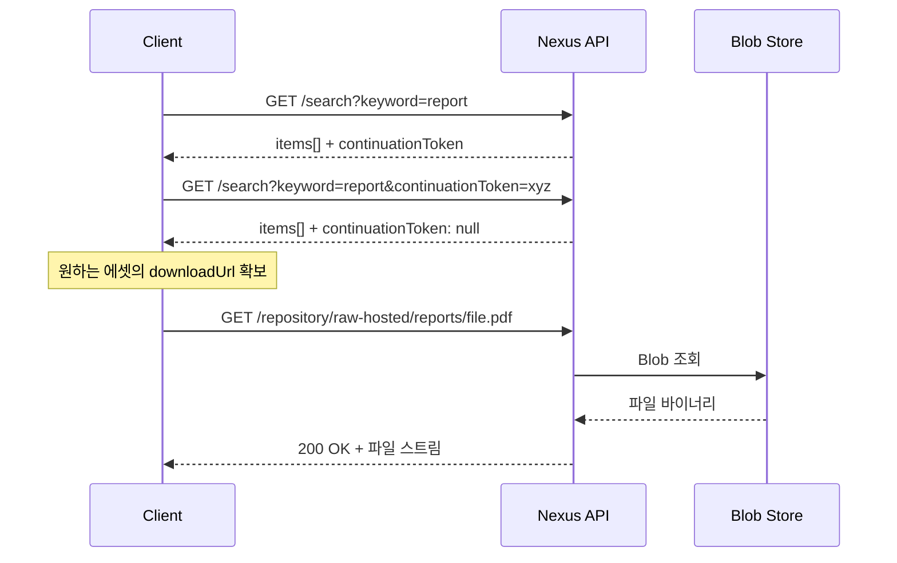
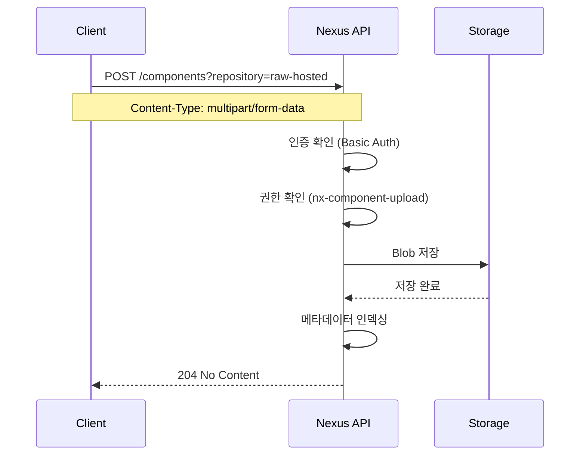

# Ch05. REST API와 웹 연동

> **핵심 질문**: 커스텀 웹 UI에서 Nexus 파일을 검색하고 업로드하고 다운로드하려면 어떻게 해야 할까?

---

## 1. 왜 REST API인가

Nexus UI는 관리자에게 적합하지만, 개발팀이 원하는 건 조금 다르다. "우리 프로젝트에서 쓰는 라이브러리 버전 목록을 한눈에 보고 싶다"거나 "CI/CD에서 빌드 산출물을 자동으로 올리고 싶다"는 요구가 생긴다. 이런 자동화와 커스텀 연동의 기반이 바로 REST API이다.

Nexus는 v1 REST API를 제공하며, 모든 엔드포인트 명세는 Swagger UI에서 확인할 수 있다. 브라우저에서 `http://localhost:8081/service/rest/swagger.json`을 열거나, Nexus UI 메뉴의 System > API 항목을 클릭하면 인터랙티브 문서가 나온다. 여기서 직접 요청을 보내볼 수 있으니, 코드를 작성하기 전에 반드시 한 번은 들어가 보길 권한다.

### Swagger UI 접근과 활용

Swagger UI는 단순히 API 명세를 보여주는 것 이상의 도구다. `http://localhost:8081/#admin/system/api` 경로로 들어가면 Nexus에 내장된 Swagger 페이지가 열리는데, 상단의 Authorize 버튼에 admin 계정 정보를 입력하면 페이지 안에서 바로 API를 호출해볼 수 있다. 처음 API를 다루는 사람에게는 curl보다 이 방식이 훨씬 직관적이다.

Swagger에서 각 엔드포인트를 펼치면 필수 파라미터, 선택 파라미터, 응답 스키마가 나오고, "Try it out" 버튼을 누르면 실제 요청이 날아간다. 여기서 생성된 curl 명령어를 복사해서 스크립트에 옮기는 것도 좋은 습관이다. 왜냐하면 Swagger가 생성하는 curl 명령어는 인코딩과 헤더가 정확하게 포함되어 있기 때문이다.

한 가지 주의할 점은 Swagger UI가 관리자 권한이 있어야 접근 가능하다는 것이다. 일반 사용자 계정으로는 API 명세 페이지 자체에 접근이 제한될 수 있으므로, 개발 초기에 Swagger에서 API 구조를 파악한 뒤 실제 호출은 적절한 권한을 가진 계정으로 하는 게 맞다.

API 기본 경로는 `/service/rest/v1/`이고, 주요 리소스는 repositories, components, assets, search다. 각각이 어떤 역할을 하는지 하나씩 살펴보자.

---

## 2. 인증 방식

### Basic Auth

가장 단순한 방식이다. HTTP 요청 헤더에 `Authorization: Basic <base64(user:password)>`를 넣으면 된다.

```bash
# curl에서 -u 옵션이 Basic Auth를 자동 처리한다
curl -u admin:admin123 http://localhost:8081/service/rest/v1/status
```

간편하지만 비밀번호가 base64 인코딩(암호화가 아님)으로만 보호되므로, HTTPS 없이 사용하면 네트워크 스니핑에 그대로 노출된다. 로컬 개발 외에는 반드시 HTTPS와 함께 써야 한다.

Basic Auth를 CI/CD에서 사용할 때는 환경변수로 인증 정보를 주입하는 패턴이 일반적이다. Jenkins라면 `withCredentials` 블록 안에서 `NEXUS_USER`와 `NEXUS_PASS`를 바인딩하고, curl에 `-u $NEXUS_USER:$NEXUS_PASS`를 넣는 식이다. 스크립트에 비밀번호를 하드코딩하는 건 당연히 금지다.

### User Token

Nexus Pro에서 제공하는 기능으로, 비밀번호 대신 토큰 쌍(nameCode + passCode)을 발급받아 사용한다. 토큰은 비밀번호 변경과 독립적이고, 필요 시 개별 폐기가 가능해서 CI/CD 서비스 계정에 적합하다. OSS 버전에서는 사용할 수 없으니, OSS 환경이라면 서비스 전용 계정을 만들어 Basic Auth로 운영하는 게 현실적인 대안이다.

두 방식의 차이를 정리하면 이렇다.

| 구분 | Basic Auth | User Token (Pro) |
|------|-----------|-----------------|
| 인증 수단 | 사용자 비밀번호 | nameCode + passCode |
| 비밀번호 변경 시 | 모든 사용처 업데이트 필요 | 영향 없음 |
| 개별 폐기 | 불가 (비밀번호 변경만) | 가능 |
| 유출 대응 | 비밀번호 변경 → 전체 영향 | 토큰만 폐기 → 해당 서비스만 영향 |
| 적합 환경 | 로컬 개발, 소규모 팀 | CI/CD, 서비스 계정 |

---

## 3. 핵심 엔드포인트

### 3.1 상태 확인

서버가 살아 있는지 확인하는 용도로, 헬스체크 자동화에 쓰인다.

```bash
# 200 OK면 정상, 503이면 아직 기동 중
curl -s -o /dev/null -w "%{http_code}" http://localhost:8081/service/rest/v1/status

# 쓰기 가능 상태 확인 (read-only 모드 감지)
curl -s -o /dev/null -w "%{http_code}" http://localhost:8081/service/rest/v1/status/writable

# 상세 헬스체크 (개별 서브시스템 상태)
curl -u admin:admin123 http://localhost:8081/service/rest/v1/status/check
```

`/status/writable`과 `/status/check` 엔드포인트도 있는데, 전자는 쓰기 가능 상태를, 후자는 좀 더 상세한 헬스 정보를 반환한다. 로드밸런서 헬스체크에는 `/status`만으로 충분하지만, 배포 자동화에서 "Nexus가 완전히 준비되었는가"를 판단할 때는 `/status/writable`이 더 정확하다.

### 3.2 리포지토리 목록 및 관리

```bash
# 전체 리포지토리 목록 조회
curl -u admin:admin123 http://localhost:8081/service/rest/v1/repositories

# 특정 리포지토리 상세 정보
curl -u admin:admin123 \
  http://localhost:8081/service/rest/v1/repositories/maven-releases
```

응답은 JSON 배열이며, 각 항목에 `name`, `format`, `type`(hosted/proxy/group), `url` 등이 포함된다. 이 목록으로 UI 드롭다운을 채우거나, 특정 포맷의 리포지토리만 필터링할 수 있다.

리포지토리를 REST API로 생성하는 것도 가능하다. 이건 Infrastructure as Code 관점에서 유용한데, 리포지토리 구성을 JSON으로 버전 관리할 수 있기 때문이다.

```bash
# Maven hosted 리포지토리 생성
curl -u admin:admin123 -X POST \
  "http://localhost:8081/service/rest/v1/repositories/maven/hosted" \
  -H "Content-Type: application/json" \
  -d '{
    "name": "maven-team-releases",
    "online": true,
    "storage": {
      "blobStoreName": "default",
      "strictContentTypeValidation": true,
      "writePolicy": "ALLOW_ONCE"
    },
    "maven": {
      "versionPolicy": "RELEASE",
      "layoutPolicy": "STRICT"
    }
  }'
```

### 3.3 컴포넌트 조회와 페이지네이션

컴포넌트는 "하나의 논리적 패키지"를 의미한다. Maven이라면 groupId:artifactId:version 조합이고, npm이라면 패키지명:버전이다.

```bash
# 특정 리포지토리의 컴포넌트 목록
curl -u admin:admin123 \
  "http://localhost:8081/service/rest/v1/components?repository=maven-releases"
```

응답 구조가 독특한데, `items` 배열과 함께 `continuationToken`이 온다. 이 토큰이 null이 아니면 다음 페이지가 존재한다는 뜻이고, 다음 요청에 이 토큰을 넘겨야 한다.

```bash
# 다음 페이지 조회
curl -u admin:admin123 \
  "http://localhost:8081/service/rest/v1/components?repository=maven-releases&continuationToken=abc123def"
```

왜 offset/limit이 아니라 continuationToken일까? Nexus가 내부적으로 OrientDB(또는 H2)를 사용하는데, 이런 문서 지향 DB에서 offset 기반 페이지네이션은 깊은 페이지로 갈수록 성능이 심각하게 저하된다. 토큰 기반은 항상 일정한 성능을 보장하므로, 수십만 개의 컴포넌트가 있어도 안정적으로 순회할 수 있다.

### 3.4 에셋

에셋은 컴포넌트에 속한 실제 파일이다. Maven 컴포넌트 하나에 jar, pom, sources-jar 같은 여러 에셋이 딸려 있을 수 있다. 에셋 API는 컴포넌트 API와 비슷한 구조지만, `downloadUrl` 필드가 핵심이다. 이 URL로 직접 파일을 받을 수 있기 때문이다.

```bash
# 에셋 목록 조회
curl -u admin:admin123 \
  "http://localhost:8081/service/rest/v1/assets?repository=raw-hosted"

# 특정 에셋 상세 정보 (체크섬, 크기, 최종 다운로드 시간 등)
curl -u admin:admin123 \
  "http://localhost:8081/service/rest/v1/assets/asset-id-here"
```

### 3.5 검색

검색 API는 리포지토리를 넘나들어 컴포넌트를 찾을 수 있다는 점에서 강력하다.

```bash
# 키워드 검색
curl -u admin:admin123 \
  "http://localhost:8081/service/rest/v1/search?keyword=spring-boot"

# Maven 좌표로 검색
curl -u admin:admin123 \
  "http://localhost:8081/service/rest/v1/search?group=org.springframework&name=spring-core"

# 특정 리포지토리 내 검색
curl -u admin:admin123 \
  "http://localhost:8081/service/rest/v1/search?repository=maven-releases&keyword=utils"

# 특정 버전의 에셋 직접 검색 (다운로드 URL 포함)
curl -u admin:admin123 \
  "http://localhost:8081/service/rest/v1/search/assets?group=com.example&name=my-lib&version=1.0.0"

# Docker 이미지 검색
curl -u admin:admin123 \
  "http://localhost:8081/service/rest/v1/search?docker.imageName=my-app&docker.imageTag=latest"
```

검색도 continuationToken 기반 페이지네이션을 따른다. 검색 파라미터는 format에 따라 다른데, Maven은 `group`, `name`, `version`을, npm은 `keyword`를, Docker는 `docker.imageName`, `docker.imageTag`를 지원한다.

`/search`와 `/search/assets`의 차이를 알아두자. 전자는 컴포넌트 수준 결과를 반환하고, 후자는 에셋 수준으로 `downloadUrl`을 직접 포함한다. 파일 다운로드가 목적이라면 후자가 한 단계를 줄여주는 셈이다.

### 3.6 업로드

업로드는 `POST /components`에 `multipart/form-data`로 보낸다. 포맷마다 필드명이 다르다는 점이 함정이다.

```bash
# Raw 리포지토리에 파일 업로드
curl -u admin:admin123 \
  -X POST "http://localhost:8081/service/rest/v1/components?repository=raw-hosted" \
  -F "raw.directory=/reports/2024" \
  -F "raw.asset1=@./monthly-report.pdf" \
  -F "raw.asset1.filename=monthly-report.pdf"

# Maven 아티팩트 업로드
curl -u admin:admin123 \
  -X POST "http://localhost:8081/service/rest/v1/components?repository=maven-releases" \
  -F "maven2.groupId=com.example" \
  -F "maven2.artifactId=my-lib" \
  -F "maven2.version=1.0.0" \
  -F "maven2.asset1=@./my-lib-1.0.0.jar" \
  -F "maven2.asset1.extension=jar" \
  -F "maven2.asset2=@./my-lib-1.0.0.pom" \
  -F "maven2.asset2.extension=pom"
```

Raw 포맷의 경우 `raw.directory`로 경로를, `raw.asset1`으로 파일을, `raw.asset1.filename`으로 저장될 파일명을 지정한다. 여러 파일을 한 번에 올리려면 `raw.asset2`, `raw.asset3`으로 번호를 늘리면 된다.

Maven이라면 `maven2.groupId`, `maven2.artifactId`, `maven2.version`, `maven2.asset1.extension` 같은 필드가 필요하고, npm은 단순히 tgz 파일 하나를 올리면 된다. 각 포맷의 필드명은 Swagger 문서에서 정확히 확인하는 게 좋다.

### 3.7 삭제

```bash
# 컴포넌트 삭제 (해당 컴포넌트의 모든 에셋도 함께 삭제)
curl -u admin:admin123 -X DELETE \
  "http://localhost:8081/service/rest/v1/components/abc123"

# 개별 에셋 삭제
curl -u admin:admin123 -X DELETE \
  "http://localhost:8081/service/rest/v1/assets/def456"
```

컴포넌트를 삭제하면 소속 에셋이 모두 사라지고, 에셋만 삭제하면 컴포넌트는 남아 있지만 해당 파일만 제거된다. 삭제 후에도 블롭 스토어에는 즉시 반영되지 않을 수 있으며, Compact Blob Store 태스크를 돌려야 디스크가 실제로 회수되는 경우가 있다.

삭제할 컴포넌트의 ID를 모른다면? 검색 API로 찾으면 된다. 검색 결과의 `id` 필드가 삭제에 필요한 값이다.

```bash
# 검색으로 ID 확인 후 삭제하는 패턴
COMPONENT_ID=$(curl -s -u admin:admin123 \
  "http://localhost:8081/service/rest/v1/search?name=old-lib&version=0.1.0" \
  | jq -r '.items[0].id')

curl -u admin:admin123 -X DELETE \
  "http://localhost:8081/service/rest/v1/components/$COMPONENT_ID"
```

---

## 4. REST API 흐름 시각화

### 검색에서 다운로드까지



### 파일 업로드 흐름



업로드 성공 시 응답이 204(No Content)라는 점에 주의하자. 본문이 없으므로 생성된 컴포넌트 ID를 바로 알 수 없다. 방금 올린 파일의 ID가 필요하다면 검색 API로 다시 조회해야 한다. 이 설계가 좀 불편한데, Nexus 팀도 인식하고 있어서 향후 버전에서 개선될 가능성이 있다.

---

## 5. Raw 리포지토리 활용 예제

Raw 리포지토리는 포맷에 구애받지 않는 범용 파일 저장소라서, REST API를 익히기에 가장 좋은 출발점이다.

### 업로드

```bash
# 단일 파일 업로드
curl -u admin:admin123 -X POST \
  "http://localhost:8081/service/rest/v1/components?repository=raw-hosted" \
  -F "raw.directory=/configs/prod" \
  -F "raw.asset1=@./nginx.conf" \
  -F "raw.asset1.filename=nginx.conf"

# 복수 파일 동시 업로드
curl -u admin:admin123 -X POST \
  "http://localhost:8081/service/rest/v1/components?repository=raw-hosted" \
  -F "raw.directory=/scripts" \
  -F "raw.asset1=@./deploy.sh" \
  -F "raw.asset1.filename=deploy.sh" \
  -F "raw.asset2=@./rollback.sh" \
  -F "raw.asset2.filename=rollback.sh"
```

### 다운로드

Raw 리포지토리의 파일은 경로 기반으로 직접 접근할 수 있다.

```bash
# 직접 경로로 다운로드
curl -u admin:admin123 -O \
  "http://localhost:8081/repository/raw-hosted/configs/prod/nginx.conf"

# 에셋 API의 downloadUrl 사용 (리다이렉트 없이)
curl -u admin:admin123 -L -O \
  "http://localhost:8081/service/rest/v1/assets/<asset-id>"
```

직접 경로 방식은 파일 위치를 알 때 쓰고, 에셋 API 방식은 검색 결과에서 downloadUrl을 받아 쓸 때 활용한다. 어떤 방식이 자기 상황에 맞는지 판단해보자.

---

## 6. 페이지네이션 패턴

continuationToken을 다루는 클라이언트 코드의 기본 패턴은 이렇다.

```bash
#!/bin/bash
# 모든 컴포넌트를 순회하는 스크립트
NEXUS="http://localhost:8081"
REPO="raw-hosted"
TOKEN=""
PAGE=1

while true; do
  URL="$NEXUS/service/rest/v1/components?repository=$REPO"
  if [ -n "$TOKEN" ]; then
    URL="$URL&continuationToken=$TOKEN"
  fi

  RESPONSE=$(curl -s -u admin:admin123 "$URL")
  COUNT=$(echo "$RESPONSE" | jq '.items | length')
  echo "Page $PAGE: $COUNT items"
  echo "$RESPONSE" | jq '.items[] | "\(.name):\(.version)"'

  TOKEN=$(echo "$RESPONSE" | jq -r '.continuationToken // empty')
  if [ -z "$TOKEN" ]; then
    echo "--- Total pages: $PAGE ---"
    break
  fi

  PAGE=$((PAGE + 1))
done
```

핵심은 `continuationToken`이 null이 될 때까지 반복한다는 것이다. 이 패턴은 JavaScript의 fetch든, Python의 requests든, Go의 net/http든 동일하게 적용된다. 중요한 건 토큰이 불투명(opaque)하다는 점인데, 이 값을 파싱하거나 조작하면 안 되고 그대로 넘겨야 한다.

검색 결과 전체를 수집하는 실전 스크립트도 살펴보자. 특정 그룹의 모든 아티팩트를 JSON 파일로 내보내는 예제다.

```bash
#!/bin/bash
# 특정 group의 모든 컴포넌트를 JSON으로 내보내기
NEXUS="http://localhost:8081"
GROUP="com.example"
OUTPUT="artifacts.json"
TOKEN=""

echo "[" > "$OUTPUT"
FIRST=true

while true; do
  URL="$NEXUS/service/rest/v1/search?group=$GROUP"
  [ -n "$TOKEN" ] && URL="$URL&continuationToken=$TOKEN"

  RESPONSE=$(curl -s -u admin:admin123 "$URL")

  echo "$RESPONSE" | jq -c '.items[]' | while read -r item; do
    if [ "$FIRST" = true ]; then
      FIRST=false
    else
      echo "," >> "$OUTPUT"
    fi
    echo "$item" >> "$OUTPUT"
  done

  TOKEN=$(echo "$RESPONSE" | jq -r '.continuationToken // empty')
  [ -z "$TOKEN" ] && break
done

echo "]" >> "$OUTPUT"
echo "Export complete: $OUTPUT"
```

---

## 7. 웹 연동 시 고려사항

### CORS (Cross-Origin Resource Sharing)

브라우저에서 Nexus API를 직접 호출하려면 CORS 설정이 필요하다. Nexus 자체에는 CORS 설정 옵션이 없기 때문에, 두 가지 우회 방법을 쓴다.

첫 번째는 리버스 프록시(Nginx, Apache)를 앞에 놓고 CORS 헤더를 추가하는 방법이다.

```nginx
# Nginx 예시 — 실무용 CORS 설정
location /nexus-api/ {
    proxy_pass http://localhost:8081/service/rest/;

    # CORS 헤더
    add_header Access-Control-Allow-Origin "https://app.company.com" always;
    add_header Access-Control-Allow-Methods "GET, POST, DELETE, PUT, OPTIONS" always;
    add_header Access-Control-Allow-Headers "Authorization, Content-Type" always;
    add_header Access-Control-Allow-Credentials "true" always;
    add_header Access-Control-Max-Age 86400 always;

    # preflight 요청 처리
    if ($request_method = OPTIONS) {
        return 204;
    }
}
```

`Access-Control-Allow-Origin`에 와일드카드(`*`)를 쓰면 편하지만, 인증 정보(`Authorization` 헤더)를 포함하는 요청에서는 `*`가 동작하지 않는다. 브라우저가 `credentials: 'include'`를 쓸 때는 반드시 구체적인 도메인을 명시해야 하니, 처음부터 실제 도메인을 넣는 습관을 들이자.

두 번째는 같은 도메인에서 웹 앱을 서빙하는 것인데, Nexus가 Jetty 위에서 돌아가므로 커스텀 WAR를 배포하거나, 별도 웹 서버를 두되 같은 호스트의 다른 포트는 CORS에 걸린다는 점을 기억해야 한다.

세 번째는 백엔드 프록시 패턴이다. 프론트엔드에서 자기 서버의 `/api/nexus/*` 경로로 요청하면, 서버가 Nexus에 대신 요청하고 결과를 돌려준다. 브라우저 입장에서는 같은 출처이므로 CORS 문제가 아예 발생하지 않으며, 인증 정보도 서버 쪽에서 관리할 수 있어 보안상으로도 낫다.

로컬 개발이라면 브라우저 CORS 확장이나 `--disable-web-security` 플래그로 우회할 수 있지만, 프로덕션에서는 리버스 프록시가 정석이다.

### Fetch API와 FormData

브라우저에서 Nexus API를 호출하는 JavaScript 코드는 이런 모양이 된다.

```javascript
// 파일 업로드
const formData = new FormData();
formData.append('raw.directory', '/uploads');
formData.append('raw.asset1', fileInput.files[0]);
formData.append('raw.asset1.filename', fileInput.files[0].name);

const response = await fetch(nexusUrl + '/service/rest/v1/components?repository=raw-hosted', {
  method: 'POST',
  headers: { 'Authorization': 'Basic ' + btoa('admin:admin123') },
  body: formData
  // Content-Type을 직접 설정하면 안 된다! FormData가 boundary를 자동 생성한다
});

// 검색 후 다운로드
const searchRes = await fetch(
  nexusUrl + '/service/rest/v1/search/assets?keyword=report',
  { headers: { 'Authorization': 'Basic ' + btoa('admin:admin123') } }
);
const data = await searchRes.json();
const downloadUrl = data.items[0]?.downloadUrl;
if (downloadUrl) {
  window.location.href = downloadUrl;  // 브라우저가 직접 다운로드
}
```

FormData를 쓸 때 Content-Type 헤더를 수동으로 설정하면 안 된다는 점이 흔한 함정이다. 브라우저가 `multipart/form-data; boundary=...`를 자동으로 만들어주는데, 직접 지정하면 boundary가 누락되어 서버가 파싱에 실패한다. 이 실수를 한 번쯤은 겪어봐야 진짜 이해가 되니, 실습에서 일부러 Content-Type을 넣어보고 에러를 확인해보는 것도 좋겠다.

---

## 8. 실습 안내

이 챕터의 실습은 두 가지로 구성된다.

**practice/web-file-manager/**는 순수 HTML/CSS/JS로 만든 Nexus 파일 관리자다. 리포지토리 선택, 파일 검색, 업로드, 다운로드, 삭제를 브라우저에서 직접 수행할 수 있다. REST API의 주요 엔드포인트를 실제로 호출해보면서 요청/응답 구조를 몸으로 익히는 게 목적이다.

**practice/http/** 디렉토리에는 IntelliJ HTTP Client나 VS Code REST Client에서 쓸 수 있는 `.http` 파일들이 있다. 각 엔드포인트별로 요청 예제가 정리되어 있으니, curl보다 편한 환경에서 실험하고 싶다면 이쪽을 활용하자.

---

## 9. 자주 겪는 문제

**401 Unauthorized**: 인증 정보가 잘못됐거나, Anonymous Access가 꺼져 있는 상태에서 인증 없이 요청한 경우다. `curl -v`로 요청 헤더를 확인하자.

**403 Forbidden**: 인증은 됐지만 해당 리포지토리에 대한 권한이 없을 때 발생한다. Ch06의 접근 제어를 참고하여 역할과 권한을 확인해야 한다.

**405 Method Not Allowed**: proxy 리포지토리에 업로드를 시도하면 이 에러가 나온다. 업로드는 hosted 리포지토리에만 가능하다.

**413 Request Entity Too Large**: 리버스 프록시의 body size 제한에 걸린 경우다. Nginx라면 `client_max_body_size`를 늘려야 한다.

**504 Gateway Timeout**: 대용량 파일 업로드 시 리버스 프록시의 타임아웃에 걸리는 경우다. Nginx라면 `proxy_read_timeout`과 `client_max_body_size`를 늘려야 한다.

**422 Unprocessable Entity**: 업로드 시 필수 필드가 누락되었거나, 포맷에 맞지 않는 필드명을 사용했을 때 발생한다. Swagger에서 해당 포맷의 필수 파라미터를 다시 확인하는 게 가장 빠른 해결책이다.

---

## 10. 정리

| 항목 | 내용 |
|------|------|
| API 기본 경로 | `/service/rest/v1/` |
| 인증 | Basic Auth(OSS), User Token(Pro) |
| 페이지네이션 | continuationToken 기반 (불투명 토큰, 순방향만) |
| 업로드 | POST multipart/form-data, 포맷별 필드명 상이 |
| 업로드 응답 | 204 No Content (ID 미반환) |
| 검색 | `/search` (컴포넌트), `/search/assets` (에셋+downloadUrl) |
| 리포지토리 관리 | CRUD 가능 (관리자 권한 필요) |
| CORS | Nexus 자체 미지원 → 리버스 프록시 또는 백엔드 프록시 |
| Swagger | `/#admin/system/api` 또는 `/service/rest/swagger.json` |

REST API를 다루면서 가장 중요한 교훈은 "Swagger 문서를 먼저 보라"는 것이다. 포맷마다 필드명이 다르고, 버전에 따라 파라미터가 바뀌기도 한다. 공식 문서를 기반으로 작업하면 삽질을 절반은 줄일 수 있다. 그리고 API를 처음 다루는 거라면, Raw 리포지토리로 시작해서 업로드/검색/삭제 흐름을 한 바퀴 돌아본 뒤에 Maven이나 Docker 같은 복잡한 포맷으로 넘어가는 게 학습 순서상 효율적이다.

다음 챕터에서는 이 API에 접근할 수 있는 사람을 어떻게 통제하는지, 즉 접근 제어와 인증을 다룬다.

---

## 참고 자료

- [Nexus REST API 공식 문서](https://help.sonatype.com/en/rest-and-integration-api.html)
- [Sonatype Community - API Examples](https://community.sonatype.com/)
- practice/web-file-manager/ (브라우저 기반 실습)
- practice/http/ (HTTP Client 기반 실습)
