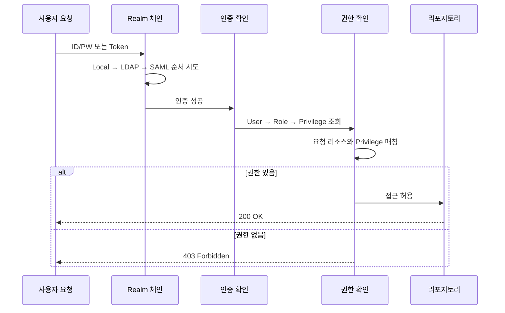
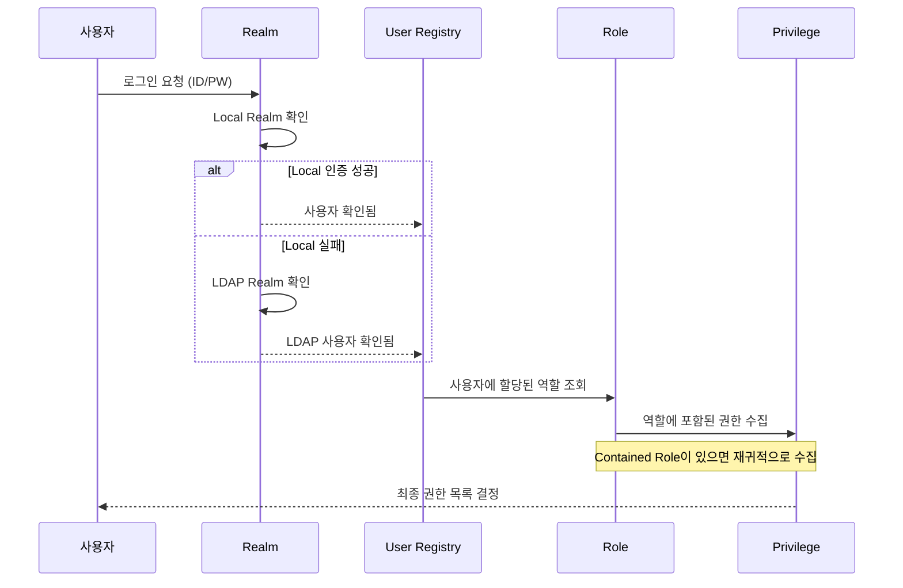
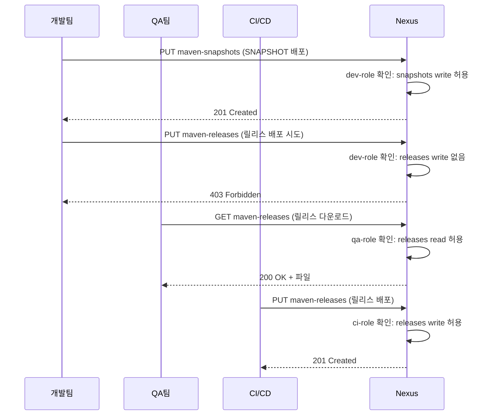

# Ch06. 접근 제어와 인증

> **핵심 질문**: 개발팀은 올리고 QA팀은 읽기만 가능하게 하려면 어떻게 설정해야 할까?

---

## 1. 보안 모델의 전체 그림

Nexus의 접근 제어는 네 가지 개념이 계층적으로 엮여 있다. Realm이 "누가 인증할 수 있는가"를 결정하고, User가 "인증된 주체"이며, Role이 "권한 묶음"이고, Privilege가 "구체적으로 무엇을 할 수 있는가"를 정의한다.

이 구조가 왜 이렇게 되어 있을까? 사용자에게 직접 권한을 부여하면 관리가 불가능해지기 때문이다. 개발자 30명에게 각각 5개 리포지토리 권한을 개별 할당한다고 생각해보자. 리포지토리가 하나 추가될 때마다 30명의 설정을 건드려야 한다. 역할(Role)이라는 중간 계층이 있으면, 역할 하나만 수정하면 그 역할을 가진 모든 사용자에게 반영된다.



---

## 2. Realm: 인증의 입구

Realm은 사용자의 신원을 확인하는 메커니즘이다. Nexus는 여러 Realm을 동시에 활성화할 수 있고, 순서대로 인증을 시도한다. 첫 번째 Realm에서 실패하면 다음 Realm으로 넘어가는 방식이다.

### 기본 제공 Realm

**Local Authenticating Realm**: Nexus 내부 DB에 저장된 사용자/비밀번호로 인증한다. 가장 기본적이며, 초기 admin 계정이 여기에 속한다. 소규모 팀이라면 이것만으로 충분하다. 사용자 정보는 Nexus의 내장 데이터베이스(OrientDB 또는 H2)에 저장되므로, 별도의 인증 인프라가 필요 없다는 것이 강점이다.

**Local Authorizing Realm**: 외부 Realm에서 인증된 사용자에게 Nexus 내부의 역할/권한을 매핑해주는 역할을 한다. LDAP으로 인증하되 세밀한 권한은 Nexus에서 관리하고 싶을 때 필요하다. 이 Realm이 없으면 LDAP 사용자에게 Nexus 내부 역할을 할당할 수 없으니, LDAP 연동 시에는 반드시 함께 활성화해야 한다.

**LDAP Realm**: Active Directory나 OpenLDAP에 연결하여 기존 조직 계정으로 로그인할 수 있게 한다. 대부분의 기업 환경에서 필수적인 설정이다. LDAP 서버와의 연결은 `Administration → Security → LDAP`에서 구성하며, 테스트 연결 기능으로 설정이 올바른지 바로 확인할 수 있다.

**SAML Realm**: Nexus Pro에서 제공하며, Okta, Azure AD, Keycloak 같은 IdP와 SSO를 구성할 수 있다. 브라우저 기반 인증에만 동작하므로 CLI(Maven, Docker)에서는 사용할 수 없다는 제약이 있다. SSO가 필요하면서도 CLI 도구 지원이 필요한 환경에서는 SAML과 LDAP을 병행하는 하이브리드 구성을 취하게 된다.

**Docker Token Realm**: Docker 클라이언트의 token 기반 인증을 처리한다. Docker 리포지토리를 사용한다면 반드시 활성화해야 하고, 순서상 Local Authenticating Realm보다 앞에 놓아야 정상 동작하는 경우가 있다. Docker 클라이언트가 레지스트리에 접근할 때 Bearer Token 프로토콜을 사용하는데, 이 Realm이 비활성화되어 있으면 `docker login`은 되지만 `docker push`가 실패하는 혼란스러운 상황이 발생할 수 있다.

### Realm 순서가 중요한 이유

Realm 순서가 중요한 이유가 뭘까? LDAP Realm이 Local보다 앞에 있으면, 로컬 admin 계정도 LDAP에서 먼저 찾으려고 시도한다. LDAP 서버가 다운되면 로컬 계정으로 로그인조차 못 하는 상황이 벌어질 수 있다. 그래서 Local Authenticating Realm은 항상 첫 번째로 두는 게 안전하다.

권장 순서는 이렇다.

```
1. Local Authenticating Realm     (항상 최우선 — 로컬 관리자 보호)
2. Local Authorizing Realm        (외부 인증 사용자에게 내부 역할 매핑)
3. Docker Bearer Token Realm      (Docker 리포지토리 사용 시)
4. LDAP Realm                     (기업 디렉토리 연동)
5. SAML Realm                     (SSO, Pro 전용)
```

---

## 3. 사용자(User)

사용자는 Local이거나 External(LDAP 등)이다. Local 사용자는 Nexus UI의 Security > Users에서 직접 생성하고, ID/비밀번호/이메일/역할을 지정한다.

```
사용자 생성 시 필수 항목:
- User ID: 로그인에 사용 (변경 불가)
- Password: 최소 8자 권장
- Email: 알림 수신용
- Status: Active / Disabled
- Roles: 최소 1개 이상 할당
```

REST API로 사용자를 생성하는 것도 가능하다. 온보딩 자동화에 활용할 수 있는 패턴이니 알아두면 좋다.

```bash
curl -u admin:admin123 -X POST \
  "http://localhost:8081/service/rest/v1/security/users" \
  -H "Content-Type: application/json" \
  -d '{
    "userId": "dev-hong",
    "firstName": "Gildong",
    "lastName": "Hong",
    "emailAddress": "hong@company.com",
    "password": "SecureP@ss123",
    "status": "active",
    "roles": ["dev-role"]
  }'
```

External 사용자는 LDAP에서 자동으로 가져오며, Nexus에서 비밀번호를 변경할 수 없다. 대신 Nexus 내부에서 추가 역할을 매핑할 수 있어서, LDAP 그룹으로 기본 권한을 주고 Nexus에서 세밀한 조정을 하는 혼합 운영이 가능하다.

---

## 4. 역할(Role)

### 기본 역할

**nx-admin**: 모든 권한을 가진 슈퍼 관리자 역할이다. 프로덕션에서는 이 역할을 가진 사용자를 최소한으로 유지해야 한다. 경험상 2~3명이 적당하며, 일반 개발자에게는 절대 부여하지 않는 것이 원칙이다.

**nx-anonymous**: 인증 없이 접근하는 사용자에게 적용되는 역할이다. 기본적으로 몇몇 리포지토리의 읽기 권한이 포함되어 있는데, 보안이 중요하다면 이 역할의 권한을 축소하거나 Anonymous Access 자체를 비활성화해야 한다.

### 커스텀 역할 만들기

실무에서는 팀별, 환경별로 커스텀 역할을 만드는 게 일반적이다.

```
역할 예시: dev-team-role
포함 Privilege:
  - nx-repository-view-maven2-maven-releases-read
  - nx-repository-view-maven2-maven-releases-browse
  - nx-repository-view-maven2-maven-snapshots-*
  - nx-repository-view-npm-npm-hosted-*
```

위 예시에서 개발팀은 maven-releases는 읽기만 가능하고, maven-snapshots는 모든 작업(읽기/쓰기/삭제)이 가능하며, npm-hosted도 전체 권한을 갖는다. 릴리스 리포지토리에 쓰기 권한을 주지 않는 건 의도적인 것으로, 릴리스는 CI/CD 파이프라인만 할 수 있도록 제한하는 패턴이다.

### Contained Roles

Nexus Pro에서는 역할 안에 다른 역할을 포함할 수 있다. 이를 통해 역할 상속 구조를 만들 수 있는데, 예를 들어 `dev-base-role`(공통 읽기 권한)을 만들고 `dev-frontend-role`과 `dev-backend-role`이 이를 포함하면서 각각의 추가 권한을 가지는 식이다.

```
역할 계층 예시:
L1-base-read          → 모든 리포지토리 read/browse
  └─ L2-dev-backend   → + maven-snapshots write, docker-hosted write
  └─ L2-dev-frontend  → + npm-hosted write
       └─ L3-dev-lead → + maven-releases write (배포 권한)
```

그런데 중첩이 깊어지면 "이 사용자가 실제로 어떤 권한을 가지는지" 파악하기 어려워진다. 2단계까지는 괜찮지만, 3단계 이상 중첩은 관리 복잡도가 급격히 올라가니 피하는 게 좋다.

---

## 5. 권한(Privilege)

### 권한 유형

**Repository View**: 리포지토리의 컴포넌트/에셋에 대한 CRUD 권한이다. `nx-repository-view-{format}-{repo}-{action}` 형태이며, action은 `read`, `browse`, `add`, `edit`, `delete` 또는 와일드카드 `*`다.

**Repository Admin**: 리포지토리 설정 자체를 변경할 수 있는 관리 권한이다. 일반 개발자에게는 절대 줘서는 안 된다.

**Application**: Nexus 시스템 기능에 대한 권한이다. `nx-search-read`(검색), `nx-apikey-all`(API 키 관리) 같은 것들이 포함된다.

**Wildcard**: Nexus의 권한 체계는 Apache Shiro 기반이라 와일드카드 표현이 가능하다. `nexus:repository-view:maven2:*:read`처럼 쓰면 모든 Maven 리포지토리의 읽기 권한을 한 줄로 부여할 수 있다.

### 권한 네이밍 패턴과 실제 문자열 예시

권한 문자열의 구조를 이해하면 UI에서 수십 개의 권한을 뒤지지 않아도 필요한 권한을 빠르게 찾을 수 있다.

```
패턴: nx-repository-view-{format}-{repo}-{action}

실제 문자열 예시:
nx-repository-view-maven2-maven-releases-read        # maven-releases 읽기
nx-repository-view-maven2-maven-releases-browse       # maven-releases 목록 조회
nx-repository-view-maven2-maven-releases-add          # maven-releases 업로드
nx-repository-view-maven2-maven-releases-edit         # maven-releases 수정
nx-repository-view-maven2-maven-releases-delete       # maven-releases 삭제
nx-repository-view-maven2-maven-releases-*            # maven-releases 전체 (와일드카드)
nx-repository-view-docker-docker-hosted-*             # docker-hosted 전체
nx-repository-view-npm-npm-hosted-*                   # npm-hosted 전체
nx-repository-view-raw-raw-hosted-read                # raw-hosted 읽기만
nx-repository-view-raw-*-read                         # 모든 raw 리포지토리 읽기

관리 권한 예시:
nx-repository-admin-maven2-maven-releases-*           # maven-releases 설정 변경
nx-blobstores-all                                     # 모든 Blob Store 관리
nx-tasks-all                                          # 모든 태스크 관리
nx-users-all                                          # 모든 사용자 관리
```

`read`와 `browse`의 차이가 헷갈릴 수 있다. `read`는 에셋 콘텐츠를 다운로드할 수 있는 권한이고, `browse`는 리포지토리 구조를 탐색(목록 조회)할 수 있는 권한이다. 파일을 다운로드하려면 보통 둘 다 필요하니, 함께 부여하는 것이 일반적이다.

---

## 6. Realm에서 Privilege까지의 흐름



### 팀별 접근 제어 흐름



이 흐름이 핵심이다. 개발팀은 스냅샷만 올릴 수 있고, 릴리스는 CI만 올릴 수 있으며, QA는 릴리스를 읽기만 한다. 이렇게 하면 "개발자가 실수로 로컬에서 릴리스를 배포하는" 사고를 구조적으로 방지할 수 있다.

---

## 7. Content Selector와 CSEL

Content Selector는 리포지토리 내 특정 경로나 속성에 대해서만 권한을 부여하는 기능이다. 예를 들어 "maven-releases의 com/mycompany 아래만 접근 가능"처럼 세밀한 제어가 필요할 때 사용한다.

CSEL(Content Selector Expression Language)이라는 간단한 표현식 언어로 조건을 정의한다.

```
# 특정 경로 패턴
format == "maven2" and path =^ "/com/mycompany/"

# SNAPSHOT만 매칭
format == "maven2" and path =~ ".*-SNAPSHOT.*"

# Raw 리포지토리의 특정 디렉토리
format == "raw" and path =^ "/team-a/"

# Docker 이미지 중 특정 네임스페이스
format == "docker" and path =^ "/v2/backend/"

# npm 패키지 중 조직 스코프
format == "npm" and path =^ "/@mycompany/"

# 여러 조건 조합 (AND/OR)
format == "maven2" and (path =^ "/com/mycompany/" or path =^ "/com/partner/")
```

연산자는 `==`(같음), `=^`(시작), `=~`(정규표현식)이 있다. Content Selector를 만든 후, 이를 기반으로 Content Selector Privilege를 생성하고 역할에 할당하는 3단계를 거친다.

### Content Selector 적용 절차

Content Selector를 권한으로 연결하는 과정은 3단계로 이루어진다.

**Step 1**: `Administration → Repository → Content Selectors`에서 셀렉터를 생성한다. 이름과 CSEL 표현식을 입력하고, "Preview" 기능으로 어떤 에셋이 매칭되는지 확인한다.

**Step 2**: `Administration → Security → Privileges`에서 "Repository Content Selector" 타입의 Privilege를 생성한다. 여기서 셀렉터, 대상 리포지토리, action(read/browse/add/delete)을 지정한다. 하나의 셀렉터로 여러 Privilege를 만들 수 있는데, 예를 들어 같은 경로에 대해 read Privilege와 add Privilege를 분리해서 만들면 읽기 전용 역할과 쓰기 역할을 구분할 수 있다.

**Step 3**: 생성한 Privilege를 역할에 추가하고, 역할을 사용자에게 할당한다.

Content Selector가 없으면 리포지토리 단위로만 권한을 나눌 수 있는데, 팀이 많아지면 리포지토리도 그만큼 늘어나야 한다. Content Selector를 쓰면 하나의 리포지토리 안에서 경로 기반으로 접근을 분리할 수 있어서, 리포지토리 수를 적정 수준으로 유지할 수 있다. 물론 복잡도와의 트레이드오프이므로, 팀이 3~4개 이하라면 리포지토리를 분리하는 게 더 단순할 수 있다.

---

## 8. Anonymous Access

Anonymous Access가 활성화되면, 인증 없이 접근하는 모든 요청에 `anonymous` 사용자와 `nx-anonymous` 역할이 적용된다. 기본적으로 몇몇 리포지토리의 읽기 권한이 포함되어 있다.

언제 활성화하는가? Maven Central 프록시처럼, 사내 개발자 누구나 인증 없이 의존성을 받아야 하는 경우다. `settings.xml`에 인증 정보를 넣지 않아도 빌드가 되니 개발자 온보딩이 쉬워진다.

언제 비활성화하는가? 사내 코드가 담긴 hosted 리포지토리만 있거나, 외부 네트워크에서 접근 가능한 환경이라면 무조건 꺼야 한다. Anonymous Access가 켜진 상태에서 인터넷에 노출되면, 누구든지 리포지토리 내용을 열람할 수 있다는 뜻이니까.

절충안은 Anonymous Access를 켜되, `nx-anonymous` 역할의 권한을 프록시 리포지토리 읽기만으로 한정하는 것이다. 이러면 Maven Central 캐시는 인증 없이 접근 가능하지만, 사내 hosted 리포지토리는 인증이 필요하게 된다.

Anonymous Access 설정을 검증하는 가장 좋은 방법은 curl에서 인증 정보 없이 요청을 보내보는 것이다.

```bash
# 익명 접근 테스트 — 프록시(허용 기대)
curl -s -o /dev/null -w "%{http_code}" \
  http://localhost:8081/repository/maven-central/org/springframework/spring-core/

# 익명 접근 테스트 — hosted(차단 기대)
curl -s -o /dev/null -w "%{http_code}" \
  http://localhost:8081/repository/maven-releases/com/mycompany/

# 200이면 접근 가능, 401이면 인증 필요, 403이면 권한 없음
```

---

## 9. 팀별 접근 제어 설계 예시

실제 조직에서 어떻게 역할을 설계하는지 구체적인 예를 살펴보자.

### 역할 매트릭스 — 4개 팀 시나리오

| 역할 | maven-snapshots | maven-releases | npm-hosted | docker-hosted | raw-hosted |
|------|:-:|:-:|:-:|:-:|:-:|
| dev-backend-role | read/write | read | - | read | read |
| dev-frontend-role | read | read | read/write | read | read |
| qa-role | read | read | read | read | read |
| ci-role | read/write | read/write | read/write | read/write | read/write |
| ops-role | read | read | read | read/write | read/write |

백엔드 개발팀은 Maven 스냅샷에 쓰기 권한이 있지만 npm에는 접근하지 않는다. 프론트엔드 개발팀은 반대로 npm에만 쓰기 권한을 갖는다. 이런 분리가 "내가 실수로 잘못된 리포지토리에 배포하는" 사고를 방지해준다.

QA는 모든 곳에서 읽기만 가능하다. CI/CD는 모든 리포지토리에 쓸 수 있는데, 이건 자동화된 파이프라인이 배포를 담당하기 때문이다. 운영팀은 Docker와 Raw에만 쓰기 권한이 있어서 설정 파일이나 컨테이너 이미지를 관리한다.

### 역할 생성 절차

1. Security > Privileges에서 필요한 권한 식별 (또는 Wildcard 활용)
2. Security > Roles에서 커스텀 역할 생성, 권한 할당
3. Security > Users에서 사용자에게 역할 할당
4. 테스트: 해당 사용자로 로그인하여 의도한 대로 접근이 제한되는지 확인

4번을 빠뜨리는 경우가 의외로 많다. 권한을 설정하고 나서 반드시 해당 역할의 사용자로 직접 테스트해봐야 한다. "아마 될 거야"라는 가정은 보안에서 가장 위험하다.

테스트할 때 유용한 curl 패턴이다.

```bash
# dev-backend 사용자로 스냅샷 업로드 (성공해야 함)
curl -u dev-user:devpass -X POST \
  "http://localhost:8081/service/rest/v1/components?repository=maven-snapshots" \
  -F "maven2.groupId=com.example" \
  -F "maven2.artifactId=test" \
  -F "maven2.version=1.0-SNAPSHOT" \
  -F "maven2.asset1=@./test.jar" \
  -F "maven2.asset1.extension=jar"

# dev-backend 사용자로 릴리스 업로드 (403이어야 함)
curl -u dev-user:devpass -X POST \
  "http://localhost:8081/service/rest/v1/components?repository=maven-releases" \
  -F "maven2.groupId=com.example" \
  -F "maven2.artifactId=test" \
  -F "maven2.version=1.0.0" \
  -F "maven2.asset1=@./test.jar" \
  -F "maven2.asset1.extension=jar"
# 예상 응답: 403 Forbidden
```

---

## 10. LDAP 연동 가이드

대부분의 기업 환경에서는 Active Directory나 OpenLDAP을 이미 사용하고 있다. Nexus에 LDAP을 연동하면 별도의 계정 생성 없이 기존 조직 계정으로 로그인할 수 있다.

### 연결 설정

`Administration → Security → LDAP → Create Connection`에서 설정한다.

```
LDAP 연결 정보:
- Name: company-ldap (식별용 이름)
- Protocol: ldaps:// (TLS 권장, 평문 ldap://은 비밀번호 유출 위험)
- Hostname: ldap.company.com
- Port: 636 (LDAPS) 또는 389 (LDAP)
- Search Base: dc=company,dc=com
- Authentication Method: Simple
- Bind DN: cn=nexus-bind,ou=service-accounts,dc=company,dc=com
- Bind Password: ********
```

Bind DN에 개인 계정을 쓰면 안 된다. 전용 서비스 계정을 만들어야 해당 사람이 퇴사해도 LDAP 연동이 끊기지 않는다. 또한 이 서비스 계정에는 LDAP 트리를 읽을 수 있는 최소한의 권한만 부여해야 하는데, 관리자 권한을 가진 Bind DN이 유출되면 LDAP 전체가 위험해질 수 있기 때문이다.

"Verify connection" 버튼으로 연결을 테스트한 후, "Verify user mapping" 버튼으로 사용자가 올바르게 검색되는지까지 확인하는 것이 안전한 순서다. 연결은 되지만 사용자 매핑이 잘못된 경우가 의외로 흔하니까.

### 사용자 매핑 설정

```
User Mapping:
- Base DN: ou=users,dc=company,dc=com
- User Subtree: true (하위 OU까지 검색)
- Object Class: inetOrgPerson (OpenLDAP) / user (AD)
- User ID Attribute: uid (OpenLDAP) / sAMAccountName (AD)
- Real Name Attribute: cn
- Email Attribute: mail
- User Filter: (memberOf=cn=nexus-users,ou=groups,dc=company,dc=com)
```

User Filter를 쓰면 특정 LDAP 그룹에 속한 사용자만 Nexus에 로그인할 수 있게 제한할 수 있다. 전체 조직원이 아니라 Nexus 사용이 필요한 개발자/QA/Ops만 필터링하는 것이 보안상 좋은 관행이다.

### 그룹 매핑

```
Group Mapping:
- Map LDAP Groups as Roles: checked
- Group Type: Dynamic Groups (AD) / Static Groups (OpenLDAP)
- Group Base DN: ou=groups,dc=company,dc=com
- Group Object Class: groupOfUniqueNames (OpenLDAP) / group (AD)
- Group ID Attribute: cn
- Group Member Attribute: uniqueMember (OpenLDAP) / member (AD)
- Group Member Format: uid=${username},ou=users,dc=company,dc=com
```

LDAP 그룹을 Nexus 역할에 매핑하는 게 핵심이다. "LDAP의 dev-group에 속한 사용자는 Nexus의 dev-role을 자동으로 받는다"는 식으로 설정하면, 조직 변경 시 LDAP만 수정하면 Nexus 권한도 따라서 바뀐다.

매핑은 `Administration → Security → Roles`에서 "External Role Mapping"으로 설정한다. LDAP 그룹명을 선택하고, 매핑할 Nexus 역할을 지정하는 방식이다.

그룹 매핑에서 자주 발생하는 실수는 Group Member Format을 잘못 설정하는 것이다. OpenLDAP에서는 `uid=${username},ou=users,dc=company,dc=com` 형태이고, Active Directory에서는 `CN=${username},CN=Users,DC=company,DC=com` 형태인데, 이 포맷이 실제 LDAP 엔트리의 DN과 정확히 일치해야 그룹 멤버십이 인식된다. `ldapsearch` 명령으로 실제 DN을 확인한 후 설정하면 실수를 줄일 수 있다.

```bash
# LDAP 사용자 DN 확인 (OpenLDAP)
ldapsearch -x -H ldap://ldap.company.com -b "dc=company,dc=com" \
  "(uid=hong)" dn
```

### LDAP 캐시 주의점

Nexus는 성능을 위해 LDAP 조회 결과를 캐시하는데, 기본 캐시 시간이 있어서 LDAP에서 그룹을 변경해도 Nexus에 즉시 반영되지 않을 수 있다. 긴급한 권한 변경이 필요하다면 캐시를 수동으로 비우거나, 캐시 TTL을 짧게 조정해야 한다. LDAP 서버 장애 시에도 캐시된 인증 정보로 일정 시간 로그인이 가능한데, 이는 장점일 수도 있고 보안 위험일 수도 있으니 환경에 맞게 판단하자.

### LDAP 연동 트러블슈팅 체크리스트

LDAP 연동이 동작하지 않을 때 순서대로 확인할 항목이다.

1. **네트워크**: Nexus 서버에서 LDAP 서버로 `telnet ldap.company.com 636`이 되는가?
2. **인증서**: LDAPS 사용 시 Nexus JVM의 truststore에 LDAP 서버의 CA 인증서가 등록되어 있는가?
3. **Bind DN**: Bind 계정으로 `ldapsearch`를 직접 실행해서 결과가 나오는가?
4. **User Filter**: 로그인하려는 사용자가 User Filter 조건에 매칭되는가?
5. **Realm 순서**: Local Authenticating과 Local Authorizing이 LDAP보다 앞에 있는가?
6. **캐시**: 설정 변경 후 캐시가 만료될 때까지 기다렸는가? (또는 수동 무효화)

이 체크리스트를 위에서 아래로 따라가면 대부분의 LDAP 문제를 해결할 수 있다. Nexus 로그(`${NEXUS_DATA}/log/nexus.log`)에서 "LDAP" 키워드로 검색하면 더 구체적인 에러 메시지를 확인할 수 있으니, 체크리스트와 병행하자.

---

## 11. 보안 권장 사항

### 최소 권한 원칙

사용자에게 "혹시 필요할 수 있으니" 미리 권한을 주지 않는다. 필요할 때 요청하고, 그때 추가하는 게 올바른 방식이다. nx-admin 역할은 실제 관리 업무를 수행하는 2~3명에게만 부여하고, 나머지는 필요한 최소 권한만 가진 커스텀 역할을 사용한다.

### 서비스 계정 분리

CI/CD에는 개인 계정이 아닌 전용 서비스 계정을 만든다. `ci-deployer`처럼 용도가 명확한 이름을 쓰고, 이 계정의 비밀번호는 CI 시크릿 매니저에만 저장한다. 개인 계정을 CI에 쓰면, 그 사람이 퇴사할 때 파이프라인이 깨진다.

### 정기 감사

분기마다 한 번씩은 사용자 목록과 역할 할당을 검토한다. 퇴사자 계정이 활성 상태로 남아 있거나, 부서 이동으로 불필요한 권한을 가진 사용자가 있을 수 있다. Nexus API(`GET /service/rest/v1/security/users`)로 전체 사용자 목록을 뽑아서 HR 시스템과 대조하는 스크립트를 만들어두면 편하다.

```bash
# 전체 사용자 목록을 CSV로 내보내기
curl -s -u admin:admin123 \
  "http://localhost:8081/service/rest/v1/security/users" \
  | jq -r '.[] | [.userId, .status, (.roles | join(";"))] | @csv' \
  > nexus-users.csv
```

### 비밀번호 정책

Nexus OSS에서는 비밀번호 복잡도 정책을 강제하는 내장 기능이 제한적이다. 최소 길이 정도만 설정할 수 있고, 대문자/특수문자 요구 같은 세밀한 정책은 없다. 이런 제약을 보완하려면 LDAP 연동을 통해 조직의 비밀번호 정책을 적용하거나, 서비스 계정의 비밀번호를 충분히 길고 랜덤하게 생성해서 CI 시크릿에만 보관하는 방식을 택해야 한다.

Nexus Pro에서는 비밀번호 정책을 좀 더 세밀하게 설정할 수 있고, User Token을 통해 비밀번호 대신 토큰 기반 인증을 사용할 수 있어 보안 수준이 한 단계 올라간다.

### 감사 로그 활용

Nexus는 `${NEXUS_DATA}/log/audit/` 디렉토리에 감사 로그를 기록한다. 누가 언제 어떤 리포지토리에 접근했는지, 어떤 설정을 변경했는지가 남는다. 보안 사고 발생 시 이 로그가 핵심 증거가 되므로, 로그 보존 기간을 충분히 길게 설정하고 외부 로그 수집 시스템(ELK, Loki 등)으로 전달하는 것이 좋다.

---

## 12. 정리

| 개념 | 설명 | 핵심 포인트 |
|------|------|------------|
| Realm | 인증 메커니즘 | Local을 항상 첫 번째로, Docker Token Realm은 Docker 사용 시 필수 |
| User | 인증된 주체 | Local + External(LDAP), 서비스 계정 분리 |
| Role | 권한 묶음 | 팀별 커스텀 역할 필수, 중첩은 2단계까지 |
| Privilege | 개별 권한 | `nx-repository-view-{format}-{repo}-{action}` 패턴 |
| Content Selector | 경로 기반 세밀 제어 | CSEL 표현식, 리포지토리 분리의 대안 |
| Anonymous | 미인증 접근 | 프록시만 허용, hosted는 차단 |
| LDAP | 기업 디렉토리 연동 | 그룹→역할 매핑, 캐시 TTL 주의 |

접근 제어의 핵심은 "기본은 차단, 필요한 만큼만 열기"다. 처음에 모든 걸 열어놓고 나중에 닫으려고 하면, 이미 의존하고 있는 곳을 찾느라 고생하게 된다. 반대로 처음에 다 닫고 요청이 올 때마다 열어주면, 약간 번거롭지만 어떤 팀이 어떤 권한을 왜 필요로 하는지가 자연스럽게 문서화된다.

보안 설정의 순서를 정리하면 이렇다. 먼저 Realm 순서를 확정하고(Local 최우선), 팀별 역할을 설계하고, Privilege를 할당한 뒤, 각 역할로 실제 로그인해서 테스트한다. 이 순서를 지키지 않고 "일단 nx-admin 주고 나중에 줄이자"는 접근을 취하면, 나중에 권한을 줄일 때 "이거 빼면 뭐가 안 되는지 모르겠다"는 상황에 놓이게 된다. 처음부터 최소 권한으로 시작하는 것이 장기적으로 훨씬 적은 비용이 드는 전략이다.

---

## 참고 자료

- [Nexus Security 공식 문서](https://help.sonatype.com/en/security.html)
- [Nexus LDAP 연동 가이드](https://help.sonatype.com/en/ldap.html)
- [Content Selector 설정](https://help.sonatype.com/en/content-selectors.html)
