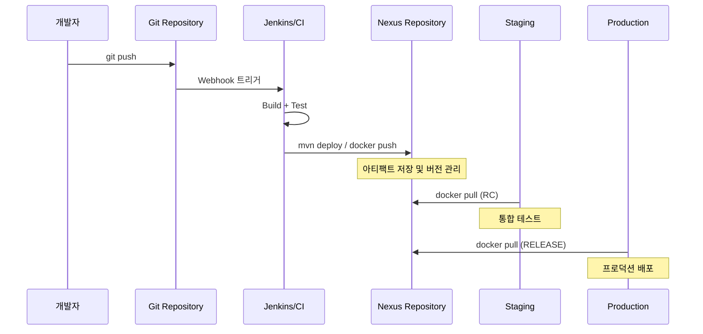
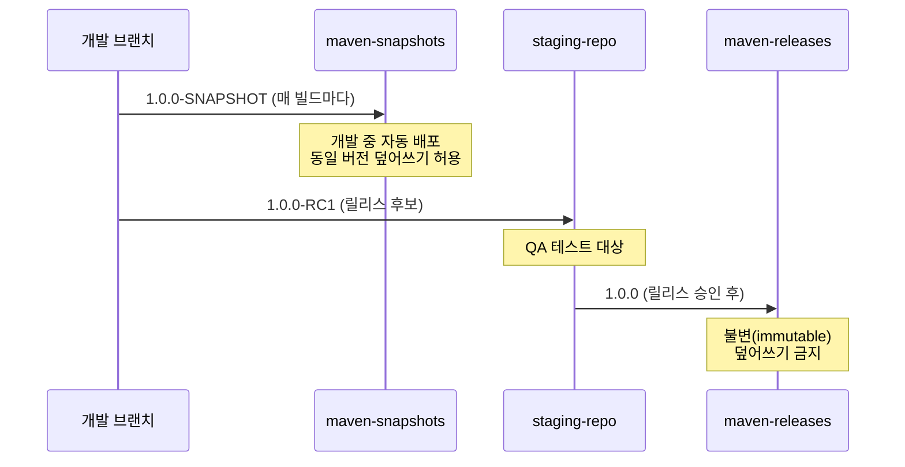

# Ch07: CI/CD 파이프라인 연동

## 핵심 질문
> Jenkins에서 빌드 아티팩트를 자동으로 올리려면?

## 목표
- CI/CD 파이프라인에서 아티팩트 저장소가 맡는 역할을 이해한다
- Jenkins, Gradle, npm, Docker 각각에서 Nexus로 아티팩트를 배포하는 방법을 익힌다
- SNAPSHOT에서 RELEASE까지 프로모션 흐름을 설계할 수 있다

---

## 1. CI/CD에서 아티팩트 저장소의 역할

빌드 서버가 소스 코드를 컴파일하면 결과물이 나온다. JAR 파일일 수도 있고, Docker 이미지일 수도 있으며, npm 패키지일 수도 있다. 이 결과물을 어디에 저장할까? 빌드 서버의 로컬 디스크에 두면 다른 환경에서 접근할 수 없고, 빌드 서버가 재시작되면 사라질 수도 있다. Git에 바이너리를 넣는 건 더 나쁜 선택이다.

아티팩트 저장소는 빌드 결과물의 "중앙 창고" 역할을 한다. 빌드 단계에서 아티팩트를 저장소에 올리고(publish), 배포 단계에서 저장소에서 꺼내(pull) 사용하는 구조다. 이렇게 분리하면 빌드와 배포가 독립적으로 동작하게 된다. 빌드가 10번 실패하더라도 마지막으로 성공한 아티팩트는 저장소에 안전하게 보관되어 있으니까.



이 흐름에서 Nexus는 빌드와 배포 사이의 계약(contract) 역할을 수행한다. CI가 "이 버전은 빌드와 테스트를 통과했다"는 보증을 붙여서 Nexus에 올리면, 배포 파이프라인은 그 보증을 믿고 아티팩트를 가져다 쓰는 셈이다.

아티팩트 저장소 없이 파이프라인을 구성하면 어떻게 될까? 배포 단계에서 다시 빌드해야 하는데, 같은 커밋으로 빌드해도 의존성 버전 변경, 타임스탬프 차이 등으로 결과물이 미묘하게 달라질 수 있다. "빌드 재현성(build reproducibility)"이 깨지는 것이다. 한 번 빌드한 바이너리를 저장소에 올리고 그것을 그대로 배포하면 이 문제가 원천 차단된다.

---

## 2. Jenkins + Nexus 연동

### 2.1 Nexus Platform Plugin

Jenkins에서 Nexus와 통신하는 방법은 크게 두 가지가 있다. 하나는 Maven/Gradle 빌드 도구의 deploy 명령을 그대로 쓰는 것이고, 다른 하나는 Jenkins 플러그인이 직접 Nexus API를 호출하는 방식이다.

Nexus Platform Plugin을 설치하면 Jenkins 시스템 설정에서 Nexus 서버 정보를 등록할 수 있다. `Manage Jenkins → System → Sonatype Nexus`에서 서버 URL과 인증 정보를 입력하면 된다. 이렇게 등록된 서버 정보는 여러 Job에서 공유할 수 있어서 관리가 편해진다.

그런데 실무에서는 이 플러그인보다 빌드 도구 자체의 deploy 기능을 더 많이 쓴다. 왜 그럴까? 빌드 도구의 deploy는 로컬에서도 동일하게 동작하므로 디버깅이 쉽고, Jenkins에 대한 의존성이 줄어들기 때문이다.

### 2.2 settings.xml 서버 인증

Maven이 Nexus에 접근하려면 인증 정보가 필요하다. `settings.xml`의 `<servers>` 섹션에 Nexus 서버의 username과 password를 등록하는 방식이 기본이다.

```xml
<settings>
  <servers>
    <server>
      <id>maven-releases</id>
      <username>deployer</username>
      <password>${env.NEXUS_PASSWORD}</password>
    </server>
    <server>
      <id>maven-snapshots</id>
      <username>deployer</username>
      <password>${env.NEXUS_PASSWORD}</password>
    </server>
  </servers>
</settings>
```

여기서 `<id>`가 중요한데, `pom.xml`의 `<distributionManagement>`에서 지정한 리포지토리 ID와 정확히 일치해야 한다. 자주 보는 실수가 바로 이 ID 불일치인데, 에러 메시지가 "401 Unauthorized"로 나오기 때문에 인증 정보 자체가 틀렸다고 착각하기 쉽다.

password를 평문으로 넣는 건 당연히 좋지 않으니 환경변수(`${env.NEXUS_PASSWORD}`)로 참조하거나, Maven master password로 암호화하는 게 맞다.

Maven master password 암호화 방식은 `~/.m2/settings-security.xml`에 master password를 저장하고, 각 서버 비밀번호를 `mvn --encrypt-password`로 암호화하는 것이다. 다만 CI 환경에서는 `settings-security.xml` 파일 자체를 관리하는 부담이 생기므로, 환경변수 주입이 더 실용적인 선택일 때가 많다.

### 2.3 Jenkinsfile에서 mvn deploy

Declarative Pipeline에서 Maven deploy를 실행하는 패턴을 보자.

```groovy
pipeline {
    agent any

    environment {
        NEXUS_PASSWORD = credentials('nexus-deployer-password')
    }

    stages {
        stage('Build') {
            steps {
                sh 'mvn clean package -DskipTests'
            }
        }
        stage('Test') {
            steps {
                sh 'mvn test'
            }
        }
        stage('Deploy to Nexus') {
            steps {
                sh """
                    mvn deploy \
                        -DskipTests \
                        -DaltDeploymentRepository=maven-snapshots::default::http://nexus:8081/repository/maven-snapshots/
                """
            }
        }
    }
}
```

`-DaltDeploymentRepository`를 쓰면 pom.xml의 `distributionManagement`를 오버라이드할 수 있다. CI 환경에서는 pom.xml에 하드코딩된 URL보다 파이프라인에서 주입하는 편이 유연하다.

멀티 모듈 프로젝트에서 주의할 점이 있다. `mvn deploy`는 기본적으로 모든 모듈을 빌드하고 배포하는데, 특정 모듈만 배포하고 싶으면 `-pl` 플래그를 사용한다. 또한 `mvn deploy`가 실패하면 일부 모듈만 배포된 불완전한 상태가 될 수 있으므로, Nexus Pro의 Staging 기능이나 `-DdeployAtEnd=true`(maven-deploy-plugin 2.8+)를 활용해서 전체 빌드 성공 후 한꺼번에 배포하는 방식을 고려하자.

### 2.4 nexusArtifactUploader 스텝

Maven이 아닌 빌드 도구를 쓰거나, 빌드 결과물을 직접 올려야 할 때는 `nexusArtifactUploader` 스텝이 유용하다.

```groovy
stage('Upload to Nexus') {
    steps {
        nexusArtifactUploader(
            nexusVersion: 'nexus3',
            protocol: 'http',
            nexusUrl: 'nexus:8081',
            groupId: 'com.example',
            version: '1.0.0-SNAPSHOT',
            repository: 'maven-snapshots',
            credentialsId: 'nexus-credentials',
            artifacts: [
                [artifactId: 'my-app',
                 classifier: '',
                 file: 'target/my-app-1.0.0-SNAPSHOT.jar',
                 type: 'jar']
            ]
        )
    }
}
```

`mvn deploy`와 `nexusArtifactUploader`의 결정적 차이는 무엇일까? `mvn deploy`는 Maven 빌드의 일부로 동작하면서 POM 메타데이터까지 함께 올리지만, `nexusArtifactUploader`는 파일 자체만 올린다. POM이 필요 없는 바이너리(예: Go 빌드 결과물)를 올릴 때는 후자가 더 적합하다.

### 2.5 Credentials 관리

Jenkins에서 Nexus 인증 정보를 안전하게 관리하는 방법은 여러 가지가 있다.

| 방식 | 보안 수준 | 용도 |
|------|----------|------|
| Jenkins Credentials Store | 중간 | 일반적인 경우 |
| HashiCorp Vault Plugin | 높음 | 엔터프라이즈 환경 |
| 환경변수 주입 | 낮음 | 개발/테스트 환경 |
| Kubernetes Secrets | 높음 | K8s 기반 Jenkins |

`credentials()` 헬퍼 함수를 쓰면 Jenkins가 비밀번호를 환경변수로 주입하면서 콘솔 출력에서는 마스킹 처리해준다. 다만 `sh 'echo $NEXUS_PASSWORD'` 같은 실수로 노출될 수 있으니, 파이프라인 리뷰 시 이런 부분을 확인해야 한다.

---

## 3. Gradle + Nexus

Gradle에서는 `maven-publish` 플러그인으로 Nexus에 배포한다.

```kotlin
// build.gradle.kts
plugins {
    `maven-publish`
}

publishing {
    publications {
        create<MavenPublication>("mavenJava") {
            from(components["java"])
            groupId = "com.example"
            artifactId = "my-library"
            version = "1.0.0-SNAPSHOT"
        }
    }
    repositories {
        maven {
            name = "nexus"
            val releasesUrl = uri("http://localhost:8081/repository/maven-releases/")
            val snapshotsUrl = uri("http://localhost:8081/repository/maven-snapshots/")
            url = if (version.toString().endsWith("SNAPSHOT")) snapshotsUrl else releasesUrl
            credentials {
                username = project.findProperty("nexusUsername") as String? ?: "admin"
                password = project.findProperty("nexusPassword") as String? ?: "admin123"
            }
            isAllowInsecureProtocol = true  // HTTP 사용 시 필요
        }
    }
}
```

`gradle publish` 명령으로 배포하면 된다. 주의할 점은 Gradle 7+부터 HTTP 리포지토리를 기본적으로 차단하므로 `isAllowInsecureProtocol = true` 설정이 없으면 "Using insecure protocols with repositories" 에러가 발생한다는 것이다.

인증 정보는 `gradle.properties`에 넣거나 CI 환경변수로 전달한다. `gradle.properties`는 Git에 커밋하지 않도록 `.gitignore`에 추가하는 것이 필수다. 실수로 커밋되면 Git 히스토리에 비밀번호가 남아서, 단순 삭제만으로는 제거되지 않고 `git filter-branch`나 BFG Repo-Cleaner로 히스토리를 다시 써야 하는 번거로운 상황이 발생한다.

```properties
# ~/.gradle/gradle.properties (로컬)
nexusUsername=admin
nexusPassword=admin123
```

```bash
# CI에서
gradle publish -PnexusUsername=$NEXUS_USER -PnexusPassword=$NEXUS_PASS
```

---

## 4. npm publish to Nexus

npm 패키지를 Nexus에 배포하려면 `.npmrc` 파일에 레지스트리와 인증 정보를 설정해야 한다.

```bash
# .npmrc
registry=http://localhost:8081/repository/npm-group/
//localhost:8081/repository/npm-hosted/:_auth=YWRtaW46YWRtaW4xMjM=
always-auth=true
```

`_auth` 값은 `username:password`를 Base64로 인코딩한 것이다. `echo -n 'admin:admin123' | base64`로 생성할 수 있다.

```json
{
  "name": "@example/my-package",
  "version": "1.0.0",
  "publishConfig": {
    "registry": "http://localhost:8081/repository/npm-hosted/"
  }
}
```

`package.json`의 `publishConfig`가 있으면 `npm publish` 시 해당 레지스트리로 배포된다. `.npmrc`의 registry와 `publishConfig`의 registry가 다를 수 있는데, 전자는 의존성을 가져올 때 쓰이고 후자는 배포할 때 쓰인다. 이 차이를 혼동하면 publish는 성공하는데 install이 실패하는 상황이 벌어질 수 있다.

CI 환경에서 `.npmrc`를 안전하게 생성하는 패턴은 이렇다.

```bash
# Jenkinsfile 내부
echo "//nexus:8081/repository/npm-hosted/:_auth=${NPM_AUTH_TOKEN}" > .npmrc
npm publish
rm .npmrc  # 클린업
```

### 4.1 Scoped 패키지와 Nexus

npm의 scoped 패키지(`@org/package`)를 Nexus에 배포할 때 주의할 점이 있다. Nexus npm hosted 리포지토리는 기본적으로 scoped 패키지를 지원하지만, group 리포지토리에서 scope별로 라우팅하려면 설정이 필요하다.

```bash
# scope별 레지스트리 분리
@company:registry=http://nexus:8081/repository/npm-hosted/
@vendor:registry=http://nexus:8081/repository/npm-proxy/
```

이렇게 하면 `@company` scope 패키지는 사내 hosted에서 관리하고, `@vendor` scope는 외부 proxy를 통해 가져온다. scope 라우팅 없이 group 리포지토리 하나로 통합하면 관리는 편하지만, 사내 패키지 이름이 외부 패키지와 충돌할 위험이 생긴다. 이를 **dependency confusion attack**이라 부르며, scope 분리가 이 공격의 1차 방어선 역할을 한다.

### 4.2 npm 배포 트러블슈팅

| 증상 | 원인 | 해결 |
|------|------|------|
| 403 Forbidden | hosted 리포에 deploy 권한 없음 | `nx-repository-view-npm-*-add` 권한 확인 |
| 400 Repository does not allow updating assets | 같은 버전 재배포 시도 | `Allow redeploy` 정책 또는 버전 bump |
| UNABLE_TO_VERIFY_LEAF_SIGNATURE | HTTPS 인증서 문제 | `npm set strict-ssl false` (개발용만) |
| E409 Conflict | 동시 publish 충돌 | CI에서 직렬화 또는 retry 로직 추가 |

---

## 5. Docker build + push to Nexus

Docker 이미지를 Nexus에 올리는 과정은 일반 Docker Registry와 동일하다. 다만 Nexus Docker hosted 리포지토리의 포트(예: 8082)를 태그에 포함해야 한다.

```groovy
pipeline {
    agent any

    environment {
        DOCKER_REGISTRY = 'localhost:8082'
        IMAGE_NAME = 'my-app'
        IMAGE_TAG = "${env.BUILD_NUMBER}"
    }

    stages {
        stage('Docker Build') {
            steps {
                sh "docker build -t ${DOCKER_REGISTRY}/${IMAGE_NAME}:${IMAGE_TAG} ."
            }
        }
        stage('Docker Push') {
            steps {
                withCredentials([usernamePassword(
                    credentialsId: 'nexus-docker',
                    usernameVariable: 'DOCKER_USER',
                    passwordVariable: 'DOCKER_PASS'
                )]) {
                    sh """
                        echo \$DOCKER_PASS | docker login ${DOCKER_REGISTRY} -u \$DOCKER_USER --password-stdin
                        docker push ${DOCKER_REGISTRY}/${IMAGE_NAME}:${IMAGE_TAG}
                        docker logout ${DOCKER_REGISTRY}
                    """
                }
            }
        }
    }
}
```

`--password-stdin`을 꼭 쓰자. `-p` 플래그로 비밀번호를 전달하면 프로세스 목록이나 쉘 히스토리에 비밀번호가 노출될 수 있다.

Docker 이미지 태그 전략도 CI에서 중요한 결정 포인트다. `BUILD_NUMBER`만 쓰면 어떤 커밋에서 빌드된 이미지인지 추적이 어렵다. `${GIT_COMMIT_SHORT}-${BUILD_NUMBER}` 형태(예: `a1b2c3d-42`)로 태그하면 이미지에서 소스 코드 커밋까지 역추적이 가능해진다. 추가로 `latest` 태그는 프로덕션에서 쓰면 안 된다. 어떤 버전이 배포되어 있는지 알 수 없게 되기 때문이다.

---

## 6. GitHub Actions / GitLab CI 연동

Jenkins가 아닌 다른 CI에서도 패턴은 비슷하다. 인증 정보를 시크릿으로 등록하고, 빌드 스텝에서 deploy 명령을 실행하면 된다.

**GitHub Actions 예시:**

```yaml
- name: Deploy to Nexus
  env:
    NEXUS_USERNAME: ${{ secrets.NEXUS_USERNAME }}
    NEXUS_PASSWORD: ${{ secrets.NEXUS_PASSWORD }}
  run: |
    mvn deploy -s settings.xml -DskipTests
```

**GitLab CI 예시:**

```yaml
deploy:
  stage: deploy
  script:
    - mvn deploy -s settings.xml -DskipTests
  variables:
    NEXUS_USERNAME: $NEXUS_USERNAME
    NEXUS_PASSWORD: $NEXUS_PASSWORD
  only:
    - main
```

어떤 CI 도구를 쓰든 핵심은 같다. (1) 인증 정보를 안전하게 주입하고, (2) 빌드 도구의 표준 배포 명령을 실행하며, (3) 배포 대상 리포지토리를 환경에 맞게 지정하는 것이다.

CI 도구별로 시크릿 관리 방식이 다르다는 점도 알아두면 유용하다. Jenkins는 Credentials Store에 저장하고 `credentials()` 헬퍼로 주입하며, GitHub Actions는 Repository Secrets을 `${{ secrets.NAME }}`으로 참조한다. GitLab CI는 `Settings → CI/CD → Variables`에서 등록하고 `$VARIABLE_NAME`으로 접근한다. 어느 방식이든 파이프라인 설정 파일(Jenkinsfile, `.github/workflows/*.yml`, `.gitlab-ci.yml`)에 평문 비밀번호가 들어가면 안 된다는 원칙은 동일하다.

---

## 7. 버전 전략: SNAPSHOT에서 RELEASE까지

실무에서 아티팩트가 프로덕션까지 가는 여정은 보통 이런 단계를 거친다.



**SNAPSHOT** 단계에서는 같은 버전 번호로 계속 덮어쓸 수 있다. `1.0.0-SNAPSHOT`을 하루에 10번 올려도 문제없다. Nexus는 타임스탬프를 붙여서 각 빌드를 구분하기 때문이다.

**RC(Release Candidate)** 단계에서는 QA 팀이 검증할 특정 버전을 지정한다. `1.0.0-RC1`, `1.0.0-RC2`처럼 번호를 매기는 게 일반적이며, 각 RC는 고유한 버전이므로 덮어쓰기가 발생하지 않는다.

**RELEASE** 단계에서는 프로덕션에 배포할 최종 버전이다. `maven-releases` 리포지토리는 "Deployment Policy: Disable Redeploy"가 기본 설정이라서, 한 번 올린 버전은 다시 올릴 수 없다. 이건 실수가 아니라 의도된 설계다. 프로덕션에 배포한 바이너리가 나중에 바뀌면 그건 추적 불가능한 재앙이니까.

### 프로모션 자동화

Jenkins에서 프로모션을 자동화하는 패턴은 크게 두 가지다.

**패턴 1: 리포지토리 간 복사 (Nexus Staging 활용)**
Nexus Pro에서 제공하는 Staging Repository를 쓰면, 아티팩트를 staging에 올린 후 검증이 끝나면 release로 "promote"(이동)할 수 있다. 동일 바이너리가 이동하므로 빌드 재현성이 보장되는 장점이 있다.

**패턴 2: 버전 변경 후 재빌드**
OSS 버전에서 가장 흔한 패턴으로, `-SNAPSHOT`을 떼고 다시 빌드해서 releases에 올리는 방식이다. 간단하지만 "SNAPSHOT에서 테스트한 바이너리와 RELEASE 바이너리가 정말 같은가?"라는 질문에 100% 확신할 수 없다는 약점이 있다.

실무에서는 Maven Release Plugin(`mvn release:prepare release:perform`)을 사용해서 SNAPSHOT→RELEASE 전환을 자동화하기도 한다. 이 플러그인은 버전에서 `-SNAPSHOT`을 제거하고, 태그를 만들고, 빌드 후 배포하고, 다시 다음 SNAPSHOT 버전으로 올리는 일련의 과정을 한 번에 처리한다. 다만 Git 커밋을 자동으로 생성하기 때문에 CI에서 사용할 때는 Git 인증 설정이 필요하고, 중간에 실패하면 롤백이 번거로운 편이다.

Gradle에서는 `nebula.release` 플러그인이나 `axion-release-plugin`이 유사한 역할을 수행한다. `gradle final` 명령으로 릴리스 빌드를 만들고 자동으로 Git 태그를 생성해주므로, 버전 관리를 수동으로 할 필요가 없어진다.

---

## 8. 자주 만나는 함정

### 8.1 "401 Unauthorized" 디버깅

이 에러를 보면 먼저 확인할 것들이다.

1. settings.xml의 `<server>` ID와 pom.xml의 repository ID가 일치하는지
2. 해당 사용자에게 해당 리포지토리의 쓰기 권한이 있는지 (Nexus → Security → Roles)
3. Realm이 활성화되어 있는지 (npm은 npm Bearer Token Realm 필요)
4. URL이 정확한지 (trailing slash 유무도 영향을 줌)

### 8.2 SNAPSHOT 타임스탬프 문제

Maven은 SNAPSHOT 버전을 배포할 때 `1.0.0-20260307.051234-1` 같은 타임스탬프 버전으로 변환한다. 로컬에서 `-SNAPSHOT`으로 의존성을 잡으면 Maven이 알아서 최신 타임스탬프 버전을 가져오지만, 간혹 캐시 때문에 이전 버전이 사용되는 경우가 있다. `mvn -U`(강제 업데이트) 플래그로 해결할 수 있다.

### 8.3 대용량 아티팩트 타임아웃

Docker 이미지나 대용량 JAR를 올릴 때 Nexus 앞단의 nginx나 로드밸런서의 타임아웃에 걸리는 경우가 있다. `client_max_body_size`와 `proxy_read_timeout` 설정을 충분히 높여야 한다.

### 8.4 Realm 활성화 누락

npm이나 Docker push가 계속 401을 반환하는데 인증 정보는 정확한 경우, Realm 설정을 확인하자. `Administration → Security → Realms`에서 해당 포맷의 Realm을 활성화해야 인증이 동작한다. npm은 **npm Bearer Token Realm**, Docker는 **Docker Bearer Token Realm**이 필요하다. Maven은 기본 Realm만으로 동작하므로 이 문제를 겪지 않는데, npm/Docker로 넘어오면서 같은 방식으로 접근하다가 막히는 경우가 잦다.

### 8.5 CI 빌드 속도 최적화

Nexus를 proxy 리포지토리로 활용하면 CI 빌드 속도를 개선할 수 있다. Maven Central이나 npmjs.org에서 의존성을 매번 다운로드하는 대신, Nexus proxy가 캐싱한 아티팩트를 로컬 네트워크에서 가져오는 것이다. Jenkins 에이전트와 Nexus가 같은 네트워크에 있으면 다운로드 시간이 수십 배 줄어든다. 특히 `node_modules`가 수백 MB에 달하는 프론트엔드 프로젝트에서 효과가 크다.

---

## 정리

| 빌드 도구 | 배포 명령 | 인증 방식 | 비고 |
|-----------|----------|----------|------|
| Maven | `mvn deploy` | settings.xml | POM 메타데이터 포함 |
| Gradle | `gradle publish` | gradle.properties | `isAllowInsecureProtocol` 주의 |
| npm | `npm publish` | .npmrc `_auth` | Bearer Token Realm 활성화 필요 |
| Docker | `docker push` | `docker login` | 별도 포트(8082) 사용 |

CI/CD에서 Nexus를 쓸 때 기억할 핵심은 세 가지다. 첫째, 인증 정보를 코드에 넣지 말고 CI의 시크릿 관리 기능을 활용한다. 둘째, 빌드 도구의 표준 deploy 명령을 쓰면 CI 도구에 대한 의존성을 줄일 수 있다. 셋째, SNAPSHOT→RC→RELEASE 프로모션 흐름을 정의해서 "어떤 버전이 프로덕션에 올라갔는가"를 항상 추적 가능하게 유지하자.

한 가지 더 — CI 파이프라인에서 Nexus에 배포할 때는 전용 서비스 계정을 만들어 사용하는 것을 권장한다. 개인 계정으로 배포하면 퇴사/이동 시 파이프라인이 깨지고, 감사 로그에서 "누가 배포했는지"가 개인이 아닌 CI 시스템으로 명확히 남아야 추적이 편하기 때문이다. Nexus의 Role 시스템에서 `nx-repository-view-*-*-add` 권한만 부여한 최소 권한 계정을 만들면 된다.

---

## 교차참조
- **01-jenkins Ch04**: Pipeline 구성과 Jenkinsfile 작성법
- **02-cicd-patterns Ch02**: Pipeline as Code 패턴
- **practice/sample-projects/maven-app/**: Maven + Nexus 연동 설정 예시
- **practice/sample-projects/npm-app/**: npm + Nexus 연동 설정 예시

---

## 체크포인트

- [ ] Jenkins Pipeline에서 `mvn deploy`로 Nexus에 아티팩트 배포
- [ ] Gradle `maven-publish` 플러그인으로 Nexus에 배포
- [ ] npm publish로 Nexus npm-hosted에 패키지 배포
- [ ] Docker 이미지를 Nexus Docker hosted에 push
- [ ] SNAPSHOT → RELEASE 프로모션 흐름 설명 가능
- [ ] CI 전용 서비스 계정으로 Nexus 배포 설정
- [ ] Docker 이미지 태그에 Git 커밋 해시 포함하여 추적성 확보
- [ ] Nexus proxy 리포지토리를 통한 의존성 캐싱으로 CI 빌드 속도 개선 확인

---

> **이전**: [Ch06 - 보안과 접근 제어](../06-security-access-control/LEARN.md)
> **다음**: [Ch08 - 모니터링과 메트릭](../08-monitoring-metrics/LEARN.md)
