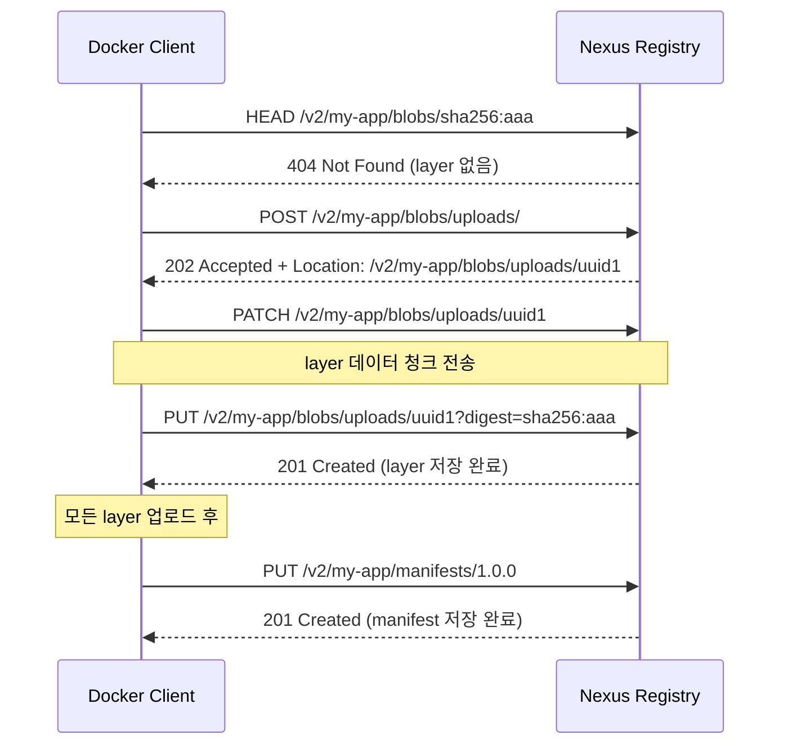
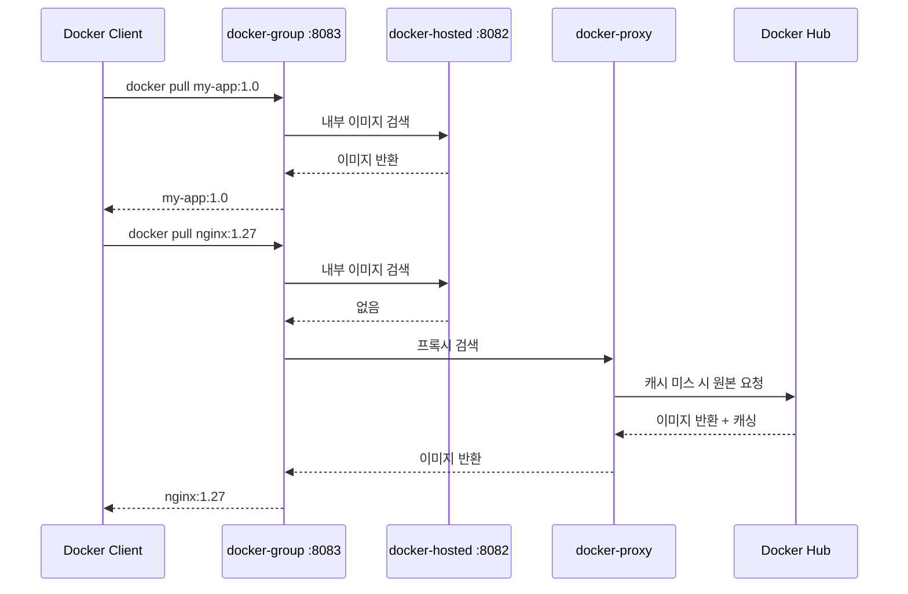
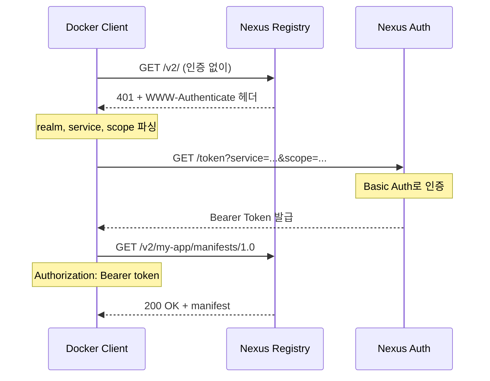

# Ch08: Docker Registry로서의 Nexus

## 핵심 질문
> 사내 Docker 이미지 저장소를 Nexus로 통합할 수 있는가?

## 목표
- Docker Registry의 동작 원리와 Distribution spec을 이해한다
- Nexus에서 docker-hosted, docker-proxy, docker-group 리포지토리를 구성할 수 있다
- Docker 클라이언트와 Nexus 간 인증, 푸시, 풀 흐름을 설정할 수 있다

---

## 1. Docker Registry 개요

Docker 이미지를 저장하고 배포하는 서비스를 Docker Registry라 부른다. Docker Hub가 가장 유명하지만, 사내 환경에서는 자체 레지스트리가 필요한 경우가 많다. 이미지에 민감한 코드가 포함되어 있거나, Docker Hub의 rate limit(익명 100회/6시간, 인증 200회/6시간)에 걸리기 시작하면 자체 레지스트리를 진지하게 고민하게 된다.

Docker Registry는 OCI Distribution Specification을 따른다. 이 스펙은 이미지를 manifest(메타데이터)와 layer(실제 파일시스템 데이터)로 나누어 저장하는 구조를 정의하며, pull/push 시 HTTP API를 통해 이 두 가지를 주고받는다. Nexus는 이 스펙을 구현한 레지스트리 중 하나로, Maven이나 npm과 같은 인프라에서 Docker 이미지까지 통합 관리할 수 있다는 게 가장 큰 장점이다.

그런데 왜 Docker Registry 전용 솔루션(Harbor 등)이 아닌 Nexus를 선택하는 걸까? 이미 Nexus로 Maven, npm 아티팩트를 관리하고 있다면 별도 인프라를 추가하지 않아도 되고, 사용자 관리와 접근 제어를 한 곳에서 할 수 있기 때문이다. 반면 Docker 이미지 관리에 특화된 기능(취약점 스캔, 이미지 서명 UI 등)이 필요하다면 Harbor가 더 적합할 수 있다.

---

## 2. Docker Registry HTTP API V2

Nexus가 Docker Registry로 동작하는 원리를 이해하려면 Docker Registry HTTP API V2를 알아야 한다. 이 API가 Docker 클라이언트와 레지스트리 사이의 통신 프로토콜이기 때문이다.

### 핵심 엔드포인트

```
GET  /v2/                                    # API 버전 확인 (ping)
GET  /v2/<name>/manifests/<reference>        # manifest 조회 (pull 1단계)
PUT  /v2/<name>/manifests/<reference>        # manifest 업로드 (push 마지막 단계)
GET  /v2/<name>/blobs/<digest>               # layer 다운로드 (pull 2단계)
HEAD /v2/<name>/blobs/<digest>               # layer 존재 여부 확인
POST /v2/<name>/blobs/uploads/               # layer 업로드 시작
PATCH /v2/<name>/blobs/uploads/<uuid>        # layer 데이터 전송
PUT  /v2/<name>/blobs/uploads/<uuid>?digest= # layer 업로드 완료
```

### push 흐름 상세

`docker push`가 실제로 어떤 HTTP 요청을 보내는지 이해하면, 문제 발생 시 디버깅이 훨씬 쉬워진다.



push는 "layer 먼저, manifest 나중" 순서다. layer가 모두 업로드된 후에 manifest를 올리는데, manifest가 layer들의 digest를 참조하고 있기 때문이다. 이미 존재하는 layer는 HEAD 요청으로 확인하고 건너뛰므로, 같은 base image를 공유하는 이미지들은 변경된 layer만 전송해서 push 시간이 단축된다.

### pull 흐름

pull은 push의 역순이다. manifest를 먼저 받아서 필요한 layer 목록을 파악하고, 각 layer를 병렬로 다운로드한다.

```
1. GET /v2/my-app/manifests/1.0.0  → manifest 수신 (layer digest 목록 포함)
2. GET /v2/my-app/blobs/sha256:aaa → layer 1 다운로드 (병렬)
3. GET /v2/my-app/blobs/sha256:bbb → layer 2 다운로드 (병렬)
4. GET /v2/my-app/blobs/sha256:ccc → layer 3 다운로드 (병렬)
```

이 구조를 아는 게 왜 중요한가? nginx 프록시 설정에서 `proxy_read_timeout`이 짧으면 대형 layer 다운로드 중에 타임아웃이 발생하고, `client_max_body_size`가 작으면 layer 업로드가 실패한다. 어떤 단계에서 에러가 나는지 알아야 올바른 설정을 조정할 수 있기 때문이다.

---

## 3. Nexus Docker 리포지토리 구성

Nexus에서 Docker를 지원하려면 세 종류의 리포지토리를 이해해야 한다.

### 3.1 docker-hosted (내부 이미지 저장)

팀에서 빌드한 이미지를 저장하는 리포지토리다. `docker push`의 대상이 되며, 보통 포트 8082를 할당한다.

설정 시 중요한 항목은 다음과 같다.

- **HTTP connector port**: Docker 클라이언트가 접근할 포트 (예: 8082)
- **Enable Docker V1 API**: V2만 쓸 거라면 꺼도 무방하다. 대부분의 최신 Docker 클라이언트는 V2를 사용하니까
- **Blob store**: 이미지 데이터가 저장될 Blob Store. Docker 이미지는 용량이 크므로 전용 Blob Store를 분리하는 게 좋다

### 3.2 docker-proxy (Docker Hub 캐싱)

Docker Hub에서 가져온 이미지를 캐싱하는 리포지토리다. `nginx:1.27-alpine`을 처음 pull하면 Docker Hub에서 가져와서 Nexus에 캐싱하고, 두 번째부터는 Nexus에서 바로 제공한다.

Remote URL은 `https://registry-1.docker.io`로 설정한다. Docker Hub 인증 정보(Docker Hub 계정)를 넣으면 rate limit이 인증 기준으로 적용되어 좀 더 여유가 생기는데, 팀원이 10명이어도 Nexus가 대신 가져오므로 실질적으로 1명분의 rate limit만 소모하게 된다.

### 3.3 docker-group (통합 엔드포인트)

hosted와 proxy를 묶어서 하나의 엔드포인트로 제공하는 리포지토리다. Docker 클라이언트는 group 리포지토리 하나만 바라보면 내부 이미지든 Docker Hub 이미지든 구분 없이 pull할 수 있다. 보통 포트 8083을 할당한다.



group 리포지토리의 멤버 순서가 중요하다. hosted를 먼저, proxy를 나중에 배치해야 내부 이미지가 우선 검색되는데, 만약 Docker Hub에 같은 이름의 이미지가 있으면 의도치 않게 외부 이미지가 반환될 수 있기 때문이다.

---

## 4. 포트 분리가 필요한 이유

Maven이나 npm은 URL 경로로 리포지토리를 구분한다. `/repository/maven-releases/`와 `/repository/maven-snapshots/`처럼. 그런데 Docker는 왜 리포지토리마다 별도 포트가 필요할까?

Docker 클라이언트는 레지스트리를 "호스트:포트" 단위로 인식한다. `docker pull localhost:8082/my-app:1.0`에서 `localhost:8082`가 레지스트리 주소이고, `my-app:1.0`이 이미지 이름이다. Docker 클라이언트가 요청을 보낼 때 URL 경로에 리포지토리 이름을 포함하지 않으므로, Nexus 입장에서는 포트로 어떤 리포지토리에 접근하려는지 구분할 수밖에 없다.

좀 더 기술적으로 설명하면, Docker 클라이언트가 `GET /v2/my-app/manifests/1.0`을 보낼 때 HTTP Host 헤더에는 `localhost:8082`만 들어간다. Nexus는 이 Host 헤더(정확히는 포트 번호)를 보고 "8082 포트에 바인딩된 docker-hosted 리포지토리구나"라고 판단한다. 만약 hosted와 group이 같은 포트를 쓴다면, Nexus가 push 요청을 hosted로 보내야 할지 group으로 보내야 할지 구분할 수 없게 된다.

정리하면 이런 포트 구성이 전형적이다.

| 리포지토리 | 포트 | 용도 |
|-----------|------|------|
| docker-hosted | 8082 | `docker push` 대상 |
| docker-group | 8083 | `docker pull` 통합 엔드포인트 |
| docker-proxy | (포트 없음) | group에 포함되므로 직접 노출 불필요 |

docker-proxy에 별도 포트를 할당하지 않는 이유는, pull은 group을 통해 하면 되고 push는 proxy에 할 수 없기 때문이다. 포트를 아끼는 셈인데, 디버깅 목적으로 proxy에도 포트를 열어두면 캐싱이 제대로 되는지 확인할 때 유용하긴 하다.

---

## 5. Docker 클라이언트 설정

### 5.1 daemon.json 설정

프로덕션에서는 TLS를 쓰는 게 당연하지만, 로컬 개발 환경에서는 HTTP로 통신하는 경우가 많다. Docker는 기본적으로 HTTP 레지스트리를 거부하므로, `daemon.json`에 예외를 등록해야 한다.

```json
{
  "insecure-registries": [
    "localhost:8082",
    "localhost:8083",
    "nexus.company.internal:8082",
    "nexus.company.internal:8083"
  ],
  "registry-mirrors": [
    "http://nexus.company.internal:8083"
  ],
  "log-driver": "json-file",
  "log-opts": {
    "max-size": "10m",
    "max-file": "3"
  }
}
```

파일 위치:
- Linux: `/etc/docker/daemon.json`
- macOS (Docker Desktop): Settings → Docker Engine
- Windows (Docker Desktop): Settings → Docker Engine

`registry-mirrors`를 설정하면 `docker pull nginx:latest` 같은 명시적 레지스트리 없는 pull 요청이 Docker Hub 대신 Nexus docker-group을 먼저 거치게 된다. 개발자가 별도 설정 없이도 프록시 캐시의 혜택을 받을 수 있는 방법이다.

설정 변경 후 Docker 데몬을 재시작해야 적용된다.

```bash
# Linux
sudo systemctl restart docker

# macOS/Windows: Docker Desktop 재시작

# 설정 확인
docker info | grep -A 5 "Insecure Registries"
docker info | grep -A 2 "Registry Mirrors"
```

### 5.2 로그인, 태깅, push/pull 완전 예제

전체 흐름을 처음부터 끝까지 따라해 보자.

```bash
# 1. hosted에 로그인 (push용)
docker login localhost:8082
# Username: admin
# Password: admin123

# 2. 샘플 이미지 빌드 (또는 기존 이미지 사용)
cat > Dockerfile <<'EOF'
FROM alpine:3.19
RUN apk add --no-cache curl
CMD ["echo", "Hello from Nexus Registry"]
EOF
docker build -t my-app:latest .

# 3. Nexus hosted 리포지토리용으로 태깅
#    형식: <registry>/<image-name>:<tag>
docker tag my-app:latest localhost:8082/my-app:1.0.0
docker tag my-app:latest localhost:8082/my-app:latest

# 4. push
docker push localhost:8082/my-app:1.0.0
docker push localhost:8082/my-app:latest

# 5. group에서 pull (hosted + proxy 통합)
#    hosted 이미지
docker pull localhost:8083/my-app:1.0.0

#    Docker Hub 이미지 (proxy 경유)
docker pull localhost:8083/library/nginx:1.27-alpine

# 6. 이미지 목록 확인 (Registry HTTP API 직접 호출)
curl -s -u admin:admin123 http://localhost:8082/v2/_catalog
curl -s -u admin:admin123 http://localhost:8082/v2/my-app/tags/list
```

Docker Hub의 공식 이미지를 group을 통해 pull할 때는 `library/` 접두사가 필요한 경우가 있다. `nginx`는 실제로 `library/nginx`인데, Docker Hub에서는 `library/`를 생략할 수 있지만 Nexus proxy를 경유할 때는 명시해야 하는 경우가 있으니 주의하자.

### 5.3 다이제스트 기반 pull

태그는 변경 가능(mutable)하다. `latest`가 어제와 오늘 다른 이미지를 가리킬 수 있다는 뜻이다. 프로덕션 배포에서 정확한 이미지를 보장하려면 다이제스트를 사용한다.

```bash
# push 후 다이제스트 확인
docker inspect --format='{{index .RepoDigests 0}}' localhost:8082/my-app:1.0.0
# 출력: localhost:8082/my-app@sha256:abc123...

# 다이제스트로 pull — 항상 동일한 이미지를 보장
docker pull localhost:8083/my-app@sha256:abc123...
```

---

## 6. nginx subdomain 라우팅

포트 번호를 외우는 건 불편하고, 방화벽에서 여러 포트를 열어야 하는 것도 관리 부담이다. nginx로 서브도메인별 라우팅을 설정하면 이 문제를 해결할 수 있다.

```nginx
# docker-hosted.company.com → Nexus 8082
server {
    listen 443 ssl;
    server_name docker-hosted.company.com;

    ssl_certificate     /etc/ssl/certs/company.crt;
    ssl_certificate_key /etc/ssl/private/company.key;

    # Docker 이미지는 수 GB가 될 수 있다
    client_max_body_size 2G;
    chunked_transfer_encoding on;

    location / {
        proxy_pass http://nexus:8082;
        proxy_set_header Host $host;
        proxy_set_header X-Real-IP $remote_addr;
        proxy_set_header X-Forwarded-For $proxy_add_x_forwarded_for;
        proxy_set_header X-Forwarded-Proto $scheme;
        proxy_read_timeout 600;
        proxy_send_timeout 600;

        # 버퍼링 비활성화 — 대형 layer를 스트리밍 전달
        proxy_buffering off;
        proxy_request_buffering off;
    }
}

# docker-group.company.com → Nexus 8083
server {
    listen 443 ssl;
    server_name docker-group.company.com;

    ssl_certificate     /etc/ssl/certs/company.crt;
    ssl_certificate_key /etc/ssl/private/company.key;

    client_max_body_size 0;  # pull은 크기 제한 불필요
    chunked_transfer_encoding on;

    location / {
        proxy_pass http://nexus:8083;
        proxy_set_header Host $host;
        proxy_set_header X-Real-IP $remote_addr;
        proxy_set_header X-Forwarded-For $proxy_add_x_forwarded_for;
        proxy_set_header X-Forwarded-Proto $scheme;
        proxy_read_timeout 600;
        proxy_send_timeout 600;
        proxy_buffering off;
    }
}
```

이렇게 설정하면 Docker 클라이언트는 표준 443 포트만 사용한다.

```bash
docker login docker-hosted.company.com
docker push docker-hosted.company.com/my-app:1.0.0
docker pull docker-group.company.com/my-app:1.0.0
```

`proxy_buffering off`와 `proxy_request_buffering off`가 핵심이다. nginx가 layer 데이터를 버퍼에 모았다가 전달하면 메모리를 과하게 사용하게 되는데, 스트리밍 모드로 바로 전달하면 nginx의 메모리 부담이 줄어든다.

`client_max_body_size 2G`는 과하게 보일 수 있지만, ML 모델이 포함된 Docker 이미지는 수 GB에 달하기도 하므로 넉넉하게 잡아두는 편이 안전하다. 부족하면 `413 Request Entity Too Large` 에러가 나는데, 이 에러가 Docker 클라이언트 쪽에서는 모호한 메시지로 표시되어 디버깅이 어렵다.

---

## 7. Docker Token Authentication

Docker 클라이언트가 레지스트리에 인증하는 과정은 생각보다 복잡하다. Bearer Token 방식을 사용하는데, 흐름은 이렇다.



Nexus에서 Docker Bearer Token Realm을 활성화해야 이 흐름이 동작한다. `Administration → Security → Realms`에서 "Docker Bearer Token Realm"을 Active 목록으로 옮기면 된다. 이걸 빼먹으면 `docker login`은 되는데 `docker push`에서 인증 에러가 나는 혼란스러운 상황이 발생한다.

`WWW-Authenticate` 헤더의 내용을 살펴보면 디버깅에 도움이 된다.

```bash
# 인증 없이 요청해서 WWW-Authenticate 헤더 확인
curl -v http://localhost:8082/v2/ 2>&1 | grep -i www-authenticate
# Bearer realm="http://localhost:8082/v2/token",service="localhost:8082"
```

이 응답에서 `realm`이 토큰 엔드포인트 주소고, `service`가 레지스트리 식별자다. Docker 클라이언트는 이 정보를 파싱해서 토큰을 요청한다.

---

## 8. Image Layer 캐싱과 스토리지 효율

Docker 이미지는 레이어 단위로 저장된다. `nginx:1.27-alpine` 이미지가 3개의 레이어로 구성되어 있다면, Nexus에도 3개의 blob이 저장되는 식이다. 이 레이어는 content-addressable하므로, 동일한 레이어를 여러 이미지가 공유하면 하나만 저장된다.

예를 들어 base 이미지가 같은 두 개의 서비스 이미지가 있다면:

```
service-a:1.0  →  [base-layer] + [service-a-layer]
service-b:1.0  →  [base-layer] + [service-b-layer]
```

`base-layer`는 한 번만 저장되므로 스토리지가 절약된다. Nexus의 docker-proxy가 Docker Hub 이미지를 캐싱할 때도 이 원리가 적용되어, 팀에서 사용하는 다양한 이미지들이 공통 베이스 레이어를 공유하면 캐시 효율이 높아진다.

다만, 이미지를 삭제할 때는 주의가 필요하다. 특정 이미지의 태그를 삭제해도 다른 이미지가 같은 레이어를 참조하고 있으면 실제 디스크 공간은 회수되지 않는다. Nexus의 Cleanup Policy와 Compact Blob Store 태스크가 이 참조 관계를 추적해서 더 이상 참조되지 않는 레이어만 삭제하는데, 이 내용은 Ch09에서 자세히 다룬다.

---

## 9. Docker Content Trust와 이미지 무결성

Docker Content Trust(DCT)는 이미지의 무결성과 출처를 검증하는 기능이다. `DOCKER_CONTENT_TRUST=1` 환경변수를 설정하면 Docker 클라이언트가 서명되지 않은 이미지를 거부한다.

```bash
export DOCKER_CONTENT_TRUST=1
export DOCKER_CONTENT_TRUST_SERVER=https://notary.company.com

docker push docker-hosted.company.com/my-app:1.0.0
# → Notary 서버에 서명 등록
```

Nexus OSS 자체는 Notary 서버를 내장하고 있지 않다. DCT를 쓰려면 별도의 Notary 서버를 운영하거나, Nexus Pro의 기능을 활용해야 한다.

실무에서는 DCT 대신 다음 세 가지 대안이 흔히 쓰인다.

**다이제스트 기반 배포**: CI 파이프라인에서 이미지 다이제스트(SHA256)를 기록하고 배포 시 다이제스트로 pull하는 방식이다. `docker pull my-app@sha256:abc123...`처럼 쓰면 태그가 변조되어도 영향을 받지 않는다. 인프라 추가 없이 비슷한 효과를 낸다.

**Cosign (Sigstore)**: CNCF에서 관리하는 컨테이너 서명 도구로, Notary보다 설정이 간단하다. 키리스(keyless) 서명도 지원해서 OIDC 토큰으로 서명할 수 있다. Nexus에 서명 메타데이터를 별도 태그로 저장하는 방식이다.

**CI 파이프라인 통제**: 이미지를 빌드하고 push하는 행위 자체를 CI/CD 파이프라인에만 허용하고, 개발자 로컬에서의 push를 차단하면 출처를 간접적으로 보장할 수 있다. Ch06의 접근 제어로 ci-deployer 계정만 push 권한을 가지게 하는 패턴이다.

---

## 10. 멀티 아키텍처 이미지 관리

ARM 기반 Mac(M1/M2/M3)과 x86 서버가 혼재하는 환경에서는 멀티 아키텍처 이미지가 필요하다. Docker buildx를 사용하면 하나의 태그로 여러 플랫폼을 지원하는 이미지를 빌드할 수 있다.

```bash
# buildx 빌더 생성
docker buildx create --name multiarch --use

# 멀티 아키텍처 빌드 + push
docker buildx build \
  --platform linux/amd64,linux/arm64 \
  --tag localhost:8082/my-app:1.0.0 \
  --push .
```

이렇게 빌드하면 Nexus에는 manifest list(fat manifest)가 저장되고, 각 플랫폼별 manifest와 layer가 별도로 저장된다. `docker pull`할 때 클라이언트가 자기 플랫폼에 맞는 manifest를 자동 선택한다.

Nexus에서 멀티 아키텍처 이미지를 관리할 때 주의할 점은 Cleanup이다. manifest list를 삭제하면 하위 platform manifest가 orphan이 될 수 있고, 이것들이 정리될 때까지 Cleanup을 여러 번 실행해야 할 수 있다. docker-proxy로 캐싱된 멀티 아키텍처 이미지는 pull한 플랫폼의 layer만 캐싱되므로, 다른 플랫폼 개발자가 같은 이미지를 pull할 때 다시 원본 레지스트리에 요청이 나갈 수 있다.

---

## 11. 실무 구성 팁

### 11.1 Blob Store 분리

Docker 이미지는 Maven JAR보다 훨씬 크다. 같은 Blob Store에 넣으면 Docker 이미지가 디스크를 빠르게 잠식한다. Docker 전용 Blob Store를 만들어서 디스크 사용량을 독립적으로 모니터링하고, 필요하면 별도 디스크에 마운트하는 게 좋은 전략이다.

### 11.2 Docker Hub 미러링 범위

docker-proxy가 Docker Hub 전체를 캐싱하면 디스크가 부족해질 수 있다. Cleanup Policy에서 "Last Downloaded 14일"을 걸어서 최근에 사용된 이미지만 캐싱 상태로 유지하자. 한 달 이상 아무도 pull하지 않은 이미지는 삭제해도 다음에 필요할 때 다시 가져오면 그만이다.

### 11.3 Anonymous pull 설정

Nexus에서 Docker 이미지를 pull할 때 인증 없이 접근하게 하려면 두 가지 설정이 필요하다.

1. `Administration → Security → Realms`에서 "Docker Bearer Token Realm" 활성화
2. `Administration → Security → Anonymous Access`에서 익명 접근 허용
3. 익명 사용자에게 해당 리포지토리의 read 권한 부여

push는 반드시 인증이 필요하지만, pull은 사내 네트워크에서 익명으로 허용하면 개발자 경험이 좋아진다. `docker login` 없이도 바로 이미지를 가져올 수 있으니까.

---

## 12. 자주 만나는 문제

### "unauthorized: access to the requested resource is not authorized"

가장 흔한 에러다. 체크리스트로 확인하자.

1. Docker Bearer Token Realm이 활성화되어 있는가?
2. `docker login`을 hosted 포트(8082)로 했는가, group 포트(8083)로 했는가?
3. 해당 사용자에게 리포지토리 권한이 있는가?
4. push는 hosted에만, pull은 group(또는 hosted)에서만 가능하다는 점을 알고 있는가?

### "error parsing HTTP 404 response body"

nginx proxy가 Nexus 앞에 있을 때, Docker API 경로(`/v2/`)를 제대로 프록시하지 못하면 발생한다. nginx 설정에서 `proxy_set_header Host $host`가 빠져 있으면 Nexus가 요청을 올바른 리포지토리로 라우팅하지 못해서 404를 반환하게 된다.

### "manifest unknown" on pull

group 리포지토리에서 pull할 때 이 에러가 나면, 멤버 리포지토리 순서를 확인하자. hosted가 proxy보다 먼저 와야 하고, proxy의 Remote URL이 올바른지도 확인해야 한다. Docker Hub의 Remote URL은 `https://registry-1.docker.io`이지 `https://hub.docker.com`이 아니라는 점도 자주 틀리는 부분이다.

### "denied: requested access to the resource is denied"

push할 때 이 에러가 나면, group 포트로 push를 시도하고 있는 건 아닌지 확인하자. push는 반드시 hosted 포트(8082)로 해야 한다. group은 읽기 전용이라 push를 받지 않는다.

---

## 정리

| 리포지토리 | 용도 | Docker 명령 | 포트 예시 |
|-----------|------|------------|----------|
| docker-hosted | 내부 이미지 저장 | `docker push` | 8082 |
| docker-proxy | Docker Hub 캐싱 | (group 경유) | - |
| docker-group | hosted + proxy 통합 | `docker pull` | 8083 |

Nexus를 Docker Registry로 쓸 때 핵심 포인트는 네 가지다. 첫째, 포트 분리가 필수라는 것 — Docker 클라이언트의 레지스트리 인식 방식(Host 헤더 기반) 때문에 피할 수 없다. 둘째, Docker Bearer Token Realm 활성화를 잊지 말 것 — 빼먹으면 인증 에러의 늪에 빠진다. 셋째, nginx 서브도메인 라우팅으로 포트 문제를 우회하면 운영이 훨씬 편해진다. 넷째, Docker Registry HTTP API V2의 push/pull 흐름을 알면 문제 발생 시 어떤 단계에서 실패하는지 빠르게 진단할 수 있다.

---

## 교차참조
- **01-docker Ch05**: Docker 이미지 라이프사이클, 레이어 구조
- **Ch09 (Cleanup)**: Docker 이미지 정리 전략
- **practice/sample-projects/docker-app/**: 샘플 Dockerfile

---

## 체크포인트

- [ ] Nexus에서 docker-hosted, docker-proxy, docker-group 리포지토리 생성
- [ ] Docker 클라이언트에서 insecure-registries 설정 후 로그인
- [ ] 샘플 이미지를 docker-hosted에 push
- [ ] docker-group을 통해 내부 이미지와 Docker Hub 이미지 모두 pull
- [ ] 포트 분리가 필요한 기술적 이유 설명 가능
- [ ] Docker Registry HTTP API V2의 push/pull 흐름 이해
