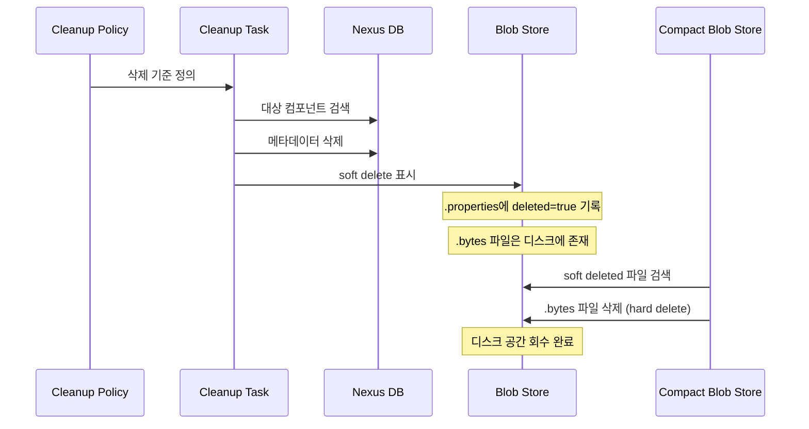
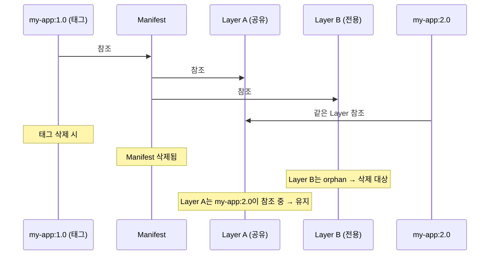
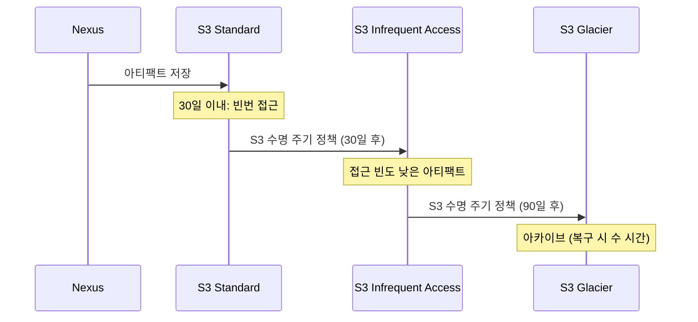

# Ch09: 정리 정책과 스토리지 관리

## 핵심 질문
> 디스크 가득 차기 전에 자동 정리하려면?

## 목표
- Nexus의 Blob Store 구조와 스토리지 동작 원리를 이해한다
- Cleanup Policy를 설계하고 리포지토리에 적용할 수 있다
- soft delete와 hard delete의 차이를 알고, 디스크 회수까지의 전체 과정을 파악한다

---

## 1. 스토리지 증가 패턴

CI/CD 파이프라인이 돌아가면 아티팩트는 끊임없이 쌓인다. 매 커밋마다 SNAPSHOT을 배포하는 Maven 프로젝트, 매 빌드마다 새 태그를 찍는 Docker 이미지, 매 PR마다 npm 패키지를 퍼블리시하는 프론트엔드 프로젝트. 아무 조치 없이 방치하면 어떻게 될까?

경험상 디스크 사용량은 초기에 완만하게 증가하다가, CI 파이프라인이 본격적으로 가동되면 급격히 올라간다. 특히 Docker 이미지는 레이어 하나가 수십~수백 MB이므로, 하루에 10번 빌드하면 일주일 만에 수십 GB가 쌓이는 건 흔한 일이다. 디스크 90%를 넘기면 Nexus가 느려지기 시작하고, 100%에 도달하면 write 실패로 CI 파이프라인 전체가 멈춘다.

이런 상황을 예방하는 것이 Cleanup Policy와 스토리지 관리 전략의 목적이며, "디스크가 가득 찬 다음에 대응"하는 것과 "미리 정책을 설정해두는 것"은 야근 여부를 결정하는 차이를 만든다.

---

## 2. Blob Store 구조

### 2.1 Blob Store란?

Nexus의 모든 아티팩트 바이너리는 Blob Store에 저장된다. 리포지토리는 메타데이터(좌표, 버전, 체크섬)를 관리하고, 실제 파일 데이터는 Blob Store가 보관하는 구조다. 이 분리 덕분에 여러 리포지토리가 하나의 Blob Store를 공유하거나, 리포지토리별로 다른 Blob Store를 지정할 수 있다.

### 2.2 File Blob Store의 내부 디렉토리 구조

File Blob Store의 실제 디렉토리를 들여다보면 구조가 독특하다.

```
${NEXUS_DATA}/blobs/default/
├── content/
│   ├── vol-01/
│   │   ├── chap-01/
│   │   │   ├── xxxxxxxx-xxxx-xxxx-xxxx-xxxxxxxxxxxx.properties
│   │   │   └── xxxxxxxx-xxxx-xxxx-xxxx-xxxxxxxxxxxx.bytes
│   │   ├── chap-02/
│   │   │   └── ...
│   ├── vol-02/
│   │   └── ...
├── metadata.properties
└── deletions-index
```

`.bytes` 파일이 실제 아티팩트 데이터이고, `.properties` 파일이 메타데이터(크기, SHA1, 생성 시간, deleted 여부 등)다. `vol-NN/chap-NN` 구조는 하나의 디렉토리에 너무 많은 파일이 몰리는 것을 방지하기 위한 샤딩이다.

soft delete가 발생하면 `.properties` 파일에 `deleted=true`와 `deletedDateTime` 속성이 추가된다. 이 상태에서 `.bytes` 파일은 아직 디스크에 남아 있으니, 디스크 사용량은 줄지 않는다. Compact Blob Store Task가 이 `.properties` 파일을 스캔해서 `deleted=true`인 항목의 `.bytes`를 실제로 삭제하는 것이 hard delete의 정체다.

이 구조를 직접 조작하면 안 된다. `rm`으로 `.bytes`를 지우면 DB와의 정합성이 깨져서 Nexus가 오류를 뿜게 된다. 반드시 Nexus의 API와 Task를 통해 관리해야 한다.

### 2.3 File Blob Store vs S3 Blob Store

| 항목 | File Blob Store | S3 Blob Store |
|------|----------------|---------------|
| 저장 위치 | 로컬 파일시스템 | AWS S3 / S3 호환 스토리지 |
| 성능 | 디스크 I/O에 의존 (SSD 권장) | 네트워크 지연 있음 (50-200ms) |
| 확장성 | 디스크 크기 한계 | 사실상 무제한 |
| 비용 | 디스크 구매/관리 비용 | 사용량 기반 과금 (저장 + 요청 + 전송) |
| 적합 환경 | 소규모, 온프레미스 | 대규모, 클라우드 |
| 백업 | 파일시스템 스냅샷 | S3 버전닝/교차 리전 복제 |

기본으로 생성되는 `default` Blob Store는 File 타입이며, `${NEXUS_DATA}/blobs/default` 디렉토리에 파일이 저장된다. Docker 전용, Maven 전용처럼 용도별로 Blob Store를 분리하면 스토리지 모니터링과 정리가 수월해진다.

한 가지 주의할 점은, Blob Store를 한 번 생성하면 타입을 변경할 수 없다는 것이다. File에서 S3로 전환하려면 새 S3 Blob Store를 만들고, 리포지토리의 Blob Store를 변경한 뒤, 기존 데이터를 마이그레이션해야 한다. 이 과정이 번거로우므로 처음 설계할 때 향후 스토리지 전략을 고려하는 게 좋다.

### 2.4 Blob Store 분리 전략

```
default          → maven-releases, maven-snapshots, npm 등
docker-blobs     → docker-hosted, docker-proxy, docker-group
archive-blobs    → 장기 보존 RELEASE (별도 대용량 디스크 마운트)
```

이렇게 분리하면 Docker 이미지가 Maven 아티팩트의 디스크를 잠식하는 일을 막을 수 있고, Docker 전용 Blob Store만 별도 대용량 디스크에 마운트하는 것도 가능해진다. 모니터링 알람도 Blob Store 단위로 걸 수 있어서, "Docker 스토리지 80% 도달" 같은 세분화된 알림이 가능하다.

---

## 3. Cleanup Policy

### 3.1 정책 기준

Cleanup Policy는 "어떤 아티팩트를 삭제 대상으로 표시할 것인가"를 정의한다. 사용 가능한 기준은 다음과 같다.

| 기준 | 설명 | 적합 대상 |
|------|------|----------|
| Component Age | 배포된 지 N일 이상 | SNAPSHOT 정리 |
| Last Downloaded | 마지막 다운로드 후 N일 이상 | 미사용 아티팩트 정리 |
| Release Type | Pre-release(SNAPSHOT) / Release | SNAPSHOT만 선택 정리 |
| Asset Name Matcher | 이름 정규식 매칭 | 특정 패턴 정리 |

이 기준들은 AND 조합으로 동작한다. "Component Age > 30일 AND Release Type = Pre-release"로 설정하면 30일 넘은 SNAPSHOT만 대상이 되고, RELEASE는 건드리지 않는다.

### 3.2 정책 생성과 적용 — 단계별 가이드

**Step 1: 정책 생성**

`Administration → Repository → Cleanup Policies → Create Cleanup Policy`에서 정책을 만든다.

```
이름: cleanup-snapshots-30d
포맷: maven2
Release Type: SNAPSHOT/Pre-release
Component Age: 30 days
```

이름은 한 번 정하면 변경할 수 없으니, 포맷-대상-기준을 포함하는 명명 규칙을 정하는 게 좋다. `cleanup-{format}-{target}-{period}` 패턴이 실무에서 자주 쓰인다.

**Step 2: 리포지토리에 연결**

정책을 만든 것만으로는 아무 일도 일어나지 않는다. `Administration → Repository → Repositories → maven-snapshots → Cleanup → Cleanup Policy`에서 방금 만든 정책을 선택한다.

하나의 리포지토리에 여러 정책을 연결할 수도 있는데, 이 경우 OR 조합으로 동작한다. 정책 A 또는 정책 B에 해당하면 삭제 대상이 되는 셈이다.

**Step 3: Preview로 검증**

실제 삭제 전에 반드시 Preview를 돌려야 한다.

### 3.3 미리보기(Preview) 활용법

Cleanup Policy 편집 화면에서 "Preview" 버튼을 누르면 리포지토리를 선택하고 대상 목록을 볼 수 있다. 이 기능은 정말 유용한데, 처음 정책을 만들 때 예상보다 많은(또는 적은) 아티팩트가 걸리는 경우가 많기 때문이다.

Preview 활용 전략을 정리하면 이렇다.

- **정책 생성 직후**: 반드시 Preview 실행. 의도치 않은 RELEASE가 포함되어 있지 않은지 확인
- **기준 조정 시**: Component Age를 30일에서 14일로 줄일 때, 추가로 잡히는 아티팩트 규모 파악
- **정기 점검**: 분기마다 Preview를 돌려서 정리 효과가 적절한지 확인

Preview에서 5000개가 나왔다고 해서 실제로 5000개가 전부 삭제되는 건 아닐 수 있다. Preview 시점과 실제 Cleanup Task 실행 시점 사이에 아티팩트가 다운로드되면 "Last Downloaded" 기준에서 빠질 수 있으니까. 하지만 대략적인 규모를 파악하기에는 충분하다.

Preview 결과를 API로 가져올 수도 있다.

```bash
# Cleanup Policy Preview (관리자 권한 필요)
curl -u admin:admin123 -X POST \
  "http://localhost:8081/service/rest/v1/cleanup/preview" \
  -H "Content-Type: application/json" \
  -d '{
    "repository": "maven-snapshots",
    "criteriaLastDownloaded": 30,
    "criteriaReleaseType": "PRERELEASES"
  }'
```

---

## 4. Cleanup Task와 Compact Blob Store Task

여기서 많은 사람이 혼란스러워하는 부분이 나온다. Cleanup Policy를 설정하고, 심지어 Cleanup Task가 실행되었는데도 디스크 용량이 줄어들지 않는 경우가 있다. 왜 그럴까?



Nexus는 삭제를 두 단계로 나눈다.

**1단계 - Cleanup Task (soft delete)**: 아티팩트의 메타데이터를 DB에서 제거하고, Blob Store의 `.properties` 파일에 "deleted=true" 마크를 붙인다. 이 시점에서 해당 아티팩트는 Nexus UI나 API에서 보이지 않지만, 디스크의 `.bytes` 파일은 그대로 남아 있다.

**2단계 - Compact Blob Store Task (hard delete)**: `deleted=true`로 마킹된 항목의 `.bytes` 파일을 실제로 디스크에서 삭제한다. 이 태스크가 실행되어야 비로소 디스크 공간이 회수된다.

두 단계로 나눈 이유는 안전성 때문이다. soft delete 상태에서 문제가 발견되면(잘못된 정책으로 필요한 아티팩트가 삭제된 경우) `.bytes` 파일은 아직 남아 있으므로, DB 메타데이터를 복원해서 복구할 여지가 있다. hard delete 후에는 복구가 불가능하다. 이 복구 창(recovery window)이 soft delete와 Compact 실행 사이의 시간이니, 두 태스크 사이 간격을 너무 짧게 잡으면 복구 여지가 줄어든다.

### Compact Blob Store의 내부 동작

Compact 태스크가 하는 일을 좀 더 구체적으로 살펴보자.

1. Blob Store의 모든 `.properties` 파일을 스캔
2. `deleted=true` 속성이 있는 항목 식별
3. 해당 `.bytes` 파일을 파일시스템에서 삭제
4. `.properties` 파일도 삭제
5. `deletions-index` 파일 업데이트

이 과정에서 Blob Store에 수십만 개의 blob이 있으면 스캔 자체가 오래 걸린다. 디렉토리 탐색과 파일 삭제 모두 디스크 I/O를 소비하므로, 업무 시간에 실행하면 아티팩트 다운로드 성능이 떨어질 수 있다. SSD 디스크라면 HDD보다 훨씬 빠르게 완료된다.

### 태스크 스케줄링

`Administration → System → Tasks`에서 두 태스크를 설정한다.

```
# Cleanup Task
이름: Admin - Cleanup repositories using their associated policies
스케줄: 매일 새벽 2시

# Compact Blob Store Task (Blob Store별로 각각 생성)
이름: Admin - Compact blob store (default)
파라미터: Blob store = default
스케줄: 매일 새벽 4시

이름: Admin - Compact blob store (docker-blobs)
파라미터: Blob store = docker-blobs
스케줄: 매일 새벽 5시
```

Compact를 Cleanup보다 나중에 실행하는 게 핵심이다. Cleanup이 soft delete를 마친 뒤에 Compact가 hard delete를 수행해야 하니까. 같은 시간에 실행하면 Cleanup이 아직 진행 중인데 Compact가 시작되어 일부만 정리되는 상황이 벌어질 수 있다. Blob Store가 여러 개라면 각각에 대해 Compact 태스크를 생성하고, 시간을 분산시켜야 I/O 부하가 집중되지 않는다.

---

## 5. Docker 이미지 정리의 특수성

Docker 이미지 정리는 Maven이나 npm과 다른 복잡성을 가진다. manifest와 layer의 다대다 참조 관계 때문이다.



태그를 삭제해도 해당 manifest가 참조하던 layer 중 다른 이미지에서도 사용 중인 layer는 삭제되지 않는다. Nexus의 Cleanup Task가 이 참조 관계를 추적하지만, manifest list(멀티 아키텍처)가 포함되면 3단 참조(manifest list → platform manifest → layer)가 되어 한 번의 Cleanup으로 전체 체인이 정리되지 않을 수 있다.

Docker에서 가장 디스크를 잡아먹는 건 "dangling" 이미지다. `latest` 태그가 새 이미지를 가리키면 이전 이미지는 태그가 없어지는데(untagged), 이런 이미지가 계속 쌓인다. Nexus UI에서 "Browse → docker-hosted"로 가면 태그 없는 manifest가 보이는데, 이것들이 정리 대상이다.

---

## 6. 실무 정리 전략

### 6.1 Maven SNAPSHOT 정리

SNAPSHOT은 개발 중 빈번하게 배포되므로 가장 빠르게 쌓인다. 권장 전략은 이렇다.

```
정책: cleanup-maven-snapshots
기준: Component Age > 30일 AND Release Type = Pre-release
```

30일이면 대부분의 개발 주기를 커버한다. 한 달 넘게 참조되지 않는 SNAPSHOT은 이미 RELEASE로 전환되었거나 폐기된 것이므로 삭제해도 안전하다. 만약 장기 브랜치가 있어서 30일로는 부족하다면, "Last Downloaded > 30일" 기준을 추가하면 실제 사용 중인 SNAPSHOT은 보존된다.

### 6.2 Docker 이미지 정리

Docker 이미지 정리는 태그 관리와 밀접하게 연결된다.

```
정책 1: cleanup-docker-untagged
기준: Asset Name Matcher = .*  (태그 없는 이미지 대상)

정책 2: cleanup-docker-old
기준: Last Downloaded > 14일 AND Component Age > 30일
```

### 6.3 npm 패키지 정리

npm은 semver를 엄격하게 따르므로, 특정 버전을 삭제하면 `package-lock.json`에 해당 버전이 명시된 프로젝트의 빌드가 깨진다. RELEASE 버전은 가급적 삭제하지 않는 게 안전하며, pre-release(`1.0.0-alpha.1` 등)만 정리하는 전략이 적합하다.

```
정책: cleanup-npm-prerelease
기준: Asset Name Matcher = .*-(alpha|beta|rc)\..*
      AND Last Downloaded > 60일
```

### 6.4 포맷별 정리 주기 가이드

| 포맷 | 대상 | 주기 | 기준 |
|------|------|------|------|
| Maven SNAPSHOT | 전체 | 매일 | 30일 미다운로드 |
| Maven RELEASE | 삭제 안 함 | - | 규제 환경에서는 영구 보존 |
| Docker hosted | untagged + 오래된 태그 | 매일 | 14일 미다운로드 |
| Docker proxy cache | 캐시 이미지 | 매주 | 7일 미다운로드 |
| npm | pre-release만 | 매주 | 60일 미다운로드 |

---

## 7. 스토리지 모니터링

### 7.1 Blob Store 상태 확인

`Administration → Repository → Blob Stores`에서 각 Blob Store의 상태를 확인할 수 있다.

- **Total Size**: Blob Store에 저장된 전체 데이터 크기
- **Available Space**: Blob Store가 위치한 디스크의 남은 공간
- **Blob Count**: 저장된 blob 수

이 정보를 주기적으로 확인하거나, REST API로 자동화할 수 있다.

```bash
# Blob Store 목록 및 상태 조회
curl -u admin:admin123 \
  http://localhost:8081/service/rest/v1/blobstores

# 특정 Blob Store 상세 (쿼터 포함)
curl -u admin:admin123 \
  http://localhost:8081/service/rest/v1/blobstores/default/quota-status
```

### 7.2 임계값 알림과 자동화

Nexus 자체에는 디스크 알림 기능이 없으므로, 외부 모니터링 도구와 연계해야 한다. 간단한 방법은 cron job으로 디스크 사용량을 체크하는 스크립트를 돌리는 것이다.

```bash
#!/bin/bash
# 디스크 사용량 체크 및 알림 스크립트
THRESHOLD_WARN=70
THRESHOLD_CRIT=85
BLOB_PATH="/opt/sonatype-work/nexus3/blobs"

USAGE=$(df "$BLOB_PATH" | tail -1 | awk '{print $5}' | sed 's/%//')

if [ "$USAGE" -ge "$THRESHOLD_CRIT" ]; then
  echo "CRITICAL: Nexus Blob Store disk usage at ${USAGE}%" | \
    mail -s "[CRITICAL] Nexus Storage Alert" ops-team@company.com
elif [ "$USAGE" -ge "$THRESHOLD_WARN" ]; then
  echo "WARNING: Nexus Blob Store disk usage at ${USAGE}%" | \
    mail -s "[WARNING] Nexus Storage Alert" ops-team@company.com
fi
```

본격적으로 하려면 Prometheus + Grafana 조합이 적합하다(Ch11에서 상세히 다룬다).

실무에서 권장하는 임계값은 이렇다.

- **70%**: 경고(Warning) — 정리 정책 검토 시작
- **85%**: 심각(Critical) — 즉시 수동 정리 또는 디스크 증설
- **95%**: 긴급(Emergency) — Nexus 중단 위험, 즉시 대응

---

## 8. S3 Blob Store 설정 가이드

디스크 용량이 계속 부족하다면 S3 Blob Store를 고려할 시점이다. S3는 사실상 무제한 확장이 가능하고, 스토리지 클래스(Standard, IA, Glacier)를 활용하면 비용도 최적화할 수 있다.

### 8.1 S3 Blob Store 생성

`Administration → Repository → Blob Stores → Create Blob Store → S3`에서 설정한다.

```
Name: s3-docker-blobs
Region: ap-northeast-2 (서울)
Bucket: company-nexus-docker
Prefix: docker-blobs/
Access Key ID: AKIAXXXXXXXX
Secret Access Key: ********
```

S3 호환 스토리지(MinIO, Ceph)를 사용한다면 Endpoint URL을 추가로 지정한다.

```
Endpoint URL: https://minio.company.internal:9000
```

### 8.2 비용 계산 예시

S3 비용은 저장뿐 아니라 요청과 전송에도 과금된다. 실제 운영 규모로 계산해보자.

```
시나리오: Docker 이미지 500GB, 일일 빌드 50회, 이미지 평균 200MB

저장 비용:
- S3 Standard: 500GB × $0.025/GB = $12.50/월
- 비교: 500GB SSD (EBS gp3): $40/월 + IOPS 비용

요청 비용 (일일):
- PUT (push): 50 빌드 × 5 layers = 250회 × $0.005/1000 = $0.001
- GET (pull): 50 빌드 × 10 의존성 × 5 layers = 2,500회 × $0.0004/1000 = $0.001
- 일 $0.002 → 월 $0.06 (무시할 수준)

데이터 전송:
- 같은 리전 내: 무료
- 인터넷 전송: $0.09/GB (외부 CI 사용 시 주의)
```

같은 리전 내에서 사용한다면 S3가 EBS보다 저렴한 경우가 많다. 하지만 네트워크 지연(50-200ms)이 추가되므로, 빈번한 접근이 필요한 데이터는 File Blob Store에 두고 아카이브성 데이터만 S3로 보내는 하이브리드 전략이 비용 대비 성능의 최적 균형점이다.

### 8.3 S3 수명 주기 정책 연계



S3 수명 주기 정책을 설정하면 오래된 아티팩트가 자동으로 저렴한 스토리지 클래스로 이동한다. 다만 Glacier로 이동한 아티팩트를 Nexus가 즉시 서빙할 수는 없으니(복구에 수 시간), Nexus의 Cleanup Policy로 실제로 사용하지 않는 아티팩트를 삭제하는 것이 우선이고, S3 수명 주기는 보험 차원의 비용 최적화로 봐야 한다.

---

## 9. 자주 만나는 함정

### 9.1 Cleanup 실행했는데 용량 안 줄어요

위에서 설명한 대로 Compact Blob Store Task까지 실행해야 디스크가 회수된다. "Cleanup만 하고 왜 안 줄어들지?" 하는 건 가장 흔한 착각이다.

### 9.2 RELEASE를 실수로 삭제했어요

Cleanup Policy에서 Release Type 필터를 빼먹으면 RELEASE까지 정리될 수 있다. "Component Age > 30일"만 설정하고 Release Type을 Pre-release로 한정하지 않으면, 30일 지난 RELEASE도 삭제 대상이 된다. Preview 기능으로 반드시 확인하자.

RELEASE 삭제를 원천 차단하려면 리포지토리 설정에서 "Deployment Policy: Disable Redeploy"를 설정하는 것 외에도, Cleanup Policy를 아예 연결하지 않는 방법이 있다. 규제 환경(금융, 의료)에서는 RELEASE 아티팩트의 영구 보존이 감사 요건이므로, 별도의 Blob Store에 저장하고 정리 정책을 적용하지 않는 게 표준 관행이다.

### 9.3 Compact가 너무 오래 걸려요

Blob Store에 수십만 개의 blob이 있으면 Compact 태스크가 수 시간 걸릴 수 있다. 이 시간 동안 I/O 부하가 올라가므로, 업무 시간을 피해 새벽에 실행하는 게 좋다. Blob Store를 분리해두면 각각 독립적으로 Compact할 수 있어 시간이 분산된다.

Compact가 비정상적으로 오래 걸린다면 다음을 점검하자.
- Blob Store 디렉토리가 NFS 같은 네트워크 파일시스템에 있지 않은가? (로컬 디스크보다 10~100배 느림)
- HDD를 SSD로 교체할 수 있는가? (랜덤 I/O 성능이 핵심)
- Blob Store를 분리해서 Compact 대상 범위를 줄일 수 있는가?

### 9.4 Blob Store 디렉토리에서 파일을 직접 삭제했어요

절대 하지 말아야 할 실수다. Nexus DB와 Blob Store 간 정합성이 깨지면 복구가 극도로 어려워진다. 이미 직접 삭제해버렸다면, "Repair - Reconcile component database from blob store" 태스크를 실행해서 DB를 Blob Store 상태와 맞추는 것이 최선이다. 하지만 이 태스크가 모든 케이스를 완벽히 복구해주지는 않으니, 반드시 Nexus API나 Task를 통해 삭제하는 원칙을 지켜야 한다.

---

## 정리

Nexus 스토리지 관리의 핵심 흐름은 이렇게 요약된다.

1. **Blob Store 설계**: 포맷별/환경별로 분리하고, 내부 디렉토리 구조(.properties + .bytes)를 이해
2. **Cleanup Policy 설정**: 포맷과 용도에 맞는 정리 기준을 정의하고, Preview로 검증
3. **태스크 스케줄링**: Cleanup → Compact 순서로 실행, Blob Store별 Compact 태스크 분리
4. **모니터링**: Blob Store 상태를 주기적으로 확인하고, 70/85/95% 임계값 알림 설정
5. **확장 계획**: 디스크 한계에 도달하기 전에 S3 전환이나 디스크 증설 계획 수립

"디스크가 차기 전에" 대응하는 것과 "디스크가 찬 후에" 대응하는 것은 새벽 3시에 전화가 오느냐 마느냐의 차이를 만든다.

---

## 교차참조
- **Ch10 (Backup)**: Blob Store 백업 전략
- **Ch11 (Monitoring)**: Prometheus로 Blob Store 메트릭 수집
- **practice/scripts/cleanup-check.sh**: 스토리지 상태 확인 스크립트

---

## 체크포인트

- [ ] Cleanup Policy를 생성하고 리포지토리에 연결
- [ ] Preview로 삭제 대상 확인
- [ ] Cleanup Task와 Compact Blob Store Task를 스케줄링
- [ ] soft delete와 hard delete의 차이 설명 가능
- [ ] 포맷별 정리 전략을 설계할 수 있음
- [ ] Blob Store 내부 구조(.properties/.bytes) 이해
