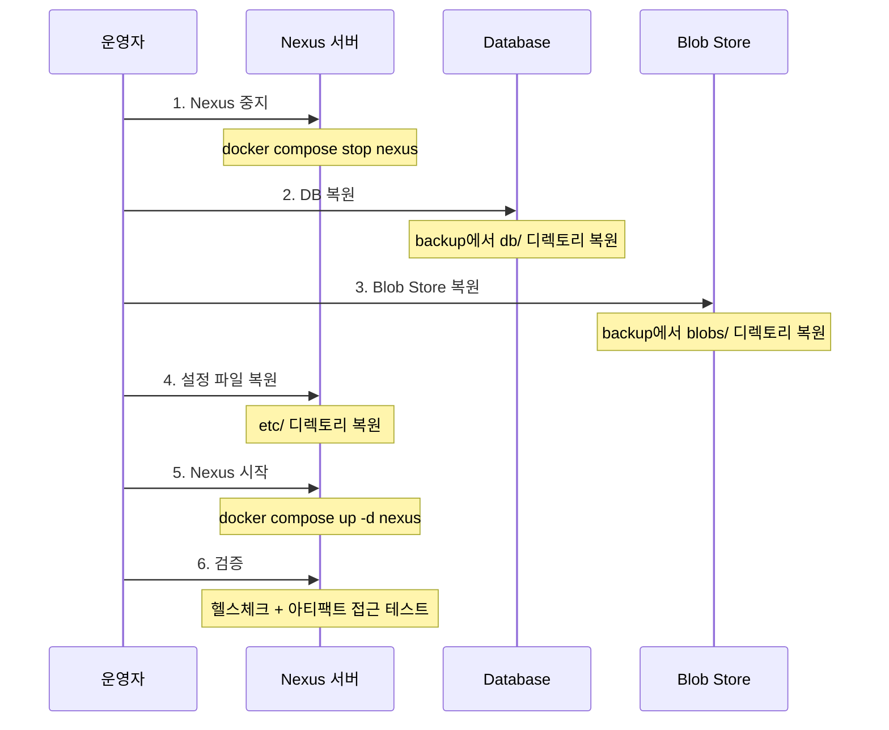
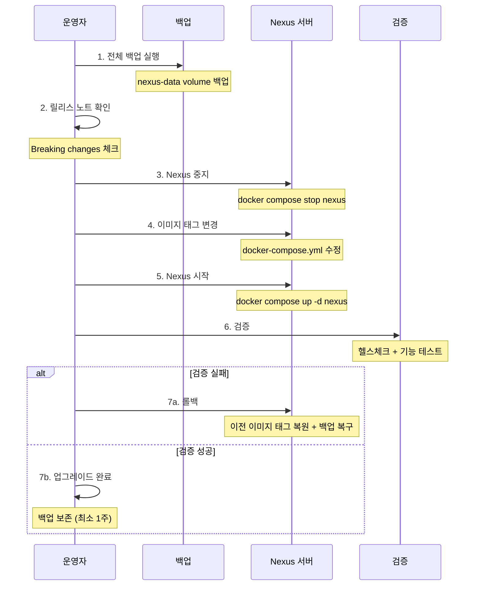

# Ch10: 백업, 복구, 업그레이드

## 핵심 질문
> 서버를 날렸을 때 1시간 안에 복구할 수 있는가?

## 목표
- Nexus의 백업 대상과 각 구성 요소의 역할을 이해한다
- 백업과 복구를 자동화하고 검증하는 절차를 익힌다
- 다운타임을 최소화하면서 Nexus를 업그레이드하는 방법을 파악한다

---

## 1. 백업 대상: 무엇을 지켜야 하는가

Nexus를 완전히 복구하려면 세 가지 구성 요소가 모두 필요하다. 하나라도 빠지면 복구가 불완전하거나 불가능해진다.

| 구성 요소 | 위치 (Docker 기준) | 내용 | 중요도 |
|-----------|-------------------|------|--------|
| **Blob Store** | `nexus-data/blobs/` | 실제 아티팩트 바이너리 | 최고 — 이게 없으면 모든 아티팩트 손실 |
| **Database** | `nexus-data/db/` | 메타데이터, 사용자, 권한, 정책 설정 | 높음 — 없으면 아티팩트를 찾을 수 없음 |
| **설정 파일** | `nexus-data/etc/` | nexus.properties, 커스텀 설정 | 중간 — 재설정 가능하지만 번거로움 |

Blob Store와 Database의 관계를 이해하는 게 핵심이다. Blob Store에 파일이 있어도 Database가 없으면 "어떤 파일이 어떤 아티팩트인지" 알 수 없고, Database만 있고 Blob Store가 없으면 메타데이터는 있지만 실제 파일을 제공할 수 없다. 둘은 반드시 함께 백업하고 함께 복구해야 정합성이 유지된다.

설정 파일(`etc/`)을 빠뜨리는 팀도 있는데, 이 경우 복구 후 모든 리포지토리 설정, Cleanup Policy, Scheduled Task, HTTP 프록시 설정 등을 수작업으로 다시 만들어야 한다. 리포지토리가 10개 이상이면 이 작업만으로 수 시간이 걸릴 수 있으므로, `etc/` 디렉토리도 백업 범위에 반드시 포함해야 한다.

각 구성 요소의 크기 비율도 파악해두면 백업 시간 산정에 도움이 된다. 일반적으로 Blob Store가 전체 `nexus-data`의 95% 이상을 차지하고, DB는 수백 MB에서 수 GB, 설정 파일은 수 MB 이하다. 아티팩트 수가 10만 개를 넘으면 Blob Store가 수백 GB에 달할 수 있으므로, 전체 백업에 필요한 시간과 디스크 공간을 사전에 추정하는 것이 중요하다.

---

## 2. 백업 방법

### 2.1 DB Export/Restore Task (Nexus 내장)

Nexus에 내장된 DB 백업 기능으로, `Administration → System → Tasks`에서 설정한다.

```
태스크: Admin - Export databases for backup
파라미터:
  Location: /nexus-data/backup  (백업 파일이 저장될 경로)
스케줄: 매일 새벽 1시
```

이 태스크는 Nexus DB의 스냅샷을 지정된 디렉토리에 내보낸다. 주의할 점은 이 기능이 Blob Store는 백업하지 않는다는 것이다. DB 메타데이터만 내보내므로, Blob Store는 별도로 백업해야 완전한 복구가 가능하다.

이 태스크를 REST API로 수동 트리거할 수도 있다. `POST /service/rest/v1/tasks/{taskId}/run`으로 호출하면 되는데, 백업 스크립트에서 "먼저 DB Export를 실행하고 → 완료 후 파일시스템 백업"이라는 순서를 자동화할 때 유용하다. 태스크 ID는 `GET /service/rest/v1/tasks`로 조회할 수 있다.

### 2.2 파일시스템 백업

가장 단순하고 확실한 방법은 `nexus-data` 디렉토리 전체를 백업하는 것이다.

```bash
# Nexus를 멈추고 백업 (정합성 보장)
docker compose stop nexus
tar czf nexus-backup-$(date +%Y%m%d).tar.gz /path/to/nexus-data/
docker compose up -d nexus

# 또는 rsync로 증분 백업
rsync -avz --delete /path/to/nexus-data/ /backup/nexus-data/
```

Nexus를 멈추고 백업하면 정합성이 보장되지만 다운타임이 생긴다. 멈추지 않고 백업하면 다운타임은 없지만, 백업 중 쓰기가 발생하면 DB와 Blob Store 간 불일치가 생길 수 있다. 이 트레이드오프를 어떻게 다루는지가 백업 전략의 핵심이며, 아래에서 상세히 논의한다.

실무에서 자주 쓰는 절충안은 **읽기 전용 모드** 전환이다. Nexus 자체에 읽기 전용 모드가 내장되어 있지는 않지만, reverse proxy(nginx 등)에서 PUT/POST 요청을 일시 차단하는 방식으로 유사하게 구현할 수 있다. 이렇게 하면 다운로드는 계속 허용하면서 업로드만 막아 백업 정합성을 확보하는 것이 가능해진다.

### 2.3 Docker volume 백업

Docker 환경에서는 named volume을 사용하는 경우가 많다. volume 데이터를 백업하는 표준 패턴은 이렇다.

```bash
# volume 데이터를 tar로 백업
docker run --rm \
  -v nexus-data:/source:ro \
  -v $(pwd)/backups:/backup \
  alpine tar czf /backup/nexus-data-$(date +%Y%m%d_%H%M%S).tar.gz -C /source .
```

`:ro`(read-only) 플래그로 마운트하면 백업 중 데이터가 변경되지 않지만, Nexus 컨테이너가 동시에 쓰기를 시도하면 충돌이 생길 수 있다. 안전하게 하려면 Nexus를 먼저 멈추는 편이 낫다.

### 2.4 S3 Blob Store의 경우

Blob Store가 S3에 있다면 별도의 파일 백업이 필요 없다. S3의 자체 기능을 활용하면 된다.

- **S3 Versioning**: 객체 삭제/덮어쓰기 시 이전 버전 보존
- **Cross-Region Replication**: 다른 리전으로 자동 복제
- **S3 Object Lock**: WORM(Write Once Read Many)으로 삭제 방지

이 경우에도 DB 백업은 별도로 해야 한다. DB는 Nexus 서버의 로컬 디스크에 있으므로, DB Export Task나 파일시스템 백업으로 DB를 보호하고, Blob Store는 S3에 맡기는 구조다.

---

## 3. 복구 절차

복구는 백업의 역순이다. 핵심은 DB와 Blob Store의 정합성을 유지하면서 복원하는 것이다.



### 3.1 복원 스크립트 실행

```bash
# 1. Nexus 중지
docker compose stop nexus

# 2. 기존 데이터 백업 (만약을 위해)
docker run --rm -v nexus-data:/data alpine sh -c \
  "cd /data && tar czf /tmp/before-restore.tar.gz ."

# 3. 백업에서 복원
docker run --rm \
  -v nexus-data:/target \
  -v $(pwd)/backups:/backup \
  alpine sh -c "rm -rf /target/* && tar xzf /backup/nexus-data-20260307.tar.gz -C /target"

# 4. Nexus 시작
docker compose up -d nexus

# 5. 헬스체크 (시작까지 1-2분 소요)
sleep 120
curl -f http://localhost:8081/service/rest/v1/status
```

### 3.2 복구 검증 체크리스트

Nexus가 시작된 후 다음 항목을 확인해야 한다.

- [ ] `/service/rest/v1/status`가 200 OK 반환
- [ ] 관리자 로그인 가능
- [ ] 주요 리포지토리가 Browse에서 보이는지
- [ ] 최근 배포된 아티팩트가 다운로드 가능한지
- [ ] Cleanup Policy, Scheduled Tasks가 유지되어 있는지
- [ ] 사용자 계정과 권한이 복원되어 있는지

"아티팩트가 다운로드 가능한지"를 검증하는 게 가장 중요한데, DB만 복원되고 Blob Store가 불완전하면 메타데이터는 보이지만 실제 다운로드 시 404가 나오기 때문이다.

---

## 4. 업그레이드

### 4.1 버전 호환성 확인

업그레이드 전에 반드시 릴리스 노트를 확인해야 한다. Nexus는 마이너 버전 업그레이드(예: 3.68 → 3.69)에서는 대체로 호환되지만, 메이저 변경(DB 엔진 교체 등)이 포함된 경우 특별한 마이그레이션 절차가 필요할 수 있다.

특히 주의할 변경사항은 다음과 같다.

- **DB 엔진 변경**: OrientDB → H2 마이그레이션 (Nexus 3.70+에서 진행 중)
- **API 변경**: 사용 중인 REST API 엔드포인트의 deprecation
- **Java 버전 변경**: 최소 Java 요구사항 상향
- **보안 변경**: 기본 비밀번호 정책, Realm 설정 변경

### 4.2 Docker 이미지 태그 변경 방식

Docker 환경에서 업그레이드는 이미지 태그만 변경하면 된다. 하지만 "태그만 바꾸면 되겠지"라는 안일한 생각으로 바로 실행하면 안 된다.

```yaml
# docker-compose.yml
services:
  nexus:
    # Before:
    # image: sonatype/nexus3:3.68.0
    # After:
    image: sonatype/nexus3:3.69.0
    volumes:
      - nexus-data:/nexus-data
```

### 4.3 업그레이드 절차



단계별로 정리하면 이렇다.

**사전 준비:**

```bash
# 1. 전체 백업
./scripts/backup.sh ./backups

# 2. 현재 버전 기록
docker inspect sonatype/nexus3 --format='{{.Config.Image}}' | head -1
```

**업그레이드 실행:**

```bash
# 3. Nexus 중지
docker compose stop nexus

# 4. docker-compose.yml에서 이미지 태그 변경
# image: sonatype/nexus3:3.68.0 → image: sonatype/nexus3:3.69.0

# 5. 새 이미지 pull + 시작
docker compose pull nexus
docker compose up -d nexus

# 6. 로그 모니터링 (첫 시작 시 DB 마이그레이션이 진행될 수 있음)
docker compose logs -f nexus
```

**검증:**

```bash
# 7. 헬스체크
curl -f http://localhost:8081/service/rest/v1/status

# 8. 버전 확인
curl -s http://localhost:8081/service/rest/v1/status | python3 -m json.tool
```

### 4.4 롤백 절차

업그레이드 후 문제가 발생하면 롤백해야 한다. 여기서 중요한 건, DB 스키마가 업그레이드 중에 변경되었을 수 있다는 점이다.

```bash
# 1. Nexus 중지
docker compose stop nexus

# 2. 이전 이미지 태그로 복원
# docker-compose.yml 수정

# 3. 백업에서 nexus-data 복원
./scripts/restore.sh ./backups/nexus-data-20260307.tar.gz

# 4. 이전 버전으로 시작
docker compose up -d nexus
```

단순히 이미지 태그만 되돌리면 안 되는 이유가 뭘까? 새 버전이 DB 스키마를 변경했다면, 이전 버전이 변경된 스키마를 읽지 못해서 시작에 실패할 수 있기 때문이다. 그래서 업그레이드 전 백업이 절대적으로 필수인 것이며, 롤백 시에는 백업에서 데이터까지 함께 복원해야 안전하다.

롤백을 빠르게 하려면 업그레이드 직전 백업에 명확한 이름을 붙여두는 것이 좋다. `nexus-data-pre-upgrade-3.68.0-to-3.69.0-20260307.tar.gz`처럼 이전/이후 버전과 날짜를 파일명에 포함시키면, 어떤 백업으로 돌아가야 하는지 혼동 없이 판단할 수 있다.

### 4.5 다운타임 최소화 전략

Nexus OSS는 단일 노드이므로 업그레이드 시 다운타임이 불가피하다. 이를 최소화하는 전략은 이렇다.

- **사전 pull**: `docker compose pull nexus`로 이미지를 미리 다운로드해두면, 실제 전환 시 이미지 다운로드 시간을 제거할 수 있다
- **최적 시간 선택**: CI 빌드가 없는 시간대(새벽, 주말)에 실행
- **임시 캐시**: 업그레이드 중 Maven/npm 빌드가 필요하면, 로컬 캐시(`~/.m2`, `node_modules`)를 활용하도록 팀에 공지
- **빠른 검증**: 자동화된 스모크 테스트로 검증 시간 단축

Nexus Pro를 쓰면 HA(High Availability) 클러스터를 구성해서 롤링 업그레이드가 가능하지만, OSS에서는 불가능하다.

### 4.6 업그레이드 버전 전략

Nexus 버전 업그레이드 시 건너뛰기(skip upgrade)를 해도 되는지 자주 질문이 나온다. Sonatype 공식 권장사항은 마이너 버전은 순차 업그레이드다. 예를 들어 3.60에서 3.70으로 올리려면 3.60 → 3.65 → 3.70 순서가 안전하다. 각 마이너 버전의 DB 마이그레이션 스크립트가 이전 버전의 스키마를 전제로 작성되기 때문이다.

패치 버전(3.69.0 → 3.69.1)은 자유롭게 올릴 수 있다. DB 스키마 변경 없이 버그 수정만 포함하는 경우가 대부분이므로 위험이 낮다.

업그레이드 전 릴리스 노트를 확인하는 습관이 중요하다. 특히 Breaking Changes와 Upgrade Notes 섹션에서 DB 마이그레이션, 설정 변경, 제거된 기능을 반드시 확인해야 한다. 릴리스 노트를 무시하고 올렸다가 deprecated API가 제거되어 CI 파이프라인이 깨지는 사고가 실무에서 종종 발생한다.

### 4.7 업그레이드 체크리스트

| 단계 | 항목 | 확인 |
|------|------|------|
| 사전 | 릴리스 노트 확인 (Breaking Changes) | □ |
| 사전 | 현재 버전 기록 | □ |
| 사전 | 전체 백업 완료 + 백업 파일 무결성 확인 | □ |
| 사전 | 새 이미지 사전 pull | □ |
| 실행 | Nexus 중지 → 이미지 변경 → 시작 | □ |
| 검증 | 헬스체크 통과 | □ |
| 검증 | 관리자 로그인 + 리포지토리 목록 확인 | □ |
| 검증 | CI에서 아티팩트 push/pull 테스트 | □ |
| 사후 | DB 마이그레이션 로그에 에러 없음 확인 | □ |
| 사후 | 이전 백업 최소 1주 보존 | □ |

---

## 5. 백업 자동화

### 5.1 cron + backup script

매일 백업을 수동으로 실행하는 건 현실적이지 않다. cron job으로 자동화하자.

```bash
# crontab -e
# 매일 새벽 3시에 백업 실행
0 3 * * * /opt/nexus/scripts/backup.sh /opt/nexus/backups >> /var/log/nexus-backup.log 2>&1
```

백업 스크립트는 `practice/scripts/backup.sh`를 참조하면 된다. 핵심 포인트는 다음과 같다.

1. DB Export Task를 REST API로 트리거
2. Volume 데이터를 tar로 아카이브
3. 30일 이상 된 백업을 자동 삭제 (디스크 절약)
4. 로그에 결과 기록

### 5.2 백업 검증 자동화

백업은 했는데 복구가 안 되면 의미가 없다. 주기적으로 백업 복구를 테스트하는 것이 중요하며, 이를 자동화하면 더 좋다.

```bash
# 매주 일요일 새벽에 테스트 복구 실행
# 별도 Docker 환경에서 최신 백업을 복원하고 헬스체크
docker run --rm \
  -v $(pwd)/backups:/backup:ro \
  -v nexus-test-data:/nexus-data \
  -p 18081:8081 \
  sonatype/nexus3:3.69.0 &

sleep 180  # Nexus 시작 대기
curl -f http://localhost:18081/service/rest/v1/status
docker stop $(docker ps -q --filter ancestor=sonatype/nexus3)
```

이런 테스트를 한 번도 안 해본 팀에서 실제 장애가 발생하면, 백업 파일이 손상되어 있거나 복구 절차를 몰라서 RTO(복구 시간)가 몇 시간에서 하루로 늘어나는 경우를 보게 된다.

복구 검증 자동화를 Jenkins 파이프라인에 통합하는 것도 고려해볼 만하다. 매주 일요일 새벽에 스케줄 트리거로 최신 백업을 복원하고, healthcheck와 샘플 아티팩트 다운로드를 테스트한 뒤, 결과를 Slack이나 이메일로 통보하는 파이프라인을 만들면 별도의 모니터링 인프라 없이도 백업 유효성을 지속적으로 검증할 수 있다.

---

## 6. 백업 전략 설계

### 6.1 RPO와 RTO

백업 전략을 설계할 때 두 가지 지표를 먼저 정의해야 한다.

**RPO (Recovery Point Objective)**: 최대 허용 데이터 손실 시간. "마지막 백업 이후의 데이터를 잃어도 되는 시간"으로, RPO가 1시간이면 매 시간 백업해야 한다.

**RTO (Recovery Time Objective)**: 최대 허용 복구 시간. "장애 발생 후 서비스가 정상화되기까지 걸려도 되는 시간"이다.

| 환경 | RPO | RTO | 백업 전략 |
|------|-----|-----|----------|
| 개발/테스트 | 24시간 | 4시간 | 일일 백업, 수동 복구 |
| 스테이징 | 12시간 | 2시간 | 12시간 백업, 스크립트 복구 |
| 프로덕션 | 1시간 | 30분 | 시간별 증분, 자동 복구 |

### 6.2 증분 백업

전체 백업은 간단하지만 데이터가 크면 시간이 오래 걸린다. rsync를 활용한 증분 백업으로 시간을 줄일 수 있다.

```bash
# rsync 증분 백업 (변경된 파일만 전송)
rsync -avz --delete \
  /var/nexus-data/ \
  /backup/nexus-data/

# 또는 hard link 기반 일별 스냅샷
rsync -avz --delete --link-dest=/backup/latest \
  /var/nexus-data/ \
  /backup/$(date +%Y%m%d)/
ln -sfn /backup/$(date +%Y%m%d) /backup/latest
```

`--link-dest`를 쓰면 변경되지 않은 파일은 이전 백업의 hard link를 사용하므로 디스크를 절약하면서 일별 스냅샷을 유지할 수 있다.

### 6.3 백업 보관 정책

백업을 무한정 보관하면 디스크가 부족해지고, 너무 적게 보관하면 장애 대응 여지가 줄어든다. 환경별로 적절한 보관 주기를 정의해두자.

| 백업 유형 | 보관 기간 | 이유 |
|-----------|----------|------|
| 일일 백업 | 최근 7일 | 최근 변경 추적 및 빠른 복구용 |
| 주간 백업 | 최근 4주 | 주 단위 롤백 포인트 |
| 월간 백업 | 최근 6개월 | 장기 보존 및 감사 목적 |
| 업그레이드 직전 백업 | 다음 업그레이드 성공까지 | 롤백 가능성이 사라질 때까지 |

오래된 백업을 자동 삭제하는 스크립트를 cron job에 포함시키는 것이 좋다. `find /backup -name "nexus-data-*.tar.gz" -mtime +30 -delete`처럼 날짜 기준으로 정리하되, 월간 백업은 별도 디렉토리에 보관해서 삭제 대상에서 제외한다.

### 6.4 원격 백업

로컬 디스크에만 백업을 보관하면, 서버 자체가 장애를 일으켰을 때(디스크 고장, 랜섬웨어 등) 백업까지 함께 유실될 수 있다. 3-2-1 백업 원칙(3개의 복사본, 2종류의 미디어, 1개는 오프사이트)을 적용하면 이 위험을 줄일 수 있다.

```bash
# S3로 백업 전송
aws s3 cp /backup/nexus-data-$(date +%Y%m%d).tar.gz \
  s3://company-backups/nexus/ \
  --storage-class STANDARD_IA

# 또는 rsync로 원격 서버에 복제
rsync -avz /backup/ backup-server:/backup/nexus/
```

S3의 `STANDARD_IA`(Infrequent Access) 스토리지 클래스를 사용하면 자주 접근하지 않는 백업 파일의 저장 비용을 절감할 수 있다. 복구 시에만 접근하는 백업 특성에 적합한 선택이다.

---

## 7. 자주 만나는 함정

### 7.1 "백업했는데 복구가 안 돼요"

대부분 DB Export만 하고 Blob Store를 안 했기 때문이다. DB Export Task는 이름이 "Export databases for backup"이라서, 이것만 하면 전체 백업이 된 줄 착각하기 쉽다. Blob Store까지 포함해서 nexus-data 전체를 백업해야 완전한 복구가 가능하다는 걸 잊지 말자.

### 7.2 hot backup의 정합성 문제

Nexus가 실행 중인 상태에서 백업(hot backup)하면, 백업 중에 새 아티팩트가 배포될 수 있다. DB에는 해당 아티팩트의 메타데이터가 있는데 Blob Store 백업에는 해당 파일이 없는 상황이 생길 수 있다. 이 경우 복구 후 해당 아티팩트에 접근하면 404 에러가 난다.

완벽한 정합성이 필요하면 Nexus를 멈추고 백업하는 게 확실하다. hot backup이 필요한 환경에서는, 먼저 DB Export를 하고 이어서 Blob Store를 백업하는 순서를 지키면 불일치 범위를 최소화할 수 있다. DB에 "이 아티팩트가 있다"고 기록되어 있는데 Blob에 파일이 없는 것보다, Blob에 파일이 있는데 DB에 기록이 없는 게(orphan blob) 덜 치명적이기 때문이다.

### 7.3 업그레이드 후 시작이 느려요

새 버전이 DB 마이그레이션을 수행하면 첫 시작이 평소보다 훨씬 오래 걸릴 수 있다. 아티팩트 수가 많으면 수십 분 걸리기도 하는데, 이때 "안 되는 거 아닌가?" 하고 강제 종료하면 DB가 손상될 수 있다. `docker compose logs -f nexus`로 로그를 보면서 마이그레이션 진행 상황을 확인하자.

---

## 정리

| 항목 | 방법 | 주기 | 비고 |
|------|------|------|------|
| DB 백업 | DB Export Task | 매일 | 메타데이터만 |
| 전체 백업 | Volume tar/rsync | 매일 | DB + Blob Store + 설정 |
| 복구 테스트 | 별도 환경 복원 | 매주 | 백업 유효성 검증 |
| 업그레이드 | 이미지 태그 변경 | 릴리스 주기 | 반드시 사전 백업 |

백업/복구에서 가장 중요한 원칙은 "테스트하지 않은 백업은 백업이 아니다"라는 것이다. 매일 백업을 돌리고 있더라도, 실제로 복원해서 서비스가 정상 동작하는지 주기적으로 확인하지 않으면 장애 시 복구에 실패할 수 있다. 백업 스크립트 작성보다 복구 검증 자동화에 더 많은 시간을 투자하는 게 올바른 우선순위다.

---

## 교차참조
- **Ch09 (Cleanup)**: Blob Store 구조와 스토리지 관리
- **practice/scripts/backup.sh**: 백업 자동화 스크립트
- **practice/scripts/restore.sh**: 복구 스크립트

---

## 체크포인트

- [ ] DB Export Task 스케줄 설정 완료
- [ ] Volume 전체 백업 스크립트로 백업 실행
- [ ] 백업에서 복구하고 헬스체크 통과 확인
- [ ] Nexus Docker 이미지 태그를 변경해서 업그레이드 실행
- [ ] 업그레이드 후 롤백 절차 설명 가능
