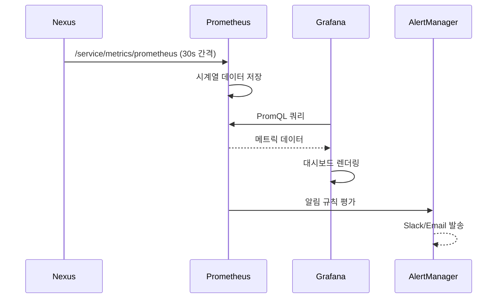
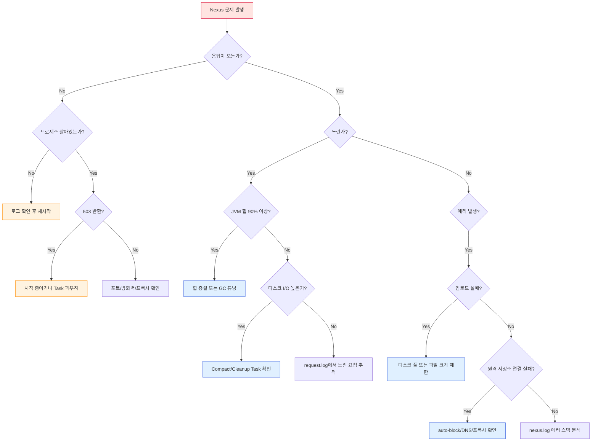

# Ch11. 모니터링과 트러블슈팅

## 목표

Nexus가 느려지거나 장애가 발생했을 때, 원인을 빠르게 파악하고 해결하는 능력을 기른다. 내장 모니터링 도구부터 Prometheus/Grafana 연동까지, 운영에 필요한 관측성(observability) 전반을 다룬다.

---

## 1. Nexus 내장 모니터링

Nexus는 별도 도구 없이도 기본적인 상태를 파악할 수 있는 UI와 API를 제공한다. 외부 모니터링을 붙이기 전에 이 내장 기능부터 익혀두면, 장애 상황에서 가장 먼저 확인할 곳이 어디인지 감을 잡을 수 있다.

### System Status

Administration → System → Status 메뉴에서 노드 상태를 확인할 수 있다. 여기서 보여주는 정보는 단순해 보이지만, "Nexus가 정상적으로 떠 있는가?"라는 가장 기본적인 질문에 답을 준다. API로도 동일한 정보를 얻을 수 있어서 스크립트 기반 헬스체크에 활용하기 좋다.

```bash
# 기본 상태 확인 (인증 불필요)
curl -s http://localhost:8081/service/rest/v1/status

# 쓰기 가능 상태 확인 (시작 완료 여부 판단)
curl -s http://localhost:8081/service/rest/v1/status/writable
```

시작 직후에는 `/status`는 200을 반환하더라도 `/status/writable`은 503을 반환할 수 있다. Docker 헬스체크나 쿠버네티스 readinessProbe에서 이 차이를 구분해야 하는 이유가 바로 여기에 있다.

### System Information

Administration → System → Support → System Information에서 JVM, OS, 메모리, 디스크 정보를 한눈에 볼 수 있다. 트러블슈팅의 출발점이 되는 화면이라고 할 수 있는데, 특히 JVM 힙 사용량과 디스크 여유 공간은 장애의 80%를 설명하는 지표이기 때문이다.

주목할 항목은 다음과 같다.

- **JVM Memory**: 힙 사용량이 최대값의 90%를 넘기면 GC 압박이 시작된다
- **File Descriptors**: 열린 파일 수가 한계에 가까우면 연결 거부가 발생할 수 있다
- **Blob Store**: 각 Blob Store의 사용량과 남은 공간

### Scheduled Tasks

Administration → System → Tasks에서 예약 작업의 상태를 확인한다. Nexus는 내부적으로 꽤 많은 백그라운드 작업을 수행하는데, 이 작업들이 겹치거나 오래 걸리면 전체 성능에 영향을 미친다.

자주 문제가 되는 작업은 이렇다.

| 작업 | 주기 | 영향 |
|------|------|------|
| Compact Blob Store | 일간 | 디스크 I/O 급증 |
| Rebuild repository index | 수동 | CPU + I/O 부하 |
| Cleanup unused components | 일간/주간 | DB 부하 |
| Download indexes (proxy) | 일간 | 네트워크 + 디스크 |

이 작업들의 실행 시간을 업무 시간 외로 조정하는 것만으로도 체감 성능이 개선되는 경우가 많다. "왜 매일 오전 10시에 느려지지?"라는 질문의 답이 여기에 있을 수 있다.

---

## 2. 로그 시스템

로그는 모니터링의 기본이지만, Nexus의 로그 구조를 모르면 엉뚱한 곳에서 시간을 낭비하게 된다. 핵심 로그 파일 두 개를 확실히 구분해두자.

### nexus.log

애플리케이션 로그로, Nexus 내부에서 발생하는 모든 이벤트가 기록된다. 에러 스택트레이스, 플러그인 로딩, 스케줄 작업 실행 결과 등이 여기에 남는다.

```bash
# Docker 환경에서 실시간 로그 확인
docker logs -f nexus --tail 100

# 또는 컨테이너 내부 로그 파일 직접 확인
docker exec nexus tail -f /nexus-data/log/nexus.log
```

기본 로그 레벨은 INFO인데, 특정 문제를 추적할 때는 런타임에 레벨을 변경할 수 있다. 재시작 없이 변경 가능하다는 점이 운영 환경에서 큰 장점이 된다.

```bash
# 특정 로거의 레벨을 DEBUG로 변경
curl -u admin:admin123 -X PUT \
  'http://localhost:8081/service/rest/v1/logging/loggers/org.sonatype.nexus.repository.httpbridge' \
  -H 'Content-Type: application/json' \
  -d '"DEBUG"'

# 현재 로거 목록 확인
curl -u admin:admin123 \
  'http://localhost:8081/service/rest/v1/logging/loggers'

# 원래 레벨로 복원
curl -u admin:admin123 -X DELETE \
  'http://localhost:8081/service/rest/v1/logging/loggers/org.sonatype.nexus.repository.httpbridge'
```

DEBUG 레벨은 로그 양이 폭발적으로 증가하니, 문제 재현 직전에 켜고 재현 후 바로 끄는 습관을 들여야 한다. 켜놓고 잊으면 디스크가 금방 차버릴 수 있다.

### request.log

HTTP 접근 로그로, 누가 언제 어떤 요청을 보냈는지 기록된다. 아파치 Combined 포맷과 유사하며, 응답 시간도 포함되어 있어서 느린 요청을 추적하는 데 유용하다.

```
192.168.1.10 - admin [07/Mar/2026:10:15:23 +0900] "GET /repository/maven-public/org/springframework/spring-core/6.1.0/spring-core-6.1.0.jar HTTP/1.1" 200 1847552 234
```

마지막 숫자(234)가 응답 시간(ms)이다. 이 값이 수 초를 넘기는 요청이 반복적으로 나타나면, 해당 리포지토리나 Blob Store에 문제가 있을 가능성이 높다.

```bash
# 응답 시간이 3초 이상인 요청 필터링
awk '$NF > 3000' /nexus-data/log/request.log

# 특정 시간대의 요청 수 집계
grep '07/Mar/2026:10' /nexus-data/log/request.log | wc -l
```

---

## 3. Prometheus 메트릭 통합

내장 모니터링만으로는 시계열 데이터 분석이 어렵다. 과거 추이를 보고, 임계값 기반 알림을 설정하려면 Prometheus 연동이 필수인데, Nexus 3는 이를 위한 엔드포인트를 제공한다.

### 엔드포인트 활성화

Nexus의 Prometheus 메트릭 엔드포인트는 기본적으로 비활성화되어 있다. 활성화하려면 `nexus.properties`에 설정을 추가해야 한다.

```properties
# /nexus-data/etc/nexus.properties
nexus.metrics.enabled=true
```

Docker 환경에서는 환경변수나 볼륨 마운트로 이 설정을 주입한다.

```yaml
# docker-compose.yml 발췌
services:
  nexus:
    environment:
      - INSTALL4J_ADD_VM_PARAMS=-Xms1024m -Xmx2048m -Dnexus.metrics.enabled=true
```

활성화 후 접근할 수 있는 엔드포인트는 다음과 같다.

```bash
# Prometheus 포맷 메트릭 조회
curl -u admin:admin123 \
  http://localhost:8081/service/metrics/prometheus
```

### 주요 메트릭

수집되는 메트릭은 크게 세 범주로 나뉜다.

**JVM 메트릭** — Nexus는 Java 애플리케이션이므로 JVM 상태가 곧 Nexus 상태라고 해도 과언이 아니다.

| 메트릭 | 설명 | 경고 기준 |
|--------|------|-----------|
| `jvm_memory_bytes_used{area="heap"}` | 힙 사용량 | 최대값의 85% 이상 |
| `jvm_gc_collection_seconds_sum` | GC 누적 시간 | 급격한 증가 |
| `jvm_threads_current` | 활성 스레드 수 | 500 이상 |
| `jvm_memory_bytes_used{area="nonheap"}` | 메타스페이스 등 | 지속 증가 |

**HTTP 메트릭** — 요청 패턴과 에러율을 파악하는 데 쓰인다.

| 메트릭 | 설명 | 활용 |
|--------|------|------|
| `http_requests_total` | 총 요청 수 | 트래픽 추이 |
| `http_request_duration_seconds` | 응답 시간 분포 | P95/P99 추적 |
| `http_responses_total{status="5xx"}` | 서버 에러 수 | 에러율 알림 |

**리포지토리 메트릭** — 저장소 수준의 건강 상태를 보여준다.

| 메트릭 | 설명 |
|--------|------|
| `nexus_blobstore_total_size_bytes` | Blob Store 총 크기 |
| `nexus_blobstore_available_space_bytes` | 남은 공간 |
| `nexus_repository_component_count` | 컴포넌트 수 |

### Prometheus 설정

```yaml
# prometheus.yml
scrape_configs:
  - job_name: 'nexus'
    metrics_path: '/service/metrics/prometheus'
    basic_auth:
      username: admin
      password: admin123
    scrape_interval: 30s
    static_configs:
      - targets: ['nexus:8081']
        labels:
          instance: 'nexus-primary'
```

scrape_interval을 너무 짧게 잡으면 Nexus에 부하를 줄 수 있다. 30초면 대부분의 운영 시나리오에서 충분하다.

---

## 4. Grafana 대시보드

Prometheus로 수집한 메트릭을 시각화하는 단계다. 대시보드를 처음부터 만들 필요는 없고, 핵심 패널 몇 개를 이해하면 된다.



### 핵심 대시보드 패널

운영에서 반드시 있어야 하는 패널은 다섯 가지 정도다.

**1) JVM 힙 사용량 (게이지)**
```promql
jvm_memory_bytes_used{area="heap", job="nexus"}
  / jvm_memory_bytes_max{area="heap", job="nexus"} * 100
```

85%를 넘기면 경고, 95%를 넘기면 긴급 알림을 설정하는 게 일반적이다.

**2) HTTP 요청률 (그래프)**
```promql
rate(http_requests_total{job="nexus"}[5m])
```

평소 패턴을 알아두면 비정상적인 트래픽 급증을 바로 감지할 수 있다.

**3) 응답 시간 P95 (그래프)**
```promql
histogram_quantile(0.95,
  rate(http_request_duration_seconds_bucket{job="nexus"}[5m])
)
```

**4) Blob Store 사용량 (게이지)**
```promql
nexus_blobstore_total_size_bytes{job="nexus"}
  / (nexus_blobstore_total_size_bytes{job="nexus"}
     + nexus_blobstore_available_space_bytes{job="nexus"}) * 100
```

**5) 에러율 (그래프)**
```promql
rate(http_responses_total{job="nexus", status=~"5.."}[5m])
  / rate(http_responses_total{job="nexus"}[5m]) * 100
```

### 알림 규칙 예시

```yaml
# prometheus-rules.yml
groups:
  - name: nexus
    rules:
      - alert: NexusHeapHigh
        expr: >
          jvm_memory_bytes_used{area="heap", job="nexus"}
          / jvm_memory_bytes_max{area="heap", job="nexus"} > 0.85
        for: 5m
        labels:
          severity: warning
        annotations:
          summary: "Nexus JVM 힙 사용량 85% 초과"

      - alert: NexusDiskLow
        expr: >
          nexus_blobstore_available_space_bytes{job="nexus"}
          < 5 * 1024 * 1024 * 1024
        for: 10m
        labels:
          severity: critical
        annotations:
          summary: "Nexus Blob Store 여유 공간 5GB 미만"

      - alert: NexusHighErrorRate
        expr: >
          rate(http_responses_total{job="nexus", status=~"5.."}[5m])
          / rate(http_responses_total{job="nexus"}[5m]) > 0.05
        for: 3m
        labels:
          severity: critical
        annotations:
          summary: "Nexus 5xx 에러율 5% 초과"
```

---

## 5. 트러블슈팅 가이드

Nexus 운영에서 만나게 되는 문제는 의외로 패턴이 반복된다. 아래 의사결정 트리를 따라가면 대부분의 문제를 분류할 수 있다.



### 느린 응답

가장 흔한 문제다. 원인의 대부분은 JVM 힙 부족이나 디스크 I/O에 있다.

**JVM 힙 부족과 GC 압박** — 힙이 부족하면 JVM은 메모리를 확보하려고 GC를 자주 실행하게 되고, Full GC가 발생하면 수 초간 애플리케이션이 멈출 수 있다. "갑자기 멈췄다가 다시 된다"는 증상이라면 GC를 의심해볼 만하다.

```bash
# JVM 옵션에 GC 로그 추가
-XX:+UseG1GC
-Xlog:gc*:file=/nexus-data/log/gc.log:time,uptime:filecount=10,filesize=10m

# 현재 힙 상태 확인
jcmd $(pgrep -f nexus) GC.heap_info
```

권장 힙 설정은 이렇다.

| 규모 | 컴포넌트 수 | -Xms/-Xmx | MaxDirectMemorySize |
|------|-------------|-----------|---------------------|
| 소규모 | < 10K | 1-2 GB | 1 GB |
| 중규모 | 10K-100K | 2-4 GB | 2 GB |
| 대규모 | 100K+ | 4-8 GB | 3 GB |

**디스크 I/O** — Compact Blob Store나 Rebuild Index 같은 무거운 작업이 실행 중이면 디스크 I/O가 치솟으면서 일반 요청의 응답 시간도 함께 늘어난다. `iostat`이나 `docker stats`로 확인해보자.

### OutOfMemoryError

두 종류가 있으며, 원인이 다르다.

- **Java heap space**: `-Xmx` 증설 필요
- **Direct buffer memory**: `-XX:MaxDirectMemorySize` 증설 필요. Nexus는 파일 I/O에 Direct Buffer를 많이 사용하므로 이 값을 간과하면 안 된다

컨테이너 메모리 제한과의 관계도 신경 써야 한다. 컨테이너 메모리 = Heap + DirectMemory + Metaspace + 스레드 스택 + OS 오버헤드이므로, Heap 4GB + Direct 2GB라면 컨테이너는 최소 8GB를 할당해야 여유가 생긴다.

### 업로드 실패

Blob Store의 디스크가 가득 찼거나, 파일 크기 제한에 걸린 경우다. 에러 메시지가 명확하지 않을 때가 있어서, 두 가지를 모두 확인하는 게 좋다.

```bash
# 디스크 사용량 확인
df -h /nexus-data

# Nginx 리버스 프록시의 파일 크기 제한 확인
# nginx.conf에서 client_max_body_size 확인
```

### 원격 저장소 연결 실패

Proxy 리포지토리가 원격 저장소에 연결하지 못하면, 캐시에 없는 아티팩트를 받을 수 없게 된다. Nexus에는 auto-block 기능이 있어서, 원격 저장소가 일정 횟수 이상 실패하면 자동으로 차단한다.

```bash
# auto-block 상태 확인 및 해제 (REST API)
curl -u admin:admin123 \
  'http://localhost:8081/service/rest/v1/repositories/maven-central'
# blocked: true이면 수동 해제 필요

# DNS 확인
nslookup repo1.maven.org

# 프록시 설정 확인
curl -u admin:admin123 \
  'http://localhost:8081/service/rest/v1/http'
```

---

## 6. 성능 튜닝 체크리스트

모든 것을 한 번에 바꾸려 하지 말고, 하나씩 변경하면서 효과를 측정하는 게 원칙이다.

**JVM 튜닝**
- G1GC 사용 (Nexus 3 기본값)
- Heap은 가용 메모리의 50-60%로 설정
- MaxDirectMemorySize는 Heap의 50% 수준
- GC 로그 항상 활성화 (오버헤드 무시할 수준)

**운영 체제 튜닝**
- `ulimit -n 65536` (파일 디스크립터 수 확대)
- `vm.swappiness=1` (스왑 최소화)
- SSD 사용 권장 (Blob Store 디렉토리)

**Nexus 설정 튜닝**
- Task 스케줄: 피크 시간 피해서 배치
- Connection Pool: 원격 저장소 연결 수 조정
- HTTP 스레드: `nexus.http.thread-pool-size` (기본 200)

**네트워크 튜닝**
- Reverse Proxy(Nginx) 타임아웃 충분히 설정
- `proxy_read_timeout 600` (대용량 아티팩트)
- `client_max_body_size 1G` (업로드 크기 제한)

---

## 7. 정리

### 모니터링 3계층

| 계층 | 도구 | 용도 |
|------|------|------|
| 내장 | Status API, UI | 즉각적인 상태 확인 |
| 로그 | nexus.log, request.log | 문제 원인 추적 |
| 메트릭 | Prometheus + Grafana | 추이 분석, 알림 |

### 트러블슈팅 우선순위

문제가 발생하면 이 순서로 확인한다.

1. **Status API** — Nexus가 살아있는가?
2. **JVM 힙** — 메모리가 부족한가?
3. **디스크** — Blob Store 공간이 있는가?
4. **Task** — 무거운 백그라운드 작업이 실행 중인가?
5. **request.log** — 어떤 요청이 느린가?
6. **nexus.log** — 에러 스택트레이스가 있는가?

### 핵심 기억사항

- Prometheus 엔드포인트는 기본 비활성이므로 `nexus.metrics.enabled=true` 설정이 필요하다
- JVM Heap + DirectMemory + 여유분 = 컨테이너 메모리 제한이어야 한다
- 로그 레벨은 REST API로 런타임에 변경 가능하지만, DEBUG는 반드시 짧게 사용해야 한다
- Scheduled Task의 실행 시간을 업무 외 시간으로 조정하는 것만으로도 체감 성능이 개선될 수 있다
- auto-block된 원격 저장소는 자동 복구되지 않으므로 수동 확인이 필요하다
- GC 로그를 활성화해두면 Full GC 빈도와 소요시간을 사후 분석할 수 있어서, OOM 직전 상황을 재현하지 않아도 원인을 파악할 수 있다

### 교차참조

- 03-devops-fundamentals Ch10: 모니터링 기초 (Prometheus/Grafana 일반론)
- 01-jenkins Ch09: Jenkins 모니터링 (유사한 JVM 튜닝 패턴)
