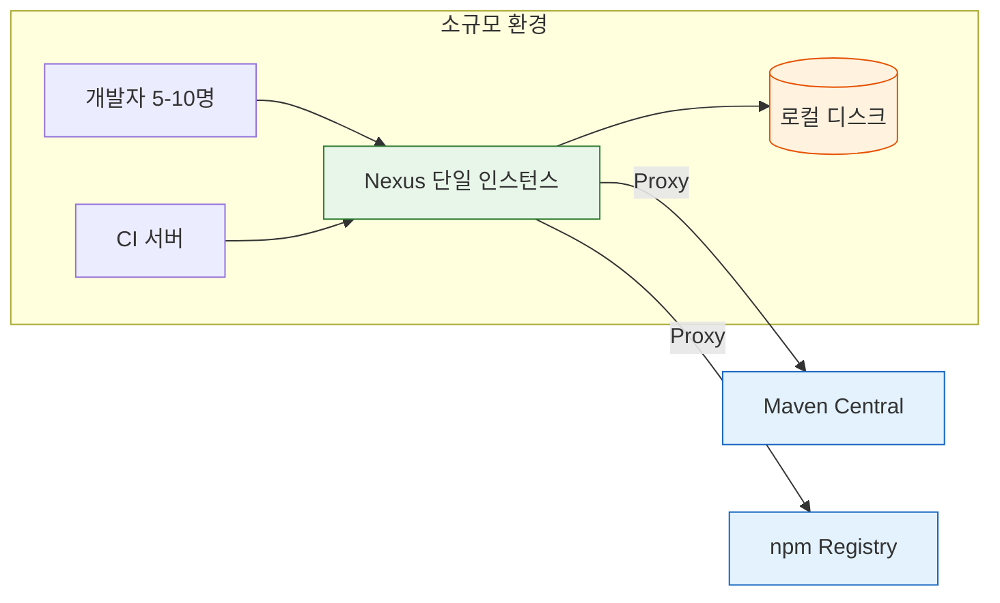
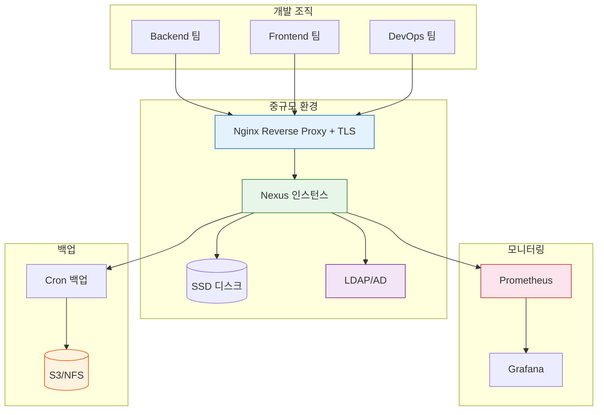
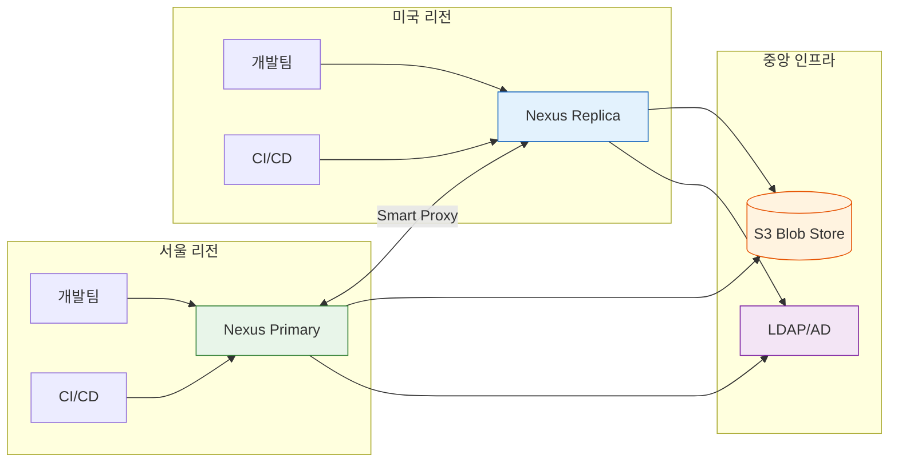
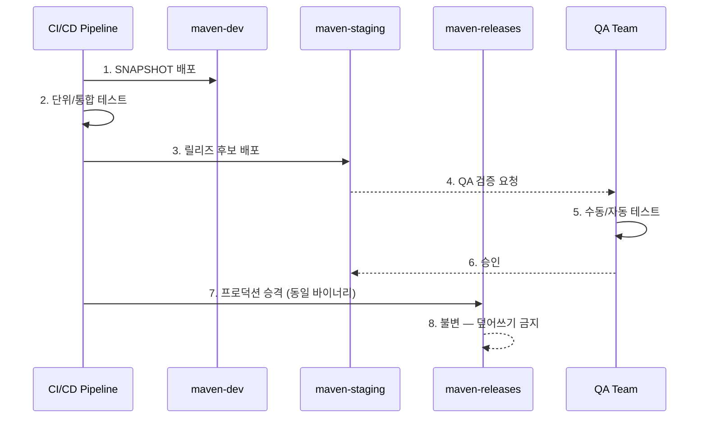
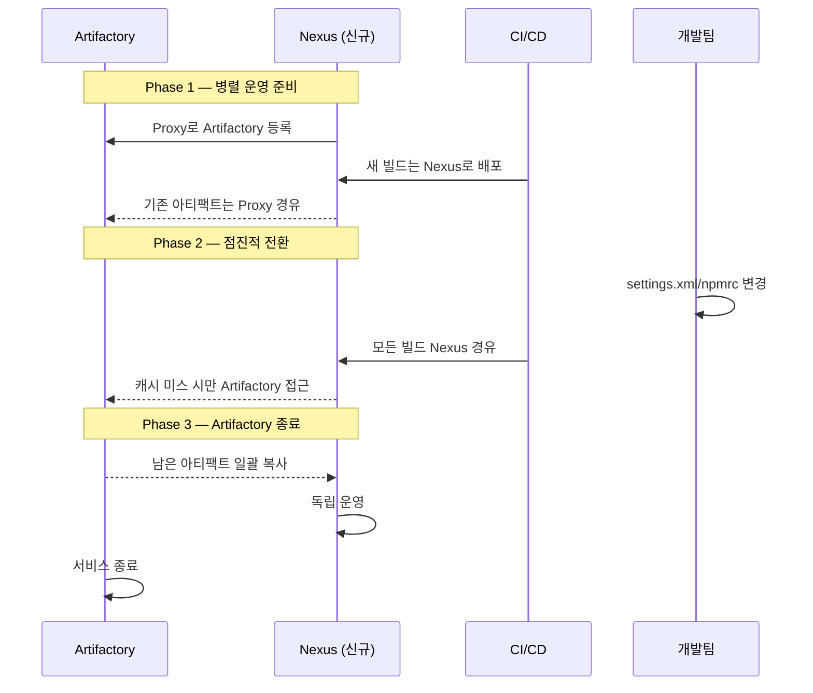

# Ch12. 프로덕션 운영 패턴

## 목표

10명 팀의 Nexus와 500명 조직의 Nexus는 근본적으로 다른 운영 전략을 요구한다. 이 챕터에서는 규모별 아키텍처 패턴, OSS와 Pro의 기능 차이, 거버넌스, IaC 기반 관리, 보안 강화, 그리고 마이그레이션 패턴까지 프로덕션 운영에 필요한 실전 지식을 다룬다.

---

## 1. 규모별 운영 패턴

"우리 팀에 Nexus가 필요한가?"라는 질문에 답하기 전에, "어느 수준으로 필요한가?"를 먼저 판단해야 한다. 팀 규모와 아티팩트 양에 따라 아키텍처가 완전히 달라지기 때문이다.

### 소규모 (10-30명)

개발팀이 작고 아티팩트 양이 적다면, 단일 Nexus 인스턴스로 충분하다. Docker Compose로 띄우고, 기본 정리 정책만 설정하면 된다. 이 규모에서 HA(고가용성)를 논하는 건 과도한 엔지니어링이다.

핵심 설정은 세 가지뿐이다. 첫째, 기본 admin 비밀번호 변경. 둘째, Proxy 리포지토리 설정(Maven Central, npm registry 등). 셋째, Cleanup Policy 하나 이상 활성화. 백업은 cron + `tar` 수준이면 충분하고, 모니터링은 Status API 헬스체크 정도면 된다.

```yaml
# 소규모 docker-compose.yml 골격
services:
  nexus:
    image: sonatype/nexus3:latest
    ports:
      - "8081:8081"
    volumes:
      - nexus-data:/nexus-data
    environment:
      - INSTALL4J_ADD_VM_PARAMS=-Xms512m -Xmx1024m -XX:MaxDirectMemorySize=512m
    restart: unless-stopped
```



### 중규모 (30-100명)

여러 팀이 Nexus를 공유하기 시작하면, 보안과 안정성 요구가 급격히 올라간다. 이 단계에서 필요해지는 것들이 있다.

- **Reverse Proxy + TLS**: Nginx나 Traefik 앞에 두고 HTTPS로 접근
- **LDAP/AD 연동**: 사용자 관리를 중앙화하지 않으면 계정 관리가 지옥이 된다
- **자동 백업**: 일간 스냅샷 + 외부 저장소(S3, NFS)로 전송
- **모니터링**: Prometheus + Grafana (Ch11 참조)
- **역할 기반 접근 제어**: 팀별로 리포지토리 권한을 분리

이 규모에서 흔히 저지르는 실수가 있다. "아직 작은데 괜찮겠지"라고 보안 설정을 미루다가, 누군가 잘못된 아티팩트를 릴리즈 리포지토리에 올리는 사고가 터지는 거다. Write 권한은 처음부터 엄격하게 관리해야 한다.



### 대규모 (100-500명)

단일 인스턴스의 한계가 보이기 시작하는 시점이다. 동시 접속자가 많아지면 응답 시간이 길어지고, Blob Store 용량이 테라바이트 단위로 커진다. JVM 힙도 8GB 이상으로 잡아야 하며, GC 튜닝 없이는 Full GC로 인한 멈춤(stop-the-world)이 사용자 경험을 해칠 수 있다.

```yaml
# 대규모 환경 아키텍처 (Nexus Pro 필요)
services:
  nexus:
    image: sonatype/nexus3:latest
    deploy:
      resources:
        limits:
          memory: 16G
    environment:
      - INSTALL4J_ADD_VM_PARAMS=-Xms4g -Xmx8g -XX:MaxDirectMemorySize=4g
    volumes:
      - /mnt/ssd/nexus-data:/nexus-data
```

이 규모에서는 Nexus Pro의 HA 클러스터링이나 S3 Blob Store를 진지하게 검토해야 한다. OSS 버전으로 버티려면 Reverse Proxy에서 읽기/쓰기를 분리하거나, 용도별로 인스턴스를 나누는 방법을 써야 하는데, 관리 복잡도가 급증한다. 용도별 분리란 Maven 전용 Nexus, Docker 전용 Nexus, npm 전용 Nexus를 각각 운영하는 것으로, 장애 격리에는 효과적이지만 인프라 비용과 운영 부담이 3배로 늘어난다.

### 엔터프라이즈 (500명+)

글로벌 분산이 필요한 규모다. 서울 사무실에서 미국 Nexus에 접근하면 대용량 아티팩트 다운로드가 견딜 수 없을 만큼 느려질 수 있다. 태평양 횡단 RTT가 150ms라면, Maven 의존성 100개를 순차적으로 가져올 때 15초가 네트워크 지연으로만 소비된다. Nexus Pro의 Smart Proxy나, 각 리전에 별도 인스턴스를 두고 동기화하는 구조가 된다.



---

## 2. OSS vs Pro 기능 비교

Nexus를 운영하다 보면 "Pro로 가야 하나?"라는 질문이 반드시 나온다. 무조건 Pro가 좋다는 게 아니라, 조직의 규모와 요구사항에 따라 판단이 달라진다.

| 기능 | OSS | Pro |
|------|-----|-----|
| 기본 리포지토리 (Maven, npm, Docker 등) | O | O |
| Proxy/Hosted/Group | O | O |
| REST API | O | O |
| Role-Based Access Control | O | O |
| LDAP/AD 연동 | O | O |
| Cleanup Policy | O | O |
| Blob Store (File) | O | O |
| **HA 클러스터링** | X | O |
| **S3 Blob Store** | X | O |
| **SAML/SSO** | X | O |
| **Repository Firewall** (취약점 스캔) | X | O |
| **Tagging** (아티팩트 태깅) | X | O |
| **Smart Proxy** (글로벌 분산) | X | O |
| **Staging/Promotion** | X | O |
| **User Tokens** (CI/CD 전용 토큰) | X | O |
| **Content Replication** (DR용) | X | O |
| **Dynamic Storage** (Blob Store 간 이동) | X | O |

판단 기준을 정리하면 이렇다. HA가 필요 없고, 100명 이하이고, 취약점 스캔을 별도 도구(Snyk, Trivy 등)로 하고 있다면 OSS로 충분하다. 반면 다운타임이 허용되지 않거나, S3에 아티팩트를 저장해야 하거나, 아티팩트 승격(Promotion) 워크플로우가 필요하다면 Pro를 검토할 시점이다.

OSS에서 Pro 전용 기능을 우회하는 방법도 있다. S3 Blob Store가 필요하면 `s3fs-fuse`로 S3를 파일시스템처럼 마운트하는 방법이 있긴 하지만, 성능이 나쁘고 안정성 보장이 어려워 프로덕션에서 권장하기는 어렵다. Staging은 REST API + 스크립트로 구현 가능하다. User Token은 전용 서비스 계정을 만들어 대체할 수 있다. HA만큼은 OSS에서 대체할 방법이 사실상 없다.

---

## 3. 거버넌스 패턴

아티팩트를 "그냥 올리고 그냥 내려받는" 수준을 넘어서면, 거버넌스가 필요해진다. 누가 무엇을 언제 릴리즈했는지, 프로덕션에 나간 아티팩트가 안전한지를 관리하는 체계를 말한다.

### Promotion 패턴

개발 → 스테이징 → 프로덕션으로 아티팩트를 승격시키는 패턴이다. 같은 바이너리가 단계를 거치면서 검증되므로, "빌드마다 다른 바이너리가 나오는" 문제를 방지할 수 있다.



OSS 버전에서는 이 워크플로우를 REST API + 스크립트로 구현해야 한다. Pro 버전은 Staging 기능이 내장되어 있어서 UI에서 직접 승격/거부를 할 수 있다.

```bash
# OSS에서 Promotion 스크립트 예시
# staging에서 releases로 컴포넌트 복사
curl -u admin:admin123 -X POST \
  'http://localhost:8081/service/rest/v1/staging/move/maven-releases' \
  -H 'Content-Type: application/json' \
  -d '{"repository": "maven-staging", "tag": "rc-1.2.0"}'
```

여기서 "동일 바이너리"가 핵심이다. 각 단계에서 다시 빌드하는 게 아니라, DEV에 배포된 바이너리를 그대로 STG로, STG의 것을 그대로 PRD로 옮긴다. 체크섬(SHA-256)이 동일하므로, "테스트한 것과 프로덕션에 나간 것이 다르다"는 사고가 원천 차단된다.

### Tagging 패턴

릴리즈 후보에 태그를 부여하여 추적하는 방식이다. "이번 릴리즈에 포함된 아티팩트가 정확히 어떤 것들인가?"라는 질문에 답할 수 있게 해준다. Pro 기능이지만, OSS에서는 리포지토리 이름이나 메타데이터로 유사하게 구현 가능하다.

### Firewall 패턴

외부에서 다운로드하는 오픈소스 컴포넌트의 알려진 취약점을 차단하는 기능이다. Log4Shell(CVE-2021-44228) 같은 사태가 터졌을 때, Firewall이 있었다면 취약한 버전이 내부로 유입되는 것을 사전에 막을 수 있었을 거다. Pro의 Repository Firewall은 Sonatype의 취약점 데이터베이스와 연동되어 실시간 차단이 가능하다.

OSS 환경에서는 이를 대체할 방법이 있을까? 완전하지는 않지만, CI/CD 파이프라인에 Trivy나 OWASP Dependency-Check를 넣어서 빌드 시점에 검사하는 방식으로 어느 정도 보완이 된다. 차이는 "유입 시점 차단"(Firewall)과 "빌드 시점 검출"(CI 도구)인데, 후자는 이미 캐시에 들어온 뒤에 발견하는 것이므로 대응 속도가 느리다.

---

## 4. IaC로 Nexus 관리

Nexus 설정을 UI에서 수동으로 하면, 재현이 불가능하고 감사 추적도 어렵다. 설정을 코드로 관리하면 이 두 문제가 동시에 해결된다.

### REST API + 스크립트

가장 직접적인 방법이다. Nexus REST API로 리포지토리, 역할, Blob Store, 정리 정책 등을 모두 프로비저닝할 수 있다.

```bash
#!/bin/bash
# nexus-setup.sh — 초기 설정 자동화 스크립트

NEXUS_URL="http://localhost:8081"
AUTH="admin:admin123"

# 1. Blob Store 생성
curl -u $AUTH -X POST "$NEXUS_URL/service/rest/v1/blobstores/file" \
  -H 'Content-Type: application/json' \
  -d '{
    "name": "maven-store",
    "path": "/nexus-data/blobs/maven-store",
    "softQuota": {
      "type": "spaceRemainingQuota",
      "limit": 5368709120
    }
  }'

# 2. Cleanup Policy 생성
curl -u $AUTH -X POST "$NEXUS_URL/service/rest/v1/lifecycle/cleanup" \
  -H 'Content-Type: application/json' \
  -d '{
    "name": "delete-old-snapshots",
    "format": "maven2",
    "notes": "30일 이상 된 SNAPSHOT 삭제",
    "criteria": {
      "lastDownloaded": "30",
      "isPrerelease": "true"
    }
  }'

# 3. 역할 생성
curl -u $AUTH -X POST "$NEXUS_URL/service/rest/v1/security/roles" \
  -H 'Content-Type: application/json' \
  -d '{
    "id": "ci-deployer",
    "name": "CI Deployer",
    "privileges": [
      "nx-repository-view-*-*-browse",
      "nx-repository-view-*-*-read",
      "nx-repository-view-maven2-maven-snapshots-add",
      "nx-repository-view-maven2-maven-snapshots-edit"
    ]
  }'

echo "Nexus 초기 설정 완료"
```

이 스크립트를 Git에 관리하면, "이 설정이 언제 왜 바뀌었는가?"를 추적할 수 있게 된다. 한 단계 더 나아가면, 이 스크립트를 멱등(idempotent)하게 만들 수 있다. API 호출 전에 해당 리소스가 이미 존재하는지 확인하고, 존재하면 PUT(업데이트), 없으면 POST(생성)하는 로직을 넣으면 된다.

```bash
#!/bin/bash
# nexus-idempotent.sh — 멱등성 있는 설정 스크립트

NEXUS_URL="http://localhost:8081"
AUTH="admin:admin123"

# 리포지토리 존재 여부 확인 후 생성/업데이트
ensure_repo() {
  local name=$1
  local payload=$2
  local format=$3
  local type=$4

  status=$(curl -s -o /dev/null -w '%{http_code}' \
    -u $AUTH "$NEXUS_URL/service/rest/v1/repositories/$format/$type/$name")

  if [ "$status" = "200" ]; then
    echo "[$name] 이미 존재 — 업데이트"
    curl -s -u $AUTH -X PUT \
      "$NEXUS_URL/service/rest/v1/repositories/$format/$type/$name" \
      -H 'Content-Type: application/json' -d "$payload"
  else
    echo "[$name] 생성"
    curl -s -u $AUTH -X POST \
      "$NEXUS_URL/service/rest/v1/repositories/$format/$type" \
      -H 'Content-Type: application/json' -d "$payload"
  fi
}

# Maven Central Proxy
ensure_repo "maven-central" '{
  "name": "maven-central",
  "online": true,
  "proxy": {"remoteUrl": "https://repo1.maven.org/maven2/", "contentMaxAge": 1440},
  "storage": {"blobStoreName": "maven-store", "strictContentTypeValidation": true},
  "negativeCache": {"enabled": true, "timeToLive": 1440}
}' "maven" "proxy"
```

### Ansible Role

반복 실행이 필요한 경우 Ansible이 적합하다. `ansible-ThinBackup/ansible-role-nexus3` 같은 커뮤니티 롤이 있지만, 공식은 아니므로 REST API 래퍼로 직접 만드는 팀도 많다.

```yaml
# ansible playbook 예시 구조
- name: Configure Nexus repositories
  uri:
    url: "{{ nexus_url }}/service/rest/v1/repositories/maven/proxy"
    method: POST
    user: "{{ nexus_admin_user }}"
    password: "{{ nexus_admin_password }}"
    body_format: json
    body:
      name: maven-central-proxy
      online: true
      proxy:
        remoteUrl: https://repo1.maven.org/maven2/
        contentMaxAge: 1440
      storage:
        blobStoreName: maven-store
        strictContentTypeValidation: true
    status_code: [201, 409]  # 409는 이미 존재
```

### Terraform Provider

Terraform으로 Nexus를 관리하는 비공식 프로바이더(`datadrivers/nexus`)가 존재한다. 다른 인프라와 함께 Terraform으로 통합 관리하는 조직이라면 고려해볼 만하다. 다만 비공식이라 API 변경 시 깨질 수 있다는 리스크는 감수해야 한다.

```hcl
# terraform 예시
resource "nexus_repository_maven_proxy" "central" {
  name   = "maven-central"
  online = true

  storage {
    blob_store_name = "maven-store"
  }

  proxy {
    remote_url = "https://repo1.maven.org/maven2/"
  }
}
```

IaC 도입 시 가장 큰 과제는 drift 감지다. 누군가 UI에서 수동 변경하면 코드와 실제 상태가 어긋나는데, 이를 주기적으로 비교하는 파이프라인을 만들어두는 게 좋다. INVESTIGATE.md의 Q3에서 구체적인 감지 방법을 다뤘다.

---

## 5. 보안 강화 패턴

Nexus는 조직의 모든 아티팩트가 모이는 곳이므로, 보안이 뚫리면 공급망 공격의 시작점이 될 수 있다. 기본적인 보안 강화 포인트를 짚어보자.

### TLS 인증서 관리

프로덕션에서 HTTP로 Nexus를 노출하는 건 있을 수 없는 일이다. 보통 Reverse Proxy(Nginx) 레벨에서 TLS를 처리한다.

```nginx
server {
    listen 443 ssl;
    server_name nexus.example.com;

    ssl_certificate     /etc/letsencrypt/live/nexus.example.com/fullchain.pem;
    ssl_certificate_key /etc/letsencrypt/live/nexus.example.com/privkey.pem;

    client_max_body_size 1G;

    location / {
        proxy_pass http://nexus:8081;
        proxy_set_header Host $host;
        proxy_set_header X-Real-IP $remote_addr;
        proxy_set_header X-Forwarded-For $proxy_add_x_forwarded_for;
        proxy_set_header X-Forwarded-Proto https;
        proxy_read_timeout 600;
    }
}
```

Let's Encrypt + certbot으로 자동 갱신을 설정해두면 인증서 만료 사고를 예방할 수 있다. Docker 환경에서는 Traefik이 이 과정을 자동화해주므로 더 편하다.

### Content Trust

Docker 이미지를 Nexus에 저장할 때, 서명을 검증하여 변조된 이미지가 유입되지 않도록 하는 것이다. Docker Content Trust(DCT)나 Cosign을 활용하며, CI/CD 파이프라인에서 빌드 → 서명 → 푸시 → 배포 시 검증의 흐름을 구성한다. Cosign이 DCT보다 최근 트렌드인데, Sigstore 생태계와 통합되어 키 관리가 더 간편하다.

### 감사 로그

누가 언제 무엇을 했는지 추적할 수 있어야 보안 사고 발생 시 원인 분석이 가능하다. Nexus는 `audit.log`를 통해 관리 작업(사용자 생성, 역할 변경, 리포지토리 설정 변경 등)을 기록한다. 이 로그를 중앙 로그 시스템으로 보내서 보관 기간을 충분히 확보해두어야 한다. 규제 환경(금융, 의료)에서는 감사 로그 1년 이상 보관이 요구되는 경우도 있다.

---

## 6. 마이그레이션 패턴

기존 아티팩트 관리 시스템에서 Nexus로 옮기거나, Nexus 버전을 업그레이드하는 상황은 생각보다 자주 발생한다.

### Artifactory → Nexus

가장 흔한 마이그레이션 시나리오다. 두 제품의 리포지토리 구조가 다르므로 단순 파일 복사로는 안 되고, API 기반으로 아티팩트를 추출하여 재배포하는 방식이 일반적이다.

핵심 과제는 세 가지다. 첫째, 메타데이터 보존(체크섬, 타임스탬프). 둘째, 권한 체계 매핑(Artifactory의 Permission Target → Nexus의 Role/Privilege). 셋째, CI/CD 파이프라인의 URL 변경. 보통 DNS 레벨에서 CNAME을 사용하면 URL 변경의 충격을 줄일 수 있다.

단계별 가이드를 정리하면 이렇다.



Phase 1에서 Nexus가 Artifactory를 Proxy로 바라보게 설정하면, 개발자가 Nexus에 요청할 때 기존 아티팩트가 자동으로 캐싱된다. 이 방식이 명시적 마이그레이션(API로 전수 추출/재배포)보다 위험이 적은 이유는, 실제로 사용되는 아티팩트만 자연스럽게 이전되기 때문이다. 수 년간 아무도 다운로드하지 않은 아티팩트까지 전부 옮길 필요가 없어진다.

### Nexus 2 → Nexus 3

Nexus 2는 더 이상 지원되지 않으므로 3으로의 업그레이드가 필수다. Nexus 3에는 내장 업그레이드 도구가 있지만, 대규모 환경에서는 병렬 운영 후 점진적 전환이 더 안전하다.

```
단계 1: Nexus 3 설치 → 단계 2: Nexus 2를 Remote로 등록 (Proxy)
→ 단계 3: CI/CD를 Nexus 3으로 전환 → 단계 4: Nexus 2 종료
```

이 방식의 장점은 롤백이 가능하다는 것이다. 문제가 생기면 CI/CD URL만 원래대로 돌리면 된다.

### 파일 서버 / FTP → Nexus Raw

팀 공유 드라이브나 FTP에 아티팩트를 올려놓고 쓰는 조직이 아직 있다. Nexus의 Raw 리포지토리로 이전하면 버전 관리, 접근 제어, 검색이 가능해진다.

```bash
# 파일 서버의 아티팩트를 Raw 리포지토리로 일괄 업로드
find /shared/artifacts -type f | while read file; do
  relative_path=${file#/shared/artifacts/}
  curl -u admin:admin123 --upload-file "$file" \
    "http://localhost:8081/repository/raw-hosted/$relative_path"
done
```

---

## 7. 정리

### 규모별 핵심 체크리스트

| 규모 | 인프라 | 보안 | 모니터링 | 거버넌스 |
|------|--------|------|----------|----------|
| 소규모 | Docker Compose | 비밀번호 변경 | Status API | 기본 Cleanup |
| 중규모 | Reverse Proxy + TLS | LDAP + RBAC | Prometheus | Cleanup + 백업 |
| 대규모 | HA or 분리 인스턴스 | SAML + 토큰 | 전체 스택 | Promotion |
| 엔터프라이즈 | 글로벌 분산 | Firewall + 감사 | 글로벌 대시보드 | 전체 거버넌스 |

### OSS vs Pro 의사결정

OSS가 적합한 경우는 명확하다. 100명 이하 조직에서, HA가 불필요하고, 취약점 스캔을 Trivy/Snyk 같은 별도 도구로 하고 있다면 OSS로 충분하다. Pro로 전환을 검토해야 하는 시그널은 이렇다: 다운타임 허용 불가, S3 Blob Store 필요, Promotion/Firewall 워크플로우 필요, 글로벌 분산 필요. 이 중 하나라도 해당되면 Pro 라이선스 비용과 자체 구현 비용을 비교해볼 시점이다.

### IaC 도입 우선순위

1. 리포지토리 설정 (가장 자주 변경됨, 실수 빈도 높음)
2. 역할/권한 설정 (감사 추적 필요, 보안 직결)
3. Blob Store/Cleanup Policy (인프라 레벨, 변경 빈도 낮음)
4. 전체 인스턴스 프로비저닝 (Ansible/Terraform, 초기 구축 시 효과 극대화)

### 핵심 기억사항

- 규모에 맞지 않는 아키텍처는 과소도 과잉도 문제를 일으킨다. 10명 팀에 HA 클러스터는 과잉이고, 200명 조직에 단일 인스턴스는 과소다
- IaC로 Nexus를 관리하면 재현성과 감사 추적이라는 두 마리 토끼를 잡을 수 있다. UI 수동 변경은 drift의 시작이다
- Promotion 패턴은 "같은 바이너리가 검증 단계를 거친다"는 원칙이 핵심이다. 단계별로 재빌드하면 Promotion의 의미가 사라진다
- 마이그레이션은 병렬 운영 + 점진적 전환이 가장 안전하다. Big Bang 전환은 롤백이 어렵다
- TLS 없이 프로덕션 Nexus를 노출하는 것은 절대 해서는 안 된다. 내부망이라도 예외가 아니다
- 마이그레이션에서 가장 과소평가되는 작업은 CI/CD 파이프라인 변경이다. 아티팩트 이전보다 수십 개 프로젝트의 설정 파일 변경이 더 오래 걸린다

### 교차참조

- 03-devops-fundamentals Ch02: IaC 기초
- 03-devops-fundamentals Ch06: 멀티 팀/환경 관리
- 02-cicd-patterns Ch05: 배포 전략 심화
- Ch11: 모니터링과 트러블슈팅 (Prometheus/Grafana 설정)
