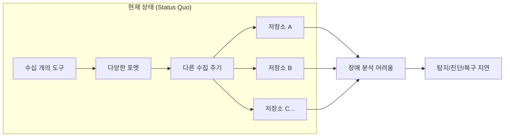
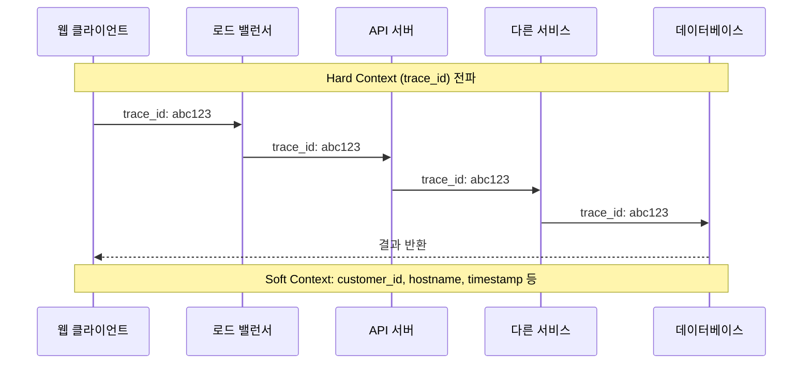
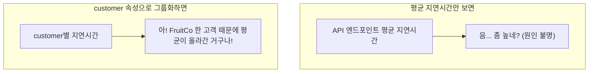
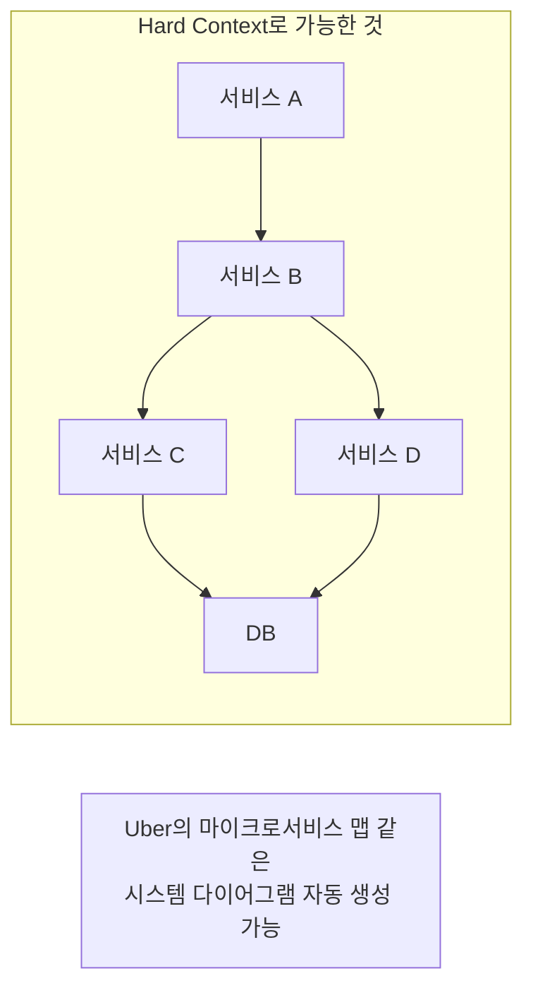
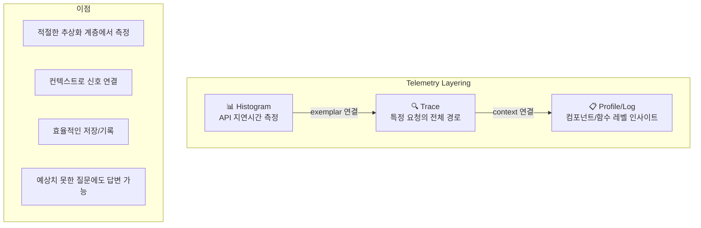

# Chapter 2: Why Use OpenTelemetry?

---

## 📌 핵심 요약
> 이 장에서는 OpenTelemetry가 왜 필요한지, 현재 프로덕션 모니터링의 문제점과 OpenTelemetry가 제공하는 해결책을 다룬다. 핵심은 **Hard/Soft Context를 통한 텔레메트리 통합**, **Telemetry Layering을 통한 신호 간 상호 보완**, **Semantic Telemetry를 통한 자기 설명적 데이터**다. OpenTelemetry는 단순한 표준이 아니라, 텔레메트리가 commodity가 되는 불가피한 미래다.

---

## 🎯 학습 목표
이 내용을 읽고 나면:
- [ ] Hard Context와 Soft Context의 차이를 설명할 수 있다
- [ ] Telemetry Layering 개념과 기존 로그 파싱 방식의 한계를 비교할 수 있다
- [ ] Semantic Telemetry의 중요성과 장점을 설명할 수 있다
- [ ] 개발자/운영자/조직 각각의 텔레메트리 요구사항을 구분할 수 있다
- [ ] OpenTelemetry가 제공하는 두 가지 핵심 가치를 설명할 수 있다

---

## 📖 본문 정리

### 1. 지도는 실제 영토가 아니다 (The Map Is Not the Territory)

> 💬 **비유**: Alfred Korzybski의 유명한 격언 "지도는 실제 영토가 아니다"는 우리가 머릿속에 구축하는 시스템의 지도가 실제와 다를 수밖에 없음을 의미한다.

소프트웨어 시스템에 대한 우리의 이해는 항상 제한적이다:
- 시스템이 **얼마나 거대한지**
- **얼마나 빠르게 변화**하는지
- **얼마나 많은 사람**이 동시에 수정하는지

생성형 AI 같은 새로운 기술은 이 문제를 더욱 부각시킨다 — 이들은 진정한 블랙박스로, 어떻게 결과에 도달하는지 거의 알 수 없다.

**텔레메트리와 Observability**는 이 괴리와 싸우는 가장 강력한 무기다. 그러나 현재의 텔레메트리 상태(status quo)는 지속 가능하지 않다. OpenTelemetry는 이 상태를 뒤집어, 더 많은 데이터가 아닌 **더 나은 데이터**를 제공하고자 한다.

---

### 2. 프로덕션 모니터링의 현실 (Production Monitoring: The Status Quo)

> 💬 **비유**: 당신이 성장하는 도시의 대중교통 시스템을 관리한다고 상상해보자. 처음엔 몇 대의 버스로 시작했지만, 점점 더 많은 노선, 경전철, 산업단지 연결 등이 추가된다.

모니터링해야 할 것들:
- 운행 중인 차량 수와 위치
- 승객 수 (자원 효율적 배분을 위해)
- 차량 정비 상태 (마모 예측, 긴급 수리 방지)
- 이해관계자별 다른 수준의 상세 정보

**이것이 소프트웨어에서의 현실과 같다:**



**이해관계자별 요구사항**:

| 이해관계자 | 필요한 데이터 |
|-----------|-------------|
| **개발자** | 코드의 특정 문제를 찾기 위한 상세한 텔레메트리 |
| **운영자** | 수백~수천 서버의 집계된 정보, 트렌드와 이상치 |
| **보안팀** | 수백만 이벤트 분석을 통한 침입 탐지 |
| **비즈니스 분석가** | 고객-기능 상호작용, 성능이 경험에 미치는 영향 |
| **경영진** | 시스템 전체 건강 상태, 우선순위 및 지출 결정 |

---

### 3. 프로덕션 디버깅의 도전 (The Challenges of Production Debugging)

대부분의 조직이 직면하는 세 가지 주요 도전:

| 도전 | 문제 | 공통 요인 |
|------|------|----------|
| **데이터 양** | 파싱해야 할 데이터가 너무 많다 | 텔레메트리 생성에 보편적 표준이 없음 |
| **데이터 품질** | 일관성 없는 형식과 정확도 | 텔레메트리 신호가 독립적으로 생성됨 |
| **데이터 연결** | 신호들이 어떻게 맞물리는지 알기 어렵다 | 기술적/조직적 장벽, 기존 시스템의 관성 |

**결과**:
- 장애 탐지와 복구에 더 오래 걸림
- 소프트웨어 엔지니어의 빠른 번아웃
- 소프트웨어 품질 저하

> *"(매우 큰) 조직에서 데이터 공유의 어려움 때문에 장애가 며칠, 심지어 몇 주씩 지속되는 이야기를 들었습니다."*

**Kubernetes 환경의 추가 어려움**:
- 컨테이너가 클러스터에 의해 마음대로 생성/파괴됨
- 수집되지 않은 로그도 함께 사라짐
- 워크로드가 실행되는 노드가 시간/분 단위로 변경될 수 있음
- "코드가 어디서 실행되는지"가 장애 관찰 중에도 변할 수 있음

---

### 4. 텔레메트리의 중요성 (The Importance of Telemetry)

Chapter 1에서 언급한 "세 기둥(three pillars)"이 아닌 **엮인 끈(interwoven braid)**이 필요하다.

OpenTelemetry가 실천하는 통합 텔레메트리의 세 가지 특성:
1. **Hard and Soft Context** - 경직된 컨텍스트와 유연한 컨텍스트
2. **Telemetry Layering** - 텔레메트리 계층화
3. **Semantic Telemetry** - 의미론적 텔레메트리

---

### 5. Hard Context vs Soft Context

이 장의 가장 핵심적인 개념이다.

**Context의 정의**: 시스템 운영과 텔레메트리 간의 관계를 설명하는 데 도움이 되는 메타데이터



| 구분 | Hard Context | Soft Context |
|------|-------------|--------------|
| **정의** | 분산 앱에서 동일 요청에 속한 서비스들이 전파하는 고유한 요청별 식별자 | 각 텔레메트리 계측기가 측정값에 첨부하는 메타데이터 |
| **예시** | trace_id, span_id | customer_id, hostname, timestamp |
| **관계** | 인과관계를 **직접적이고 명시적**으로 연결 | 연결할 수도 있지만 **보장되지 않음** |
| **용도** | 논리적 컨텍스트 (단일 최종 사용자 상호작용 매핑) | 측정값이 무엇을 나타내는지 설명 |

**컨텍스트 없이는 텔레메트리의 가치가 크게 줄어든다** — 측정값을 서로 연관시킬 수 없기 때문이다.

#### Soft Context의 한계



동시성이 낮은 시스템에서는 Soft Context만으로도 시스템 동작을 설명할 수 있다. 그러나 **복잡성과 동시성이 증가**하면 인간 운영자는 데이터 포인트에 압도당하고, 텔레메트리의 가치는 0으로 떨어진다.

#### Hard Context의 가치

Hard Context가 있으면:
- **같은 유형의 개별 측정값 연결**: 개별 span들을 trace로 연결
- **다른 유형의 계측기 연결**: 메트릭을 trace와 연결, 로그를 span에 연결
- **탐색 시간 극적 단축**: 이상 동작 조사 시간 감소
- **시각화 가능**: 서비스 맵(Service Map), 시스템 관계 다이어그램 자동 생성



> **요약**: Hard Context는 서비스와 신호 간의 관계를 정의하여 시스템의 전체 형태를 정의한다. Soft Context는 특정 신호가 무엇을 나타내는지 설명하는 고유한 차원을 생성한다.

---

### 6. Telemetry Layering (텔레메트리 계층화)

텔레메트리 신호는 일반적으로 **변환 가능**하다.

**예시**: CDN(Cloudflare 등)은 로그 문을 파싱하여 시계열 메트릭으로 변환한 대시보드를 제공한다.

**이 방식의 문제점**:

| 문제 | 설명 |
|------|------|
| **리소스 비용** | CPU와 메모리 소비 |
| **시간 비용** | 변환/변형이 많을수록 측정값 가용성 지연 |
| **관리 비용** | 변환 및 파싱 규칙 관리 = **Toil** |
| **알림 지연** | 사용자에게 장애가 발생해도 알림이 몇 분 후에야 뜸 |

**더 나은 해결책**: 신호를 **상호 보완적**으로 계층화하여 사용



**OpenTelemetry의 설계**:
- 메트릭에 **exemplar**를 붙여 특정 측정값을 trace와 연결
- 로그가 처리되면서 **trace context**에 첨부
- 처리량, 알림 임계값, SLO/SLA에 따라 **어떤 데이터를 내보내고 저장할지 결정** 가능

---

### 7. Semantic Telemetry (의미론적 텔레메트리)

> 모니터링(Monitoring)은 **수동적** 행위다. Observability는 **능동적** 실천이다.

아무리 컨텍스트가 풍부하고 계층화가 잘 되어 있어도, 결국 **비용 최적화 문제**다:

> *"시스템을 이해하기 위해 얼마를 쓸 의향이 있는가?"*

**비용에 영향을 미치는 요소들**:
- 저장 비용
- 네트워크 대역폭
- 텔레메트리 생성 오버헤드 (CPU/메모리)
- 분석 비용
- 알림 평가 속도

**현재의 고통**:
- 개발자가 제공할 수 있는 context 양이 제한됨 (메타데이터 = 저장/쿼리 비용 증가)
- 같은 데이터를 여러 목적으로 여러 번 처리 (예: HTTP 로그 → 성능팀 + 보안팀)
- 여러 도구를 돌아다니며 필요한 데이터 찾기
- 필요한 데이터가 비용 때문에 버려졌을 수도 있음

**OpenTelemetry의 접근: Portable, Semantic Telemetry**

| 특성 | 설명 |
|------|------|
| **Portable (이식성)** | 어떤 observability 프론트엔드와도 사용 가능 |
| **Semantic (의미론적)** | 자기 설명적 — 이름뿐 아니라 **"무엇을 측정하는지"**로 검색 가능 |

```
OpenTelemetry 메트릭 포인트 구조:
├── 메트릭 이름
├── 값
├── 타임스탬프
└── 메타데이터
    ├── 세분도 (granularity) - 프론트엔드가 쿼리 시각화에 활용
    └── 각 고유 속성의 설명 - 측정 대상 검색 가능
```

> OpenTelemetry는 시스템 이해의 **진화적 단계**다. 지난 20년간의 observability 정의 및 통합 작업의 총합이다.

---

### 8. 사람들에게 필요한 것 (What Do People Need?)

#### 개발자와 운영자 (Developers and Operators)

필요한 것:
- **고품질**, **고컨텍스트**, **고상관관계**, **계층화**된 observability 데이터
- **내장된** 텔레메트리 (나중에 추가하는 것이 아닌)
- **일관되게 유비쿼터스** (많은 소스에서 사용 가능)
- 여러 언어, 런타임, 클라우드에서 **일관된 방식**으로 수정 가능

현재 사용 가능한 계측 라이브러리: Log4j, StatsD, Prometheus, Zipkin, 각 벤더의 독점 API/SDK

> 계측 라이브러리의 선택이 시스템의 효과적인 observability를 제한할 수 있다. 올바른 신호를 올바른 컨텍스트와 시맨틱으로 내보낼 수 없으면, 특정 질문에 답할 수 없게 된다.

**속도와 이해의 역설**:
- 과거에는 시스템을 이해하는 사람들이 있었다 → QA
- CI/CD로 전통적 QA 프로세스가 대체되면서 시스템의 "형태"를 흡수하기 어려워짐
- **빠르게 갈수록, 무엇이 일어나고 있고 왜 그런지 설명하는 유비쿼터스하고 고품질인 텔레메트리가 더 필요**

#### 팀과 조직 (Teams and Organizations)

Observability의 이해관계자: 보안 분석가, 프로젝트 관리자, C-레벨 임원

모두에게 이로운 것:
- **벤더 종속을 방지**하는 오픈 표준
- **표준 데이터 형식**과 **와이어 프로토콜**
- **조합 가능하고, 확장 가능하며, 잘 문서화된** 계측 라이브러리와 도구

**표준 기반 접근의 이점**:

| 이점 | 설명 |
|------|------|
| **유지보수성** | 새 엔지니어가 맞춤 솔루션 대신 오픈 표준으로 지식 축적 |
| **미래 대비** | 2021-2023년 다수의 observability 제품 통합/인수/실패 발생 |
| **비용 통제** | Coinbase는 2022년 Datadog에 $65M 지출 |
| **호환성** | 기존 기능적 계측을 유지하면서 새로운 것 채택 가능 |

---

### 9. 왜 OpenTelemetry인가? (Why Use OpenTelemetry?)

#### Universal Standards (범용 표준)

OpenTelemetry가 제공하는 것:
- **고품질, 유비쿼터스 텔레메트리** 생성 방법
- **어떤 observability 프론트엔드**로도 전송 가능한 표준 방법 → **벤더 종속 제거**
- 클라우드 네이티브 소프트웨어의 **내장 기능**으로 만들기

**현재 상태 (2024년 기준)**:
- AWS, Azure, GCP 모두 OpenTelemetry 지원 및 표준화 진행 중
- 모든 주요 observability 플랫폼이 OpenTelemetry 데이터 수용
- 매달 더 많은 라이브러리/프레임워크가 채택 중

> *"OpenTelemetry는 텔레메트리가 진정한 상품(commodity)이 되는 미래를 예고한다... 단순히 떠오르는 표준이 아니다 — 이 시점에서 **불가피**하다."*

#### Correlated Data (상관관계 있는 데이터)

OpenTelemetry는 과거 관행의 단순한 성문화가 아니다.

> OpenTelemetry는 trace, metric, log를 한 곳에 모아놓은 게 아니다.
>
> 이 모든 조각이 **동일한 데이터 구조의 일부**이며, **시간에 따른 전체 시스템을 설명하는 단일 그래프**로 연결되어 있다.

이것이 가능하게 하는 것:
- 운영자가 수행하는 워크플로우를 효과적으로 모델링
- 머신러닝을 활용하여 직관하기 어려운 상관관계 발견
- 정규화되고 상호 연결된 텔레메트리

---

## 🔍 심화 학습

### Toil의 개념 (Google SRE)

책에서 언급된 **toil**은 Google SRE 문화에서 온 개념이다:

> Toil은 프로덕션 서비스 운영과 관련된 작업 중 **수동적이고, 반복적이며, 자동화 가능하고, 전술적이며, 지속적인 가치가 없고, 서비스 성장에 비례해 확대되는** 작업을 말한다.

로그를 파싱해서 메트릭으로 변환하는 작업이 대표적인 toil이다. OpenTelemetry의 Telemetry Layering은 이러한 toil을 제거한다.

### Context Propagation의 기술적 구현

Hard Context(trace_id, span_id)의 전파는 **W3C Trace Context** 표준을 따른다:

```http
traceparent: 00-0af7651916cd43dd8448eb211c80319c-b7ad6b7169203331-01
```

| 필드 | 크기 | 설명 |
|------|------|------|
| version | 2자리 | 항상 00 |
| trace-id | 32자리 | 128비트 고유 식별자 |
| parent-id | 16자리 | 64비트 span 식별자 |
| trace-flags | 2자리 | 8비트 플래그 (샘플링 여부 등) |

### Observability 비용 현실

책에서 언급된 Coinbase의 Datadog 비용($65M/년)은 실제 사례다.

**비용 최적화 전략**:
- 샘플링 전략 수립 (Head/Tail Sampling)
- 데이터 보존 기간 최적화
- 불필요한 메트릭 필터링
- OpenTelemetry Collector를 통한 데이터 전처리

### VOID Report 인사이트

책에서 인용된 VOID Report 2022는 흥미로운 통찰을 제공:
- 장애 심각도와 지속 시간 사이에 **관계가 없음**
- 텔레메트리에서 중요한 것은 MTTR 감소가 아닐 수 있음

### 출처
- [Google SRE Book - Eliminating Toil](https://sre.google/sre-book/eliminating-toil/)
- [W3C Trace Context Specification](https://www.w3.org/TR/trace-context/)
- [VOID Report 2022](https://www.thevoid.community/)

---

## 💡 실무 적용 포인트

### 이런 상황에서 사용하세요
- **다중 도구 환경**: 여러 모니터링 도구의 데이터가 연결되지 않아 장애 분석이 어려울 때
- **벤더 종속 탈피**: observability 도구 비용이 가파르게 증가하고 있을 때
- **마이크로서비스 전환**: 분산 시스템으로 전환하면서 요청 추적이 필요할 때
- **Kubernetes 환경**: 컨테이너의 동적 생성/파괴로 로그가 유실될 때

### 주의할 점 / 흔한 실수
- ⚠️ **Hard Context 미도입**: trace_id 전파 없이 Soft Context만 의존하면 동시성 높은 환경에서 분석 불가
- ⚠️ **로그 파싱 과의존**: 로그 → 메트릭 변환에만 의존하면 지연과 toil 발생
- ⚠️ **이해관계자 요구사항 무시**: 개발자/운영자/보안팀/경영진의 요구가 다름을 인식하지 못함
- ⚠️ **비용 고려 없는 도입**: 텔레메트리 볼륨과 저장 비용을 미리 계획하지 않음

### 면접에서 나올 수 있는 질문
- Q: Hard Context와 Soft Context의 차이점은 무엇인가요?
- Q: Telemetry Layering이 로그 파싱 방식보다 나은 이유는 무엇인가요?
- Q: OpenTelemetry가 제공하는 두 가지 핵심 가치는 무엇인가요?
- Q: observability 데이터의 비용을 최적화하는 방법은 무엇인가요?
- Q: 왜 텔레메트리 표준이 중요한가요?

---

## ✅ 핵심 개념 체크리스트
- [ ] Hard Context와 Soft Context의 차이를 한 문장으로 설명할 수 있는가?
- [ ] trace_id가 왜 Hard Context인지 이해하는가?
- [ ] Telemetry Layering의 개념과 장점을 설명할 수 있는가?
- [ ] "로그 파싱 → 메트릭 변환" 방식의 문제점(toil)을 아는가?
- [ ] Semantic Telemetry가 의미하는 바를 이해하는가?
- [ ] OpenTelemetry의 두 가지 핵심 가치(범용 표준, 상관관계)를 설명할 수 있는가?
- [ ] 이해관계자별 텔레메트리 요구사항이 다름을 이해하는가?
- [ ] 언제 OpenTelemetry를 도입해야 하는지 판단할 수 있는가?

---

## 🔗 참고 자료
- 📄 공식 문서: [OpenTelemetry Documentation](https://opentelemetry.io/docs/)
- 📄 W3C 표준: [Trace Context Specification](https://www.w3.org/TR/trace-context/)
- 📚 연관 서적: Charity Majors et al., *Observability Engineering* (O'Reilly, 2022)
- 📚 SRE 참고: [Google SRE Book - Eliminating Toil](https://sre.google/sre-book/eliminating-toil/)
- 🎬 추천 영상: [Uber Engineering Blog - Domain-Oriented Microservice Architecture](https://eng.uber.com/microservice-architecture/)
- 📄 논문: Alfred Korzybski, "A Non-Aristotelian System and Its Necessity for Rigour in Mathematics and Physics" (1931)

---
