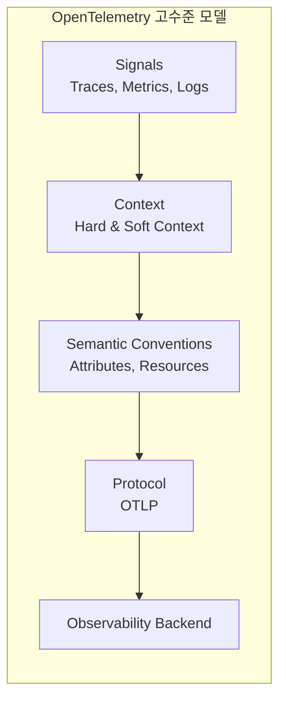
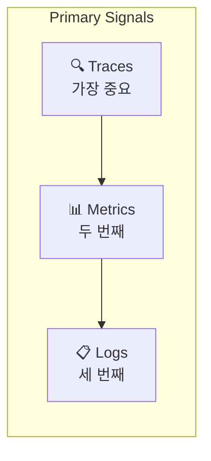
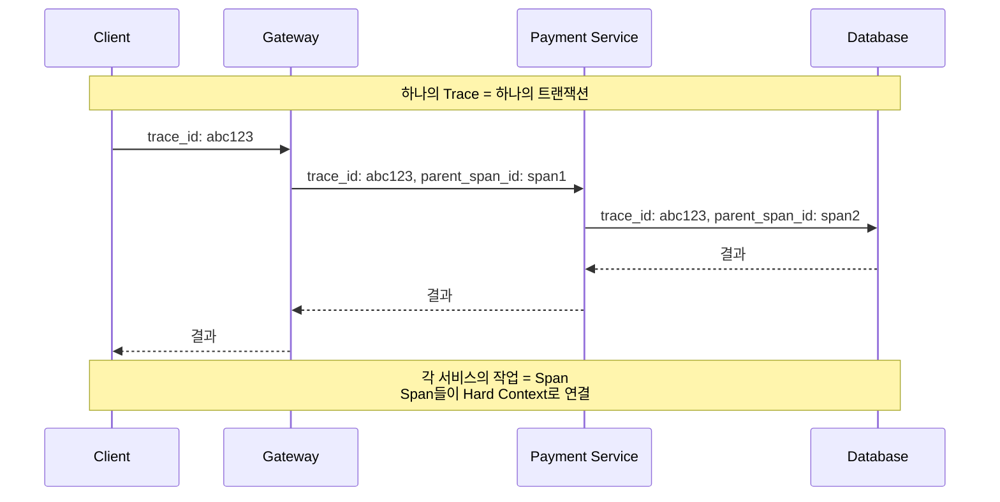
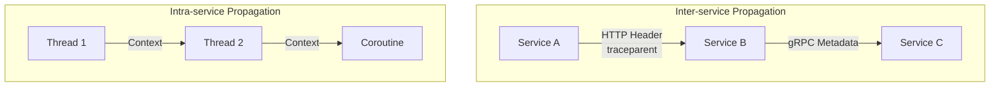
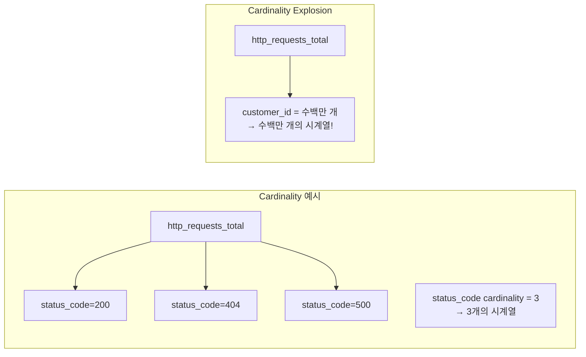
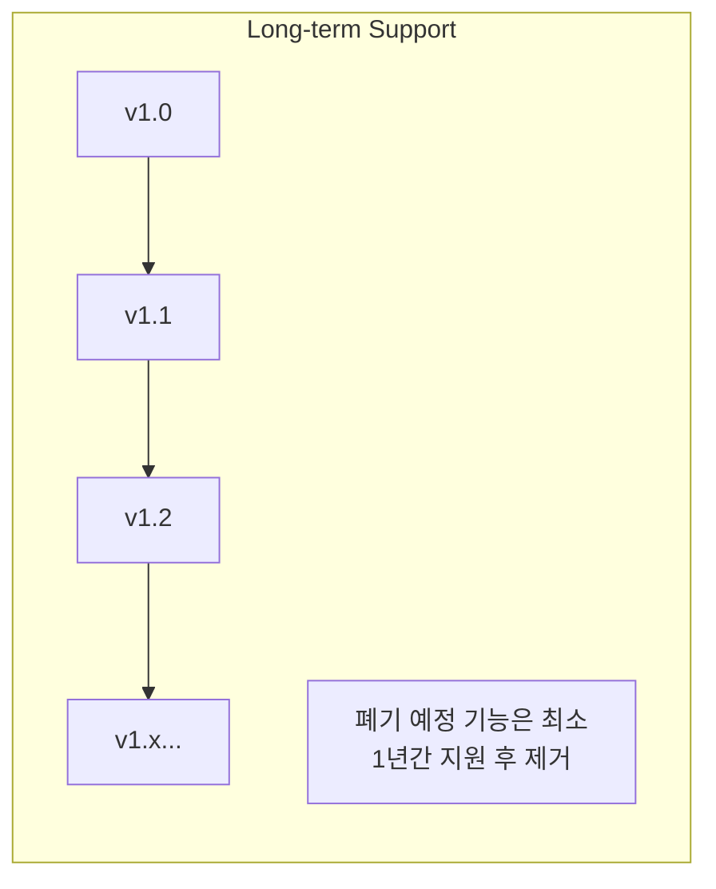
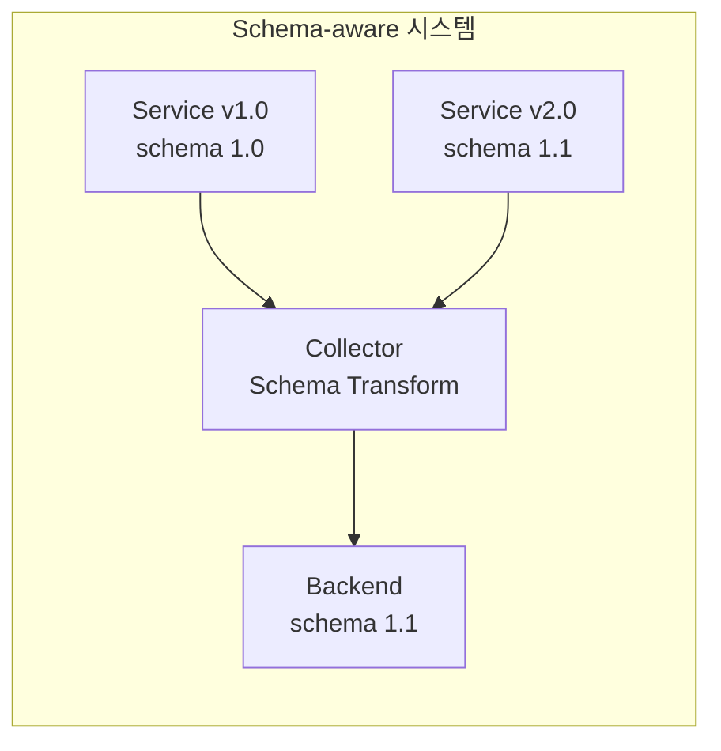

# Chapter 3: OpenTelemetry Overview

---

## 📌 핵심 요약
> 이 장에서는 OpenTelemetry의 전체 구조와 구성 요소를 다룬다. OpenTelemetry는 **세 가지 주요 신호(Traces, Metrics, Logs)**, 이들을 연결하는 **Context**, 일관된 메타데이터를 위한 **Semantic Conventions**, 그리고 표준 전송 형식인 **OTLP**로 구성된다. 핵심은 "의미론적으로 정확한 계측(semantically accurate instrumentation)"을 통해 클라우드 네이티브 소프트웨어를 위한 통합 텔레메트리를 제공하는 것이다.

---

## 🎯 학습 목표
이 내용을 읽고 나면:
- [ ] OpenTelemetry의 세 가지 주요 신호(Traces, Metrics, Logs)의 역할과 차이를 설명할 수 있다
- [ ] Context Layer가 신호들을 어떻게 연결하는지 이해할 수 있다
- [ ] Attributes와 Resources의 차이를 설명할 수 있다
- [ ] Semantic Conventions의 목적과 가치를 이해할 수 있다
- [ ] OTLP가 무엇이고 왜 중요한지 설명할 수 있다
- [ ] OpenTelemetry의 안정성 보장과 버전 관리 방식을 이해할 수 있다

---

## 📖 본문 정리

### 1. OpenTelemetry가 해결하는 두 가지 문제

> 💬 **인용**: "복잡성 자체는 전달할 수 없다. 오직 그것에 대한 인식만 전달할 수 있다." — Alan J. Perlis

OpenTelemetry는 두 가지 큰 문제를 해결한다:

| 문제 | 해결책 |
|------|--------|
| **1. 내장 계측 부재** | 개발자에게 코드에 네이티브 계측을 위한 단일 솔루션 제공 |
| **2. 호환성 부재** | 계측과 텔레메트리 데이터가 observability 생태계와 광범위하게 호환 |

**Native Instrumentation의 의미**:
- 라이브러리, 서비스, 관리형 시스템 등이 애플리케이션 코드에서 직접 다양한 텔레메트리 신호를 생성
- 이 신호들이 다른 신호들과 연결됨
- 공통 API/SDK뿐 아니라 **"명사와 동사"** — 의미(semantics)에 대한 공통 정의 세트 필요



---

### 2. 주요 Observability 신호 (Primary Observability Signals)

계측(Instrumentation)은 서비스나 시스템에 observability 코드를 추가하는 과정이다.

**두 가지 접근 방식**:

| 방식 | 설명 | 예시 |
|------|------|------|
| **White-box** | 서비스나 라이브러리에 직접 텔레메트리 코드 추가 | SDK를 사용한 수동 계측 |
| **Black-box** | 외부 에이전트나 라이브러리를 활용하여 코드 변경 없이 텔레메트리 생성 | Java Agent, Auto-instrumentation |

**OpenTelemetry의 세 가지 주요 신호** (중요도 순):



**신호의 목표**:
1. 실제 프로덕션 데이터와 서비스 간 통신을 사용하여 시스템 내 서비스 간 **관계 캡처**
2. 서비스가 무엇을 하고 어디서 실행되는지에 대한 일관되고 설명적인 **메타데이터로 주석 추가**
3. 임의의 측정값 그룹 간 관계를 **명확하게 식별** ("이것이 저것과 동시에 발생했다")
4. 시스템에서 발생하는 이벤트의 정확한 **카운트와 측정을 효율적으로 생성**

---

### 3. Traces (트레이스)

> 💬 **비유**: Trace는 잘 정의된 스키마를 따르는 로그 문의 집합이라고 생각할 수 있다.

**Trace의 정의**: 분산 시스템에서 작업을 모델링하는 방법



**Trace의 구성**:
- **Trace**: 주어진 트랜잭션에 대한 관련 로그(Span)들의 모음
- **Span**: 각 서비스에서 수행된 작업을 나타내는 개별 로그, 다양한 필드 포함

**Trace의 Semantic 이점**:

| 이점 | 설명 |
|------|------|
| **단일 트랜잭션 표현** | 하나의 trace = 사용자의 시스템 통과 경로 → 최종 사용자 경험 모델링에 최적 |
| **다차원 집계** | 여러 차원에서 집계하여 발견하기 어려운 성능 특성 발견 |
| **신호 변환** | 메트릭 등 다른 신호로 변환 가능, 원시 데이터 다운샘플링하면서 핵심 성능 정보 유지 |
| **Golden Signals 계산** | 단일 trace에 단일 요청의 지연시간, 트래픽, 에러, 포화도 정보 포함 |

> **Golden Signals**: Google SRE Handbook에서 정의한 시스템의 네 가지 핵심 측정값
> - **Latency**: 요청 처리 시간
> - **Traffic**: 요청 수
> - **Errors**: 실패한 요청 비율
> - **Saturation**: 시스템 리소스 활용도

---

### 4. Metrics (메트릭)

**Metrics의 정의**: 시스템 상태의 숫자 측정값과 기록

**예시**:
- 동시 로그인 사용자 수
- 디바이스의 사용된 디스크 공간
- VM에서 사용 가능한 RAM 양

**전통적 메트릭의 장점과 한계**:

| 장점 | 한계 |
|------|------|
| 생성과 저장이 저렴 | Hard Context 부재 — 특정 최종 사용자 트랜잭션과 상관관계 어려움 |
| 시스템 "큰 그림" 측정에 유용 | 수정이 어려움, 특히 서드파티 라이브러리/프레임워크 |
| 유비쿼터스, 빠름, 저렴 | 비용과 복잡성 제어가 주요 과제 |

**OpenTelemetry Metrics의 세 가지 목표**:

1. **개발자**: 코드에서 의미 있는 이벤트를 정의하고, 그것이 메트릭 신호로 어떻게 변환되는지 지정
2. **운영자**: 시간이나 속성을 집계/재집계하여 비용, 데이터 볼륨, 해상도 제어
3. **변환**: 측정의 본질적 의미를 변경하지 않음

**예시 시나리오**:
```
이미지 처리 서비스의 요청 크기 측정:
1. 메트릭 인스트루먼트로 바이트 단위 크기 기록
2. 이벤트에 집계 적용 (예: 시간 윈도우 내 최대 크기, 총 바이트 수)
3. 스트림을 다른 OpenTelemetry 컴포넌트로 내보내기
4. 속성 추가/제거, 시간 윈도우 수정 — 측정 의미는 유지
```

**핵심 요점**:
- OpenTelemetry 메트릭은 **semantic meaning** 포함 → 파이프라인/프론트엔드가 지능적으로 쿼리/시각화
- **Hard/Soft Context**로 다른 신호와 연결 → 비용 제어 등을 위한 텔레메트리 레이어링
- **StatsD, Prometheus 기본 지원** → 기존 메트릭 신호를 OpenTelemetry 생태계로 매핑

> **Exemplars**: OpenTelemetry 메트릭의 특별한 Hard Context. 이벤트를 특정 span과 trace에 연결할 수 있게 해줌.

---

### 5. Logs (로그)

**로그가 마지막인 이유**: 로그는 사용 편의성으로 유비쿼터스하지만, OpenTelemetry의 로그 지원은 **기존 로깅 API를 지원**하는 것에 더 가깝다.

**기존 로깅 솔루션의 문제점**:
- 다른 observability 신호와 **약하게 결합**됨
- 시간 윈도우 정렬이나 공유 속성 비교를 통한 **상관관계**에 의존
- 균일한 메타데이터 포함이나 인과관계 발견을 위한 연결에 **표준 방법 없음**
- 분산 시스템에서 **분리된 로그 집합**이 서로 다른 도구에 중앙화

**OpenTelemetry의 로그 모델**:
- 로그 문을 **trace context**로 풍부하게
- 동시에 기록된 **메트릭 및 트레이스와 연결**
- 기존 로그 문에서 기존 context가 있으면 해당 context와 연관

**로그를 사용하는 네 가지 이유**:

| 이유 | 설명 |
|------|------|
| **추적 불가 서비스** | 레거시 코드, 메인프레임 등 추적할 수 없는 시스템에서 신호 추출 |
| **인프라 상관관계** | 관리형 DB, 로드 밸런서 등 인프라 리소스와 애플리케이션 이벤트 연결 |
| **비요청 동작 이해** | cron job 등 사용자 요청과 무관한 시스템 동작 |
| **다른 신호로 처리** | 메트릭이나 트레이스로 변환 |

---

### 6. Observability Context

신호가 측정값이나 데이터 포인트를 제공한다면, **context는 그 데이터를 관련성 있게 만든다**.

> 💬 **비유**: 도시 전체에서 버스를 기다리는 사람 수를 아는 것은 유용하지만, 그 사람들이 **어디서** 기다리는지 context 없이는 어디에 버스를 추가해야 할지 알 수 없다.

**OpenTelemetry의 세 가지 기본 Context 유형**:

| 유형 | 설명 |
|------|------|
| **Time** | 언제 발생했는가? |
| **Attributes** | 무엇을 나타내는가? (메타데이터) |
| **Context Object** | 실행 범위 값을 전달하는 전파 메커니즘 |

> ⚠️ **시간의 신뢰성 문제**: 시간은 이벤트 순서를 정하는 논리적 방법처럼 보이지만, 분산 시스템에서는 매우 신뢰할 수 없다. 클럭 드리프트, 스레드 일시 정지, 리소스 고갈, 네트워크 연결 손실 등으로 인해 단일 JavaScript 프로세스에서도 시스템 클럭이 1시간 동안 ~100ms의 정밀도를 잃을 수 있다.

---

### 7. Context Layer

**Context의 정의** (OpenTelemetry Context Specification):
> "API 경계를 가로지르고 논리적으로 연관된 실행 단위 간에 실행 범위 값을 전달하는 전파 메커니즘"



**Context가 정보를 전달하는 곳**:
- 같은 컴퓨터의 두 서비스 간 (파이프 통해)
- 서로 다른 서버 간 (RPC 통해)
- 단일 프로세스의 서로 다른 스레드 간

**Context Layer의 목표**:
- 기존 context manager와 깔끔한 인터페이스 제공 (Golang의 `context.Context`, Java `ThreadLocals`, Python `context manager`)
- 하나 이상의 **Propagator** 보유

**Propagators**:
- 한 프로세스에서 다음으로 값을 실제로 전송하는 방법
- 요청 시작 시 등록된 propagator 기반으로 고유 식별자 생성
- 식별자를 context에 추가 → 직렬화 → 다음 서비스로 전송 → 역직렬화 → 로컬 context에 추가

> **Baggage**: Propagator가 전달하는 soft-context 값. 생성된 곳에서 시스템의 다른 부분으로 특정 값(예: customer ID, session ID)을 전송하기 위한 것.
> ⚠️ **주의**: 한번 추가되면 제거할 수 없고, 외부 시스템에도 전송됨!

---

### 8. Attributes와 Resources

**Attributes**:
- 다른 모니터링 시스템에서 fields 또는 tags라고도 함
- 텔레메트리 조각이 무엇을 나타내는지 알려주는 **메타데이터**
- 필터링하거나 그룹화하고 싶은 것들

> 💬 **비유**: 대중교통 시스템에서 승객 수만 알면 하나의 수치. Attributes(교통 수단, 출발역, 이름 등)가 있으면 "어떤 교통 수단이 가장 인기 있는가?", "특정 역이 과부하인가?" 등 훨씬 흥미로운 질문 가능.

**분산 시스템에서 고려할 차원들**:
- 워크로드의 region/zone
- 서비스가 실행 중인 특정 pod/node
- 요청이 발행된 customer/organization
- 큐의 메시지 topic ID/shard

**Attributes 요구사항**:

| 요구사항 | 설명 |
|----------|------|
| **값 유형** | string, boolean, floating point, signed integer, 또는 동일 타입의 배열 |
| **키 중복 불가** | 단일 키에 여러 값을 할당하려면 배열 사용 |
| **기본 제한** | 단일 텔레메트리당 최대 128개 고유 attributes |
| **값 길이 제한** | 없음 |

**제한 이유**:

1. **메모리 할당**: SDK가 각 attribute에 메모리 할당 필요, 예상치 못한 동작이나 코드 오류 시 메모리 부족 가능
2. **Cardinality Explosion**: 메트릭 인스트루먼트에 attribute 추가 시 시계열 DB에서 발생



**Cardinality 관리 방법**:
1. observability 파이프라인, views 등을 사용하여 메트릭/트레이스/로그의 cardinality 감소
2. 높은 cardinality의 attribute는 메트릭에서 생략하고 span/log에서 사용

**Resources**:
- **특별한 유형의 attribute**
- **차이점**: Attributes는 요청마다 변경 가능, Resources는 **프로세스 전체 수명 동안 동일**
- **예시**: 서버의 hostname = resource attribute, customer ID = 일반 attribute

---

### 9. Semantic Conventions

> 💬 **인용**: "나머지는 잘 모르겠지만, 이 semantic conventions는 한동안 본 것 중 가장 가치 있는 것 같습니다." — Prometheus 메인테이너

**문제점**: 시스템 운영자가 여러 클라우드, 애플리케이션 런타임, 하드웨어 아키텍처, 프레임워크/라이브러리 버전에서 attribute 키, 값, 그것이 나타내는 것이 동일한지 확인하기 위해 상당한 toil 필요

**Semantic Conventions의 목적**: 개발자에게 잘 알려지고 잘 정의된 **단일 attribute 키와 값 세트** 제공

**두 가지 출처**:

| 출처 | 설명 |
|------|------|
| **프로젝트 공식** | OpenTelemetry가 설명하고 제공하는 conventions. 독립적으로 버전 관리, 스키마 포함 |
| **플랫폼 팀/내부** | 기술 스택이나 서비스에 특정한 attributes/values를 포함하는 자체 conventions 라이브러리 |

**Semantic Conventions의 범위**:
- **리소스 메타데이터**: 서버 호스트명, IP 주소, 클라우드 region
- **특정 명명 규칙**: HTTP 라우트, 서버리스 실행 환경 정보, pub-sub 메시징 큐 방향

**이점**:

| 수혜자 | 이점 |
|--------|------|
| **중앙화된 observability 팀** | 팀 간 일관된 attributes 보장 도구 제공 |
| **내부 플랫폼 메인테이너** | 페이지 분량의 재작성 규칙 대신 내장 OpenTelemetry 함수로 변환 적용 |
| **서드파티 라이브러리/프레임워크 개발자** | 소프트웨어와 함께 observability 제공, 모니터링/알림용 잘 정의된 attributes |

> **Merging Standards**: 2023년 4월, OpenTelemetry와 Elastic이 Elastic Common Schema를 OpenTelemetry Semantic Conventions와 병합 발표. 완료되면 텔레메트리 메타데이터에 대한 경쟁 표준 감소.

---

### 10. OpenTelemetry Protocol (OTLP)

**OTLP의 정의**: observability 데이터를 위한 **표준 데이터 형식과 프로토콜**

**특징**:
- 에이전트, 서비스, 백엔드 간 텔레메트리 전송을 위한 **단일 well-supported wire format**
- **바이너리와 텍스트 기반 인코딩** 모두 지원
- 낮은 CPU와 메모리 사용 목표

**이점**:

| 역할 | 이점 |
|------|------|
| **텔레메트리 생산자** | 기존 텔레메트리 내보내기 형식과 얇은 변환 레이어로 OTLP 타겟팅 가능, 수백 개의 통합 존재 |
| **텔레메트리 소비자** | 수십 개의 오픈소스/상용 도구와 함께 OTLP 사용 가능, 독점 lock-in에서 해방 |
| **유연성** | 플랫 파일, 컬럼 스토어, Kafka 등 이벤트 큐로 내보내기 가능, 무한한 커스터마이징 |

**OTLP의 미래 보장**:
- OpenTelemetry 프로젝트의 살아있는 부분
- 새 신호에 업데이트 필요하지만 레거시 수신기/내보내기와 **하위 호환성 유지**
- 새 기능을 위한 데이터 형식 업그레이드가 필요할 수 있지만, OTLP의 텔레메트리는 분석 도구와 호환성 유지

---

### 11. 호환성과 미래 대비 (Compatibility and Future-Proofing)

**OpenTelemetry의 기반**:
1. 표준 기반 context와 conventions
2. 범용 데이터 형식

**버전 관리와 안정성 가이드**:
> **OpenTelemetry v2.0은 절대 없다.** 모든 업데이트는 v1.0 라인을 따라 계속되며, 폐기와 변경은 게시된 일정에 따라 진행.



**Telemetry Schemas**:
- 시간이 지남에 따른 semantic conventions 변경을 해결하기 위한 개념
- Schema-aware 분석 도구와 스토리지 백엔드 구축
- OpenTelemetry Collector가 schema 변환 수행
- 기존 서비스를 재계측하거나 출력을 재정의하지 않고 semantic conventions 변경의 이점 활용



---

## 🔍 심화 학습

### White-box vs Black-box Instrumentation 상세

| 방식 | 장점 | 단점 | 사용 시나리오 |
|------|------|------|--------------|
| **White-box** | 정밀한 제어, 커스텀 span/attribute 추가 용이 | 코드 변경 필요, 유지보수 부담 | 비즈니스 로직 계측, 커스텀 메트릭 |
| **Black-box** | 코드 변경 없음, 빠른 도입 | 제한된 커스터마이징, 프레임워크 의존 | 레거시 시스템, 빠른 PoC |

### Cardinality Explosion 실제 사례

많은 조직이 다음과 같은 실수로 cardinality explosion을 경험:
- `user_id`를 메트릭 label로 사용
- `request_id`를 메트릭에 추가
- 타임스탬프를 label 값으로 사용

**해결 전략**:
1. 높은 cardinality attribute는 trace에만 사용
2. 메트릭에는 bounded cardinality attribute만 사용 (status_code, method 등)
3. OpenTelemetry Collector의 `metricstransform` 프로세서로 attribute 제거

### W3C Trace Context 외 다른 Propagator

OpenTelemetry는 W3C Trace Context를 기본으로 사용하지만 다른 옵션도 지원:

| Propagator | 사용 시나리오 |
|------------|--------------|
| **W3C Trace Context** | 기본, 표준 준수 |
| **B3** | Zipkin 호환성 필요 시 |
| **AWS X-Ray** | AWS 환경 통합 |
| **Jaeger** | Jaeger 레거시 시스템 |

### 출처
- [OpenTelemetry Semantic Conventions](https://opentelemetry.io/docs/specs/semconv/)
- [OTLP Specification](https://opentelemetry.io/docs/specs/otlp/)
- [Google SRE Book - Monitoring Distributed Systems](https://sre.google/sre-book/monitoring-distributed-systems/)

---

## 💡 실무 적용 포인트

### 이런 상황에서 사용하세요
- **새 프로젝트 시작**: 처음부터 OpenTelemetry SDK로 계측
- **기존 Prometheus/StatsD 환경**: OTLP로 점진적 마이그레이션
- **마이크로서비스 아키텍처**: Traces로 서비스 간 관계 자동 매핑
- **멀티 클라우드 환경**: Semantic Conventions로 클라우드 간 일관성 확보

### 주의할 점 / 흔한 실수
- ⚠️ **Cardinality Explosion**: 메트릭에 고유 ID(user_id, request_id)를 label로 추가하지 말 것
- ⚠️ **Baggage 남용**: 한번 추가하면 제거 불가, 외부에도 전송됨
- ⚠️ **과도한 Attributes**: 단일 telemetry당 128개 제한, 메모리와 대역폭 고려
- ⚠️ **시간 의존 상관관계**: 분산 시스템에서 클럭 드리프트로 시간 기반 상관관계 불안정

### 면접에서 나올 수 있는 질문
- Q: OpenTelemetry의 세 가지 주요 신호는 무엇이고, 각각 언제 사용하나요?
- Q: Trace와 Span의 관계를 설명해주세요.
- Q: Attributes와 Resources의 차이점은 무엇인가요?
- Q: Cardinality Explosion이란 무엇이고 어떻게 방지하나요?
- Q: OTLP의 장점은 무엇인가요?
- Q: Semantic Conventions가 왜 중요한가요?

---

## ✅ 핵심 개념 체크리스트
- [ ] Traces, Metrics, Logs 각각의 역할과 사용 시나리오를 설명할 수 있는가?
- [ ] White-box와 Black-box 계측의 차이를 아는가?
- [ ] Context Layer가 신호들을 어떻게 연결하는지 이해하는가?
- [ ] Propagators와 Baggage의 역할을 설명할 수 있는가?
- [ ] Attributes와 Resources의 차이를 아는가?
- [ ] Cardinality Explosion을 이해하고 방지 방법을 아는가?
- [ ] Semantic Conventions의 목적과 가치를 설명할 수 있는가?
- [ ] OTLP가 제공하는 이점을 설명할 수 있는가?
- [ ] OpenTelemetry의 버전 관리와 하위 호환성 정책을 아는가?

---

## 🔗 참고 자료
- 📄 공식 문서: [OpenTelemetry Specification](https://opentelemetry.io/docs/specs/)
- 📄 Semantic Conventions: [OpenTelemetry Semantic Conventions](https://opentelemetry.io/docs/specs/semconv/)
- 📄 OTLP: [OpenTelemetry Protocol Specification](https://opentelemetry.io/docs/specs/otlp/)
- 📚 연관 서적: Google SRE Handbook - [Monitoring Distributed Systems](https://sre.google/sre-book/monitoring-distributed-systems/)
- 🎬 추천 영상: [OpenTelemetry Overview - CNCF](https://www.youtube.com/watch?v=r8UvWSX3KA8)
- 📄 Golden Signals: [The Four Golden Signals](https://sre.google/sre-book/monitoring-distributed-systems/#xref_monitoring_golden-signals)

---
