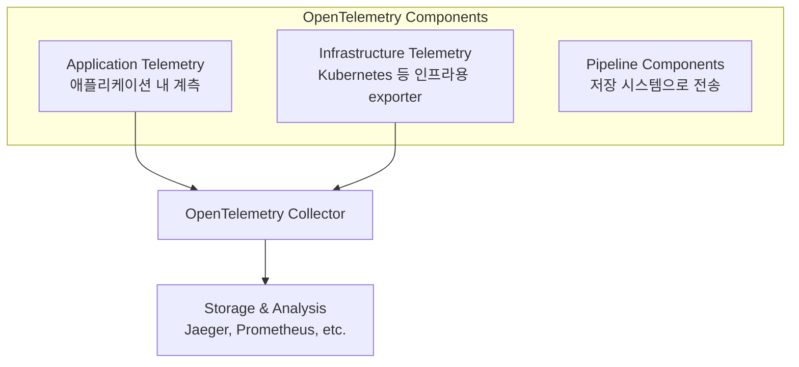
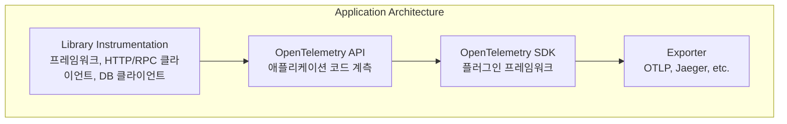
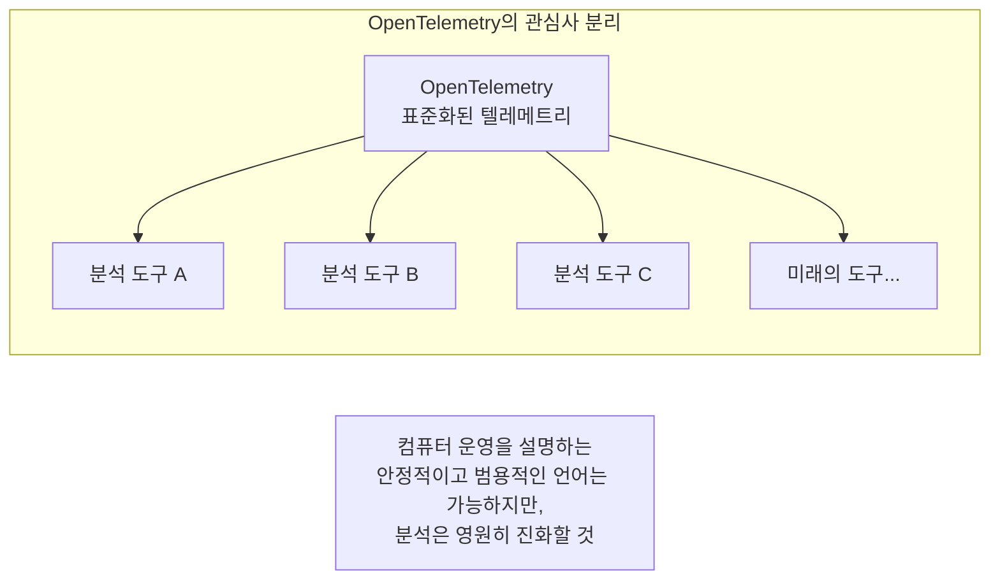
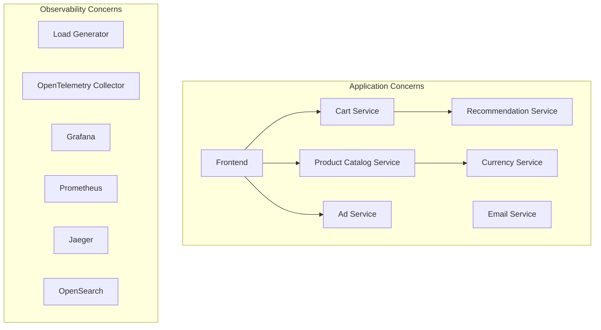
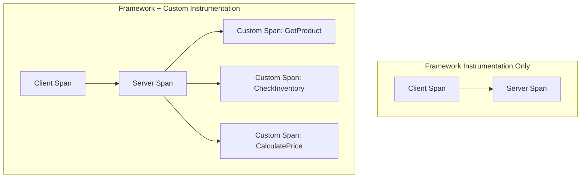
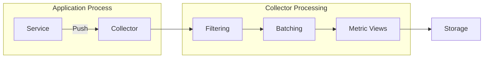
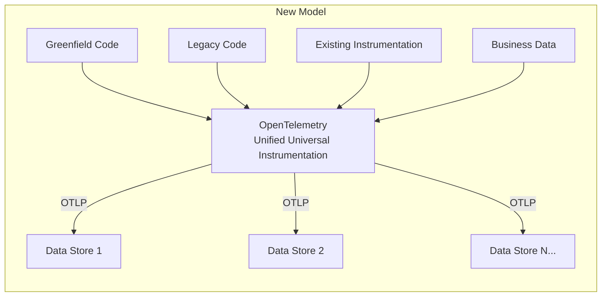

# Chapter 4: The OpenTelemetry Architecture

---

## 📌 핵심 요약
> 이 장에서는 OpenTelemetry의 세 가지 구성 요소 유형(**애플리케이션 텔레메트리**, **인프라 텔레메트리**, **텔레메트리 파이프라인**)과 실제 데모 애플리케이션(Astronomy Shop)을 통한 실습을 다룬다. 핵심은 OpenTelemetry가 **저장 및 분석 도구를 포함하지 않는다**는 점이며, 이는 표준화된 텔레메트리가 끊임없이 진화하는 분석 도구 생태계에 데이터를 공급하는 **관심사의 분리** 원칙 때문이다.

---

## 🎯 학습 목표
이 내용을 읽고 나면:
- [ ] OpenTelemetry의 세 가지 구성 요소 유형을 설명할 수 있다
- [ ] API, SDK, Library Instrumentation의 관계를 이해할 수 있다
- [ ] OpenTelemetry가 포함하지 않는 것과 그 이유를 설명할 수 있다
- [ ] Automatic Instrumentation과 Manual Instrumentation의 차이를 이해할 수 있다
- [ ] OpenTelemetry Demo를 설치하고 실행할 수 있다
- [ ] 새로운 Observability 모델의 핵심 개념을 이해할 수 있다

---

## 📖 본문 정리

### 1. OpenTelemetry 구성 요소 개요

> 💬 **인용**: "디버깅은 프로그램을 작성하는 것보다 두 배 어렵다. 따라서 작성할 때 최대한 영리하게 한다면, 어떻게 디버깅할 것인가?" — Brian W. Kernighan & P. J. Plauger

OpenTelemetry는 **세 가지 유형의 구성 요소**로 구성된다:



---

### 2. Application Telemetry (애플리케이션 텔레메트리)

**가장 중요한 텔레메트리 소스**는 애플리케이션이다. OpenTelemetry가 제대로 작동하려면 **모든 애플리케이션에 설치**되어야 한다.



#### Library Instrumentation

| 특징 | 설명 |
|------|------|
| **가장 중요한 텔레메트리** | OSS 라이브러리(프레임워크, HTTP/RPC 클라이언트, DB 클라이언트)에서 발생 |
| **대부분의 작업 커버** | 이 라이브러리들이 대부분의 heavy lifting 수행 |
| **별도 설치 필요** | 대부분의 OSS 라이브러리는 아직 네이티브 계측되지 않음 |
| **OpenTelemetry 제공** | 많은 인기 있는 OSS 라이브러리용 계측 라이브러리 제공 |

#### OpenTelemetry API

- 애플리케이션 코드와 비즈니스 로직의 **중요한 부분 계측**에 사용
- Library Instrumentation도 이 API로 작성됨 → 애플리케이션 계측과 라이브러리 계측에 **근본적 차이 없음**

> **특별한 기능**: OpenTelemetry가 설치되지 않은 애플리케이션에서도 **안전하게 호출 가능**. OSS 라이브러리가 OpenTelemetry 계측을 포함해도 사용하지 않는 앱에서는 **zero-cost no-op**으로 작동.

#### OpenTelemetry SDK

- API 호출이 실제로 처리되려면 **OpenTelemetry 클라이언트(SDK) 설치** 필요
- **플러그인 프레임워크**: 샘플링 알고리즘, 라이프사이클 훅, exporter로 구성
- 환경 변수 또는 YAML 설정 파일로 구성 가능

> ⚠️ **중요**: SDK만 설치하면 된다고 생각하기 쉽지만, **모든 중요한 라이브러리에 대한 계측**도 필요하다. 설치 시 애플리케이션을 감사하고 필요한 라이브러리 계측이 사용 가능하고 올바르게 설치되었는지 확인해야 한다.

---

### 3. Infrastructure Telemetry (인프라 텔레메트리)

애플리케이션은 **환경에서 실행**된다.

**클라우드 컴퓨팅 환경 구성**:
- 애플리케이션이 실행되는 호스트
- 애플리케이션 인스턴스 관리에 사용되는 플랫폼
- 클라우드 제공자가 운영하는 네트워킹 및 데이터베이스 서비스

**OpenTelemetry의 역할**:
- Kubernetes 및 기타 클라우드 서비스에 점진적으로 추가되는 중
- OpenTelemetry 없이도 대부분의 인프라 서비스는 유용한 텔레메트리 생성
- **기존 데이터를 수집**하고 애플리케이션 텔레메트리 파이프라인에 추가하는 컴포넌트 제공

---

### 4. Telemetry Pipelines (텔레메트리 파이프라인)

애플리케이션과 인프라에서 수집된 텔레메트리는 **저장 및 분석을 위해 observability 도구로 전송**되어야 한다.

**도전 과제**:

| 도전 | 설명 |
|------|------|
| **데이터 양** | 대규모 분산 시스템의 텔레메트리는 엄청날 수 있음 |
| **네트워킹 이슈** | egress, 로드 밸런싱, backpressure가 중요해짐 |
| **레거시 시스템** | 다양한 observability 도구, 데이터 처리 요구사항, 복잡한 토폴로지 |

**두 가지 주요 컴포넌트**:
1. **OTLP** (OpenTelemetry Protocol) - Chapter 3에서 논의
2. **Collector** - Chapter 8에서 상세 설명

---

### 5. OpenTelemetry가 포함하지 않는 것

> ⚠️ **중요**: OpenTelemetry가 포함하지 않는 것도 포함하는 것만큼 중요하다.

**포함하지 않는 것**:
- 장기 저장소
- 분석
- GUI
- 기타 프론트엔드 컴포넌트

**이유: 표준화**



> OpenTelemetry 프로젝트는 "공식" observability 백엔드를 포함하도록 확장되지 않을 것이다. **표준화된 텔레메트리가 끊임없이 진화하는 분석 도구 환경에 데이터를 공급**하는 관심사의 분리가 OpenTelemetry가 세상을 보는 방식의 근본이다.

---

### 6. OpenTelemetry Demo 실습

#### 사전 준비

| 요구사항 | 권장 사양 |
|----------|----------|
| **RAM** | 16GB 이상 |
| **디스크** | 20GB 이상 (컨테이너 이미지용) |
| **필수 도구** | Docker, Git |

#### 설치 방법

```bash
# 1. 저장소 클론
git clone https://github.com/open-telemetry/opentelemetry-demo.git

# 2. 루트 디렉토리에서 실행
cd opentelemetry-demo
make start
```

**성공 시 출력**:
```
OpenTelemetry Demo is running.
Go to http://localhost:8080 for the demo UI.
Go to http://localhost:8080/jaeger/ui for the Jaeger UI.
Go to http://localhost:8080/grafana/ for the Grafana UI.
Go to http://localhost:8080/loadgen/ for the Load Generator UI.
Go to http://localhost:8080/feature/ for the Feature Flag UI.
```

---

### 7. Astronomy Shop 아키텍처

**14개의 마이크로서비스**로 구성된 이커머스 애플리케이션



**두 가지 기본 부분**:

| 구분 | 역할 | 예시 |
|------|------|------|
| **Application Concerns** | 비즈니스 로직과 기능 요구사항 처리 | Email Service, Currency Service |
| **Observability Concerns** | 전체 observability 담당 | Collector, Grafana, Prometheus, Jaeger |

**통신 방식**: gRPC (또는 HTTP를 통한 JSON Protobuffers)
- 많은 조직이 단일 RPC 프레임워크로 표준화
- OpenTelemetry가 gRPC를 지원하고 유용한 계측 포함 → "무료"로 풍부한 텔레메트리 데이터

---

### 8. Automatic Instrumentation 예시

#### Java (Ad Service)

Dockerfile에서 에이전트를 다운로드하고 서비스와 함께 실행:
- 빌드 시 에이전트 다운로드
- 컨테이너에 복사
- 서비스와 함께 실행
- **개발자가 아무것도 작성하지 않아도** 필요한 계측 추가

#### .NET (Cart Service)

.NET에서는 OpenTelemetry가 **런타임 자체에 통합**됨 — 활성화만 하면 됨:

```csharp
// /src/cartservice/src/Program.cs 52번째 줄
builder.Services.AddOpenTelemetry()  // DI 컨테이너에 OpenTelemetry 추가
    .ConfigureResource(appResourceBuilder)
    .WithTracing(tracerBuilder => tracerBuilder
        .AddRedisInstrumentation(
            options => options.SetVerboseDatabaseStatements = true)
        .AddAspNetCoreInstrumentation()
        .AddGrpcClientInstrumentation()  // gRPC 클라이언트 계측 활성화
        .AddHttpClientInstrumentation()
        .AddOtlpExporter())  // Collector로 OTLP 내보내기
    .WithMetrics(meterBuilder => meterBuilder  // 메트릭도 수집
        .AddProcessInstrumentation()
        .AddRuntimeInstrumentation()
        .AddAspNetCoreInstrumentation()
```

> **핵심**: 프레임워크 수준에서 **매우 적은 노력으로** 가치 있는 텔레메트리 제공

---

### 9. Custom Instrumentation의 가치

Automatic Instrumentation만으로는 **도메인/비즈니스 특정 로직과 메타데이터**를 알 수 없다.



**예시: Product Catalog Service**

```go
// /src/productcatalogservice/main.go 198-202번째 줄
func (p *productCatalog) GetProduct(ctx context.Context, req *pb.GetProductRequest)
          (*pb.Product, error) {
    span := trace.SpanFromContext(ctx)  // Context에서 현재 span 가져오기
    span.SetAttributes(
        attribute.String("app.product.id", req.Id),  // 커스텀 attribute 추가
    )
}
```

**Go에서의 특징**:
- OpenTelemetry context는 Context에서 전달
- 기존 span을 수정하거나 새 span을 시작하려면 Context에서 현재 span 가져오기
- OpenTelemetry는 semantic하므로 **attribute와 값을 강하게 타입화** 필요

---

### 10. Demo에서의 Observability Pipeline

**선호하는 방식**: 프로세스에서 OpenTelemetry Collector 인스턴스로 데이터 **push**



**두 가지 이유**:

| 이유 | 설명 |
|------|------|
| **빠른 내보내기** | 텔레메트리를 가능한 빨리 서비스에서 내보내기. 애플리케이션 수준 처리가 많을수록 오버헤드 증가 |
| **크래시 방지** | 앱이 export/scrape 전에 크래시하면 인사이트 손실 |

> ⚠️ **주의**: 너무 많은 텔레메트리는 로컬 네트워크 링크를 압도하고 다른 계층에서 성능 문제를 일으킬 수 있다. OpenTelemetry 인프라의 **메타모니터링**을 활성화하는 것이 좋다.

---

### 11. 새로운 Observability 모델 (The New Observability Model)

**기존 모델의 문제점**:
- 대부분의 도구가 **수직 통합**됨
- 계측과 수집 파이프라인을 제어해야 효율성 확보 가능
- 데이터 파이프라인을 더 이상 제어하지 않으면 많은 것이 무산됨

**OpenTelemetry가 변화시키는 것**:



**미래의 Observability 플랫폼**:
- **Universal Query API**: 다양한 데이터 스토어에서 원활하게 텔레메트리 데이터 가져오기
- **자연어 쿼리**: 단일 쿼리 언어에 갇히지 않고 AI 도구 지원으로 쉽게 찾기
- **특화된 분석 도구**: 대형 플랫폼 대신 특정 문제 해결을 위한 도구 선택 가능

**현재 진행 상황** (집필 시점 기준):
- 새로운 observability 도구들이 OpenTelemetry만으로 계측에 의존
- 오픈소스 컬럼 스토어 기반 도구들이 고컨텍스트 텔레메트리 데이터에 적합
- Microsoft, AWS가 OpenTelemetry 일급 지원 발표
- OpenSearch, ClickHouse 등이 OpenTelemetry 데이터 저장에 인기

---

## 🔍 심화 학습

### Automatic vs Manual Instrumentation 비교

| 구분 | Automatic (Zero-code) | Manual |
|------|----------------------|--------|
| **설정** | 에이전트 또는 라이브러리 추가만으로 완료 | 코드에 직접 계측 추가 |
| **커버리지** | 프레임워크, HTTP, gRPC, DB 클라이언트 | 비즈니스 로직, 커스텀 메트릭 |
| **유연성** | 제한적 | 완전한 제어 |
| **유지보수** | 낮음 | 높음 |
| **사용 시나리오** | 빠른 도입, 프레임워크 수준 가시성 | 비즈니스 인사이트, 상세 분석 |

### Spanmetrics Connector

Demo에서 사용되는 **spanmetrics connector**는 trace 데이터에서 메트릭을 생성:

```yaml
# Collector 설정 예시
connectors:
  spanmetrics:
    histogram:
      explicit:
        buckets: [100ms, 250ms, 500ms, 1s, 2.5s, 5s, 10s]
    dimensions:
      - name: http.method
      - name: http.status_code
```

**이점**:
- 별도의 메트릭 계측 없이 APM 스타일 대시보드 생성
- 지연시간, 에러율, 처리량을 trace에서 추출

### Feature Flags로 장애 시뮬레이션

Demo의 Feature Flag UI에서 활성화 가능한 시뮬레이션:

| Flag | 효과 |
|------|------|
| `cartServiceFailure` | Cart Service에서 간헐적 오류 발생 |
| `adServiceFailure` | Ad Service에서 간헐적 오류 발생 |
| `productCatalogFailure` | 특정 product ID에서 오류 발생 |

### 출처
- [OpenTelemetry Demo Documentation](https://opentelemetry.io/docs/demo/)
- [OpenTelemetry Demo GitHub](https://github.com/open-telemetry/opentelemetry-demo)
- [Spanmetrics Connector](https://github.com/open-telemetry/opentelemetry-collector-contrib/tree/main/connector/spanmetricsconnector)

---

## 💡 실무 적용 포인트

### 이런 상황에서 사용하세요
- **새 프로젝트 시작**: Demo를 참조 아키텍처로 활용
- **PoC 진행**: Demo로 OpenTelemetry 가치 증명
- **팀 교육**: Demo를 사용하여 OpenTelemetry 개념 학습
- **아키텍처 설계**: Application/Observability concerns 분리 패턴 참조

### 주의할 점 / 흔한 실수
- ⚠️ **SDK만 설치**: Library Instrumentation도 필요함을 잊지 말 것
- ⚠️ **과도한 앱 수준 처리**: 가능한 빨리 Collector로 데이터 내보내기
- ⚠️ **Automatic만 의존**: 비즈니스 로직 인사이트는 Custom Instrumentation 필요
- ⚠️ **메타모니터링 부재**: OpenTelemetry 인프라 자체도 모니터링 필요

### 면접에서 나올 수 있는 질문
- Q: OpenTelemetry의 세 가지 구성 요소 유형은 무엇인가요?
- Q: API, SDK, Library Instrumentation의 관계를 설명해주세요.
- Q: OpenTelemetry가 저장소나 분석 도구를 포함하지 않는 이유는 무엇인가요?
- Q: Automatic Instrumentation과 Manual Instrumentation의 차이점은 무엇인가요?
- Q: OpenTelemetry Collector를 사용하는 이유는 무엇인가요?

---

## ✅ 핵심 개념 체크리스트
- [ ] OpenTelemetry의 세 가지 구성 요소 유형(Application, Infrastructure, Pipeline)을 설명할 수 있는가?
- [ ] API가 OpenTelemetry 미설치 앱에서도 안전하게 호출 가능한 이유를 아는가?
- [ ] SDK 설치 시 Library Instrumentation도 필요함을 이해하는가?
- [ ] OpenTelemetry가 저장소/분석 도구를 포함하지 않는 이유를 설명할 수 있는가?
- [ ] Automatic Instrumentation의 동작 방식을 이해하는가?
- [ ] Custom Instrumentation이 필요한 시나리오를 알고 있는가?
- [ ] 애플리케이션에서 Collector로 빨리 데이터를 내보내야 하는 이유를 아는가?
- [ ] 새로운 Observability 모델의 핵심 개념을 이해하는가?

---

## 🔗 참고 자료
- 📄 공식 문서: [OpenTelemetry Demo](https://opentelemetry.io/docs/demo/)
- 📦 GitHub: [opentelemetry-demo](https://github.com/open-telemetry/opentelemetry-demo)
- 📚 연관 서적: Brian W. Kernighan & P. J. Plauger, *The Elements of Programming Style*
- 🎬 추천 영상: [OpenTelemetry Demo Walkthrough](https://www.youtube.com/watch?v=XkZyPJMxEkg)
- 📄 Spanmetrics: [Spanmetrics Connector Documentation](https://github.com/open-telemetry/opentelemetry-collector-contrib/tree/main/connector/spanmetricsconnector)
- 📄 Auto-instrumentation: [OpenTelemetry Auto-instrumentation](https://opentelemetry.io/docs/concepts/instrumentation/automatic/)

---
