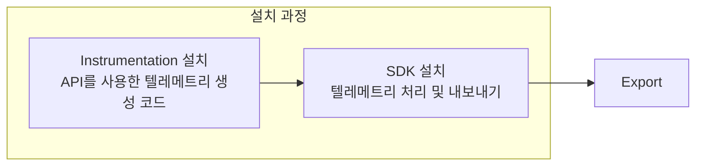
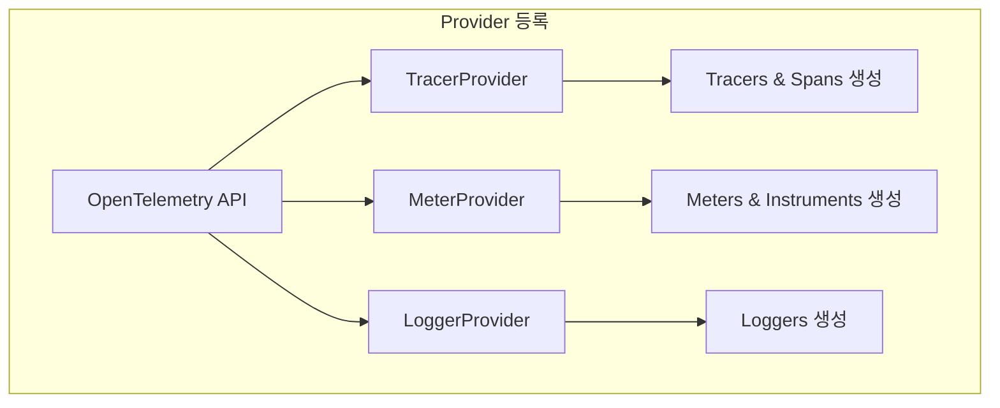
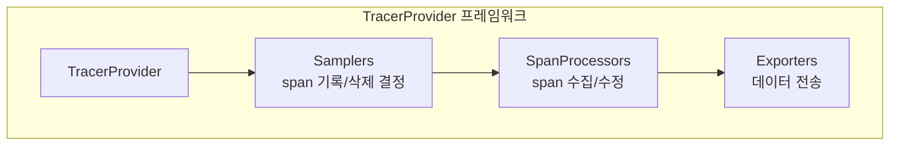
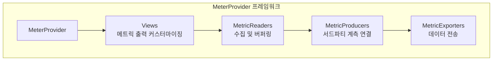
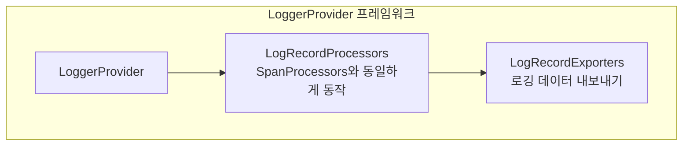
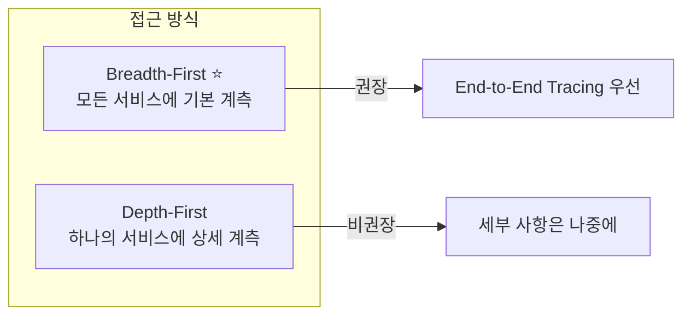
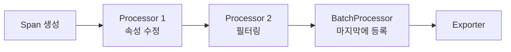

# Chapter 5: Instrumenting Applications

---

## 📌 핵심 요약
> 이 장에서는 애플리케이션에 OpenTelemetry를 설치하는 과정을 다룬다. **SDK 설치**와 **Instrumentation 설치**의 두 가지 과정으로 구성되며, 각 언어별 자동화 수준이 다르다. 핵심은 **Provider 등록**, **Exporter 설정**, **Resource 첨부**, 그리고 **라이브러리 계측 설치**다. 마지막에 제공되는 **Setup Checklist**는 성공적인 배포를 위한 필수 점검 항목이다.

---

## 🎯 학습 목표
이 내용을 읽고 나면:
- [ ] SDK와 Instrumentation의 역할 차이를 설명할 수 있다
- [ ] TracerProvider, MeterProvider, LoggerProvider의 구성 요소를 이해할 수 있다
- [ ] 언어별 Auto-instrumentation 지원 현황을 파악할 수 있다
- [ ] Resource와 Resource Detector의 역할을 설명할 수 있다
- [ ] 샘플링 설정 시 고려사항을 이해할 수 있다
- [ ] Setup Checklist를 사용하여 설치를 검증할 수 있다

---

## 📖 본문 정리

### 1. 설치 개요

> 💬 **인용**: "잘못된 프로그램을 작성하는 것이 올바른 프로그램을 이해하는 것보다 쉽다." — Alan J. Perlis

OpenTelemetry 설정은 **두 가지 과정**으로 구성된다:



| 구성요소 | 역할 |
|----------|------|
| **SDK** | OpenTelemetry 클라이언트 - 텔레메트리 처리 및 내보내기 담당 |
| **Instrumentation** | OpenTelemetry API를 사용하여 텔레메트리를 생성하는 코드 |

---

### 2. Agents와 Auto-instrumentation

언어마다 자동화 수준이 다르다:

| 언어 | 자동화 도구 | 설명 |
|------|------------|------|
| **Java** | Java Agent | `-javaagent` 커맨드라인 인자로 SDK와 모든 계측 자동 설치 |
| **.NET** | .NET Instrumentation Agent | SDK와 패키지 자동 설치, 앱과 함께 실행 |
| **Node.js** | `@opentelemetry/auto-instrumentations-node` | `node --require` 플래그로 자동 설치 |
| **PHP** | OpenTelemetry PHP extension | PHP 8.0+ 지원 |
| **Python** | `opentelemetry-instrumentation` | `opentelemetry-instrument` 명령으로 자동 설치 |
| **Ruby** | `opentelemetry-instrumentation-all` | 계측만 자동 설치, SDK는 수동 설정 필요 |
| **Go** | Go Instrumentation package | eBPF 사용, 인기 Go 라이브러리 계측 |

> ⚠️ **Rust, Erlang 등**: 자동화가 없음. 다른 라이브러리처럼 SDK를 수동 설치 및 설정

---

### 3. SDK 설치: Provider 등록

**Provider란?** OpenTelemetry 계측 API의 구현체



**중요 사항**:
- API 호출은 기본적으로 **no-op** (아무 일도 안 함, 오버헤드 없음)
- Provider를 등록해야 실제로 동작
- **가능한 빨리** 애플리케이션 부트 사이클에서 등록
- 등록 전 API 호출은 기록되지 않음

#### Provider 분리 이유

| 이유 | 설명 |
|------|------|
| **선택적 설치** | 필요한 부분만 설치 가능 (예: tracing만 사용) |
| **느슨한 결합** | API와 구현 분리, API 패키지는 인터페이스와 상수만 포함, 의존성 충돌 방지 |
| **유연성** | 원한다면 자체 구현 작성 가능 |

---

### 4. TracerProvider



#### Samplers

**역할**: span을 기록(sampled in)할지 삭제(sampled out)할지 결정

> ⚠️ **중요**: 샘플러 선택은 분석 도구와 호환되어야 함. 호환되지 않으면 **잘못된 데이터**와 **작동하지 않는 기능** 발생

**권장사항**:
- 확실하지 않으면 **샘플링하지 말 것**
- 먼저 샘플링 없이 시작, 비용/오버헤드 줄이고 싶을 때 추가
- 분석 도구 벤더와 상담 후 샘플러 선택

#### SpanProcessors

**역할**: span 수집 및 수정 (시작 시와 종료 시 두 번 가로챔)

**BatchProcessor** (기본):

| 설정 | 기본값 | 설명 |
|------|--------|------|
| `maxQueueSize` | 2,048 | 버퍼에 보관되는 최대 span 수 |
| `scheduledDelayMillis` | 5,000 | 연속 내보내기 간 지연 (ms) |
| `exportTimeoutMillis` | 30,000 | 내보내기 취소 전 최대 시간 |
| `maxExportBatchSize` | 512 | 내보내기당 최대 span 수 |

> 💡 **팁**: 로컬 Collector로 내보낼 때는 `scheduledDelayMillis`를 **훨씬 작은 값으로** 설정. 앱 크래시 시 데이터 손실 최소화, 개발 중 테스트 속도 향상.

#### Exporters

**역할**: span을 프로세스 밖으로 전송

**OTLP Exporter 설정 옵션**:

| 옵션 | 기본값 | 설명 |
|------|--------|------|
| `protocol` | `http/protobuf` | gRPC, http/protobuf, http/json 중 선택 |
| `endpoint` | HTTP: `localhost:4318`<br/>gRPC: `localhost:4317` | 데이터 전송 URL |
| `headers` | - | 계정/보안 토큰 등 추가 HTTP 헤더 |
| `compression` | - | GZip 압축 (큰 배치 사이즈에 권장) |
| `timeout` | 10s | 배치 내보내기 최대 대기 시간 |

---

### 5. MeterProvider



#### MetricReaders

**PeriodicExportingMetricReader** (기본):

| 설정 | 기본값 | 설명 |
|------|--------|------|
| `exportIntervalMillis` | 60,000 | 연속 내보내기 간 시간 간격 (ms) |
| `exportTimeoutMillis` | 30,000 | 내보내기 취소 전 최대 시간 |

#### MetricProducers

- 기존 메트릭 계측(예: Prometheus)을 OpenTelemetry SDK에 연결
- 기존 계측이 있다면 어떤 MetricProducer가 필요한지 문서 확인

#### Views

- 메트릭 출력 커스터마이징: 무시할 인스트루먼트, 집계 방식, 보고할 속성 선택
- 시작할 때는 설정 불필요, 나중에 오버헤드 줄일 때 고려
- SDK 대신 Collector에서도 생성 가능

---

### 6. LoggerProvider



- **LogRecordProcessors**: SpanProcessors처럼 동작, 기본은 batch processor
- **LogRecordExporters**: 다양한 공통 형식으로 로깅 데이터 내보내기, OTLP 권장

---

### 7. Provider Shutdown

> ⚠️ **중요**: 앱 종료 시 남은 텔레메트리를 **flush** 해야 함. flush 전에 종료하면 중요한 observability 데이터 손실!

```python
# 예시: 모든 provider에 shutdown 호출
tracer_provider.shutdown()
meter_provider.shutdown()
logger_provider.shutdown()
```

> 💡 Auto-instrumentation 사용 시 에이전트가 프로세스 종료 시 자동으로 shutdown 호출

---

### 8. 설정 Best Practices

**세 가지 설정 방법**:

| 방법 | 설명 | 권장 |
|------|------|------|
| **코드 내** | exporter, sampler, processor 구성 시 | 개발용 |
| **환경 변수** | 배포 시 운영자가 설정 가능 | ⭐ 가장 널리 지원 |
| **YAML 설정 파일** | 모든 언어에서 동일한 형식 | ⭐ 새로운 권장 방식 |

**환경별 설정 차이**:

| 환경 | 설정 예시 |
|------|----------|
| **개발** | 로컬 Collector로 전송하여 설치 검증 |
| **테스트** | 소규모 분석 도구로 전송, 성능 회귀 테스트 |
| **프로덕션** | 네트워크별 로드 밸런서로 전송, 높은 처리량 튜닝 |

> **OpAMP (Open Agent Management Protocol)**: 개발 중인 원격 설정 프로토콜. Collector와 SDK의 원격 설정 업데이트 가능, 재시작/재배포 없이 전체 배포 관리.

---

### 9. Resources 첨부

**Resources**: 텔레메트리가 수집되는 환경을 정의하는 속성 세트

> 💬 **비유**: span, metrics, logs가 "무엇이 일어나는지"를 알려준다면, resources는 "어디서 일어나는지"를 알려준다.

#### Resource Detectors

- 환경에서 리소스를 발견하는 플러그인 (Kubernetes, AWS, GCP, Azure, Linux 등)
- 대부분 **로컬 Collector**에서 발견하고 첨부 가능 (앱 시작 지연 방지)

#### Service Resources (필수!)

| 리소스 | 설명 | 예시 |
|--------|------|------|
| `service.name` | 서비스 클래스 이름 | `frontend`, `payment-processor` |
| `service.namespace` | 서비스 네임스페이스 (동일 이름 구분용) | `ecommerce`, `internal` |
| `service.instance.id` | 특정 인스턴스의 고유 ID | UUID 등 |
| `service.version` | 버전 번호 | `1.2.3`, `v2.0.0` |

> ⚠️ **중요**: 이 리소스를 설정하지 않으면 많은 분석 도구 기능 사용 불가 (예: 버전별 성능 비교)

---

### 10. Instrumentation 설치

SDK 외에 **Instrumentation**도 필요:
- HTTP 클라이언트, 웹 프레임워크, 메시징 클라이언트, DB 클라이언트 등
- [OpenTelemetry Registry](https://opentelemetry.io/registry/)와 각 언어의 "contrib" 저장소에서 확인

> ⚠️ **가장 흔한 실수**: 중요한 instrumentation 패키지를 설치하지 않아 **trace가 끊어지는 것**

#### Native Instrumentation

점점 더 많은 OSS 라이브러리가 OpenTelemetry 계측을 **라이브러리 자체에 포함**:
- 추가 instrumentation 설치 불필요
- SDK 설치만으로 바로 작동

---

### 11. 애플리케이션 코드 계측

#### Span 장식 (Decorating Spans)

새 span을 생성하는 대신 **현재 span에 속성 추가**:

```python
# 새 span 생성 대신
from opentelemetry import trace

span = trace.get_current_span()
span.set_attribute("user.id", user_id)
span.set_attribute("order.total", order_total)
```

> 💡 **더 적은 span + 더 많은 attributes = 더 나은 observability 경험**

#### How Much Is Too Much?

> 💬 **권장**: 중요한 작업이 아니면 **필요할 때까지 추가하지 말 것**



**권장 패턴**:
1. OpenTelemetry가 제공하는 instrumentation만으로 모든 서비스 설정
2. 추가 상세 정보가 필요한 특정 영역에 점진적으로 instrumentation 추가
3. 비즈니스 로직에 대한 custom instrumentation에 집중

---

### 12. Layering Spans and Metrics

**API 엔드포인트에 대한 Histogram 메트릭** 생성 권장:

| Histogram 유형 | 설명 |
|---------------|------|
| **Standard (Predefined)** | 미리 정의된 버킷 |
| **Exponential Bucket** ⭐ | 측정값의 스케일과 범위에 자동 조정, 서로 합산 가능 |

**Exemplars와 결합**:
- 서비스 성능에 대한 정확한 통계
- 버킷별 성능을 보여주는 trace에 대한 컨텍스트 링크

---

### 13. Browser와 Mobile Clients

**RUM (Real User Monitoring)**: 클라이언트 텔레메트리

| 플랫폼 | 상태 |
|--------|------|
| Browser | 활발히 개발 중 |
| iOS | 활발히 개발 중 |
| Android | 활발히 개발 중 |

> ⚠️ **Public Gateway 주의**: OpenTelemetry Collector는 public gateway로 설계되지 않음. 클라이언트 SDK가 Collector로 데이터를 보내면 적절한 보안 체계를 갖춘 **추가 프록시** 고려.

---

## 🔍 심화 학습

### SpanProcessor 체인 순서

Processor는 등록 순서대로 선형 실행됨:



**규칙**: 텔레메트리를 수정하는 processor → batch processor 순서

### SDK vs Collector에서의 처리

| SDK에서 처리 | Collector에서 처리 |
|-------------|-------------------|
| IoT 디바이스처럼 Collector 사용 불가 환경 | 대부분의 경우 권장 |
| PII 제거 등 보안 민감 처리 | 리소스 감지, 추가 버퍼링 |
| 신뢰할 수 없는 네트워크 | 여러 앱에서 공통 처리 |

### Custom Provider 사례

**Envoy + OpenTelemetry C++**:
- OpenTelemetry C++ SDK는 멀티스레드
- Envoy는 싱글스레드 요구
- 별도의 싱글스레드 구현 작성

### 출처
- [OpenTelemetry SDK Specification](https://opentelemetry.io/docs/specs/otel/overview/)
- [OpenTelemetry Registry](https://opentelemetry.io/registry/)
- [Sampling Best Practices](https://opentelemetry.io/docs/concepts/sampling/)

---

## 💡 실무 적용 포인트

### 이런 상황에서 사용하세요
- **새 프로젝트**: Auto-instrumentation으로 빠르게 시작
- **레거시 시스템**: 언어별 지원 확인 후 점진적 적용
- **마이크로서비스**: 모든 서비스에 SDK와 라이브러리 계측 설치
- **성능 최적화**: Views로 불필요한 메트릭 필터링

### 주의할 점 / 흔한 실수
- ⚠️ **SDK만 설치**: 라이브러리 Instrumentation도 필요
- ⚠️ **Shutdown 미호출**: 앱 종료 시 flush 없이 데이터 손실
- ⚠️ **Service Resources 미설정**: 분석 도구 기능 제한
- ⚠️ **무분별한 샘플링**: 분석 도구와 호환성 확인 없이 설정
- ⚠️ **과도한 Span 생성**: 현재 span에 속성 추가가 더 나음

### 면접에서 나올 수 있는 질문
- Q: SDK와 Instrumentation의 차이점은 무엇인가요?
- Q: TracerProvider의 구성 요소를 설명해주세요.
- Q: 왜 OpenTelemetry API는 Provider 없이도 안전하게 호출 가능한가요?
- Q: 샘플링 설정 시 고려해야 할 점은 무엇인가요?
- Q: Service Resources가 중요한 이유는 무엇인가요?
- Q: SpanProcessor와 Exporter의 역할 차이는 무엇인가요?

---

## ✅ 핵심 개념 체크리스트

### 설치 전 확인
- [ ] 사용 중인 모든 중요 라이브러리에 instrumentation이 있는가?
- [ ] HTTP, 프레임워크, DB 클라이언트, 메시징 시스템 모두 계측되는가?

### SDK 설정 확인
- [ ] tracing, metrics, logs에 대한 provider가 등록되어 있는가?
- [ ] exporter가 올바르게 설치되어 있는가? (protocol, endpoint, TLS)
- [ ] 올바른 propagator가 설치되어 있는가?

### 데이터 흐름 확인
- [ ] SDK가 Collector로 데이터를 보내고 있는가?
- [ ] Collector가 분석 도구로 데이터를 보내고 있는가?
- [ ] 올바른 resources가 내보내지고 있는가?

### Trace 완전성 확인
- [ ] 모든 trace가 완전한가? (모든 서비스의 span 포함)
- [ ] 끊어진 trace가 없는가? (CLIENT/SERVER span 일치, propagation 형식 일치)

---

## 🔗 참고 자료
- 📄 공식 문서: [OpenTelemetry Instrumentation](https://opentelemetry.io/docs/instrumentation/)
- 📦 Registry: [OpenTelemetry Registry](https://opentelemetry.io/registry/)
- 📄 SDK Specification: [OpenTelemetry SDK Spec](https://opentelemetry.io/docs/specs/otel/)
- 📄 Sampling: [Sampling Best Practices](https://opentelemetry.io/docs/concepts/sampling/)
- 📄 Configuration: [SDK Configuration](https://opentelemetry.io/docs/specs/otel/configuration/)
- 📄 OpAMP: [Open Agent Management Protocol](https://opentelemetry.io/docs/specs/opamp/)

---

## 📋 Complete Setup Checklist

### 1. Instrumentation 확인
```
[ ] HTTP, 프레임워크, DB 클라이언트, 메시징 시스템 instrumentation 설치
[ ] 사용 중인 라이브러리가 instrumentation 목록에 있는지 확인
```

### 2. SDK 등록 확인
```
[ ] span, metric, log를 명시적으로 생성하는 함수 실행하여 확인
```

### 3. Exporter 설정 확인
```
[ ] protocol, endpoint, TLS 인증서 옵션 설정
```

### 4. Propagator 확인
```
[ ] W3C 외 다른 헤더 사용 시 parent ID 기록 확인
```

### 5. Collector 연결 확인
```
[ ] Collector에 logging exporter 추가 (verbosity: detailed)
[ ] SDK → Collector 데이터 전송 확인
[ ] Collector → 분석 도구 데이터 전송 확인
```

### 6. Resources 확인
```
[ ] service.name, service.namespace, service.instance.id, service.version 설정
[ ] 모든 예상 resource attributes 존재 확인
```

### 7. Trace 완전성 확인
```
[ ] 모든 서비스의 span이 trace에 포함되는지 확인
[ ] 끊어진 trace가 없는지 확인
[ ] CLIENT/SERVER span 일치 확인
[ ] propagation 형식 일치 확인
```

---
