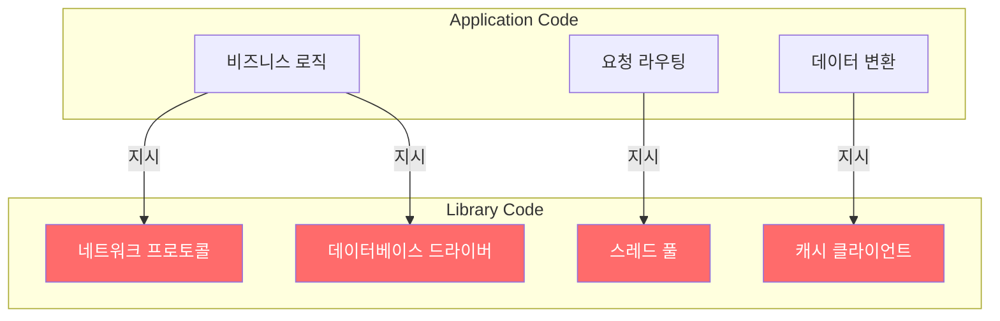
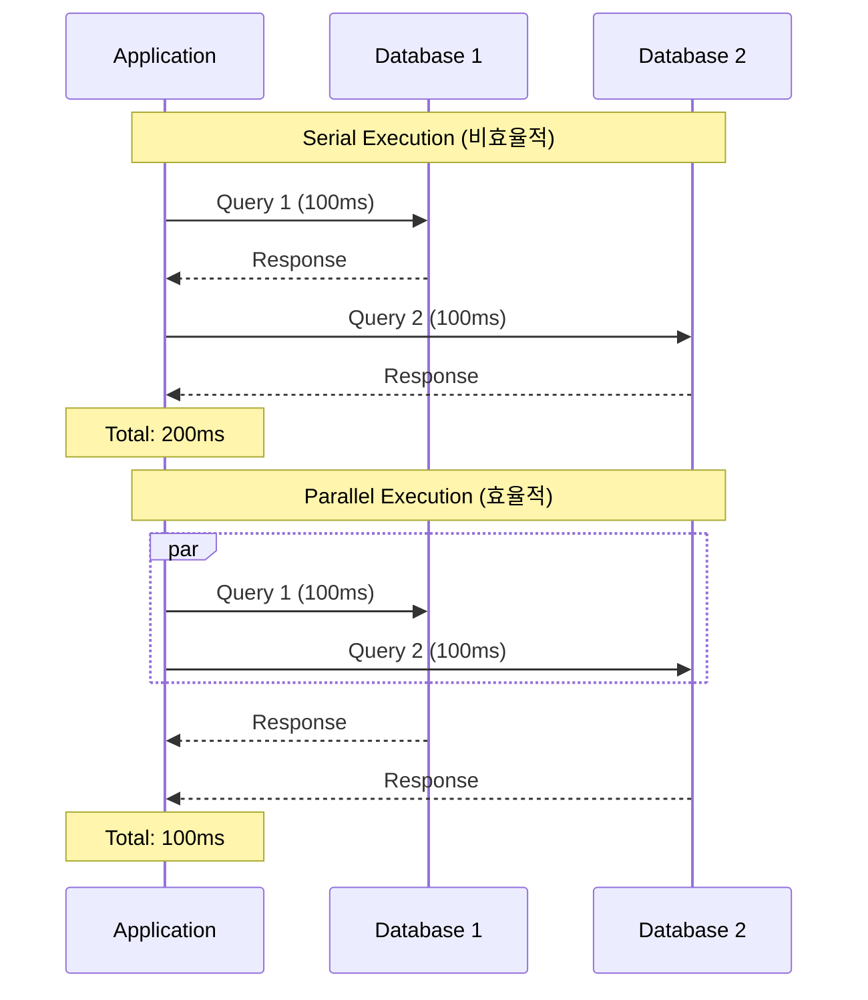
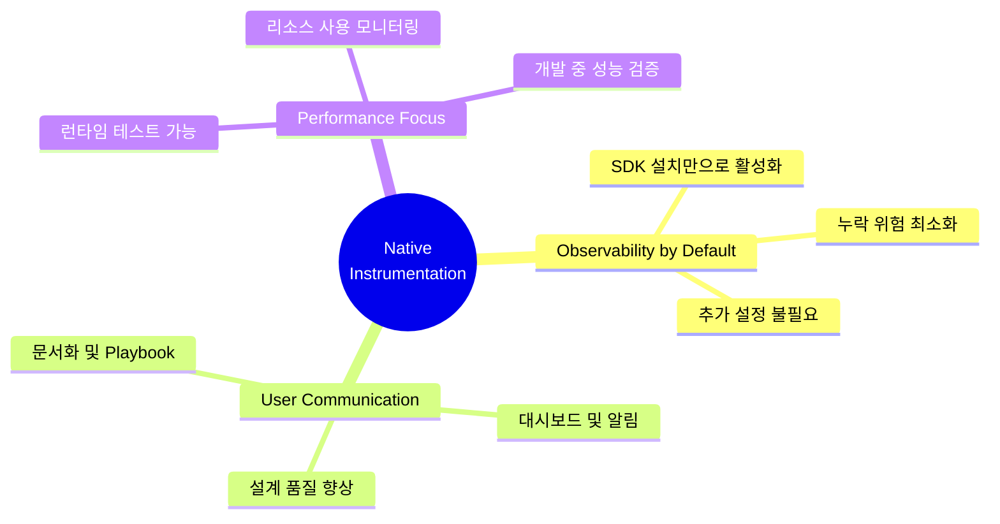
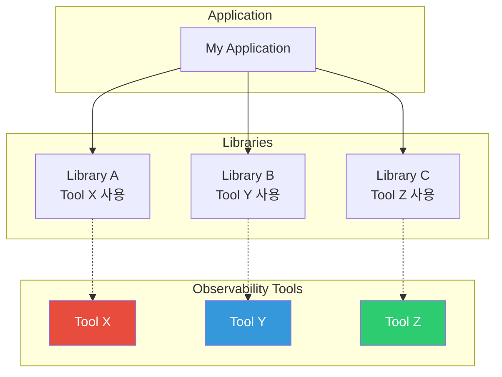
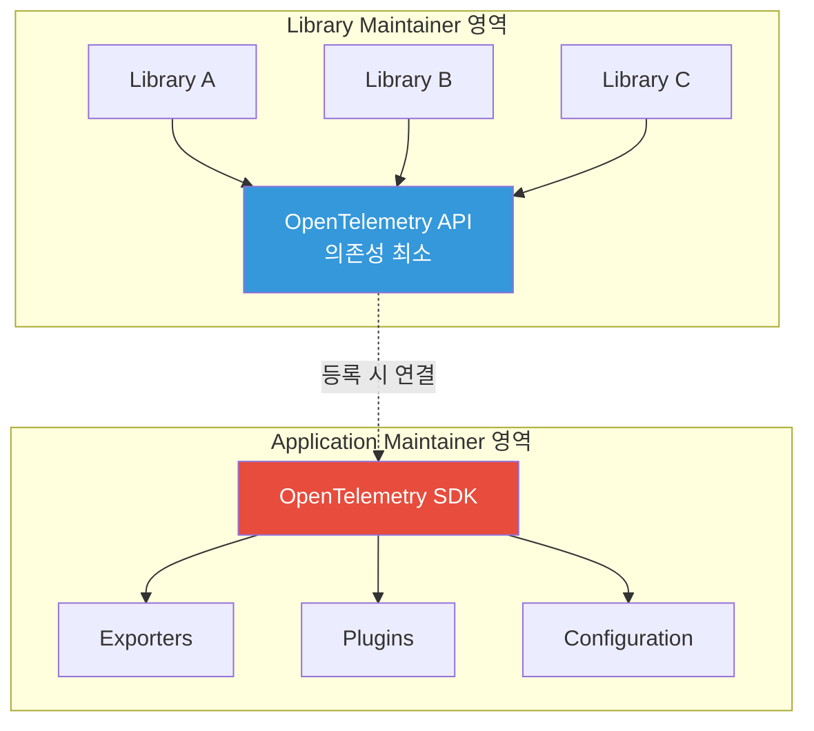
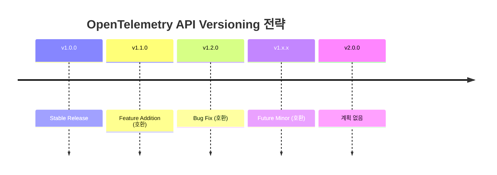
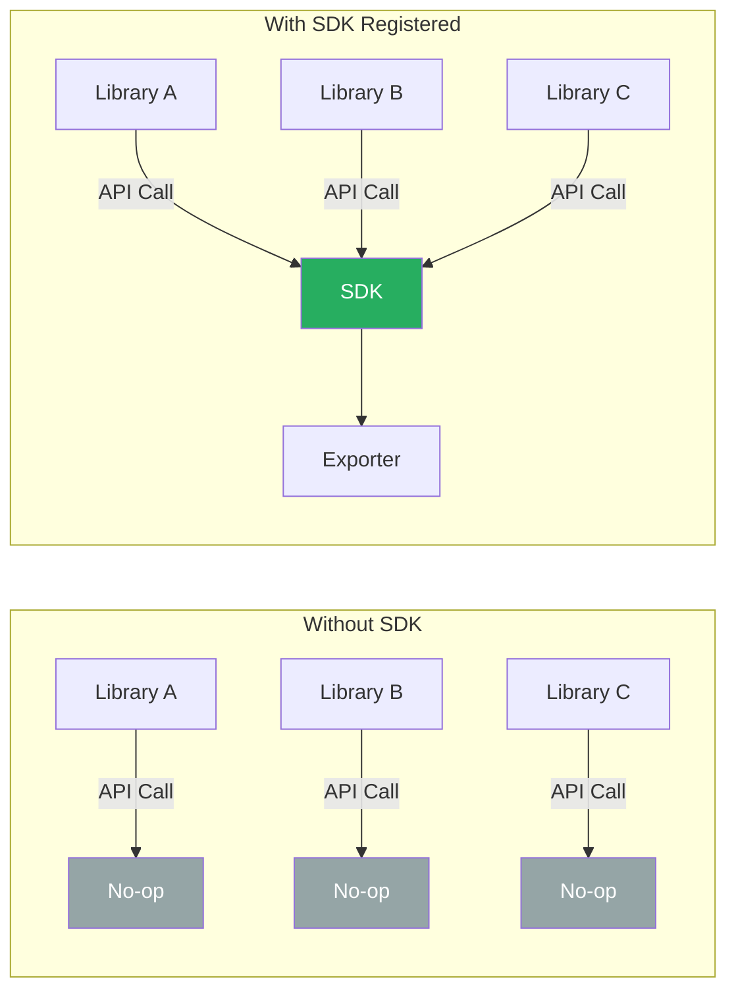
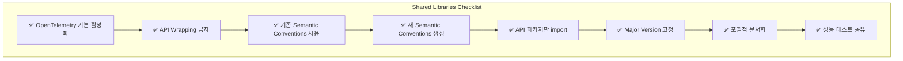
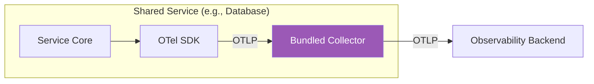
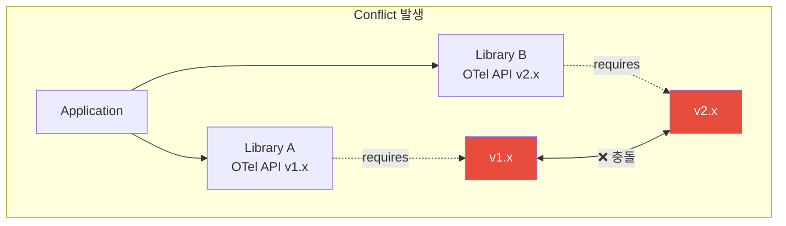

# Chapter 6. Instrumenting Libraries

> "The price of reliability is the pursuit of the utmost simplicity."
> — Sir Antony Hoare

---

## 📌 핵심 요약

> **라이브러리 계측(Library Instrumentation)**은 observability의 핵심이다. 대부분의 프로덕션 문제는 애플리케이션 코드가 아닌 **라이브러리 코드의 리소스 사용 패턴**에서 발생한다. OpenTelemetry는 **Native Instrumentation**을 통해 라이브러리 자체에 계측을 내장할 수 있도록 설계되었으며, 이는 플러그인 방식보다 우수한 사용자 경험과 성능을 제공한다.

---

## 🎯 학습 목표

- [ ] Shared Library와 Application Code의 차이점 이해
- [ ] Native Instrumentation의 장점 3가지 설명
- [ ] 플러그인 방식의 한계점 파악
- [ ] OpenTelemetry가 라이브러리 계측에 적합한 이유 이해
- [ ] Shared Libraries Checklist 항목 숙지
- [ ] Shared Services Checklist 항목 숙지

---

## 📖 본문 정리

### 1. 라이브러리의 중요성 (The Importance of Libraries)

#### 1.1 Application Code vs Library Code



**핵심 인사이트:**
- 대부분의 **리소스 사용**은 Application Code가 아닌 **Library Code**에서 발생
- Application Code는 리소스를 직접 소비하지 않고, Library에게 **지시**만 함
- 프로덕션 문제는 대부분 Library 사용 패턴에서 발생

#### 1.2 프로덕션 문제의 근본 원인

| 문제 유형 | 원인 | 증상 |
|-----------|------|------|
| **Serial Execution** | 병렬 가능한 작업을 순차 실행 | 불필요한 Latency 증가 |
| **Consistency Errors** | 동시 읽기/쓰기 충돌 | 데이터 불일치 |
| **Deadlock** | 다른 순서로 Lock 획득 시도 | 요청 무한 대기 |
| **Cascading Failures** | 느린 요청 → 전체 부하 증가 | 시스템 전체 장애 |



---

### 2. Native Instrumentation의 필요성

#### 2.1 Native Instrumentation의 장점



#### 2.2 플러그인 방식의 한계

| 문제 | 설명 | 영향 |
|------|------|------|
| **의존성** | 플러그인 작성자에게 의존 | 라이브러리 업데이트 시 지연 |
| **호환성** | 아키텍처 변경 시 Hook 깨짐 | 유지보수 부담 증가 |
| **오버헤드** | 데이터 포맷 변환 필요 | 메모리/CPU 낭비 |
| **표면적 확대** | Hook 지원 범위 확대 필요 | 코드 복잡도 증가 |

#### 2.3 사용자와의 커뮤니케이션

**Documentation & Playbooks:**
- Trace를 통한 라이브러리 구조 시각화
- 일반적인 "gotchas"와 안티패턴 식별 가이드
- 설정 튜닝 지침 제공

**Dashboards & Alerts:**
- 기본 대시보드 템플릿 제공
- 정확한 Attribute 이름과 값 문서화
- 성능 메트릭 정의

---

### 3. 라이브러리가 계측되지 않은 이유

#### 3.1 Composition 문제



**문제점:**
- 각 라이브러리가 다른 Observability 시스템 선택
- 사용자는 여러 도구를 동시에 운영해야 함
- Logging 라이브러리 선택조차 합의 불가능

#### 3.2 Tracing이 진짜 Blocker

| 신호 유형 | 여러 시스템 사용 | 문제 수준 |
|-----------|-----------------|-----------|
| **Logging** | 가능 (비효율적) | 🟡 Medium |
| **Metrics** | 가능 (비효율적) | 🟡 Medium |
| **Tracing** | **불가능** | 🔴 Critical |

**Tracing 문제의 본질:**
- Context Propagation이 라이브러리 경계를 넘어야 함
- 모든 라이브러리가 **동일한 Tracing 시스템** 사용 필수
- OpenTelemetry 이전에는 표준화된 옵션 부재

---

### 4. OpenTelemetry의 라이브러리 지원 설계

#### 4.1 API와 Implementation 분리



| 역할 | 담당자 | 책임 |
|------|--------|------|
| **Instrumentation 작성** | Library Maintainer | 특정 라이브러리 코드 계측 |
| **Pipeline 설정** | Application Maintainer | Exporter, 플러그인 설정 |

#### 4.2 Backward Compatibility 보장



**핵심 원칙:**
- Stable API는 **v1.0**으로 릴리즈
- **v2.0 릴리즈 계획 없음**
- 10년 후에도 기존 계측 코드 동작 보장
- Transitive Dependency Conflict 방지

#### 4.3 Off by Default 설계



**장점:**
- SDK 미설치 시 **Zero Overhead**
- 예외 발생 없이 안전하게 동작
- Wrapper나 설정 없이 직접 API 호출 가능
- SDK 등록만으로 **모든 라이브러리** 자동 활성화

---

### 5. Shared Libraries Checklist

#### 5.1 필수 체크리스트



| 항목 | 설명 | 예시 |
|------|------|------|
| **기본 활성화** | 사용자 설정 없이 자동 활성화 | 별도 flag 불필요 |
| **API Wrapping 금지** | Custom API 대신 OTel API 직접 사용 | Provider 등록으로 확장 |
| **Semantic Conventions** | 표준 스키마 준수 | HTTP, DB, Messaging |
| **새 Conventions 생성** | 라이브러리 고유 작업 정의 | 문서화 필수 |
| **API 패키지만 import** | SDK 패키지 참조 금지 | 빌드 시 검증 |
| **Major Version 고정** | v1.2.0 < v2.0.0 범위 | Conflict 방지 |
| **포괄적 문서화** | Telemetry 스키마, Playbook | 운영 가이드 |
| **성능 테스트 공유** | 벤치마크 결과 제공 | 사용자 신뢰 확보 |

#### 5.2 Version Pinning 예시

```json
// package.json (Node.js)
{
  "dependencies": {
    "@opentelemetry/api": "^1.2.0"
  }
}
```

```xml
<!-- pom.xml (Java) -->
<dependency>
    <groupId>io.opentelemetry</groupId>
    <artifactId>opentelemetry-api</artifactId>
    <version>[1.2.0,2.0.0)</version>
</dependency>
```

```go
// go.mod (Go)
require (
    go.opentelemetry.io/otel v1.2.0
)
```

---

### 6. Shared Services Checklist

#### 6.1 추가 체크리스트

Shared Services(데이터베이스, 프록시, 메시징 시스템 등)는 Libraries Checklist에 추가로:

| 항목 | 설명 | 예시 |
|------|------|------|
| **OTel Config File 사용** | 표준 설정 옵션 노출 | 환경변수 지원 |
| **OTLP 기본 출력** | HTTP/Proto 기본 제공 | 추가 Exporter 선택적 |
| **Local Collector 번들** | VM/Container에 Collector 포함 | Machine Metrics 수집 |



---

## 🔍 심화 학습

### Transitive Dependency Conflict 이해



**OpenTelemetry 해결책:**
- API v2.0 릴리즈하지 않음
- Minor 버전만 업데이트
- 모든 라이브러리가 같은 Major 버전 사용 가능

### Cross-Cutting Concern 설계 원칙

| 원칙 | 설명 | OTel 적용 |
|------|------|-----------|
| **최소 의존성** | 패키지 의존성 최소화 | API는 의존성 거의 없음 |
| **플러그인 가능** | 구현 교체 가능 | Provider 등록 방식 |
| **No-op 기본** | 미설정 시 안전하게 무시 | SDK 없으면 Zero Overhead |
| **Backward Compatible** | 기존 코드 계속 동작 | Breaking Change 없음 |

---

## 💡 실무 적용 포인트

### 이런 상황에서 Native Instrumentation 고려

| 상황 | 권장 접근 |
|------|-----------|
| 오픈소스 라이브러리 개발 | Native Instrumentation 필수 |
| 사내 공통 라이브러리 | Native Instrumentation 권장 |
| 외부 라이브러리 사용 | Contrib 라이브러리 활용 |
| Legacy 시스템 | Auto-instrumentation 우선 |

### 주의사항

| 안티패턴 | 문제점 | 올바른 접근 |
|----------|--------|-------------|
| SDK 패키지 import | 빌드 충돌 위험 | API 패키지만 사용 |
| Custom Wrapper 작성 | 호환성 저하 | OTel API 직접 사용 |
| 플러그인 강제 설정 | 사용자 경험 저하 | 기본 활성화 |
| Major Version 미고정 | Conflict 발생 | `^1.x.x` 범위 사용 |

### 면접 예상 질문

1. **"Native Instrumentation과 Plugin 방식의 차이점은?"**
   - Native: 라이브러리 자체에 계측 내장, 기본 활성화
   - Plugin: 제3자가 계측 작성, 별도 설치/설정 필요
   - Native의 장점: 버전 동기화, 낮은 오버헤드, 자동 활성화

2. **"OpenTelemetry가 Backward Compatibility를 중시하는 이유는?"**
   - Transitive Dependency Conflict 방지
   - 한번 작성된 계측이 영구 동작 보장
   - 라이브러리 간 API 버전 충돌 제거

3. **"라이브러리 계측 시 API vs SDK 패키지 구분이 중요한 이유는?"**
   - API: 최소 의존성, 라이브러리에서 사용
   - SDK: 많은 의존성, 애플리케이션에서만 사용
   - SDK 참조 시 의존성 충돌 위험

---

## ✅ 핵심 개념 체크리스트

### 개념 이해
- [ ] Shared Library의 정의와 Application Code와의 차이
- [ ] 프로덕션 문제가 주로 Library Code에서 발생하는 이유
- [ ] Native Instrumentation의 3가지 장점
- [ ] 플러그인 방식의 4가지 한계
- [ ] Tracing이 라이브러리 계측의 진정한 Blocker인 이유

### OTel 설계 원칙
- [ ] API와 Implementation 분리의 목적
- [ ] Backward Compatibility가 Transitive Conflict를 방지하는 방식
- [ ] Off by Default 설계의 장점
- [ ] No-op 동작의 의미

### 실무 적용
- [ ] Shared Libraries Checklist 8개 항목
- [ ] Shared Services Checklist 3개 추가 항목
- [ ] Version Pinning 방법 (언어별)
- [ ] Semantic Conventions 활용 방법

---

## 🔗 참고 자료

### 공식 문서
- [OpenTelemetry Library Instrumentation Guidelines](https://opentelemetry.io/docs/specs/otel/library-guidelines/)
- [OpenTelemetry Semantic Conventions](https://opentelemetry.io/docs/specs/semconv/)
- [OpenTelemetry API Specification](https://opentelemetry.io/docs/specs/otel/)

### 추가 학습
- [OpenTelemetry Contrib Repository](https://github.com/open-telemetry/opentelemetry-java-instrumentation)
- [Instrumentation Best Practices](https://opentelemetry.io/docs/concepts/instrumentation/)

### 인용
- Hoare, C.A.R. "1980 ACM Turing Award Lecture: The Emperor's Old Clothes." Communications of the ACM 24, no. 2 (February 1981): 75–83.
