# Chapter 7. Observing Infrastructure

> "We build our computer systems the way we build our cities: over time, without a plan, on top of ruins."
> — Ellen Ullman

---

## 📌 핵심 요약

> **Infrastructure Observability**는 단순한 모니터링을 넘어 인프라 신호와 애플리케이션 신호 간의 **Context 연결**에 초점을 맞춘다. Cloud Provider, Kubernetes, Serverless, 비동기 워크플로우 각각에 맞는 전략이 필요하며, OpenTelemetry Collector가 이 모든 신호를 통합하는 핵심 도구다.

---

## 🎯 학습 목표

- [ ] Infrastructure Observability와 Monitoring의 차이점 이해
- [ ] Infrastructure Provider vs Platform 구분
- [ ] Cloud Metrics/Logs 수집 전략 수립
- [ ] Kubernetes Observability 아키텍처 이해
- [ ] Serverless 플랫폼 Observability 특수성 파악
- [ ] 비동기 워크플로우의 Trace 연결 방법 이해

---

## 📖 본문 정리

### 1. Infrastructure Observability란?

#### 1.1 Monitoring vs Observability

| 구분 | Monitoring | Observability |
|------|------------|---------------|
| **초점** | 개별 메트릭 (CPU, Memory) | Context 연결 |
| **질문** | "현재 상태가 어떤가?" | "왜 이런 상태인가?" |
| **가치** | 임계값 기반 알림 | 원인 분석 및 상관관계 |

**핵심 차이**: Kubernetes 노드의 메모리 사용량을 아는 것과, 그 사용량이 **어떤 요청/서비스**와 연관되는지 아는 것은 다르다.

#### 1.2 Infrastructure의 두 가지 유형

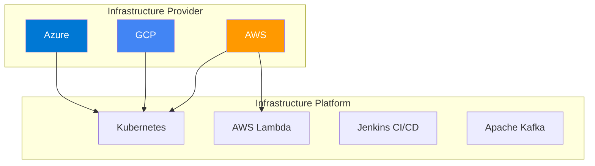

| 유형 | 정의 | 예시 |
|------|------|------|
| **Provider** | 인프라의 실제 소스 | AWS, GCP, Azure |
| **Platform** | Provider 위 관리형 추상화 | Kubernetes, Lambda, Jenkins |

#### 1.3 Infrastructure Observability 판단 기준

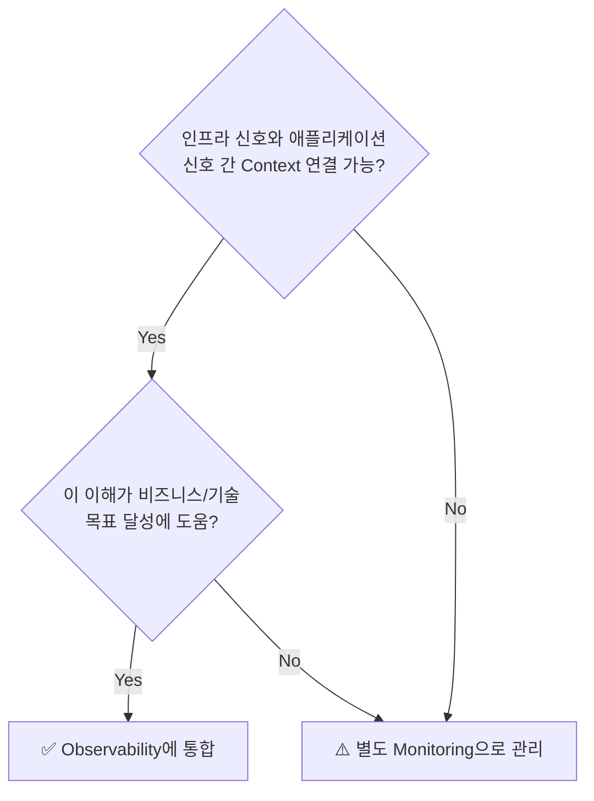

---

### 2. Cloud Provider Observability

#### 2.1 Cloud Telemetry Iceberg

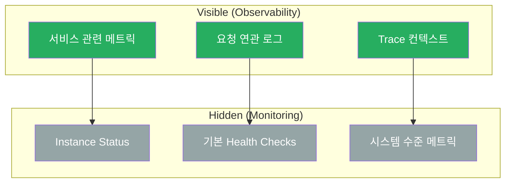

**예시: Instance Status의 가치**
- 단독: "컴퓨터가 켜져있는가?" → 분산 시스템에서 의미 제한적
- Observability 통합: API Gateway/Load Balancer 라우팅 오류와 연관 → 가치 증가

#### 2.2 Cloud Metrics/Logs 수집 원칙

| 원칙 | 설명 | 예시 |
|------|------|------|
| **Semantic Conventions** | 인프라/애플리케이션 메타데이터 키 통일 | `service.name`, `host.id` |
| **기존 통합 활용** | Collector 플러그인 생태계 활용 | CloudWatch Receiver |
| **목적 있는 데이터** | 필요한 것만, 필요한 기간만 | 로깅 비용 폭증 방지 |

> ⚠️ **실제 사례**: $10 Compute 비용에 $150 Logging 비용 발생

#### 2.3 Collector 배포 아키텍처

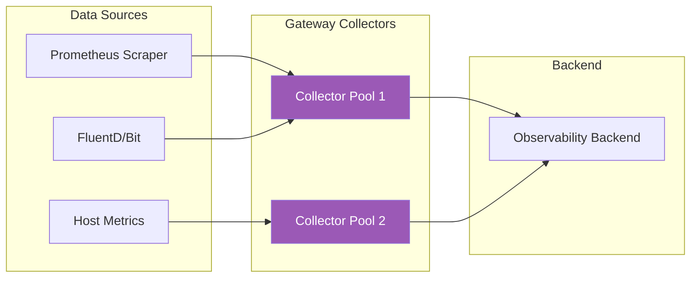

**신호별 분리 배포:**

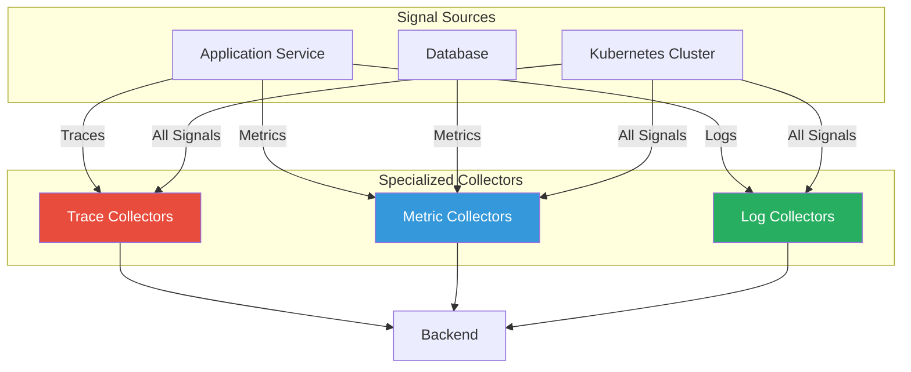

#### 2.4 Collector 용량 계획 (Metamonitoring)

| 메트릭 | 의미 | 조치 |
|--------|------|------|
| `otelcol_processor_refused_spans` | 거부된 Span 수 | 스케일 업 필요 |
| `otelcol_processor_refused_metric_points` | 거부된 메트릭 | 스케일 업 필요 |
| `queue_size` vs `queue_capacity` | 대기열 상태 | 수신 서비스 바쁨 |

**용량 계획 규칙:**

```
1. Ballast 크기 실험 (스트레스 테스트로 상한선 파악)
2. Scrape 충돌 방지 (다음 스크랩 전 현재 완료)
3. 무거운 처리는 후단 파이프라인으로 이동
4. 약간 과잉 프로비저닝 > 텔레메트리 손실
```

**컨테이너 메모리 설정:**

```yaml
# Container Memory: 1GB 기준
resources:
  limits:
    memory: 1Gi
  requests:
    memory: 800Mi  # 80%

# Collector Config
extensions:
  memory_ballast:
    size_mib: 400  # 40% of container memory
```

---

### 3. Kubernetes Observability

#### 3.1 OpenTelemetry + Kubernetes 통합 방식

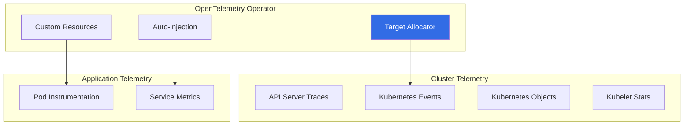

#### 3.2 Kubernetes Telemetry 수집 방법

| 방식 | 도구 | 장점 | 단점 |
|------|------|------|------|
| **Operator + TA** | Target Allocator | 기존 Prometheus 호환 | 설정 복잡 |
| **Receivers** | k8sclusterreceiver, k8seventsreceiver | 순수 OTel | 일부 갭 존재 |

**Receiver 목록:**
- `k8sclusterreceiver`: 클러스터 메트릭
- `k8seventsreceiver`: Kubernetes 이벤트
- `k8sobjectsreceiver`: Kubernetes 오브젝트
- `kubeletstatsreceiver`: Pod 수준 메트릭

#### 3.3 Kubernetes 배포 Best Practices

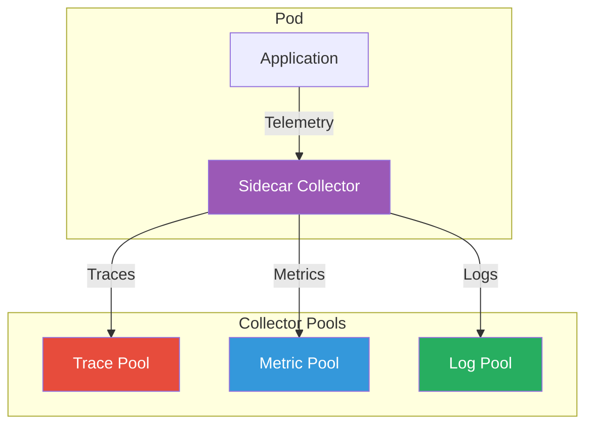

| 권장사항 | 이유 |
|----------|------|
| **Sidecar Collector 사용** | 메모리 부담 분산, 깔끔한 종료 |
| **신호별 Collector 분리** | 독립적 스케일링 |
| **Collector에서 Redaction/Sampling** | 재배포 없이 조정 가능 |

---

### 4. Serverless Observability

#### 4.1 Serverless 특수 메트릭

| 메트릭 | 설명 | 중요도 |
|--------|------|--------|
| **Invocation Time** | 함수 실행 시간 | 🔴 Critical |
| **Resource Usage** | 메모리/CPU 사용량 | 🟡 Important |
| **Cold Start Time** | 미사용 후 시작 시간 | 🔴 Critical |

#### 4.2 Serverless Instrumentation 전략

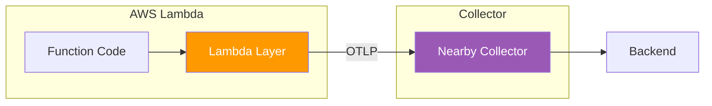

**Best Practices:**

| 권장사항 | 설명 |
|----------|------|
| **Export 대기** | 함수 종료 전 텔레메트리 전송 완료 대기 |
| **Span 종료** | 제어권 반환 전 측정 중단 |
| **값 사전 계산** | 변경 없는 Attribute는 캐싱 |
| **전용 Collector** | 함수 "가까이" 배치 |

#### 4.3 대안적 접근

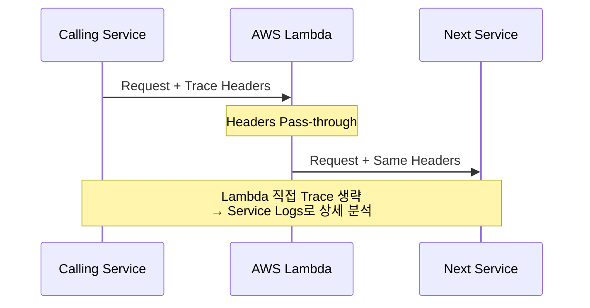

---

### 5. 비동기 워크플로우 Observability

#### 5.1 동기 vs 비동기 트랜잭션

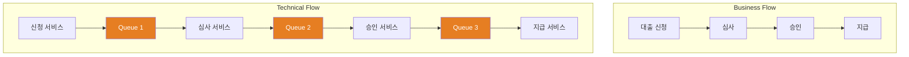

**비동기 워크플로우 특징:**
- 트랜잭션 종료 시점 불명확
- 여러 서비스가 단일 레코드에 작업
- 인간 개입이 필요한 단계 존재
- "트리의 트리" 형태 구조

#### 5.2 Span Links를 통한 Trace 연결

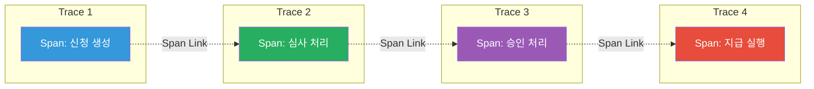

#### 5.3 연결 전략

| 방법 | 설명 | 장점 |
|------|------|------|
| **Custom Correlation ID** | Baggage로 전파되는 고유 ID | 간단한 구현 |
| **Span Links** | 인과관계 연결 | 대기 시간 계산 가능 |

**Span Links 사용 시:**
- 수신 Context를 **Link**로 처리 (Continuation 아님)
- 새 Trace 시작하면서 이전 Trace와 연결
- 역방향 관계 발견 가능한 분석 도구 필요

#### 5.4 Spans to Metrics 변환

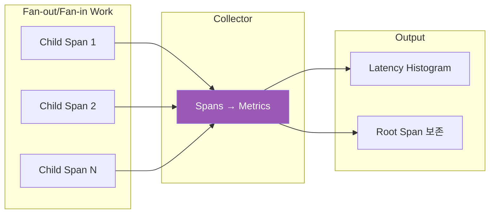

**변환 전략:**
- Child Spans → Histogram (완료 시간 기준 버킷)
- Parent Trace ID를 Metric Attribute로 포함
- Child Spans 드롭하여 저장 비용 절감

---

## 🔍 심화 학습

### Push vs Pull Metrics

| 방식 | 설명 | OTLP 지원 |
|------|------|-----------|
| **Push** | Host → Central Server | ✅ 기본 지원 |
| **Pull** | Central Server → Host | ❌ 미지원 |

**OTLP 사용 시**: 모든 메트릭은 Push 방식으로 전송됨

### Collector Builder 활용

```bash
# Custom Collector 빌드
ocb --config=builder-config.yaml

# builder-config.yaml 예시
dist:
  name: custom-otelcol
  output_path: ./dist

receivers:
  - gomod: go.opentelemetry.io/collector/receiver/otlpreceiver v0.88.0

exporters:
  - gomod: go.opentelemetry.io/collector/exporter/otlpexporter v0.88.0

processors:
  - gomod: go.opentelemetry.io/collector/processor/batchprocessor v0.88.0
```

### GOMEMLIMIT vs Ballast

| 방식 | 버전 | 설명 |
|------|------|------|
| **Ballast Extension** | Legacy | Heap에 메모리 사전 할당 |
| **GOMEMLIMIT** | 최신 | 환경변수로 메모리 제한 |

```bash
# 최신 방식 (Go 1.19+)
export GOMEMLIMIT=800MiB
export GOGC=100
```

---

## 💡 실무 적용 포인트

### Infrastructure Observability 결정 매트릭스

| 신호 유형 | Context 연결 | 비즈니스 가치 | 권장 |
|-----------|--------------|---------------|------|
| Instance Status 단독 | ❌ | ❌ | Monitoring |
| Instance + Gateway 연관 | ✅ | ✅ | Observability |
| 시스템 메트릭 단독 | ❌ | ❌ | Monitoring |
| 시스템 + Request 연관 | ✅ | ✅ | Observability |

### 주의사항

| 안티패턴 | 문제점 | 올바른 접근 |
|----------|--------|-------------|
| 모든 Cloud 메트릭 수집 | 비용 폭증 | 목적 기반 선별 |
| 단일 Collector 운영 | 스케일링 어려움 | 신호별 분리 |
| 프로세스 내 Redaction | 재배포 필요 | Collector에서 처리 |
| Lambda 직접 Trace 항상 | 오버헤드 | Header Pass-through 고려 |

### 면접 예상 질문

1. **"Infrastructure Observability와 Monitoring의 차이는?"**
   - Monitoring: 개별 메트릭 값 추적
   - Observability: 메트릭 간 Context 연결과 원인 분석
   - 차이: "현재 상태" vs "왜 이런 상태인가"

2. **"Kubernetes에서 OpenTelemetry Collector 배포 전략은?"**
   - Sidecar: Pod 내 메모리 부담 분산, 깔끔한 종료
   - 신호별 Pool: 독립적 스케일링
   - Collector 설정: Redaction/Sampling (재배포 없이 조정)

3. **"비동기 워크플로우에서 Trace 연결 방법은?"**
   - Span Links: 인과관계 연결, 대기 시간 계산 가능
   - Custom Correlation ID: Baggage 전파
   - Subtraces: 단일 Trace 대신 연결된 여러 Trace

---

## ✅ 핵심 개념 체크리스트

### 개념 이해
- [ ] Infrastructure Provider vs Platform 구분
- [ ] Monitoring과 Observability의 차이점
- [ ] Context 연결의 중요성
- [ ] Cloud Telemetry Iceberg 개념

### Collector 운영
- [ ] Gateway 배포 아키텍처
- [ ] 신호별 분리 배포 전략
- [ ] Metamonitoring 메트릭 이해
- [ ] 용량 계획 규칙 (Ballast, Memory)

### 플랫폼별 전략
- [ ] Kubernetes Operator와 Target Allocator
- [ ] Kubernetes Receiver 종류
- [ ] Serverless 특수 메트릭 3가지
- [ ] Serverless Instrumentation Best Practices

### 비동기 워크플로우
- [ ] Span Links를 통한 Trace 연결
- [ ] Custom Correlation ID 활용
- [ ] Spans to Metrics 변환 전략
- [ ] Fan-out/Fan-in 패턴 처리

---

## 🔗 참고 자료

### 공식 문서
- [OpenTelemetry Collector](https://opentelemetry.io/docs/collector/)
- [OpenTelemetry Kubernetes Operator](https://opentelemetry.io/docs/kubernetes/operator/)
- [OpenTelemetry Lambda Instrumentation](https://opentelemetry.io/docs/faas/lambda/)

### 배포 가이드
- [Collector Builder](https://github.com/open-telemetry/opentelemetry-collector/tree/main/cmd/builder)
- [Target Allocator](https://github.com/open-telemetry/opentelemetry-operator#target-allocator)

### 추가 학습
- [Go Memory Ballast](https://blog.twitch.tv/en/2019/04/10/go-memory-ballast-how-i-learnt-to-stop-worrying-and-love-the-heap/)
- Bellotti, Marianne. "Kill It with Fire: Manage Aging Computer Systems." No Starch Press, 2021.
