# Chapter 8. Designing Telemetry Pipelines

> "I have always found that plans are useless, but planning is indispensable."
> — President Dwight D. Eisenhower

---

## 📌 핵심 요약

> **Telemetry Pipeline**은 시스템 부하에 비례하여 텔레메트리 볼륨이 증가하므로, 신중한 설계와 스케일링 전략이 필수다. Collector 토폴로지는 No Collector → Local Collector → Collector Pools로 진화하며, **Filtering**, **Sampling**, **Transformation**을 통해 비용과 가치의 균형을 맞춘다.

---

## 🎯 학습 목표

- [ ] Collector 토폴로지 3가지 단계 이해
- [ ] Local Collector의 장점 5가지 설명
- [ ] Collector Pool의 역할과 장점 파악
- [ ] Filtering vs Sampling 차이점 이해
- [ ] Head-based vs Tail-based Sampling 비교
- [ ] Pipeline Operations (Transform, Buffer, Export) 이해

---

## 📖 본문 정리

### 1. Common Topologies (일반적인 토폴로지)

#### 1.1 토폴로지 진화 단계

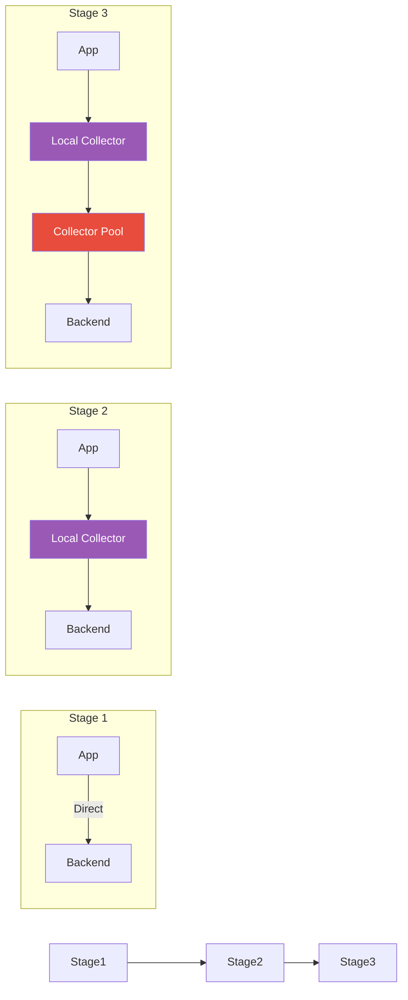

#### 1.2 No Collector

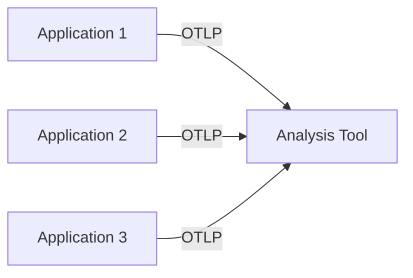

| 장점 | 단점 |
|------|------|
| 관리 부담 없음 | Host Metrics 수집 불가 |
| 리소스 절약 | 처리/변환 기능 없음 |
| 단순한 구성 | 버퍼링 불가 |

**사용 조건**: 텔레메트리 처리가 거의 필요 없는 간단한 시스템

#### 1.3 Local Collector

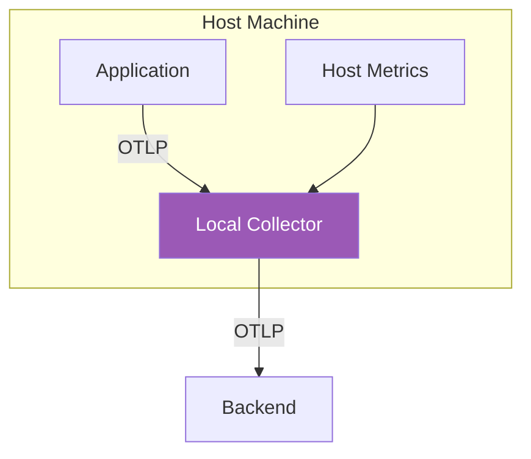

**Local Collector의 장점:**

| 장점 | 설명 |
|------|------|
| **Host Metrics 수집** | CPU, RAM, Network 등 시스템 메트릭 |
| **Environment Resources** | Cloud/K8s 메타데이터 수집 (API 호출 분리) |
| **Crash 시 데이터 손실 방지** | 작은 배치로 빠른 전송 → Collector에서 버퍼링 |
| **관심사 분리** | 텔레메트리 설정과 애플리케이션 설정 분리 |
| **SDK 설정 단순화** | 기본 OTLP over HTTP, 표준 주소 사용 |

**SDK 설정 최적화:**

```yaml
# 애플리케이션 SDK 설정
exporters:
  otlp:
    endpoint: localhost:4317

batching:
  max_queue_size: 100      # 작은 배치
  export_timeout: 1s       # 빠른 전송
```

```yaml
# Local Collector 설정
exporters:
  otlp:
    endpoint: remote-backend:4317

batching:
  max_queue_size: 2048     # 큰 배치
  export_timeout: 30s      # 효율적 전송
```

#### 1.4 Collector Pools

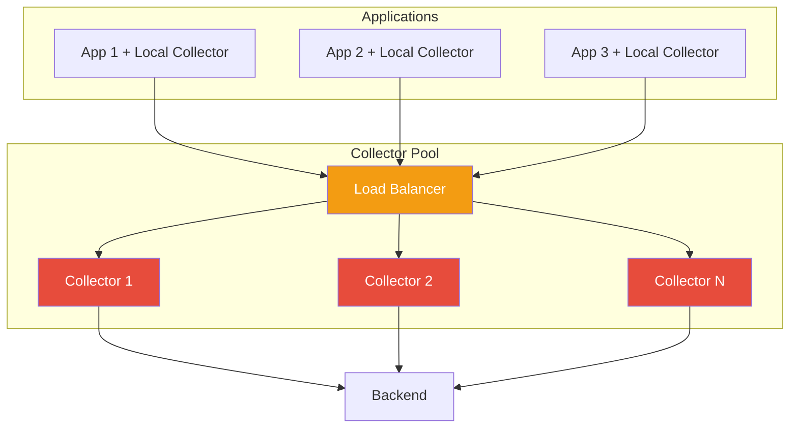

**Collector Pool 장점:**

| 장점 | 설명 |
|------|------|
| **Backpressure 처리** | Load Balancer로 버스트 트래픽 분산 |
| **분산 메모리 버퍼** | OTLP Stateless → 간단한 스케일링 |
| **리소스 격리** | 애플리케이션과 리소스 경쟁 없음 |
| **예측 가능한 리소스** | 균일한 부하 → 정확한 프로비저닝 |
| **독립적 배포** | 앱 팀과 별도로 관리 가능 |

#### 1.5 Specialized Collector Pools

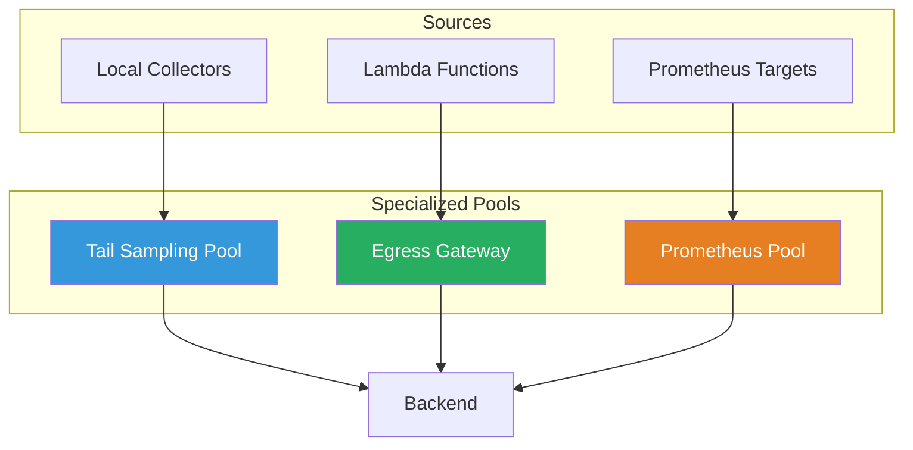

**전문화 이유:**

| 이유 | 설명 |
|------|------|
| **바이너리 크기 축소** | FaaS용 최소 플러그인만 포함 |
| **리소스 소비 최적화** | 다른 작업 프로파일 분리 |
| **Tail-based Sampling** | 동일 Trace Span → 동일 인스턴스 필요 |
| **Backend별 워크로드** | Prometheus/Jaeger 별도 처리 |
| **Egress 비용 절감** | OTel Arrow 등 압축 프로토콜 |

---

### 2. Pipeline Operations

#### 2.1 Filtering vs Sampling

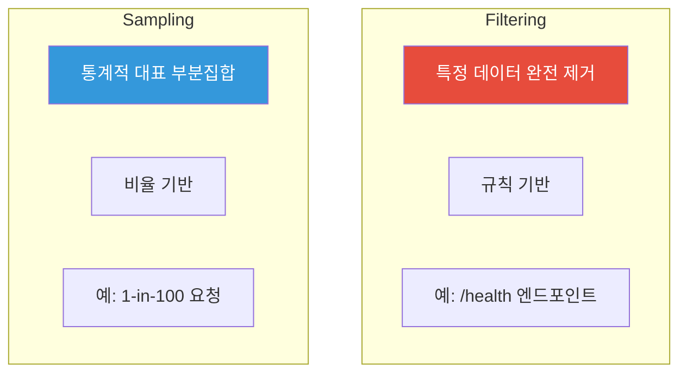

| 구분 | Filtering | Sampling |
|------|-----------|----------|
| **목적** | 불필요한 데이터 제거 | 전체 볼륨 감소 |
| **방식** | 규칙 기반 매칭 | 통계적 선택 |
| **예시** | Health Check 제외 | 1-in-100 트레이스 |
| **위치** | SDK 또는 Collector | Collector 권장 |

#### 2.2 Sampling 전략 비교

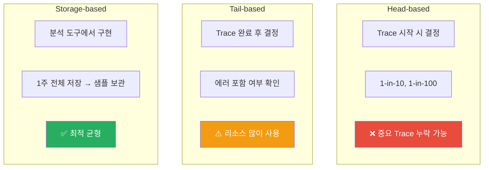

| 전략 | 시점 | 장점 | 단점 |
|------|------|------|------|
| **Head-based** | Trace 시작 | 간단, 낮은 리소스 | 중요 Trace 누락 |
| **Tail-based** | Trace 완료 | 에러 Trace 보존 | 높은 리소스, 복잡 |
| **Storage-based** | 분석 도구 | 최적 균형 | 전송 비용 동일 |

#### 2.3 Sampling 주의사항

> ⚠️ **경고**: Sampling은 위험하다. 잘못 구현하면 Observability를 심각하게 해칠 수 있다.

**권장 순서:**

```
1. 과도한 Instrumentation 피하기
2. 필요 없는 텔레메트리 적극 Filtering
3. 고압축 Gateway 프로토콜 (OTel Arrow) 채택
4. 마지막 수단으로 Sampling 고려
```

**Sampling 전 체크리스트:**
- [ ] 분석 도구 벤더/프로젝트와 상담
- [ ] Egress/Storage 비용이 정말 중요한가?
- [ ] 어떤 분석이 필요한가? (평균만? 에러도?)
- [ ] OpAMP로 자동화 가능한가?

#### 2.4 Transformation

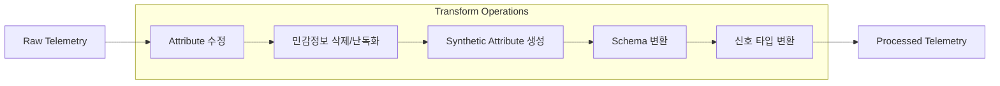

**OTTL (OpenTelemetry Transformation Language) 예시:**

```yaml
processors:
  transform:
    error_mode: ignore
    log_statements:
      - context: log
        statements:
          # nginx 'request' → semantic 'http.request.method'
          - set(attributes["http.request.method"], attributes["request"])
          - delete_key(attributes, "request")

          # 민감정보 마스킹
          - replace_pattern(attributes["email"], "(.*)@(.*)", "***@$2")
```

**처리 순서:**

```
Filter → Transform → Sample → Export
```

> 📌 **주의**: Tail Sampling 시 Transform이 필요한 Attribute를 먼저 추가해야 함

#### 2.5 Signal Transformation

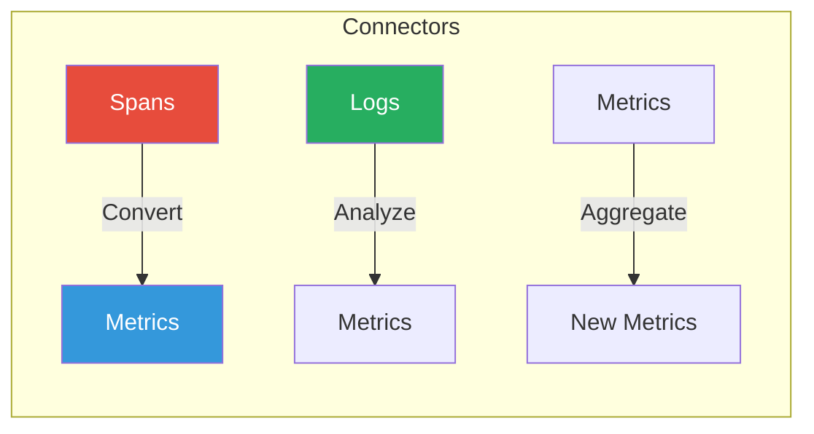

**활용 사례:**
- Traces → Histogram (비용 효율적 장기 저장)
- Logs → Metrics (운영화)
- Metrics → 집계된 Metrics (차원 축소)

---

### 3. Buffering and Backpressure

#### 3.1 Backpressure 개념

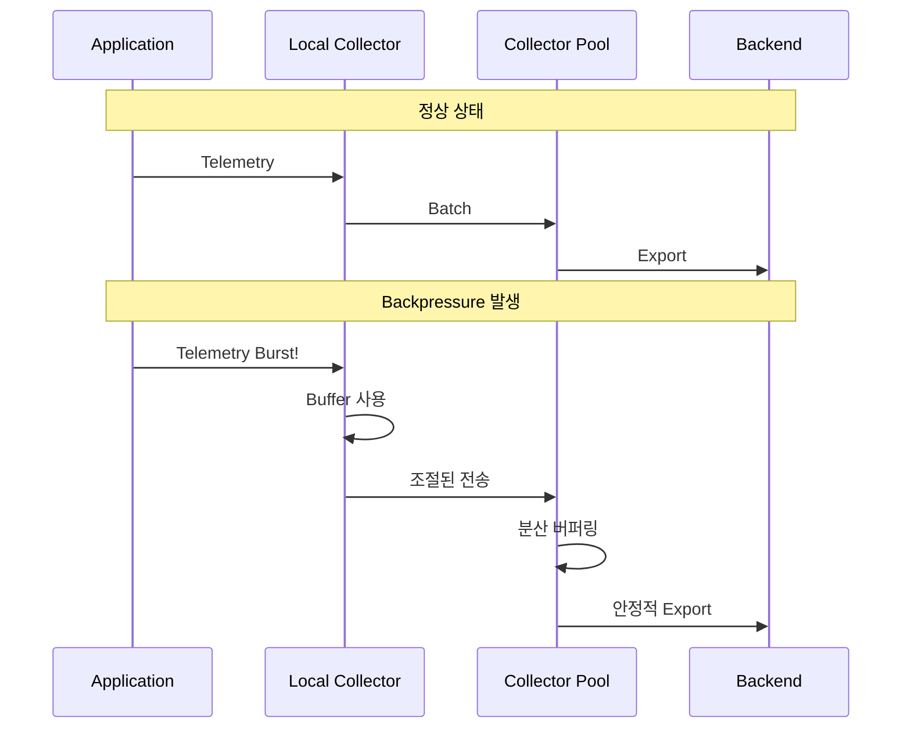

**Backpressure 정의**: Producer가 Consumer보다 빠르게 데이터 생성

**해결 전략:**
- Local Collector: 빠른 애플리케이션 대피
- Collector Pool: 분산 메모리 버퍼
- Load Balancer: 스파이크 평활화

---

### 4. OpAMP (Open Agent Management Protocol)

#### 4.1 OpAMP 개요

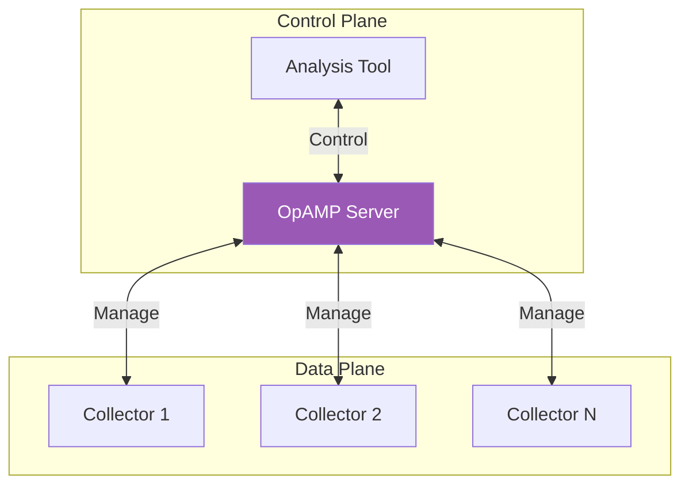

**OpAMP 기능:**
- 설정 변경 롤아웃
- 새 Collector 바이너리 배포
- 부하/헬스 메트릭 리포팅
- 분석 도구와 Collector 설정 연동

**Sampling 자동화:**
> "올바른 Sampling은 분석 도구가 제어해야 한다. 인간은 최적 Sampling 설정을 거의 찾을 수 없다."

---

### 5. Protocol and Export

#### 5.1 OTel Arrow Protocol

| 특성 | OTLP | OTel Arrow |
|------|------|------------|
| **압축** | GZip | 고압축 (컬럼 기반) |
| **상태** | Stateless | Stateful |
| **Load Balancer** | ✅ 호환 | ❌ 비호환 |
| **용도** | 일반 | 고처리량 Gateway |

**OTel Arrow 사용 조건:**
- 대량 데이터 장기 전송
- 안정적 연결
- Gateway 전용

#### 5.2 Routing Processor

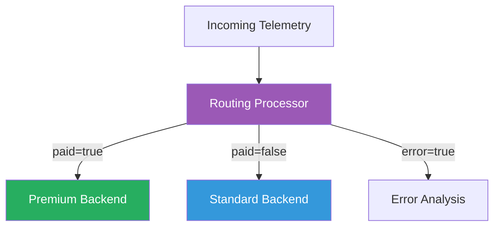

**라우팅 활용:**
- 사용자 유형별 백엔드 분리
- 에러 트래픽 특수 처리
- 비용 최적화

---

### 6. Kubernetes Operator

#### 6.1 배포 유형

| 유형 | 설명 | 용도 |
|------|------|------|
| **DaemonSet** | 모든 노드에 Collector | Local Collector |
| **Sidecar** | 모든 컨테이너에 Collector | Local Collector |
| **Deployment** | Collector Pool | Stateless Pool |
| **StatefulSet** | Stateful Collector Pool | Tail Sampling |

```yaml
# Deployment 예시 (권장)
apiVersion: opentelemetry.io/v1beta1
kind: OpenTelemetryCollector
metadata:
  name: collector-pool
spec:
  mode: deployment
  replicas: 3
```

#### 6.2 Auto-instrumentation 지원

| 언어 | 지원 |
|------|------|
| Apache HTTPD | ✅ |
| .NET | ✅ |
| Go | ✅ |
| Java | ✅ |
| nginx | ✅ |
| Node.js | ✅ |
| Python | ✅ |

---

### 7. Collector Security

#### 7.1 보안 Best Practices

| 항목 | 권장사항 |
|------|----------|
| **바인딩** | `localhost:4318` (0.0.0.0 피하기) |
| **암호화** | WAN 트래픽은 SSL/TLS 필수 |
| **인증** | TLS 인증서 기반 인가 |
| **PII** | Redaction Processor로 민감정보 제거 |

```yaml
receivers:
  otlp:
    protocols:
      grpc:
        endpoint: localhost:4317  # 로컬만 수신
      http:
        endpoint: localhost:4318

# WAN 수신 시
receivers:
  otlp:
    protocols:
      grpc:
        endpoint: 0.0.0.0:4317
        tls:
          cert_file: /certs/server.crt
          key_file: /certs/server.key
```

---

## 🔍 심화 학습

### 비용 관리 전략

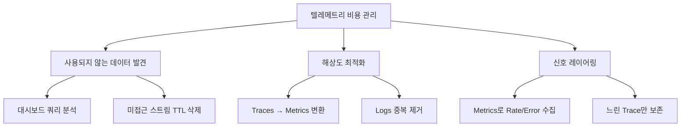

### 미사용 텔레메트리 발견 방법

1. **대시보드 쿼리 분석**
   - Grafana 대시보드 쿼리 추출
   - 실제 사용 메트릭과 비교
   - 미사용 스트림 필터링

2. **TTL 기반 삭제**
   - 일정 시간 미접근 시 자동 삭제
   - 큐에 텔레메트리 추가 + 접근 시 갱신

3. **배치 재집계**
   - K8s 메트릭 Attribute 결합
   - 수십 개 로그 라인 → 단일 메트릭

---

## 💡 실무 적용 포인트

### Collector 토폴로지 선택 가이드

| 시스템 규모 | 권장 토폴로지 |
|-------------|---------------|
| 소규모/단순 | No Collector 또는 Local |
| 중규모 | Local Collector |
| 대규모 | Local + Collector Pool |
| 엔터프라이즈 | Specialized Pools |

### 주의사항

| 안티패턴 | 문제점 | 올바른 접근 |
|----------|--------|-------------|
| SDK에서 복잡한 처리 | 리소스 경쟁, 재배포 필요 | Collector에서 처리 |
| Head-based Sampling만 | 중요 에러 누락 | Tail-based 또는 Storage-based |
| 모든 데이터 Sampling | Observability 손상 | Filtering 우선, Sampling 최후 |
| 0.0.0.0 바인딩 | DoS 공격 위험 | localhost 바인딩 |

### 면접 예상 질문

1. **"Local Collector의 장점은?"**
   - Host Metrics 수집
   - Crash 시 데이터 손실 방지 (작은 배치 → 빠른 대피)
   - Environment Resources 수집 (API 호출 분리)
   - 관심사 분리 (텔레메트리 vs 애플리케이션 설정)

2. **"Head-based vs Tail-based Sampling 차이는?"**
   - Head: Trace 시작 시 결정, 간단하지만 중요 Trace 누락 가능
   - Tail: Trace 완료 후 결정, 에러 보존 가능하지만 리소스 많이 사용
   - 권장: Tail-based 또는 Storage-based

3. **"Backpressure 처리 전략은?"**
   - Local Collector: 작은 배치로 빠른 대피
   - Collector Pool: Load Balancer로 분산
   - 분산 메모리 버퍼: OTLP Stateless 특성 활용

---

## ✅ 핵심 개념 체크리스트

### 토폴로지
- [ ] No Collector 사용 조건
- [ ] Local Collector 5가지 장점
- [ ] Collector Pool의 Backpressure 처리
- [ ] Specialized Pool 사용 이유 5가지

### Pipeline Operations
- [ ] Filtering vs Sampling 차이
- [ ] Head/Tail/Storage-based Sampling 비교
- [ ] OTTL Transform 문법
- [ ] Signal Transformation (Spans → Metrics)

### 운영
- [ ] Buffering과 Backpressure 개념
- [ ] OpAMP의 역할
- [ ] OTel Arrow 사용 조건
- [ ] Collector Security Best Practices

### Kubernetes
- [ ] 4가지 배포 유형
- [ ] Auto-instrumentation 지원 언어
- [ ] DaemonSet vs Sidecar 선택

---

## 🔗 참고 자료

### 공식 문서
- [OpenTelemetry Collector](https://opentelemetry.io/docs/collector/)
- [Collector Configuration](https://opentelemetry.io/docs/collector/configuration/)
- [Transform Processor](https://github.com/open-telemetry/opentelemetry-collector-contrib/tree/main/processor/transformprocessor)

### OpAMP
- [OpAMP Specification](https://github.com/open-telemetry/opamp-spec)

### 추가 학습
- [Stanza Log Parser](https://github.com/observIQ/stanza)
- [OTel Arrow Protocol](https://github.com/open-telemetry/otel-arrow)
