# Chapter 9. Rolling Out Observability

> "Just because the standard provides a cliff in front of you, you are not necessarily required to jump off it."
> — Norman Diamond

---

## 📌 핵심 요약

> **Observability Rollout**은 단순한 기술 도입이 아닌 **조직적 변화**다. 성공적인 롤아웃을 위해서는 **Deep vs Wide**, **Code vs Collection**, **Centralized vs Decentralized**라는 세 가지 축에서 균형을 찾아야 한다. 관리층의 참여, 명확한 첫 번째 목표, Quick Win 달성이 핵심 성공 요인이다.

---

## 🎯 학습 목표

- [ ] Observability의 세 가지 축(Axes) 이해
- [ ] Deep vs Wide 전략의 trade-off 파악
- [ ] Code vs Collection 접근법 선택 기준 이해
- [ ] 조직 규모별 Centralized/Decentralized 전략 비교
- [ ] OpenTelemetry Rollout Checklist 숙지
- [ ] 미래 트렌드 (AI, Green Observability) 파악

---

## 📖 본문 정리

### 1. Observability란 무엇인가?

> **"Telemetry is not observability."**

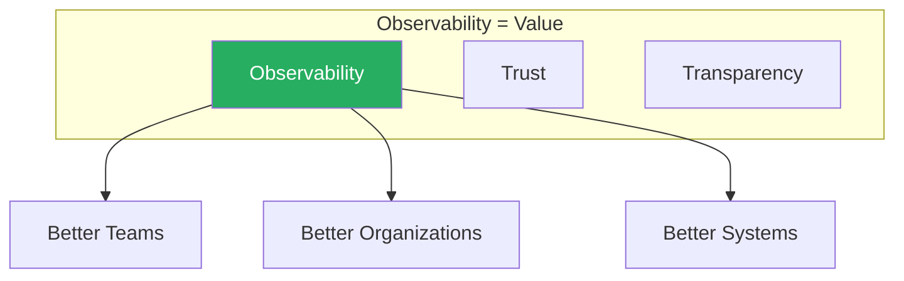

**Observability의 본질:**
- 단순한 도구가 아닌 **가치(Value)**
- 조직 전체의 **커밋먼트**
- 데이터를 의사결정의 **입력**으로 활용

---

### 2. The Three Axes of Observability

#### 2.1 세 가지 축 개요

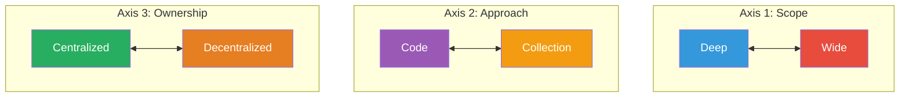

| 축 | 질문 | 고려사항 |
|---|------|----------|
| **Deep vs Wide** | 몇 개 서비스에 집중? 전체 확산? | 기존 텔레메트리 시스템 복잡도 |
| **Code vs Collection** | 새 계측? 기존 데이터 변환? | 조직 내 역할과 책임 |
| **Centralized vs Decentralized** | 중앙팀 주도? 각 팀 자율? | 조직 규모와 구조 |

---

### 3. Deep vs Wide

#### 3.1 결정 기준

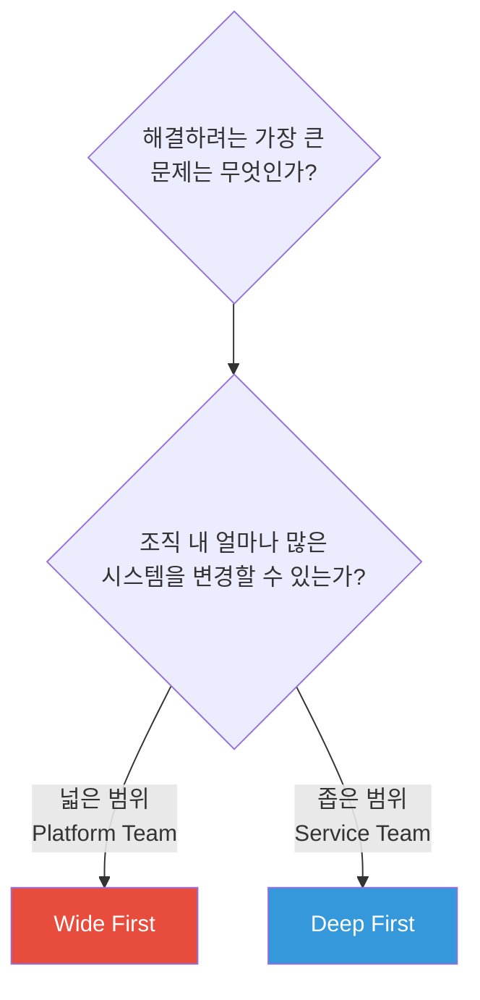

#### 3.2 Case Study: Going Deep (금융 서비스)

**상황:**
- 대규모 금융 서비스 조직
- GraphQL 서비스 운영 (멀티 클라우드, 멀티 언어)
- 기존 APM 도구로 GraphQL 트레이스 고립

**선택: Deep (GraphQL 집중)**

| 이유 | 설명 |
|------|------|
| **소유권** | 팀이 GraphQL 서비스만 담당 |
| **기술적 필요** | GraphQL은 HTTP 시맨틱 미사용 (에러가 응답 본문에) |
| **호환성** | 커스텀 Propagator로 기존 시스템 통합 |

**결과:** GraphQL 서비스에 대한 상세한 Observability 확보

#### 3.3 Case Study: Going Wide (SaaS 스타트업)

**상황:**
- 단일 클라우드 (Kubernetes)
- Go 언어로 통일
- 기존 OpenTracing 라이브러리 사용

**선택: Wide (전체 마이그레이션)**

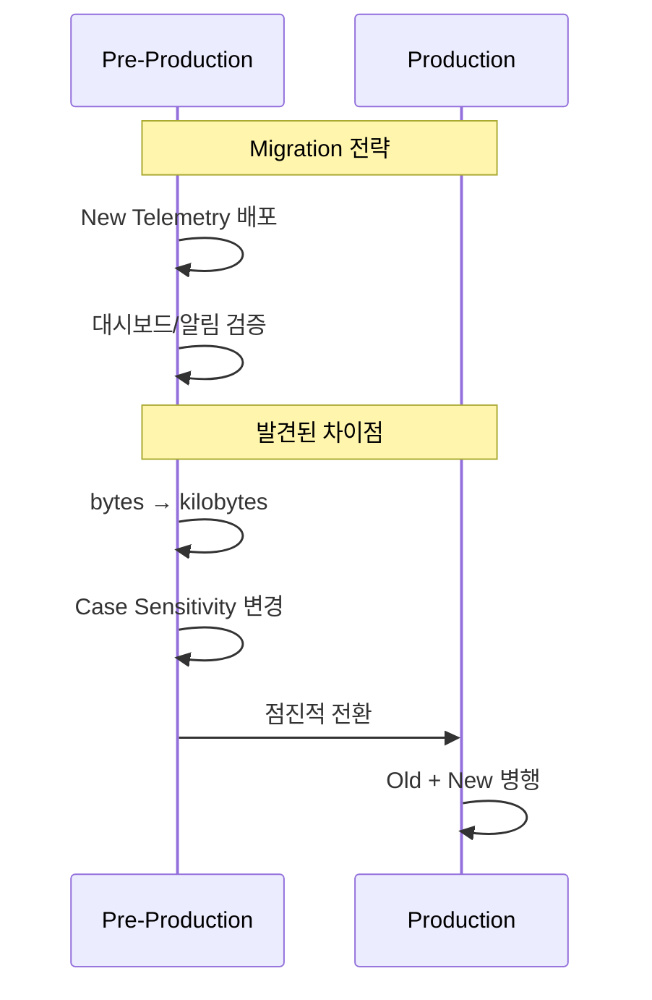

**핵심 교훈:**

| 항목 | 설명 |
|------|------|
| **Hippocratic Oath** | "First, break no alerts" |
| **인내심** | 예상치 못한 차이점 발생 |
| **준비** | 이미 Observable한 시스템이 유리 |
| **결과** | 약 1개월, 다운타임 없이 완료 |

#### 3.4 Deep vs Wide 비교표

| Deep Instrumentation | Wide Instrumentation |
|---------------------|---------------------|
| 단일 팀/서비스/프레임워크 집중 | 가능한 많은 서비스에 확산 |
| 빠른 가치 제공 | 더 많은 사전 작업 필요 |
| 커스텀 코드로 기존 시스템 통합 | 완전 마이그레이션 또는 병행 운영 |
| 대규모/미성숙 조직에 적합 | 장기적으로 더 큰 가치 |

---

### 4. Code vs Collection

#### 4.1 역할에 따른 선택

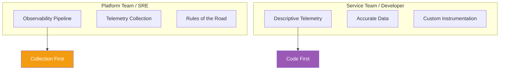

#### 4.2 Case Study: eBay (Collector First)

**상황:**
- 수백 개 클러스터, 일부는 수천 노드
- 기존 메트릭/로그 수집 인프라 존재

**전략: Collector First**

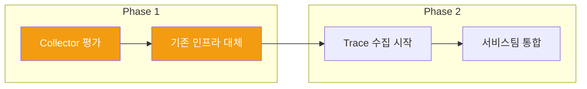

**Collector First 장점:**
- 성능 향상 (기존 솔루션 대비)
- 단일 에이전트로 통합 (Traces, Metrics, Logs)
- 서비스팀 통합 기반 마련

#### 4.3 언제 Code First?

| 상황 | 권장 |
|------|------|
| 단일 신호 (Traces만) | Code First |
| PoC / Hackathon | Code First |
| 20% Time 프로젝트 | Code First |
| "Art of the Possible" 시연 | Code First |

> 💡 **"Art of the Possible"**: 팀에게 무엇이 가능한지 보여주고, 지지를 얻은 후 인프라 작업으로 전환

---

### 5. Centralized vs Decentralized

#### 5.1 조직 규모별 전략

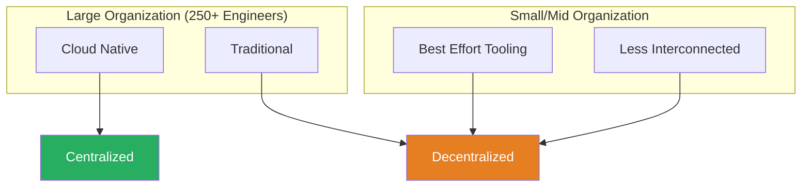

| 조직 유형 | 권장 전략 | 이유 |
|-----------|-----------|------|
| **Cloud Native 대기업** | Centralized | Platform Team이 가드레일 제공 |
| **Traditional 대기업** | Decentralized | 프로젝트 중심, 각 팀 책임 |
| **소규모** | Decentralized | 시스템 복잡도 낮음 |
| **Legacy** | Decentralized | 서비스 간 연결 적음 |

#### 5.2 Case Study: Farfetch (Centralized)

**상황:**
- 2,000+ 엔지니어
- Kubernetes 기반
- 2023년 1월 마이그레이션 시작

**전략: Centralized (Platform Team 주도)**

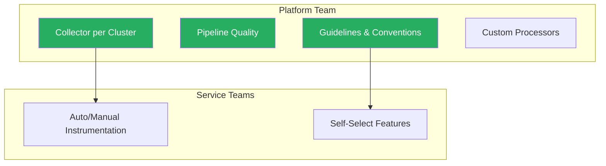

**중앙화 전략의 장점:**
- 기존 워크스트림 방해 최소화
- 데이터 품질 보장
- 팀이 원하는 기능만 선택적 도입

#### 5.3 시작하기 좋은 지점

| 영역 | 이유 |
|------|------|
| **CI/CD 시스템** | 독립적 운영, 넓은 권한 불필요 |
| **Service Bus** | 많은 데이터의 종착점, 자체 고객 |
| **Multitenant Infrastructure** | 광범위한 변경 없이 Tracing 추가 |

---

### 6. 롤아웃 Best Practices

#### 6.1 핵심 원칙 (Maxims)

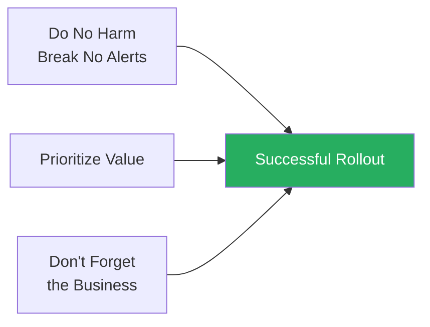

| 원칙 | 설명 |
|------|------|
| **Do No Harm** | 기존 알림/모니터링 깨지 않기 |
| **Prioritize Value** | 얻고자 하는 가치 반복적으로 명시 |
| **Business Focus** | 모든 이해관계자 참여, 데이터 활용 |

#### 6.2 성공적 롤아웃의 가치 유형

| 가치 | 예시 |
|------|------|
| **일관성** | 더 일관된 텔레메트리 데이터 |
| **유연성** | 벤더 Lock-in 감소 |
| **이해도** | 사용자 경험에 대한 더 나은 이해 |

---

### 7. Future: Innovation to Differentiation

#### 7.1 Observability as Testing

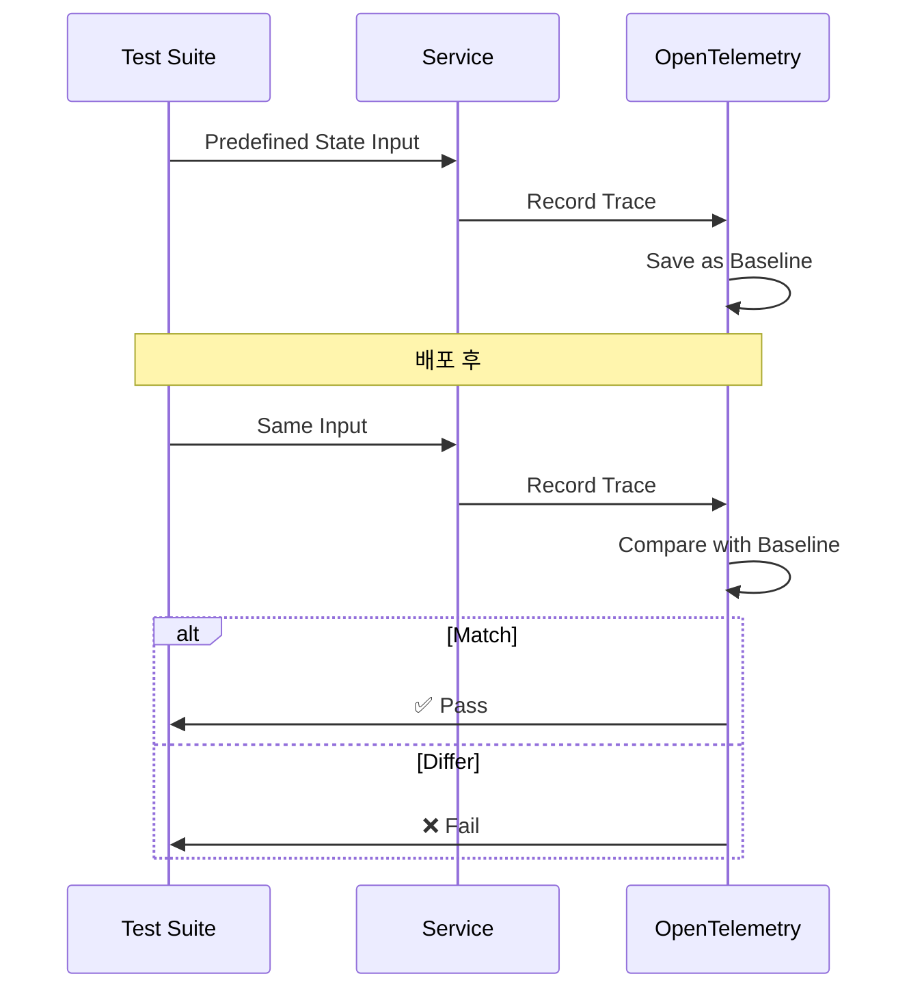

**활용 방법:**
- 알려진 상태로 Trace 기록 → Baseline
- 배포/카나리 후 동일 테스트
- 차이점 발견 시 Quality Gate 적용

**확장:**
- CI/CD 도구 자체에 Tracing/Profiling 추가
- 빌드/배포 시간 프로파일링

#### 7.2 Green Observability

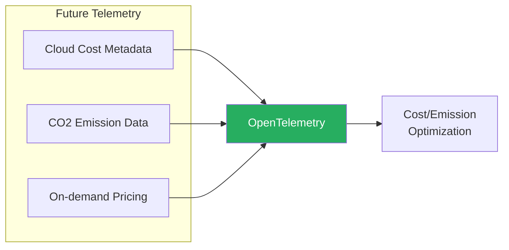

**FinOps 통합:**
- 서비스/API 호출별 비용 인사이트
- CO2 배출량 추적
- EU 규제 대응 준비

#### 7.3 AI Observability

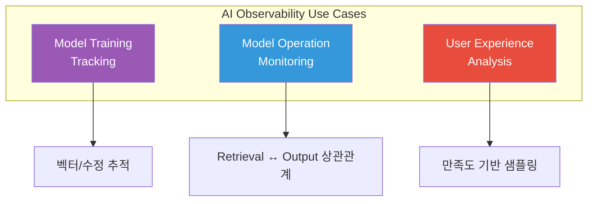

**AI Observability 3가지 영역:**

| 영역 | 설명 |
|------|------|
| **Training** | 모델/벡터 변경 추적 |
| **Operation** | Retrieval 결정과 출력 상관관계 |
| **User Experience** | 사용자 만족/불만족 트레이스 보존 |

---

## 🔍 심화 학습

### OpenTelemetry Rollout Checklist

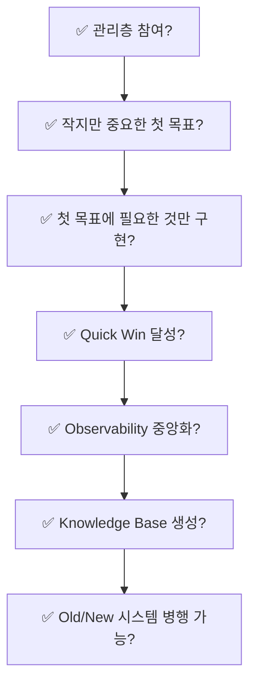

| 체크리스트 | 세부 사항 |
|------------|-----------|
| **관리층 참여** | 우선순위 충돌 방지, 백로그 관리 |
| **첫 번째 목표** | 특정 트랜잭션 (예: 체크아웃) |
| **필요한 것만** | 해당 트랜잭션 관련 서비스만 |
| **Quick Win** | 첫 계측 후 레이턴시 감소/에러 해결 |
| **중앙화** | 공통 프레임워크/라이브러리 활용 |
| **Knowledge Base** | 조직 특화 설치/문제해결 가이드 |
| **병행 운영** | 블랙아웃 없이 점진적 전환 |

### Patchwork Rollout 피하기

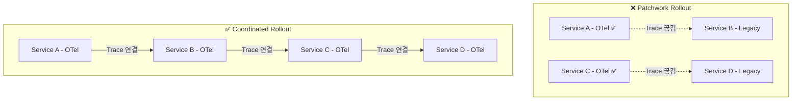

> ⚠️ **주의**: Tracing은 트랜잭션의 **모든** 서비스가 OTel 활성화되어야 동작

---

## 💡 실무 적용 포인트

### 축별 선택 가이드

| 상황 | Deep/Wide | Code/Collection | Cent/Decent |
|------|-----------|-----------------|-------------|
| **Platform Team** | Wide | Collection | Centralized |
| **Service Team** | Deep | Code | Decentralized |
| **스타트업** | Wide | Code First | Decentralized |
| **Enterprise** | 상황별 | Collection | Centralized |
| **PoC/Hackathon** | Deep | Code | N/A |

### 주의사항

| 안티패턴 | 문제점 | 올바른 접근 |
|----------|--------|-------------|
| 관리층 없이 롤아웃 | 우선순위 충돌, 20% Time 전락 | 초기부터 관리층 참여 |
| Patchwork Rollout | Trace 끊김, 가치 저하 | 트랜잭션 단위 조율 |
| 기존 시스템 즉시 제거 | 알림 블랙아웃 | 병행 운영 후 점진적 전환 |
| 모든 서비스 동시 롤아웃 | 조율 어려움 | 작은 목표부터 시작 |

### 면접 예상 질문

1. **"OpenTelemetry 롤아웃의 세 가지 축은?"**
   - Deep vs Wide: 몇 개 서비스에 집중할지
   - Code vs Collection: 새 계측 vs 기존 데이터 변환
   - Centralized vs Decentralized: 중앙팀 주도 vs 자율

2. **"Deep First vs Wide First 선택 기준은?"**
   - Deep: 서비스팀, 제한된 범위, 빠른 가치 필요
   - Wide: Platform팀, 넓은 범위, 동질적 시스템
   - 결정 요소: 조직 내 역할, 변경 가능 범위

3. **"성공적인 OpenTelemetry 롤아웃의 핵심 요소는?"**
   - 관리층 참여
   - 작지만 중요한 첫 번째 목표
   - Quick Win 달성으로 모멘텀 구축
   - "Do No Harm, Break No Alerts" 원칙

---

## ✅ 핵심 개념 체크리스트

### 세 가지 축
- [ ] Deep vs Wide의 trade-off 이해
- [ ] Code vs Collection 선택 기준
- [ ] Centralized vs Decentralized 조직별 적합성

### Case Studies
- [ ] 금융 서비스 (GraphQL, Deep)
- [ ] SaaS 스타트업 (OpenTracing → OTel, Wide)
- [ ] eBay (Collector First)
- [ ] Farfetch (Centralized Platform Team)

### Rollout 전략
- [ ] 7가지 Rollout Checklist 항목
- [ ] Patchwork Rollout 위험성
- [ ] Quick Win의 중요성
- [ ] 병행 운영 전략

### 미래 트렌드
- [ ] Observability as Testing 개념
- [ ] Green Observability (FinOps 통합)
- [ ] AI Observability 3가지 영역

---

## 🔗 참고 자료

### 공식 문서
- [OpenTelemetry Getting Started](https://opentelemetry.io/docs/getting-started/)
- [OpenTelemetry Best Practices](https://opentelemetry.io/docs/concepts/)

### Case Studies
- [eBay OpenTelemetry Adoption](https://tech.ebayinc.com/)
- [Farfetch Engineering Blog](https://www.farfetchtechblog.com/)

### 추가 학습
- Moore, Geoffrey. "Crossing the Chasm: Marketing and Selling High-Tech Products to Mainstream Customers"
- [OpenTelemetry Community](https://opentelemetry.io/community/)

### 기여하기
- [OpenTelemetry Contribution Guide](https://github.com/open-telemetry/community/blob/main/CONTRIBUTING.md)
- [OpenTelemetry Governance](https://github.com/open-telemetry/community/blob/main/governance.md)
