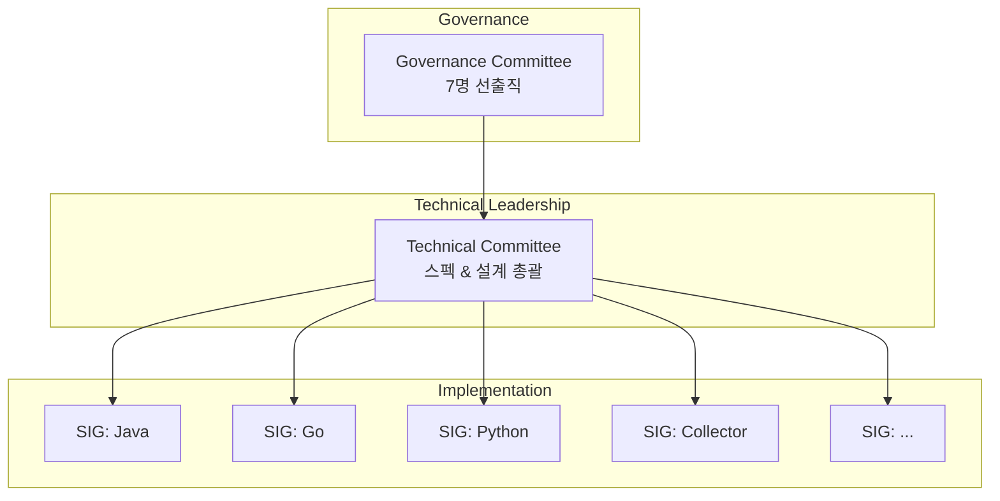
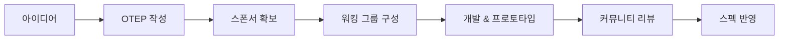

# Appendix A: OpenTelemetry 프로젝트 (The OpenTelemetry Project)

---

### 📌 핵심 요약
> OpenTelemetry는 CNCF 소속 프로젝트로, Kubernetes 다음으로 큰 두 번째 규모의 오픈소스 프로젝트다. 2,800명 이상의 기여자가 참여하며, SIG(Special Interest Group), TC(Technical Committee), GC(Governance Committee)의 3계층 구조로 운영된다. 월별 스펙 릴리스와 OTEP(Enhancement Proposal) 프로세스를 통해 표준을 발전시킨다. 누구나 SIG에 참여하거나 End User Working Group을 통해 피드백을 제공할 수 있다.

---

### 🎯 학습 목표
- OpenTelemetry 프로젝트의 규모와 위상을 이해한다
- 조직 구조(SIG, TC, GC)와 각 역할을 설명할 수 있다
- 스펙 개발 프로세스와 OTEP의 역할을 이해한다
- 프로젝트에 기여하는 방법을 안다

---

### 📖 본문 정리

#### 1. 프로젝트 개요

| 항목 | 내용 |
|------|------|
| **소속** | Cloud Native Computing Foundation (CNCF) |
| **라이선스** | AGPL |
| **저작권** | OpenTelemetry Authors |
| **상표권** | Linux Foundation |
| **총 기여자** | 2,800명 이상 (2024년 기준) |
| **월간 활성 기여자** | 약 900명 |
| **CNCF 순위** | 2위 (Kubernetes 다음) |

> *"OpenTelemetry는 Kubernetes 다음으로 CNCF에서 두 번째로 큰 프로젝트다."*

---

#### 2. 조직 구조



##### Special Interest Groups (SIGs)

각 언어/컴포넌트별 코드베이스를 관리하는 그룹:

| 역할 | 책임 | 권한 |
|------|------|------|
| **Member** | PR, 이슈, 리뷰 기여 | 투표권 (활성 멤버) |
| **Triager** | 백로그 정리, 프로젝트 관리 | GitHub triage 권한 |
| **Approver** | PR 리뷰 및 최종 승인 | 머지 권한 |
| **Maintainer** | 로드맵 정의, SIG 관리 | 기술 결정권, 역할 부여권 |

```
SIG 역할 계층:
Member → Triager → Approver → Maintainer
  │         │          │           │
  │         │          │           └─ 로드맵, 기술 결정
  │         │          └─ PR 승인, 머지
  │         └─ 이슈 관리, 분류
  └─ 기여, 리뷰, 투표
```

##### Technical Committee (TC)

**역할**:
- OpenTelemetry 스펙 유지/관리
- 전체 설계 및 엔지니어링 방향 가이드
- OTEP 리뷰 및 승인

##### Governance Committee (GC)

**역할**:
- 7명의 선출직 멤버
- 조직 구조 및 프로세스 설계/유지
- CNCF 내 OpenTelemetry 대표
- 프로젝트 최종 의사결정권

---

#### 3. OpenTelemetry Specification

##### 스펙 릴리스 주기

```
매월 새 버전 릴리스
    │
    ▼
각 언어 SDK 구현
    │
    ▼
구현체는 준수하는 스펙 버전 명시
```

**예시**:
```
opentelemetry-java v1.25.0
├── Spec version: 1.21.0
├── Traces: Stable
├── Metrics: Stable
└── Logs: Experimental
```

##### OTEP (OpenTelemetry Enhancement Proposal)

**정의**: 스펙 확장/개선을 위한 제안 문서

**프로세스**:
```
1. OTEP 작성
    │
    ▼
2. TC 리뷰
    │
    ▼
3. 관련 Approvers 리뷰
    │
    ▼
4. 커뮤니티 피드백
    │
    ▼
5. 승인/거절/수정 요청
    │
    ▼
6. 스펙에 반영
```

> *"OTEP 성공 팁: 제안 설계 단계에서 관련 핵심 기여자들과 적극적으로 소통하라."*

---

#### 4. 프로젝트 관리

##### 개발 프로세스



##### 프로젝트 승인 요건

프로젝트가 승인되려면 최소 다음이 필요:

| 요건 | 설명 |
|------|------|
| **명확한 목표** | 달성하려는 것과 산출물 정의 |
| **데드라인** | 커뮤니티 리뷰 가능 시점 |
| **스폰서** | TC/GC 멤버 2명 (또는 위임자) |
| **전문가 그룹** | 스펙 설계, OTEP 작성, 프로토타입, 정기 미팅 참여 가능한 인원 |

##### 프로젝트 보드

모든 개발 프로젝트는 [OpenTelemetry Project Board](https://github.com/orgs/open-telemetry/projects)에서 관리됨.

> *"프로젝트의 전체 방향을 이해하려면 프로젝트 보드를 확인하라."*

---

#### 5. 참여 방법

##### 기여자로 참여

```
참여 단계:
1. 관심 있는 SIG 선택
    │
    ▼
2. GitHub 이슈/PR 기여 시작
    │
    ▼
3. Slack, Zoom 미팅 참여
    │
    ▼
4. 꾸준한 기여 → 역할 부여
```

**역할 획득 조건**:
- 일관된 커밋 기록
- 코드 리뷰 참여
- 커뮤니티 지원 활동

##### End User로 참여

| 채널 | 용도 |
|------|------|
| **End User Working Group** | 사용자 경험 보고, 피드백 전달 |
| **Monthly Discussion Group** | 핵심 기여자와 직접 대화, 조언 |

> *"전문가나 핵심 기여자가 아니어도 괜찮다. 최종 사용자는 어디서나 환영받는다."*

---

#### 6. 주요 리소스

| 리소스 | URL / 위치 |
|--------|-----------|
| **공식 사이트** | [opentelemetry.io](https://opentelemetry.io) |
| **GitHub** | [github.com/open-telemetry](https://github.com/open-telemetry) |
| **Slack** | CNCF Slack (#opentelemetry-*) |
| **미팅** | Zoom (주간 SIG 미팅) |
| **커뮤니티 저장소** | [Community GitHub](https://github.com/open-telemetry/community) |

##### 커뮤니티 저장소 내용

```
open-telemetry/community
├── 미팅 캘린더
├── CNCF Slack 가입 안내
├── 현재/예정 프로젝트 제안
├── 프로젝트 관리 상세
├── 현재 GC/TC 멤버 목록
└── GC/TC 헌장(Charter)
```

---

### 🔍 심화 학습

#### OpenTelemetry vs 다른 CNCF 프로젝트

| 순위 | 프로젝트 | 월간 활성 기여자 | 분야 |
|------|----------|------------------|------|
| 1 | Kubernetes | ~3,000+ | 컨테이너 오케스트레이션 |
| 2 | OpenTelemetry | ~900 | Observability |
| 3 | Envoy | ~500 | 서비스 메시 |
| 4 | Prometheus | ~400 | 모니터링 |

#### CNCF 프로젝트 성숙도

OpenTelemetry는 **Incubating** 상태 (2024년 기준):

| 단계 | 설명 | 예시 |
|------|------|------|
| Sandbox | 초기 단계, 실험적 | 새로운 프로젝트 |
| Incubating | 성장 중, 프로덕션 사용 | OpenTelemetry |
| Graduated | 성숙, 널리 채택 | Kubernetes, Prometheus |

#### OTEP vs RFC vs PEP

| 프로세스 | 조직 | 용도 |
|----------|------|------|
| OTEP | OpenTelemetry | 스펙 확장 제안 |
| RFC | IETF | 인터넷 표준 |
| PEP | Python | 언어 기능 제안 |
| JEP | Java/OpenJDK | JDK 기능 제안 |

---

### 💡 실무 적용 포인트

1. **SIG 참여**: 사용 중인 언어의 SIG에 참여하여 최신 동향 파악
2. **Slack 가입**: #opentelemetry-* 채널에서 질문 및 토론
3. **미팅 참관**: 주간 SIG 미팅 참관으로 로드맵 이해
4. **End User WG**: 조직의 사용 경험을 공유하여 프로젝트 방향에 기여
5. **이슈 기여**: good first issue 라벨로 첫 기여 시작
6. **OTEP 모니터링**: 관심 분야의 OTEP 팔로우하여 미래 기능 파악

---

### ✅ 정리 체크리스트

- [ ] OpenTelemetry가 CNCF 2위 규모 프로젝트임을 안다
- [ ] SIG, TC, GC의 역할과 관계를 설명할 수 있다
- [ ] SIG 내 역할 계층(Member → Triager → Approver → Maintainer)을 안다
- [ ] OTEP 프로세스를 이해한다
- [ ] 프로젝트 승인 요건을 안다
- [ ] 기여자로 참여하는 방법을 안다
- [ ] End User Working Group의 역할을 안다
- [ ] 주요 커뮤니티 리소스 위치를 안다

---

### 🔗 참고 자료

- Ted Young & Austin Parker, *Learning OpenTelemetry* (O'Reilly, 2024) - Appendix A
- [OpenTelemetry Official Site](https://opentelemetry.io)
- [OpenTelemetry GitHub](https://github.com/open-telemetry)
- [OpenTelemetry Community Repository](https://github.com/open-telemetry/community)
- [Community Membership Document](https://github.com/open-telemetry/community/blob/main/community-membership.md)
- [Governance Committee Charter](https://github.com/open-telemetry/community/blob/main/governance-charter.md)
- [CNCF Slack](https://slack.cncf.io)
