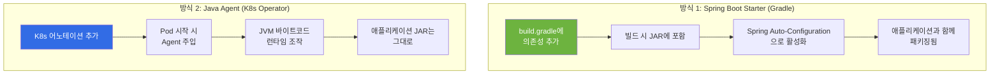
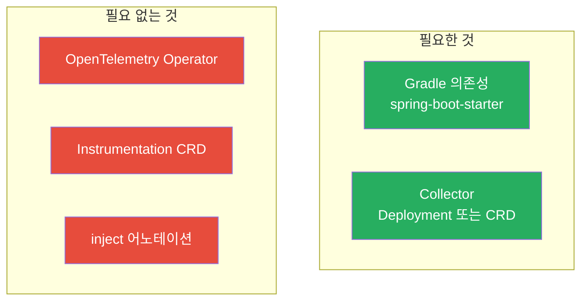
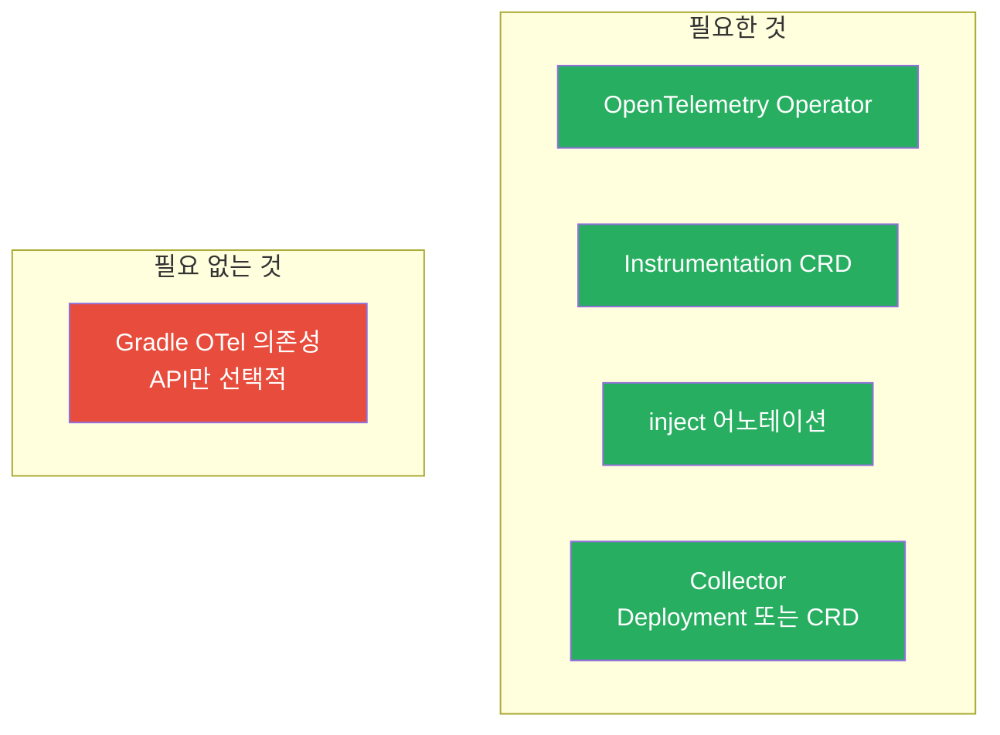
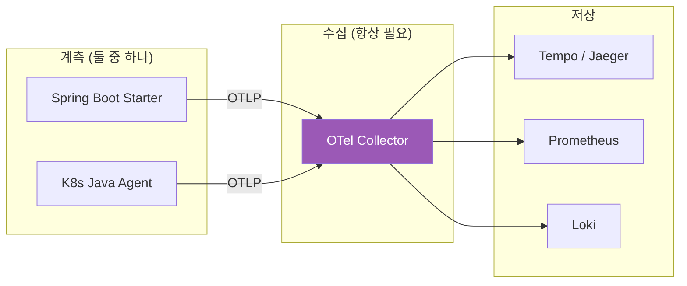
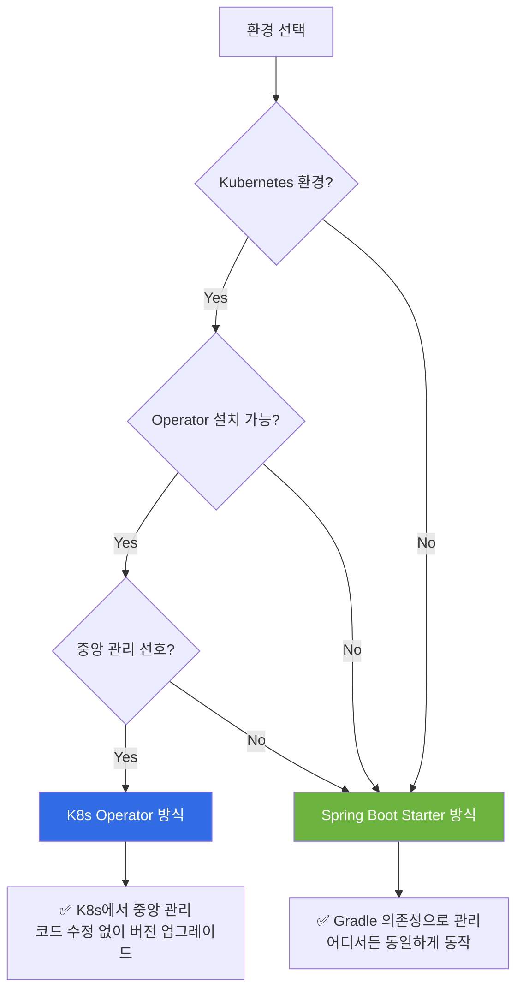

# 자동 계측 방식 비교: Spring Boot Starter vs K8s Operator

OpenTelemetry에서 "자동 계측(Auto-Instrumentation)"을 구현하는 두 가지 방식을 비교하고, 언제 어떤 방식을 선택해야 하는지 안내합니다.

---

## 📌 핵심 요약

> **두 방식 모두 "자동 계측"입니다.** 차이점은 "어디서 관리하느냐"입니다.
> - **Spring Boot Starter**: 개발팀이 코드/빌드에서 관리
> - **K8s Operator Agent**: 플랫폼/인프라팀이 Kubernetes에서 관리
>
> 두 방식을 **동시에 사용하면 충돌**할 수 있으므로, 환경에 맞게 **하나를 선택**하는 것이 좋습니다.

---

## 1. 두 가지 자동 계측 방식 개요



### 동작 방식 비교

| 구분 | Spring Boot Starter | K8s Operator (Java Agent) |
|------|---------------------|---------------------------|
| **설치 방식** | `build.gradle`에 의존성 추가 | K8s 어노테이션 또는 `-javaagent` |
| **동작 시점** | 빌드 시 포함 | 런타임에 주입 |
| **기술 원리** | Spring Auto-Configuration | JVM 바이트코드 조작 |
| **JAR 크기** | 커짐 (라이브러리 포함) | 그대로 (Agent는 별도) |
| **코드 수정** | 불필요 | 불필요 |
| **환경 의존성** | 없음 (어디서든 실행) | K8s Operator 또는 Agent 파일 필요 |
| **버전 관리** | Gradle에서 관리 | K8s/Infra에서 관리 |
| **계측 범위** | HTTP, JDBC, Kafka, Redis 등 | HTTP, JDBC, Kafka, Redis 등 |

---

## 2. 방식별 상세 설정

### 2.1 Spring Boot Starter 방식

#### Gradle 설정

```kotlin
// build.gradle.kts
plugins {
    id("org.springframework.boot") version "3.2.0"
    id("io.spring.dependency-management") version "1.1.4"
}

dependencies {
    // Spring Boot 기본
    implementation("org.springframework.boot:spring-boot-starter-web")
    implementation("org.springframework.boot:spring-boot-starter-data-jpa")
    
    // ✅ OpenTelemetry 자동 계측 (이것만 추가하면 됨!)
    implementation("io.opentelemetry.instrumentation:opentelemetry-spring-boot-starter:2.1.0-alpha")
}
```

#### application.yml 설정

```yaml
# application.yml
otel:
  # Exporter 설정
  exporter:
    otlp:
      endpoint: http://otel-collector:4317
      protocol: grpc
  
  # 서비스 정보
  resource:
    attributes:
      service.name: order-service
      service.version: 1.0.0
      deployment.environment: production
  
  # 샘플링 설정
  traces:
    sampler:
      probability: 0.1  # 10% 샘플링

# 또는 환경변수로 설정
# OTEL_EXPORTER_OTLP_ENDPOINT=http://otel-collector:4317
# OTEL_SERVICE_NAME=order-service
```

#### Kubernetes Deployment (Instrumentation 어노테이션 불필요)

```yaml
# order-service-deployment.yaml
apiVersion: apps/v1
kind: Deployment
metadata:
  name: order-service
  namespace: order-service
spec:
  replicas: 3
  selector:
    matchLabels:
      app: order-service
  template:
    metadata:
      labels:
        app: order-service
      # ❌ Instrumentation 어노테이션 필요 없음!
      # annotations:
      #   instrumentation.opentelemetry.io/inject-java: "true"
    spec:
      containers:
        - name: order-service
          image: myregistry/order-service:1.0.0
          ports:
            - containerPort: 8080
          env:
            # Collector 엔드포인트 설정
            - name: OTEL_EXPORTER_OTLP_ENDPOINT
              value: "http://otel-collector.monitoring:4317"
            - name: OTEL_SERVICE_NAME
              value: "order-service"
```

---

### 2.2 K8s Operator (Java Agent) 방식

#### Gradle 설정 (최소화)

```kotlin
// build.gradle.kts
dependencies {
    // Spring Boot 기본
    implementation("org.springframework.boot:spring-boot-starter-web")
    implementation("org.springframework.boot:spring-boot-starter-data-jpa")
    
    // ❌ OTel 의존성 불필요!
    // 커스텀 Span 필요하면 API만 추가
    compileOnly("io.opentelemetry:opentelemetry-api:1.32.0")
}
```

#### OpenTelemetry Operator 설치

```bash
# 1. cert-manager 설치 (Operator 의존성)
kubectl apply -f https://github.com/cert-manager/cert-manager/releases/download/v1.13.0/cert-manager.yaml

# 2. OpenTelemetry Operator 설치
kubectl apply -f https://github.com/open-telemetry/opentelemetry-operator/releases/latest/download/opentelemetry-operator.yaml
```

#### Instrumentation CRD 등록

```yaml
# instrumentation.yaml
apiVersion: opentelemetry.io/v1alpha1
kind: Instrumentation
metadata:
  name: java-instrumentation
  namespace: order-service
spec:
  exporter:
    endpoint: http://otel-collector.monitoring:4317
  
  propagators:
    - tracecontext
    - baggage
  
  sampler:
    type: parentbased_traceidratio
    argument: "0.1"  # 10% 샘플링
  
  java:
    image: ghcr.io/open-telemetry/opentelemetry-operator/autoinstrumentation-java:latest
    env:
      - name: OTEL_INSTRUMENTATION_JDBC_ENABLED
        value: "true"
      - name: OTEL_INSTRUMENTATION_SPRING_WEBMVC_ENABLED
        value: "true"
      - name: OTEL_INSTRUMENTATION_KAFKA_ENABLED
        value: "true"
```

#### Kubernetes Deployment (어노테이션 필요)

```yaml
# order-service-deployment.yaml
apiVersion: apps/v1
kind: Deployment
metadata:
  name: order-service
  namespace: order-service
spec:
  replicas: 3
  selector:
    matchLabels:
      app: order-service
  template:
    metadata:
      labels:
        app: order-service
      annotations:
        # ✅ Instrumentation 어노테이션 필요!
        instrumentation.opentelemetry.io/inject-java: "java-instrumentation"
    spec:
      containers:
        - name: order-service
          image: myregistry/order-service:1.0.0
          ports:
            - containerPort: 8080
          # 환경변수는 Instrumentation CRD에서 자동 주입됨
```

---

## 3. 필요한 K8s 리소스 비교

### Spring Boot Starter 방식



### K8s Operator 방식



### 비교표

| 구성 요소 | Spring Starter 방식 | K8s Operator 방식 |
|----------|--------------------|--------------------|
| **Gradle 의존성** | `spring-boot-starter` 필요 | 없거나 API만 (선택) |
| **OpenTelemetry Operator** | ❌ 불필요 | ✅ 필요 |
| **Instrumentation CRD** | ❌ 불필요 | ✅ 필요 |
| **Deployment 어노테이션** | ❌ 불필요 | ✅ 필요 |
| **Collector** | ✅ 필요 | ✅ 필요 |
| **Collector CRD** | 선택 | 선택 |

---

## 4. Collector는 항상 필요

**중요**: 어떤 계측 방식을 선택하든 **Collector는 반드시 필요합니다**. Collector가 텔레메트리 데이터를 수신하여 백엔드로 전송합니다.



### Collector 배포 방법 (둘 다 가능)

```yaml
# 방법 1: 일반 Deployment
apiVersion: apps/v1
kind: Deployment
metadata:
  name: otel-collector
  namespace: monitoring
spec:
  replicas: 2
  selector:
    matchLabels:
      app: otel-collector
  template:
    spec:
      containers:
        - name: collector
          image: otel/opentelemetry-collector-contrib:0.91.0
          args: ["--config=/etc/otel/config.yaml"]
          ports:
            - containerPort: 4317  # OTLP gRPC
            - containerPort: 4318  # OTLP HTTP
          volumeMounts:
            - name: config
              mountPath: /etc/otel
      volumes:
        - name: config
          configMap:
            name: otel-collector-config
---
# 방법 2: OpenTelemetryCollector CRD (Operator 필요)
apiVersion: opentelemetry.io/v1alpha1
kind: OpenTelemetryCollector
metadata:
  name: otel-collector
  namespace: monitoring
spec:
  mode: deployment
  replicas: 2
  config: |
    receivers:
      otlp:
        protocols:
          grpc:
            endpoint: 0.0.0.0:4317
          http:
            endpoint: 0.0.0.0:4318
    
    processors:
      batch:
        timeout: 5s
    
    exporters:
      otlp:
        endpoint: tempo:4317
    
    service:
      pipelines:
        traces:
          receivers: [otlp]
          processors: [batch]
          exporters: [otlp]
```

---

## 5. 하이브리드 방식: 자동 + 수동 계측

두 방식 모두 **커스텀 Span**을 추가할 수 있습니다. 자동 계측으로 기본적인 HTTP, DB 호출을 추적하고, 비즈니스 로직에는 수동으로 Span을 추가합니다.

### Spring Boot Starter + 커스텀 Span

```kotlin
// build.gradle.kts
dependencies {
    implementation("io.opentelemetry.instrumentation:opentelemetry-spring-boot-starter:2.1.0-alpha")
    // API는 Starter에 포함되어 있음
}
```

```java
@Service
public class OrderService {
    
    private static final Tracer tracer = 
        GlobalOpenTelemetry.getTracer("order-service");
    
    public Order createOrder(OrderRequest request) {
        // 커스텀 비즈니스 Span
        Span span = tracer.spanBuilder("process-order-business-logic")
            .setAttribute("order.id", orderId)
            .setAttribute("order.total", request.getTotal())
            .setAttribute("customer.tier", customer.getTier())
            .startSpan();
        
        try (Scope scope = span.makeCurrent()) {
            // 비즈니스 로직
            // HTTP, DB 호출은 Starter가 자동 계측
            return processOrder(request);
        } finally {
            span.end();
        }
    }
}
```

### K8s Agent + 커스텀 Span

```kotlin
// build.gradle.kts
dependencies {
    // API만 추가 (SDK는 Agent가 제공)
    compileOnly("io.opentelemetry:opentelemetry-api:1.32.0")
}
```

```java
// 동일한 코드 사용 가능
@Service
public class OrderService {
    
    private static final Tracer tracer = 
        GlobalOpenTelemetry.getTracer("order-service");
    
    public Order createOrder(OrderRequest request) {
        Span span = tracer.spanBuilder("process-order-business-logic")
            .setAttribute("order.id", orderId)
            .startSpan();
        // ...
    }
}
```

### 결과 Trace 예시

```
[HTTP POST /api/orders] 200ms                    ← 자동 계측
  └── [process-order-business-logic] 180ms       ← 수동 계측 (커스텀)
      ├── order.id: ORD-12345
      ├── order.total: 50000
      ├── customer.tier: GOLD
      │
      ├── [SELECT * FROM customers] 20ms         ← 자동 계측
      ├── [INSERT INTO orders] 30ms              ← 자동 계측
      └── [Kafka send: order-events] 10ms        ← 자동 계측
```

---

## 6. 환경별 선택 가이드



### 선택 기준 정리

| 상황 | 권장 방식 | 이유 |
|------|----------|------|
| 로컬 개발 환경 | Spring Boot Starter | JAR 하나로 실행 가능 |
| Docker Compose | Spring Boot Starter | Agent 설정 복잡 |
| VM 배포 | Spring Boot Starter | 인프라 의존성 없음 |
| K8s (Operator 없음) | Spring Boot Starter | CRD 사용 불가 |
| K8s (Operator 있음) + 개발팀 관리 | Spring Boot Starter | 버전을 코드와 함께 관리 |
| K8s (Operator 있음) + 플랫폼팀 관리 | K8s Operator | 중앙에서 일괄 관리 |
| 여러 언어 혼용 | K8s Operator | 통일된 방식으로 관리 |

---

## 7. 주의사항: 동시 사용 시 충돌

**두 방식을 동시에 사용하면 충돌이 발생할 수 있습니다!**

```
⚠️ 잘못된 설정 예시:

1. Gradle에 spring-boot-starter 추가
2. K8s Deployment에 inject 어노테이션 추가

결과:
- 두 개의 Tracer가 동시에 동작
- 중복된 Span 생성
- 예상치 못한 동작
```

### 해결 방법

```yaml
# K8s Operator 사용 시: Gradle 의존성 제거 또는 비활성화
# application.yml
otel:
  sdk:
    disabled: true  # Spring Boot Starter 비활성화
```

또는

```kotlin
// Spring Boot Starter 사용 시: K8s 어노테이션 제거
// Deployment에서 어노테이션 삭제
```

---

## 8. React Frontend 계측

React Frontend는 별도의 방식으로 계측합니다. K8s Operator는 서버 사이드 언어만 지원합니다.

```typescript
// src/telemetry/index.ts
import { WebTracerProvider } from '@opentelemetry/sdk-trace-web';
import { BatchSpanProcessor } from '@opentelemetry/sdk-trace-base';
import { OTLPTraceExporter } from '@opentelemetry/exporter-trace-otlp-http';
import { registerInstrumentations } from '@opentelemetry/instrumentation';
import { FetchInstrumentation } from '@opentelemetry/instrumentation-fetch';

export function initTelemetry() {
  const provider = new WebTracerProvider();
  
  const exporter = new OTLPTraceExporter({
    url: process.env.REACT_APP_OTEL_ENDPOINT || 'http://localhost:4318/v1/traces',
  });
  
  provider.addSpanProcessor(new BatchSpanProcessor(exporter));
  provider.register();
  
  registerInstrumentations({
    instrumentations: [
      new FetchInstrumentation({
        propagateTraceHeaderCorsUrls: [/https?:\/\/api\.example\.com\/.*/],
      }),
    ],
  });
}
```

```tsx
// src/index.tsx
import { initTelemetry } from './telemetry';

initTelemetry();  // 앱 시작 시 초기화

ReactDOM.createRoot(document.getElementById('root')!).render(
  <React.StrictMode>
    <App />
  </React.StrictMode>
);
```

---

## 9. 전체 아키텍처 예시

### Spring Boot Starter 방식

```
┌─────────────────────────────────────────────────────────────────────┐
│                        Kubernetes Cluster                           │
├─────────────────────────────────────────────────────────────────────┤
│                                                                     │
│  ┌─────────────────────────────────────────────────────────────┐   │
│  │ order-service Pod                                            │   │
│  │ ┌─────────────────────────────────────────────────────────┐ │   │
│  │ │ Spring Boot + OTel Starter                              │ │   │
│  │ │ (자동 계측 내장)                                         │ │   │
│  │ └─────────────────────────────────────────────────────────┘ │   │
│  └─────────────────────────────────────────────────────────────┘   │
│         │                                                           │
│         │ OTLP                                                      │
│         ▼                                                           │
│  ┌─────────────────────────────────────────────────────────────┐   │
│  │ OTel Collector (Deployment)                                  │   │
│  │ - Operator 불필요                                            │   │
│  │ - 일반 Deployment로 배포                                     │   │
│  └─────────────────────────────────────────────────────────────┘   │
│         │                                                           │
│         ▼                                                           │
│  ┌─────────────────────────────────────────────────────────────┐   │
│  │ Tempo / Prometheus / Loki                                    │   │
│  └─────────────────────────────────────────────────────────────┘   │
│                                                                     │
└─────────────────────────────────────────────────────────────────────┘
```

### K8s Operator 방식

```
┌─────────────────────────────────────────────────────────────────────┐
│                        Kubernetes Cluster                           │
├─────────────────────────────────────────────────────────────────────┤
│                                                                     │
│  ┌─────────────────────────────────────────────────────────────┐   │
│  │ OpenTelemetry Operator                                       │   │
│  │ ┌─────────────────┐  ┌─────────────────────────────────┐    │   │
│  │ │ Instrumentation │  │ Watches Pods with annotations   │    │   │
│  │ │ CRD             │  │ Injects Java Agent              │    │   │
│  │ └─────────────────┘  └─────────────────────────────────┘    │   │
│  └─────────────────────────────────────────────────────────────┘   │
│                                                                     │
│  ┌─────────────────────────────────────────────────────────────┐   │
│  │ order-service Pod                                            │   │
│  │ ┌─────────────────────────────────────────────────────────┐ │   │
│  │ │ Init Container: Copy Java Agent                         │ │   │
│  │ └─────────────────────────────────────────────────────────┘ │   │
│  │ ┌─────────────────────────────────────────────────────────┐ │   │
│  │ │ Spring Boot (OTel 의존성 없음)                          │ │   │
│  │ │ + Java Agent (런타임 주입)                               │ │   │
│  │ └─────────────────────────────────────────────────────────┘ │   │
│  └─────────────────────────────────────────────────────────────┘   │
│         │                                                           │
│         │ OTLP                                                      │
│         ▼                                                           │
│  ┌─────────────────────────────────────────────────────────────┐   │
│  │ OTel Collector (CRD 또는 Deployment)                         │   │
│  └─────────────────────────────────────────────────────────────┘   │
│                                                                     │
└─────────────────────────────────────────────────────────────────────┘
```

---

## 📋 체크리스트

### Spring Boot Starter 방식 체크리스트

- [ ] `build.gradle`에 `opentelemetry-spring-boot-starter` 의존성 추가
- [ ] `application.yml`에 OTLP 엔드포인트 설정
- [ ] Collector Deployment 배포
- [ ] (선택) 커스텀 Span 필요 시 API 사용
- [ ] K8s Deployment에서 inject 어노테이션 **사용하지 않음**

### K8s Operator 방식 체크리스트

- [ ] cert-manager 설치
- [ ] OpenTelemetry Operator 설치
- [ ] Instrumentation CRD 생성
- [ ] Collector CRD 또는 Deployment 생성
- [ ] Deployment에 inject 어노테이션 추가
- [ ] (선택) 커스텀 Span 필요 시 `compileOnly` API 의존성 추가
- [ ] Gradle에서 OTel Starter **사용하지 않음**

---

## 🔗 참고 자료

- [OpenTelemetry Spring Boot Starter](https://opentelemetry.io/docs/instrumentation/java/automatic/spring-boot/)
- [OpenTelemetry Operator](https://opentelemetry.io/docs/k8s/operator/)
- [OpenTelemetry Java Agent](https://opentelemetry.io/docs/instrumentation/java/automatic/)
- [OpenTelemetry Collector](https://opentelemetry.io/docs/collector/)

