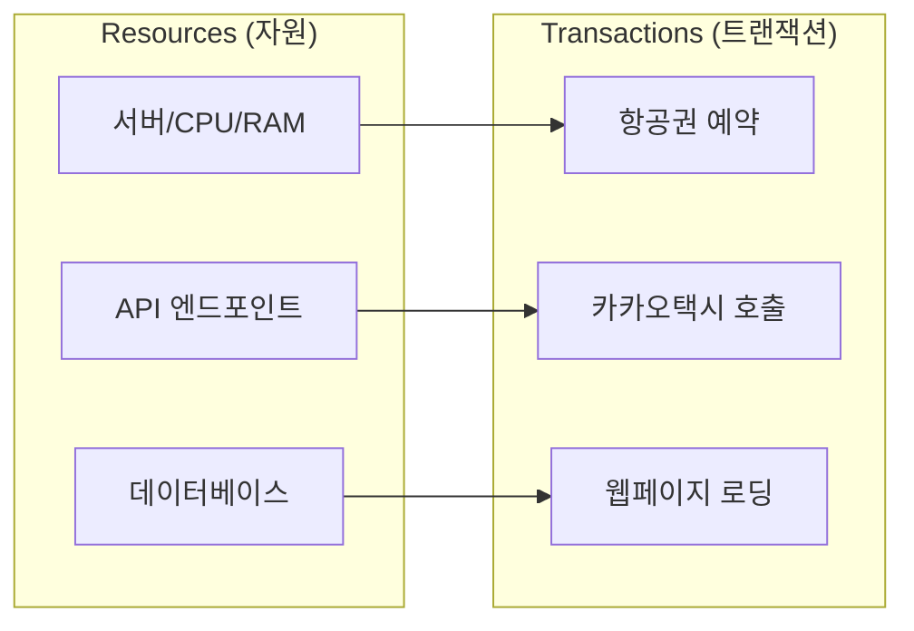
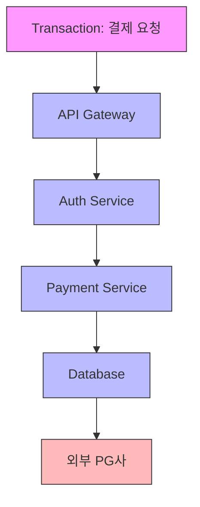
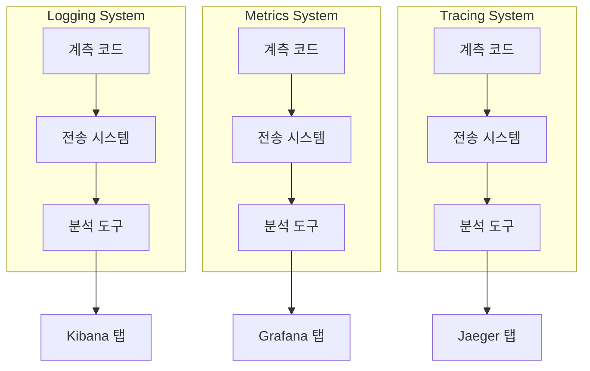
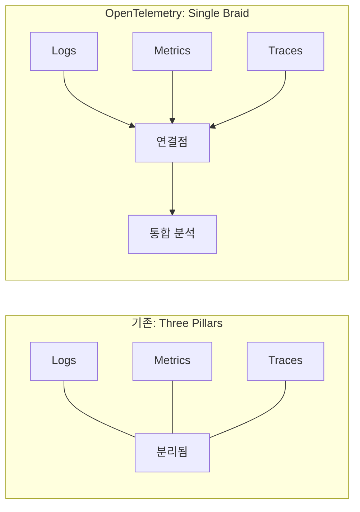

# Chapter 1: Observability의 현주소 (The State of Modern Observability)

---

### 📌 핵심 요약
> 현대 분산 시스템에서 로그, 메트릭, 트레이스가 각각 분리된 사일로로 존재하면 상관관계를 찾기 어렵다. OpenTelemetry는 이 세 가지 신호를 하나로 엮어 컴퓨터가 자동으로 상관관계를 찾을 수 있게 해주는 통합 데이터 모델을 제공한다. 이것이 "Three Pillars"가 아닌 "Single Braid"다.

---

### 🎯 학습 목표
- 분산 시스템에서 Observability가 왜 어려워졌는지 이해한다
- Resources와 Transactions의 개념을 구분할 수 있다
- 로그, 메트릭, 트레이스의 역할과 한계를 파악한다
- "Three Pillars"의 문제점과 OpenTelemetry의 해결 방식을 설명할 수 있다
- Observability = Telemetry + Analysis 공식을 이해한다

---

### 📖 본문 정리

#### 1. 2초의 법칙: 왜 Observability가 중요한가

쇼핑몰 페이지가 2초 이상 로딩되면 사용자는 그냥 떠난다. 현대 소프트웨어 엔지니어링은 **사용자 경험에 집착**하고, 이 집착은 끊임없이 같은 질문을 던지게 만든다:

- *"왜 느리지?"*
- *"RAM을 뭐가 이렇게 잡아먹고 있어?"*
- *"이 문제 언제부터 시작된 거야?"*
- *"근본 원인이 뭐야?"*

이 질문들에 답하려면 **데이터**가 필요하다. 하지만 아무 데이터나 되는 게 아니다.

---

#### 2. 바늘더미에서 바늘 찾기

예전에는 시스템이 단순했다. 문제가 생기면 로그 파일 열어보고, 서버 상태 확인하면 원인을 찾을 수 있었다.

**지금은?**

마이크로서비스, 쿠버네티스, 멀티리전 배포... 하나의 요청이 수십 개의 서비스를 거쳐간다. 문제가 생기면 **어디서부터 봐야 할지조차 모른다**.

```
건초더미에서 바늘 찾기가 힘들었다고?
이제는 바늘더미에서 특정 바늘 찾기다.
```

데이터는 넘쳐나지만, 정작 필요한 **연결된 데이터**가 없다.

---

#### 3. 분산 시스템의 두 가지 구성요소

분산 시스템을 이해하려면 먼저 **두 가지 핵심 개념**을 명확히 구분해야 한다.



| 구성요소 | 설명 | 예시 |
|---------|------|------|
| **Resources** | 시스템을 구성하는 모든 것 | 서버, CPU, RAM, API, DB, 로드밸런서 |
| **Transactions** | 사용자를 위해 일을 하는 요청 | 결제, 검색, 로그인 |

##### Resources (자원) 깊이 이해하기

자원은 **시스템을 구성하고 운영하는 데 필요한 모든 물리적/논리적 요소**다.

| 자원 유형 | 구체적 예시 | 특징 |
|----------|-----------|------|
| **컴퓨팅** | CPU 코어, RAM, EC2 인스턴스, Pod | 확장/축소 가능 |
| **스토리지** | SSD, S3 버킷, RDS, Redis | 용량과 IOPS 제약 |
| **네트워크** | 로드밸런서, DNS, CDN, VPC | 대역폭과 지연시간 |
| **애플리케이션** | API 엔드포인트, 마이크로서비스, 워커 | 동시 처리 능력 |
| **외부 의존성** | 결제 게이트웨이, 인증 서버, 3rd-party API | 제어 불가능한 영역 |

```
자원은 "시스템이 가진 것"이다.
자원은 유한하고, 공유되며, 경쟁한다.
```

##### Transactions (트랜잭션) 깊이 이해하기

트랜잭션은 **사용자의 의도를 시스템이 실행하는 일련의 작업 단위**다.

| 트랜잭션 유형 | 예시 | 자원 소비 패턴 |
|-------------|------|--------------|
| **읽기 중심** | 상품 목록 조회, 검색 결과 | CPU↓ DB↑ 캐시↑ |
| **쓰기 중심** | 결제 처리, 주문 생성 | CPU↑ DB↑ 락 경합↑ |
| **복합형** | 장바구니 담기 후 결제 | 여러 서비스 연쇄 호출 |
| **배치형** | 정산 처리, 리포트 생성 | 장시간 자원 점유 |

```
트랜잭션은 "시스템이 하는 것"이다.
트랜잭션은 자원을 소비하고, 자원이 부족하면 실패한다.
```

##### 핵심: 자원과 트랜잭션의 관계



하나의 트랜잭션이 **여러 자원을 연쇄적으로 소비**한다. 이 체인 중 **어느 하나라도 병목**이 생기면 전체 트랜잭션이 느려지거나 실패한다.

---

##### 장애 대응: 두 가지 레버

**장애가 나면** 우리가 건드릴 수 있는 건 딱 두 가지뿐이다:

###### 1️⃣ 트랜잭션을 바꾼다 (Demand 조절)

트랜잭션이 자원을 **덜 쓰게** 만들거나, **아예 못 들어오게** 막는다.

| 전략 | 방법 | 예시 |
|-----|------|------|
| **기능 제한** | 비핵심 기능 일시 중단 | 추천 시스템 OFF, 검색 필터 단순화 |
| **Rate Limiting** | 요청 수 자체를 제한 | IP당 100 req/min, 사용자당 10 req/sec |
| **Circuit Breaker** | 실패하는 서비스 격리 | 결제 실패 시 3초간 재시도 차단 |
| **Graceful Degradation** | 품질 낮춘 응답 제공 | 실시간 재고 → 캐시된 재고 표시 |
| **Load Shedding** | 과부하 시 일부 요청 거부 | 503 Service Unavailable 반환 |
| **트래픽 우선순위화** | VIP 고객 우선 처리 | 프리미엄 사용자 전용 큐 |

```
예시 시나리오: 블랙프라이데이 트래픽 폭주

문제: 결제 서비스가 DB 커넥션 풀 고갈로 느려짐
해결:
  1. 비회원 결제 일시 중단 (트랜잭션 유형 제한)
  2. 초당 결제 요청 100건으로 제한 (Rate Limiting)
  3. 장바구니 조회는 캐시에서만 응답 (Graceful Degradation)
```

###### 2️⃣ 자원을 바꾼다 (Supply 조절)

트랜잭션을 처리할 **자원을 늘리거나**, 자원 사용 방식을 **최적화**한다.

| 전략 | 방법 | 예시 |
|-----|------|------|
| **수평 확장 (Scale Out)** | 서버/인스턴스 추가 | Pod 3개 → 10개, EC2 오토스케일링 |
| **수직 확장 (Scale Up)** | 개별 서버 스펙 업그레이드 | t3.medium → t3.xlarge |
| **캐시 도입/확장** | 반복 계산 제거 | Redis 캐시 계층 추가, CDN 확장 |
| **DB 최적화** | 쿼리 튜닝, 인덱스 추가 | Slow query 제거, 커넥션 풀 확장 |
| **비동기 처리** | 즉시 응답 불필요한 작업 분리 | 이메일 발송 → 큐로 분리 |
| **자원 재배치** | 유휴 자원 활용 | 야간 배치 서버를 피크 시간대 API용으로 |

```
예시 시나리오: 동일한 블랙프라이데이 상황

문제: 결제 서비스가 DB 커넥션 풀 고갈로 느려짐
해결:
  1. Read Replica 추가 (조회 부하 분산)
  2. 커넥션 풀 사이즈 50 → 200 증가
  3. 결제 서비스 Pod 5개 → 15개 확장
  4. 주문 확인 이메일을 큐로 분리 (비동기화)
```

##### 실무에서의 선택 기준

| 상황 | 트랜잭션 조절 선택 | 자원 조절 선택 |
|-----|------------------|--------------|
| **즉시 대응 필요** | ✅ 빠름 (설정 변경) | ❌ 느림 (인스턴스 부팅) |
| **비용 제약** | ✅ 무료 | ❌ 추가 비용 발생 |
| **사용자 경험** | ❌ 기능 제한됨 | ✅ 정상 서비스 유지 |
| **근본 해결** | ❌ 임시 조치 | ✅ 용량 확보 |
| **외부 의존성 문제** | ✅ 격리 가능 | ❌ 해결 불가 |

```
현실에서는 둘 다 동시에 적용한다.

1단계: 트랜잭션 조절로 출혈 멈춤 (1분 이내)
2단계: 자원 확장으로 정상화 (5-15분)
3단계: 근본 원인 분석 및 재발 방지 (사후)
```

##### 왜 이 구분이 Observability에 중요한가?

장애 대응을 위해서는 **"지금 무엇이 문제인지"** 알아야 한다:

- **자원 부족 문제라면** → CPU, 메모리, 커넥션 등의 **메트릭**을 봐야 한다
- **트랜잭션 문제라면** → 요청의 **트레이스**를 따라가야 한다
- **둘 다라면** → 로그, 메트릭, 트레이스를 **연결해서** 봐야 한다

이것이 바로 **Three Pillars가 연결되어야 하는 이유**다.

---

#### 4. Telemetry: 시스템이 말하게 하는 기술

Telemetry(텔레메트리)가 없으면 시스템은 **미스터리로 가득 찬 블랙박스**다.

| 종류 | 알려주는 것 | 예시 |
|------|-----------|------|
| **User Telemetry** | 사용자가 뭘 하는지 | 버튼 클릭 횟수, 세션 시간 |
| **Performance Telemetry** | 시스템이 어떻게 동작하는지 | 응답 시간, 에러율, CPU 사용량 |

```
User Telemetry     = "사용자가 결제 버튼 위에 마우스를 3초간 올려놨다"
Performance Telemetry = "그 결제 버튼이 로딩되는 데 800ms 걸렸다"
```

---

#### 5. 텔레메트리의 역사: 로그 → 메트릭 → 트레이스

##### Logs (로그)
가장 오래된 형태. 사람이 읽을 수 있는 텍스트 메시지.

```
[ERROR] 2024-03-15 14:23:45 - Failed to write file: disk full
```

좋다. 근데 **"디스크가 차기 전에 알 수는 없을까?"**

##### Metrics (메트릭)
시스템 상태를 숫자로 표현. 시간에 따른 변화를 추적.

```
disk_usage_percent: 95%  → 알림 발송!
```

좋다. 근데 **"이 느린 응답이 어디서 병목이 생긴 건지 어떻게 알지?"**

##### Traces (트레이스)
하나의 요청이 시스템을 통과하는 **전체 여정**을 추적.

```
[Request] → API Gateway (20ms) → Auth Service (150ms) → DB Query (800ms)
                                                              ↑
                                                         여기가 문제!
```

---

#### 6. Three Pillars? 아니, Three Browser Tabs

전통적으로 로그, 메트릭, 트레이스는 **완전히 분리된 시스템**으로 구축되었다:



업계에서는 이걸 **"Three Pillars of Observability"**라고 부른다.

> *"Three Pillars가 아니라 **Three Browser Tabs**다.*
> *결국 서로 연결 안 되는 3개의 탭을 왔다갔다하는 거잖아."*
> — 책의 저자

---

#### 7. 진짜 문제: 상관관계를 찾을 수 없다

장애가 터지면 우리는 **상관관계**를 찾아야 한다:

- "이 에러 로그가 나올 때 CPU 사용량도 튀었나?"
- "이 트레이스의 느린 구간이 특정 DB 쿼리 때문인가?"
- "어제 배포 이후로 메트릭 패턴이 바뀌었나?"

데이터가 **분리된 사일로**에 있으면? 결국 사람이 **눈으로 그래프를 보면서** 머릿속으로 연결고리를 찾아야 한다.

컴퓨터는 상관관계 찾기를 잘한다. 그냥 통계 계산이니까.
**하지만 연결되지 않은 데이터에서는 컴퓨터도 무력하다.**

---

#### 8. OpenTelemetry의 해답: Single Braid

OpenTelemetry는 이 문제를 정면으로 해결한다.



세 가지 신호는 여전히 각자의 역할이 있다. **하지만 이제 서로 연결된다.**

- 트레이스 ID로 관련 로그를 바로 찾을 수 있다
- 특정 서비스의 메트릭 스파이크가 어떤 트랜잭션 패턴과 연관되는지 알 수 있다
- 컴퓨터가 그래프를 탐색하며 상관관계를 자동으로 찾아준다

---

#### 9. 핵심 공식

> **Observability = Telemetry + Analysis**

| 구성요소 | 설명 |
|---------|------|
| **Telemetry** | 시스템이 내보내는 데이터 자체 |
| **Analysis** | 그 데이터로 무엇을 하는가 |

그리고 Observability는 단순히 도구가 아니라 **조직의 실천(Practice)**이다. DevOps처럼.

---

### 🔍 심화 학습

#### Observability vs Monitoring

| 관점 | Monitoring | Observability |
|------|-----------|---------------|
| **접근 방식** | 알려진 문제를 감시 | 알려지지 않은 문제를 탐색 |
| **질문 유형** | "X가 발생했는가?" | "왜 X가 발생했는가?" |
| **데이터 활용** | 미리 정의된 대시보드 | 탐색적 쿼리 |

**출처**: Charity Majors et al., *Observability Engineering* (O'Reilly, 2022)

#### CNCF의 Observability 정의

Cloud Native Computing Foundation은 Observability를 다음과 같이 정의한다:

> "시스템의 외부 출력만으로 내부 상태를 이해할 수 있는 능력"

**출처**: [CNCF Glossary - Observability](https://glossary.cncf.io/observability/)

---

### 💡 실무 적용 포인트

1. **현재 도구 감사**: 로그, 메트릭, 트레이스 시스템이 각각 분리되어 있는지 확인
2. **상관관계 테스트**: 특정 에러 로그가 발생했을 때, 관련 트레이스를 얼마나 빨리 찾을 수 있는지 측정
3. **데이터 연결 계획**: trace_id를 로그에 포함시키는 것부터 시작
4. **팀 간 데이터 공유**: 개발팀과 운영팀이 같은 데이터에 접근할 수 있는지 확인
5. **비용 분석**: 현재 사용 중인 observability 도구들의 비용과 중복 파악

---

### ✅ 정리 체크리스트

- [ ] Resources와 Transactions의 차이를 설명할 수 있다
- [ ] User Telemetry와 Performance Telemetry를 구분할 수 있다
- [ ] 로그, 메트릭, 트레이스 각각의 역할과 한계를 안다
- [ ] "Three Browser Tabs" 문제가 무엇인지 이해한다
- [ ] OpenTelemetry의 "Single Braid" 접근 방식을 설명할 수 있다
- [ ] Observability = Telemetry + Analysis 공식을 이해한다

---

### 🔗 참고 자료

- [CNCF Observability Whitepaper](https://www.cncf.io/blog/2021/11/08/observability-whitepaper/)
- Charity Majors et al., *Observability Engineering* (O'Reilly, 2022)
- Cindy Sridharan, *Distributed Systems Observability* (O'Reilly, 2018)
- Andrew S. Tanenbaum, *Distributed Systems: Principles and Paradigms* (2002)
- Henry Glassie, *Passing the Time in Ballymenone* (1982)
