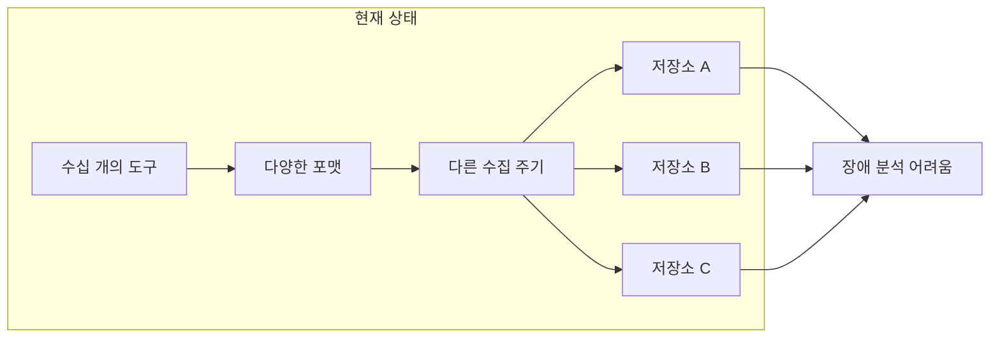
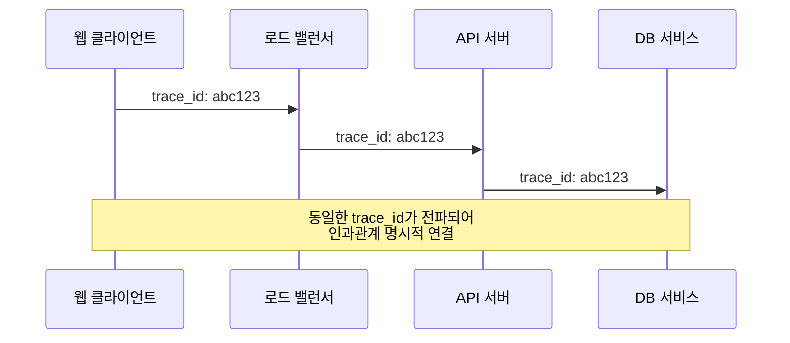
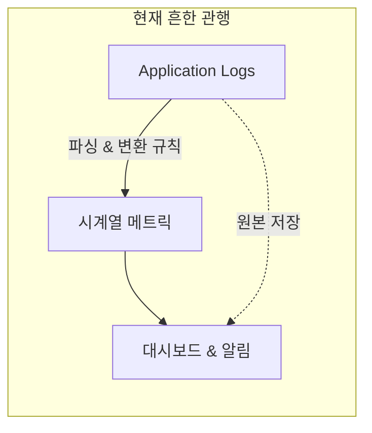
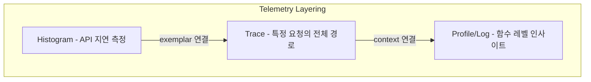

# Chapter 2: 왜 OpenTelemetry를 써야 하는가 (Why Use OpenTelemetry)

---

### 📌 핵심 요약
> 현대 분산 시스템에서 모니터링의 핵심 문제는 데이터의 양, 품질, 연결성 부재다. OpenTelemetry는 Hard Context(trace_id)를 통한 명시적 인과관계 연결, Telemetry Layering을 통한 신호 간 상호 보완, Semantic Telemetry를 통한 자기 설명적 데이터 구조로 이 문제들을 해결한다. 이는 단순히 또 다른 표준이 아니라, 텔레메트리가 진정한 commodity가 되는 불가피한 미래다.

---

### 🎯 학습 목표
- Hard Context와 Soft Context의 차이와 각각의 역할을 이해한다
- Telemetry Layering 개념과 기존 로그 파싱 방식의 한계를 파악한다
- Semantic Telemetry가 왜 중요한지 설명할 수 있다
- 개발자/운영자/조직 각각의 텔레메트리 요구사항을 구분할 수 있다
- OpenTelemetry가 제공하는 핵심 가치(범용 표준, 상관관계)를 설명할 수 있다

---

### 📖 본문 정리

#### 1. 머릿속 지도는 언제나 현실과 다르다

> *"지도는 실제 영토가 아니다."* — Alfred Korzybski

시스템이 얼마나 거대한지, 얼마나 빠르게 변하는지, 얼마나 많은 사람이 동시에 수정하는지에 따라 우리의 이해에는 필연적으로 한계가 생긴다. 생성형 AI 같은 새로운 기술은 이 문제를 더 부각시킨다 — 진짜 블랙박스니까.

**텔레메트리와 Observability**는 이 괴리와 싸우는 가장 강력한 무기다.

---

#### 2. 프로덕션 모니터링의 현실

현재 대부분의 조직에서 모니터링 환경은 이렇게 생겼다:



**이해관계자마다 필요한 것이 다르다**:

| 이해관계자 | 필요한 데이터 |
|-----------|-------------|
| **개발자** | 코드의 특정 문제를 찾을 수 있는 상세한 텔레메트리 |
| **운영자** | 수백~수천 서버의 집계된 정보, 트렌드와 이상치 |
| **보안팀** | 수백만 이벤트 분석, 침입 탐지 |
| **비즈니스 분석가** | 고객-기능 상호작용, 성능이 경험에 미치는 영향 |
| **경영진** | 시스템 전체 건강 상태, 우선순위 결정 |

---

#### 3. 프로덕션 디버깅의 세 가지 도전

| 도전 | 문제 |
|------|------|
| **데이터 양** | 파싱해야 할 데이터가 너무 많다 |
| **데이터 품질** | 텔레메트리 생성에 표준이 없다. 각자 다르게 만든다 |
| **데이터 연결** | 신호들이 독립적으로 생성된다. 서로 어떻게 맞물리는지 알기 어렵다 |

> *"(매우 큰) 조직에서 데이터 공유의 어려움 때문에 장애가 며칠, 심지어 몇 주씩 지속되는 이야기를 들었습니다."*

특히 **Kubernetes**는 이 문제를 악화시킨다. 컨테이너가 마음대로 생성되고 파괴되면서, 수집되지 않은 로그도 함께 사라진다.

---

#### 4. Hard Context vs Soft Context

이 장의 가장 핵심적인 개념이다.



| 구분 | Hard Context | Soft Context |
|------|-------------|--------------|
| **정의** | 분산 시스템에서 동일한 요청에 속한 서비스들이 전파하는 고유한 요청별 식별자 | 각 텔레메트리에 첨부되는 메타데이터 |
| **예시** | trace_id, span_id | customer_id, hostname, timestamp |
| **관계** | 인과관계를 **직접적이고 명시적**으로 연결 | 연결할 수도 있지만 **보장 안 됨** |

**왜 Hard Context가 중요한가?**

```
평균 지연시간 그래프만 보면:
    "음... 좀 높네?"

customer 속성(Soft Context)으로 그룹화하면:
    "아! FruitCo 한 고객 때문에 평균이 올라간 거구나!"

Hard Context(trace_id)가 있으면:
    "이 고객의 이 요청이 정확히 어디서 800ms 걸렸는지 추적할 수 있다!"
```

Hard Context가 있으면:
- 개별 span을 trace로 연결
- 메트릭을 trace와 연결
- 로그를 span에 연결
- **서비스 맵** 자동 생성 가능

---

#### 5. Telemetry Layering (텔레메트리 레이어링)

##### 텔레메트리 신호는 변환 가능하다

텔레메트리 신호는 일반적으로 서로 변환할 수 있다. 예를 들어, Cloudflare 같은 CDN은 웹사이트 성능 메트릭으로 가득 찬 대시보드를 제공한다—HTTP 상태 코드별로 분류된 요청 비율을 보여준다. 이 데이터의 기반은 무엇인가? **로그 구문을 파싱해서 시계열 메트릭으로 변환한 것**이다.



이건 대부분의 모니터링/observability 도구에서 **꽤 흔한 관행**이다.

##### 이 방식의 문제점

하지만 이 방식에는 단점이 있다:

| 비용 유형 | 설명 |
|----------|------|
| **리소스 비용** | CPU와 메모리를 소비한다 |
| **시간 비용** | 데이터를 변환하고 전환할수록, 결과 측정값이 사용 가능해지기까지 더 오래 걸린다 |
| **관리 비용** | 변환 및 파싱 규칙을 관리하고 유지하는 데 시간이 든다 |

> 이것은 **toil**이다, 명백히.

그리고 이로 인해 프로덕션에서 무슨 일이 일어나는지 이해하기 어려워진다:

```
사용자에게 장애 발생
        │
        ▼ (수 분 경과)
        │
    로그 수집
        │
        ▼
    로그 파싱
        │
        ▼
   메트릭 변환
        │
        ▼
   알림 평가
        │
        ▼
    알림 발생  ← "왜 이제야?"
```

> *"시스템이 사용자에게 몇 분 동안이나 실패하고 있는데 알림이 그제서야 발생하는 경우가 많다—그건 시스템이 텔레메트리 신호를 비효율적으로 사용하고 있기 때문이다."*

##### 더 나은 방법: 신호를 레이어로 쌓기

더 나은 해결책은 텔레메트리 신호를 **레이어로 쌓아서 상호 보완적으로 사용**하는 것이다. 애플리케이션 로그 같은 단일 "밀집된(dense)" 신호를 다른 형태로 변환하려 시도하는 대신.

**핵심 아이디어:**
1. 특정 추상화 레이어에서 애플리케이션/시스템 동작을 측정하기 위해 **더 맞춤화된 계측기** 사용
2. **context를 통해** 이 신호들을 연결
3. 겹치는 신호들에서 올바른 데이터를 얻기 위해 텔레메트리를 **레이어링**
4. 적절하고 효율적인 방식으로 **기록하고 저장**



**레이어링의 힘**: 이런 데이터는 **자신도 몰랐던 질문에 답할 수 있다**. 텔레메트리를 레이어링하면 시스템을 더 잘 이해하고 모델링할 수 있다.

##### OpenTelemetry는 이 개념을 기반으로 설계되었다

신호들은 **hard context를 통해** 서로 연결된다:

| 연결 방식 | 설명 |
|----------|------|
| **Metric → Trace** | 메트릭에 **exemplar**를 붙여 특정 측정값을 주어진 trace에 연결 |
| **Log → Trace** | 로그가 처리될 때 **trace context**에 첨부 |

##### 이것이 의미하는 바: 더 나은 결정

이는 다음과 같은 요소에 기반해 **어떤 유형의 데이터를 내보내고 저장할지 더 나은 결정**을 내릴 수 있음을 의미한다:

```
┌─────────────────────────────────────────────────────────┐
│                    결정 요소들                           │
├─────────────────────────────────────────────────────────┤
│  • Throughput (처리량)                                   │
│    → 트래픽이 많으면? 샘플링 비율 조정                    │
│                                                         │
│  • Alert Thresholds (알림 임계값)                        │
│    → 중요 알림에 필요한 데이터만 실시간 수집              │
│                                                         │
│  • SLO/SLA (서비스 수준 목표/합의)                       │
│    → SLO 위반 시 자동으로 더 상세한 데이터 수집           │
└─────────────────────────────────────────────────────────┘
```

**예시 시나리오:**

```
평상시:
  - 메트릭: 모든 요청 집계 (저비용)
  - Trace: 1% 샘플링 (비용 절감)
  - 로그: ERROR 레벨만

SLO 위반 감지 시:
  - 메트릭: 동일
  - Trace: 100% 수집 (원인 파악)
  - 로그: DEBUG 레벨까지 확장

→ 평상시 비용 최적화 + 문제 발생 시 깊은 인사이트
```

이것이 바로 **적응적 텔레메트리(Adaptive Telemetry)**의 가능성이다. OpenTelemetry의 레이어링 설계가 이를 가능하게 한다.

---

#### 6. Semantic Telemetry (시맨틱 텔레메트리)

> 모니터링은 **수동적** 행위다. Observability는 **능동적** 실천이다.

시스템의 "영토"를 분석하려면—코드나 문서 같은 눈에 보이는 부분이 아니라, 프로덕션에서 실제로 어떻게 동작하고 수행되는지를 이해하려면—단순히 텔레메트리 데이터를 기반으로 한 수동적인 대시보드와 알림 이상의 것이 필요하다.

##### Observability의 본질: 비용 최적화 문제

아무리 context가 풍부하고 레이어링이 잘 되어 있어도, 그것만으로는 observability를 달성하기에 **충분하지 않다**. 데이터를 어딘가에 저장해야 하고, 능동적으로 분석해야 한다.

텔레메트리를 효과적으로 소비하는 능력은 수많은 요소에 의해 제한된다:
- 저장 비용
- 네트워크 대역폭
- 텔레메트리 생성 오버헤드 (신호를 생성하고 전송하는 데 사용되는 메모리/CPU)
- 분석 비용
- 알림 평가 빈도
- 그 외 다수...

더 직설적으로 말하면:

> *"소프트웨어 시스템을 이해하는 능력은 궁극적으로 **비용 최적화 문제**다. 시스템을 이해하기 위해 얼마를 쓸 의향이 있는가?"*

##### 현재의 고통: 세 가지 핵심 문제

이 사실은 기존 모니터링 관행에 상당한 고통을 야기한다:

**1. Context 양의 제한**
```
메타데이터 양 ↑ = 저장 비용 ↑ + 쿼리 비용 ↑
```
개발자들은 제공할 수 있는 context 양에 제한을 받는다. 텔레메트리에 첨부되는 메타데이터 양이 증가할수록 해당 텔레메트리를 저장하고 쿼리하는 비용이 증가하기 때문이다.

**2. 같은 데이터의 중복 처리**

다른 신호들이 서로 다른 목적으로 여러 번 분석되는 경우가 많다:

```
HTTP 접근 로그 하나가 있다고 치자:

┌─────────────────┐
│ HTTP Access Log │
└────────┬────────┘
         │
    ┌────┴────┐
    ▼         ▼
┌───────┐  ┌───────┐
│성능팀  │  │보안팀  │
│       │  │       │
│서버    │  │비인가  │
│성능    │  │접근    │
│분석    │  │탐지    │
└───────┘  └───────┘

→ 같은 데이터가 여러 도구에 의해 여러 번 처리됨
```

HTTP 접근 로그는 특정 서버의 성능에 대한 좋은 데이터 소스다. 동시에 프로덕션 시스템의 비인가 접근이나 사용을 감시하는 보안팀에게도 중요한 정보다. 이는 데이터가 여러 도구에 의해 여러 목적으로 여러 번 처리되어야 함을 의미한다.

**3. 도구 사이를 헤매기**

결과적으로 개발자들은 대개 여러 도구들 사이를 **동굴 탐험하듯 헤매게** 된다:
- 서로 다른 인터페이스
- 서로 다른 쿼리 문법
- 같은 데이터의 서로 다른 표현
- "저장 비용이 너무 비싸서 버려졌을지도 모르는" 데이터를 찾아 헤맴

##### OpenTelemetry의 해답: Portable + Semantic

OpenTelemetry는 **portable하고 semantic한 텔레메트리**를 통해 이를 바꾸고자 한다:

| 특성 | 의미 | 실질적 이점 |
|------|------|------------|
| **Portable** | 어떤 observability 프론트엔드와도 사용 가능 | 벤더 종속 제거, 도구 교체 용이 |
| **Semantic** | 자기 설명적 (self-describing) | 이름뿐 아니라 "무엇을 측정하는지"로 검색 가능 |

##### Semantic Telemetry가 실제로 의미하는 것

예를 들어, OpenTelemetry의 메트릭 포인트는 다음과 같은 메타데이터를 포함한다:

```
OpenTelemetry 메트릭 포인트:
├── 메트릭 이름: http.server.request.duration
├── 값: 0.045
├── 타임스탬프: 2024-01-15T10:30:00Z
├── 메트릭 종류: Histogram
│   └── 버킷 경계, 집계 유형 등
└── 속성 (Attributes)
    ├── http.request.method: GET
    │   └── 설명: "HTTP 요청 메서드"
    ├── http.response.status_code: 200
    │   └── 설명: "HTTP 응답 상태 코드"
    └── url.path: /api/users
        └── 설명: "요청 URL 경로"
```

**프론트엔드가 이걸 어떻게 활용하는가?**

```
1. 메트릭의 세분도(granularity) 정보 활용
   → 더 나은 시각화 제공 (히스토그램인지, 카운터인지 자동 판단)

2. 각 속성의 설명 활용
   → 메트릭 쿼리를 더 잘 시각화
   → 측정값의 "이름"뿐 아니라 "실제로 무엇을 측정하는지"로 검색 가능

3. 자동 상관관계 파악
   → "이 trace와 연결된 메트릭이 뭐지?" 자동 연결
```

##### 기존 방식 vs OpenTelemetry 방식

| 구분 | 기존 방식 | OpenTelemetry |
|------|----------|---------------|
| 메트릭 정보 | 이름 + 값만 | 이름 + 값 + 타입 + 단위 + 설명 |
| 속성 의미 | 불명확 (문서 필요) | Semantic Conventions로 표준화 |
| 도구 간 해석 | 도구마다 다름 | 어떤 프론트엔드든 동일하게 이해 |
| 팀 간 소통 | 팀마다 다른 이름 | 조직 전체 공통 언어 |

##### 진화적 도약

> *"근본적으로, OpenTelemetry는 시스템을 이해하는 방식의 진화적 도약이다. 여러 면에서 observability를 개념으로 정의하고 통합하려는 지난 20년간의 작업을 집대성한 것이다."*

업계로서 우리는 의미 있는 표준을 구현하거나 정의할 수 있는 것보다 더 빠르게 혁신해왔다. OpenTelemetry는 이 계산법을 바꾼다.

---

#### 7. 왜 OpenTelemetry인가?

##### Universal Standards (범용 표준)

**OpenTelemetry의 목표**:
- 고품질, 유비쿼터스 텔레메트리 생성 방법 제공
- 어떤 observability 프론트엔드로도 전송 가능 → **벤더 종속 제거**
- 클라우드 네이티브 소프트웨어의 **내장 기능**으로 만들기

**현재 상태**:
- AWS, Azure, GCP 모두 OpenTelemetry 지원 및 표준화 진행 중
- 모든 주요 observability 플랫폼이 OpenTelemetry 데이터 수용
- 매달 더 많은 라이브러리/프레임워크가 채택 중

> *"OpenTelemetry는 텔레메트리가 진정한 상품(commodity)이 되는 미래를 예고합니다."*

> *"이건 단순히 떠오르는 표준이 아닙니다. 이 시점에서 불가피합니다."*

##### Correlated Data (상관관계 있는 데이터)

OpenTelemetry는 과거 관행의 단순한 성문화가 아니다.

> OpenTelemetry는 trace, metric, log를 한 곳에 모아놓은 게 아니다.
>
> 이 모든 조각이 **하나의 데이터 구조**의 일부이며, **시간에 따른 전체 시스템을 설명하는 단일 그래프**로 연결되어 있다.

---

### 🔍 심화 학습

#### Toil의 개념 (Google SRE)

책에서 언급된 **toil**은 Google SRE 문화에서 온 개념이다:

> Toil은 프로덕션 서비스 운영과 관련된 작업 중 수동적이고, 반복적이며, 자동화 가능하고, 전술적이며, 지속적인 가치가 없고, 서비스 성장에 비례해 확대되는 작업을 말한다.

로그를 파싱해서 메트릭으로 변환하는 작업이 대표적인 toil이다. OpenTelemetry의 Telemetry Layering은 이러한 toil을 제거한다.

**출처**: [Google SRE Book - Eliminating Toil](https://sre.google/sre-book/eliminating-toil/)

#### Observability 비용 현실

책에서 언급된 Coinbase의 Datadog 비용($65M/년)은 실제 사례다. 2023년 Datadog의 기업 고객 평균 지출은 약 $100K-$1M 수준이며, 대기업은 수천만 달러에 이른다.

**비용 최적화 전략**:
- 샘플링 전략 수립 (Head/Tail Sampling)
- 데이터 보존 기간 최적화
- 불필요한 메트릭 필터링
- OpenTelemetry Collector를 통한 데이터 전처리

**출처**: [The New Stack - Managing Observability Costs](https://thenewstack.io/)

#### Context Propagation의 기술적 구현

Hard Context(trace_id, span_id)의 전파는 W3C Trace Context 표준을 따른다:

```http
traceparent: 00-0af7651916cd43dd8448eb211c80319c-b7ad6b7169203331-01
```

| 필드 | 설명 |
|------|------|
| version | 항상 00 |
| trace-id | 128비트 고유 식별자 |
| parent-id | 64비트 span 식별자 |
| trace-flags | 8비트 플래그 (샘플링 여부 등) |

**출처**: [W3C Trace Context Specification](https://www.w3.org/TR/trace-context/)

---

### 💡 실무 적용 포인트

1. **현재 모니터링 도구 감사**: 조직에서 사용 중인 도구들의 데이터가 서로 연결되는지 확인
2. **Hard Context 도입**: 아직 trace_id를 전파하지 않는다면, 이것이 최우선 과제
3. **로그 파싱 의존도 평가**: 로그 → 메트릭 변환에 얼마나 의존하는지 파악하고 Telemetry Layering 도입 검토
4. **비용 분석**: observability 도구 비용이 가파르게 증가한다면 OpenTelemetry 도입으로 벤더 종속 탈피 검토
5. **팀별 요구사항 정리**: 개발자, 운영자, 보안팀, 경영진 각각이 필요로 하는 데이터가 무엇인지 명확히 정의

---

### ✅ 정리 체크리스트

- [ ] Hard Context와 Soft Context의 차이를 설명할 수 있다
- [ ] trace_id가 왜 Hard Context인지 이해한다
- [ ] Telemetry Layering의 개념과 장점을 설명할 수 있다
- [ ] "로그 파싱 → 메트릭 변환" 방식의 문제점을 안다
- [ ] Semantic Telemetry가 의미하는 바를 이해한다
- [ ] OpenTelemetry의 두 가지 핵심 가치(범용 표준, 상관관계)를 설명할 수 있다
- [ ] 이해관계자별 텔레메트리 요구사항이 다름을 이해한다

---

### 🔗 참고 자료

- Alfred Korzybski, "A Non-Aristotelian System and Its Necessity for Rigour in Mathematics and Physics" (1931)
- [Google SRE Book - Eliminating Toil](https://sre.google/sre-book/eliminating-toil/)
- [W3C Trace Context Specification](https://www.w3.org/TR/trace-context/)
- Charity Majors et al., *Observability Engineering* (O'Reilly, 2022)
- The VOID Report 2022: 장애 심각도와 지속 시간 사이의 관계 분석
- [Uber Engineering Blog - Domain-Oriented Microservice Architecture](https://eng.uber.com/microservice-architecture/)
