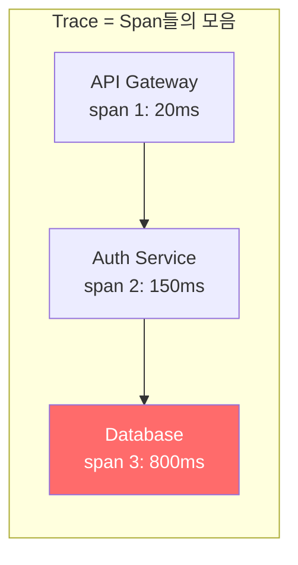
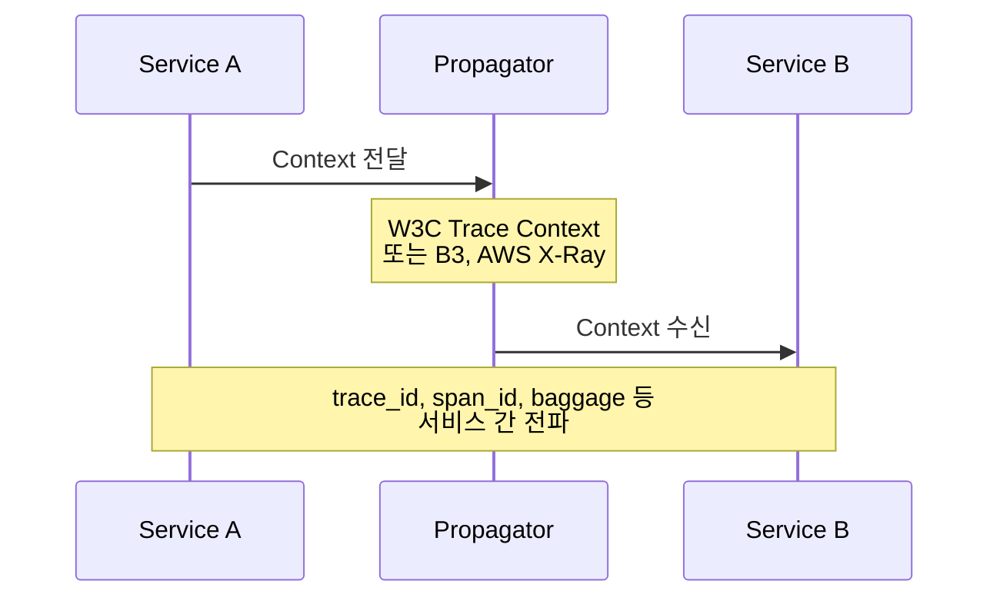
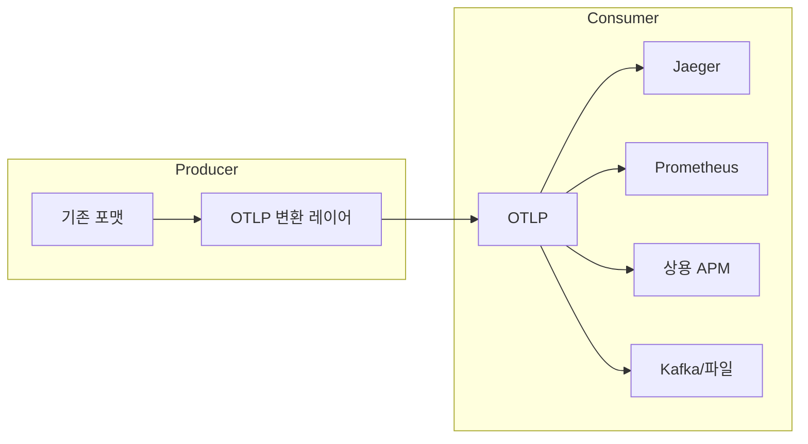

# Chapter 3: OpenTelemetry 개요 (OpenTelemetry Overview)

---

### 📌 핵심 요약
> OpenTelemetry는 세 가지 Primary Signals(Traces, Metrics, Logs)와 이를 연결하는 Context Layer, 그리고 Semantic Conventions로 구성된다. Traces는 분산 시스템에서 사용자 여정을 모델링하는 핵심 신호이고, Metrics는 저렴한 빅픽처를 제공하며, Logs는 레거시 호환과 비요청 작업을 담당한다. OTLP는 이 모든 데이터를 표준화된 포맷으로 전송하는 프로토콜이며, "OpenTelemetry v2.0은 절대 없다"는 장기 안정성 약속이 엔터프라이즈 도입의 핵심 근거다.

---

### 🎯 학습 목표
- Traces, Metrics, Logs 각각의 역할과 사용 시점을 구분할 수 있다
- Context Layer와 Propagators의 작동 방식을 이해한다
- Attributes와 Resources의 차이를 설명할 수 있다
- Cardinality Explosion 문제와 해결책을 안다
- Semantic Conventions가 왜 중요한지 이해한다
- OTLP가 제공하는 가치를 설명할 수 있다

---

### 📖 본문 정리

#### 1. OpenTelemetry가 해결하는 두 가지 문제

> *"복잡함 자체를 전달할 수는 없다. 복잡함에 대한 인식만 전달할 수 있을 뿐."* — Alan J. Perlis

OpenTelemetry는 현대적인 텔레메트리 시스템을 구축하는 데 필요한 모든 것을 담고 있다.

| 문제 | 설명 |
|------|------|
| **문제 1** | 개발자에게 코드에 **네이티브 계측(instrumentation)**을 쉽게 넣을 수 있는 단일 솔루션 제공 |
| **문제 2** | 계측과 텔레메트리 데이터가 **observability 생태계 전체와 호환**되도록 만들기 |

이 두 문제의 핵심은 **시맨틱(semantic) 정확성**이다. 단순히 공통 API/SDK를 쓰는 게 아니라, **"명사와 동사"** — 무엇이 무슨 의미인지에 대한 공통된 정의가 필요하다.

---

#### 2. 세 가지 Primary Signals

##### Traces (트레이스) — 가장 중요

트레이스는 분산 시스템에서 **작업을 모델링하는 방법**이다.



**트레이스의 강점**:
- **하나의 트레이스 = 하나의 사용자 여정**: 엔드유저 경험을 모델링하는 최고의 방법
- **다차원 집계 가능**: 여러 트레이스를 집계해서 성능 특성 발견
- **다른 신호로 변환 가능**: 트레이스에서 메트릭을 추출할 수 있음

> **Golden Signals (황금 신호)** — Google SRE Handbook
>
> | 신호 | 설명 |
> |------|------|
> | **Latency** | 요청 처리 시간 |
> | **Traffic** | 요청 수 |
> | **Errors** | 실패 요청 비율 |
> | **Saturation** | 시스템 자원 활용도 |

##### Metrics (메트릭)

메트릭은 **시스템 상태의 숫자 측정값**이다.

**장점**: 만들고 저장하기 **저렴함**. 시스템 전체 건강 상태를 파악하는 첫 번째 수단.

**전통적인 메트릭의 문제점**:
- Hard context 부재 — 특정 사용자 트랜잭션과 연결하기 어려움
- 서드파티 라이브러리의 메트릭 수정이 어려움
- 비용과 복잡도 관리가 주요 도전 과제

**OpenTelemetry 메트릭의 핵심 기능**:
- StatsD, Prometheus와 **즉시 호환**
- **Exemplars**: 메트릭 이벤트를 특정 span/trace에 연결하는 hard context

##### Logs (로그)

로그는 가장 친숙하지만, OpenTelemetry에서는 **마지막으로** 다룬다.

> OpenTelemetry의 로그 지원은 바퀴를 재발명하려는 게 아니라, 기존 로깅 API를 그대로 지원하면서 **다른 신호와 연결**하는 데 초점을 맞춘다.

| 용도 | 설명 |
|------|------|
| **레거시 시스템** | 트레이싱이 불가능한 메인프레임, 레거시 코드 |
| **인프라 상관관계** | 관리형 DB, 로드밸런서와 애플리케이션 이벤트 연결 |
| **비요청 작업** | Cron job, 배치 작업 등 사용자 요청과 무관한 동작 |
| **신호 변환** | 로그를 메트릭이나 트레이스로 처리 |

---

#### 3. Context Layer (컨텍스트 레이어)

신호가 측정값을 제공한다면, **Context**는 그 데이터를 **의미 있게** 만든다.



**Propagators (전파자)**:
- 실제로 값을 다음 프로세스로 보내는 방법
- 기본값: **W3C Trace Context**
- 대안: B3 Trace Context, AWS X-Ray

**Baggage (수하물)**:
- **Soft context** 값을 전달 (예: 고객 ID, 세션 ID)
- ⚠️ **주의**: 한번 추가하면 제거 불가, 외부 시스템에도 전송됨

##### 시간(Time)의 한계

> 분산 시스템에서 시간은 **신뢰하기 어렵다**
>
> - 시계 드리프트
> - 스레드 일시 중지
> - 네트워크 연결 끊김
> - 단일 JavaScript 프로세스에서도 1시간에 ~100ms 정밀도 손실

이것이 trace 관계나 공유 속성 같은 **명시적 context**가 중요한 이유다.

---

#### 4. Attributes와 Resources

##### Attributes (속성)

OpenTelemetry의 모든 텔레메트리는 **attributes**를 가진다.

```
예시: 대중교통 이용자 수 측정

단순 측정: 오늘 승객 수 = 50,000명

속성 추가 시:
├── transit_mode: "bus" → 30,000명
├── transit_mode: "subway" → 20,000명
├── station: "강남" → 5,000명
└── station: "홍대" → 3,000명
```

**Attribute 규칙**:
- 값 타입: string, boolean, float, signed integer (또는 동일 타입의 배열)
- 키 중복 불가 (여러 값은 배열 사용)
- 기본 제한: 텔레메트리당 **최대 128개** 고유 속성

##### Cardinality Explosion (카디널리티 폭발) ⚠️

메트릭에 속성을 추가할 때 가장 주의해야 할 점이다.

```
메트릭 이름 + 속성값 조합 = 고유한 Time Series

request_count + status_code(3종류) = 3개 time series ✅
request_count + customer_id(100만개) = 100만개 time series 💥
```

**해결책**:
1. Observability 파이프라인에서 카디널리티 축소
2. 고카디널리티 속성은 메트릭 대신 **span/log**에 사용

##### Resources (리소스)

| 구분 | Attribute | Resource |
|------|-----------|----------|
| **변경 가능성** | 요청마다 변경 가능 | 프로세스 수명 동안 불변 |
| **예시** | customer_id, request_path | hostname, service_version |

---

#### 5. Semantic Conventions (시맨틱 컨벤션)

Prometheus 메인테이너의 말:

> *"나머지는 잘 모르겠는데, 이 시맨틱 컨벤션은 정말 오랜만에 본 가치 있는 것이네요."*

**문제**: 여러 클라우드, 런타임, 프레임워크에서 속성 키와 값이 **제각각**

**해결**: OpenTelemetry Semantic Conventions — 잘 정의된 단일 속성 키/값 집합

| 출처 | 설명 |
|------|------|
| **프로젝트 공식 컨벤션** | 클라우드 네이티브 소프트웨어의 공통 리소스/개념 커버 |
| **내부 플랫폼 팀 정의** | 조직 특화 속성 정의, 팀 간 일관성 보장 |

> **2023년 4월**: OpenTelemetry와 Elastic이 **Elastic Common Schema**를 OpenTelemetry Semantic Conventions에 병합 발표

**핵심 비유**:
- Traces, Metrics, Logs = 시스템이 **어떻게** 동작하는지 설명하는 **동사**
- Semantic Conventions = 시스템이 **무엇을** 하는지 설명하는 **명사**

---

#### 6. OpenTelemetry Protocol (OTLP)

OpenTelemetry의 가장 흥미로운 기능 중 하나: **표준 데이터 포맷과 프로토콜**



**OTLP의 특징**:
- 단일 Wire Format (바이너리 + 텍스트 인코딩)
- 낮은 CPU/메모리 사용량
- 수백 개의 기존 시스템과 통합
- 벤더 종속 탈출

---

#### 7. 호환성과 미래 대비

##### 버전 정책

> **"OpenTelemetry v2.0은 절대 없습니다"**

모든 업데이트는 v1.0 라인을 따라 진행된다.

| 정책 | 기간 |
|------|------|
| Stable 기능 도입 후 지원 | 최소 2년 |
| Deprecation 발표 후 제거 | 최소 1년 |

##### Telemetry Schemas

시맨틱 컨벤션이 변경되어도:
- Schema-aware 분석 도구 사용
- OpenTelemetry Collector에서 스키마 변환 수행
- **재계측 없이** 변경 혜택 누리기 가능

---

### 🔍 심화 학습

#### Golden Signals vs RED vs USE

책에서 언급된 Golden Signals는 Google SRE에서 온 개념이다. 이와 비교되는 다른 방법론들:

| 방법론 | 측정 대상 | 지표 |
|--------|----------|------|
| **Golden Signals** (Google) | 서비스 | Latency, Traffic, Errors, Saturation |
| **RED** (Weave Works) | 서비스 | Rate, Errors, Duration |
| **USE** (Brendan Gregg) | 리소스 | Utilization, Saturation, Errors |

**선택 기준**:
- 서비스 관점 → Golden Signals 또는 RED
- 인프라/리소스 관점 → USE
- 실무에서는 보통 **조합해서 사용**

**출처**: [Brendan Gregg - The USE Method](https://www.brendangregg.com/usemethod.html)

#### W3C Trace Context의 구조

책에서 언급된 Propagator의 기본값인 W3C Trace Context:

```http
traceparent: 00-0af7651916cd43dd8448eb211c80319c-b7ad6b7169203331-01
tracestate: congo=t61rcWkgMzE
```

| 필드 | 형식 | 설명 |
|------|------|------|
| version | 2 hex | 항상 "00" |
| trace-id | 32 hex | 128비트 고유 식별자 |
| parent-id | 16 hex | 64비트 span 식별자 |
| trace-flags | 2 hex | 샘플링 등 플래그 |

**tracestate**는 벤더별 추가 정보를 전달하는 데 사용된다.

**출처**: [W3C Trace Context Specification](https://www.w3.org/TR/trace-context/)

#### Cardinality 관리 전략

책에서 경고한 카디널리티 폭발에 대한 실무 해결책:

1. **사전 필터링**: Collector에서 고카디널리티 속성 제거
2. **Top-K 집계**: 상위 N개 값만 유지
3. **해싱/버킷팅**: 연속값을 구간으로 변환
4. **Exemplar 활용**: 메트릭에 속성 대신 trace 링크 첨부

```yaml
# OpenTelemetry Collector 설정 예시
processors:
  filter:
    metrics:
      exclude:
        match_type: regexp
        metric_names:
          - ".*high_cardinality.*"
```

**출처**: [OpenTelemetry Collector Contrib - Filter Processor](https://github.com/open-telemetry/opentelemetry-collector-contrib/tree/main/processor/filterprocessor)

---

### 💡 실무 적용 포인트

1. **Traces 우선 도입**: 세 가지 신호 중 Traces가 가장 높은 ROI를 제공한다. 이미 메트릭/로그가 있다면 Traces부터 추가
2. **Exemplar 활용**: 메트릭에서 문제를 발견하면 Exemplar를 통해 관련 trace로 바로 이동할 수 있게 설정
3. **카디널리티 예산 설정**: 메트릭 속성 추가 전 예상 카디널리티를 계산하고, 팀별 예산을 정의
4. **Semantic Conventions 준수**: 커스텀 속성을 만들기 전에 공식 컨벤션에 이미 정의된 것이 있는지 확인
5. **Baggage 사용 주의**: 민감한 정보나 대용량 데이터를 Baggage에 넣지 않도록 가이드라인 수립
6. **OTLP 기본 채택**: 새 서비스는 처음부터 OTLP로 내보내도록 설정

---

### ✅ 정리 체크리스트

- [ ] Traces가 왜 가장 중요한 신호인지 설명할 수 있다
- [ ] Metrics의 장점과 한계를 안다
- [ ] Logs가 OpenTelemetry에서 마지막으로 다뤄지는 이유를 이해한다
- [ ] Context Layer와 Propagators의 역할을 설명할 수 있다
- [ ] Attributes와 Resources의 차이를 구분할 수 있다
- [ ] Cardinality Explosion이 왜 위험한지 안다
- [ ] Semantic Conventions의 가치를 설명할 수 있다
- [ ] OTLP가 제공하는 핵심 이점을 안다
- [ ] "OpenTelemetry v2.0은 없다"의 의미를 이해한다

---

### 🔗 참고 자료

- Alan J. Perlis, "Epigrams on Programming," SIGPLAN Notices (1982)
- [OpenTelemetry Specifications](https://opentelemetry.io/docs/specs/)
- [W3C Trace Context](https://www.w3.org/TR/trace-context/)
- [OpenTelemetry Protocol (OTLP)](https://github.com/open-telemetry/opentelemetry-proto)
- [Google SRE Book - Monitoring Distributed Systems](https://sre.google/sre-book/monitoring-distributed-systems/)
- [Brendan Gregg - The USE Method](https://www.brendangregg.com/usemethod.html)
- [OpenTelemetry Semantic Conventions](https://opentelemetry.io/docs/specs/semconv/)
