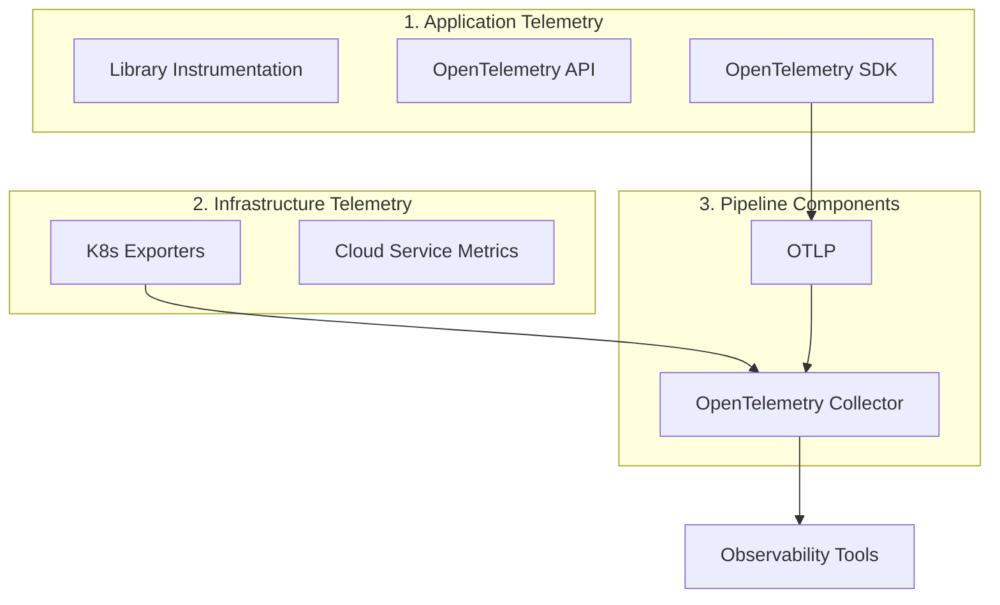
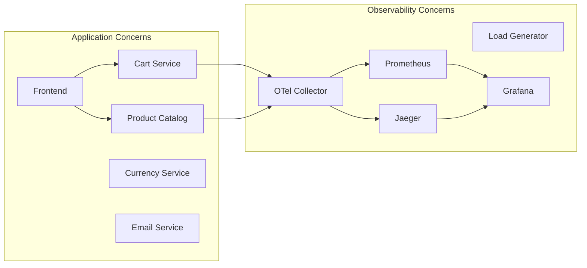

# Chapter 4: OpenTelemetry 아키텍처 (The OpenTelemetry Architecture)

---

### 📌 핵심 요약
> OpenTelemetry는 Application Telemetry(API/SDK/Library Instrumentation), Infrastructure Telemetry, Pipeline Components(Collector/OTLP)의 세 가지 컴포넌트로 구성된다. 중요한 것은 OpenTelemetry에 저장소, 분석, GUI가 **영원히 포함되지 않는다**는 점이다. 이는 표준화된 텔레메트리와 끊임없이 진화하는 분석 도구 생태계를 분리하려는 의도적인 설계다. OpenTelemetry Demo를 통해 실제 마이크로서비스 환경에서 자동 계측과 커스텀 계측이 어떻게 작동하는지 확인할 수 있다.

---

### 🎯 학습 목표
- OpenTelemetry의 세 가지 구성요소(Application, Infrastructure, Pipeline)를 구분할 수 있다
- API와 SDK의 역할 차이를 이해한다
- Library Instrumentation의 중요성을 설명할 수 있다
- OpenTelemetry에 포함되지 않는 것(저장소, 분석, GUI)의 이유를 안다
- 자동 계측(Zero-code Instrumentation)과 커스텀 계측의 차이를 이해한다
- OpenTelemetry Demo를 설치하고 실행할 수 있다

---

### 📖 본문 정리

#### 1. OpenTelemetry의 세 가지 구성요소

> *"누구나 디버깅이 프로그램을 작성하는 것보다 두 배는 어렵다는 걸 압니다. 그러니 코드를 작성할 때 최대한 영리하게 짠다면, 대체 어떻게 디버깅하겠습니까?"* — Brian W. Kernighan & P. J. Plauger



---

#### 2. Application Telemetry

가장 중요한 텔레메트리 소스는 **애플리케이션**이다. OpenTelemetry가 제대로 작동하려면 **모든 애플리케이션에 설치**되어야 한다.

##### Library Instrumentation

가장 중요한 텔레메트리는 **OSS 라이브러리**에서 나온다:
- 프레임워크
- HTTP/RPC 클라이언트
- 데이터베이스 클라이언트

> 종종 라이브러리 텔레메트리만으로도 애플리케이션이 수행하는 거의 모든 작업을 커버할 수 있다.

**현실**: 대부분의 OSS 라이브러리는 아직 OpenTelemetry로 네이티브 계측되어 있지 않다.
**해결책**: OpenTelemetry가 많은 인기 라이브러리용 계측 라이브러리를 제공한다.

##### OpenTelemetry API

라이브러리 계측이 유용하지만, 결국 **애플리케이션 코드와 비즈니스 로직**의 중요한 부분도 계측해야 한다.

**특별한 기능**:
> OpenTelemetry API는 **OpenTelemetry가 설치되지 않은 애플리케이션에서도 안전하게 호출**할 수 있다.

```
OSS 라이브러리 개발자 입장:

OpenTelemetry 계측을 라이브러리에 포함시키면:
├── OpenTelemetry 사용 앱 → 자동으로 계측 활성화 ✅
└── OpenTelemetry 미사용 앱 → 제로 비용 no-op ✅
```

##### OpenTelemetry SDK

API 호출이 실제로 처리되려면 **OpenTelemetry 클라이언트(SDK)**를 설치해야 한다.

SDK는 **플러그인 프레임워크**다:
- 샘플링 알고리즘
- 라이프사이클 훅
- 익스포터

> **중요!** SDK만 설치하면 된다고 생각하기 쉽지만, **모든 중요한 라이브러리에 대한 계측도 필요**하다.

---

#### 3. Infrastructure Telemetry

애플리케이션은 **환경**에서 실행된다:
- 호스트
- 플랫폼 (Kubernetes 등)
- 네트워킹 서비스
- 데이터베이스 서비스

**인프라 건강은 매우 중요**하다. OpenTelemetry는 Kubernetes와 다른 클라우드 서비스에 점진적으로 추가되고 있다.

---

#### 4. Telemetry Pipelines

**도전 과제**:
- 대규모 분산 시스템의 텔레메트리 양은 **엄청남**
- 네트워킹 이슈: egress, 로드 밸런싱, backpressure
- 여러 observability 도구가 **패치워크**처럼 존재

**OpenTelemetry의 해결책**:
1. **OTLP** (OpenTelemetry Protocol)
2. **Collector** — 텔레메트리 수집, 변환, 전송

---

#### 5. OpenTelemetry에 포함되지 않는 것

**영원히 포함되지 않을 것들**:
- ❌ 장기 저장소
- ❌ 분석
- ❌ GUI
- ❌ 기타 프론트엔드 컴포넌트

**왜일까?**

> OpenTelemetry의 목표는 **모든 분석 도구와 함께 작동**하고, 미래에 더 진보된 도구들이 만들어지도록 장려하는 것이다.

```
표준화된 텔레메트리 → 끊임없이 진화하는 분석 도구 생태계
```

이 **관심사의 분리**가 OpenTelemetry 프로젝트의 세계관이다.

---

#### 6. OpenTelemetry Demo: Astronomy Shop

14개의 마이크로서비스로 구성된 이커머스 애플리케이션이다.



**설치 방법**:
```bash
git clone https://github.com/open-telemetry/opentelemetry-demo.git
cd opentelemetry-demo
make start
```

**접속 URL**:
- Demo UI: http://localhost:8080
- Jaeger: http://localhost:8080/jaeger/ui
- Grafana: http://localhost:8080/grafana/
- Feature Flags: http://localhost:8080/feature/

---

#### 7. 자동 계측 vs 커스텀 계측

##### 자동 계측 (Zero-code Instrumentation)

에이전트나 라이브러리가 코드 작성 없이 계측을 추가한다.

**Java (Ad Service) 예시**:
```dockerfile
# Dockerfile에서 에이전트 다운로드 및 실행
# → 시작 시 자동으로 계측 추가
```

**.NET (Cart Service) 예시**:
```csharp
builder.Services.AddOpenTelemetry()
    .WithTracing(tracerBuilder => tracerBuilder
        .AddAspNetCoreInstrumentation()
        .AddGrpcClientInstrumentation()
        .AddHttpClientInstrumentation()
        .AddOtlpExporter())
```

##### 커스텀 계측

자동 계측은 **도메인/비즈니스 로직과 메타데이터를 알 수 없다**. 직접 추가해야 한다.

**Go 코드 예시**:
```go
func (p *productCatalog) GetProduct(ctx context.Context, req *pb.GetProductRequest)
          (*pb.Product, error) {
    span := trace.SpanFromContext(ctx)

    // 기존 span에 속성 추가
    span.SetAttributes(
        attribute.String("app.product.id", req.Id),
    )
    // ...
}
```

`app.product.id` 같은 커스텀 속성 덕분에 **특정 제품 ID에서만 에러가 발생**한다는 것을 발견할 수 있다.

---

#### 8. Observability 파이프라인 설계 원칙

**원칙 1**: 텔레메트리를 **서비스에서 최대한 빨리 내보내기**
- 텔레메트리 생성에는 오버헤드가 있음
- 애플리케이션 레벨에서 처리할수록 오버헤드 증가
- 앱이 크래시하면 export 전의 데이터 손실

**원칙 2**: 너무 많은 텔레메트리는 네트워크 링크를 압도할 수 있음
- **metamonitoring** (OpenTelemetry 인프라 자체 모니터링) 필요

---

### 🔍 심화 학습

#### OpenTelemetry API의 No-op 설계

책에서 언급된 "OpenTelemetry가 설치되지 않아도 안전하게 호출"되는 이유:

OpenTelemetry API는 **No-op 구현**을 기본으로 제공한다. SDK가 등록되지 않으면:
- 모든 trace/metric/log 호출이 즉시 반환
- 메모리 할당 없음
- 성능 영향 거의 0

이것이 라이브러리 개발자가 OpenTelemetry를 **의존성으로 추가해도 안전한** 이유다.

**출처**: [OpenTelemetry Specification - API Requirements](https://opentelemetry.io/docs/specs/otel/overview/#api)

#### Collector의 역할 상세

책에서 간단히 언급된 Collector는 실제로 매우 강력한 컴포넌트다:

| 기능 | 설명 |
|------|------|
| **Receivers** | 다양한 포맷(OTLP, Jaeger, Prometheus 등)으로 데이터 수신 |
| **Processors** | 필터링, 배칭, 샘플링, 속성 변환 |
| **Exporters** | 다양한 백엔드로 데이터 전송 |
| **Connectors** | trace → metric 변환 등 신호 간 연결 |

```yaml
# Collector 설정 예시
receivers:
  otlp:
    protocols:
      grpc:
      http:

processors:
  batch:
    timeout: 1s
    send_batch_size: 1024

exporters:
  jaeger:
    endpoint: jaeger:14250
  prometheus:
    endpoint: 0.0.0.0:8889

service:
  pipelines:
    traces:
      receivers: [otlp]
      processors: [batch]
      exporters: [jaeger]
```

**출처**: [OpenTelemetry Collector Documentation](https://opentelemetry.io/docs/collector/)

#### 분산 시스템의 일반적인 실패 패턴

책의 Demo에서 보여준 "실패하는 것이 반드시 문제가 있는 것은 아니다"는 분산 시스템의 핵심 원칙이다:

| 패턴 | 설명 |
|------|------|
| **Cascading Failure** | 한 서비스 실패가 연쇄적으로 다른 서비스에 영향 |
| **Gray Failure** | 완전히 죽지 않고 부분적으로 실패 |
| **Retry Amplification** | 재시도가 부하를 더 증가시킴 |

OpenTelemetry의 trace는 이런 복잡한 실패 패턴을 **시각적으로 추적**할 수 있게 해준다.

**출처**: [Google SRE Book - Handling Overload](https://sre.google/sre-book/handling-overload/)

---

### 💡 실무 적용 포인트

1. **SDK만 설치하지 말 것**: 모든 중요한 라이브러리(HTTP client, DB client, 프레임워크)에 대한 계측이 설치되었는지 확인
2. **커스텀 속성 전략 수립**: 비즈니스 로직에서 중요한 속성(user_id, order_id 등)을 사전에 정의
3. **Collector 도입**: 직접 백엔드로 보내지 말고 Collector를 통해 전송하여 유연성 확보
4. **Demo로 학습**: OpenTelemetry Demo를 로컬에서 실행하여 실제 작동 방식 체험
5. **점진적 도입**: 모든 서비스에 한 번에 도입하지 말고, 핵심 서비스부터 시작
6. **Metamonitoring 설정**: Collector와 observability 인프라 자체를 모니터링

---

### ✅ 정리 체크리스트

- [ ] Application Telemetry의 세 구성요소(Library Instrumentation, API, SDK)를 설명할 수 있다
- [ ] API가 SDK 없이도 안전하게 호출되는 이유를 안다
- [ ] Infrastructure Telemetry가 왜 중요한지 이해한다
- [ ] OpenTelemetry에 저장소/분석/GUI가 포함되지 않는 이유를 설명할 수 있다
- [ ] 자동 계측과 커스텀 계측의 차이를 이해한다
- [ ] Collector의 역할을 설명할 수 있다
- [ ] OpenTelemetry Demo를 설치하고 실행할 수 있다
- [ ] "실패하는 것이 반드시 문제가 있는 것은 아니다"의 의미를 이해한다

---

### 🔗 참고 자료

- Brian W. Kernighan & P. J. Plauger, *The Elements of Programming Style* (1978)
- [OpenTelemetry Demo Repository](https://github.com/open-telemetry/opentelemetry-demo)
- [OpenTelemetry Demo Documentation](https://opentelemetry.io/docs/demo/)
- [OpenTelemetry Collector Documentation](https://opentelemetry.io/docs/collector/)
- [OpenTelemetry Specification - API Requirements](https://opentelemetry.io/docs/specs/otel/overview/#api)
- [Google SRE Book - Handling Overload](https://sre.google/sre-book/handling-overload/)
