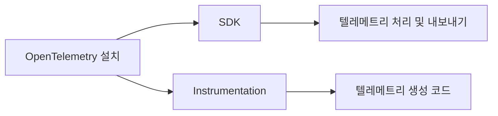
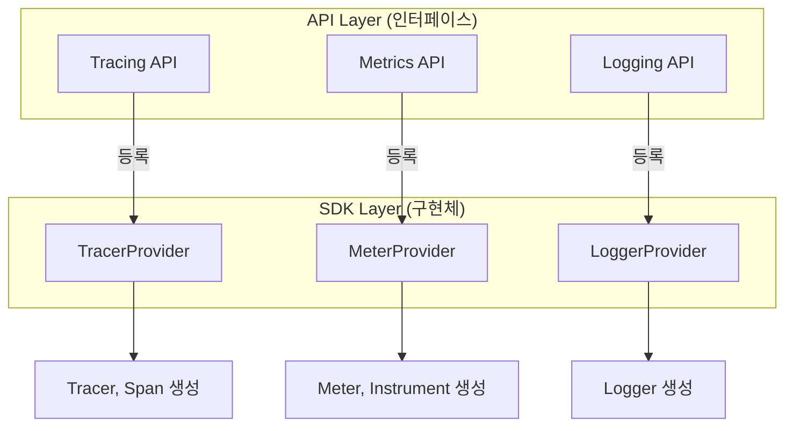
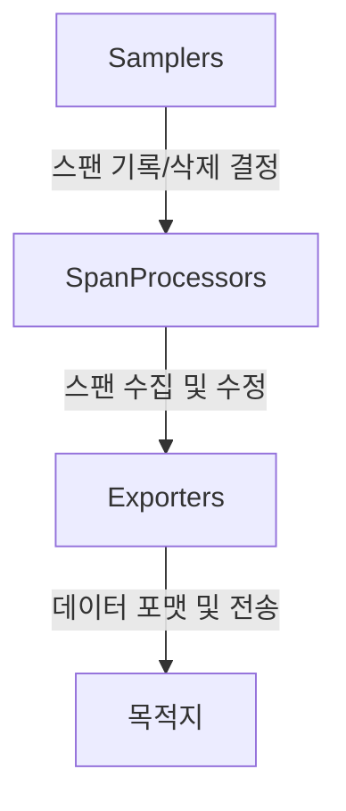
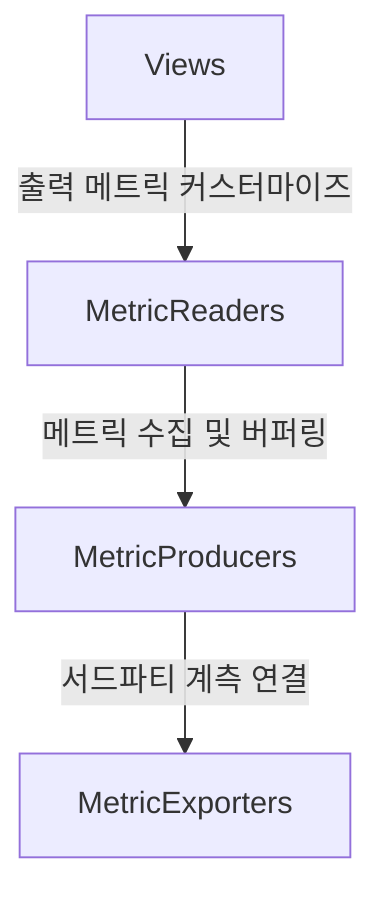
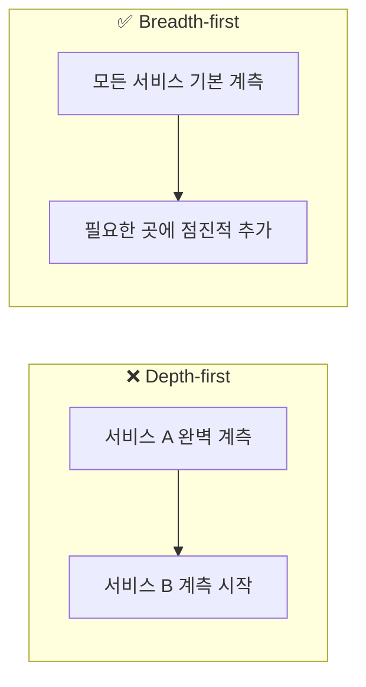

# Chapter 5: 애플리케이션 계측하기 (Instrumenting Applications)

---

### 📌 핵심 요약
> OpenTelemetry를 애플리케이션에 적용하는 것은 가장 복잡하지만 가장 중요한 단계다. SDK 설치와 Provider 등록, Instrumentation 설정의 원리를 이해하면 어떤 언어, 어떤 환경에서도 체계적으로 계측을 수행할 수 있다. 한 번 제대로 설정하면 벤더 종속 없이 어떤 분석 도구와도 작동하는 표준 기반 observability를 확보할 수 있다.

---

### 🎯 학습 목표
- OpenTelemetry SDK와 Instrumentation의 역할 차이를 이해한다
- TracerProvider, MeterProvider, LoggerProvider의 구조와 구성요소를 파악한다
- Sampler, SpanProcessor, Exporter의 역할과 설정 방법을 익힌다
- Resources와 Resource Detector의 중요성을 이해하고 필수 서비스 리소스를 설정할 수 있다
- 계측 체크리스트를 활용해 설치 완료 여부를 검증할 수 있다

---

### 📖 본문 정리

#### 1. OpenTelemetry 설치의 두 축

OpenTelemetry를 애플리케이션에 적용하려면 두 가지를 설치해야 한다:



| 구성요소 | 역할 | 비유 |
|---------|------|------|
| **SDK** | 텔레메트리 데이터를 처리하고 외부로 내보내는 클라이언트 | 우체국 (편지 수집, 분류, 배송) |
| **Instrumentation** | OpenTelemetry API로 텔레메트리를 생성하는 코드 | 편지 작성자 (데이터 생성) |

> 💡 **참고**: 이 책은 상세한 설치 코드를 제공하지 않는다. 공식 문서가 더 최신이고, 책 출판 시점에 outdated될 수 있기 때문이다. 대신 **전체 프로세스의 개요, 구성요소 설명, 베스트 프랙티스**에 집중한다.

---

#### 2. 언어별 자동 계측 (Auto-instrumentation)

모든 언어에서 SDK와 계측 라이브러리를 일일이 설치하는 것은 번거롭다. 다행히 많은 언어에서 **자동 계측(Auto-instrumentation)**을 지원한다.

| 언어 | 도구 | 자동화 수준 |
|------|------|------------|
| **Java** | Java Agent (`-javaagent`) | SDK + 모든 계측 자동 설치 |
| **.NET** | .NET Agent | SDK + 계측 자동 설치 |
| **Node.js** | `@opentelemetry/auto-instrumentations-node` | `--require` 플래그로 자동 설치 |
| **PHP** | PHP Extension | PHP 8.0+ SDK + 계측 자동 설치 |
| **Python** | `opentelemetry-instrument` 명령 | 자동 설치 |
| **Ruby** | `opentelemetry-instrumentation-all` | 계측 자동 (SDK는 수동) |
| **Go** | Go Instrumentation (eBPF) | 인기 라이브러리 계측 |

---

#### 3. Provider 등록의 원리

OpenTelemetry API를 호출하면 기본적으로 **아무 일도 일어나지 않는다(no-op)**. API 호출이 실제로 동작하려면 **Provider를 등록**해야 한다.



**왜 이런 구조일까?**

1. **선택적 설치**: 트레이싱만 원하면 TracerProvider만 설치. 나머지는 no-op으로 유지
2. **느슨한 결합**: API 패키지는 인터페이스만 포함해 의존성이 가볍다
3. **유연성**: 필요하면 커스텀 구현체로 대체 가능

> ⚠️ **중요**: Provider는 애플리케이션 부트 사이클에서 **가능한 한 빨리** 등록해야 한다. 등록 전 API 호출은 no-op이 되어 데이터가 기록되지 않는다.

---

#### 4. TracerProvider 구조

TracerProvider는 트레이싱의 핵심으로, 다음 구성요소로 이루어진다:



##### Samplers (샘플러)

샘플러는 스팬을 **기록할지 삭제할지** 결정한다. 샘플링은 곧 **데이터 손실**이므로 신중해야 한다.

| 사용 목적 | 권장 샘플러 |
|----------|------------|
| 평균 지연 측정 | 1/1024 랜덤 샘플러 (비용 절감) |
| 엣지 케이스, 이상치 조사 | 샘플링하지 않음 (중요 이벤트 놓칠 수 있음) |

> 💡 **베스트 프랙티스**: 의심스러우면 샘플링하지 마라. 샘플링 없이 시작하고, 비용/오버헤드 이슈가 생겼을 때 추가하라.

##### SpanProcessors

SpanProcessor는 스팬을 **수집하고 수정**한다. 기본 프로세서인 `BatchProcessor`가 가장 많이 사용된다.

| 옵션 | 설명 | 기본값 | 권장 조정 |
|------|------|--------|----------|
| `maxQueueSize` | 버퍼 최대 스팬 수 | 2,048 | - |
| `scheduledDelayMillis` | export 간격 | 5,000ms | 로컬 Collector: 훨씬 작게 |
| `exportTimeoutMillis` | export 타임아웃 | 30,000ms | - |
| `maxExportBatchSize` | 배치당 최대 스팬 | 512 | - |

> 💡 로컬 Collector로 보낼 때 `scheduledDelayMillis`를 낮추면, 앱 크래시 시 데이터 손실을 줄이고 개발 중 즉시 확인이 가능하다.

##### Exporters

Exporter는 스팬 데이터를 **어떻게, 어디로** 보낼지 정의한다. **OTLP exporter**가 표준이며 권장된다.

```yaml
# OTLP Exporter 주요 설정
protocol: http/protobuf  # gRPC, http/json도 가능
endpoint: localhost:4318  # HTTP 기본 포트
compression: gzip         # 큰 배치에 권장
timeout: 10s
```

---

#### 5. MeterProvider 구조

MeterProvider는 메트릭 API를 구현하며, TracerProvider와 유사하지만 몇 가지 추가 구성요소가 있다.



| 구성요소 | 역할 |
|---------|------|
| **Views** | 어떤 instrument를 무시할지, 어떻게 집계할지, 어떤 속성을 보고할지 결정 |
| **MetricReaders** | 주기적으로 메트릭 수집 및 export (기본 60초) |
| **MetricProducers** | 기존 메트릭 시스템(예: Prometheus)과 연결 |

> 💡 **팁**: 시작 단계에서는 Views 설정이 불필요하다. 나중에 오버헤드를 줄이고 싶을 때 살펴보라.

---

#### 6. LoggerProvider 구조

LoggerProvider는 로깅 API를 구현하며, SpanProcessor와 유사한 구조다.

```
LogRecordProcessors → LogRecordExporters → 목적지
```

---

#### 7. Resources: "어디서" 일어나는지 알려주기

**Resources**는 텔레메트리가 수집되는 **환경 정보**를 정의한다.

```
텔레메트리: "무엇이" 일어나는지
Resources: "어디서" 일어나는지
```

##### Resource Detectors

배포 환경(K8s, AWS, GCP, Azure, Linux)에서 자동으로 리소스를 발견하는 플러그인이다.

> 💡 **권장**: 로컬 Collector가 Resources를 발견하고 텔레메트리에 첨부하도록 설정하라. API 호출이 필요한 리소스는 앱 시작을 느리게 할 수 있다.

##### 필수 서비스 Resources

환경에서 자동으로 가져올 수 없어 **직접 정의해야 하는** 리소스들:

| Resource | 설명 | 예시 |
|----------|------|------|
| `service.name` | 서비스 클래스 이름 | `frontend`, `payment-processor` |
| `service.namespace` | 서비스 네임스페이스 | 동명 서비스 구분용 |
| `service.instance.id` | 인스턴스 고유 ID | 조직 ID 형식 사용 |
| `service.version` | 버전 번호 | 버전별 성능 비교에 필수 |

> ⚠️ **매우 중요**: 많은 분석 도구가 이 리소스를 요구한다. `service.version` 없이는 버전별 성능 비교가 불가능하다.

---

#### 8. 계측 전략: Breadth-first

> "모든 함수를 span으로 감싸야 하나요?"

**아니다.** 권장 패턴은 **Breadth-first(너비 우선)**다.



**이유**: 프로덕션 이슈 추적 시, **end-to-end 트레이싱**이 한 서비스의 세밀한 디테일보다 중요하다.

##### 스팬 꾸미기 (Decorating Spans)

추가 디테일이 필요할 때 **새 span을 만들지 말고**, 기존 span에 속성을 추가하라.

```
더 적은 span + 더 많은 속성 = 더 나은 observability 경험
```

---

#### 9. 설정 베스트 프랙티스

SDK 설정 방법 세 가지:

| 방법 | 특징 |
|------|------|
| 코드 내 설정 | 직접 생성, 유연하지만 하드코딩 |
| 환경 변수 | 가장 널리 지원, 배포 시 설정 가능 |
| YAML 설정 파일 | 새로운 권장 방식 |

> 💡 환경 변수/설정 파일이 좋은 이유: 개발/테스트/프로덕션 환경마다 설정이 다르고, 운영자가 **배포 시점에 값을 설정**할 수 있다.

##### OpAMP (Open Agent Management Protocol)

현재 개발 중인 **원격 설정 프로토콜**로, 재시작/재배포 없이 전체 OpenTelemetry 배포를 관리할 수 있다.

---

#### 10. 완전한 설정 체크리스트

```
✅ 1. Instrumentation 가용성 확인
   - HTTP, 프레임워크, DB, 메시징 시스템 모두 계측되었는가?

✅ 2. SDK Provider 등록 확인
   - tracing, metrics, logs provider가 등록되었는가?

✅ 3. Exporter 설정 확인
   - protocol, endpoint, TLS 옵션이 설정되었는가?

✅ 4. Propagator 설치 확인
   - 의도한 헤더로 parent ID가 기록되는가?

✅ 5. SDK → Collector 전송 확인
   - Collector에 logging exporter로 확인

✅ 6. Collector → 분석 도구 전송 확인

✅ 7. Resources 확인
   - 모든 서비스에 예상 resource 속성이 있는가?

✅ 8. 트레이스 완전성 확인
   - 모든 참여 서비스의 span이 포함되어 있는가?

✅ 9. 트레이스 깨짐 확인
   - 하나의 트레이스가 분리되어 나타나지 않는가?
```

---

### 🔍 심화 학습

#### OpenTelemetry SDK 환경 변수 표준

OpenTelemetry는 언어에 관계없이 공통으로 사용할 수 있는 환경 변수를 정의하고 있다:

| 환경 변수 | 설명 |
|----------|------|
| `OTEL_SERVICE_NAME` | 서비스 이름 |
| `OTEL_EXPORTER_OTLP_ENDPOINT` | OTLP exporter 엔드포인트 |
| `OTEL_TRACES_SAMPLER` | 샘플러 종류 |
| `OTEL_TRACES_SAMPLER_ARG` | 샘플러 인자 |
| `OTEL_RESOURCE_ATTRIBUTES` | 추가 리소스 속성 |

**출처**: [OpenTelemetry SDK Environment Variables](https://opentelemetry.io/docs/specs/otel/configuration/sdk-environment-variables/)

#### Tail-based Sampling vs Head-based Sampling

| 방식 | 시점 | 장점 | 단점 |
|------|------|------|------|
| **Head-based** | span 시작 시 | 간단, 오버헤드 낮음 | 중요 트레이스 놓칠 수 있음 |
| **Tail-based** | 트레이스 완료 후 | 에러/느린 트레이스만 선택 가능 | Collector에서 수행, 메모리 사용 높음 |

**출처**: [OpenTelemetry Sampling](https://opentelemetry.io/docs/concepts/sampling/)

---

### 💡 실무 적용 포인트

1. **자동 계측으로 시작하라**: Java, Node.js, Python 등 지원 언어라면 자동 계측으로 빠르게 시작
2. **Provider 등록 시점을 확인하라**: 애플리케이션 초기화 순서에서 Provider 등록이 최대한 앞에 있어야 한다
3. **로컬 Collector 사용 시 배치 딜레이를 낮춰라**: 개발 중 즉시 확인 가능, 크래시 시 데이터 손실 최소화
4. **service.name, service.version은 필수**: 분석 도구의 핵심 기능들이 이 리소스에 의존한다
5. **Breadth-first로 계측하라**: 모든 서비스에 기본 계측 먼저, 세부 계측은 나중에
6. **새 span 대신 기존 span을 꾸며라**: 라이브러리 계측이 이미 span을 만들었다면 속성만 추가

---

### ✅ 정리 체크리스트

- [ ] SDK와 Instrumentation의 역할 차이를 설명할 수 있다
- [ ] Provider가 왜 필요한지, no-op의 의미를 이해한다
- [ ] TracerProvider의 Sampler, SpanProcessor, Exporter 역할을 안다
- [ ] MeterProvider의 Views, MetricReaders의 역할을 안다
- [ ] Resources와 Resource Detector의 차이를 이해한다
- [ ] 필수 서비스 리소스 4가지를 알고 있다 (name, namespace, instance.id, version)
- [ ] Breadth-first 계측 전략의 이유를 설명할 수 있다
- [ ] 설정 체크리스트로 계측 완료 여부를 검증할 수 있다

---

### 🔗 참고 자료

- [OpenTelemetry Documentation](https://opentelemetry.io/docs/)
- [OpenTelemetry Registry - Instrumentation](https://opentelemetry.io/registry/)
- [OpenTelemetry SDK Environment Variables](https://opentelemetry.io/docs/specs/otel/configuration/sdk-environment-variables/)
- [OpenTelemetry Sampling Concepts](https://opentelemetry.io/docs/concepts/sampling/)
- Alan J. Perlis, "Epigrams on Programming," SIGPLAN Notices (1982)
