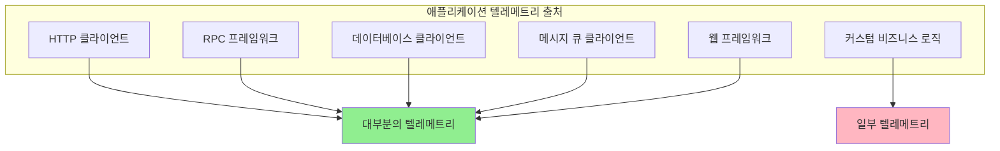
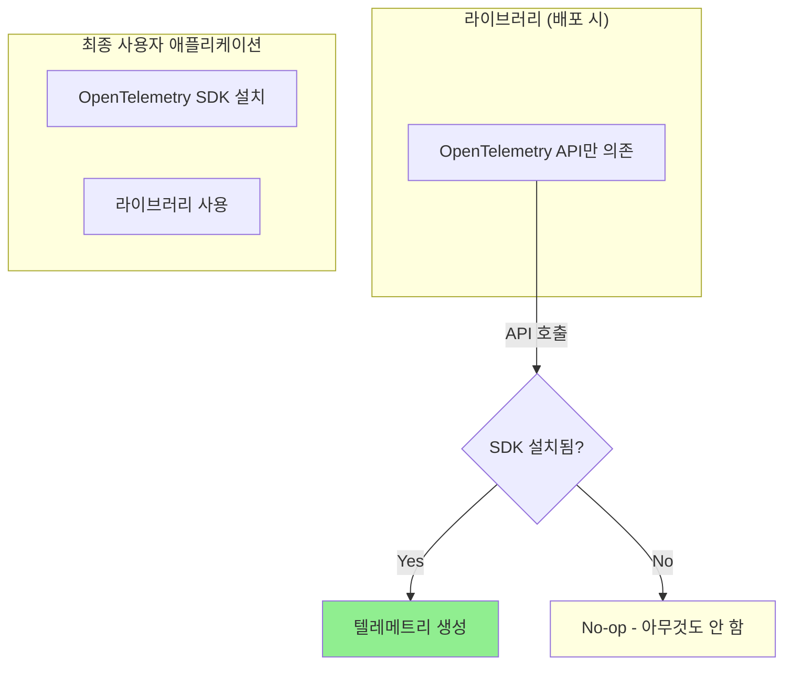
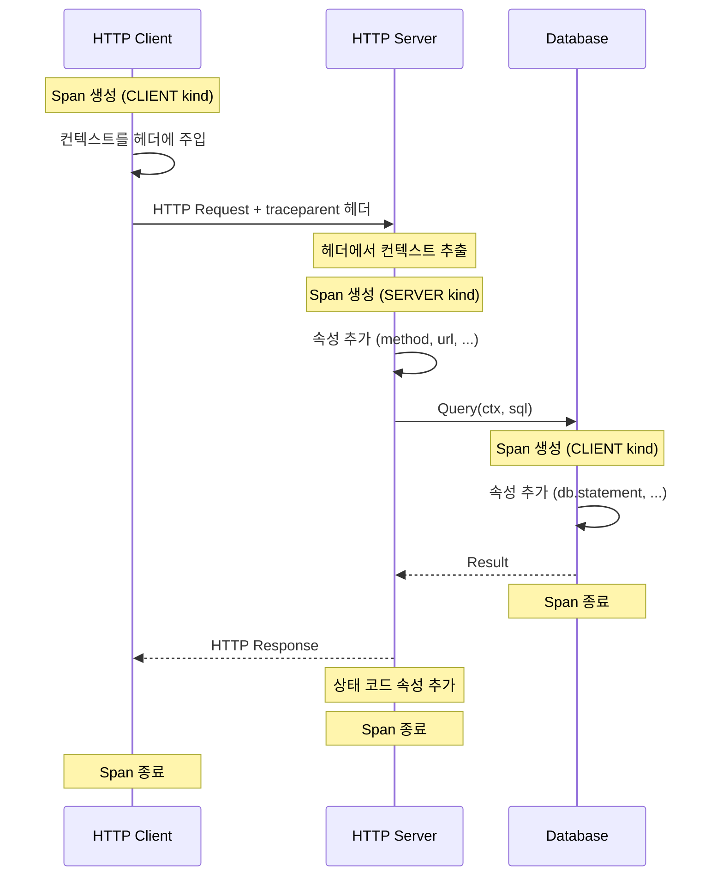

# Chapter 6: 라이브러리 계측 (Instrumenting Libraries)

---

### 📌 핵심 요약
> 라이브러리 계측은 Observability의 가장 중요한 구성요소다. OSS 라이브러리가 네이티브하게 OpenTelemetry를 지원하면, 사용자는 SDK만 설치하면 자동으로 텔레메트리를 얻을 수 있다. OpenTelemetry는 API/SDK 분리, 하위 호환성 보장, 기본 비활성화 등의 설계를 통해 라이브러리 개발자가 안전하게 계측을 추가할 수 있게 한다. 핵심은 **모든 중요한 작업에 span을 생성**하고, **의미 있는 속성을 추가**하며, **컨텍스트를 올바르게 전파**하는 것이다.

---

### 🎯 학습 목표
- 라이브러리 텔레메트리가 왜 가장 중요한 데이터 소스인지 이해한다
- 네이티브 계측과 플러그인 계측의 차이와 각각의 장단점을 안다
- OpenTelemetry가 라이브러리 계측을 위해 설계된 방식(API/SDK 분리)을 설명할 수 있다
- Shared Libraries Checklist의 8가지 항목을 적용할 수 있다
- Shared Services Checklist의 3가지 추가 항목을 이해한다

---

### 📖 본문 정리

#### 1. 라이브러리 텔레메트리의 중요성

> *"우리가 원하는 텔레메트리의 대부분은 직접 작성한 코드가 아니라 라이브러리에서 나온다."*



**현실 인식**:
- 애플리케이션 코드의 대부분은 라이브러리 호출
- 요청 처리, DB 접근, 네트워크 통신 = 모두 라이브러리가 담당
- **라이브러리 계측 없이는 Observability의 대부분을 놓친다**

---

#### 2. 네이티브 계측 vs 플러그인 계측

##### 플러그인(래퍼) 계측의 문제점

```
문제 시나리오:
┌─────────────────────────────────────────────────┐
│ 라이브러리 v1.0 출시                              │
│     ↓                                           │
│ 텔레메트리 플러그인 v1.0 출시 (1달 후)            │
│     ↓                                           │
│ 라이브러리 v2.0 출시 (breaking changes)          │
│     ↓                                           │
│ 플러그인 작동 안 함! (수 주간 기다림)             │
│     ↓                                           │
│ 사용자: 업그레이드 못 함 or 텔레메트리 포기        │
└─────────────────────────────────────────────────┘
```

| 방식 | 장점 | 단점 |
|------|------|------|
| **플러그인 계측** | 라이브러리 수정 불필요 | 버전 동기화 문제, 내부 API 의존, 깊은 컨텍스트 접근 불가 |
| **네이티브 계측** | 항상 동기화, 내부 컨텍스트 접근, 풍부한 속성 | 라이브러리 개발자 협력 필요 |

##### 네이티브 계측의 이점

```go
// 플러그인: 외부에서 래핑 → 제한된 정보
func WrapDBQuery(query string) {
    span := tracer.Start("db.query")
    // query 문자열만 알 수 있음
    result := db.Query(query)
    span.End()
}

// 네이티브: 내부에서 직접 → 풍부한 정보
func (db *Database) Query(ctx context.Context, query string) {
    span := tracer.Start(ctx, "db.query")
    span.SetAttributes(
        attribute.String("db.statement", query),
        attribute.String("db.name", db.name),
        attribute.String("db.connection_string", db.connStr),
        attribute.Int("db.pool.active", db.pool.Active()),
    )
    // 내부 상태에 완전히 접근 가능
    span.End()
}
```

---

#### 3. OpenTelemetry의 라이브러리 지원 설계

##### API/SDK 분리 아키텍처



##### 3가지 핵심 설계 원칙

**1. 하위 호환성 (Backward Compatibility)**
```
OpenTelemetry API 버전 관리:
├── 패치 버전 (x.x.1 → x.x.2): 버그 수정만
├── 마이너 버전 (x.1.x → x.2.x): 기능 추가, 하위 호환
└── 메이저 버전 (1.x.x → 2.x.x): 최소화, 장기 지원

목표: 라이브러리가 API 버전 업그레이드 걱정 없이 안전하게 의존
```

**2. 기본 비활성화 (Off by Default)**
```
SDK 미설치 시:
├── CPU 오버헤드: 0%
├── 메모리 할당: 0%
├── 네트워크 트래픽: 0%
└── 로그 출력: 없음

→ 라이브러리 사용자가 OpenTelemetry를 원하지 않으면 영향 없음
```

**3. 안정성 보장 (Stability Guarantees)**
```
API가 "Stable"로 표시되면:
├── 시그니처 변경 없음
├── 제거 없음 (최소 1년 deprecation)
├── 동작 변경 없음
└── 성능 저하 없음
```

---

#### 4. Shared Libraries Checklist (공유 라이브러리 체크리스트)

라이브러리 개발자를 위한 8가지 필수 항목:

##### ✅ 1. 중요한 작업마다 Span 생성

```go
// ❌ Bad: span 없음
func (c *Client) SendRequest(req *Request) (*Response, error) {
    return c.doSend(req)
}

// ✅ Good: 중요한 작업에 span
func (c *Client) SendRequest(ctx context.Context, req *Request) (*Response, error) {
    ctx, span := tracer.Start(ctx, "client.send_request",
        trace.WithSpanKind(trace.SpanKindClient))
    defer span.End()

    resp, err := c.doSend(ctx, req)
    if err != nil {
        span.RecordError(err)
        span.SetStatus(codes.Error, err.Error())
    }
    return resp, err
}
```

##### ✅ 2. 컨텍스트를 API의 일부로 포함

```go
// ❌ Bad: 컨텍스트 없음
func Query(sql string) (*Result, error)

// ✅ Good: 컨텍스트가 첫 번째 파라미터
func Query(ctx context.Context, sql string) (*Result, error)
```

> **왜 중요한가?** 컨텍스트 없이는 trace 전파 불가능

##### ✅ 3. 의미 있는 속성 추가

```go
span.SetAttributes(
    // Semantic Conventions 사용
    attribute.String("http.method", req.Method),
    attribute.String("http.url", req.URL.String()),
    attribute.Int("http.status_code", resp.StatusCode),

    // 라이브러리 특화 속성
    attribute.String("mylib.request_id", req.ID),
    attribute.Int("mylib.retry_count", retryCount),
)
```

##### ✅ 4. 적절한 Span Kind 설정

| Span Kind | 용도 | 예시 |
|-----------|------|------|
| `CLIENT` | 외부 서비스 호출 | HTTP 클라이언트, DB 클라이언트 |
| `SERVER` | 요청 수신 처리 | HTTP 서버, gRPC 서버 |
| `PRODUCER` | 메시지 발행 | Kafka producer, RabbitMQ publisher |
| `CONSUMER` | 메시지 소비 | Kafka consumer, RabbitMQ subscriber |
| `INTERNAL` | 내부 작업 (기본값) | 유틸리티 함수, 내부 처리 |

##### ✅ 5. 에러를 Span에 기록

```go
resp, err := c.doRequest(ctx, req)
if err != nil {
    span.RecordError(err)  // 에러 이벤트 기록
    span.SetStatus(codes.Error, err.Error())  // span 상태 설정
    return nil, err
}
// 성공 시에는 상태 설정 불필요 (기본값 = Unset = OK)
```

##### ✅ 6. Semantic Conventions 준수

```go
import "go.opentelemetry.io/otel/semconv/v1.17.0"

span.SetAttributes(
    semconv.HTTPMethodKey.String(req.Method),
    semconv.HTTPURLKey.String(req.URL.String()),
    semconv.HTTPStatusCodeKey.Int(resp.StatusCode),
)
```

> [OpenTelemetry Semantic Conventions](https://opentelemetry.io/docs/specs/semconv/) 참조

##### ✅ 7. 네트워크 경계에서 컨텍스트 전파

```go
// 발신 측: 헤더에 컨텍스트 주입
otel.GetTextMapPropagator().Inject(ctx, propagation.HeaderCarrier(req.Header))

// 수신 측: 헤더에서 컨텍스트 추출
ctx = otel.GetTextMapPropagator().Extract(ctx, propagation.HeaderCarrier(req.Header))
```

##### ✅ 8. 메트릭 노출

```go
var (
    requestCounter = meter.Int64Counter(
        "mylib.requests.total",
        metric.WithDescription("Total number of requests"),
    )
    requestDuration = meter.Float64Histogram(
        "mylib.request.duration",
        metric.WithDescription("Request duration in seconds"),
        metric.WithUnit("s"),
    )
)

func (c *Client) SendRequest(ctx context.Context, req *Request) {
    start := time.Now()
    defer func() {
        requestCounter.Add(ctx, 1,
            metric.WithAttributes(attribute.String("status", status)))
        requestDuration.Record(ctx, time.Since(start).Seconds())
    }()
    // ...
}
```

---

#### 5. Shared Services Checklist (공유 서비스 체크리스트)

서비스(마이크로서비스, 백엔드 API)에 추가로 적용할 3가지 항목:

##### ✅ 9. 서비스 리소스 속성 설정

```go
resource := resource.NewWithAttributes(
    semconv.SchemaURL,
    semconv.ServiceNameKey.String("payment-service"),
    semconv.ServiceVersionKey.String("1.2.3"),
    semconv.DeploymentEnvironmentKey.String("production"),
    semconv.ServiceInstanceIDKey.String(instanceID),
)
```

##### ✅ 10. 배포 환경 속성 설정

```go
resource.NewWithAttributes(
    semconv.SchemaURL,
    semconv.CloudProviderKey.String("aws"),
    semconv.CloudRegionKey.String("ap-northeast-2"),
    semconv.K8SClusterNameKey.String("prod-cluster"),
    semconv.K8SNamespaceNameKey.String("payments"),
    semconv.K8SPodNameKey.String(os.Getenv("HOSTNAME")),
)
```

##### ✅ 11. 로그를 Span에 연결

```go
// 구조화된 로깅과 trace 연결
logger.Info("Processing payment",
    zap.String("trace_id", span.SpanContext().TraceID().String()),
    zap.String("span_id", span.SpanContext().SpanID().String()),
    zap.String("payment_id", paymentID),
)
```

---

#### 6. 계측 플로우 다이어그램



---

### 🔍 심화 학습

#### OpenTelemetry Registry

OpenTelemetry 프로젝트는 계측 라이브러리 레지스트리를 유지관리한다:

| 언어 | 레지스트리 URL |
|------|---------------|
| Java | [opentelemetry-java-instrumentation](https://github.com/open-telemetry/opentelemetry-java-instrumentation) |
| Python | [opentelemetry-python-contrib](https://github.com/open-telemetry/opentelemetry-python-contrib) |
| JavaScript | [opentelemetry-js-contrib](https://github.com/open-telemetry/opentelemetry-js-contrib) |
| Go | [opentelemetry-go-contrib](https://github.com/open-telemetry/opentelemetry-go-contrib) |
| .NET | [opentelemetry-dotnet-contrib](https://github.com/open-telemetry/opentelemetry-dotnet-contrib) |

**출처**: [OpenTelemetry Registry](https://opentelemetry.io/ecosystem/registry/)

#### Zero-Code Instrumentation (자동 계측)

일부 언어(Java, Python, .NET)는 코드 수정 없이 계측 가능:

| 언어 | 방식 | 설명 |
|------|------|------|
| **Java** | Java Agent | JVM 바이트코드 조작으로 자동 계측 |
| **Python** | Monkey Patching | 런타임에 라이브러리 함수 교체 |
| **.NET** | CLR Profiler | .NET 런타임 프로파일러 API 활용 |
| **Node.js** | Require Hook | 모듈 로딩 시점에 래핑 |

**장점**: 코드 수정 없이 빠른 도입
**단점**: 커스텀 속성 추가 어려움, 모든 라이브러리 지원 X

**출처**: [OpenTelemetry Zero-Code Instrumentation](https://opentelemetry.io/docs/zero-code/)

#### Instrumentation Scope

OpenTelemetry는 텔레메트리가 어디서 생성되었는지 추적한다:

```go
// Tracer 생성 시 라이브러리 정보 제공
tracer := otel.GetTracerProvider().Tracer(
    "github.com/my-org/my-library",  // 라이브러리 이름
    trace.WithInstrumentationVersion("1.2.3"),  // 버전
    trace.WithSchemaURL(semconv.SchemaURL),  // 스키마 URL
)
```

이 정보는 텔레메트리 백엔드에서:
- 어떤 라이브러리가 텔레메트리를 생성했는지 필터링
- 라이브러리 버전별 문제 추적
- 계측 품질 모니터링

**출처**: [OpenTelemetry Instrumentation Scope](https://opentelemetry.io/docs/specs/otel/glossary/#instrumentation-scope)

---

### 💡 실무 적용 포인트

1. **라이브러리 개발자라면**: 네이티브 OpenTelemetry API를 추가하라. API만 의존하면 사용자에게 부담 없다
2. **애플리케이션 개발자라면**: SDK 설치 전에 사용 중인 라이브러리의 OpenTelemetry 지원 여부 확인
3. **컨텍스트 전파 필수**: `context.Context` (Go), `Context` (Java), `context` (Python)를 API에 포함
4. **Semantic Conventions 사용**: 표준 속성을 사용해야 백엔드 도구가 자동으로 시각화
5. **에러 처리 철저히**: `RecordError()` + `SetStatus()` 조합으로 에러 추적 완성
6. **메트릭도 함께**: 요청 수, 지연시간, 에러율 메트릭은 trace와 함께 제공
7. **문서화**: 어떤 span이 생성되고 어떤 속성이 포함되는지 문서화

---

### ✅ 정리 체크리스트

- [ ] 라이브러리 텔레메트리가 가장 중요한 데이터 소스인 이유를 설명할 수 있다
- [ ] 네이티브 계측이 플러그인 계측보다 나은 이유를 안다
- [ ] OpenTelemetry API/SDK 분리 설계의 목적을 이해한다
- [ ] "기본 비활성화" 원칙이 왜 중요한지 설명할 수 있다
- [ ] Shared Libraries Checklist 8가지 항목을 나열할 수 있다
- [ ] 적절한 Span Kind를 선택할 수 있다
- [ ] 에러를 Span에 올바르게 기록할 수 있다
- [ ] 네트워크 경계에서 컨텍스트를 전파하는 방법을 안다
- [ ] Shared Services Checklist 3가지 추가 항목을 이해한다

---

### 🔗 참고 자료

- [OpenTelemetry Instrumentation Guidelines](https://opentelemetry.io/docs/specs/otel/trace/api/#span)
- [OpenTelemetry Semantic Conventions](https://opentelemetry.io/docs/specs/semconv/)
- [OpenTelemetry Registry](https://opentelemetry.io/ecosystem/registry/)
- [OpenTelemetry Zero-Code Instrumentation](https://opentelemetry.io/docs/zero-code/)
- [OpenTelemetry API vs SDK](https://opentelemetry.io/docs/specs/otel/overview/#api)
- [W3C Trace Context Specification](https://www.w3.org/TR/trace-context/)
