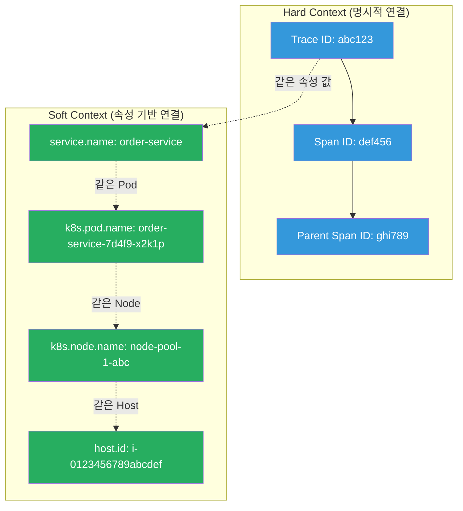
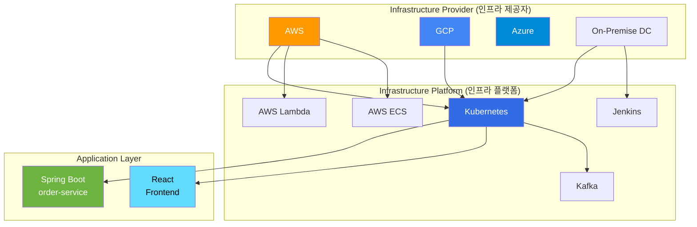
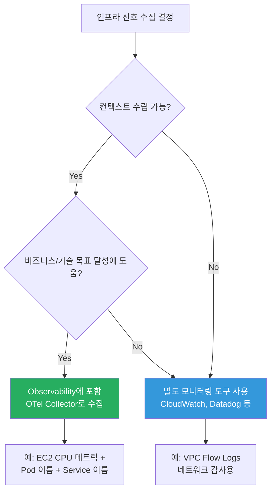
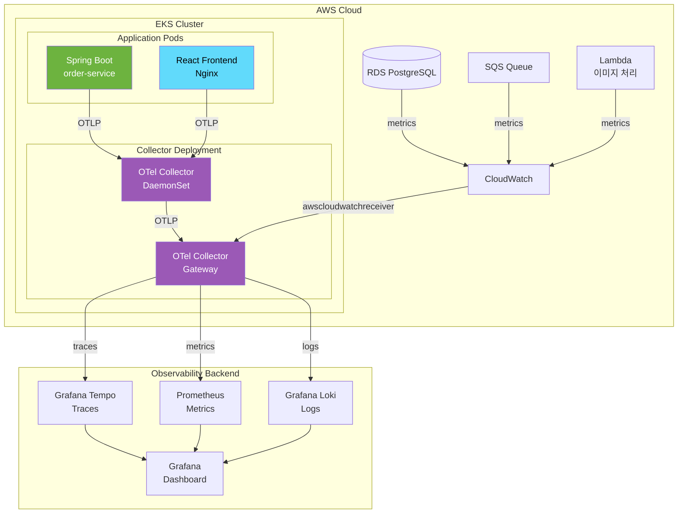
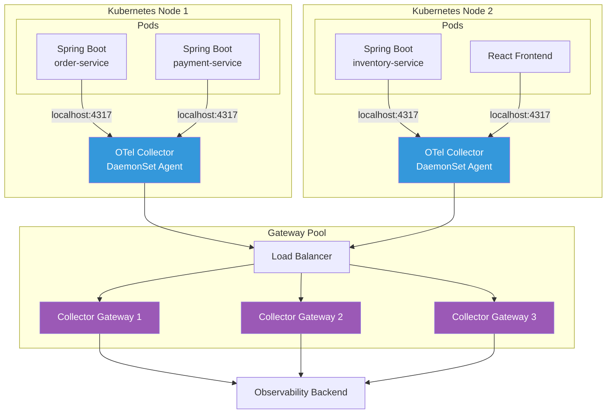
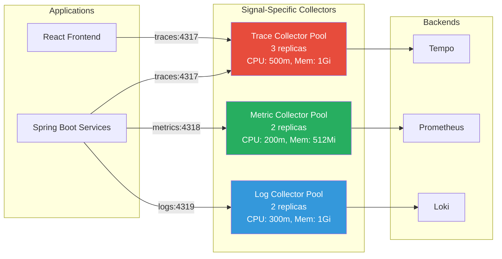
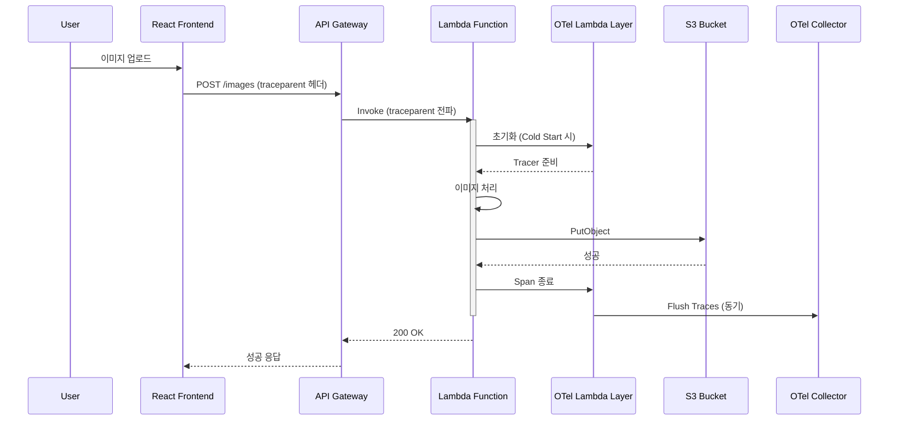
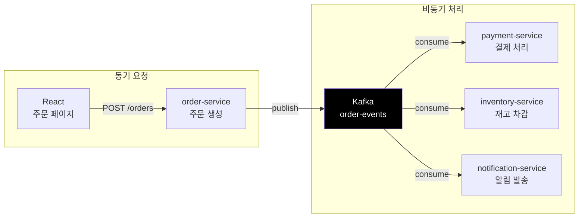
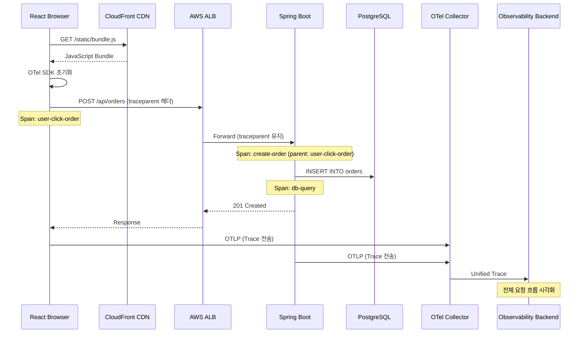
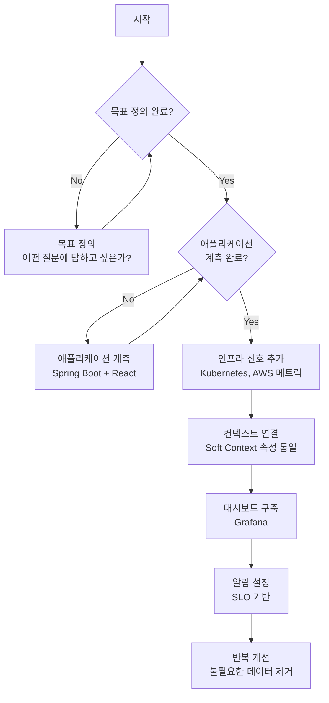

# Chapter 7: 인프라 관측 (Observing Infrastructure) - 상세 가이드

Spring Boot + React 환경을 기반으로 인프라 Observability를 상세히 설명합니다.

---

## 📌 핵심 요약

> 인프라 Observability는 단순한 모니터링과 다르다. 핵심 차이는 **컨텍스트**다. CPU 사용량 수치 자체는 의미가 없지만, 이를 특정 요청이나 서비스와 연결하면 문제 해결에 결정적인 단서가 된다. 이 문서에서는 Spring Boot + React 환경에서 OpenTelemetry를 활용한 인프라 관측 전략을 실제 코드와 함께 상세히 다룬다.

---

## 1. 인프라 Observability란?

### 모니터링 vs Observability의 핵심 차이

**모니터링**은 "무엇이 일어나고 있는가?"를 알려주고, **Observability**는 "왜 일어나고 있는가?"를 알려줍니다. 그 차이는 바로 **컨텍스트(Context)**입니다.

```
┌─────────────────────────────────────────────────────────────────────────────┐
│                              모니터링 (Monitoring)                           │
├─────────────────────────────────────────────────────────────────────────────┤
│                                                                             │
│  알림: "order-service Pod의 CPU 사용량이 90%입니다"                          │
│                                                                             │
│  운영자 반응:                                                                │
│  - 음... 그래서?                                                            │
│  - 스케일 업 해야 하나?                                                      │
│  - 버그인가? 정상적인 트래픽인가?                                            │
│  - 어떤 요청이 문제인가?                                                     │
│                                                                             │
│  → 조치 불가능: 추가 조사 필요                                               │
│                                                                             │
└─────────────────────────────────────────────────────────────────────────────┘

┌─────────────────────────────────────────────────────────────────────────────┐
│                           Observability                                     │
├─────────────────────────────────────────────────────────────────────────────┤
│                                                                             │
│  알림: "order-service Pod의 CPU 사용량이 90%입니다"                          │
│                                                                             │
│  + 컨텍스트:                                                                 │
│  ┌─────────────────────────────────────────────────────────────────┐        │
│  │ • Trace: POST /api/orders 요청이 평소 대비 10배 증가             │        │
│  │ • 원인: 프론트엔드에서 무한 루프로 주문 API 호출 중               │        │
│  │ • 사용자: user_id=12345의 브라우저에서 발생                      │        │
│  │ • 시작 시간: 14:23:45 (5분 전)                                   │        │
│  │ • 영향: 다른 사용자의 주문 지연 발생 중                           │        │
│  └─────────────────────────────────────────────────────────────────┘        │
│                                                                             │
│  → 즉시 조치 가능: Rate Limiting 적용 또는 해당 세션 차단                    │
│                                                                             │
└─────────────────────────────────────────────────────────────────────────────┘
```

### 컨텍스트의 두 가지 유형



| 컨텍스트 유형 | 설명 | 예시 |
|--------------|------|------|
| **Hard Context** | 명시적인 ID로 연결 | Trace ID, Span ID, Parent ID |
| **Soft Context** | 공통 속성 값으로 연결 | `service.name`, `k8s.pod.name`, `host.id` |

---

### Provider vs Platform 이해하기



**실제 예시: Spring Boot + React on AWS EKS**

```
Provider: AWS
├── Platform: EKS (Kubernetes)
│   ├── Application: Spring Boot Backend (order-service)
│   ├── Application: React Frontend
│   └── Platform: Kafka (MSK)
│       └── 비동기 메시지 처리
└── Platform: Lambda
    └── 이미지 리사이징 함수
```

---

### 인프라 신호를 포함해야 할까? - 판단 프레임워크



**Spring Boot + React 환경에서의 판단 예시:**

| 인프라 신호 | 컨텍스트 가능? | 목표 달성 도움? | 결정 |
|------------|---------------|----------------|------|
| Pod CPU/Memory | ✅ Pod → Service 연결 | ✅ 성능 병목 파악 | Observability |
| Node Disk I/O | ✅ Node → Pod → Service | ✅ DB 쿼리 지연 원인 | Observability |
| VPC Flow Logs | ❌ IP만 존재 | ❌ 보안 감사용 | 모니터링 |
| S3 Bucket 메트릭 | ⚠️ 버킷 이름만 | ⚠️ 상황에 따라 | 선택적 |

---

## 2. 클라우드 Provider 관측

### 클라우드 텔레메트리 빙산 - 상세 분석

```
                    ┌─────────────────────────────────────────┐
                    │         수면 위: Observability          │
                    │         (비즈니스 가치 있음)             │
                    ├─────────────────────────────────────────┤
    ────────────────│  • API Gateway 지연시간                 │────────────────
                    │  • RDS 쿼리 실행 시간                   │
                    │  • Lambda 콜드 스타트                   │
                    │  • ALB 5xx 에러율                       │
                    │  • SQS 메시지 처리 시간                 │
                    └─────────────────────────────────────────┘
                    ┌─────────────────────────────────────────┐
                    │                                         │
                    │         수면 아래: 모니터링용           │
                    │         (운영 참고용)                    │
                    │                                         │
                    ├─────────────────────────────────────────┤
                    │  • EC2 인스턴스 Up/Down                 │
                    │  • EBS 볼륨 상태                        │
                    │  • VPC 네트워크 인터페이스              │
                    │  • CloudTrail 감사 로그                 │
                    │  • 수백 개의 CloudWatch 세부 메트릭     │
                    │  • Config 규정 준수 상태                │
                    │  • ...                                  │
                    │                                         │
                    └─────────────────────────────────────────┘
```

### 클라우드 메트릭 수집 아키텍처

#### Spring Boot + React on AWS 환경



---

### Collector 설정 - AWS 클라우드 메트릭 수집

```yaml
# otel-collector-config.yaml
receivers:
  # 애플리케이션 텔레메트리 수신
  otlp:
    protocols:
      grpc:
        endpoint: 0.0.0.0:4317
      http:
        endpoint: 0.0.0.0:4318
  
  # AWS CloudWatch 메트릭 수집
  awscloudwatch:
    region: ap-northeast-2
    poll_interval: 1m
    metrics:
      # RDS 메트릭 - DB 성능과 직결
      - namespace: AWS/RDS
        metric_name: DatabaseConnections
        period: 1m
        statistics: [Average, Maximum]
        dimensions:
          - name: DBInstanceIdentifier
            value: order-service-db
      
      - namespace: AWS/RDS
        metric_name: ReadLatency
        period: 1m
        statistics: [Average, p99]
        dimensions:
          - name: DBInstanceIdentifier
            value: order-service-db
      
      - namespace: AWS/RDS
        metric_name: WriteLatency
        period: 1m
        statistics: [Average, p99]
        dimensions:
          - name: DBInstanceIdentifier
            value: order-service-db
      
      # SQS 메트릭 - 비동기 처리 상태
      - namespace: AWS/SQS
        metric_name: ApproximateNumberOfMessagesVisible
        period: 1m
        statistics: [Average]
        dimensions:
          - name: QueueName
            value: order-processing-queue
      
      - namespace: AWS/SQS
        metric_name: ApproximateAgeOfOldestMessage
        period: 1m
        statistics: [Maximum]
        dimensions:
          - name: QueueName
            value: order-processing-queue
      
      # Lambda 메트릭 - 서버리스 함수 상태
      - namespace: AWS/Lambda
        metric_name: Duration
        period: 1m
        statistics: [Average, p99]
        dimensions:
          - name: FunctionName
            value: image-resizer
      
      - namespace: AWS/Lambda
        metric_name: ConcurrentExecutions
        period: 1m
        statistics: [Maximum]
        dimensions:
          - name: FunctionName
            value: image-resizer
      
      # ALB 메트릭 - 프론트엔드 진입점
      - namespace: AWS/ApplicationELB
        metric_name: HTTPCode_Target_5XX_Count
        period: 1m
        statistics: [Sum]
        dimensions:
          - name: LoadBalancer
            value: app/order-service-alb/1234567890

processors:
  # Soft Context를 위한 리소스 속성 추가
  resource:
    attributes:
      - key: cloud.provider
        value: aws
        action: upsert
      - key: cloud.region
        value: ${AWS_REGION}
        action: upsert
      - key: deployment.environment
        value: ${DEPLOYMENT_ENV}
        action: upsert
  
  # 메모리 보호
  memory_limiter:
    check_interval: 1s
    limit_mib: 1000
    spike_limit_mib: 200
  
  # 배치 처리
  batch:
    timeout: 5s
    send_batch_size: 512

exporters:
  otlphttp/tempo:
    endpoint: http://tempo:4318
  
  prometheusremotewrite:
    endpoint: http://prometheus:9090/api/v1/write
  
  loki:
    endpoint: http://loki:3100/loki/api/v1/push

service:
  pipelines:
    traces:
      receivers: [otlp]
      processors: [memory_limiter, resource, batch]
      exporters: [otlphttp/tempo]
    
    metrics:
      receivers: [otlp, awscloudwatch]
      processors: [memory_limiter, resource, batch]
      exporters: [prometheusremotewrite]
    
    logs:
      receivers: [otlp]
      processors: [memory_limiter, resource, batch]
      exporters: [loki]
```

---

## 3. Collector 배포 아키텍처 상세

### 패턴 1: Agent + Gateway 패턴 (권장)



**장점:**
- Agent가 로컬에서 버퍼링 → 네트워크 장애 시 데이터 보호
- Gateway에서 중앙 집중 처리 (샘플링, 변환)
- Gateway만 스케일링하면 됨

#### Agent 설정 (DaemonSet)

```yaml
# agent-collector-config.yaml
receivers:
  otlp:
    protocols:
      grpc:
        endpoint: 0.0.0.0:4317
      http:
        endpoint: 0.0.0.0:4318
  
  # 호스트 메트릭 수집
  hostmetrics:
    collection_interval: 30s
    scrapers:
      cpu:
      memory:
      disk:
      network:

processors:
  memory_limiter:
    check_interval: 1s
    limit_mib: 400
    spike_limit_mib: 100
  
  batch:
    timeout: 1s
    send_batch_size: 256
  
  # 노드 정보 추가
  k8sattributes:
    auth_type: serviceAccount
    passthrough: false
    extract:
      metadata:
        - k8s.pod.name
        - k8s.pod.uid
        - k8s.deployment.name
        - k8s.namespace.name
        - k8s.node.name
        - k8s.container.name

exporters:
  otlp:
    endpoint: otel-gateway.monitoring.svc.cluster.local:4317
    tls:
      insecure: true

service:
  pipelines:
    traces:
      receivers: [otlp]
      processors: [memory_limiter, k8sattributes, batch]
      exporters: [otlp]
    
    metrics:
      receivers: [otlp, hostmetrics]
      processors: [memory_limiter, k8sattributes, batch]
      exporters: [otlp]
    
    logs:
      receivers: [otlp]
      processors: [memory_limiter, k8sattributes, batch]
      exporters: [otlp]
```

#### Kubernetes DaemonSet 매니페스트

```yaml
# otel-agent-daemonset.yaml
apiVersion: apps/v1
kind: DaemonSet
metadata:
  name: otel-collector-agent
  namespace: monitoring
spec:
  selector:
    matchLabels:
      app: otel-collector-agent
  template:
    metadata:
      labels:
        app: otel-collector-agent
    spec:
      serviceAccountName: otel-collector
      containers:
        - name: collector
          image: otel/opentelemetry-collector-contrib:0.91.0
          args:
            - --config=/etc/otel/config.yaml
          ports:
            - containerPort: 4317  # OTLP gRPC
              hostPort: 4317
            - containerPort: 4318  # OTLP HTTP
              hostPort: 4318
          resources:
            limits:
              memory: 500Mi
              cpu: 200m
            requests:
              memory: 200Mi
              cpu: 100m
          volumeMounts:
            - name: config
              mountPath: /etc/otel
      volumes:
        - name: config
          configMap:
            name: otel-agent-config
---
apiVersion: v1
kind: ServiceAccount
metadata:
  name: otel-collector
  namespace: monitoring
---
apiVersion: rbac.authorization.k8s.io/v1
kind: ClusterRole
metadata:
  name: otel-collector
rules:
  - apiGroups: [""]
    resources: ["pods", "namespaces", "nodes"]
    verbs: ["get", "list", "watch"]
  - apiGroups: ["apps"]
    resources: ["deployments", "replicasets"]
    verbs: ["get", "list", "watch"]
---
apiVersion: rbac.authorization.k8s.io/v1
kind: ClusterRoleBinding
metadata:
  name: otel-collector
subjects:
  - kind: ServiceAccount
    name: otel-collector
    namespace: monitoring
roleRef:
  kind: ClusterRole
  name: otel-collector
  apiGroup: rbac.authorization.k8s.io
```

---

### 패턴 2: 신호별 분리 패턴

고부하 환경에서는 Trace, Metric, Log를 별도 Collector 풀로 분리합니다.



**왜 분리하는가?**

| 신호 | 특성 | 리소스 프로필 |
|------|------|--------------|
| Trace | 고빈도, 가변 크기, 순서 중요 | 높은 CPU, 중간 메모리 |
| Metric | 저빈도, 고정 크기, 집계 필요 | 낮은 CPU, 낮은 메모리 |
| Log | 가변 빈도, 대용량, 텍스트 처리 | 중간 CPU, 높은 메모리 |

---

## 4. Metamonitoring (Collector 자체 모니터링)

Collector가 죽으면 모든 텔레메트리가 사라집니다. Collector 자체를 모니터링하는 것이 필수입니다.

### 핵심 메트릭 상세 설명

```yaml
# Grafana 대시보드용 PromQL 쿼리

# 1. 거부된 Span 수 - 높으면 스케일 업 필요
sum(rate(otelcol_processor_refused_spans[5m])) by (processor)

# 2. 큐 사용률 - 80% 이상이면 경고
otelcol_exporter_queue_size / otelcol_exporter_queue_capacity * 100

# 3. Export 실패율
sum(rate(otelcol_exporter_send_failed_spans[5m])) 
/ 
sum(rate(otelcol_exporter_sent_spans[5m])) * 100

# 4. 메모리 사용량
process_resident_memory_bytes{job="otel-collector"}

# 5. 처리량 (초당 Span 수)
sum(rate(otelcol_receiver_accepted_spans[1m]))
```

### Collector 모니터링 대시보드 설정

```yaml
# collector-with-self-monitoring.yaml
receivers:
  otlp:
    protocols:
      grpc:
        endpoint: 0.0.0.0:4317

processors:
  memory_limiter:
    check_interval: 1s
    limit_mib: 800
    spike_limit_mib: 200

exporters:
  otlp:
    endpoint: tempo:4317
  
  # Prometheus로 자체 메트릭 노출
  prometheus:
    endpoint: 0.0.0.0:8888
    namespace: otelcol
    const_labels:
      collector_instance: ${HOSTNAME}

extensions:
  # 헬스 체크 엔드포인트
  health_check:
    endpoint: 0.0.0.0:13133
  
  # 디버깅용 zPages
  zpages:
    endpoint: 0.0.0.0:55679
  
  # PProf (Go 프로파일링)
  pprof:
    endpoint: 0.0.0.0:1777

service:
  extensions: [health_check, zpages, pprof]
  
  # Collector 자체 텔레메트리 설정
  telemetry:
    logs:
      level: info
      encoding: json
    metrics:
      level: detailed
      address: 0.0.0.0:8888
  
  pipelines:
    traces:
      receivers: [otlp]
      processors: [memory_limiter]
      exporters: [otlp]
```

### 알림 규칙 예시

```yaml
# prometheus-alerting-rules.yaml
groups:
  - name: otel-collector
    rules:
      # Collector가 Span을 거부하고 있음
      - alert: CollectorDroppingSpans
        expr: sum(rate(otelcol_processor_refused_spans[5m])) > 0
        for: 2m
        labels:
          severity: warning
        annotations:
          summary: "OTel Collector가 Span을 거부하고 있습니다"
          description: "{{ $value }} spans/s가 거부되고 있습니다. 스케일 업을 고려하세요."
      
      # 큐가 거의 가득 참
      - alert: CollectorQueueNearFull
        expr: otelcol_exporter_queue_size / otelcol_exporter_queue_capacity > 0.8
        for: 5m
        labels:
          severity: warning
        annotations:
          summary: "Collector 큐 사용률이 80%를 초과했습니다"
      
      # Export 실패율 높음
      - alert: CollectorExportFailures
        expr: |
          sum(rate(otelcol_exporter_send_failed_spans[5m])) 
          / 
          sum(rate(otelcol_exporter_sent_spans[5m])) > 0.05
        for: 5m
        labels:
          severity: critical
        annotations:
          summary: "Collector Export 실패율이 5%를 초과했습니다"
      
      # 메모리 사용량 높음
      - alert: CollectorHighMemory
        expr: process_resident_memory_bytes{job="otel-collector"} > 800 * 1024 * 1024
        for: 5m
        labels:
          severity: warning
        annotations:
          summary: "Collector 메모리 사용량이 800MB를 초과했습니다"
```

---

## 5. Kubernetes 플랫폼 관측 - Spring Boot 상세 예시

### OpenTelemetry Operator 설치 및 설정

```bash
# cert-manager 설치 (Operator 의존성)
kubectl apply -f https://github.com/cert-manager/cert-manager/releases/download/v1.13.0/cert-manager.yaml

# OpenTelemetry Operator 설치
kubectl apply -f https://github.com/open-telemetry/opentelemetry-operator/releases/latest/download/opentelemetry-operator.yaml
```

### Collector CRD로 배포

```yaml
# otel-collector-crd.yaml
apiVersion: opentelemetry.io/v1alpha1
kind: OpenTelemetryCollector
metadata:
  name: otel-gateway
  namespace: monitoring
spec:
  mode: deployment
  replicas: 3
  
  resources:
    limits:
      memory: 1Gi
      cpu: 500m
    requests:
      memory: 256Mi
      cpu: 100m
  
  config: |
    receivers:
      otlp:
        protocols:
          grpc:
            endpoint: 0.0.0.0:4317
          http:
            endpoint: 0.0.0.0:4318
      
      # Kubernetes 클러스터 메트릭
      k8s_cluster:
        auth_type: serviceAccount
        collection_interval: 30s
        node_conditions_to_report: [Ready, MemoryPressure, DiskPressure]
        allocatable_types_to_report: [cpu, memory, storage]
      
      # Kubernetes 이벤트
      k8s_events:
        auth_type: serviceAccount
        namespaces: [default, order-service, monitoring]
      
      # Kubelet 메트릭 (Pod 레벨)
      kubeletstats:
        auth_type: serviceAccount
        collection_interval: 30s
        endpoint: https://${K8S_NODE_NAME}:10250
        insecure_skip_verify: true
        metric_groups:
          - pod
          - container
          - node
    
    processors:
      memory_limiter:
        check_interval: 1s
        limit_mib: 800
        spike_limit_mib: 200
      
      batch:
        timeout: 5s
        send_batch_size: 512
      
      # Kubernetes 메타데이터 추가
      k8sattributes:
        auth_type: serviceAccount
        extract:
          metadata:
            - k8s.namespace.name
            - k8s.pod.name
            - k8s.deployment.name
            - k8s.node.name
            - container.id
          labels:
            - tag_name: app
              key: app.kubernetes.io/name
            - tag_name: version
              key: app.kubernetes.io/version
    
    exporters:
      otlp/tempo:
        endpoint: tempo.monitoring.svc.cluster.local:4317
        tls:
          insecure: true
      
      prometheusremotewrite:
        endpoint: http://prometheus.monitoring.svc.cluster.local:9090/api/v1/write
      
      loki:
        endpoint: http://loki.monitoring.svc.cluster.local:3100/loki/api/v1/push
    
    service:
      pipelines:
        traces:
          receivers: [otlp]
          processors: [memory_limiter, k8sattributes, batch]
          exporters: [otlp/tempo]
        
        metrics:
          receivers: [otlp, k8s_cluster, kubeletstats]
          processors: [memory_limiter, k8sattributes, batch]
          exporters: [prometheusremotewrite]
        
        logs:
          receivers: [otlp, k8s_events]
          processors: [memory_limiter, k8sattributes, batch]
          exporters: [loki]
```

### Spring Boot 애플리케이션 Auto-Instrumentation

Operator를 사용하면 코드 수정 없이 자동 계측이 가능합니다.

```yaml
# instrumentation-crd.yaml
apiVersion: opentelemetry.io/v1alpha1
kind: Instrumentation
metadata:
  name: java-instrumentation
  namespace: order-service
spec:
  exporter:
    endpoint: http://otel-gateway-collector.monitoring.svc.cluster.local:4317
  
  propagators:
    - tracecontext
    - baggage
  
  sampler:
    type: parentbased_traceidratio
    argument: "0.1"  # 10% 샘플링
  
  java:
    image: ghcr.io/open-telemetry/opentelemetry-operator/autoinstrumentation-java:latest
    env:
      - name: OTEL_INSTRUMENTATION_JDBC_ENABLED
        value: "true"
      - name: OTEL_INSTRUMENTATION_SPRING_WEBMVC_ENABLED
        value: "true"
      - name: OTEL_INSTRUMENTATION_KAFKA_ENABLED
        value: "true"
```

```yaml
# order-service-deployment.yaml
apiVersion: apps/v1
kind: Deployment
metadata:
  name: order-service
  namespace: order-service
spec:
  replicas: 3
  selector:
    matchLabels:
      app: order-service
  template:
    metadata:
      labels:
        app: order-service
      annotations:
        # Auto-Instrumentation 활성화!
        instrumentation.opentelemetry.io/inject-java: "java-instrumentation"
    spec:
      containers:
        - name: order-service
          image: myregistry/order-service:1.0.0
          ports:
            - containerPort: 8080
          env:
            - name: SPRING_PROFILES_ACTIVE
              value: production
            - name: OTEL_SERVICE_NAME
              value: order-service
            - name: OTEL_RESOURCE_ATTRIBUTES
              value: "service.version=1.0.0,deployment.environment=production"
          resources:
            limits:
              memory: 1Gi
              cpu: 500m
```

**동작 원리:**

1. Operator가 `inject-java` 어노테이션 감지
2. Init Container로 Java Agent 주입
3. `JAVA_TOOL_OPTIONS`에 `-javaagent` 추가
4. 애플리케이션 시작 시 자동 계측 활성화

---

## 6. 서버리스 플랫폼 관측 - AWS Lambda 상세

### Lambda with OpenTelemetry Layer



### Lambda 함수 코드 (Java)

```java
// ImageResizerHandler.java
package com.example.lambda;

import com.amazonaws.services.lambda.runtime.Context;
import com.amazonaws.services.lambda.runtime.RequestHandler;
import com.amazonaws.services.lambda.runtime.events.APIGatewayProxyRequestEvent;
import com.amazonaws.services.lambda.runtime.events.APIGatewayProxyResponseEvent;

import io.opentelemetry.api.GlobalOpenTelemetry;
import io.opentelemetry.api.trace.Span;
import io.opentelemetry.api.trace.SpanKind;
import io.opentelemetry.api.trace.Tracer;
import io.opentelemetry.context.Context as OtelContext;
import io.opentelemetry.context.Scope;
import io.opentelemetry.context.propagation.TextMapGetter;

import software.amazon.awssdk.services.s3.S3Client;
import software.amazon.awssdk.services.s3.model.PutObjectRequest;

import java.util.Map;

public class ImageResizerHandler implements 
        RequestHandler<APIGatewayProxyRequestEvent, APIGatewayProxyResponseEvent> {
    
    private static final Tracer tracer = 
        GlobalOpenTelemetry.getTracer("image-resizer", "1.0.0");
    
    private static final S3Client s3Client = S3Client.create();
    
    // Trace Context 추출용
    private static final TextMapGetter<Map<String, String>> GETTER = 
        new TextMapGetter<>() {
            @Override
            public Iterable<String> keys(Map<String, String> carrier) {
                return carrier.keySet();
            }
            
            @Override
            public String get(Map<String, String> carrier, String key) {
                return carrier.get(key.toLowerCase());
            }
        };
    
    @Override
    public APIGatewayProxyResponseEvent handleRequest(
            APIGatewayProxyRequestEvent event, 
            Context lambdaContext) {
        
        // 1. 들어온 Trace Context 추출
        OtelContext extractedContext = GlobalOpenTelemetry.getPropagators()
            .getTextMapPropagator()
            .extract(OtelContext.current(), event.getHeaders(), GETTER);
        
        // 2. Lambda 처리 Span 시작 (추출된 Context를 parent로)
        Span span = tracer.spanBuilder("resize-image")
            .setParent(extractedContext)
            .setSpanKind(SpanKind.SERVER)
            .setAttribute("faas.trigger", "http")
            .setAttribute("faas.invocation_id", lambdaContext.getAwsRequestId())
            .setAttribute("cloud.account.id", 
                lambdaContext.getInvokedFunctionArn().split(":")[4])
            .startSpan();
        
        try (Scope scope = span.makeCurrent()) {
            // 3. 요청 정보 기록
            span.setAttribute("http.method", event.getHttpMethod());
            span.setAttribute("http.route", event.getPath());
            
            // 4. Cold Start 감지
            if (isColdStart()) {
                span.addEvent("cold_start");
                span.setAttribute("faas.coldstart", true);
            }
            
            // 5. 비즈니스 로직 수행
            String imageId = processImage(event.getBody());
            
            // 6. 성공 응답
            span.setAttribute("http.status_code", 200);
            
            return new APIGatewayProxyResponseEvent()
                .withStatusCode(200)
                .withBody("{\"imageId\": \"" + imageId + "\"}");
            
        } catch (Exception e) {
            span.recordException(e);
            span.setAttribute("http.status_code", 500);
            
            return new APIGatewayProxyResponseEvent()
                .withStatusCode(500)
                .withBody("{\"error\": \"" + e.getMessage() + "\"}");
            
        } finally {
            span.end();
        }
    }
    
    private String processImage(String body) {
        // 이미지 처리 로직 (별도 Span으로 감싸기)
        Span span = tracer.spanBuilder("s3-upload")
            .setSpanKind(SpanKind.CLIENT)
            .startSpan();
        
        try (Scope scope = span.makeCurrent()) {
            String imageId = java.util.UUID.randomUUID().toString();
            
            span.setAttribute("aws.s3.bucket", "processed-images");
            span.setAttribute("aws.s3.key", imageId + ".jpg");
            
            // S3 업로드
            s3Client.putObject(
                PutObjectRequest.builder()
                    .bucket("processed-images")
                    .key(imageId + ".jpg")
                    .build(),
                software.amazon.awssdk.core.sync.RequestBody.fromString(body)
            );
            
            return imageId;
            
        } finally {
            span.end();
        }
    }
    
    private static boolean coldStartDetected = true;
    
    private boolean isColdStart() {
        if (coldStartDetected) {
            coldStartDetected = false;
            return true;
        }
        return false;
    }
}
```

### Lambda 배포 설정 (SAM Template)

```yaml
# template.yaml
AWSTemplateFormatVersion: '2010-09-09'
Transform: AWS::Serverless-2016-10-31

Globals:
  Function:
    Timeout: 30
    MemorySize: 512
    Runtime: java17
    Architectures:
      - x86_64
    Environment:
      Variables:
        # OTel 설정
        OTEL_SERVICE_NAME: image-resizer
        OTEL_EXPORTER_OTLP_ENDPOINT: http://collector.example.com:4317
        OTEL_PROPAGATORS: tracecontext,baggage
        # Lambda Layer 설정
        AWS_LAMBDA_EXEC_WRAPPER: /opt/otel-handler

Resources:
  ImageResizerFunction:
    Type: AWS::Serverless::Function
    Properties:
      Handler: com.example.lambda.ImageResizerHandler::handleRequest
      CodeUri: target/image-resizer.jar
      
      # OpenTelemetry Lambda Layer 추가
      Layers:
        - !Sub arn:aws:lambda:${AWS::Region}:901920570463:layer:aws-otel-java-agent-amd64-ver-1-32-0:1
      
      Policies:
        - S3WritePolicy:
            BucketName: processed-images
      
      Events:
        Api:
          Type: Api
          Properties:
            Path: /images
            Method: POST
      
      # X-Ray 활성화 (OTel과 함께 사용 가능)
      Tracing: Active

  # 전용 Collector (Lambda와 가까이 배치)
  CollectorFunction:
    Type: AWS::Serverless::Function
    Properties:
      Handler: bootstrap
      Runtime: provided.al2
      CodeUri: ./collector/
      MemorySize: 256
      Timeout: 60
      Environment:
        Variables:
          OTEL_EXPORTER_OTLP_ENDPOINT: https://tempo.example.com:4317
```

### 서버리스 성능 최적화 팁

```java
/**
 * Lambda에서 OTel 성능 최적화
 */
public class OptimizedHandler {
    
    // 1. 정적 초기화로 Cold Start 비용 최소화
    private static final Tracer tracer;
    private static final S3Client s3Client;
    
    static {
        // Init 단계에서 한 번만 초기화
        tracer = GlobalOpenTelemetry.getTracer("image-resizer");
        s3Client = S3Client.create();
    }
    
    // 2. 불변 속성 캐싱
    private static final Attributes COMMON_ATTRIBUTES = Attributes.builder()
        .put("faas.name", System.getenv("AWS_LAMBDA_FUNCTION_NAME"))
        .put("faas.version", System.getenv("AWS_LAMBDA_FUNCTION_VERSION"))
        .put("cloud.provider", "aws")
        .put("cloud.region", System.getenv("AWS_REGION"))
        .build();
    
    public APIGatewayProxyResponseEvent handleRequest(
            APIGatewayProxyRequestEvent event,
            Context context) {
        
        Span span = tracer.spanBuilder("process-request")
            .setAllAttributes(COMMON_ATTRIBUTES)  // 캐싱된 속성 사용
            .startSpan();
        
        try (Scope scope = span.makeCurrent()) {
            // 비즈니스 로직
            return process(event);
            
        } finally {
            // 3. Span을 명시적으로 종료 (라이브러리에 제어 반환 전)
            span.end();
            
            // 4. Flush를 기다리지 않음 - Lambda Extension이 처리
            // (Layer 사용 시 자동 처리됨)
        }
    }
}
```

---

## 7. 비동기 워크플로우 관측 - Kafka 상세 예시

### 시나리오: 주문 처리 파이프라인



### 문제: 기존 Parent-Child 관계의 한계

```
기존 방식 (Parent-Child):
┌─────────────────────────────────────────────────────────────┐
│ Trace ID: abc123                                            │
│                                                             │
│ [order-service] ─┬─> [payment-service]   ❌ 연결 끊김        │
│     200ms        │                                          │
│                  ├─> [inventory-service]  ❌ 연결 끊김        │
│                  │                                          │
│                  └─> [notification-service] ❌ 연결 끊김      │
│                                                             │
│ 문제: Consumer가 시작될 때 Producer의 Span은 이미 종료됨      │
│      → Parent-Child 관계 수립 불가                           │
└─────────────────────────────────────────────────────────────┘
```

### 해결: Span Links + Correlation ID

```
개선된 방식 (Span Links + order_id):
┌─────────────────────────────────────────────────────────────┐
│                                                             │
│ Trace 1: order-service                                      │
│ ┌──────────────────────────────────┐                        │
│ │ [create-order]                   │ order_id: ORD-12345    │
│ │   └── [publish-to-kafka]         │                        │
│ └──────────────────────────────────┘                        │
│         │                                                   │
│         │ Span Link                                         │
│         ▼                                                   │
│ Trace 2: payment-service                                    │
│ ┌──────────────────────────────────┐                        │
│ │ [process-payment]                │ order_id: ORD-12345    │
│ │   └── [call-pg-api]              │                        │
│ └──────────────────────────────────┘                        │
│         │                                                   │
│         │ Span Link                                         │
│         ▼                                                   │
│ Trace 3: inventory-service                                  │
│ ┌──────────────────────────────────┐                        │
│ │ [reserve-inventory]              │ order_id: ORD-12345    │
│ │   └── [update-stock]             │                        │
│ └──────────────────────────────────┘                        │
│                                                             │
│ 쿼리: order_id = "ORD-12345" → 모든 관련 Trace 조회         │
└─────────────────────────────────────────────────────────────┘
```

### Producer 코드 (order-service)

```java
// OrderService.java
@Service
@RequiredArgsConstructor
public class OrderService {
    
    private static final Tracer tracer = 
        GlobalOpenTelemetry.getTracer("order-service");
    
    private final KafkaTemplate<String, OrderEvent> kafkaTemplate;
    
    public Order createOrder(OrderRequest request) {
        String orderId = generateOrderId();
        
        // 1. 주문 생성 Span
        Span span = tracer.spanBuilder("create-order")
            .setSpanKind(SpanKind.PRODUCER)
            .setAttribute("order.id", orderId)
            .setAttribute("order.total", request.getTotal())
            .setAttribute("order.item_count", request.getItems().size())
            .startSpan();
        
        try (Scope scope = span.makeCurrent()) {
            // 2. DB 저장
            Order order = orderRepository.save(
                Order.builder()
                    .id(orderId)
                    .customerId(request.getCustomerId())
                    .items(request.getItems())
                    .status(OrderStatus.CREATED)
                    .build()
            );
            
            // 3. Kafka로 이벤트 발행
            publishOrderEvent(order);
            
            return order;
            
        } finally {
            span.end();
        }
    }
    
    private void publishOrderEvent(Order order) {
        Span span = tracer.spanBuilder("publish-order-event")
            .setSpanKind(SpanKind.PRODUCER)
            .setAttribute(SemanticAttributes.MESSAGING_SYSTEM, "kafka")
            .setAttribute(SemanticAttributes.MESSAGING_DESTINATION_NAME, "order-events")
            .setAttribute(SemanticAttributes.MESSAGING_OPERATION, "publish")
            .setAttribute("order.id", order.getId())
            .startSpan();
        
        try (Scope scope = span.makeCurrent()) {
            OrderEvent event = new OrderEvent(order);
            
            // Trace Context를 Kafka 헤더에 주입
            ProducerRecord<String, OrderEvent> record = new ProducerRecord<>(
                "order-events",
                order.getId(),
                event
            );
            
            // W3C Trace Context 헤더 주입
            GlobalOpenTelemetry.getPropagators()
                .getTextMapPropagator()
                .inject(Context.current(), record.headers(), 
                    (headers, key, value) -> headers.add(key, value.getBytes()));
            
            // 현재 Span의 Context도 함께 저장 (Link용)
            SpanContext producerContext = span.getSpanContext();
            record.headers().add("producer-trace-id", 
                producerContext.getTraceId().getBytes());
            record.headers().add("producer-span-id", 
                producerContext.getSpanId().getBytes());
            
            kafkaTemplate.send(record);
            
            span.addEvent("message-sent", Attributes.of(
                AttributeKey.stringKey("messaging.message_id"), order.getId()
            ));
            
        } finally {
            span.end();
        }
    }
}
```

### Consumer 코드 (payment-service)

```java
// PaymentEventHandler.java
@Component
@RequiredArgsConstructor
public class PaymentEventHandler {
    
    private static final Tracer tracer = 
        GlobalOpenTelemetry.getTracer("payment-service");
    
    private final PaymentGateway paymentGateway;
    
    @KafkaListener(topics = "order-events", groupId = "payment-service")
    public void handleOrderEvent(
            @Payload OrderEvent event,
            @Header(KafkaHeaders.RECEIVED_HEADERS) Headers headers) {
        
        // 1. Producer의 Span Context 추출 (Link용)
        SpanContext producerContext = extractProducerContext(headers);
        
        // 2. 새로운 Trace 시작 (Link로 연결)
        Span span = tracer.spanBuilder("process-payment")
            .setSpanKind(SpanKind.CONSUMER)
            // Link로 Producer Span과 연결 (Parent가 아님!)
            .addLink(producerContext, Attributes.of(
                AttributeKey.stringKey("link.type"), "follows_from"
            ))
            .setAttribute(SemanticAttributes.MESSAGING_SYSTEM, "kafka")
            .setAttribute(SemanticAttributes.MESSAGING_DESTINATION_NAME, "order-events")
            .setAttribute(SemanticAttributes.MESSAGING_OPERATION, "receive")
            // Correlation ID로 모든 서비스에서 동일한 값 사용
            .setAttribute("order.id", event.getOrderId())
            .startSpan();
        
        try (Scope scope = span.makeCurrent()) {
            // 3. 큐 대기 시간 계산 (Link 덕분에 가능)
            long queueLatency = System.currentTimeMillis() - event.getCreatedAt();
            span.setAttribute("messaging.queue_latency_ms", queueLatency);
            
            // 4. 결제 처리
            PaymentResult result = processPayment(event);
            
            span.setAttribute("payment.status", result.getStatus());
            span.setAttribute("payment.transaction_id", result.getTransactionId());
            
        } catch (Exception e) {
            span.recordException(e);
            span.setStatus(StatusCode.ERROR, e.getMessage());
            throw e;
            
        } finally {
            span.end();
        }
    }
    
    private SpanContext extractProducerContext(Headers headers) {
        Header traceIdHeader = headers.lastHeader("producer-trace-id");
        Header spanIdHeader = headers.lastHeader("producer-span-id");
        
        if (traceIdHeader == null || spanIdHeader == null) {
            return SpanContext.getInvalid();
        }
        
        String traceId = new String(traceIdHeader.value());
        String spanId = new String(spanIdHeader.value());
        
        return SpanContext.createFromRemoteParent(
            traceId,
            spanId,
            TraceFlags.getSampled(),
            TraceState.getDefault()
        );
    }
    
    private PaymentResult processPayment(OrderEvent event) {
        Span span = tracer.spanBuilder("call-payment-gateway")
            .setSpanKind(SpanKind.CLIENT)
            .setAttribute("payment.amount", event.getTotalAmount())
            .setAttribute("payment.currency", "KRW")
            .startSpan();
        
        try (Scope scope = span.makeCurrent()) {
            return paymentGateway.charge(
                event.getCustomerId(),
                event.getTotalAmount()
            );
        } finally {
            span.end();
        }
    }
}
```

### Baggage를 활용한 Correlation ID 전파

```java
// 모든 서비스에서 order_id를 자동으로 전파

// Producer에서 Baggage 설정
@Service
public class OrderService {
    
    public Order createOrder(OrderRequest request) {
        String orderId = generateOrderId();
        
        // Baggage에 order_id 추가 (모든 downstream 서비스에 전파됨)
        Baggage baggage = Baggage.builder()
            .put("order_id", orderId)
            .put("customer_id", request.getCustomerId())
            .build();
        
        try (Scope baggageScope = baggage.makeCurrent()) {
            // 이 스코프 내의 모든 Span에 자동으로 order_id가 포함됨
            return processOrder(request);
        }
    }
}

// Consumer에서 Baggage 읽기
@Component
public class PaymentEventHandler {
    
    @KafkaListener(topics = "order-events")
    public void handleOrderEvent(OrderEvent event, Headers headers) {
        // Trace Context와 함께 Baggage도 추출
        Context extractedContext = GlobalOpenTelemetry.getPropagators()
            .getTextMapPropagator()
            .extract(Context.current(), headers, KAFKA_HEADER_GETTER);
        
        try (Scope scope = extractedContext.makeCurrent()) {
            // Baggage에서 order_id 읽기
            String orderId = Baggage.current().getEntryValue("order_id");
            
            // 이 Span에도 자동으로 order_id가 포함됨
            Span span = tracer.spanBuilder("process-payment")
                .setAttribute("order.id", orderId)  // 명시적으로도 추가
                .startSpan();
            
            // ...
        }
    }
}
```

### Grafana에서 비동기 워크플로우 조회

```promql
# order_id로 모든 관련 Trace 조회
{order.id="ORD-12345"}

# 특정 주문의 전체 처리 시간 (첫 Span ~ 마지막 Span)
# Tempo Query
{ resource.service.name =~ "order-service|payment-service|inventory-service" }
| order.id = "ORD-12345"

# 큐 대기 시간 분포
histogram_quantile(0.95,
  sum(rate(messaging_queue_latency_ms_bucket[5m])) by (le, service_name)
)
```

---

## 8. React Frontend 인프라 관측

### Browser → Backend → Infrastructure 연결



### React OTel 설정

```typescript
// src/telemetry/index.ts
import { WebTracerProvider } from '@opentelemetry/sdk-trace-web';
import { BatchSpanProcessor } from '@opentelemetry/sdk-trace-base';
import { OTLPTraceExporter } from '@opentelemetry/exporter-trace-otlp-http';
import { ZoneContextManager } from '@opentelemetry/context-zone';
import { W3CTraceContextPropagator } from '@opentelemetry/core';
import { registerInstrumentations } from '@opentelemetry/instrumentation';
import { FetchInstrumentation } from '@opentelemetry/instrumentation-fetch';
import { DocumentLoadInstrumentation } from '@opentelemetry/instrumentation-document-load';
import { UserInteractionInstrumentation } from '@opentelemetry/instrumentation-user-interaction';
import { Resource } from '@opentelemetry/resources';
import { SemanticResourceAttributes } from '@opentelemetry/semantic-conventions';

export function initTelemetry() {
  const resource = new Resource({
    [SemanticResourceAttributes.SERVICE_NAME]: 'order-frontend',
    [SemanticResourceAttributes.SERVICE_VERSION]: process.env.REACT_APP_VERSION || '1.0.0',
    [SemanticResourceAttributes.DEPLOYMENT_ENVIRONMENT]: process.env.NODE_ENV,
    // 브라우저 정보 추가
    'browser.user_agent': navigator.userAgent,
    'browser.language': navigator.language,
  });

  const provider = new WebTracerProvider({
    resource,
  });

  // Collector로 전송
  const exporter = new OTLPTraceExporter({
    url: process.env.REACT_APP_OTEL_ENDPOINT || 'http://localhost:4318/v1/traces',
  });

  provider.addSpanProcessor(new BatchSpanProcessor(exporter, {
    maxQueueSize: 100,
    maxExportBatchSize: 10,
    scheduledDelayMillis: 500,
  }));

  provider.register({
    contextManager: new ZoneContextManager(),
    propagator: new W3CTraceContextPropagator(),
  });

  // 자동 계측 등록
  registerInstrumentations({
    instrumentations: [
      // Fetch API 자동 계측
      new FetchInstrumentation({
        propagateTraceHeaderCorsUrls: [
          /https?:\/\/api\.example\.com\/.*/,
          /https?:\/\/localhost:8080\/.*/,
        ],
        clearTimingResources: true,
      }),
      
      // 페이지 로드 성능
      new DocumentLoadInstrumentation(),
      
      // 사용자 인터랙션 (클릭 등)
      new UserInteractionInstrumentation({
        eventNames: ['click', 'submit'],
      }),
    ],
  });

  console.log('OpenTelemetry initialized');
}
```

### React Component에서 커스텀 Span

```tsx
// src/pages/OrderPage.tsx
import React, { useState } from 'react';
import { trace, context, SpanStatusCode } from '@opentelemetry/api';

const tracer = trace.getTracer('order-page', '1.0.0');

interface OrderFormData {
  items: CartItem[];
  shippingAddress: Address;
}

export const OrderPage: React.FC = () => {
  const [isSubmitting, setIsSubmitting] = useState(false);
  
  const handleSubmitOrder = async (formData: OrderFormData) => {
    // 사용자 클릭부터 Span 시작
    const span = tracer.startSpan('submit-order', {
      attributes: {
        'order.item_count': formData.items.length,
        'order.total': formData.items.reduce((sum, item) => 
          sum + item.price * item.quantity, 0),
        'user.action': 'click',
        'ui.component': 'OrderPage',
      },
    });
    
    // 이 Span을 현재 Context로 설정
    const ctx = trace.setSpan(context.active(), span);
    
    setIsSubmitting(true);
    
    try {
      // Form Validation Span
      await context.with(ctx, async () => {
        const validationSpan = tracer.startSpan('validate-order-form');
        
        try {
          validateOrderForm(formData);
          validationSpan.setStatus({ code: SpanStatusCode.OK });
        } catch (error) {
          validationSpan.recordException(error as Error);
          validationSpan.setStatus({ 
            code: SpanStatusCode.ERROR, 
            message: 'Validation failed' 
          });
          throw error;
        } finally {
          validationSpan.end();
        }
      });
      
      // API 호출 (FetchInstrumentation이 자동으로 Span 생성)
      // traceparent 헤더가 자동으로 추가됨
      const response = await fetch('/api/orders', {
        method: 'POST',
        headers: {
          'Content-Type': 'application/json',
        },
        body: JSON.stringify(formData),
      });
      
      if (!response.ok) {
        throw new Error(`HTTP ${response.status}`);
      }
      
      const order = await response.json();
      
      span.setAttribute('order.id', order.id);
      span.setStatus({ code: SpanStatusCode.OK });
      
      // 주문 완료 이벤트
      span.addEvent('order-completed', {
        'order.id': order.id,
      });
      
      return order;
      
    } catch (error) {
      span.recordException(error as Error);
      span.setStatus({ 
        code: SpanStatusCode.ERROR, 
        message: (error as Error).message 
      });
      throw error;
      
    } finally {
      span.end();
      setIsSubmitting(false);
    }
  };
  
  return (
    <div>
      <h1>주문하기</h1>
      <OrderForm onSubmit={handleSubmitOrder} disabled={isSubmitting} />
    </div>
  );
};
```

---

## 9. 비용 관리 및 최적화

### 데이터 비용 절감을 위한 Collector 설정

```yaml
# 데이터 비용 절감을 위한 Collector 설정
processors:
  # 1. 불필요한 속성 제거
  attributes:
    actions:
      - key: http.request.header.authorization
        action: delete
      - key: db.statement
        action: hash  # 민감 정보 해싱
  
  # 2. 샘플링 (Tail-based)
  tail_sampling:
    decision_wait: 10s
    policies:
      # 에러는 100% 수집
      - name: errors
        type: status_code
        status_code: { status_codes: [ERROR] }
      
      # 느린 요청은 100% 수집
      - name: slow-requests
        type: latency
        latency: { threshold_ms: 1000 }
      
      # 나머지는 10%만 수집
      - name: probabilistic
        type: probabilistic
        probabilistic: { sampling_percentage: 10 }
  
  # 3. 메트릭 집계 (cardinality 감소)
  metricstransform:
    transforms:
      - include: http_request_duration_seconds
        action: update
        operations:
          - action: aggregate_labels
            label_set: [method, status_code, route]
            aggregation_type: sum
```

---

## 10. 최종 아키텍처 다이어그램

```
┌─────────────────────────────────────────────────────────────────────────────┐
│                        Production Environment                                │
├─────────────────────────────────────────────────────────────────────────────┤
│                                                                             │
│  ┌─────────────┐    ┌─────────────┐    ┌─────────────┐                     │
│  │   React     │    │ Spring Boot │    │   Kafka     │                     │
│  │  Frontend   │───▶│  Services   │───▶│   Cluster   │                     │
│  │             │    │             │    │             │                     │
│  └──────┬──────┘    └──────┬──────┘    └──────┬──────┘                     │
│         │                  │                  │                             │
│         │ OTLP             │ OTLP             │ OTLP                        │
│         ▼                  ▼                  ▼                             │
│  ┌─────────────────────────────────────────────────────────────────┐       │
│  │                    OTel Collector Gateway                        │       │
│  │  ┌─────────┐  ┌─────────────┐  ┌────────────────────────┐       │       │
│  │  │Receivers│  │ Processors  │  │      Exporters         │       │       │
│  │  │ - OTLP  │──│ - Batch     │──│ - OTLP/Tempo          │       │       │
│  │  │ - K8s   │  │ - Filter    │  │ - Prometheus          │       │       │
│  │  │ - AWS   │  │ - Sampling  │  │ - Loki                │       │       │
│  │  └─────────┘  └─────────────┘  └────────────────────────┘       │       │
│  └─────────────────────────────────────────────────────────────────┘       │
│                                    │                                        │
│         ┌──────────────────────────┼──────────────────────────┐            │
│         ▼                          ▼                          ▼            │
│  ┌─────────────┐           ┌─────────────┐           ┌─────────────┐       │
│  │   Tempo     │           │ Prometheus  │           │    Loki     │       │
│  │  (Traces)   │           │  (Metrics)  │           │   (Logs)    │       │
│  └──────┬──────┘           └──────┬──────┘           └──────┬──────┘       │
│         │                         │                         │              │
│         └─────────────────────────┼─────────────────────────┘              │
│                                   ▼                                        │
│                          ┌─────────────┐                                   │
│                          │   Grafana   │                                   │
│                          │ Dashboards  │                                   │
│                          │   Alerts    │                                   │
│                          └─────────────┘                                   │
│                                                                             │
└─────────────────────────────────────────────────────────────────────────────┘
```

---

## 📋 실무 적용 체크리스트

### 인프라 Observability 도입 단계



---

## 요약

| 영역 | 핵심 포인트 | Spring Boot + React 적용 |
|------|------------|-------------------------|
| **컨텍스트** | 모니터링과 Observability의 차이 | Trace ID로 인프라 ↔ 앱 연결 |
| **클라우드** | 목적 있는 데이터 수집 | AWS CloudWatch → Collector |
| **Collector** | Agent + Gateway 패턴 | DaemonSet + Deployment |
| **Kubernetes** | Operator + Auto-Instrumentation | 어노테이션으로 자동 계측 |
| **서버리스** | Lambda Layer + Link | Cold Start 추적 |
| **비동기** | Span Links + Correlation ID | Kafka 메시지 추적 |
| **Frontend** | Browser → Backend 연결 | traceparent 헤더 전파 |

---

## 🔗 참고 자료

- [OpenTelemetry Collector Configuration](https://opentelemetry.io/docs/collector/configuration/)
- [OpenTelemetry Operator for Kubernetes](https://opentelemetry.io/docs/k8s/operator/)
- [OpenTelemetry Lambda Layer](https://opentelemetry.io/docs/faas/lambda/)
- [OpenTelemetry JavaScript SDK](https://opentelemetry.io/docs/instrumentation/js/)
- [Spring Boot with OpenTelemetry](https://opentelemetry.io/docs/instrumentation/java/automatic/)
- [Grafana Tempo Documentation](https://grafana.com/docs/tempo/latest/)

