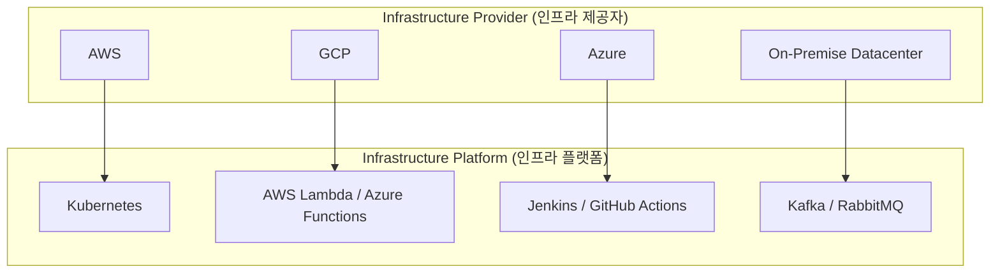
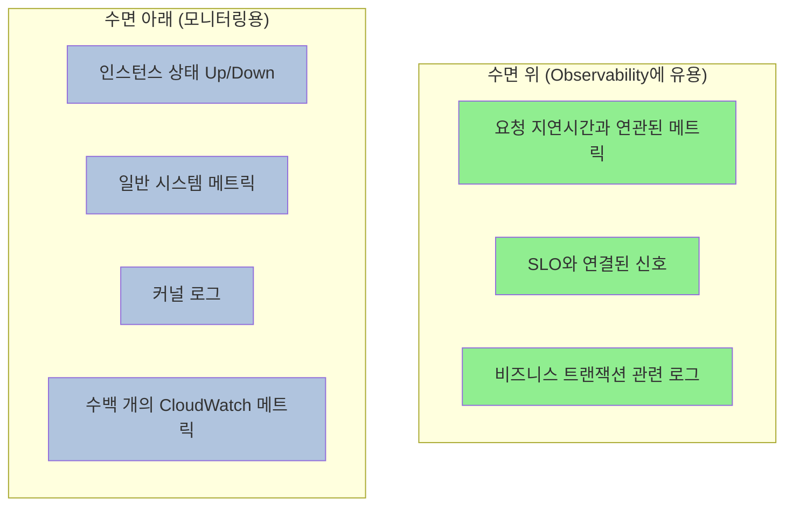
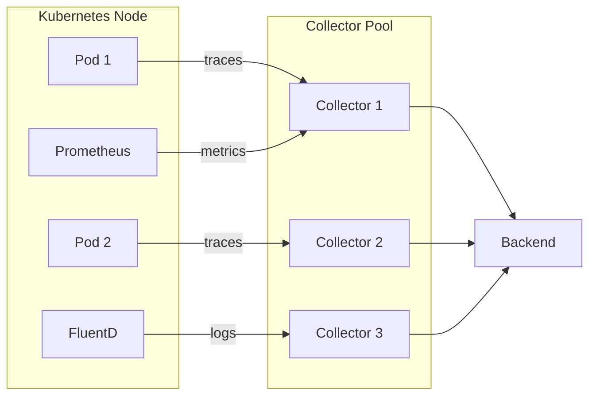
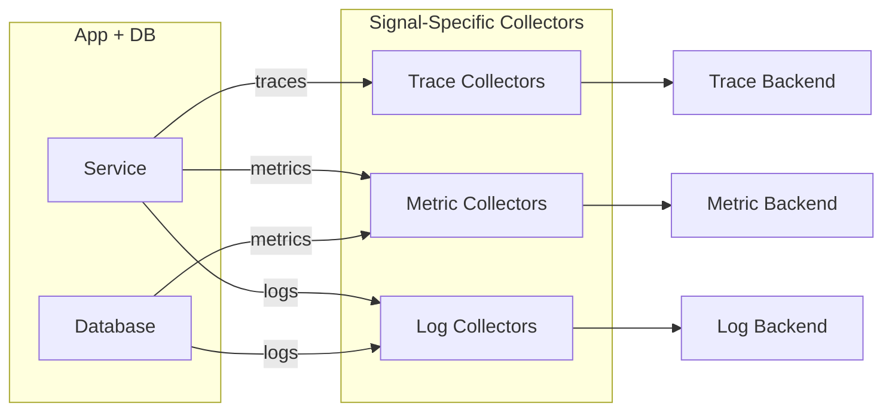
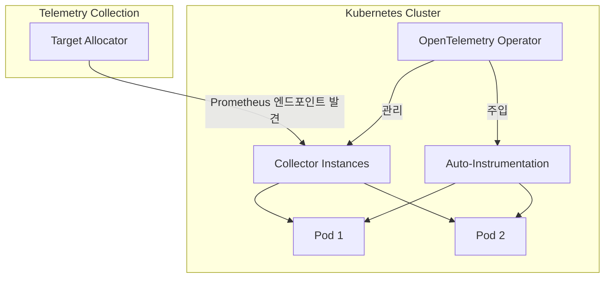
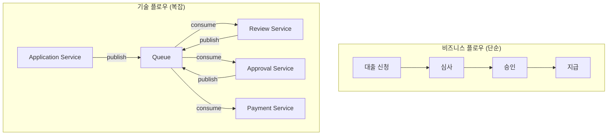
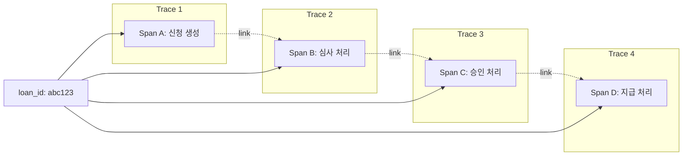

# Chapter 7: 인프라 관측 (Observing Infrastructure)

---

### 📌 핵심 요약
> 인프라 Observability는 단순한 모니터링과 다르다. 핵심 차이는 **컨텍스트**다. CPU 사용량 수치 자체는 의미가 없지만, 이를 특정 요청이나 서비스와 연결하면 문제 해결에 결정적인 단서가 된다. OpenTelemetry Collector를 활용해 클라우드 메트릭/로그를 수집하고, Kubernetes는 Operator와 Target Allocator로, 서버리스는 Lambda Layer로, 비동기 워크플로우는 Span Links와 커스텀 Correlation ID로 관측한다. 인프라 Observability 전략은 반드시 **목표를 먼저 정의**하고 시작해야 한다.

---

### 🎯 학습 목표
- 인프라 Observability와 모니터링의 차이(컨텍스트)를 이해한다
- 인프라 Provider와 Platform의 차이를 구분할 수 있다
- OpenTelemetry Collector를 활용한 클라우드 메트릭/로그 수집 전략을 안다
- Kubernetes 환경에서 OpenTelemetry 배포 패턴을 이해한다
- 서버리스와 비동기 워크플로우의 Observability 전략을 설명할 수 있다

---

### 📖 본문 정리

#### 1. 인프라 Observability란?

> *"우리는 컴퓨터 시스템을 도시처럼 짓는다: 시간이 지나면서, 계획 없이, 폐허 위에."* — Ellen Ullman

**모니터링 vs Observability**: 차이는 **컨텍스트**다

```
모니터링:
  "이 Kubernetes 노드의 메모리 사용량이 80%야"
  → 그래서 뭐?

Observability:
  "이 Kubernetes 노드의 메모리 사용량이 80%인데,
   이게 payment-service의 특정 API 호출 급증과 연관되어 있어"
  → 조치 가능!
```

##### Provider vs Platform



| 구분 | 설명 | 예시 |
|------|------|------|
| **Provider** | 인프라의 실제 "소스" | AWS, GCP, Azure, 데이터센터 |
| **Platform** | Provider 위의 추상화된 관리 서비스 | Kubernetes, Lambda, Jenkins |

##### 인프라 신호를 포함해야 할까?

두 가지 질문으로 판단:

1. 인프라 신호와 애플리케이션 신호 사이에 **컨텍스트**(hard/soft)를 수립할 수 있는가?
2. 이 시스템을 이해하는 것이 **비즈니스/기술 목표** 달성에 도움이 되는가?

> 둘 다 **No**라면 → Observability가 아닌 **별도 모니터링** 도구 사용

---

#### 2. 클라우드 Provider 관측

##### 클라우드 텔레메트리 빙산 (Cloud Telemetry Iceberg)



**핵심 질문**: "어떤 텔레메트리 데이터가 Observability에 가치 있는가?"

##### 클라우드 메트릭/로그 수집 3원칙

| 원칙 | 설명 |
|------|------|
| **Semantic Conventions 사용** | 인프라와 애플리케이션 메트릭에 동일한 키/값 사용 → soft context 구축 |
| **기존 통합 활용** | Collector의 풍부한 receiver 플러그인 생태계 활용 |
| **데이터에 목적을 가져라** | $10 컴퓨팅 작업이 $150 로깅 비용을 발생시킬 수 있다! |

##### Push vs Pull 메트릭

```
Push 방식: 호스트 → 중앙 서버
  └── OTLP는 Push 방식만 지원

Pull 방식: 중앙 서버 → 호스트 (Prometheus 스타일)
  └── Collector가 스크래핑
```

> OTLP를 선택하면 메트릭은 항상 **Push**

---

#### 3. Collector 배포 아키텍처

##### Gateway 패턴



##### 신호별 분리 패턴 (권장)



**장점**: 신호별로 독립적 스케일링 가능

---

#### 4. Metamonitoring (Collector 자체 모니터링)

##### 주요 Collector 메트릭

| 메트릭 | 의미 |
|--------|------|
| `otelcol_processor_refused_spans` | 거부된 span 수 → 높으면 스케일 업 |
| `otelcol_processor_refused_metric_points` | 거부된 메트릭 포인트 수 |
| `queue_size` vs `queue_capacity` | 차이가 작으면 수신 서비스 바쁨 |

##### Collector 용량 계획 규칙

```
1. 호스트/워크로드별로 ballast 크기 실험
   └── 스트레스 테스트로 상한선 파악

2. 스크래핑 충돌(scrape collision) 방지
   └── 다음 스크랩이 시작되기 전에 현재 스크랩 완료

3. 무거운 처리는 파이프라인 후반으로
   └── Collector 메모리/컴퓨트 사용량 감소

4. 약간 오버프로비저닝이 텔레메트리 손실보다 낫다!
```

##### 컨테이너 내 Collector 메모리 설정

```yaml
# 컨테이너 메모리 제한의 2의 배수 사용
# 예: 1GB 컨테이너
memory_limit: 800MB    # 80%
ballast: 400MB         # 40%

# ballast는 GC 부담 감소, 안정적 운영
```

> **Note**: Ballast 익스텐션은 `GOMEMLIMIT`, `GOGC` 환경변수로 대체될 예정

---

#### 5. Kubernetes 플랫폼 관측

##### OpenTelemetry Operator



##### Kubernetes 텔레메트리 수집 방식

| 방식 | 설명 | 언제 사용 |
|------|------|----------|
| **Target Allocator** | Prometheus 엔드포인트 자동 발견, 스크랩 작업 분산 | 기존 Prometheus 사용 환경 |
| **Receivers** | k8sclusterreceiver, k8seventsreceiver, kubeletstatsreceiver | 신규 순수 OpenTelemetry 환경 |

> 두 방식 중 하나 선택 권장 (혼용 시 중복 가능)

##### Kubernetes 애플리케이션 배포 팁

```
1. Sidecar Collector 사용
   └── 각 Pod에 Collector sidecar
   └── 메모리 압력 감소, 깔끔한 셧다운

2. 신호별 Collector 분리
   └── Trace/Metric/Log 각각 독립 스케일링
   └── 사용 패턴에 따라 앱별/서비스별 분리 가능

3. 텔레메트리 생성과 설정 분리
   └── Redaction/Sampling은 Collector에서
   └── 프로세스 내 하드코딩 X → 재배포 없이 조정
```

---

#### 6. 서버리스 플랫폼 관측

##### 서버리스 Observability 핵심 메트릭

| 메트릭 | 설명 |
|--------|------|
| **Invocation Time** | 함수 실행 시간 |
| **Resource Usage** | 메모리/컴퓨트 사용량 |
| **Cold Start Time** | 최근 미사용 후 시작 시간 |

##### 서버리스 계측 전략

```
옵션 1: OpenTelemetry Lambda Layer
├── 장점: 편리한 trace/metric 캡처
└── 단점: 성능 오버헤드 발생

옵션 2: 수동 계측
├── 함수가 telemetry export를 기다리도록 구현
├── span 기록은 라이브러리에 제어 반환 전에 중지
├── 변하지 않는 문자열/속성은 캐싱
└── 함수 전용 Collector를 "가까이" 배치
```

##### 복잡하지 않은 Lambda라면?

```
대안: Lambda를 직접 tracing 하지 않고 헤더만 전달
├── 호출 서비스와 속성/span 이벤트로 연결
├── Lambda 서비스 로그로 세부 정보 확인
└── 간단한 경우 이 방식이 더 효율적
```

---

#### 7. 비동기 워크플로우 관측

##### 문제: 은행 대출 트랜잭션



**문제점**:
- 트랜잭션이 어디서 끝나는지 불명확
- 여러 서비스가 단일 레코드를 처리
- 인간 개입이 필요할 수 있음

##### 해결: Span Links + Custom Correlation ID



**두 가지 연결 방식**:

| 방식 | 설명 | 장점 |
|------|------|------|
| **Custom Correlation ID** | Baggage로 전파되는 고유 속성 (예: `loan_id`) | 간단, 모든 span에 동일한 ID |
| **Span Links** | 명시적 parent-child가 아닌 인과관계 연결 | 큐 대기 시간 계산 가능 |

##### Span Links 활용

```go
// Consumer 서비스에서
// 수신한 span context를 parent가 아닌 link로 처리
ctx, span := tracer.Start(ctx, "process-loan",
    trace.WithLinks(trace.LinkFromContext(incomingCtx)),
)
```

> **주의**: 분석 도구가 link 관계를 역방향으로 탐색할 수 있어야 함

##### 비동기 워크플로우 최적화

```
Collector 필터/샘플러 활용:
├── 관심 있는 질문에 맞게 서브트레이스 필터링
├── Span → Metric 변환으로 히스토그램 생성
├── Parent Trace ID를 메트릭 속성으로 포함
└── 루트 span은 유지, 자식 span은 메트릭화 후 삭제

예: Fan-out/Fan-in 작업
├── 모든 자식 span을 완료 시간 히스토그램으로 변환
├── 자식 span 자체는 삭제
└── 루트 span과 카운트/지연시간 정보만 유지
```

---

### 🔍 심화 학습

#### Collector Builder

프로덕션 환경에서는 Collector Builder를 사용해 커스텀 빌드 생성 권장:

```bash
# Collector Builder 설치
go install go.opentelemetry.io/collector/cmd/builder@latest

# manifest.yaml 작성
builder --config manifest.yaml
```

필요한 receiver, processor, exporter만 포함하여:
- 바이너리 크기 감소
- 공격 표면 축소
- 커스텀 모듈 추가 용이

**출처**: [OpenTelemetry Collector Builder](https://opentelemetry.io/docs/collector/custom-collector/)

#### Kubernetes 클러스터 모니터링 Receiver 목록

| Receiver | 수집 대상 |
|----------|----------|
| `k8sclusterreceiver` | 클러스터 레벨 메트릭 (노드, Pod, 배포 상태) |
| `k8seventsreceiver` | Kubernetes 이벤트 (경고, 에러) |
| `k8sobjectsreceiver` | Kubernetes 오브젝트 변경 |
| `kubeletstatsreceiver` | Pod 레벨 메트릭 (CPU, 메모리, 네트워크) |

**출처**: [OpenTelemetry Collector Contrib Receivers](https://github.com/open-telemetry/opentelemetry-collector-contrib/tree/main/receiver)

#### Cardinality Explosion 관리

```yaml
# Collector config: 메트릭 속성 필터링
processors:
  attributes:
    actions:
      - key: user_id
        action: delete  # 고유 ID 제거로 cardinality 감소
      - key: http.status_code
        action: hash    # 또는 해싱

  filter/metrics:
    metrics:
      include:
        match_type: strict
        metric_names:
          - http_request_duration_seconds
          - http_requests_total
```

**출처**: [OpenTelemetry Collector Processors](https://opentelemetry.io/docs/collector/configuration/#processors)

---

### 💡 실무 적용 포인트

1. **목표 먼저 정의**: "어떤 질문에 답하고 싶은가?"를 먼저 결정하고 인프라 신호 수집
2. **모든 것을 수집하지 마라**: $10 컴퓨팅 작업에 $150 로깅 비용이 발생할 수 있다
3. **Semantic Conventions 일관성**: 인프라와 애플리케이션 메트릭에 동일한 키 사용
4. **신호별 Collector 분리**: Trace, Metric, Log 처리는 리소스 프로필이 다르다
5. **Sidecar 패턴 활용**: Kubernetes에서 각 Pod에 Collector sidecar로 메모리 압력 감소
6. **Metamonitoring 필수**: Collector 자체 메트릭으로 용량 문제 조기 발견
7. **비동기는 Span Links**: 큐 기반 워크플로우는 parent-child 대신 link 관계 사용
8. **서버리스는 선택적**: Lambda를 직접 tracing 하지 않고 헤더 전달만으로 충분할 수 있다

---

### ✅ 정리 체크리스트

- [ ] 인프라 Observability와 모니터링의 핵심 차이(컨텍스트)를 설명할 수 있다
- [ ] Provider(AWS, GCP)와 Platform(Kubernetes, Lambda)의 차이를 구분한다
- [ ] "클라우드 텔레메트리 빙산" 개념을 이해한다
- [ ] Collector Gateway 패턴과 신호별 분리 패턴의 차이를 안다
- [ ] Metamonitoring의 중요성과 주요 메트릭을 이해한다
- [ ] Kubernetes에서 Target Allocator와 Receiver 방식의 차이를 안다
- [ ] 서버리스 Observability의 핵심 메트릭(invocation time, cold start)을 이해한다
- [ ] 비동기 워크플로우에서 Span Links와 Custom Correlation ID 사용법을 안다
- [ ] "목표를 먼저 정의하라"는 원칙을 이해한다

---

### 🔗 참고 자료

- Ellen Ullman, quoted in *Kill It with Fire* by Marianne Bellotti (No Starch Press, 2021)
- [OpenTelemetry Collector Builder](https://opentelemetry.io/docs/collector/custom-collector/)
- [OpenTelemetry Collector Configuration](https://opentelemetry.io/docs/collector/configuration/)
- [OpenTelemetry Operator for Kubernetes](https://opentelemetry.io/docs/k8s/operator/)
- [OpenTelemetry Lambda Layer](https://opentelemetry.io/docs/faas/lambda/)
- Ross Engers, "Go Memory Ballast" (blog post on Golang memory management)
- [kube-state-metrics](https://github.com/kubernetes/kube-state-metrics)
- [OpenTelemetry Collector Contrib Receivers](https://github.com/open-telemetry/opentelemetry-collector-contrib)
