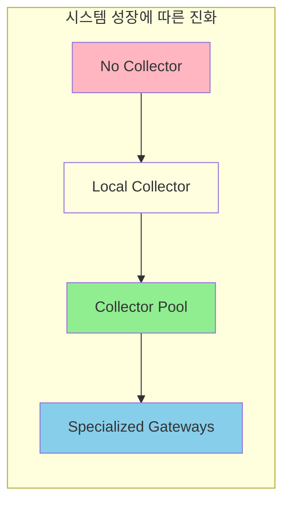
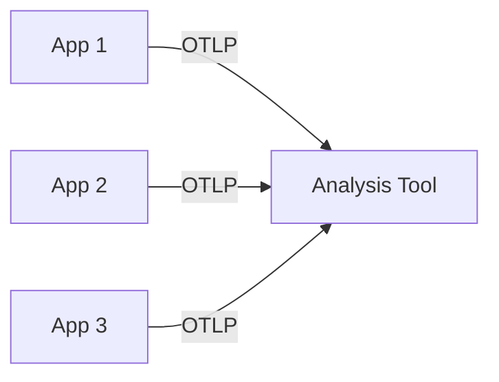
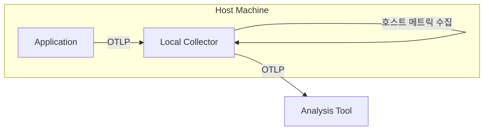
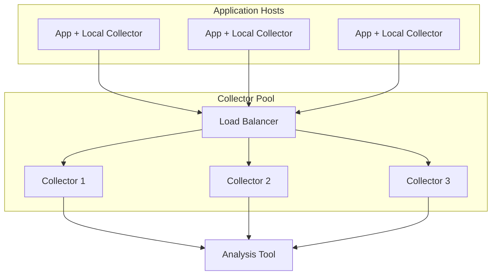
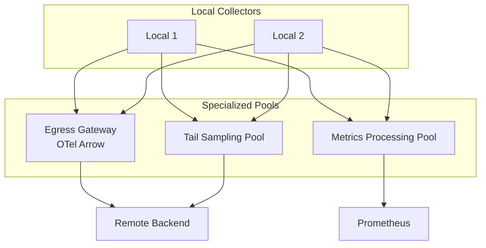
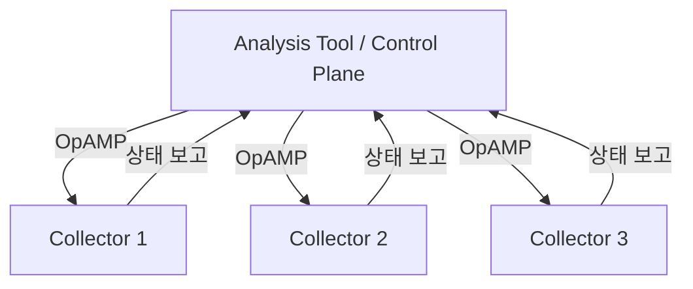
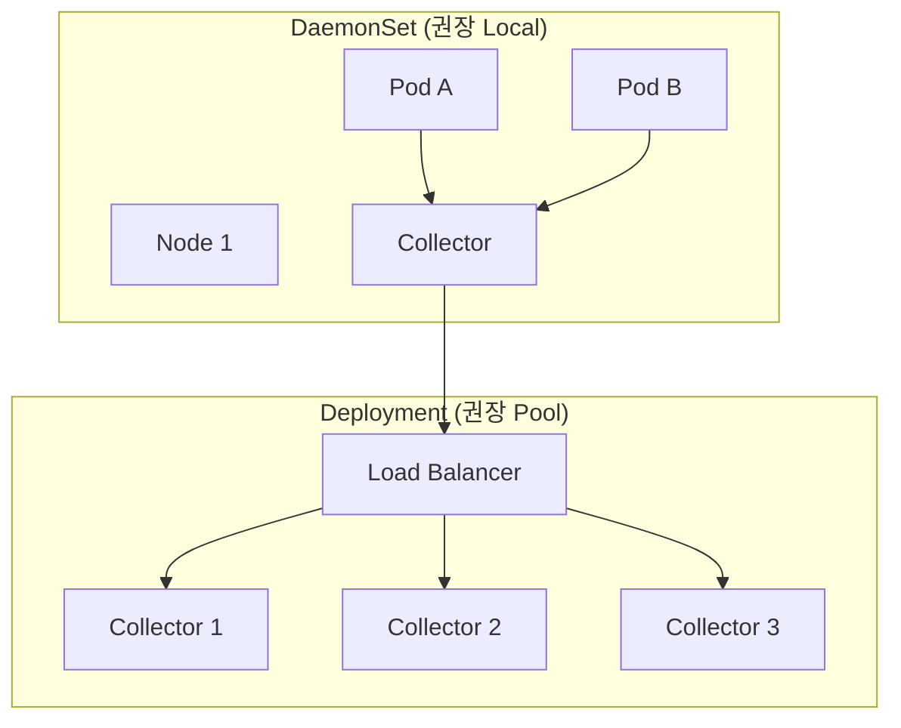

# Chapter 8: 텔레메트리 파이프라인 설계 (Designing Telemetry Pipelines)

---

### 📌 핵심 요약
> 텔레메트리 파이프라인은 시스템 규모에 따라 진화한다. "No Collector → Local Collector → Collector Pool → 전문화된 Gateway"로 발전하며, 각 단계마다 백프레셔 관리, 리소스 분리, 배포 독립성이 향상된다. 파이프라인 운영의 핵심은 **필터링**(불필요한 데이터 제거), **샘플링**(통계적 대표 집합 선택), **변환**(속성 정규화)이다. 샘플링은 위험하므로 비용이 심각해지기 전까지 피하고, 분석 도구가 샘플링을 제어하는 OpAMP 같은 자동화가 미래다. "텔레메트리가 드롭되면, Observability를 잃는다."

---

### 🎯 학습 목표
- 텔레메트리 파이프라인의 4가지 토폴로지를 이해하고 언제 사용하는지 안다
- Local Collector의 이점(호스트 메트릭, 크래시 데이터 보호, 설정 분리)을 설명할 수 있다
- Collector Pool의 역할(백프레셔 관리, 리소스 격리, 독립 배포)을 이해한다
- 필터링과 샘플링의 차이, 각 샘플링 전략(head/tail/storage-based)을 구분한다
- 텔레메트리 비용 관리 전략을 알고 적용할 수 있다

---

### 📖 본문 정리

#### 1. 파이프라인 토폴로지 진화

> *"계획은 쓸모없지만, 계획하는 것은 필수불가결하다."* — 드와이트 D. 아이젠하워



---

#### 2. No Collector (Collector 없음)



**언제 적합한가?**
- 텔레메트리 처리가 거의 필요 없을 때
- 시스템이 단순하거나 새로 시작할 때
- 호스트 메트릭이 다른 채널(클라우드 제공자)로 수집될 때

**한계**: 호스트 메트릭(RAM, CPU, 네트워크) 수집 불가

**왜 호스트 메트릭 수집이 어려운가?**
- 애플리케이션은 자신의 프로세스 내부만 볼 수 있음
- 같은 호스트에서 실행 중인 다른 프로세스의 리소스 사용량을 알기 어려움
- 호스트 전체의 CPU/메모리 사용률을 정확히 측정하려면 호스트 레벨 접근 필요
- 애플리케이션 시작 전의 호스트 상태 정보는 수집 불가능

---

#### 3. Local Collector (로컬 Collector)



##### Local Collector의 3가지 이점

| 이점 | 설명 |
|------|------|
| **호스트 메트릭 수집** | 애플리케이션 런타임에서 호스트 메트릭 수집은 어렵고 부정확. Collector는 호스트 레벨에서 실행되어 호스트 전체의 CPU, 메모리, 네트워크 메트릭을 정확히 수집 가능 |
| **환경 리소스 수집** | 클라우드/K8s API 호출을 Collector에 위임 → 앱 시작 지연 방지. DaemonSet으로 항상 실행되어 Pod 실행 전 정보(네임스페이스, 서비스 정보 등)를 미리 수집. k8sattributes processor가 텔레메트리의 Resource에 K8s 메타데이터를 보강 |
| **크래시 시 데이터 손실 방지** | 작은 배치로 빠르게 로컬로 내보내고, Collector가 큰 배치로 원격 전송. SDK는 애플리케이션과 강결합되어 크래시 위험이 있으므로 빠른 대피가 필요. Collector는 독립 실행되어 안정적으로 큰 배치로 재구성 가능 |

##### 크래시 시 데이터 손실 방지 패턴

```
문제:
├── 텔레메트리는 보통 배치로 export
├── 앱 크래시 시 미전송 배치 손실
└── 크래시 조사에 가장 중요한 로그가 사라짐!

해결 (이중 배치 전략):
├── SDK: 매우 작은 배치 크기, 짧은 타임아웃
│   └── 애플리케이션과 강결합 → 크래시 전 빠른 대피 필요
│   └── 로컬로 빠르게 전송 (같은 호스트 = 빠르고 안정적)
└── Local Collector: 원격 전송에 적합한 큰 배치로 재구성
    └── 독립 실행 → 안정적으로 큰 배치 구성 가능
    └── 네트워크 효율성 확보

핵심 원칙: 책임 분리
- SDK: 빠른 대피 (같은 호스트 = 빠르고 안정적)
- Collector: 효율적인 원격 전송
```

##### SDK 설정 단순화

```yaml
# Local Collector 사용 시 SDK 설정이 단순해짐
exporters:
  otlp:
    endpoint: localhost:4317  # 표준 로컬 주소
    # 추가 exporter나 플러그인 불필요

processors:
  batch:
    timeout: 1s        # 짧은 타임아웃
    send_batch_size: 100  # 작은 배치
```

> **팁**: 조직의 기본 SDK 설정을 라이브러리로 패키징하여 모든 앱에서 한 줄로 사용

---

#### 4. Collector Pool



##### Collector Pool의 3가지 이점

| 이점 | 설명 |
|------|------|
| **백프레셔 관리** | 로드 밸런서가 트래픽 스파이크를 분산, 메모리 버퍼 확장 |
| **리소스 격리** | 처리 작업이 애플리케이션과 리소스 경쟁하지 않음 |
| **독립 배포** | 인프라팀이 앱팀과 조율 없이 Collector 관리 가능. 노드 종속성 제거로 특정 노드에 종속되지 않아 위험 부담 감소 |

##### 백프레셔(Backpressure)란?

```
생산자가 소비자보다 빠르게 데이터를 보낼 때 발생하는 압력

시나리오:
├── 트래픽 급증 → 텔레메트리 폭발
├── Local Collector 버퍼 가득 참
├── 메모리 부족 방지를 위해 데이터 드롭 시작
└── Observability 손실!

Local Collector의 한계:
├── 각 노드에 하나씩만 존재 → 메모리 버퍼 제한적
├── 트래픽 급증 시 버퍼 오버플로우
└── 여러 Local Collector가 각각 원격 전송 → 네트워크 경쟁

Collector Pool 해결책:
├── 로드 밸런서로 스파이크 분산
├── 여러 Collector에 메모리 버퍼 분산
│   └── 일시적인 트래픽 스파이크 흡수 가능
├── OTLP는 stateless → 분산 버퍼 간단
└── 독립 배포 가능 → 노드 종속성 제거

주의: Collector Pool도 최종 분석 도구로 가는 네트워크 병목은 해결하지 못함
      하지만 처리 단계에서의 버퍼 역할로 Local Collector의 메모리 부족 방지
```

---

#### 5. 전문화된 Collector Pool (Gateways)



##### 전문화가 필요한 경우

| 이유 | 설명 |
|------|------|
| **바이너리 크기 축소** | FaaS 환경에서 다운로드 시간/비용 감소 (예: Lambda Layer) |
| **리소스 소비 예측** | 두 작업의 리소스 패턴이 다르면 분리 |
| **Tail-based Sampling** | 같은 trace의 모든 span이 같은 인스턴스에 필요 |
| **백엔드별 워크로드** | Prometheus용 메트릭 처리 vs Jaeger용 트레이스 처리 분리 |
| **Egress 비용 절감** | OTel Arrow 같은 고압축 프로토콜 사용 |

##### OTel Arrow 프로토콜

```
OTel Arrow:
├── OTLP보다 훨씬 높은 압축률
├── 대용량 데이터의 지속적 전송에 최적화
├── Stateful 프로토콜 → 로드 밸런서와 안 맞음
└── 고처리량 gateway의 egress 전용

언제 사용:
├── ✅ 대량 데이터를 안정적 연결로 장시간 전송
├── ❌ 로드 밸런서 뒤의 Collector Pool
└── ❌ 적은 양의 데이터를 보내는 애플리케이션
```

---

#### 6. OpAMP: 미래의 Collector 관리



**Open Agent Management Protocol (OpAMP)**:
- Collector를 제어 평면으로 관리하는 프로토콜
- 설정 변경, 바이너리 업데이트를 앱 배포 없이 롤아웃
- Collector가 로드/상태 메트릭을 보고
- **분석 도구가 샘플링을 직접 제어** → 최적 설정 자동화

> 현재(2024) 개발 중. 프로덕션 준비되면 반드시 활용

---

#### 7. 파이프라인 운영: 필터링 vs 샘플링

##### 필터링 (Filtering)

```yaml
# 특정 데이터를 완전히 제거
processors:
  filter:
    spans:
      exclude:
        match_type: regexp
        attributes:
          - key: http.target
            value: "^/health.*"  # health check 제거
```

**목적**: 절대 사용하지 않을 데이터 제거
**예시**: `/health`, `/healthz` 엔드포인트 트레이스

**필터링의 특징**:
- 조건에 맞는 데이터를 **완전히 제거**
- 결정적(deterministic): 같은 조건이면 항상 같은 결과
- 안전함: 사용하지 않을 데이터만 제거하므로 정보 손실 위험 낮음

##### 샘플링 (Sampling)

| 전략 | 시점 | 설명 | 주의점 |
|------|------|------|--------|
| **Head-based** | 트레이스 시작 시 | 1/10, 1/100 등 확률적 결정 | 중요한 트레이스 놓칠 수 있음. 에러 여부를 모르는 상태에서 샘플링하므로 에러 트레이스도 비율대로 손실 |
| **Tail-based** | 트레이스 완료 후 | 에러 포함, 특정 사용자 등 조건부 유지 | 리소스 많이 소모, 같은 인스턴스 필요. 모든 span을 트레이스 완료까지 메모리에 유지해야 함 |
| **Storage-based** | 분석 도구에서 | 1주는 100% 저장 → 이후 샘플만 장기 보관 | 전송 비용은 안 줄어듦. 저장 비용만 절감 |

**샘플링의 특징**:
- 데이터의 **일정 비율만 선택**
- 비결정적(non-deterministic): 같은 조건이어도 다른 결과 가능
- 위험함: 중요한 에러나 문제를 놓칠 수 있음

##### 샘플링은 위험하다

```
❌ 잘못된 샘플링의 위험:

Head-based로 1% 샘플링:
├── 평균 지연시간? → OK (통계적으로 정확)
├── 희귀한 에러? → 놓칠 수 있음!
│   └── 에러 트레이스도 1%만 남음 → 중요한 문제 조사 불가
└── 디버깅에 필요한 트레이스? → 사라짐!

Tail-based의 비용:
├── 모든 span을 같은 Collector로 라우팅 필요
│   └── 같은 trace의 모든 span이 같은 인스턴스에 필요
├── 트레이스 완료까지 메모리에 유지
│   └── 결정 전에 모든 데이터를 수집·보관해야 함
├── 로드 밸런싱과 충돌
└── 네트워크 egress보다 더 비쌀 수 있음!

핵심 문제:
- 샘플링은 통계적 대표성은 유지하지만, 중요한 개별 사례를 놓칠 수 있음
- "Observability를 잃는다" = 문제 조사에 필요한 데이터가 없어짐
```

> **권장**: egress/storage 비용이 심각해지기 전까지 샘플링 피하기. 필터링, 불필요한 계측 제거, OTel Arrow 같은 압축 프로토콜이 더 안전

---

#### 8. 변환 (Transformation)

##### OTTL (OpenTelemetry Transformation Language)

```yaml
processors:
  transform:
    error_mode: ignore
    log_statements:
      - context: log
        statements:
          # nginx 로그의 "request"를 semantic convention으로 변환
          - set(attributes["http.request.method"], attributes["request"])
          - delete_key(attributes, "request")
```

##### 변환의 목적

**핵심 목적**: 통일된 OpenTelemetry semantic convention으로 데이터 정규화

- 다양한 소스(nginx, 레거시 시스템, 다른 버전)의 데이터를 OpenTelemetry 형식으로 통일
- 분석 도구가 일관된 형식의 데이터를 받을 수 있도록 보장
- 예: nginx 로그의 `request` → `http.request.method`로 변환

##### 변환 유형

| 유형 | 설명 |
|------|------|
| **속성 수정** | 민감 정보 제거/난독화, 합성 속성 생성 |
| **스키마 변환** | 버전 간 semantic convention 일관성 확보. 레거시 시스템의 비표준 속성을 표준으로 변환 |
| **속성 추가** | k8sattributes로 Kubernetes 메타데이터 추가. DaemonSet으로 미리 수집한 K8s 정보를 Resource에 보강 |
| **신호 변환** | Span → Metric, Log → Metric 변환 |
| **Redaction** | 민감 정보 삭제 (Collector 전용). 중앙 집중식 관리로 애플리케이션 코드 변경 없이 처리 |

##### 변환 순서 주의

```
Filter → Transform → Sample → Export

이유:
├── 일부 processor는 sampling이 제거하는 context 객체 필요
├── 일부 sampling 알고리즘은 transform이 추가하는 속성 필요
└── 순서가 잘못되면 데이터 손실 또는 에러
```

---

#### 9. Kubernetes에서 Collector 배포

##### OpenTelemetry Kubernetes Operator 배포 유형

| 배포 유형 | 용도 | 특징 |
|----------|------|------|
| **DaemonSet** | 모든 노드에 Collector | 노드의 모든 Pod이 공유, 효율적. 노드 생성 시 자동 배포되어 애플리케이션보다 먼저 실행 가능 |
| **Sidecar** | 모든 컨테이너에 Collector | Pod별 격리, 더 많은 리소스 |
| **Deployment** | Collector Pool (stateless) | 대부분의 설정에 권장 |
| **StatefulSet** | Collector Pool (stateful) | 특별한 경우에만 필요 |



##### Auto-instrumentation 주입

```yaml
# Operator가 자동 계측을 Pod에 주입
apiVersion: opentelemetry.io/v1alpha1
kind: Instrumentation
metadata:
  name: my-instrumentation
spec:
  java:
    image: ghcr.io/open-telemetry/opentelemetry-operator/autoinstrumentation-java:latest
```

**지원 언어**: Apache HTTPD, .NET, Go, Java, nginx, Node.js, Python

---

#### 10. 텔레메트리 비용 관리

##### 미사용 텔레메트리 발견

```
1. 대시보드/쿼리와 수집 데이터 비교
   └── Grafana 쿼리 분석 → 사용되지 않는 메트릭 식별

2. TTL 설정
   └── 일정 시간 접근 없으면 자동 삭제

3. 재집계 (Reaggregation)
   └── 여러 K8s 메트릭 → 속성 결합으로 단일 메트릭
   └── 수십 개 로그 라인 → 단일 메트릭으로 변환
```

##### 비용 vs 가치 Trade-off

```
"고카디널리티가 비싸다" → 사실

하지만:
├── 특정 사용자의 경험을 이해하려면?
├── user_id 같은 고유 값이 필요
└── 비용이 아니라 가치로 판단해야

해결책:
├── 히스토그램 메트릭으로 정확한 비율 확보 → "빠른" trace 샘플링
├── 로그 중복 제거 → 메트릭 또는 구조화된 로그로 변환
└── 순간 메트릭을 span 속성으로 포함
```

---

### 🎓 학습 과정에서 발견한 핵심 원칙

#### 1. 필터링 vs 샘플링의 본질적 차이

**필터링**:
- 조건에 맞는 데이터를 **완전히 제거**
- 결정적(deterministic): 같은 조건이면 항상 같은 결과
- 안전함: 사용하지 않을 데이터만 제거하므로 정보 손실 위험 낮음

**샘플링**:
- 데이터의 **일정 비율만 선택**
- 비결정적(non-deterministic): 같은 조건이어도 다른 결과 가능
- 위험함: 중요한 에러나 문제를 놓칠 수 있음
- 통계적 대표성은 유지하지만, 개별 사례를 놓칠 수 있음

**핵심**: "Observability를 잃는다" = 문제 조사에 필요한 데이터가 없어짐

#### 2. Local Collector의 이점과 설계 원칙

**호스트 메트릭 수집**:
- 애플리케이션은 자신의 프로세스 내부만 볼 수 있음
- Collector는 호스트 레벨에서 실행되어 호스트 전체 메트릭 수집 가능

**K8s 정보 수집**:
- DaemonSet으로 항상 실행 → 애플리케이션보다 먼저 시작
- Pod 실행 전 정보(네임스페이스, 서비스 정보 등)를 미리 수집
- k8sattributes processor가 텔레메트리의 Resource에 메타데이터 보강
- 애플리케이션 시작 지연 방지

**크래시 시 데이터 손실 방지**:
- **책임 분리 원칙**: SDK와 Collector의 역할 분리
  - SDK: 애플리케이션과 강결합 → 작은 배치, 짧은 타임아웃으로 빠른 대피
  - Collector: 독립 실행 → 안정적으로 큰 배치로 재구성
- 같은 호스트 = 빠르고 안정적인 전송
- 네트워크 효율성 확보

#### 3. Collector Pool의 역할과 한계

**해결하는 것**:
- Local Collector의 메모리 부족 방지 (버퍼 분산)
- 일시적인 트래픽 스파이크 흡수
- 노드 종속성 제거 (독립 배포 가능)
- 트래픽에 따른 유연한 확장

**해결하지 못하는 것**:
- 최종 분석 도구로 가는 네트워크 병목
- 분석 도구 자체의 처리 용량 한계

**핵심**: Collector Pool은 처리 단계에서의 버퍼 역할. Local Collector의 메모리 부족을 방지하지만, 최종 병목은 여전히 존재할 수 있음

#### 4. 변환의 목적

**핵심 목적**: 통일된 OpenTelemetry semantic convention으로 데이터 정규화

- 다양한 소스(nginx, 레거시 시스템, 다른 버전)의 데이터를 OpenTelemetry 형식으로 통일
- 분석 도구가 일관된 형식의 데이터를 받을 수 있도록 보장
- 중앙 집중식 관리로 애플리케이션 코드 변경 없이 처리 가능

---

### 🔍 심화 학습

#### Collector 보안 Best Practices

| 영역 | 권장 사항 |
|------|----------|
| **로컬 트래픽** | `0.0.0.0:4318` 대신 `localhost:4318` 바인딩 |
| **WAN 트래픽** | 항상 SSL/TLS 암호화 |
| **인증/인가** | TLS 인증서 기반 인증 설정 |
| **PII 보호** | redaction processor로 민감 정보 제거 |

**출처**: [OpenTelemetry Security Best Practices](https://opentelemetry.io/docs/collector/security/)

#### Stanza Log Processor

Collector의 로그 파싱은 [Stanza](https://github.com/observIQ/stanza)에 기반:
- 빠르고 효율적인 Go 기반 로그 처리
- 다양한 파싱 모듈 지원
- filelog receiver와 통합

**출처**: [Stanza GitHub Repository](https://github.com/observIQ/stanza)

#### Routing Processor 활용

```yaml
# 사용자 유형에 따라 다른 백엔드로 라우팅
processors:
  routing:
    from_attribute: user_type
    table:
      - value: paid
        exporters: [premium_backend]
      - value: free
        exporters: [basic_backend]
```

**활용 예시**:
- 유료/무료 사용자 텔레메트리 분리
- 특정 서비스의 트레이스만 별도 분석 도구로
- 작업 단계 수 히스토그램 생성을 위한 큐 라우팅

**출처**: [OpenTelemetry Collector Contrib - Routing Processor](https://github.com/open-telemetry/opentelemetry-collector-contrib/tree/main/processor/routingprocessor)

---

### 💡 실무 적용 포인트

1. **Local Collector부터 시작**: 대부분의 시스템에 좋은 시작점
2. **작은 배치로 빠르게 대피**: SDK에서 작은 배치 → Local Collector가 큰 배치로 재구성
   - SDK: 애플리케이션과 강결합 → 빠른 대피 필요
   - Collector: 독립 실행 → 안정적으로 큰 배치 구성
3. **SDK 설정 패키징**: 조직의 기본 설정을 라이브러리로 만들어 복사-붙여넣기로 적용
4. **필터링과 샘플링 구분**: 필터링은 안전하지만 샘플링은 위험. 필터링을 먼저 적용
5. **샘플링은 최후의 수단**: 필터링, 불필요한 계측 제거, 압축 프로토콜을 먼저 시도
6. **분석 도구 벤더와 상담**: 샘플링 구현 전 반드시 벤더/OSS 프로젝트와 상담
7. **변환 순서 주의**: Filter → Transform → Sample → Export
8. **Kubernetes는 DaemonSet + Deployment**: Local은 DaemonSet, Pool은 Deployment
   - DaemonSet: 노드마다 필요, 애플리케이션보다 먼저 실행
   - Deployment: 독립 배포, 트래픽에 따른 유연한 확장
9. **비용은 가치로 판단**: "비싸다"가 아니라 "필요한가?"로 결정
10. **변환의 목적 이해**: 통일된 semantic convention으로 정규화하는 것이 핵심

---

### ✅ 정리 체크리스트

- [ ] 4가지 파이프라인 토폴로지(No Collector, Local, Pool, Gateway)를 설명할 수 있다
- [ ] Local Collector의 3가지 이점을 나열할 수 있다
- [ ] 백프레셔(Backpressure)가 무엇이고 어떻게 관리하는지 안다
- [ ] Collector Pool이 해결하는 3가지 문제를 이해한다
- [ ] 필터링과 샘플링의 차이를 설명할 수 있다
- [ ] Head-based, Tail-based, Storage-based 샘플링의 차이를 안다
- [ ] 샘플링이 위험한 이유와 대안을 이해한다
- [ ] OTTL을 사용한 변환의 기본 개념을 안다
- [ ] Kubernetes에서 Collector 배포 유형(DaemonSet, Sidecar, Deployment)을 구분한다
- [ ] OpAMP가 해결하려는 문제를 이해한다
- [ ] 텔레메트리 비용 관리의 기본 원칙을 안다

---

### 🔗 참고 자료

- Dwight D. Eisenhower, quoted in Richard M. Nixon, *Six Crises* (1962)
- [OpenTelemetry Collector Configuration](https://opentelemetry.io/docs/collector/configuration/)
- [OpenTelemetry Collector Processors](https://github.com/open-telemetry/opentelemetry-collector-contrib/tree/main/processor)
- [OpAMP Specification](https://github.com/open-telemetry/opamp-spec)
- [OTel Arrow Protocol](https://github.com/open-telemetry/otel-arrow)
- [Stanza Log Processor](https://github.com/observIQ/stanza)
- [OpenTelemetry Kubernetes Operator](https://opentelemetry.io/docs/k8s/operator/)
- [OpenTelemetry Demo Load Generator](https://github.com/open-telemetry/opentelemetry-demo)
- [OpenTelemetry Lambda Layer](https://opentelemetry.io/docs/faas/lambda/)
