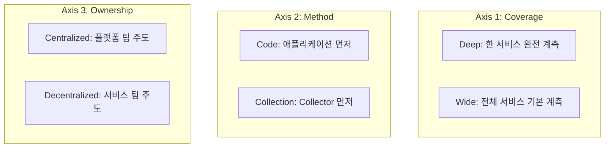
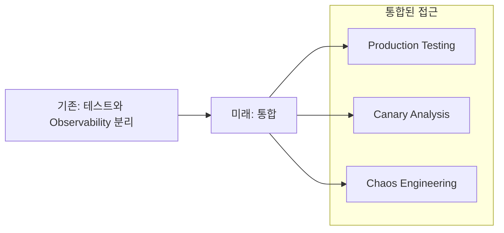

# Chapter 9: Observability 도입하기 (Rolling Out Observability)

---

### 📌 핵심 요약
> OpenTelemetry 도입에는 세 가지 축(Axis)이 있다: Deep vs Wide, Code vs Collection, Centralized vs Decentralized. 조직 상황에 따라 적절한 축 조합을 선택해야 한다. 도입 성공의 핵심은 "먼저 성공 사례를 만들고, 그 가치를 증명한 후 확장"하는 것이다. 미래의 Observability는 테스팅과의 통합, 그린 컴퓨팅, AI 모니터링으로 발전할 것이다.

---

### 🎯 학습 목표
- Observability 도입의 세 가지 축을 이해하고 조직에 맞는 전략을 선택할 수 있다
- 각 축의 장단점과 적합한 상황을 설명할 수 있다
- 실제 조직의 도입 사례를 통해 패턴을 파악할 수 있다
- OpenTelemetry Rollout Checklist를 활용할 수 있다
- Observability의 미래 방향을 이해한다

---

### 📖 본문 정리

#### 1. Observability 도입의 세 가지 축

> *"OpenTelemetry 도입의 가장 어려운 부분은 기술이 아니라 조직이다."*



---

#### 2. Axis 1: Deep vs Wide

##### Deep 접근법

**특징**: 하나의 서비스를 완전히 계측한 후 다음 서비스로 이동

**핵심 원칙**: "하나씩 완전히"
- 한 서비스를 100% 계측 → 완료 후 다음 서비스로 이동
- 도메인 특화 정보가 많을 때, 커스텀 계측이 많이 필요할 때 적합

**장점**:
- 빠르게 가치 증명 가능
- 학습과 반복이 쉬움
- 초기 투자 적음
- 한 서비스를 깊이 이해 가능

**단점**:
- 전체 시스템 가시성 확보 느림
- 서비스 경계에서 trace 끊김
- 분산 트레이싱의 진정한 가치를 늦게 실현

```
Deep 접근법:
서비스 A: ████████████ (100% 계측)
서비스 B: ░░░░░░░░░░░░ (0%)
서비스 C: ░░░░░░░░░░░░ (0%)

→ 한 서비스 완료 후 다음 서비스로
```

**적합한 상황**:
- 작은 팀, 적은 리소스
- 빠른 가치 증명 필요
- 학습 단계
- 도메인 특화 정보가 많은 서비스

**주의**: 조직 규모보다는 목표와 리소스가 더 중요. 대규모 조직도 Deep 접근법을 선택할 수 있음 (예: Farfetch)

##### Wide 접근법

**특징**: 모든 서비스에 기본 계측을 먼저 적용

**핵심 원칙**: "모두 기본적으로"
- 모든 서비스에 기본 계측(예: 30%) 먼저 적용 → 점진적 심화
- 공통된 요소의 정보를 수집할 때 적합

**장점**:
- 전체 시스템 가시성 빠르게 확보
- 서비스 간 상호작용 파악 용이
- 분산 트레이싱의 진정한 가치 실현
- 전체 시스템의 흐름을 빠르게 파악

**단점**:
- 초기 투자 많음
- 조정 비용 높음
- 각 서비스의 깊이 부족
- 도메인 특화 정보는 나중에 추가

```
Wide 접근법:
서비스 A: ████░░░░░░░░ (30% 계측)
서비스 B: ████░░░░░░░░ (30%)
서비스 C: ████░░░░░░░░ (30%)

→ 기본 계측 후 점진적 심화
```

**적합한 상황**:
- 대규모 조직
- 플랫폼 팀 존재
- 전체 시스템 가시성이 핵심 목표
- 공통된 요소의 정보 수집이 우선

**주의**: 조직 규모보다는 목표와 리소스가 더 중요. 소규모 조직도 Wide 접근법을 선택할 수 있음 (예: SaaS 스타트업)

---

#### 3. Axis 2: Code vs Collection

##### Code-first 접근법

**특징**: 애플리케이션 계측부터 시작

**장점**:
- 비즈니스 컨텍스트 풍부
- 개발자 참여 유도
- 맞춤형 메트릭 가능

**단점**:
- 인프라 가시성 부족
- 개발자 시간 필요
- 서비스별 일관성 어려움

```
Code-first:
1. 애플리케이션에 SDK 설치
2. 커스텀 span, 메트릭 추가
3. Collector 설정
4. 인프라 텔레메트리 추가
```

##### Collection-first 접근법

**특징**: Collector와 인프라 텔레메트리부터 시작

**장점**:
- 개발자 개입 최소
- 빠른 가시성 확보
- 인프라 문제 조기 발견

**단점**:
- 비즈니스 컨텍스트 부족
- 커스텀 계측 지연
- "표면적" 가시성만 확보

```
Collection-first:
1. Collector 인프라 구축
2. 인프라 텔레메트리 수집 (K8s, 호스트)
3. 자동 계측 적용
4. 커스텀 계측 추가
```

---

#### 4. Axis 3: Centralized vs Decentralized

##### Centralized 접근법

**특징**: 플랫폼/SRE 팀이 표준과 도구 제공

**장점**:
- 일관된 표준
- 규모의 경제
- 전문성 집중

**단점**:
- 병목 가능성
- 서비스 팀 자율성 제한
- 변경 속도 느림

```
Centralized:
              ┌─────────────────┐
              │  Platform Team  │
              │  (표준, 도구)    │
              └────────┬────────┘
        ┌──────────────┼──────────────┐
        ▼              ▼              ▼
   [Service A]    [Service B]    [Service C]
```

##### Decentralized 접근법

**특징**: 각 서비스 팀이 자체 계측 관리

**장점**:
- 빠른 반복
- 팀 자율성
- 도메인 전문성 활용

**단점**:
- 표준화 어려움
- 중복 노력
- 전체 시스템 일관성 부족

```
Decentralized:
   [Service A]    [Service B]    [Service C]
   (자체 계측)     (자체 계측)     (자체 계측)
        │              │              │
        └──────────────┼──────────────┘
                       ▼
              ┌─────────────────┐
              │   Shared Infra  │
              │   (Collector)   │
              └─────────────────┘
```

---

#### 5. 실제 도입 사례

##### 사례 1: 금융 서비스 (GraphQL API)

| 항목 | 선택 |
|------|------|
| 조직 규모 | 중소 (10개 서비스) |
| 축 선택 | Deep + Code + Decentralized |
| 시작점 | 핵심 GraphQL 서비스 |
| 결과 | 3개월 내 ROI 증명 |

**전략**:
1. 가장 문제가 많은 서비스 선택
2. 개발팀이 직접 계측
3. 성공 후 다른 팀에 전파

##### 사례 2: SaaS 스타트업

| 항목 | 선택 |
|------|------|
| 조직 규모 | 소규모 (1개 팀, 50개 서비스) |
| 축 선택 | Wide + Collection + Centralized |
| 시작점 | 자동 계측 + Collector |
| 결과 | 1주 내 전체 가시성 |

**전략**:
1. 플랫폼 팀이 Collector 인프라 구축
2. 모든 서비스에 자동 계측 적용
3. 필요한 서비스에 커스텀 계측 추가

##### 사례 3: eBay (대규모)

| 항목 | 선택 |
|------|------|
| 조직 규모 | 대규모 (수천 서비스) |
| 축 선택 | Wide + Collection + Centralized |
| 시작점 | Collector 인프라 |
| 결과 | 단계적 마이그레이션 성공 |

**핵심 교훈**:
> *"기존 텔레메트리를 Collector로 라우팅하고, 점진적으로 OpenTelemetry 네이티브로 전환"*

**학습 포인트**:
- 대규모 조직에서도 Wide 접근법이 효과적
- 기존 시스템과의 호환성 고려 필요
- 점진적 마이그레이션이 핵심

##### 사례 4: Farfetch

| 항목 | 선택 |
|------|------|
| 조직 규모 | 대규모 (다국적) |
| 축 선택 | Deep + Code + Centralized |
| 시작점 | 핵심 비즈니스 서비스 |
| 결과 | 표준화된 개발자 경험 |

**핵심 교훈**:
> *"플랫폼 팀이 SDK wrapper와 best practice 제공, 서비스 팀은 비즈니스 로직 계측에 집중"*

**학습 포인트**:
- 대규모 조직에서도 Deep 접근법 선택 가능
- Centralized + Deep 조합: 플랫폼 팀이 표준 제공, 서비스 팀은 비즈니스 로직에 집중
- 표준화된 개발자 경험이 핵심

##### 실제 사례의 공통 패턴

**성공 요소**:
1. **작게 시작**: 전체 시스템이 아닌 하나의 서비스/팀부터
2. **빠른 가치 증명**: 3개월 내 ROI 보여주기
3. **챔피언 발굴**: 열정적인 얼리 어답터
4. **인프라 먼저**: Collector, 백엔드는 미리 준비

**"기술이 아니라 조직"인 이유**:
- 기술은 표준화되어 있음 (OpenTelemetry)
- 진짜 어려운 것은: 팀 간 협조, 표준 수립, 문화 변화
- 성공은 기술보다 조직 변화 관리에 달려있음
- ADKAR 모델: 인식 → 욕구 → 지식 → 능력 → 강화

**축 선택의 핵심**:
- 조직 규모보다는 목표와 리소스가 더 중요
- Deep vs Wide: "하나씩 완전히" vs "모두 기본적으로"
- Code vs Collection: 비즈니스 컨텍스트 vs 인프라 가시성
- Centralized vs Decentralized: 일관성 vs 자율성

---

#### 6. OpenTelemetry Rollout Checklist

```
┌─────────────────────────────────────────────────────────────────┐
│                 OpenTelemetry 도입 체크리스트                    │
├─────────────────────────────────────────────────────────────────┤
│ □ 1. 목표 정의                                                   │
│    - 해결하려는 문제가 무엇인가?                                  │
│    - 성공의 기준은?                                              │
│                                                                  │
│ □ 2. 이해관계자 파악                                             │
│    - 누가 텔레메트리를 사용하는가?                                │
│    - 각 이해관계자의 요구사항은?                                  │
│                                                                  │
│ □ 3. 축 선택                                                     │
│    - Deep vs Wide?                                               │
│    - Code vs Collection?                                         │
│    - Centralized vs Decentralized?                               │
│                                                                  │
│ □ 4. 파일럿 서비스 선택                                          │
│    - 가치 증명이 쉬운 서비스                                      │
│    - 협조적인 팀                                                 │
│    - 너무 중요하지도, 너무 사소하지도 않은 서비스                   │
│                                                                  │
│ □ 5. 기술 스택 결정                                              │
│    - 백엔드 선택 (Jaeger, Tempo, 상용 등)                        │
│    - Collector 배포 전략                                         │
│    - 샘플링 전략                                                 │
│                                                                  │
│ □ 6. 표준 수립                                                   │
│    - 네이밍 컨벤션                                               │
│    - 필수 속성 목록                                              │
│    - 에러 처리 패턴                                              │
│                                                                  │
│ □ 7. 교육 및 문서화                                              │
│    - 팀별 교육 계획                                              │
│    - 내부 문서 및 예제                                           │
│    - 지원 채널 구축                                              │
└─────────────────────────────────────────────────────────────────┘
```

**가장 중요한 항목**:
1. **목표 정의**: 명확한 목표 없이는 성공 측정 불가
2. **파일럿 서비스 선택**: 성공 사례가 확산의 기반
   - 가치 증명이 쉬운 서비스
   - 협조적인 팀
   - 너무 중요하지도, 너무 사소하지도 않은 서비스
3. **표준 수립**: 일관성 확보를 위해 필수
   - 네이밍 컨벤션
   - 필수 속성 목록
   - 에러 처리 패턴

---

#### 7. 미래의 Observability

##### Observability as Testing



**핵심 아이디어**:
- 프로덕션에서 테스트 실행
- 텔레메트리로 테스트 결과 검증
- 실제 트래픽 기반 테스팅

**왜 중요한가?**:
- 테스트 환경과 프로덕션 환경의 차이를 줄임
- 실제 사용자 트래픽으로 테스트
- 문제를 프로덕션에서 조기 발견
- 관측한 것으로 문제가 있을 만한 요소를 자세히 테스트 → 미래의 문제를 미리 해결

**예시**:
- **Canary 배포**: 새 버전을 소수 사용자에게 배포 → 텔레메트리로 모니터링 → 문제 없으면 전체 배포
- **Chaos Engineering**: 의도적으로 장애 유발 → 텔레메트리로 시스템 반응 관찰
- **Production Testing**: 실제 트래픽 기반 테스트 실행 → 텔레메트리로 결과 검증

##### Green Observability

| 전략 | 설명 |
|------|------|
| **Smart Sampling** | 필요한 데이터만 수집 |
| **Efficient Encoding** | OTel Arrow 등 압축 프로토콜 |
| **Edge Processing** | 가능한 곳에서 조기 집계 |
| **Data Lifecycle** | 보존 정책 최적화 |

> *"모든 텔레메트리가 필요한 것은 아니다. 질문에 답하는 데 필요한 것만 수집하라."*

##### AI Observability

```
AI 시스템 특수 요구사항:
├── 모델 성능 메트릭
│   ├── 추론 시간
│   ├── 토큰 사용량
│   └── 정확도/품질 지표
│
├── 데이터 파이프라인
│   ├── 입력 데이터 품질
│   ├── 피처 드리프트
│   └── 라벨 분포 변화
│
└── 비용 추적
    ├── API 호출 비용
    ├── 컴퓨팅 리소스
    └── 토큰 단가
```

**OpenTelemetry GenAI SIG**:
- LLM 호출에 대한 시맨틱 컨벤션 개발 중
- 프롬프트, 응답, 토큰 수 등 표준화
- 비용 및 성능 최적화 지원

---

### 🎓 학습 과정에서 발견한 핵심 원칙

#### 1. 세 가지 축의 독립성

**왜 세 가지 축이 독립적인가?**
- **Deep vs Wide**: 무엇을 먼저 계측할지? (범위의 문제)
- **Code vs Collection**: 어디서 시작할지? (접근 방법의 문제)
- **Centralized vs Decentralized**: 누가 책임질지? (조직 구조의 문제)

각 축은 서로 다른 차원의 결정이므로 독립적으로 선택 가능

#### 2. Deep vs Wide의 본질적 차이

**Deep 접근법**:
- 핵심: "하나씩 완전히"
- 한 서비스를 100% 계측 → 완료 후 다음 서비스로
- 도메인 특화 정보가 많을 때, 커스텀 계측이 많이 필요할 때 적합
- 빠른 가치 증명 가능, 하지만 전체 시스템 가시성 확보 느림

**Wide 접근법**:
- 핵심: "모두 기본적으로"
- 모든 서비스에 기본 계측(예: 30%) 먼저 적용 → 점진적 심화
- 공통된 요소의 정보를 수집할 때 적합
- 전체 시스템 가시성 빠르게 확보, 하지만 각 서비스의 깊이 부족

**주의**: 조직 규모보다는 목표와 리소스가 더 중요

#### 3. Code vs Collection의 트레이드오프

**Code-first**:
- 비즈니스 컨텍스트 풍부, 개발자 참여 유도
- 하지만 인프라 가시성 부족, 개발자 시간 필요

**Collection-first**:
- 개발자 개입 최소, 빠른 가시성 확보
- 하지만 비즈니스 컨텍스트 부족, "표면적" 가시성만 확보

**핵심**: 어떤 정보는 Code에서만 얻을 수 있고, 어떤 정보는 Collection에서만 얻을 수 있음

#### 4. 조직 변화 관리의 중요성

**"기술이 아니라 조직"**:
- 기술은 표준화되어 있음 (OpenTelemetry)
- 진짜 어려운 것은: 팀 간 협조, 표준 수립, 문화 변화
- 성공은 기술보다 조직 변화 관리에 달려있음

**공통 성공 요소**:
1. 작게 시작: 전체 시스템이 아닌 하나의 서비스/팀부터
2. 빠른 가치 증명: 3개월 내 ROI 보여주기
3. 챔피언 발굴: 열정적인 얼리 어답터
4. 인프라 먼저: Collector, 백엔드는 미리 준비

#### 5. Observability as Testing의 의미

**핵심 아이디어**:
- 프로덕션에서 테스트 실행
- 텔레메트리로 테스트 결과 검증
- 실제 트래픽 기반 테스팅

**왜 중요한가?**:
- 관측한 것으로 문제가 있을 만한 요소를 자세히 테스트
- 미래의 문제를 미리 해결
- 테스트 환경과 프로덕션 환경의 차이를 줄임

---

### 🔍 심화 학습

#### 조직 변화 관리

OpenTelemetry 도입은 기술 프로젝트가 아니라 **조직 변화 프로젝트**다:

| 단계 | 활동 |
|------|------|
| **인식** | 현재 상태의 문제점 공유 |
| **욕구** | 변화의 필요성 동의 구축 |
| **지식** | 교육 및 문서화 |
| **능력** | 도구 및 지원 제공 |
| **강화** | 성공 사례 공유, 지속적 개선 |

**출처**: ADKAR Change Management Model

#### Observability Maturity Model

```
Level 1: Reactive
├── 문제 발생 후 조사
├── 기본 메트릭/로그만
└── 수동 상관관계

Level 2: Proactive
├── 알림 기반 탐지
├── 분산 트레이싱 도입
└── 대시보드 자동화

Level 3: Predictive
├── 이상 탐지
├── 용량 예측
└── 자동 문제 분류

Level 4: Autonomous
├── 자동 복구
├── AI 기반 인사이트
└── 비용/성능 자동 최적화
```

---

### 💡 실무 적용 포인트

1. **작게 시작하라**: 전체 시스템이 아닌 하나의 서비스/팀부터
2. **가치를 빨리 증명하라**: 3개월 내 ROI 보여주기
3. **챔피언을 찾아라**: 열정적인 얼리 어답터 발굴
4. **표준화하되 강제하지 마라**: 가이드라인 제공, 점진적 채택 유도
5. **인프라 먼저 구축**: Collector, 백엔드는 미리 준비
6. **교육에 투자하라**: 기술보다 사람이 중요
7. **성공 사례 공유**: 내부 발표, 문서화, 커뮤니티
8. **축 선택의 기준 이해**: 조직 규모보다는 목표와 리소스가 더 중요
9. **Deep vs Wide 구분**: "하나씩 완전히" vs "모두 기본적으로"
10. **조직 변화 관리**: 기술보다 조직 변화가 핵심

---

### ✅ 정리 체크리스트

- [ ] 세 가지 축(Deep/Wide, Code/Collection, Centralized/Decentralized)을 설명할 수 있다
- [ ] 조직 상황에 맞는 축 조합을 선택할 수 있다
- [ ] Deep 접근법과 Wide 접근법의 장단점을 비교할 수 있다
- [ ] Code-first와 Collection-first의 차이를 이해한다
- [ ] Centralized와 Decentralized의 트레이드오프를 안다
- [ ] OpenTelemetry Rollout Checklist를 활용할 수 있다
- [ ] 실제 도입 사례에서 패턴을 파악할 수 있다
- [ ] Observability의 미래 방향(Testing, Green, AI)을 이해한다

---

### 🔗 참고 자료

- Ted Young & Austin Parker, *Learning OpenTelemetry* (O'Reilly, 2024) - Chapter 9
- [eBay OpenTelemetry Journey](https://tech.ebayinc.com/engineering/)
- [Farfetch Engineering Blog](https://www.farfetch.com/uk/stories/)
- [OpenTelemetry GenAI SIG](https://github.com/open-telemetry/community/blob/main/projects/gen-ai.md)
- [ADKAR Change Management Model](https://www.prosci.com/methodology/adkar)
