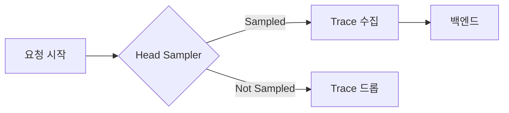
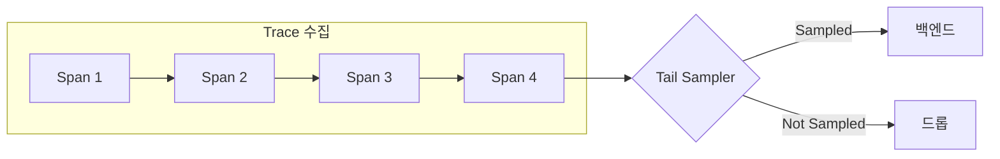

# OpenTelemetry Sampling 레퍼런스

---

### 📌 핵심 요약
> Sampling은 Observability 비용을 줄이면서 가시성을 유지하는 가장 효과적인 방법이다. 대부분의 요청이 성공적이고 적절한 지연 시간 내에 완료된다면, 100%의 Trace가 필요하지 않다. **대표성(Representativeness)** 원칙에 따라 적은 샘플로도 전체를 정확히 대표할 수 있다. Head Sampling은 빠르고 간단하며, Tail Sampling은 정교한 의사결정이 가능하다.

---

### 🎯 학습 목표
- Sampling의 필요성과 대표성 원칙을 이해한다
- "Sampled"와 "Not Sampled"의 정확한 의미를 안다
- Head Sampling과 Tail Sampling의 차이를 설명할 수 있다
- 언제 Sampling을 해야 하고 하지 말아야 하는지 판단할 수 있다
- OpenTelemetry의 Sampling 지원 현황을 안다

---

### 📖 본문 정리

#### 1. Sampling이란?

> *"대부분의 요청이 성공적이고 오류 없이 적절한 지연 시간 내에 완료된다면, 애플리케이션을 의미 있게 관찰하기 위해 100%의 Trace가 필요하지 않다. 올바른 Sampling만 있으면 된다."*

```
전체 Trace 데이터:
████████████████████████████████████████ (100%)

Sampling 후:
████░░░░░░░░░░░░░░░░░░░░░░░░░░░░░░░░░░░░ (5%)

→ 5%의 샘플로 전체를 대표할 수 있음
```

---

#### 2. 용어 정의

| 용어 | 정의 | 설명 |
|------|------|------|
| **Sampled** | 처리되고 내보내짐 | 샘플러가 대표로 선택한 Trace/Span |
| **Not Sampled** | 처리되지 않고 내보내지지 않음 | 샘플러가 선택하지 않은 Trace/Span |

##### 잘못된 표현

```
❌ "데이터를 sampling out 한다"
❌ "처리되지 않은 데이터가 sampled다"

✅ 올바른 표현:
   - Sampled = 선택되어 처리됨
   - Not Sampled = 선택되지 않아 버려짐
```

---

#### 3. 왜 Sampling인가?

##### 대표성 (Representativeness)

> *"작은 그룹이 큰 그룹을 정확하게 대표할 수 있다는 원칙. 이는 수학적으로 검증 가능하며, 작은 샘플이 전체 그룹을 정확하게 대표한다는 높은 신뢰도를 가질 수 있다."*

```
데이터 볼륨과 필요한 샘플 비율:

데이터 볼륨 ↑ → 필요한 샘플 비율 ↓

예: 고볼륨 시스템
├── 전체 Trace: 100,000/초
├── 샘플 비율: 1%
├── 샘플 수: 1,000/초
└── 결과: 나머지 99%를 정확히 대표
```

##### Sampling vs 다른 비용 절감 방법

| 방법 | 대표성 유지 | 설명 |
|------|-------------|------|
| **Sampling** | ✅ 유지 | 대표 데이터 선택 |
| Filtering | ❌ 손실 | 특정 조건 데이터만 유지 |
| Aggregation | ❌ 손실 | 데이터 집계/요약 |

---

#### 4. 언제 Sampling을 해야 하는가?

##### Sampling이 적합한 경우

```
✅ Sampling 권장 조건:
├── 초당 1,000개 이상의 Trace 생성
├── 대부분의 Trace가 정상 트래픽 (적은 변동)
├── 오류나 높은 지연 같은 공통 기준 보유
├── 도메인별 관련 데이터 판단 기준 보유
├── 데이터 샘플/드롭 규칙을 정의할 수 있음
├── 서비스별 구분 가능 (고/저볼륨 다르게 처리)
├── 미샘플 데이터를 저비용 스토리지로 라우팅 가능
└── 예산 제한이 있지만 시간 투자 가능
```

##### Sampling이 부적합한 경우

```
❌ Sampling 비권장 조건:
├── 매우 적은 데이터 생성 (초당 수십 개 이하)
├── 집계된 데이터만 사용 (사전 집계 가능)
└── 규정상 데이터 삭제 금지 (저비용 스토리지 라우팅 불가)
```

##### Sampling의 3가지 비용

| 비용 유형 | 설명 |
|-----------|------|
| **직접 비용** | Tail Sampling 프록시 등 컴퓨팅 비용 |
| **간접 엔지니어링 비용** | 시스템 변화에 따른 샘플링 전략 유지보수 |
| **기회 비용** | 비효과적 샘플링으로 중요 정보 손실 |

> *"Sampling은 Observability 비용을 효과적으로 줄이지만, 잘못 수행하면 예상치 못한 다른 비용이 발생할 수 있다."*

---

#### 5. Head Sampling

**정의**: 가능한 한 빨리 샘플링 결정을 내리는 기법. 전체 Trace를 검사하지 않고 결정.



##### Consistent Probability Sampling (결정론적 샘플링)

가장 일반적인 Head Sampling 형태:

```
Trace ID + 원하는 샘플 비율 → 샘플링 결정

예: 5% 샘플링
├── Trace ID: abc123... → 해시 → Sampled
├── Trace ID: def456... → 해시 → Not Sampled
├── Trace ID: ghi789... → 해시 → Not Sampled
└── ...

→ 전체 Trace가 일관되게 샘플링됨 (누락 Span 없음)
```

##### 장점

| 장점 | 설명 |
|------|------|
| **이해하기 쉬움** | 단순한 확률 기반 |
| **구성하기 쉬움** | 비율만 설정하면 됨 |
| **효율적** | 계산 비용 낮음 |
| **유연한 위치** | 파이프라인 어느 지점에서든 가능 |

##### 단점

```
❌ 전체 Trace 데이터 기반 결정 불가

예: "오류가 포함된 모든 Trace 샘플링"
    → Head Sampling만으로는 불가능
    → Tail Sampling 필요
```

---

#### 6. Tail Sampling

**정의**: Trace 내의 모든(또는 대부분의) Span을 고려하여 샘플링 결정을 내리는 기법.



##### 사용 사례

| 시나리오 | 설명 |
|----------|------|
| **오류 포함 Trace** | 오류가 있는 모든 Trace 항상 샘플링 |
| **지연 기반** | 전체 지연 시간 기준 샘플링 |
| **속성 기반** | 특정 Span의 속성 값 기준 샘플링 |
| **서비스별 차등** | 고볼륨/저볼륨 서비스 다르게 샘플링 |
| **신규 서비스 우선** | 새로 배포된 서비스 Trace 더 많이 샘플링 |

##### 장점

```
✅ Tail Sampling 장점:
├── 전체 Trace 데이터 기반 정교한 결정
├── 오류/지연 등 중요 Trace 100% 캡처 가능
├── 서비스별 차등 샘플링
└── 비즈니스 규칙 기반 샘플링
```

##### 단점

| 단점 | 설명 |
|------|------|
| **구현 어려움** | "설정하고 잊기" 불가. 시스템 변화에 따라 전략 변경 필요 |
| **운영 어려움** | 상태 유지 시스템 필요, 대량 데이터 저장, 리소스 모니터링 필수 |
| **벤더 종속** | 가장 효과적인 옵션이 벤더 특화 기술일 수 있음 |

##### 운영 고려사항

```
Tail Sampler 운영 요구사항:
├── 상태 유지 시스템 (Stateful)
├── 대용량 데이터 수용/저장
├── 트래픽 패턴에 따른 수십~수백 노드
├── 리소스 모니터링 필수
└── 과부하 시 Head Sampling으로 폴백
```

---

#### 7. Head + Tail Sampling 조합

고볼륨 시스템에서는 두 가지를 조합하여 사용:

```
┌─────────────┐     ┌─────────────┐     ┌─────────────┐
│   Services  │     │    Head     │     │    Tail     │
│ (매우 높은  │ ──► │  Sampling   │ ──► │  Sampling   │ ──► Backend
│   볼륨)     │     │   (10%)     │     │  (정교한    │
└─────────────┘     └─────────────┘     │   규칙)     │
                                        └─────────────┘

1단계: Head Sampling으로 초기 필터링 (예: 10%)
2단계: Tail Sampling으로 정교한 결정

→ 텔레메트리 파이프라인 과부하 방지
```

---

#### 8. 비교 요약

| 항목 | Head Sampling | Tail Sampling |
|------|---------------|---------------|
| **결정 시점** | Trace 시작 시 | Trace 완료 후 |
| **결정 기준** | Trace ID + 확률 | 전체 Trace 데이터 |
| **복잡도** | 낮음 | 높음 |
| **리소스** | 적음 | 많음 (상태 유지) |
| **정교함** | 제한적 | 매우 높음 |
| **오류 Trace 보장** | ❌ 불가 | ✅ 가능 |
| **구현 위치** | SDK, Collector | Collector (주로) |

##### 의사결정 플로우

```
샘플링이 필요한가?
│
├─ 간단한 확률 샘플링으로 충분한가?
│   ├── Yes → Head Sampling
│   └── No ↓
│
├─ 오류/지연 등 조건부 샘플링이 필요한가?
│   ├── Yes → Tail Sampling
│   └── No ↓
│
├─ 볼륨이 매우 높은가?
│   ├── Yes → Head + Tail 조합
│   └── No → Tail Sampling 단독
│
└─ 벤더 솔루션 사용 가능한가?
    └── Yes → 벤더 Sampling 솔루션 고려
```

---

#### 9. OpenTelemetry 지원 현황

##### Collector Processors

| Processor | 설명 |
|-----------|------|
| **Probabilistic Sampling Processor** | 확률 기반 Head Sampling |
| **Tail Sampling Processor** | 조건 기반 Tail Sampling |

##### 언어별 SDK 지원

| 언어 | 문서 위치 |
|------|-----------|
| Go | SDK 문서 참조 |
| JavaScript | SDK 문서 참조 |
| Erlang/Elixir | SDK 문서 참조 |
| Ruby | SDK 문서 참조 |

##### Vendor 솔루션

> *"많은 벤더가 Head Sampling, Tail Sampling 및 기타 기능을 통합한 포괄적인 Sampling 솔루션을 제공한다. 이러한 솔루션은 벤더 백엔드에 최적화되어 있을 수 있다. 벤더에 텔레메트리를 보내는 경우, 해당 벤더의 Sampling 솔루션 사용을 고려하라."*

---

### 🔍 심화 학습

#### Sampling Rate 결정

| 볼륨 (Trace/초) | 권장 샘플 비율 | 샘플 수/초 |
|-----------------|----------------|------------|
| 100 | 100% | 100 |
| 1,000 | 10-50% | 100-500 |
| 10,000 | 1-10% | 100-1,000 |
| 100,000 | 0.1-1% | 100-1,000 |
| 1,000,000+ | 0.01-0.1% | 100-1,000 |

> 목표: 분석에 충분한 샘플 수 유지 (일반적으로 100-1,000/초)

#### Tail Sampling 규칙 예시

```yaml
# OpenTelemetry Collector 설정 예시
processors:
  tail_sampling:
    decision_wait: 10s
    num_traces: 100000
    policies:
      # 오류 포함 Trace 항상 샘플링
      - name: errors-policy
        type: status_code
        status_code: {status_codes: [ERROR]}

      # 지연 > 500ms Trace 샘플링
      - name: latency-policy
        type: latency
        latency: {threshold_ms: 500}

      # 나머지는 10% 확률 샘플링
      - name: probabilistic-policy
        type: probabilistic
        probabilistic: {sampling_percentage: 10}
```

#### 비용 계산 예시

```
시나리오: 100,000 Trace/초

옵션 A: 100% 저장
├── 저장 비용: $10,000/월
└── 분석 비용: $5,000/월
    총: $15,000/월

옵션 B: Tail Sampling (1% + 오류 100%)
├── Sampling 인프라: $500/월
├── 저장 비용: $200/월
├── 분석 비용: $100/월
└── 총: $800/월

절감: 약 95%
```

---

### 💡 실무 적용 포인트

1. **시작은 Head Sampling**: 간단한 확률 샘플링부터 시작
2. **오류는 항상 캡처**: Tail Sampling으로 오류 Trace 100% 보장
3. **볼륨 모니터링**: 샘플링 전/후 볼륨 변화 추적
4. **점진적 조정**: 샘플 비율을 점진적으로 조정하며 최적점 탐색
5. **미샘플 데이터 보관**: 저비용 스토리지에 일정 기간 보관 (just in case)
6. **Tail Sampler 모니터링**: 리소스 사용량 및 결정 지연 모니터링
7. **벤더 솔루션 평가**: 직접 운영 vs 벤더 솔루션 비용 비교

---

### ✅ 정리 체크리스트

- [ ] Sampling이 Observability 비용 절감의 핵심임을 안다
- [ ] "Sampled"와 "Not Sampled"의 정확한 의미를 안다
- [ ] 대표성(Representativeness) 원칙을 설명할 수 있다
- [ ] Sampling이 적합한/부적합한 상황을 구분할 수 있다
- [ ] Head Sampling의 동작 원리를 안다
- [ ] Tail Sampling의 동작 원리와 사용 사례를 안다
- [ ] Head/Tail Sampling의 장단점을 비교할 수 있다
- [ ] 두 방식을 조합하는 이유를 이해한다
- [ ] OpenTelemetry Collector의 Sampling Processor를 안다

---

### 🔗 참고 자료

- [OpenTelemetry Sampling Documentation](https://opentelemetry.io/docs/concepts/sampling/)
- [OpenTelemetry Collector - Probabilistic Sampling Processor](https://github.com/open-telemetry/opentelemetry-collector-contrib/tree/main/processor/probabilisticsamplerprocessor)
- [OpenTelemetry Collector - Tail Sampling Processor](https://github.com/open-telemetry/opentelemetry-collector-contrib/tree/main/processor/tailsamplingprocessor)
- [W3C Trace Context - Sampling](https://www.w3.org/TR/trace-context/#sampled-flag)
