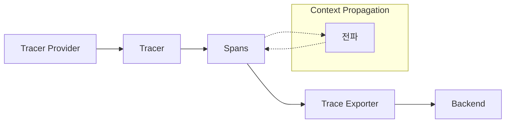
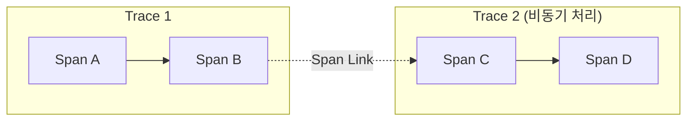

# OpenTelemetry Traces 레퍼런스

---

### 📌 핵심 요약
> Trace는 애플리케이션을 통과하는 요청의 경로를 나타낸다. 모놀리스든 복잡한 마이크로서비스 메시든, Trace는 요청이 애플리케이션에서 취하는 전체 "경로"를 이해하는 데 필수적이다. Trace는 Span의 집합으로 구성되며, 각 Span은 컨텍스트, 상관관계, 계층 구조가 내장된 구조화된 로그로 볼 수 있다.

---

### 🎯 학습 목표
- Trace와 Span의 관계를 이해한다
- Tracer Provider, Tracer, Exporter의 역할을 안다
- Span의 구성 요소(Context, Attributes, Events, Links, Status, Kind)를 설명할 수 있다
- Span Event와 Span Attribute의 사용 시점을 구분할 수 있다
- Span Kind 5가지 유형을 이해한다

---

### 📖 본문 정리

#### 1. Trace란?

> *"Trace는 요청이 애플리케이션에서 취하는 전체 경로를 보여주는 큰 그림이다."*

Trace는 여러 **Span**으로 구성된다. 다음은 세 개의 Span으로 구성된 예시다:

##### Root Span: hello

```json
{
  "name": "hello",
  "context": {
    "trace_id": "5b8aa5a2d2c872e8321cf37308d69df2",
    "span_id": "051581bf3cb55c13"
  },
  "parent_id": null,
  "start_time": "2022-04-29T18:52:58.114201Z",
  "end_time": "2022-04-29T18:52:58.114687Z",
  "attributes": {
    "http.route": "some_route1"
  },
  "events": [
    {
      "name": "Guten Tag!",
      "timestamp": "2022-04-29T18:52:58.114561Z",
      "attributes": {
        "event_attributes": 1
      }
    }
  ]
}
```

**특징**:
- `trace_id` 존재
- `parent_id`가 null → **Root Span**임을 의미
- 전체 작업의 시작과 끝을 나타냄

##### Child Span: hello-greetings

```json
{
  "name": "hello-greetings",
  "context": {
    "trace_id": "5b8aa5a2d2c872e8321cf37308d69df2",
    "span_id": "5fb397be34d26b51"
  },
  "parent_id": "051581bf3cb55c13",
  "start_time": "2022-04-29T18:52:58.114304Z",
  "end_time": "2022-04-29T22:52:58.114561Z",
  "attributes": {
    "http.route": "some_route2"
  },
  "events": [
    {
      "name": "hey there!",
      "timestamp": "2022-04-29T18:52:58.114561Z",
      "attributes": { "event_attributes": 1 }
    },
    {
      "name": "bye now!",
      "timestamp": "2022-04-29T18:52:58.114585Z",
      "attributes": { "event_attributes": 1 }
    }
  ]
}
```

**특징**:
- 동일한 `trace_id` → 같은 Trace의 일부
- `parent_id`가 hello의 `span_id`와 일치 → hello의 자식

##### Sibling Span: hello-salutations

```json
{
  "name": "hello-salutations",
  "context": {
    "trace_id": "5b8aa5a2d2c872e8321cf37308d69df2",
    "span_id": "93564f51e1abe1c2"
  },
  "parent_id": "051581bf3cb55c13",
  "start_time": "2022-04-29T18:52:58.114492Z",
  "end_time": "2022-04-29T18:52:58.114631Z",
  "attributes": {
    "http.route": "some_route3"
  },
  "events": [
    {
      "name": "hey there!",
      "timestamp": "2022-04-29T18:52:58.114561Z",
      "attributes": { "event_attributes": 1 }
    }
  ]
}
```

**특징**:
- hello의 자식 → hello-greetings의 **형제(sibling)**

##### Trace 계층 구조

```
hello (Root Span)
├── hello-greetings (Child Span)
└── hello-salutations (Child Span, Sibling)

모든 Span이 동일한 trace_id 공유:
5b8aa5a2d2c872e8321cf37308d69df2
```

> *"Trace는 컨텍스트, 상관관계, 계층 구조가 내장된 구조화된 로그의 집합으로 볼 수 있다. 이 '구조화된 로그'는 다른 프로세스, 서비스, VM, 데이터센터에서 올 수 있다. 이것이 Tracing이 모든 시스템의 종단간 뷰를 제공할 수 있는 이유다."*

---

#### 2. 주요 컴포넌트



##### Tracer Provider

**정의**: Tracer를 생성하는 팩토리

**특징**:
- 대부분의 애플리케이션에서 한 번 초기화
- 생명주기가 애플리케이션과 일치
- Resource 및 Exporter 초기화 포함
- OpenTelemetry 트레이싱의 **첫 번째 단계**
- 일부 언어 SDK는 전역 Tracer Provider가 미리 초기화되어 있음

##### Tracer

**정의**: Span을 생성하는 컴포넌트

**역할**:
- 특정 작업에서 발생하는 일에 대한 더 많은 정보를 담은 Span 생성
- Tracer Provider에서 생성됨

##### Trace Exporters

**정의**: Trace를 소비자에게 전송

**소비자 종류**:
- 표준 출력 (디버깅/개발용)
- OpenTelemetry Collector
- 오픈소스 또는 벤더 백엔드

##### Context Propagation

**정의**: 분산 트레이싱을 가능하게 하는 핵심 개념

**역할**:
- Span이 생성된 위치에 관계없이 서로 상관관계 형성
- Span을 Trace로 조립

---

#### 3. Span 상세

Span은 **작업 또는 연산의 단위**를 나타낸다.

##### Span 구성 요소

| 요소 | 설명 |
|------|------|
| **Name** | Span 이름 |
| **Parent Span ID** | 부모 Span ID (Root Span은 비어있음) |
| **Start/End Timestamps** | 시작/종료 시간 |
| **Span Context** | Trace ID, Span ID, Trace Flags, Trace State |
| **Attributes** | 메타데이터 키-값 쌍 |
| **Span Events** | Span 내 특정 시점의 이벤트 |
| **Span Links** | 다른 Span과의 연결 |
| **Span Status** | 상태 (Unset, Error, Ok) |

##### 샘플 Span (모든 구성 요소 포함)

```json
{
  // ① Name: Span 이름
  "name": "/api/v1/orders/create",

  // ② Span Context: Trace ID, Span ID, Trace Flags, Trace State
  "context": {
    "trace_id": "7bba9f33312b3dbb8b2c2c62bb7abe2d",
    "span_id": "086e83747d0e381e",
    "trace_flags": "01",                    // 01 = sampled
    "trace_state": "vendor1=value1,vendor2=value2"
  },

  // ③ Parent Span ID: 부모 Span (Root Span이면 비어있음)
  "parent_id": "a1b2c3d4e5f67890",

  // ④ Start/End Timestamps: 시작/종료 시간
  "start_time": "2024-01-15T10:30:00.000000Z",
  "end_time": "2024-01-15T10:30:00.250000Z",

  // ⑤ Span Status: 상태 (Unset, Error, Ok)
  "status": {
    "code": "STATUS_CODE_OK",
    "message": ""
  },

  // ⑥ Span Kind: Client, Server, Internal, Producer, Consumer
  "kind": "SPAN_KIND_SERVER",

  // ⑦ Attributes: 메타데이터 키-값 쌍
  "attributes": {
    // Semantic Attributes (표준)
    "http.method": "POST",
    "http.route": "/api/v1/orders/create",
    "http.status_code": 201,
    "http.scheme": "https",
    "http.host": "api.example.com",
    "http.user_agent": "Mozilla/5.0",
    "net.peer.ip": "192.168.1.100",
    "net.peer.port": 54321,
    // Custom Attributes (비즈니스 로직)
    "user.id": "user_12345",
    "order.id": "order_67890",
    "order.total": 150.00,
    "order.item_count": 3
  },

  // ⑧ Span Events: Span 내 특정 시점의 이벤트
  "events": [
    {
      "name": "order.validation.started",
      "timestamp": "2024-01-15T10:30:00.050000Z",
      "attributes": {
        "validation.type": "payment"
      }
    },
    {
      "name": "order.validation.completed",
      "timestamp": "2024-01-15T10:30:00.150000Z",
      "attributes": {
        "validation.result": "success"
      }
    },
    {
      "name": "order.created",
      "timestamp": "2024-01-15T10:30:00.200000Z",
      "attributes": {
        "order.id": "order_67890"
      }
    }
  ],

  // ⑨ Span Links: 다른 Span과의 연결 (인과 관계)
  "links": [
    {
      "trace_id": "aaaa1111bbbb2222cccc3333dddd4444",
      "span_id": "1234567890abcdef",
      "attributes": {
        "link.type": "triggered_by",
        "source.event": "cart.checkout.initiated"
      }
    },
    {
      "trace_id": "5555666677778888aaaabbbbccccdddd",
      "span_id": "fedcba0987654321",
      "attributes": {
        "link.type": "related_to",
        "source.event": "inventory.reserved"
      }
    }
  ],

  // Resource: 텔레메트리를 생성한 엔티티 정보
  "resource": {
    "service.name": "order-service",
    "service.version": "1.2.3",
    "deployment.environment": "production",
    "host.name": "order-service-pod-abc123"
  }
}
```

##### 구성 요소 매핑표

| 번호 | 요소 | JSON 필드 | 예시 값 |
|------|------|-----------|---------|
| ① | Name | `name` | `/api/v1/orders/create` |
| ② | Span Context | `context.*` | trace_id, span_id, trace_flags, trace_state |
| ③ | Parent Span ID | `parent_id` | `a1b2c3d4e5f67890` |
| ④ | Timestamps | `start_time`, `end_time` | ISO 8601 형식 |
| ⑤ | Span Status | `status.code` | `STATUS_CODE_OK` |
| ⑥ | Span Kind | `kind` | `SPAN_KIND_SERVER` |
| ⑦ | Attributes | `attributes.*` | 키-값 쌍 |
| ⑧ | Span Events | `events[]` | 타임스탬프 + 속성 |
| ⑨ | Span Links | `links[]` | 다른 Trace/Span 참조 |

##### 시각적 표현

```
                         Span: /api/v1/orders/create
┌─────────────────────────────────────────────────────────────────────────┐
│ trace_id: 7bba9f33312b3dbb8b2c2c62bb7abe2d                              │
│ span_id:  086e83747d0e381e                                               │
│ parent:   a1b2c3d4e5f67890                                               │
│ kind:     SERVER                                                         │
├─────────────────────────────────────────────────────────────────────────┤
│                                                                         │
│  start                                                            end   │
│    │                                                               │    │
│    ▼                                                               ▼    │
│    ├──────────┬──────────────────────┬─────────────────────────────┤    │
│    │          │                      │                             │    │
│    │       Event①              Event②                          Event③   │
│    │   validation.started   validation.completed            order.created│
│    │                                                                │    │
├─────────────────────────────────────────────────────────────────────────┤
│ Attributes:                                                             │
│   http.method=POST, http.status_code=201, user.id=user_12345           │
│   order.id=order_67890, order.total=150.00                             │
├─────────────────────────────────────────────────────────────────────────┤
│ Links:                                                                  │
│   ← cart.checkout.initiated (trace: aaaa1111...)                       │
│   ← inventory.reserved (trace: 55556666...)                            │
├─────────────────────────────────────────────────────────────────────────┤
│ Status: OK                                                              │
└─────────────────────────────────────────────────────────────────────────┘
```

---

#### 4. Span Context

**정의**: 모든 Span에 있는 **불변 객체**

| 필드 | 설명 |
|------|------|
| **Trace ID** | Span이 속한 Trace 식별자 |
| **Span ID** | 현재 Span 식별자 |
| **Trace Flags** | Trace 정보를 담은 바이너리 인코딩 |
| **Trace State** | 벤더별 Trace 정보를 담은 키-값 목록 |

**역할**:
- 분산 컨텍스트 및 Baggage와 함께 직렬화되어 전파
- Span Links 생성 시 Trace ID 사용

---

#### 5. Attributes

**정의**: Span에 메타데이터를 추가하는 키-값 쌍

**사용 예**:
```
이커머스 장바구니 추가 작업:
├── user.id: "user_12345"
├── cart.id: "cart_67890"
└── item.id: "item_abc"
```

##### 규칙

| 규칙 | 설명 |
|------|------|
| **키** | null이 아닌 문자열 |
| **값** | null이 아닌 string, boolean, 부동소수점, 정수, 또는 이들의 배열 |

##### Semantic Attributes

**정의**: 일반적인 작업에서 흔히 사용되는 메타데이터의 **표준 네이밍 컨벤션**

**장점**: 시스템 간 공통 메타데이터 표준화

**예시**:
```
http.method, http.route, http.status_code
net.peer.ip, net.peer.port
db.system, db.name, db.statement
```

##### 권장사항

> *"가능하면 Span 생성 시 Attribute를 추가하라. SDK 샘플링에서 Attribute를 사용할 수 있다."*

---

#### 6. Span Events

**정의**: Span의 지속 시간 중 의미 있는 **단일 시점**을 나타내는 구조화된 로그 메시지

##### Event vs Span 사용 시점

| 시나리오 | 적합한 도구 |
|----------|-------------|
| 페이지 로드 추적 (시작~끝) | **Span** |
| 페이지가 인터랙티브해진 시점 | **Span Event** |

##### Event vs Attribute 결정 기준

```
특정 타임스탬프가 의미 있는가?
├── Yes → Span Event 사용
└── No  → Span Attribute 사용
```

**예시**:
- 작업 완료 시점이 중요 → Event
- 작업 결과 데이터만 필요 → Attribute

---

#### 7. Span Links

**정의**: 하나의 Span을 다른 Span과 연결하여 **인과 관계** 표현

##### 사용 시나리오



**언제 사용하는가?**:
- 비동기 작업이 큐에 추가된 경우
- 후속 작업의 시작 시점을 예측할 수 없는 경우
- 두 Trace 간 인과 관계를 나타내야 할 때

> *"첫 번째 Trace의 마지막 Span을 두 번째 Trace의 첫 번째 Span에 연결하면, 두 Trace가 인과적으로 연결된다."*

---

#### 8. Span Status

| 상태 | 설명 |
|------|------|
| **Unset** | 기본값. 오류 없이 성공적으로 완료됨 |
| **Error** | 작업 중 오류 발생 (예: HTTP 500) |
| **Ok** | 개발자가 명시적으로 오류 없음을 표시 |

##### 중요한 구분

```
Unset vs Ok:

Unset = 오류 없이 완료됨 (암묵적)
Ok    = 개발자가 명시적으로 "성공"이라고 선언

→ 대부분의 경우 Ok를 명시적으로 설정할 필요 없음
→ Unset으로 충분함
```

**Ok 사용 시점**:
- Span이 "성공"이라는 것에 대해 다른 해석의 여지를 없애고 싶을 때
- 개발자가 명확하게 "최종 결론"을 내리고 싶을 때

---

#### 9. Span Kind

Span 생성 시 5가지 종류 중 하나로 지정:

| Kind | 설명 | 예시 |
|------|------|------|
| **Client** | 동기적 나가는 원격 호출 | HTTP 요청, DB 호출 |
| **Server** | 동기적 들어오는 원격 호출 | HTTP 요청 수신, RPC |
| **Internal** | 프로세스 경계를 넘지 않는 작업 | 함수 호출, 미들웨어 |
| **Producer** | 비동기 처리될 작업 생성 | 잡 큐 추가, 이벤트 발행 |
| **Consumer** | Producer가 생성한 작업 처리 | 큐 메시지 소비 |

##### 부모-자식 관계

```
Server Span의 부모 → 보통 원격 Client Span
Client Span의 자식 → 보통 Server Span
Consumer Span의 부모 → 항상 Producer
Producer Span의 자식 → 항상 Consumer
```

##### Client vs Server

```
┌─────────────┐         ┌─────────────┐
│  Service A  │         │  Service B  │
│             │         │             │
│ ┌─────────┐ │  HTTP   │ ┌─────────┐ │
│ │ Client  │─┼────────►│ │ Server  │ │
│ │  Span   │ │         │ │  Span   │ │
│ └─────────┘ │         │ └─────────┘ │
└─────────────┘         └─────────────┘
```

##### Producer vs Consumer

```
┌─────────────┐         ┌─────────┐         ┌─────────────┐
│  Service A  │         │  Queue  │         │  Service B  │
│             │         │         │         │             │
│ ┌─────────┐ │ publish │         │ consume │ ┌─────────┐ │
│ │Producer │─┼────────►│ ─ ─ ─ ─ ┼────────►│ │Consumer │ │
│ │  Span   │ │         │         │         │ │  Span   │ │
│ └─────────┘ │         │         │         │ └─────────┘ │
└─────────────┘         └─────────┘         └─────────────┘

Producer Span이 끝난 후 한참 뒤에 Consumer Span 시작 가능
```

> *"'동기적(synchronous)'은 async/await을 의미하는 것이 아니라, 나중에 처리하기 위해 큐에 넣지 않는다는 의미다."*

---

### 🔍 심화 학습

#### Trace ID vs Span ID

| 항목 | Trace ID | Span ID |
|------|----------|---------|
| **길이** | 32자 (128비트) | 16자 (64비트) |
| **범위** | 전체 Trace | 개별 Span |
| **고유성** | 전역적으로 고유 | Trace 내에서 고유 |
| **용도** | Trace 전체 식별 | 개별 작업 식별 |

#### W3C Trace Context 헤더

```http
traceparent: 00-5b8aa5a2d2c872e8321cf37308d69df2-051581bf3cb55c13-01
             │  │                                │                │
             │  │                                │                └─ Trace Flags
             │  │                                └─ Parent Span ID
             │  └─ Trace ID
             └─ Version
```

---

### 💡 실무 적용 포인트

1. **Root Span 식별**: `parent_id`가 null/비어있으면 Root Span
2. **Semantic Attributes 사용**: 표준 속성명 사용으로 도구 간 호환성 확보
3. **Event vs Attribute 결정**: 타임스탬프가 중요하면 Event
4. **Span Kind 정확히 지정**: 백엔드가 Trace를 올바르게 조립하는 데 도움
5. **Status는 Unset 기본**: 명시적 Ok는 특별한 경우에만
6. **Span Links 활용**: 비동기 작업 간 인과관계 추적

---

### ✅ 정리 체크리스트

- [ ] Trace가 Span의 집합임을 이해한다
- [ ] Root Span과 Child Span을 구분할 수 있다
- [ ] Tracer Provider → Tracer → Span 생성 흐름을 안다
- [ ] Span Context의 4가지 구성요소를 열거할 수 있다
- [ ] Semantic Attributes의 목적을 안다
- [ ] Span Event와 Span Attribute의 사용 시점을 구분할 수 있다
- [ ] Span Links의 용도를 설명할 수 있다
- [ ] Span Status 3가지(Unset, Error, Ok)의 차이를 안다
- [ ] Span Kind 5가지 유형을 구분할 수 있다
- [ ] Client/Server와 Producer/Consumer의 관계를 이해한다

---

### 🔗 참고 자료

- [OpenTelemetry Traces Documentation](https://opentelemetry.io/docs/concepts/signals/traces/)
- [OpenTelemetry Semantic Conventions](https://opentelemetry.io/docs/concepts/semantic-conventions/)
- [W3C Trace Context Specification](https://www.w3.org/TR/trace-context/)
- [Context Propagation Concept](https://opentelemetry.io/docs/concepts/context-propagation/)
- [Span Links Documentation](https://opentelemetry.io/docs/concepts/signals/traces/#span-links)
