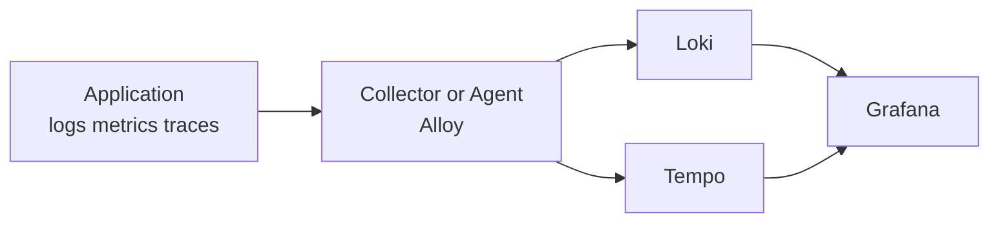
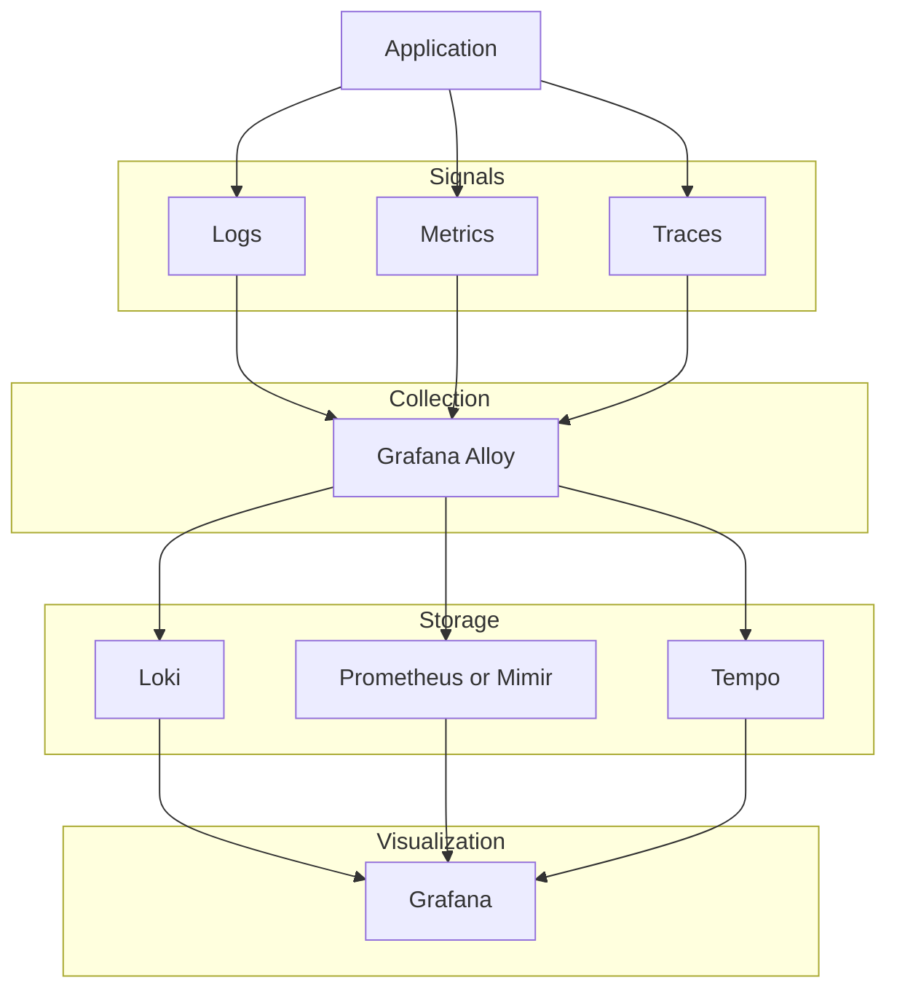

# Ch01. Observability Stack Overview

**핵심 질문**: "수집기, 저장소, UI를 왜 한 덩어리로 보지 말고 분리해서 이해해야 하는가?"

---

## 1. Observability 스택을 보는 올바른 관점

Observability를 처음 공부할 때 흔히 하는 실수는 "Grafana가 다 해주는 것"처럼 이해하는 것입니다. 하지만 실제 운영에서는 세 계층을 분리해야 문제가 보입니다.

1. **Signal Production**: 애플리케이션이 로그, 메트릭, 트레이스를 내보낸다.
2. **Collection and Processing**: 수집기가 데이터를 받아 배치, 필터링, 라우팅, 샘플링을 수행한다.
3. **Storage and Query**: 저장소가 신호를 장기 보관하고 쿼리할 수 있게 만든다.
4. **Visualization and Investigation**: UI가 탐색과 상관분석을 돕는다.

이 분리가 중요한 이유는 장애가 났을 때 "데이터를 못 본다"는 현상이 여러 층에서 발생할 수 있기 때문입니다. 애플리케이션이 데이터를 안 보냈을 수도 있고, 수집기가 버렸을 수도 있고, 저장소가 못 받았을 수도 있고, UI에서 데이터소스 연결이 끊겼을 수도 있습니다.



---

## 2. 이번 학습에서 다루는 컴포넌트의 책임

### Grafana Alloy

Alloy는 **수집기이자 처리기**입니다.  
애플리케이션이나 인프라에서 들어오는 데이터를 받아서 필요한 형태로 가공한 뒤, 적절한 저장소로 보냅니다.

즉, Alloy의 핵심 질문은 이것입니다.

> "무엇을 어디로 보낼 것인가?"

### Grafana Loki

Loki는 **로그 저장 및 쿼리 백엔드**입니다.  
로그 본문 전체를 검색 인덱스로 만드는 대신, 라벨을 중심으로 인덱싱하고 실제 로그 데이터는 chunk 형태로 저장합니다.

즉, Loki의 핵심 질문은 이것입니다.

> "이 로그를 어떤 라벨 전략으로 싸게 저장하고 효율적으로 찾을 것인가?"

### Grafana Tempo

Tempo는 **분산 트레이스 저장 및 조회 백엔드**입니다.  
Span들이 모여 하나의 trace를 이루고, Tempo는 이 trace를 저장하고 관계를 조회할 수 있게 합니다.

즉, Tempo의 핵심 질문은 이것입니다.

> "한 요청이 여러 서비스를 지나갈 때 그 흐름을 어떻게 추적할 것인가?"

---

## 3. 왜 LGTM 관점이 자주 언급되는가

Grafana 생태계에서 `LGTM`은 흔히 다음 조합을 뜻합니다.

- **L**oki: Logs
- **G**rafana: Visualization
- **T**empo: Traces
- **M**imir 또는 Prometheus: Metrics

이번 문서에서는 메트릭 저장소를 중심으로 다루지 않지만, 전체 그림에서는 메트릭도 항상 함께 존재합니다. 실무에서 Alloy가 중요한 이유도, 이 신호들을 한 번에 받을 수 있기 때문입니다.



---

## 4. 현재 PoC와 새 학습 주제의 관계

현재 `07_Observability` 폴더의 실행 자산은 크게 두 갈래입니다.

1. `docker-compose.yml` + `otel-collector-config.yaml` + `service-a/service-b`
2. `demo/opentelemetry-demo/`

첫 번째는 **OTLP와 tracing 기본기**를 익히기 좋은 최소 예제입니다.  
두 번째는 더 큰 OpenTelemetry Demo 자산으로, 수집기와 시각화 계층을 넓게 볼 수 있는 확장 실습 자료입니다.

즉, 이번 학습 문서는 "지금 이 폴더에 있는 자산을 읽는 눈"을 만드는 작업이라고 보면 됩니다.

---

## 5. Monitoring과 Observability의 차이

Monitoring은 보통 미리 정의한 지표를 보고 **정상인지 비정상인지 감시**하는 활동입니다.  
Observability는 예상하지 못한 상황이 발생했을 때도 **외부 출력만으로 내부 상태를 추론**할 수 있게 만드는 속성입니다.

실무에서는 둘이 경쟁 관계가 아닙니다.

- Monitoring은 빠르게 알리는 역할
- Observability는 깊게 이해하고 원인을 좁히는 역할

예를 들어 CPU 사용률이 95%라는 알림은 Monitoring입니다.  
왜 CPU가 치솟았는지, 어떤 요청이 느려졌고 어느 서비스 체인에서 병목이 생겼는지를 trace와 로그로 파악하는 것은 Observability입니다.

---

## 6. Log와 Trace는 어떻게 다른가

둘 다 "무슨 일이 일어났는지"를 남기지만, 기록 단위와 목적이 다릅니다.

**Log는 점이고, Trace는 점을 이은 선입니다.**

Log는 특정 시점에 하나의 서비스에서 발생한 이벤트 기록입니다. `logger.info("주문 생성: orderId=42")` 같은 한 줄이 하나의 로그이고, 각 로그는 기본적으로 서로 독립적입니다. "무슨 일이 일어났는가"에 답합니다.

Trace는 하나의 요청이 여러 서비스를 거치며 만든 전체 경로입니다. 사용자 요청이 API Gateway → 주문서비스 → 결제서비스 → DB를 지나갔다면, 이 여정 전체가 하나의 Trace입니다. "어디서 느리고, 어디서 실패했는가"에 답합니다.

| | Log | Trace |
|---|---|---|
| 단위 | 한 줄 (이벤트) | 요청 전체 (여정) |
| 구조 | 타임스탬프 + 메시지 | 1 Trace = N Spans (Span은 작업 단위) |
| 연결성 | 기본적으로 독립 | traceId로 전체 연결 |
| 질문 | "무슨 일이 일어났나" | "어디서 느리고, 어디서 실패했나" |
| 저장소 | Loki | Tempo |

Spring Boot 3.x에서는 Micrometer Tracing이 로그에 traceId/spanId를 자동 주입합니다. 덕분에 로그 한 줄에서 traceId를 뽑아 Tempo에서 전체 흐름을 조회할 수 있고, 이것이 Grafana에서 "Logs to Traces" 상관분석이 가능한 이유입니다.

```
2026-03-14 10:00:00 INFO [order-service,traceId=abc123,spanId=def456] 주문 생성 시작
2026-03-14 10:00:00 INFO [payment-service,traceId=abc123,spanId=ghi789] 결제 처리 중
```

같은 `traceId=abc123`을 가진 로그끼리 모으면 트레이스가 되는 셈입니다.

---

## 7. 면접용 한 줄 정리

### Alloy

"Grafana Alloy는 OpenTelemetry Collector 기반의 통합 수집기로, 로그, 메트릭, 트레이스를 받아 처리하고 각 저장소로 라우팅하는 계층입니다."

### Loki

"Grafana Loki는 로그 본문 전체가 아니라 라벨 중심으로 인덱싱해 비용을 낮추는 로그 저장소입니다."

### Tempo

"Grafana Tempo는 분산 시스템의 요청 흐름을 span 단위로 저장하고 조회하는 trace backend입니다."

### 전체 스택

"애플리케이션이 OTLP로 신호를 내보내면, Alloy가 이를 수집 및 처리해서 Loki와 Tempo 같은 저장소로 보내고, Grafana가 이를 한 화면에서 연결해 탐색하게 해주는 구조입니다."

---

## 8. 다음 챕터로 연결

이제 전체 그림은 잡혔습니다. 다음 챕터에서는 이 스택을 실제로 묶어 주는 공통 언어인 **OTLP**를 다룹니다.

왜냐하면 Alloy, Loki, Tempo를 이해하려면 먼저 "애플리케이션이 어떤 형식과 프로토콜로 데이터를 보낸다"는 점부터 명확해야 하기 때문입니다.
