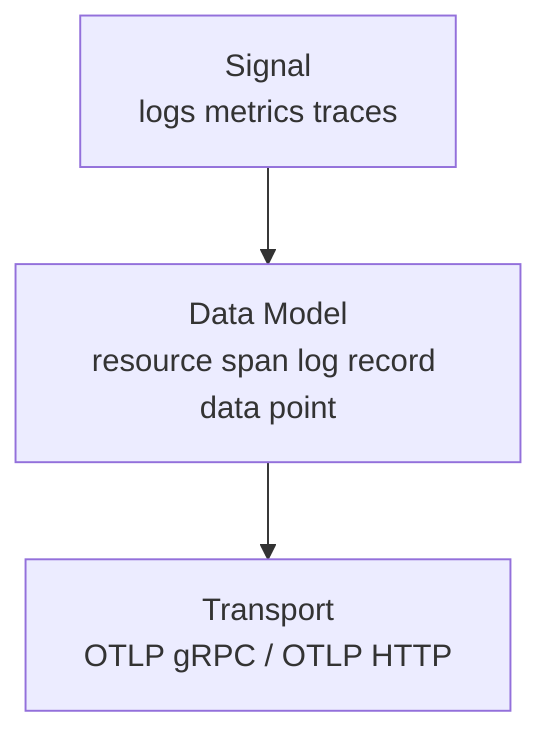
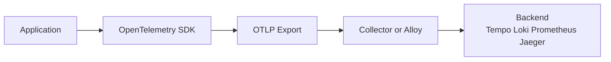
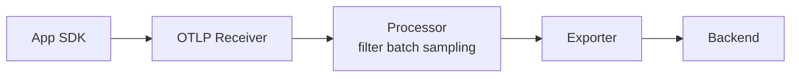
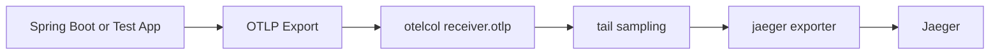
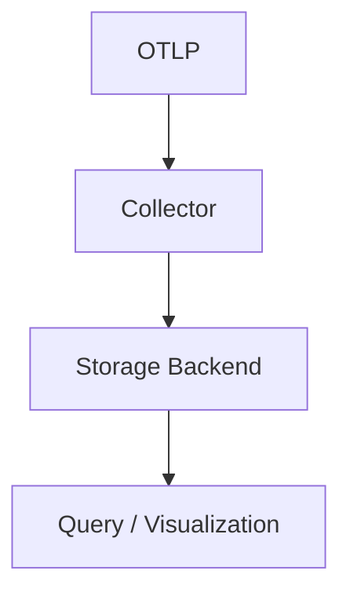

# Ch02. OTLP and Signal Flow

**핵심 질문**: "OTLP는 단순한 전송 포맷이 아니라 어떤 계약을 제공하는가?"

---

## 1. OTLP를 한 문장으로 정의하면

OTLP는 **OpenTelemetry Protocol**의 약자로, 애플리케이션이 생성한 telemetry를 collector 계층으로 보내기 위한 **표준 전송 계약**입니다.

여기서 중요한 단어는 "표준"과 "계약"입니다.

- 표준: 벤더마다 제각각인 전용 에이전트 대신 공통 방식으로 보낸다.
- 계약: 단순히 바이트를 보내는 것이 아니라, 어떤 신호를 어떤 구조로 표현할지까지 포함한다.

즉, OTLP는 "로그/메트릭/트레이스를 아무 형식으로나 보내는 방법"이 아니라, **OpenTelemetry 데이터 모델을 collector가 이해할 수 있게 전달하는 방식**입니다.

---

## 2. OTLP 계약은 정확히 무엇을 포함하는가

OTLP를 이해할 때는 보통 3층으로 나누면 쉽습니다.

1. **Signal**
   - 무엇을 보내는가
   - `traces`, `metrics`, `logs`
2. **Data Model**
   - 어떤 단위로 표현하는가
   - 예: `Resource`, `Span`, `Log Record`, `Metric Data Point`
3. **Transport**
   - 어떤 프로토콜로 보내는가
   - `OTLP/gRPC`, `OTLP/HTTP`



실무에서 OTLP를 "전송 포맷"으로만 이해하면 3번만 보는 셈입니다.  
하지만 collector와 backend를 제대로 이해하려면 1번과 2번이 더 중요합니다.

---

## 3. 왜 OTLP가 중요한가

OTLP가 없으면 애플리케이션은 보통 특정 backend나 벤더 에이전트에 직접 묶입니다.

예를 들면 이런 식입니다.

- Jaeger exporter 전용 설정
- Zipkin exporter 전용 설정
- 벤더 APM 전용 agent 설정

이 구조에서는 backend를 바꾸는 순간 애플리케이션 설정도 같이 흔들립니다.  
반대로 OTLP를 쓰면 애플리케이션은 이렇게 생각할 수 있습니다.

> "나는 collector로 OTLP를 보낸다. 이후 라우팅과 저장은 수집기가 책임진다."

이 분리 덕분에 다음이 쉬워집니다.

1. 애플리케이션 설정 단순화
2. backend 교체 또는 추가
3. collector에서 샘플링, 필터링, 배치 적용
4. 여러 신호를 동일한 ingress 계층으로 통합



---

## 4. OTLP/gRPC와 OTLP/HTTP는 무엇이 다른가

OTLP는 주로 두 가지 전송 방식을 사용합니다.

| 방식 | 자주 보는 포트 | 특징 | 적합한 상황 |
|------|---------------|------|-------------|
| `OTLP/gRPC` | `4317` | 효율적이고 collector 간 통신에 적합 | 서버 간 통신, 내부 네트워크 |
| `OTLP/HTTP` | `4318` | HTTP 친화적이고 프록시 환경에 유리 | 웹, 프록시, 단순 연동 |

여기서 중요한 점은 "gRPC가 더 고급이라 무조건 정답"이 아니라는 것입니다.

- 로드밸런서/프록시가 HTTP에 더 익숙할 수 있다.
- 브라우저나 제한된 네트워크 환경에서는 HTTP가 현실적일 수 있다.
- 서버 내부 collector hop에는 gRPC가 편할 수 있다.

현재 PoC의 receiver 예시는 이런 의미를 가집니다.

```yaml
receivers:
  otlp:
    protocols:
      grpc:
        endpoint: 0.0.0.0:4317
      http:
        endpoint: 0.0.0.0:4318
```

즉, "SDK가 어느 쪽을 쓰더라도 collector ingress는 표준으로 받아준다"는 뜻입니다.

---

## 5. OTLP에서 꼭 이해해야 하는 객체

### Resource

Resource는 telemetry가 **어느 서비스/호스트/환경에서 나왔는지** 설명하는 공통 메타데이터입니다.

대표 예시:

- `service.name`
- `service.version`
- `deployment.environment`
- `host.name`

Resource가 중요한 이유는, 나중에 로그와 트레이스를 연결할 때 "본문"만으로는 서비스 구분이 안 되기 때문입니다.

### Span

Span은 트레이스 안의 **하나의 작업 단위**입니다.

예:

- HTTP 요청 처리
- DB 쿼리 실행
- 외부 서비스 호출

Span은 보통 다음 질문에 답하게 해 줍니다.

- 어디서 시간이 오래 걸렸는가
- 어떤 자식 호출이 있었는가
- 어느 서비스 경계를 통과했는가

### Log Record

Log Record는 로그 한 건입니다.  
중요한 점은 OTel 로그가 단순 문자열이 아니라, 구조화된 필드와 Resource 문맥을 함께 실을 수 있다는 것입니다.

---

## 6. Signal Flow를 collector 관점에서 보면

Signal Flow는 단순히 "앱에서 backend로 간다"가 아닙니다.  
중간 collector는 다음 3단계를 담당합니다.

1. **Receive**
   - OTLP receiver가 데이터를 받는다.
2. **Process**
   - filter, batch, sampling, transform 같은 정책을 적용한다.
3. **Export**
   - 적절한 backend로 보낸다.



이 흐름을 이해하면 "OTLP는 collector ingress 계약"이라는 표현이 더 명확해집니다.

---

## 7. 현재 PoC에 대입해 보기

현재 PoC를 OTLP Signal Flow로 다시 읽으면 다음과 같습니다.



여기서 핵심은 backend가 Jaeger라는 사실보다, **중간에 collector가 있다는 점**입니다.

- 앱은 Jaeger 저장 방식 자체를 알 필요가 없다.
- 앱은 OTLP만 맞춰 보내면 된다.
- 샘플링 정책은 collector에서 바꾼다.

나중에 Alloy + Tempo 구조로 가더라도 이 사고방식은 그대로 유지됩니다.

---

## 8. OTLP와 backend의 역할 분리

이 구분은 중요합니다.

### OTLP가 하는 일

- telemetry를 표준 구조로 운반
- collector ingress를 통일
- 애플리케이션과 backend를 느슨하게 연결

### backend가 하는 일

- 저장
- 조회
- 인덱싱
- 시각화

정리하면:

- OTLP는 저장소가 아니다.
- OTLP는 UI가 아니다.
- OTLP는 **전달 규약**이다.



---

## 9. 실무에서 자주 생기는 오해

### 오해 1. "OTLP를 쓰면 바로 Tempo에 저장되는가?"

아닙니다.  
OTLP는 보통 collector 또는 Alloy가 먼저 받고, 그다음 exporter가 Tempo로 보냅니다.

### 오해 2. "OTLP는 트레이스 전용인가?"

아닙니다.  
OTLP는 logs, metrics, traces를 모두 다룰 수 있습니다.

### 오해 3. "OTLP를 쓰면 vendor lock-in이 완전히 사라지는가?"

완전히 사라지지는 않습니다.  
다만 ingress 계층에서 lock-in을 크게 줄여 backend 교체 비용을 낮춥니다.

---

## 10. 면접용 한 줄 정리

"OTLP는 OpenTelemetry 신호를 collector 계층으로 보내기 위한 표준 프로토콜이며, 애플리케이션을 특정 backend 전용 에이전트에서 분리하고 collector 중심 아키텍처를 가능하게 합니다."
