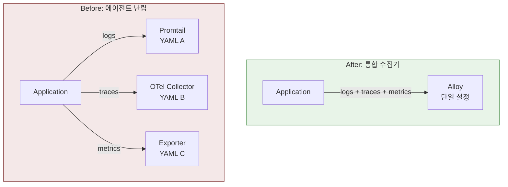
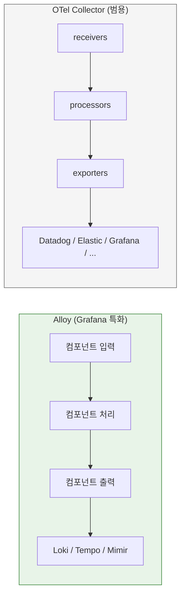
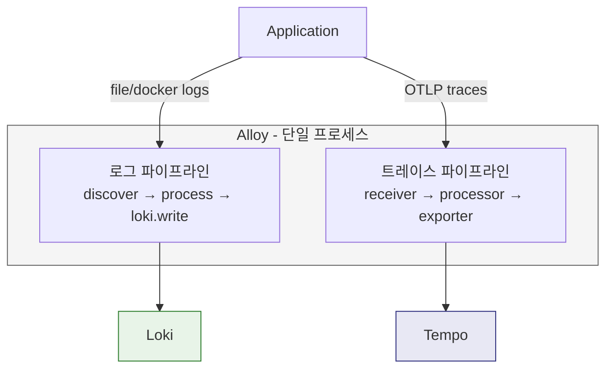
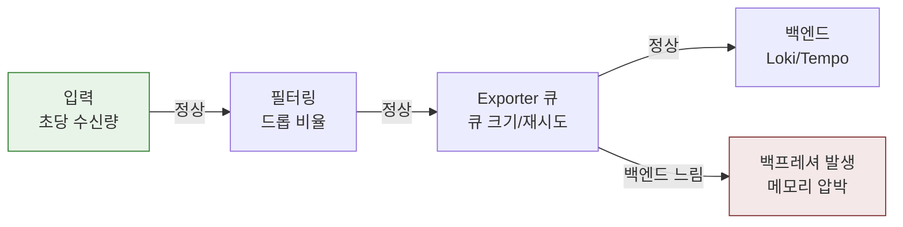

# Ch03. Grafana Alloy

**핵심 질문**: "Alloy는 OpenTelemetry Collector와 무엇이 같고, 무엇이 다른가?"

---

## 1. 통합 수집기가 없던 시절의 문제

Observability를 구축하려면 애플리케이션이 내보내는 신호(로그, 메트릭, 트레이스)를 받아서 저장소로 보내는 수집 계층이 필요하다. 문제는 이 수집 계층이 신호 종류별로 분리되어 있었다는 점이다.

**에이전트 난립.** 로그는 Promtail, 메트릭은 Prometheus exporter + scrape, 트레이스는 OpenTelemetry Collector — 신호마다 별도 에이전트를 운영해야 했다. 노드 하나에 에이전트가 2~3개씩 떠 있으면 리소스 소모도 문제지만, 각각의 설정 파일 형식과 배포 주기가 다르기 때문에 운영 부담이 선형적으로 늘어난다.

**설정 파편화.** Promtail은 YAML 기반 `scrape_configs`, OTel Collector는 YAML 기반 `receivers/processors/exporters`, Prometheus는 또 다른 YAML 구조를 쓴다. 라벨 붙이는 방식, 필터링 문법, 재시작 방식이 전부 다르므로 운영자가 기억해야 할 지식이 분산된다.

**장애 추적의 어려움.** 데이터가 안 보일 때 "애플리케이션이 안 보냈나, 수집기가 버렸나, 저장소가 못 받았나"를 구분해야 하는데, 수집 계층 자체가 여러 프로세스로 흩어져 있으면 원인 좁히기가 까다롭다. 로그 수집기는 잘 도는데 트레이스 수집기만 죽어 있는 상황을 생각하면 된다.



이런 문제를 해결하기 위해 등장한 것이 "하나의 프로세스로 모든 신호를 수집하는 통합 수집기"라는 아이디어이고, Grafana 생태계에서 그 구현체가 Alloy다.

---

## 2. Alloy란 무엇인가

Grafana Alloy는 **OpenTelemetry Collector 기반의 통합 telemetry 수집기**다.

로그, 메트릭, 트레이스를 하나의 프로세스에서 받아서 처리하고, Loki, Tempo, Prometheus/Mimir 같은 백엔드로 보낸다. OTel Collector의 receiver-processor-exporter 사고방식을 그대로 계승하면서, Grafana 스택에 맞춘 운영 경험을 제공하는 것이 핵심이다.

Alloy를 "완전히 새로운 종류의 도구"로 보는 것은 부정확하다. OTel Collector가 범용 수집기라면, Alloy는 그 위에 Grafana 생태계의 운영 편의성(컴포넌트 그래프 문법, Grafana 백엔드 네이티브 연결, Promtail 마이그레이션 경로)을 얹은 **특화 수집기**다.

---

## 3. OTel Collector와의 관계

Alloy를 이해하려면 OTel Collector와의 공통점과 차이점을 정확히 구분해야 한다. 면접에서도 "둘이 뭐가 다른가?"라는 질문이 나올 수 있다.

### 공통점: 수집기 아키텍처

둘 다 동일한 세 단계 파이프라인 모델을 따른다.

1. **Receive** — 데이터 소스에서 신호를 받는다 (OTLP, file, scrape 등)
2. **Process** — 필터링, 배치, 변환, 라벨링을 수행한다
3. **Export** — 백엔드로 최종 전송한다

이 구조가 같다는 것은, OTel Collector를 이해한 사람이라면 Alloy의 개념을 새로 배울 필요가 없다는 뜻이다. 파이프라인 사고방식이 동일하기 때문이다.

### 차이점: 설정 문법과 생태계 통합

| 항목 | OTel Collector | Alloy |
|------|---------------|-------|
| 설정 형식 | YAML (receivers/processors/exporters 섹션) | HCL 유사 문법 (컴포넌트 그래프) |
| 파이프라인 연결 | `service.pipelines`에서 이름으로 연결 | 컴포넌트 간 `.output`/`.receiver` 참조로 연결 |
| 신호 범위 | 범용 (모든 백엔드) | Grafana 스택 최적화 (Loki, Tempo, Mimir) |
| 로그 수집 | `filelog` receiver 등 | `loki.source.*` + Promtail 마이그레이션 경로 |
| 디버깅 | `zpages`, logging exporter | 내장 UI (`localhost:12345`), 컴포넌트 상태 시각화 |



OTel Collector는 백엔드에 구애받지 않는 범용 도구이고, Alloy는 Grafana 스택 운영에 맞춰 설정과 디버깅 경험을 정리한 도구다. 이미 Grafana 스택(Loki + Tempo + Mimir/Prometheus)을 쓰고 있다면 Alloy가 자연스럽고, 백엔드가 Datadog이나 Elastic이라면 OTel Collector가 더 적합하다.

---

## 4. 컴포넌트 그래프: Alloy 설정 읽는 법

Alloy 설정의 가장 큰 특징은 **컴포넌트 그래프** 모델이다. 설정이 순차적인 목록이 아니라, 컴포넌트 간 데이터가 흐르는 방향 그래프로 구성된다.

### 기본 문법

```alloy
component.type "name" {
  key = value
}
```

예를 들어 Docker 로그 수집 대상을 찾는 컴포넌트는 이렇게 생겼다.

```alloy
discovery.docker "containers" {
  host = "unix:///var/run/docker.sock"
}
```

- `discovery.docker`: 컴포넌트 종류 (Docker에서 수집 대상 탐색)
- `"containers"`: 이 컴포넌트 인스턴스의 이름
- `host = ...`: 설정값

### 컴포넌트 간 연결

컴포넌트는 다른 컴포넌트의 출력을 참조해서 연결된다.

```alloy
discovery.docker "containers" { ... }

discovery.relabel "filter" {
  targets = discovery.docker.containers.targets  // 앞 컴포넌트의 출력 참조
  rule { ... }
}

loki.source.docker "logs" {
  targets = discovery.relabel.filter.output
  forward_to = [loki.write.default.receiver]
}
```

이 연결 방식이 중요한 이유는 **데이터 흐름이 설정 파일에 명시적으로 드러나기** 때문이다. OTel Collector의 YAML에서는 `service.pipelines` 섹션에서 이름으로 연결하므로 흐름을 한눈에 파악하기 어렵지만, Alloy에서는 컴포넌트 A의 출력이 컴포넌트 B의 입력으로 직접 연결되므로 데이터가 어디서 어디로 흐르는지 설정만 읽어도 알 수 있다.


---

## 5. 파이프라인 예시: 로그와 트레이스

Alloy의 4단계 책임(Discover → Process → Route → Export)이 실제 설정에서 어떻게 나타나는지 두 가지 파이프라인으로 확인한다.

### 로그 파이프라인

Docker 컨테이너 로그를 Loki로 보내는 전형적인 흐름이다.

| 단계 | 컴포넌트 | 역할 |
|------|----------|------|
| Discover | `discovery.docker` | 실행 중인 컨테이너 목록 탐색 |
| Process | `discovery.relabel` → `loki.process` | 대상 필터링, 라벨 정리, 멀티라인 합치기 |
| Route | `loki.source.docker` | 로그를 읽어서 다음 단계로 전달 |
| Export | `loki.write` | Loki HTTP endpoint로 최종 전송 |

여기서 핵심은 Alloy가 "로그를 그대로 복사해서 보내는 도구"가 아니라는 점이다. 대상 탐색, 라벨 정리, 멀티라인 합치기, 불필요한 로그 드롭까지 수집 시점에 처리할 수 있으므로, 저장소에 도달하는 데이터의 품질과 비용을 수집 계층에서 통제할 수 있다.

### 트레이스 파이프라인

애플리케이션이 OTLP로 내보낸 트레이스를 Tempo로 보내는 흐름이다.

| 단계 | 컴포넌트 | 역할 |
|------|----------|------|
| Receive | `otelcol.receiver.otlp` | gRPC/HTTP로 OTLP span 수신 |
| Process | `otelcol.processor.batch` → `otelcol.processor.filter` | 배치 처리, 노이즈 span 제거 |
| Export | `otelcol.exporter.otlphttp` | Tempo로 최종 전송 |

이 구조는 OTel Collector의 receiver → processor → exporter 패턴과 사실상 동일하다. 다만 Alloy에서는 컴포넌트 그래프 문법으로 표현되므로, 같은 프로세스 안에서 로그 파이프라인과 트레이스 파이프라인이 나란히 존재하면서 각각 다른 백엔드로 라우팅된다.



---

## 6. Alloy가 해결한 것

### 에이전트 통합

Promtail(로그) + OTel Collector(트레이스) + Prometheus exporter(메트릭)을 각각 운영하던 구조가 Alloy 하나로 수렴된다. 노드당 에이전트 수가 줄고, 설정 형식이 통일되고, 배포/업그레이드 대상이 하나로 줄어든다.

### 설정 가시성

컴포넌트 그래프 모델 덕분에 데이터 흐름이 설정 파일에 명시적으로 표현된다. "이 로그가 어디로 가는가?"라는 질문에 설정 파일만 읽으면 답할 수 있다. 또한 Alloy의 내장 UI(`localhost:12345`)에서 컴포넌트별 상태(healthy/unhealthy, 처리량, 에러)를 실시간으로 확인할 수 있어서 장애 추적이 쉬워진다.

### Grafana 스택 네이티브 연결

Loki, Tempo, Mimir에 대한 전용 컴포넌트(`loki.write`, `otelcol.exporter.otlphttp` 등)가 내장되어 있어서, 별도 어댑터 없이 Grafana 백엔드에 직접 연결된다. Promtail에서 Alloy로의 마이그레이션 가이드도 공식 문서에 제공되므로, 기존 Loki 사용자의 전환 비용이 낮다.

---

## 7. Promtail과의 차이: 이름만 바뀐 것이 아닌 이유

Alloy를 "Promtail 후속판" 정도로 이해하면 범위를 너무 좁게 보는 것이다.

| 항목 | Promtail | Alloy |
|------|----------|-------|
| 수집 대상 | 로그만 | 로그, 메트릭, 트레이스 |
| 연결 백엔드 | Loki 전용 | Loki + Tempo + Mimir + 기타 |
| 설정 모델 | 로그 파이프라인 중심 (YAML) | 컴포넌트 그래프 (HCL 유사) |
| 프로젝트 상태 | 유지보수 모드 (신규 기능 추가 중단) | 현재 표준 경로 (활발히 개발 중) |

Promtail은 "Loki에 로그를 보내는 전용 에이전트"였다. Alloy는 "Grafana 스택 전체에 모든 신호를 보내는 통합 수집기"다. 이 차이는 단순한 이름 변경이 아니라, **수집 계층의 아키텍처가 전용 에이전트에서 통합 수집기로 전환**된 것이다.

신규 구축에서는 Alloy가 기본 선택이고, 기존 Promtail 환경도 점진적으로 Alloy로 마이그레이션하는 것이 Grafana Labs의 권장 방향이다.

---

## 8. 운영 관점에서 중요한 것

Alloy를 운영할 때 가장 자주 만나는 문제는 **수집 파이프라인의 병목과 데이터 유실**이다.

### 핵심 모니터링 포인트

| 관점 | 확인 사항 | 왜 중요한가 |
|------|----------|------------|
| 입력량 | 초당 수신 로그/span 수 | 예상보다 많으면 리소스 부족, 적으면 수집 누락 의심 |
| 필터링 효과 | 드롭된 데이터 비율 | 의도대로 불필요 데이터가 걸러지는지 확인 |
| 백프레셔 | exporter 큐 크기, 재시도 횟수 | 백엔드가 느리면 Alloy에 데이터가 쌓여 메모리 압박 |
| 라벨 일관성 | resource attributes와 라벨 매핑 | 불일치하면 Grafana에서 상관분석이 깨짐 |

### 내장 디버깅 UI

Alloy는 기본적으로 `http://localhost:12345`에서 내장 UI를 제공한다. 이 UI에서 컴포넌트 그래프를 시각적으로 확인하고, 각 컴포넌트의 상태(healthy/unhealthy)와 처리량을 실시간으로 볼 수 있다. "데이터가 안 보인다"는 문제가 발생했을 때, 어느 컴포넌트에서 막히고 있는지를 빠르게 좁히는 첫 번째 도구다.



---

## 9. 어떤 환경에 적합하고, 어디서 한계가 있는가

### Alloy가 강한 환경

**Grafana 스택 사용자.** Loki + Tempo + Mimir/Prometheus를 이미 쓰고 있거나 도입 예정이라면, Alloy가 가장 자연스러운 수집기다. 전용 컴포넌트가 내장되어 있어 설정이 간결하고, Grafana Labs가 통합 테스트를 보장한다.

**Kubernetes 환경.** DaemonSet으로 배포해서 노드별 로그를 수집하고, 동시에 애플리케이션의 OTLP 트레이스도 받을 수 있다. 에이전트 하나로 두 신호를 처리하므로 노드당 리소스 사용량이 줄어든다.

**Promtail 마이그레이션.** 기존 Promtail 설정을 Alloy 형식으로 변환하는 공식 도구(`alloy convert`)가 제공되므로, 기존 환경의 전환 비용이 낮다.

### Alloy가 맞지 않는 환경

**비-Grafana 백엔드.** Datadog, Elastic APM, Splunk 같은 백엔드를 사용한다면 OTel Collector가 더 적합하다. Alloy의 강점은 Grafana 스택과의 네이티브 연결에 있으므로, 다른 생태계에서는 그 이점이 줄어든다.

**극도로 커스텀한 처리 로직.** OTel Collector는 Go로 커스텀 processor를 작성해 빌드할 수 있는 반면, Alloy는 내장 컴포넌트 중심으로 동작한다. 수집 시점에 복잡한 변환이나 비표준 프로토콜 처리가 필요하면 OTel Collector의 확장성이 더 유리하다.

---

## 10. 면접에서 설명한다면

### "Alloy가 무엇인가요?"

Grafana Alloy는 OTel Collector 기반의 통합 telemetry 수집기입니다. 로그, 메트릭, 트레이스를 하나의 프로세스에서 받아 처리하고, Grafana 스택의 각 백엔드(Loki, Tempo, Mimir)로 라우팅합니다. 기존에 신호별로 별도 에이전트를 운영하던 구조를 하나로 통합해서 운영 복잡도를 줄이는 것이 핵심 가치입니다.

### "OTel Collector와 뭐가 다른가요?"

파이프라인 아키텍처(receive → process → export)는 동일합니다. 차이는 설정 문법과 생태계 통합에 있습니다. Alloy는 컴포넌트 그래프 모델로 데이터 흐름을 명시적으로 표현하고, Grafana 백엔드에 대한 전용 컴포넌트가 내장되어 있어 설정이 간결합니다. OTel Collector가 백엔드에 구애받지 않는 범용 도구라면, Alloy는 Grafana 스택에 특화된 도구입니다.

### "Promtail은 안 쓰나요?"

Promtail은 유지보수 모드에 들어갔고, 신규 환경에서는 Alloy가 표준입니다. Promtail은 로그 전용이었지만 Alloy는 로그 + 메트릭 + 트레이스를 모두 다루므로, 단순한 이름 변경이 아니라 수집 계층의 아키텍처 전환입니다.

### "운영할 때 가장 주의할 점은?"

수집 파이프라인의 백프레셔입니다. 백엔드가 느려지면 Alloy에 데이터가 쌓여 메모리 압박이 발생하고, 최악의 경우 데이터 유실로 이어집니다. 입력량, 드롭 비율, exporter 큐 상태를 모니터링하는 것이 핵심이며, 내장 UI에서 컴포넌트별 상태를 확인할 수 있습니다.
