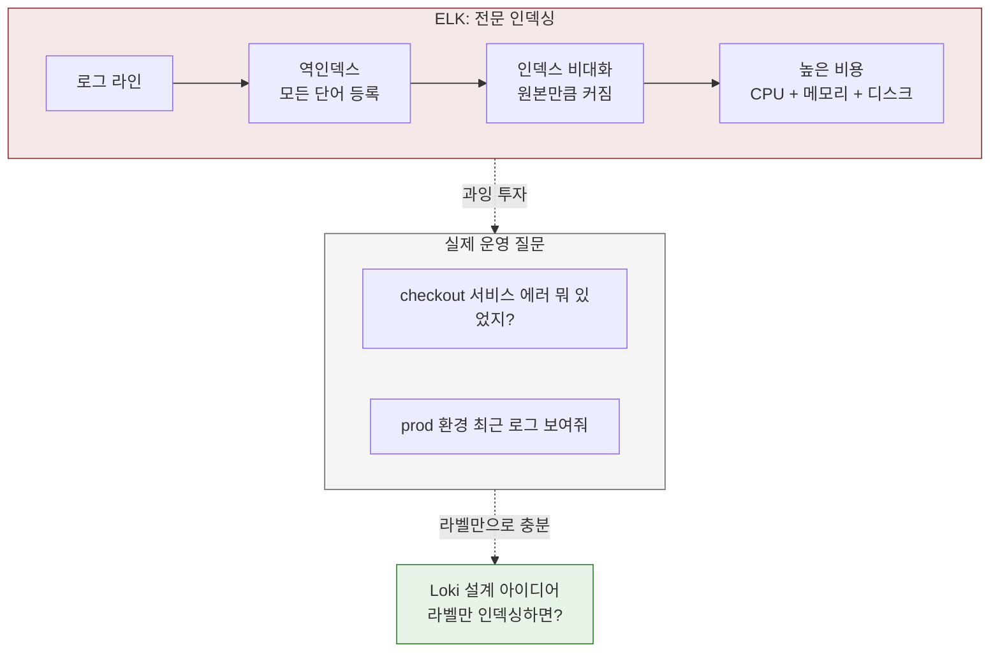
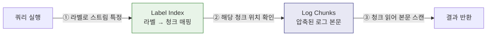
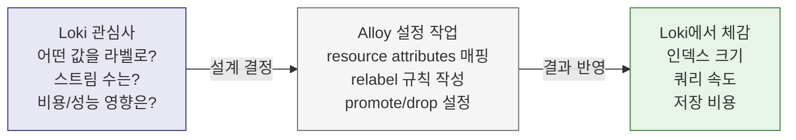
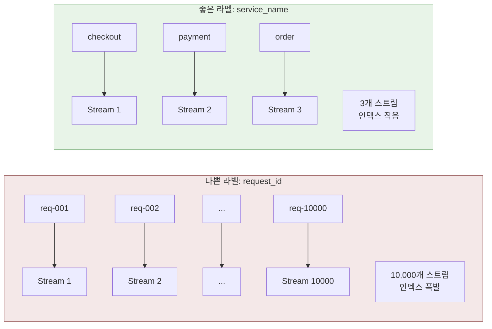
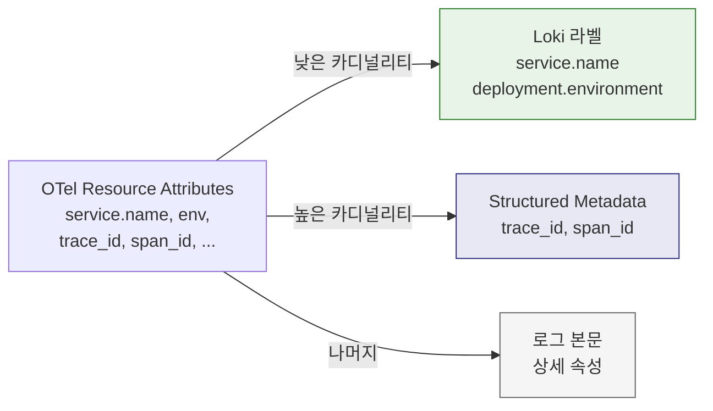
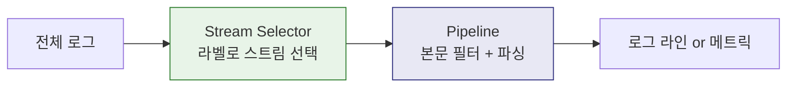
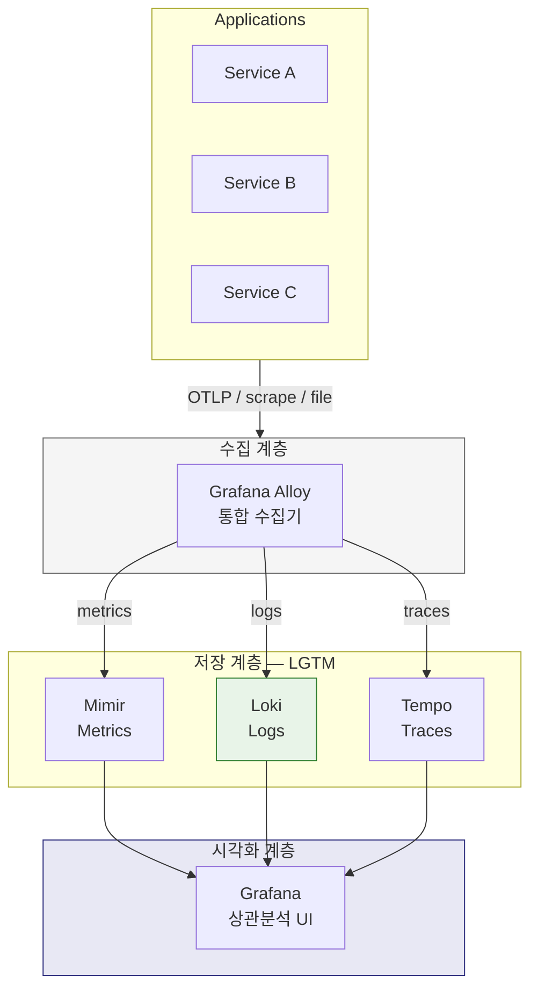
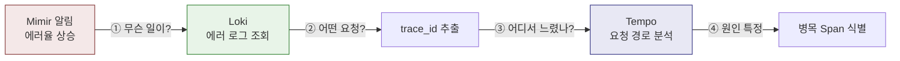

# Ch04. Grafana Loki

**핵심 질문**: "Loki는 왜 로그 본문 전체가 아니라 라벨만 인덱싱하는가?"

---

## 1. Loki가 없던 시절의 문제

로그를 중앙에서 모아 보겠다는 요구는 오래전부터 있었고, 대표적인 해결책이 ELK(Elasticsearch + Logstash + Kibana) 스택이었다. ELK는 로그 본문 전체를 역인덱싱(inverted index)하기 때문에 자유로운 전문 검색이 가능하다는 장점이 있다. 그런데 이 접근에는 대가가 따른다.

**비용 구조의 문제.** Elasticsearch는 로그 한 줄이 들어올 때마다 본문의 모든 단어를 인덱스에 등록한다. 로그가 하루 수백 GB씩 쌓이는 환경에서는 인덱스 자체가 원본 데이터만큼 커지기도 한다. 저장 비용뿐 아니라 인덱싱에 필요한 CPU와 메모리도 비례해서 늘어나므로, 운영 규모가 커질수록 클러스터 확장 비용이 가파르게 상승한다.

**운영 복잡도의 문제.** Elasticsearch 클러스터는 샤드 배분, 인덱스 lifecycle 관리, JVM 힙 튜닝, 노드 간 데이터 재배치 같은 운영 부담이 크다. 소규모 팀이 로그 저장소를 직접 운영하기에는 진입 장벽이 높고, 장애 발생 시 복구도 까다롭다.

**실제로 자주 하는 질문과의 괴리.** 운영 환경에서 로그를 볼 때 가장 흔한 질문은 "checkout 서비스에서 최근 에러가 뭐가 있었지?"처럼 서비스명과 심각도를 기준으로 좁히는 패턴이다. 본문 전체를 자유롭게 검색할 일은 생각보다 많지 않다. 그렇다면 모든 로그를 전문 인덱싱하는 비용을 굳이 지불해야 할까?



이 질문에서 Loki의 설계가 시작된다.

---

## 2. Loki란 무엇인가

Grafana Loki는 **라벨 기반 인덱싱을 사용하는 로그 저장소**다.

Elasticsearch가 "모든 단어를 인덱싱해서 무엇이든 검색 가능하게"라는 철학이라면, Loki는 "메타데이터만 인덱싱하고 로그 본문은 압축 저장만 한다"는 철학이다. 이 접근은 Prometheus의 시계열 라벨 모델에서 직접 영감을 받았다. Prometheus가 메트릭을 `{job="api", instance="10.0.0.1"}` 같은 라벨로 구분하듯, Loki도 로그를 `{service_name="checkout", level="error"}` 같은 라벨로 구분한다.

공식 문서에서 Loki를 "like Prometheus, but for logs"라고 소개하는 이유가 여기에 있다. 메트릭 시스템에서 검증된 라벨 기반 모델을 로그 영역에 적용한 것이다.

---

## 3. 내부 구조: 라벨, 스트림, 청크

Loki의 저장 구조를 이해하려면 세 가지 개념이 필요하다.

### 라벨(Label)과 스트림(Stream)

라벨은 로그 스트림을 구분하는 키-값 메타데이터다. 동일한 라벨 조합을 가진 로그 라인들이 하나의 스트림을 형성한다.

```
# 이 두 로그는 같은 스트림에 속한다
{service_name="checkout", env="prod", level="error"} 2026-03-13T10:00:01 connection timeout
{service_name="checkout", env="prod", level="error"} 2026-03-13T10:00:02 retry failed
```

스트림은 Loki 성능의 핵심 단위다. 라벨 조합이 달라지면 새로운 스트림이 생기고, 스트림 수가 곧 인덱스 크기를 결정한다.

### 청크(Chunk)

실제 로그 데이터는 청크 단위로 압축 저장된다. 하나의 스트림에 속한 로그 라인들이 시간순으로 청크에 쌓이고, 청크가 일정 크기에 도달하면 객체 스토리지(S3, GCS 등)나 파일시스템에 플러시된다.

### 인덱스

인덱스에는 "어떤 라벨 조합이 어떤 청크를 가리키는가"만 저장된다. 로그 본문의 단어는 인덱스에 들어가지 않는다. 그래서 인덱스가 작고, 저장 비용이 낮다.



쿼리가 실행되면 먼저 라벨 인덱스에서 대상 스트림을 찾고, 해당 스트림의 청크를 읽어서 본문을 순차 스캔한다. 본문 검색이 브루트포스에 가깝기 때문에, 라벨로 대상을 얼마나 좁히느냐가 쿼리 성능을 결정한다.

---

## 4. Loki가 해결한 것

이 구조가 ELK 시절의 문제를 어떻게 풀었는지 정리하면 다음과 같다.

**저장 비용 절감.** 인덱스에 로그 본문이 들어가지 않으므로 인덱스 크기가 극적으로 줄어든다. Grafana Labs의 벤치마크에 따르면 동일 로그 볼륨 대비 인덱스 크기가 Elasticsearch의 1/100 이하인 경우도 있다. 로그 본문은 압축 저장만 하고, 장기 보관은 S3 같은 저렴한 객체 스토리지를 쓸 수 있으므로 TB 단위 로그도 비용 부담이 낮다.

**운영 단순화.** Elasticsearch처럼 샤드 관리, JVM 튜닝, 노드 간 데이터 재배치를 신경 쓸 필요가 없다. 단일 바이너리로 실행할 수도 있고, 마이크로서비스 모드로 확장할 수도 있다. 저장소가 객체 스토리지이므로 상태 관리 부담이 적다.

**Kubernetes 환경과의 자연스러운 결합.** Kubernetes는 이미 Pod마다 `namespace`, `container`, `pod` 같은 라벨을 갖고 있다. Loki는 이 라벨을 그대로 로그 스트림의 라벨로 사용할 수 있어서, 별도 설정 없이도 "어떤 네임스페이스의 어떤 서비스 로그"를 바로 조회할 수 있다. 라벨 기반 사고방식이 Kubernetes의 운영 모델과 일치하기 때문에, K8s 환경에서 Loki의 도입 비용이 낮다.

---

## 5. 라벨 전략: Loki 운영의 핵심

라벨을 실제로 붙이는 곳은 수집기(Alloy)이지만, 라벨 설계의 결과를 감당하는 곳은 Loki다. 라벨 조합이 스트림 수를 결정하고, 스트림 수가 인덱스 크기를 결정하고, 인덱스 크기가 비용과 쿼리 성능을 결정하기 때문이다. 그래서 **"어떤 값을 라벨로 올릴 것인가"는 Loki의 설계 결정**이고, **"어떻게 올릴 것인가"는 Alloy의 설정 작업**이다.



Loki를 운영할 때 가장 자주 문제가 되는 지점은 **고카디널리티 라벨**이다. 라벨 조합마다 별도의 스트림이 생성되므로, 라벨 값의 종류가 많아지면 스트림 수가 폭발적으로 증가한다.

### 왜 위험한가

`request_id`를 라벨로 넣는 상황을 생각해 보자. 요청마다 고유한 값이 들어가므로, 요청 1만 건이면 스트림 1만 개가 생긴다. 각 스트림마다 인덱스 엔트리와 청크가 생성되므로, 결국 "인덱스를 작게 유지한다"는 Loki의 핵심 전제가 무너진다. 이 상태에서는 Elasticsearch보다 오히려 성능이 나빠질 수도 있다.



### 라벨 선택 기준

라벨로 올려야 하는 값과 올리지 말아야 하는 값을 구분하는 기준은 **카디널리티**(고유 값의 수)와 **조회 패턴**이다.

| 구분 | 예시 | 이유 |
|------|------|------|
| 라벨로 적합 | `service_name`, `namespace`, `env`, `level` | 값의 종류가 수십 개 이내, 집계/필터링에 자주 사용 |
| 라벨로 부적합 | `request_id`, `user_id`, `trace_id`, `url_path` | 값이 거의 매번 달라짐, 스트림 폭발 유발 |

부적합한 값은 어디에 넣어야 할까? Loki 3.0부터 지원하는 **Structured Metadata**에 저장하거나, 로그 본문에 JSON 필드로 남기면 된다. Structured Metadata는 인덱스에는 들어가지 않지만 LogQL에서 필터링할 수 있어서, 고카디널리티 값을 다루기에 적절하다.

### OTel 로그와의 관계

OpenTelemetry로 로그를 수집하면 resource attributes에 `service.name`, `deployment.environment` 같은 값이 자동으로 붙는다. 이 중 어떤 속성을 Loki 라벨로 승격(promote)할지 결정하는 것이 OTel-Loki 연동의 핵심 설계 포인트다.

실무에서는 보통 이렇게 나눈다.

- **라벨로 승격**: `service.name`, `deployment.environment` — 조회 축으로 항상 사용
- **Structured Metadata**: `trace_id`, `span_id` — 건별 추적에 필요하지만 카디널리티가 높음
- **본문에 유지**: 나머지 상세 속성



---

## 6. LogQL: 로그 조회와 파생 메트릭

Loki는 **LogQL**이라는 쿼리 언어로 로그를 조회한다. PromQL의 문법 감각을 로그 영역에 가져온 것으로, 두 부분으로 구성된다.

### Stream Selector + Pipeline

```logql
{service_name="checkout", level="error"} |= "timeout"
```

- `{service_name="checkout", level="error"}`: 라벨로 스트림을 선택한다 (Stream Selector)
- `|= "timeout"`: 본문에서 "timeout"이 포함된 라인만 필터링한다 (Pipeline)

Stream Selector가 먼저 인덱스를 타고 대상 청크를 좁힌 뒤, Pipeline이 청크 안에서 본문을 스캔한다. 그래서 Stream Selector가 넓으면(라벨을 적게 지정하면) 스캔할 청크가 많아져서 느려지고, 좁으면 빠르다. 이 동작 방식을 이해하면 "왜 라벨 설계가 쿼리 성능을 결정하는가"가 자연스럽게 연결된다.

### Pipeline 연산자

| 연산자 | 역할 | 예시 |
|--------|------|------|
| `\|=` | 문자열 포함 | `\|= "error"` |
| `!=` | 문자열 제외 | `!= "healthcheck"` |
| `\|~` | 정규식 매칭 | `\|~ "status=[45]\\d{2}"` |
| `\| json` | JSON 파싱 | `\| json \| level="error"` |
| `\| logfmt` | logfmt 파싱 | `\| logfmt \| duration > 1s` |
| `\| line_format` | 출력 포맷 변경 | `\| line_format "{{.method}} {{.status}}"` |
| `\| label_format` | 라벨 값 변환 | `\| label_format level=\`{{ToUpper .level}}\`` |
| `\| unpack` | packed JSON 추출 | `\| unpack` |

`| json`이나 `| logfmt`를 쓰면 로그 본문의 필드를 파싱해서 필터 조건으로 사용할 수 있다. 인덱싱되지 않은 값도 쿼리 시점에 파싱해서 사용할 수 있다는 뜻이다. 대신 런타임 파싱이므로 스캔 범위가 넓으면 느려진다.

### 실무 쿼리 예제

#### 기본 필터링 — 특정 서비스의 에러 로그 조회

```logql
# checkout 서비스에서 error 레벨 로그 중 "timeout" 포함 라인
{service_name="checkout", level="error"} |= "timeout"

# healthcheck 요청은 제외하고 error 로그만
{namespace="prod"} |= "error" != "healthcheck" != "readiness"

# 정규식으로 4xx/5xx 상태 코드 필터링
{service_name="api-gateway"} |~ "status=(4|5)\\d{2}"
```

#### JSON 로그 파싱 — 구조화된 로그에서 필드 추출

실무에서 대부분의 로그는 JSON 형태로 출력된다. `| json`을 쓰면 JSON 필드를 파싱해 필터 조건이나 출력 형식에 활용할 수 있다.

```logql
# JSON 로그에서 status 필드가 500인 라인만
{service_name="order-api"}
  | json
  | status = 500

# 특정 JSON 필드만 추출해서 파싱 (성능 최적화)
{service_name="order-api"}
  | json status="status", method="method", path="path"
  | status >= 400

# 중첩 JSON에서 깊은 필드 접근
# 로그: {"request": {"user_id": "u-123", "action": "purchase"}}
{service_name="checkout"}
  | json
  | request_action="purchase"
```

`| json`은 모든 필드를 파싱하므로, 필드가 많은 로그에서는 `| json status="status"` 처럼 필요한 필드만 지정하는 것이 빠르다.

#### logfmt 파싱 — key=value 형식 로그

```logql
# logfmt 로그에서 duration이 1초 이상인 느린 요청
# 로그: level=info method=POST path=/api/orders duration=2.3s status=200
{service_name="api"}
  | logfmt
  | duration > 1s

# method와 status로 필터링
{service_name="api"}
  | logfmt
  | method="POST" and status >= 400
```

#### 패턴 매칭 — 비정형 로그에서 값 추출

`| pattern`은 정형화되지 않은 로그에서 위치 기반으로 값을 추출한다. JSON이나 logfmt이 아닌 로그에 유용하다.

```logql
# 로그: 2026-03-13 10:00:01 INFO [checkout] User u-123 purchased item i-456
{service_name="checkout"}
  | pattern "<_> <_> <level> [<service>] User <user_id> purchased item <item_id>"
  | user_id="u-123"
```

#### 출력 포맷 변경 — line_format

`| line_format`은 Go의 text/template 문법으로 출력 형태를 바꾼다. 대시보드에서 로그를 간결하게 보고 싶을 때 유용하다.

```logql
# JSON 로그를 "메서드 경로 → 상태코드 (걸린시간)" 형태로 변환
{service_name="api-gateway"}
  | json
  | line_format "{{.method}} {{.path}} → {{.status}} ({{.duration}})"

# 타임스탬프 + 메시지만 출력
{namespace="prod", level="error"}
  | json
  | line_format "{{.ts}} | {{.msg}}"
```

#### IP 기반 필터링 — 네트워크 분석

```logql
# 특정 IP 대역에서 온 요청만
{service_name="nginx"} |~ "10\\.255\\.17\\.\\d+"

# 특정 IP를 제외한 접근 로그
{service_name="nginx"} != "10.255.17.1" != "127.0.0.1"
```

### 파생 메트릭 (Metric Queries)

LogQL의 또 다른 강점은 로그에서 메트릭을 계산하는 것이다. 별도 메트릭 수집 파이프라인 없이도 로그 데이터만으로 추세를 파악할 수 있다.

#### rate — 초당 발생률

```logql
# checkout 서비스 에러 로그의 초당 발생률 (5분 윈도우)
rate({service_name="checkout"} |= "error" [5m])

# 서비스별 에러율 비교 (Grafana 대시보드용)
sum by (service_name) (
  rate({namespace="prod"} |= "error" [5m])
)
```

#### count_over_time — 시간 구간별 건수

```logql
# 지난 1시간 동안 5분 단위로 에러 로그 건수
count_over_time({service_name="checkout", level="error"} [5m])

# 서비스별 로그 총 건수 (볼륨 파악)
sum by (service_name) (
  count_over_time({namespace="prod"} [1h])
)
```

#### bytes_over_time — 로그 볼륨 추적

```logql
# 서비스별 로그 볼륨 (바이트) — 어떤 서비스가 로그를 많이 쏟는지 파악
sum by (service_name) (
  bytes_over_time({namespace="prod"} [1h])
)
```

이 쿼리는 비용 관리에 실질적으로 유용하다. 어떤 서비스가 로그를 과도하게 생성하는지 파악해서, 불필요한 debug 로그를 줄이거나 샘플링을 적용하는 의사결정에 쓸 수 있다.

#### quantile_over_time — 응답 시간 분포

```logql
# JSON 로그의 duration 필드로 P95 응답 시간 계산
quantile_over_time(0.95,
  {service_name="api-gateway"}
    | json
    | unwrap duration(duration)
  [5m]
) by (service_name)
```

`unwrap`은 파싱한 필드를 숫자값으로 변환해서 집계 함수에 전달한다. 이렇게 하면 메트릭을 별도로 수집하지 않아도 로그에서 레이턴시 분포를 뽑아낼 수 있다. 다만 대량 로그를 런타임 파싱하므로, Prometheus/Mimir의 메트릭 대비 쿼리 비용이 높다는 점은 인지해야 한다.

#### 복합 쿼리 — 에러율 비율 계산

```logql
# 전체 요청 중 에러 비율 (%) — Grafana 패널에 유용
sum(rate({service_name="checkout"} |= "error" [5m]))
/
sum(rate({service_name="checkout"} [5m]))
* 100
```

### 실전 장애 대응 쿼리 모음

실무에서 자주 쓰는 장애 대응 패턴을 정리하면 다음과 같다.

```logql
# 1. 최근 30분간 에러가 가장 많은 서비스 Top 5
topk(5,
  sum by (service_name) (
    count_over_time({namespace="prod", level="error"} [30m])
  )
)

# 2. 특정 trace_id로 분산 요청 경로 추적
{namespace="prod"} |= "abc-123-trace-id"

# 3. 느린 쿼리 탐지 (DB 로그에서 1초 이상 쿼리)
{service_name="order-db"}
  | json
  | unwrap duration(query_time)
  | query_time > 1s

# 4. 특정 시간대 에러 스파이크 분석
{service_name="payment", level="error"}
  | json
  | line_format "{{.error_code}}: {{.message}}"

# 5. 배포 직후 에러 모니터링 (최근 10분)
{namespace="prod", level="error"}
  | json
  | ts >= "2026-03-13T10:00:00Z"
```



---

## 7. 어떤 환경에 적합하고, 어디서 한계가 있는가

### Loki가 강한 환경

**Kubernetes / 마이크로서비스.** 서비스별, 네임스페이스별 라벨이 이미 존재하고, 로그를 "어떤 서비스의 어떤 환경"으로 좁혀서 보는 패턴이 지배적인 환경이다. 라벨 기반 모델과 운영 모델이 자연스럽게 일치한다.

**비용 민감한 환경.** 로그 볼륨이 크지만 예산이 제한적인 경우, Elasticsearch 클러스터를 운영하는 것보다 Loki + 객체 스토리지 조합이 비용 효율적이다. 특히 장기 보관(retention) 요구가 있을 때 객체 스토리지의 저렴한 저장 단가가 큰 차이를 만든다.

**Grafana 생태계를 이미 사용하는 환경.** Prometheus로 메트릭을 보고, Tempo로 트레이스를 보는 팀이라면, Loki를 추가하면 Grafana 하나로 로그-메트릭-트레이스 상관분석이 가능해진다. 도구 간 전환 없이 trace_id로 로그와 트레이스를 오가는 워크플로우가 이 스택의 핵심 가치다.

### Loki가 맞지 않는 환경

**보안/컴플라이언스 로그 분석.** SIEM(Security Information and Event Management)처럼 로그 본문 전체에 대한 고급 검색, 상관 규칙, 실시간 알림이 필요한 경우에는 Elasticsearch나 Splunk의 전문 인덱싱이 더 적합하다. Loki의 브루트포스 스캔은 "특정 IP가 지난 30일간 접근한 모든 엔드포인트"같은 넓은 범위의 본문 검색에서 느려진다.

**로그 본문 기반 복잡한 분석.** 비정형 로그에서 패턴을 추출하거나, 여러 필드를 조합한 복잡한 집계를 실시간으로 해야 하는 경우에는 전문 검색 엔진의 인덱싱 능력이 필요하다.

### Elasticsearch(ELK)와의 비교

| 항목 | Loki | Elasticsearch |
|------|------|---------------|
| 인덱싱 대상 | 라벨(메타데이터)만 | 로그 본문 전체(역인덱스) |
| 저장소 | 객체 스토리지(S3, GCS) | 자체 클러스터(노드별 디스크) |
| 인덱스 크기 | 원본 대비 극히 작음 | 원본과 비슷하거나 더 클 수 있음 |
| 검색 방식 | 라벨로 좁히고 → 본문 순차 스캔 | 역인덱스로 즉시 매칭 |
| 운영 부담 | 낮음 (단일 바이너리 가능) | 높음 (샤드, JVM, 노드 관리) |
| 강점 | 비용 효율, K8s 친화, Grafana 통합 | 전문 검색, 복잡한 집계, SIEM |
| 약점 | 넓은 범위 본문 검색이 느림 | 대규모 환경 비용과 운영 복잡도 |

핵심은 이것이다. Loki는 "모든 로그 검색 문제의 정답"이 아니라, **운영 로그 저장소**라는 맥락에서 비용과 단순성을 택한 선택지다. 어떤 종류의 질문을 로그에 자주 던지는가에 따라 도구 선택이 달라져야 한다.

---

## 8. LGTM 아키텍처에서 Loki의 위치

### LGTM이란

Grafana 생태계에서 LGTM은 네 가지 컴포넌트의 조합을 뜻한다.

| 약자 | 컴포넌트 | 담당 신호 | 핵심 질문 |
|------|----------|----------|----------|
| **L** | Loki | Logs | "무슨 일이 있었는가?" |
| **G** | Grafana | Visualization | "한 화면에서 어떻게 연결하는가?" |
| **T** | Tempo | Traces | "어느 구간이 느렸는가?" |
| **M** | Mimir (또는 Prometheus) | Metrics | "추세가 어떻게 변하고 있는가?" |

이 네 컴포넌트는 독립적으로도 동작하지만, 함께 쓸 때 **상관분석**(correlation)이라는 핵심 가치가 만들어진다. 메트릭 알림에서 로그로, 로그에서 트레이스로 trace_id 하나로 오갈 수 있는 것이 LGTM 스택의 존재 이유다.

### 전체 데이터 흐름



이 그림에서 Loki의 위치는 명확하다. 애플리케이션이 내보낸 로그를 Alloy가 수집해서 Loki에 저장하고, Grafana가 이를 조회한다. Loki는 직접 데이터를 수집하지 않는다. 수집은 Alloy의 책임이고, Loki는 **저장과 쿼리**에만 집중한다.

### LGTM 스택의 공통 설계 철학

LGTM의 네 저장소(Loki, Tempo, Mimir)는 일관된 설계 철학을 공유한다.

- **인덱싱 최소화**: Loki는 라벨만, Tempo는 trace_id만, Mimir는 시계열 라벨만 인덱싱한다. 불필요한 인덱싱을 줄여 비용을 낮추는 접근이 스택 전체에 관통한다.
- **객체 스토리지 백엔드**: 세 저장소 모두 S3/GCS 같은 객체 스토리지를 백엔드로 쓸 수 있다. 상태를 저장소에 위임하므로 각 컴포넌트의 운영이 단순해진다.
- **Grafana를 통한 상관분석**: 개별 저장소가 독립적으로 검색을 완벽히 해결하려 하지 않고, Grafana UI에서 신호 간 전환을 통해 탐색한다.

이 철학을 이해하면 "왜 Loki는 전문 검색을 포기했는가?"라는 질문에 대한 답이 더 명확해진다. Loki 혼자 모든 로그 질문에 답하려는 것이 아니라, LGTM 스택 전체가 협력해서 답하는 구조이기 때문이다.

### 장애 분석 워크플로우

운영자가 실제로 LGTM 스택을 사용하는 흐름은 보통 이렇다.



1. **Mimir/Prometheus**: 메트릭 알림으로 이상을 감지한다 — "에러율이 3%에서 15%로 올랐다"
2. **Loki**: 해당 시간대의 에러 로그를 조회한다 — "checkout 서비스에서 payment timeout 다수 발생"
3. **trace_id**: 로그에서 trace_id를 클릭한다 — Grafana가 자동으로 Tempo 뷰로 전환
4. **Tempo**: trace를 열어 병목 span을 확인한다 — "payment-svc 외부 API 호출이 전체의 70%"

이 흐름에서 Loki는 "무슨 일이 있었는가?"를 빠르게 좁히는 출발점 역할을 한다. 메트릭이 "어딘가 이상하다"를 알려 주고, 로그가 "무슨 일인지"를 설명하고, 트레이스가 "정확히 어디서"를 보여 주는 구조다. 세 신호가 trace_id로 연결되지 않으면 각각을 따로 봐야 하므로 장애 분석 시간이 길어진다.

Grafana에서 이 전환이 클릭 한 번으로 가능하다는 것이 LGTM 스택의 핵심 UX이며, 이것이 개별 도구를 따로 쓰는 것과의 결정적인 차이다.

---

## 9. 면접에서 설명한다면

### "Loki가 무엇인가요?"

Grafana Loki는 로그 본문을 전문 인덱싱하지 않고 라벨 메타데이터만 인덱싱하는 로그 저장소입니다. Prometheus의 라벨 기반 모델을 로그에 적용한 것으로, 인덱스 크기를 극적으로 줄여 저장 비용을 낮추고 운영을 단순화합니다.

### "ELK 대비 장점은?"

인덱스가 작아서 저장 비용이 낮고, 객체 스토리지를 백엔드로 쓸 수 있어 장기 보관에 유리합니다. 또한 Kubernetes 라벨과 자연스럽게 연결되어 K8s 환경에서의 도입 비용이 낮으며, Grafana 스택과 통합하면 로그-메트릭-트레이스를 하나의 화면에서 상관 분석할 수 있습니다.

### "단점이나 한계는?"

로그 본문 검색이 브루트포스 스캔이므로, 라벨로 대상을 충분히 좁히지 못하면 쿼리가 느려집니다. SIEM처럼 넓은 범위의 전문 검색이 필요한 경우에는 Elasticsearch가 더 적합합니다. 또한 라벨 카디널리티를 잘못 설계하면 오히려 성능과 비용이 악화될 수 있어서, 라벨 전략이 운영의 핵심입니다.

### "라벨 설계에서 주의할 점은?"

라벨 값의 카디널리티가 낮아야 합니다. `service_name`, `env`, `level`처럼 값의 종류가 수십 개 이내인 것은 적합하고, `request_id`나 `user_id`처럼 매 요청마다 달라지는 값은 스트림 폭발을 일으킵니다. 고카디널리티 값은 Structured Metadata나 로그 본문에 남기고, LogQL의 런타임 파싱으로 필터링하는 것이 올바른 접근입니다.
