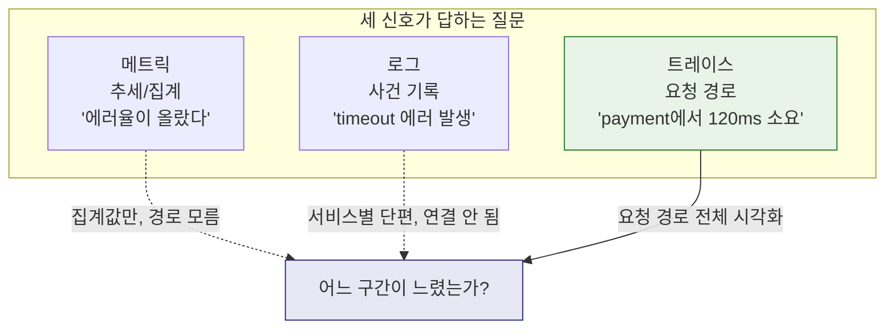
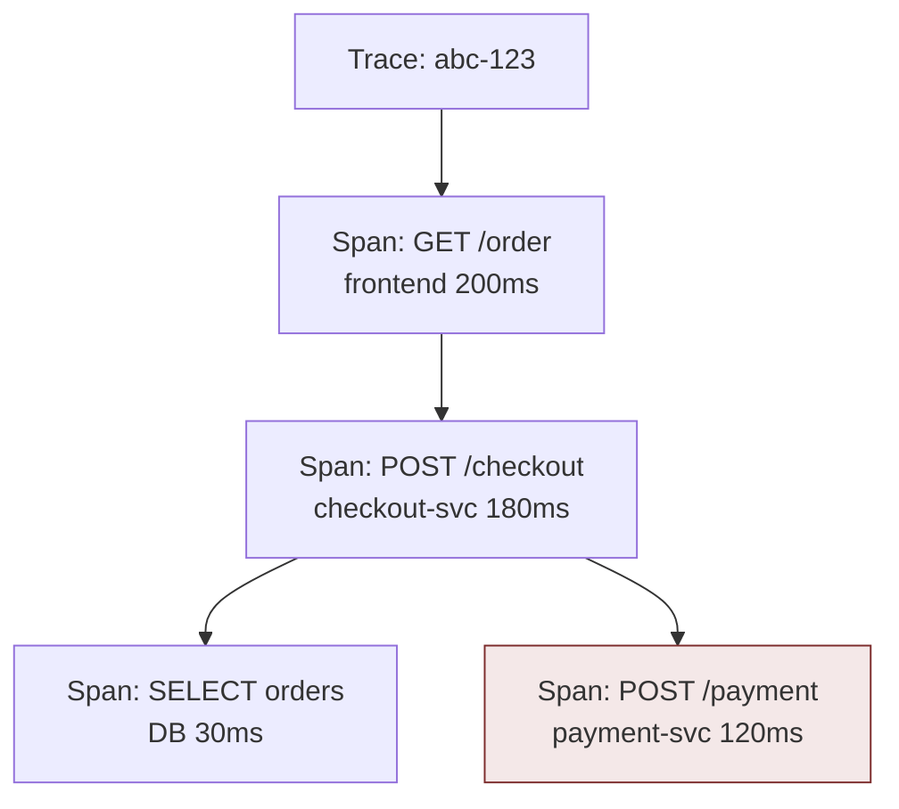
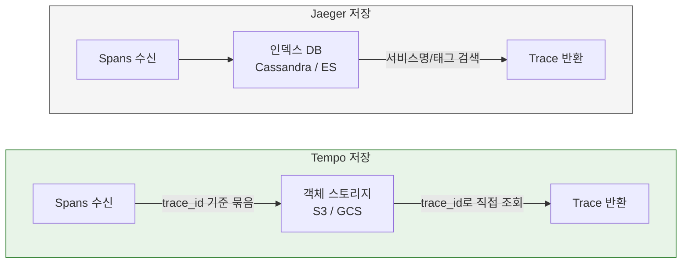
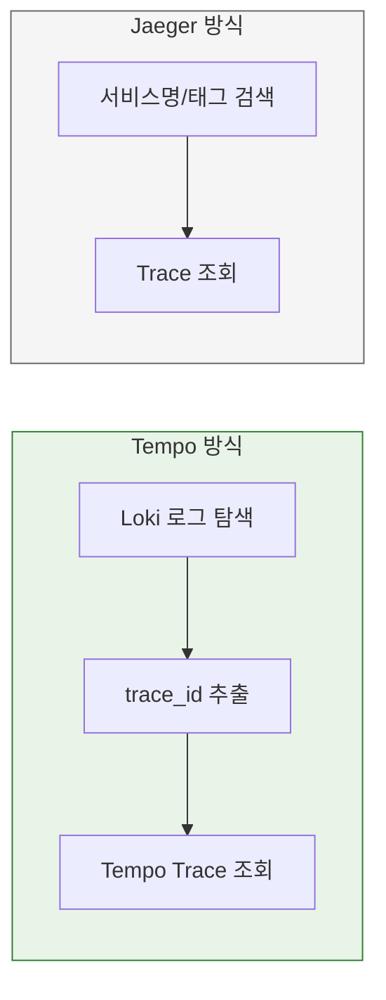
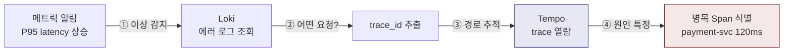

# Ch05. Grafana Tempo

**핵심 질문**: "Tempo는 Jaeger와 비교해 어떤 운영 철학을 가지는가?"

---

## 1. 로그와 메트릭만으로는 부족한 순간

메트릭은 추세를 보여 준다. "지난 5분간 에러율이 3%에서 15%로 올랐다"는 사실은 메트릭이 잘 알려 준다. 로그는 사건을 기록한다. "checkout 서비스에서 timeout 에러가 발생했다"는 사실은 로그가 잘 알려 준다.

그런데 분산 시스템에서 진짜 어려운 질문은 이것들이다.

- 어느 서비스 호출이 느렸는가?
- 전체 요청 시간 중 DB 쿼리가 얼마를 차지했는가?
- 어디서 retry가 반복되었는가?
- 에러가 발생한 서비스는 어디이고, 그 에러를 유발한 upstream은 어디인가?

이 질문에 답하려면 **하나의 요청이 여러 서비스를 거치면서 남긴 흔적**을 이어 붙여야 한다. 메트릭은 집계된 숫자이므로 개별 요청 경로를 보여 주지 못하고, 로그는 서비스별로 흩어져 있으므로 하나의 요청 흐름으로 엮기 어렵다.



이 문제를 해결하는 것이 **분산 트레이싱**이고, 트레이스를 저장하고 조회하는 백엔드가 필요하다. Grafana Tempo가 바로 그 역할을 한다.

---

## 2. Tempo란 무엇인가

Grafana Tempo는 **분산 트레이스 저장 및 조회 백엔드**다.

애플리케이션이 생성한 span들을 trace 단위로 저장하고, 운영자가 요청 흐름을 따라가며 병목과 에러의 원인을 분석할 수 있게 한다. Tempo의 핵심 설계 철학은 한 문장으로 요약된다.

> "trace 검색을 trace 백엔드 혼자 책임지지 않고, Observability 스택 전체가 협력한다."

Jaeger 같은 전통적 trace 백엔드는 span 속성을 자체 인덱싱해서 독립적으로 검색을 지원한다. Tempo는 이 접근을 의도적으로 버렸다. 대신 "로그나 메트릭에서 trace_id를 찾아 Tempo로 건너가는" 탐색 흐름을 전제한다. 인덱싱을 하지 않으므로 저장 비용이 낮고 운영이 단순하지만, Loki나 메트릭과의 연동 없이 Tempo만 단독으로 쓰면 탐색이 제한적이다.

이 설계는 Loki의 "라벨만 인덱싱한다"는 철학과 같은 맥락이다. Grafana 스택 전체가 "인덱싱을 최소화하고, 비용과 운영 단순성을 택한다"는 일관된 방향을 공유한다.

---

## 3. 핵심 개념: Span, Trace, Attributes

### Span

Span은 하나의 작업 단위를 표현한다. HTTP 요청 처리, DB 쿼리 실행, 외부 API 호출 같은 개별 동작이 각각 하나의 span이 된다.

모든 span에는 시작 시간, 종료 시간, 상태(OK/ERROR), 부모 span ID가 포함된다. 부모-자식 관계가 있기 때문에 "이 HTTP 요청 안에서 어떤 DB 쿼리가 실행됐고 얼마나 걸렸는가"를 정확히 추적할 수 있다.

### Trace

Trace는 하나의 요청이 여러 서비스를 거치면서 만들어진 span들의 집합이다. 모든 span이 같은 `trace_id`를 공유하므로, 분산된 서비스들의 동작을 하나의 요청 흐름으로 묶어 볼 수 있다.



위 예시에서 전체 요청은 200ms가 걸렸고, payment 호출이 120ms로 가장 큰 비중을 차지한다. 이런 시각화가 Tempo의 핵심 가치다. 메트릭이 "느려졌다"고 알려 주면, 트레이스는 "정확히 어디서 느려졌다"를 보여 준다.

### Attributes

Span에 붙는 키-값 속성이다. 속성이 풍부할수록 탐색이 쉬워진다.

| 종류 | 예시 | 용도 |
|------|------|------|
| HTTP | `http.method`, `http.status_code`, `http.route` | 요청 종류와 결과 필터링 |
| DB | `db.system`, `db.statement` | 느린 쿼리 식별 |
| Resource | `service.name`, `deployment.environment` | 서비스/환경별 필터 |

Attribute 설계는 라벨 설계와 비슷한 고민이 있다. 너무 적으면 탐색이 어렵고, 너무 많으면 저장 비용이 늘어난다. 실무에서는 OpenTelemetry의 Semantic Conventions에 정의된 표준 속성을 따르는 것이 권장된다.

---

## 4. Tempo의 내부 구조

### 저장 전략: 인덱싱 없는 trace 저장

Tempo가 Jaeger와 결정적으로 다른 점은 **span 속성을 인덱싱하지 않는다**는 것이다.

Jaeger는 Cassandra나 Elasticsearch에 span을 저장하면서 서비스명, 태그, 시간 등을 인덱싱한다. 덕분에 "checkout 서비스에서 최근 에러 trace를 보여 줘" 같은 독립적 검색이 가능하다. 하지만 이 인덱스를 유지하는 비용이 크고, 인덱스 DB(Cassandra, ES) 자체의 운영 부담이 따른다.

Tempo는 trace를 객체 스토리지(S3, GCS, Azure Blob)에 직접 저장한다. 인덱스 없이 trace_id를 키로 조회하는 방식이다. 인덱싱 비용이 없으므로 저장 단가가 낮고, 객체 스토리지의 내구성과 확장성을 그대로 활용할 수 있다.



### TraceQL: 인덱스 없이도 탐색하는 방법

"인덱스가 없으면 trace_id를 모를 때 어떻게 찾는가?"라는 질문이 자연스럽게 따라온다. Tempo 2.0부터 GA로 제공되는 **TraceQL**이 이 문제를 해결한다.

```traceql
{ span.http.status_code >= 500 && duration > 1s }
```

이 쿼리는 "HTTP 500 이상 에러가 발생했고 1초 이상 걸린 span이 포함된 trace"를 찾는다. TraceQL은 저장된 trace 데이터를 스캔하면서 조건에 맞는 trace를 반환한다. 전문 인덱스가 아니라 스캔 기반이므로 대량 데이터에서는 Jaeger의 인덱스 검색보다 느릴 수 있지만, trace_id를 모르는 상태에서도 탐색이 가능하다.

```traceql
{ resource.service.name = "checkout" && span.db.system = "postgresql" && duration > 200ms }
```

이 쿼리는 "checkout 서비스에서 PostgreSQL 쿼리가 200ms 이상 걸린 경우"를 찾는다. SQL이 테이블을 탐색하듯, TraceQL은 span 속성을 기반으로 trace를 탐색한다.

실무에서는 TraceQL 단독 탐색보다, Loki에서 에러 로그를 먼저 찾고 → trace_id로 Tempo에 접근하는 흐름이 더 빠른 경우가 많다. TraceQL은 "trace_id를 모르지만 특정 조건의 trace를 찾고 싶을 때" 보완적으로 사용하는 도구다.

---

## 5. Jaeger와의 비교

Tempo와 Jaeger는 둘 다 trace 백엔드이지만 운영 철학이 다르다.

| 항목 | Jaeger | Tempo |
|------|--------|-------|
| 인덱싱 | span 속성을 인덱싱 | 인덱싱 없이 trace_id + TraceQL |
| 저장소 | Cassandra, Elasticsearch 등 | 객체 스토리지 (S3, GCS) |
| 운영 복잡도 | 인덱스 DB 관리 필요 | 객체 스토리지만으로 운영 |
| 독립 검색 | 서비스명/태그로 바로 검색 가능 | Loki/메트릭 연동 탐색 전제 |
| UI | Jaeger UI (독립) | Grafana Explore 내장 |
| 비용 | 인덱스 + 저장소 비용 | 객체 스토리지 비용만 |



**Jaeger의 강점**은 독립적 검색이다. trace 백엔드만으로도 서비스명이나 태그로 trace를 찾을 수 있으므로, 다른 도구와의 연동 없이도 사용 가능하다. 대신 인덱스 DB를 운영해야 하므로 비용과 복잡도가 높다.

**Tempo의 강점**은 비용과 단순성이다. 객체 스토리지에 trace를 던져 놓기만 하면 되므로 운영 부담이 적다. 대신 Loki나 메트릭과 연결되지 않으면 탐색 경험이 제한적이다.

어느 쪽이 나은가는 "이미 Grafana 스택을 쓰는가?"에 크게 좌우된다. LGTM 스택을 운영 중이라면 Tempo가 자연스럽고, 독립적인 trace 검색이 핵심 요구사항이라면 Jaeger가 더 적합하다.

---

## 6. Tempo가 해결한 것

### trace 저장 비용 절감

인덱싱이 없으므로 저장 비용이 trace 데이터의 크기에만 비례한다. 객체 스토리지의 저렴한 단가를 활용할 수 있어서, 대량 trace를 장기간 보관하는 것이 경제적으로 가능해진다.

### trace 백엔드 운영 단순화

Cassandra나 Elasticsearch 클러스터를 운영하지 않아도 된다. Tempo는 단일 바이너리로 실행할 수 있고, 상태(state)를 객체 스토리지에 위임하므로 Tempo 프로세스 자체는 상태 없는(stateless)에 가깝다.

### Grafana 스택 내 상관분석

Grafana에서 로그 → trace, 메트릭 → trace 전환이 클릭 한 번으로 가능하다. Loki 로그에서 `trace_id`를 클릭하면 Tempo의 trace 뷰가 열리고, Prometheus 메트릭의 exemplar에서 trace로 직접 이동할 수 있다. 이 상관분석 경험이 Tempo의 핵심 가치이며, 이것은 Jaeger UI에서는 제공되지 않는 Grafana 스택 고유의 이점이다.

---

## 7. 어떤 환경에 적합하고, 어디서 한계가 있는가

### Tempo가 강한 환경

**Grafana 스택 사용자.** Loki + Prometheus/Mimir + Grafana를 이미 쓰고 있다면, Tempo를 추가하면 로그-메트릭-트레이스 3개 신호의 상관분석이 완성된다. 도구 통합의 가치가 극대화되는 환경이다.

**비용 민감한 대규모 환경.** trace 볼륨이 크지만 예산이 제한적인 경우, Jaeger + Elasticsearch 조합보다 Tempo + 객체 스토리지가 비용 효율적이다.

**trace 검색보다 trace 열람이 주된 사용 패턴.** 실무에서 trace를 보는 패턴의 대부분은 "이 trace_id의 경로를 보여 줘"다. 서비스명으로 trace를 검색하는 빈도가 낮다면, 인덱싱 없는 Tempo로 충분하다.

### Tempo가 맞지 않는 환경

**독립적 trace 검색이 핵심.** "특정 서비스의 최근 느린 trace를 찾아 줘" 같은 검색을 trace 백엔드 단독으로 자주 해야 한다면, Jaeger의 인덱스 기반 검색이 더 빠르고 편리하다. TraceQL이 이 격차를 줄이고 있지만, 인덱스 기반 검색의 즉시성과는 차이가 있다.

**비-Grafana 환경.** Tempo의 핵심 가치인 상관분석은 Grafana UI에서 제공된다. Datadog이나 Elastic APM 등 다른 Observability 플랫폼을 주력으로 쓴다면 Tempo의 이점이 줄어든다.

---

## 8. Observability 스택에서 Tempo의 위치

Tempo는 단독 도구가 아니라 **탐색 흐름의 연결 고리**로 이해해야 한다.



주문 서비스가 느려졌다고 가정해 보자.

1. **메트릭**: P95 latency가 200ms에서 2s로 상승했다는 알림이 온다
2. **로그**: Loki에서 해당 시간대의 에러를 조회하면 "payment-svc timeout" 로그가 보인다
3. **트레이스**: 로그에서 trace_id를 클릭해 Tempo에서 열면, payment-svc 외부 API 호출이 전체 요청 시간의 70%를 차지하고 있음을 확인한다

메트릭이 "어딘가 이상하다"를 알려 주고, 로그가 "무슨 일인지"를 설명하고, 트레이스가 "정확히 어디서"를 보여 주는 구조다. 이 세 신호가 trace_id로 연결되지 않으면 각각을 따로 봐야 하므로 장애 분석 시간이 길어진다. Tempo의 존재 이유는 이 연결의 마지막 조각을 채우는 것이다.

---

## 9. 설치 스펙과 배포 시 고려사항

### 적정 리소스

Tempo는 인덱싱이 없으므로 다른 trace 백엔드(Jaeger+ES)보다 리소스를 적게 쓴다. 단, 수신 throughput과 쿼리 빈도에 따라 달라진다.

| 환경 | vCPU | RAM | 디스크 | 비고 |
|------|------|-----|--------|------|
| 로컬/학습 (단일 바이너리) | 0.5 | 512MB | 1GB (로컬 파일시스템) | Docker Compose에서 충분 |
| 소규모 팀 (일 100만 span 이하) | 1 | 1~2GB | 객체 스토리지 | 단일 인스턴스로 운영 가능 |
| 중규모 (일 1,000만 span) | 2~4 | 4~8GB | 객체 스토리지 | 마이크로서비스 모드 고려 시작 |
| 대규모 (일 1억+ span) | 8+ | 16GB+ | 객체 스토리지 | 마이크로서비스 모드 필수 |

RAM이 중요한 이유는 Tempo가 수신한 span을 WAL(Write-Ahead Log)에 버퍼링한 뒤 블록으로 묶어서 객체 스토리지에 flush하기 때문이다. 수신량이 많으면 WAL 버퍼가 커지고 RAM 사용이 올라간다. TraceQL 쿼리도 스캔 기반이므로 동시 쿼리가 많으면 메모리를 더 잡아먹는다.

### Docker Compose 배포 시 고려사항

```yaml
# docker-compose.yml 예시
services:
  tempo:
    image: grafana/tempo:2.7.0
    command: ["-config.file=/etc/tempo/tempo.yaml"]
    volumes:
      - ./tempo.yaml:/etc/tempo/tempo.yaml:ro
      - tempo-data:/var/tempo        # WAL + 블록 저장
    ports:
      - "3200:3200"    # HTTP API (Grafana 연결)
      - "4317:4317"    # OTLP gRPC 수신
      - "4318:4318"    # OTLP HTTP 수신
    deploy:
      resources:
        limits:
          memory: 512M   # 학습 환경 기준
```

**주의할 점:**

| 항목 | 설명 |
|------|------|
| **볼륨 마운트 필수** | `/var/tempo`를 볼륨으로 잡지 않으면 컨테이너 재시작 시 WAL과 미전송 블록이 사라진다. 로컬 학습이라도 named volume을 쓰는 것이 안전하다 |
| **포트 충돌** | 4317/4318은 OTel Collector(Alloy)와 겹치기 쉽다. Alloy가 앞단에서 OTLP를 수신하고 Tempo로 전달하는 구조라면, 앱 → Alloy(4317) → Tempo(다른 포트 또는 내부 네트워크)로 분리해야 한다 |
| **로컬 저장소 vs 객체 스토리지** | Docker Compose에서는 `local` 백엔드(로컬 파일시스템)가 적합하다. S3/GCS는 프로덕션용이며 로컬 학습에서는 불필요한 복잡성만 추가한다 |
| **Alloy와의 관계** | Tempo는 OTLP를 직접 수신할 수 있지만, Alloy를 앞에 두면 노이즈 필터링, 샘플링, 라우팅을 분리할 수 있다. 학습에서는 직접 수신도 충분하고, 프로덕션에서는 Alloy 경유가 권장된다 |

### Kubernetes 배포 시 고려사항

K8s에서는 Helm chart로 배포하는 것이 표준이다. Grafana 공식 `tempo-distributed` chart와 `tempo` (단일 바이너리) chart 두 가지가 있다.

```bash
# 단일 바이너리 (소규모)
helm install tempo grafana/tempo --namespace monitoring

# 마이크로서비스 모드 (중규모 이상)
helm install tempo grafana/tempo-distributed --namespace monitoring
```

| 항목 | 설명 |
|------|------|
| **단일 바이너리 vs 마이크로서비스** | 일 100만 span 이하는 단일 바이너리로 충분하다. 그 이상이면 distributor, ingester, querier, compactor가 분리되는 마이크로서비스 모드가 필요하다 |
| **객체 스토리지 연결** | K8s에서는 로컬 파일시스템 대신 S3/GCS/MinIO를 백엔드로 설정한다. Pod이 재스케줄링되어도 데이터가 유지된다 |
| **PVC vs 객체 스토리지** | WAL용 PVC는 여전히 필요하다. 객체 스토리지는 완성된 블록의 장기 저장용이고, WAL은 수신 중인 span의 임시 버퍼이므로 빠른 로컬 디스크(PVC)에 둬야 한다 |
| **리소스 요청/제한** | `requests`를 넉넉히 잡아야 OOM kill을 피한다. WAL flush 중 메모리 스파이크가 발생할 수 있으므로 `limits`는 `requests`의 1.5~2배로 설정한다 |
| **Ingress 노출** | Tempo의 3200 포트(HTTP API)를 Grafana가 접근할 수 있으면 되므로 외부 Ingress는 불필요하다. 클러스터 내부 Service로 충분하다 |
| **네임스페이스 분리** | 모니터링 컴포넌트(Tempo, Loki, Prometheus, Grafana)는 앱과 별도 네임스페이스(예: `monitoring`, `rp-mgm`)에 배치하여 리소스 격리와 RBAC 분리를 한다 |

### 최소 설정 파일 (로컬 학습용)

```yaml
# tempo.yaml
stream_over_http_enabled: true
server:
  http_listen_port: 3200

distributor:
  receivers:
    otlp:
      protocols:
        grpc:
          endpoint: "0.0.0.0:4317"
        http:
          endpoint: "0.0.0.0:4318"

storage:
  trace:
    backend: local
    wal:
      path: /var/tempo/wal
    local:
      path: /var/tempo/blocks

metrics_generator:
  storage:
    path: /var/tempo/generator/wal
  traces_storage:
    path: /var/tempo/generator/traces
```

이 설정만으로 Tempo가 OTLP를 수신하고 로컬에 저장한다. 프로덕션에서는 `backend: s3` 또는 `backend: gcs`로 교체하고, compaction, retention, replication 설정을 추가한다.

---

## 10. 면접에서 설명한다면

### "Tempo가 무엇인가요?"

Grafana Tempo는 분산 시스템의 요청 흐름을 trace와 span 단위로 저장하고 조회하는 백엔드입니다. span 속성을 인덱싱하지 않고 객체 스토리지에 직접 저장하는 방식으로, 저장 비용을 낮추고 운영을 단순화합니다.

### "Jaeger와 뭐가 다른가요?"

가장 큰 차이는 인덱싱 전략입니다. Jaeger는 span 속성을 인덱싱해서 독립적 검색을 지원하지만 인덱스 DB 운영 비용이 따릅니다. Tempo는 인덱싱 없이 객체 스토리지에 저장하므로 비용과 운영이 단순한 대신, Loki나 메트릭과 연동해서 trace_id를 먼저 찾는 탐색 흐름을 전제합니다. Grafana 스택을 이미 쓴다면 Tempo가 자연스럽고, trace 독립 검색이 핵심이면 Jaeger가 더 적합합니다.

### "왜 로그나 메트릭만으로는 부족한가요?"

메트릭은 집계된 숫자이므로 개별 요청 경로를 보여 주지 못하고, 로그는 서비스별로 흩어져 있어 하나의 요청으로 엮기 어렵습니다. "전체 요청 중 어느 구간이 느렸는가"라는 질문에 답하려면, 하나의 요청이 여러 서비스를 거친 경로를 trace로 기록하고 시각화해야 합니다.

### "TraceQL은 어떤 문제를 푸는 건가요?"

trace_id를 모르는 상태에서 특정 조건의 trace를 찾는 문제를 풉니다. 인덱스 없이 span 속성 기반 스캔으로 동작하므로, 대량 데이터에서는 인덱스 검색보다 느릴 수 있지만, 로그에서 trace_id를 찾지 못했을 때 보완적 탐색 수단으로 유용합니다.
